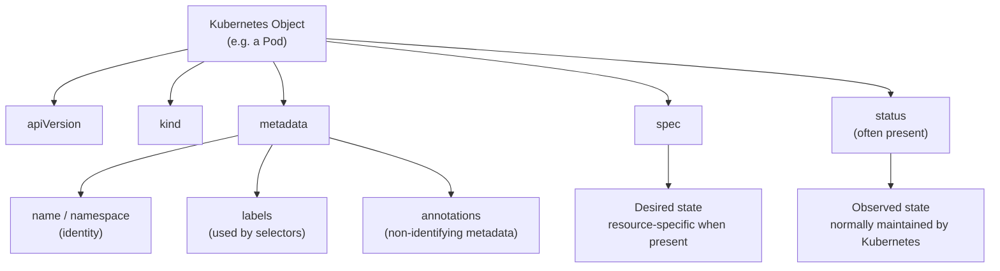
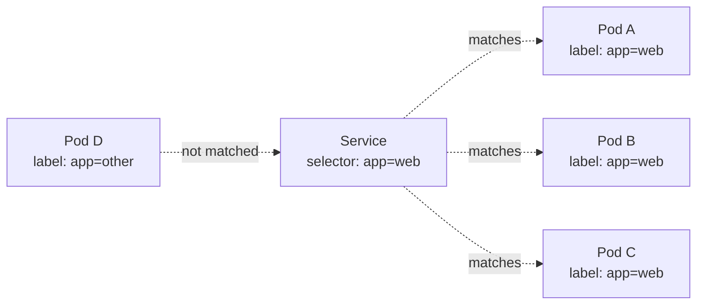
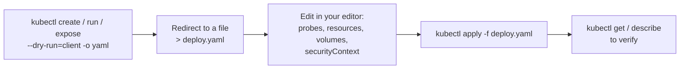

# Chapter 0 — Foundations

> **Target environment:** Kubernetes 1.35. Commands and API examples should be interpreted against the target cluster's served API surface.

Not a scored domain by itself, but every scored domain depends on this. Move fast through it if it's already muscle memory — but don't skip it, because every troubleshooting habit in later chapters assumes you're fluent in the object model, `kubectl explain`, and fast YAML generation covered here.

**⏱ Estimated time:** 30–45 minutes (10–15 minutes if this is already muscle memory from prior Kubernetes experience).

## Learning Objectives

By the end of this chapter, you should be able to:

- Explain the core structure of Kubernetes objects (`apiVersion`, `kind`, `metadata`, `spec`) and understand how `status` is generally server-populated observed state.
- Switch between namespaces confidently and recognize why namespace mistakes can cause avoidable exam errors.
- Use labels and selectors to understand how Kubernetes objects reference each other without hard-coded links.
- Look up any field name or nesting instantly with `kubectl explain`, without needing external documentation.
- Read a Pod manifest fluently and identify where a new field belongs.
- Generate a working YAML skeleton in seconds using `--dry-run=client -o yaml`, instead of writing it from a blank file.

---

## 0.1 Core Concepts 🔴 MUST KNOW

**What it is.** Most Kubernetes resource manifests use the common top-level fields `apiVersion`, `kind`, and `metadata`, and many also have a `spec` containing desired configuration. `status`, when present, represents observed state and is normally populated by Kubernetes controllers or other system components rather than authored as the desired configuration. Not every resource has a `spec` — for example, a ConfigMap uses `data` and a Secret uses `data`/`stringData`. Namespaces scope names and namespaced resources within a cluster. Labels are key/value tags; selectors match objects based on labels. This is the vocabulary the entire exam is written in.

**Why CKAD tests it.** Every single task starts with "create/modify a `<kind>` with these properties" — if you're not fluent in reading and writing the object model, every other skill is slower.

**Real-world why.** Labels and selectors are how Kubernetes wires objects together loosely. A Service selects Pods by label rather than storing specific Pod identities; the EndpointSlice controller watches Services and Pods and maintains the backend endpoint state. That decoupling lets you scale, replace, and reschedule Pods without reconfiguring the Service.

### The common Kubernetes object envelope

Before diving into namespaces and labels individually, it helps to see the common top-level structure. Most resources have `apiVersion`, `kind`, and `metadata`; many also have a `spec` for desired configuration and a `status` for observed state. Resource-specific top-level fields can also exist, such as `data` on a ConfigMap or `data`/`stringData` on a Secret. `spec` is the part you normally configure; `status`, when present, is normally maintained by Kubernetes.



**📚 Theory.** The `spec`/`status` split is central to Kubernetes' control-loop design: controllers compare desired and observed state and act when they differ. When you `kubectl apply` a Deployment asking for 3 replicas, you declare `spec.replicas: 3`; the Deployment controller later updates status fields to report what is actually running. For resources without a `spec`, such as ConfigMaps, their top-level fields differ — use the resource schema rather than forcing the generic Pod/Deployment shape onto them.

### Namespaces

```bash
kubectl get namespaces
kubectl create namespace dev
kubectl config set-context --current --namespace=dev   # switch default namespace
kubectl get pods -n dev
kubectl get pods -A                                     # all namespaces
```

🔴 **One of the easiest ways to lose time or affect the wrong resource is working in the wrong namespace.** Read every task for its namespace requirement before you type anything.

**Context vs. namespace flag.** Two ways to interact with namespaces:

```bash
kubectl get pods -n checkout              # affects only this command
kubectl config set-context --current --namespace=checkout  # changes default for this context
kubectl config current-context            # shows active context
```

The `-n` flag is temporary and command-specific. `config set-context --namespace=...` persists in your kubeconfig until explicitly changed — which is why the namespace-context mistake is easy to make and hard to detect.

> **🌍 Illustrative scenario.** Imagine a fintech platform with namespaces `payments`, `payments-staging`, and `payments-canary` on the *same* cluster, all running a Deployment named `api`. An engineer intends to delete a broken canary but their terminal's default context is `payments` (production) — because `kubectl config set-context` was run months earlier and never revisited. Production goes down. The lesson: namespace context is persistent and often invisible. The defensive habit: shell prompts that display the current namespace via `kubectl config view --minify -o jsonpath='{..namespace}'`, and always verify the active context before executing commands. On the exam, the equivalent discipline is running `kubectl config get-contexts` and checking the task's namespace requirement before your first keystroke.

> **📚 Theory.** Namespaces provide logical and API-resource scoping, but they do not by themselves enforce network isolation or access control. Pods in different namespaces can still share nodes and communicate unless you apply controls such as RBAC, NetworkPolicy, and resource quotas where appropriate. This is why "put it in its own namespace" is not, by itself, a complete security boundary.

**🟡 Common mistake:** assuming a namespace switch (`set-context`) is temporary. It persists in your kubeconfig until you change it again — the fintech incident above happened *months* after the switch was made, which is exactly why it went unnoticed.

---

## 🧪 Practice — Namespace and Working Context

**Context note:** Unless otherwise stated, subsequent Chapter 0 exercises assume the `checkout` namespace is the active namespace (via `kubectl config set-context --current --namespace=checkout`). Verify your active context and namespace before beginning each task.

### Task

Create a namespace named `checkout`. Set your current kubectl context so that namespace `checkout` is used by default.

Then create a Pod named `probe` in the `checkout` namespace using image `busybox:1.36`. The Pod must run the command `sleep 3600` so that it remains running.

### Requirements

- Namespace: `checkout`
- Pod name: `probe`
- Image: `busybox:1.36`
- Container command: `sleep 3600`
- The Pod must be created in namespace `checkout`.
- Your current kubectl context must use `checkout` as its default namespace.

### Success Criteria

- `checkout` exists.
- `probe` is `Running` in `checkout`.
- A subsequent `kubectl get pods` without `-n checkout` lists `probe`.

### Suggested Time

**5 minutes**

<details>
<summary>💡 Hint</summary>

Set the current context namespace before creating the Pod. Remember that a namespace set in the kubeconfig persists until you change it. When overriding the image command with `kubectl run`, use `--command -- sleep 3600`.  Use `kubectl config current-context` to confirm the active context before you begin.

</details>

<details>
<summary>✅ Solution</summary>

```bash
kubectl create namespace checkout
kubectl config set-context --current --namespace=checkout
kubectl run probe --image=busybox:1.36 --command -- sleep 3600
# `--command --` tells kubectl to treat `sleep 3600` as the container command/entrypoint rather than arguments to the image's default command.
kubectl get pods
```

Verify:

```bash
kubectl get namespace checkout
kubectl get pod probe
```

</details>

### Labels and selectors

```bash
kubectl get pods --show-labels
kubectl get pods -l app=nginx
kubectl get pods -l 'env in (prod,staging)'
kubectl label pod mypod tier=frontend
kubectl label pod mypod tier=frontend --overwrite
kubectl label pod mypod tier-                           # remove a label
```

```yaml
selector:
  matchLabels:
    app: nginx
```

The diagram below is the mental model to hold onto for the rest of the guide: labels identify and tag resources; selectors identify resources based on their labels. Services use selectors to identify backend Pods. Deployments use selectors to identify the Pods belonging to the Deployment. NetworkPolicies use `podSelector` and `namespaceSelector` to define policy targets and peers.



**Why this matters in practice:** if Pod B crashes and is replaced by a brand-new Pod (new name, new IP), the Service does not need a Pod-specific update — the replacement gets the same `app: web` label from the Deployment template, and the EndpointSlice controller updates the backend endpoints. A selector/label mismatch is also a common cause of a "Service has no endpoints" problem (Ch. 4), so compare the selector with the actual Pod labels exactly.

---

## 🧪 Practice — Labels and Selectors

### Task

In the `checkout` namespace, create two Pods:

- `web-1` using image `nginx:1.27`
- `api-1` using image `nginx:1.27`

Label `web-1` with `app=web` and `api-1` with `app=api`.

Then retrieve only the Pod labeled `app=web` using a label selector.

### Requirements

- Namespace: `checkout`
- Pod `web-1`: image `nginx:1.27`, label `app=web`
- Pod `api-1`: image `nginx:1.27`, label `app=api`
- Use a label selector to retrieve only `web-1`.

### Success Criteria

The selector query returns `web-1` and does not return `api-1`.

### Suggested Time

**5 minutes**

<details>
<summary>💡 Hint</summary>

The selector syntax is `key=value`. You can inspect the labels first with `--show-labels`.

</details>

<details>
<summary>✅ Solution</summary>

```bash
kubectl run web-1 --image=nginx:1.27
kubectl run api-1 --image=nginx:1.27
kubectl label pod web-1 app=web
kubectl label pod api-1 app=api
kubectl get pods --show-labels
kubectl get pods -l app=web
```

The final selector returns only `web-1`.

</details>

### kubectl explain — cluster-native API schema reference

```bash
kubectl explain pod
kubectl explain pod.spec.containers
kubectl explain pod.spec.containers.livenessProbe --recursive
kubectl explain deployment.spec.strategy
```

🔴 `kubectl explain <kind>.<path>` retrieves schema documentation from the API server and is useful for discovering field names, nesting, types, and supported values. Use it when you cannot remember exact YAML structure.

> **🌍 Illustrative scenario.** You're asked to add a toleration so a Pod can run on GPU-tainted nodes, but you can't recall whether `tolerations` uses `effect` or `Effect`, or whether the operator field is `operator` or `op`. Running `kubectl explain pod.spec.tolerations --recursive` shows the field names, types, and supported values from the cluster's published API schema.

> **📚 Theory.** `kubectl explain` retrieves resource documentation from the API server's published OpenAPI schema. It is particularly useful for checking field paths and types against the API surface exposed by the cluster, including installed CRDs. The exact detail available for a CRD depends on the schema that CRD publishes.

---

## 🧪 Practice — Discover a Field with `kubectl explain`

### Task

You need to add a `restartPolicy` field to a Pod manifest, but you do not remember where the field belongs.

Use `kubectl explain` to determine where `restartPolicy` is defined in the Pod specification and inspect its valid values.

Do not use external documentation.

### Requirements

- Use `kubectl explain`.
- Find the location of `restartPolicy`.
- Display enough detail to identify its valid values.
- Do not create or modify a cluster resource.

### Success Criteria

You can identify the field path as `pod.spec.restartPolicy` and identify valid values including `Always`, `OnFailure`, and `Never`.

### Suggested Time

**3 minutes**

<details>
<summary>💡 Hint</summary>

Start with `kubectl explain pod.spec.restartPolicy` and use `--recursive` if you need more detail.

</details>

<details>
<summary>✅ Solution</summary>

```bash
kubectl explain pod.spec.restartPolicy
kubectl explain pod.spec.restartPolicy --recursive
```

The field is under `pod.spec`, and the output shows its supported values.

</details>

### Inspecting and understanding resources

```bash
kubectl api-resources                     # every kind, short names, whether namespaced
kubectl api-resources --namespaced=true
kubectl get all -n dev                    # common workload and service resources
kubectl get pod mypod -o yaml
kubectl get pod mypod -o json
```

#### Quick-reference: the four commands you'll run constantly

| Command | Answers the question | When to reach for it |
|---|---|---|
| `kubectl get <kind>` | "What exists, and is it healthy at a glance?" | Useful first check for many tasks |
| `kubectl describe <kind> <name>` | "Why is this in the state it's in?" | Events often identify the immediate cause |
| `kubectl explain <path>` | "What field do I need, and how is it nested?" | Whenever you're unsure of exact YAML structure |
| `kubectl get <kind> -o yaml` | "What is the full, actual current state?" | Confirming a change took effect, or copying a base for editing |

---

## 🧪 Practice — Inspect an Existing Resource

### Task

Using the `checkout` namespace, inspect Pod `web-1`.

Determine:
1. Its full YAML representation.
2. Its current labels.
3. Its Pod IP.

Do not edit the Pod.

### Requirements

- Inspect `web-1` in namespace `checkout`.
- Retrieve the full resource as YAML.
- Display its labels.
- Extract its Pod IP without manually searching through the entire YAML output.
- Do not modify the resource.

### Success Criteria

You can produce the Pod YAML, display its labels, and obtain the Pod IP from the API output.

### Suggested Time

**5 minutes**

<details>
<summary>💡 Hint</summary>

`kubectl get` supports different output formats. JSONPath can extract one specific field from the resource.

</details>

<details>
<summary>✅ Solution</summary>

```bash
kubectl get pod web-1 -n checkout -o yaml
kubectl get pod web-1 -n checkout --show-labels
kubectl get pod web-1 -n checkout -o jsonpath='{.status.podIP}'
```

</details>

## 0.2 YAML Mastery 🔴 MUST KNOW

For common workload types, you can often generate a useful YAML starting point with `--dry-run=client -o yaml` and edit the pieces that matter (see Chapter 6). But you must be able to **read** any manifest fluently and know where to add a field.

### Anatomy of a Pod manifest — the fields you must recognize instantly

```yaml
apiVersion: v1
kind: Pod
metadata:
  name: web
  namespace: dev
  labels:
    app: web
  annotations:
    owner: team-checkout
spec:
  containers:
  - name: web
    image: nginx:1.27
    command: ["/bin/sh", "-c"]
    args: ["nginx -g 'daemon off;'"]
    ports:
    - containerPort: 80
    env:
    - name: MODE
      value: "production"
    envFrom:
    - configMapRef:
        name: web-config
    resources:
      requests:
        cpu: "100m"
        memory: "128Mi"
      limits:
        cpu: "250m"
        memory: "256Mi"
    volumeMounts:
    - name: cache
      mountPath: /var/cache
    livenessProbe:
      httpGet:
        path: /healthz
        port: 80
      initialDelaySeconds: 10
      periodSeconds: 10
  initContainers:
  - name: init-perms
    image: busybox
    command: ["sh", "-c", "chmod -R 777 /var/cache"]
    volumeMounts:
    - name: cache
      mountPath: /var/cache
  volumes:
  - name: cache
    emptyDir: {}
```

### Field-by-field quick reference

| Field | Lives under | Purpose |
|---|---|---|
| `apiVersion` / `kind` | top level | which API and object type |
| `metadata.name/namespace` | top level | identity |
| `metadata.labels` | top level | tags used by selectors |
| `metadata.annotations` | top level | non-identifying metadata (tooling, docs, config) |
| `spec.containers[].image` | Pod spec | container image reference |
| `spec.containers[].command`/`args` | Pod spec | override `ENTRYPOINT`/`CMD` |
| `spec.containers[].env`/`envFrom` | Pod spec | environment variable sources |
| `spec.containers[].resources` | Pod spec | requests/limits |
| `spec.containers[].volumeMounts` | Pod spec | where a volume appears inside a container |
| `spec.volumes` | Pod spec | volume sources (must match a `volumeMounts.name`) |
| `spec.initContainers` | Pod spec | run-to-completion containers before main containers start |
| `spec.containers[].livenessProbe/readinessProbe/startupProbe` | Pod spec | health checks |
| `spec.containers[].securityContext` | container | per-container security settings |
| `spec.securityContext` | Pod spec | pod-wide security settings (e.g. `fsGroup`) |

🟡 **Common YAML mistakes:**
- Indentation errors — YAML is whitespace-sensitive; a misaligned `-` silently changes structure.
- `volumeMounts.name` must match a declared `volumes.name`; otherwise the Pod is rejected or cannot start, depending on the invalid configuration. Check API errors and Events.
- Putting `env` at the Pod level instead of inside a specific container.
- Confusing `command` (overrides `ENTRYPOINT`) with `args` (overrides `CMD`) — see Chapter 3.
- Forgetting `selector.matchLabels` on a Deployment must be a subset of `template.metadata.labels`, or the object is rejected outright.

### Generating YAML fast — the core exam technique

The workflow below is the single highest-leverage habit in this entire guide. Almost every scored task starts here.



```bash
kubectl create deployment web --image=nginx --dry-run=client -o yaml > deploy.yaml
kubectl run web --image=nginx --dry-run=client -o yaml > pod.yaml
kubectl expose deployment web --port=80 --dry-run=client -o yaml > svc.yaml
```

🔴 **Prefer generating a manifest skeleton when an imperative command can produce most of what you need, then edit the missing fields.** This is often faster than hand-authoring, especially for Pods, Deployments, and Services. However, hand-authoring is sometimes clearer or faster for complex resources like NetworkPolicies, security policies, and configurations where generation doesn't save much effort.

> **🌍 Illustrative scenario.** Platform teams building internal scaffolding tools (e.g., an internal `myco create-service` CLI) essentially automate this workflow: generate a baseline Deployment + Service + ConfigMap via `--dry-run=client -o yaml`, then programmatically layer in the org's required probes, resource limits, and security context defaults before committing to a Git repo for GitOps. Treating `--dry-run=client -o yaml` as your personal scaffolding generator during the exam mirrors exactly how production platform tooling is built.

---

## 🧪 Chapter Challenge — Generate → Edit → Apply → Verify

### Task

Create a Deployment named `web` in the `checkout` namespace using image `nginx:1.27` with 2 replicas.

Generate the initial Deployment YAML using `kubectl` rather than writing the manifest from an empty file.

Before applying it, inspect/edit the generated manifest so that:
- the Deployment has the label `app=web`;
- the Pod template has the label `app=web`;
- the container exposes port `80`.

The generated Deployment may already contain the standard `app=web` selector/template labels; preserve them if present and add only anything that is missing.

Apply the manifest and verify that 2 Pods are running and that the Deployment's Pod selector matches the Pod template label.

### Requirements

- Namespace: `checkout`
- Deployment name: `web`
- Replicas: `2`
- Container image: `nginx:1.27`
- Deployment label: `app=web`
- Pod template label: `app=web`
- Container port: `80`
- Generate the initial YAML with `--dry-run=client -o yaml`.
- Apply the resulting YAML.
- Verify the Deployment and its Pods.

### Success Criteria

- Deployment `web` exists in `checkout`.
- Desired replicas: 2.
- Two Pods are created by the Deployment.
- The Pods have label `app=web`.
- The Deployment selector matches `app=web`.
- The container specification contains `containerPort: 80`.

### Suggested Time

**8–10 minutes**

<details>
<summary>💡 Hint</summary>

Use `kubectl create deployment` with `--dry-run=client -o yaml` to generate the starting point. The fields you need to verify or add belong under `metadata`, `spec.template.metadata`, and `spec.template.spec.containers`.

</details>

<details>
<summary>✅ Solution</summary>

Generate the starting manifest:

```bash
kubectl create deployment web \
  --image=nginx:1.27 \
  --replicas=2 \
  --dry-run=client -o yaml > web.yaml
```

Inspect/edit `web.yaml` so the relevant structure includes (keep any correctly generated labels):

```yaml
metadata:
  name: web
  namespace: checkout
  labels:
    app: web
spec:
  replicas: 2
  selector:
    matchLabels:
      app: web
  template:
    metadata:
      labels:
        app: web
    spec:
      containers:
      - name: nginx
        image: nginx:1.27
        ports:
        - containerPort: 80
```

Apply and verify:

```bash
kubectl apply -f web.yaml
kubectl get deployment web
kubectl get pods -l app=web
kubectl get deployment web -o yaml
```

</details>

## Exam Tips — Chapter 0

- Confirm the namespace before touching anything; re-check it if the task changes namespace mid-scenario.
- Set `alias k=kubectl` and, when useful, `export do="--dry-run=client -o yaml"` early; avoid memorizing a force-delete shortcut you might use accidentally.
- If you don't remember a field name or nesting, `kubectl explain <path> --recursive` beats searching docs almost every time.
- Read the entire task before editing anything — multi-part tasks often specify a namespace, a name, and a verification step in different sentences.

> **Command override reminder:** `kubectl run ... --command -- sleep 3600` tells `kubectl run` to pass `sleep 3600` as the container command/entrypoint. Without `--command`, arguments after `--` are treated as arguments to the image's existing entrypoint.

## Chapter Summary

| Concept | One-line takeaway |
|---|---|
| Object model | Common resource envelope = `apiVersion` + `kind` + `metadata`, often with resource-specific `spec`/data fields; `status` is generally observed state |
| Namespaces | Logical partition only — always verify which one you're in |
| Labels/selectors | Resources are tagged with labels; selectors match resources based on labels; controllers use selectors where their API supports them |
| `kubectl explain` | Cluster-native API schema reference reflecting your cluster's version and installed CRDs |
| YAML generation | Generate with `--dry-run=client -o yaml`, then hand-edit missing fields; hand-author when generation isn't faster |

**Next:** Chapter 1 — Application Environment, Configuration and Security, the heaviest-weighted domain on the exam (25%), builds directly on the object model and `kubectl explain` fluency from this chapter.
\newpage
