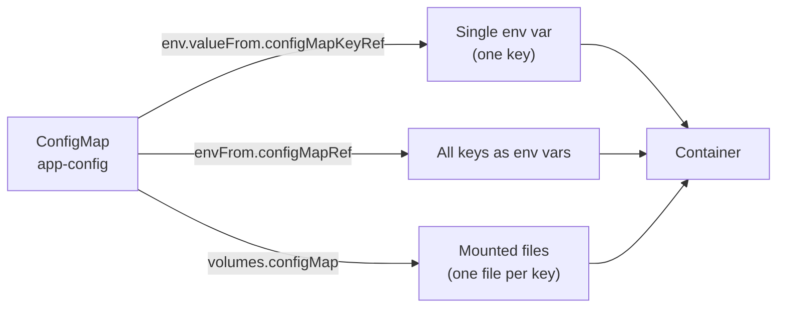
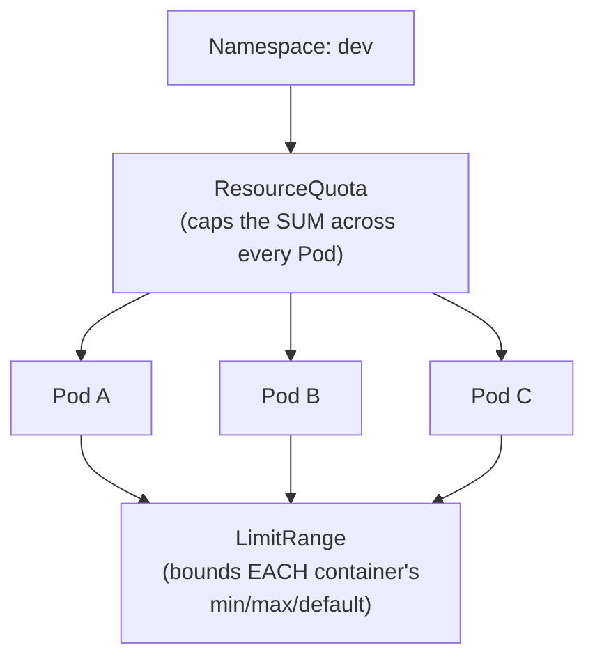
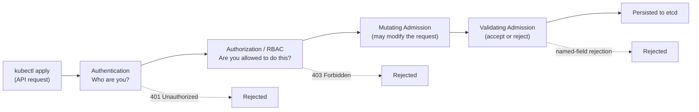
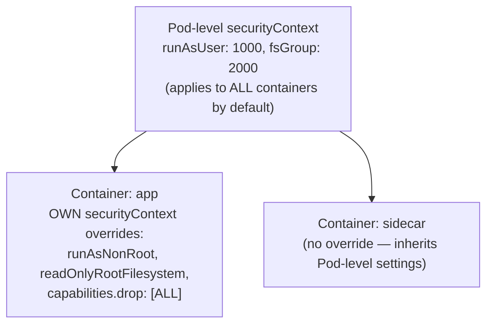
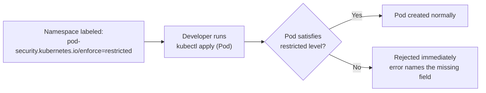

# Chapter 1 — Application Environment, Configuration and Security (25%)


**⏱ Estimated time:** 3–4 hours across all nine topics below (this is the largest chapter in the guide — plan more than one sitting).

## Learning Objectives

By the end of this chapter, you should be able to:

- Externalize application configuration using ConfigMaps and Secrets, and consume them as env vars, `envFrom`, or mounted volumes.
- Explain why a running Pod doesn't pick up a ConfigMap/Secret change automatically, and know which fix (restart vs. wait) applies to each consumption method.
- Use the Downward API to expose a Pod's own metadata without any API server calls or RBAC permissions.
- Set CPU/memory `requests` and `limits` correctly, and diagnose whether a failure is a scheduling problem, an OOM kill, or CPU throttling.
- Explain the difference between ResourceQuota (namespace-wide) and LimitRange (per-container), and predict which one rejects a given Pod.
- Create a ServiceAccount, bind it to a Pod, and scope its API permissions with a Role/RoleBinding.
- Read an RBAC rule and determine exactly what it does and does not permit — including the `pods` vs `pods/log` vs `pods/exec` distinction.
- Harden a Pod's `securityContext` to run as non-root, drop Linux capabilities, and use a read-only root filesystem.
- Explain how Pod Security Admission enforces a security baseline at the namespace level, independent of any individual Pod spec.
- Recognize when a task involves a CRD/Operator and interact with a custom resource the same way you would a built-in one.

### Choosing the right mechanism — a quick decision guide

Several topics in this chapter solve a similar-sounding problem ("get information into or about a Pod"). Before diving in, it helps to see how they differ:

| I need to... | Use | Section |
|---|---|---|
| Store non-sensitive config, reusable across Pods | ConfigMap | 1.1 |
| Store sensitive config (passwords, tokens, certs) | Secret | 1.2 |
| Expose a Pod's *own* name/namespace/IP/resources to itself | Downward API | 1.3 |
| Control how much CPU/memory a container can use | `resources.requests` / `resources.limits` | 1.4 |
| Cap total resource usage across a namespace | ResourceQuota | 1.4 |
| Set per-container min/max/default resource values | LimitRange | 1.4 |
| Give a Pod an identity to call the Kubernetes API | ServiceAccount | 1.5 |
| Scope what that identity is allowed to do | Role / RoleBinding (RBAC) | 1.6 |
| Control root access, capabilities, filesystem permissions | `securityContext` | 1.7 |
| Enforce a security baseline for every Pod in a namespace | Pod Security Admission | 1.8 |
| Use a database/queue/cert-manager style resource | CRD + Operator | 1.9 |

## 1.1 ConfigMaps 🔴 MUST KNOW

**What it is.** A ConfigMap stores non-sensitive configuration data as key/value pairs, consumable by Pods as environment variables, command-line arguments, or mounted files.

**Why CKAD tests it.** Separating configuration from the container image is the core 12-factor app principle — CKAD verifies you can wire that separation correctly from three different directions (env var, envFrom, volume).

**Real-world why.** The same image should run in dev, staging, and prod — only the ConfigMap changes between environments, not the image.

**Imperative:**
```bash
kubectl create configmap app-config --from-literal=MODE=prod --from-literal=LOG_LEVEL=info
kubectl create configmap app-config --from-file=app.properties
kubectl create configmap app-config --from-env-file=config.env
kubectl get configmap app-config -o yaml
```

**Declarative:**
```yaml
apiVersion: v1
kind: ConfigMap
metadata:
  name: app-config
data:
  MODE: "prod"
  LOG_LEVEL: "info"
  app.properties: |
    retries=3
    timeout=30
```

**Consuming it — three ways:**
```yaml

---
```

## 🧪 Practice — ConfigMap Consumption and Update

### Task

In the `checkout` namespace, create a ConfigMap named `app-config` containing:

- `APP_MODE=production`
- `LOG_LEVEL=info`

Create a Pod named `config-demo` using image `busybox:1.36`. The container must remain running with `sleep 3600`.

Configure the Pod so that:
- `APP_MODE` is available as an environment variable from the ConfigMap.
- The complete ConfigMap is also mounted as files at `/etc/app-config`.

After the Pod is running, change `LOG_LEVEL` in the ConfigMap from `info` to `debug`.

### Requirements

- Namespace: `checkout`
- ConfigMap: `app-config`
- Keys: `APP_MODE`, `LOG_LEVEL`
- Initial values: `production`, `info`
- Pod: `config-demo`
- Image: `busybox:1.36`
- Command: `sleep 3600`
- ConfigMap consumed once through an environment variable and once as a mounted volume.
- ConfigMap volume mount path: `/etc/app-config`
- Update `LOG_LEVEL` to `debug` after the Pod is running.

### Success Criteria

- `config-demo` is Running.
- `APP_MODE` is available inside the container with value `production`.
- `/etc/app-config/LOG_LEVEL` eventually contains `debug`.
- The learner can explain why the environment-variable value does not change in the already-running container while the mounted file can update.

### Suggested Time

**8–10 minutes**

<details>
<summary>💡 Hint</summary>

Use `env.valueFrom.configMapKeyRef` for one key and a ConfigMap volume for the complete object. Environment variables are populated when the container starts; mounted ConfigMap data is handled differently.

</details>

<details>
<summary>✅ Solution</summary>

```bash
kubectl create namespace checkout
kubectl create configmap app-config \
  --from-literal=APP_MODE=production \
  --from-literal=LOG_LEVEL=info \
  -n checkout
```

Create the Pod from a manifest. A declarative manifest should include:

```yaml
apiVersion: v1
kind: Pod
metadata:
  name: config-demo
  namespace: checkout
spec:
  containers:
  - name: app
    image: busybox:1.36
    command: ["sleep", "3600"]
    env:
    - name: APP_MODE
      valueFrom:
        configMapKeyRef:
          name: app-config
          key: APP_MODE
    volumeMounts:
    - name: config
      mountPath: /etc/app-config
  volumes:
  - name: config
    configMap:
      name: app-config
```

Apply the manifest, then update the ConfigMap:

```bash
kubectl apply -f config-demo.yaml
kubectl create configmap app-config \
  --from-literal=APP_MODE=production \
  --from-literal=LOG_LEVEL=debug \
  -n checkout \
  --dry-run=client -o yaml | kubectl apply -f -
```

Verify:

```bash
kubectl exec -n checkout config-demo -- printenv APP_MODE
kubectl exec -n checkout config-demo -- cat /etc/app-config/LOG_LEVEL
```

</details>

# 1. Single env var
```yaml
env:
- name: MODE
  valueFrom:
    configMapKeyRef:
      name: app-config
      key: MODE
---
# 2. All keys as env vars
envFrom:
- configMapRef:
    name: app-config
---
# 3. Mounted as files (each key becomes a file)
volumes:
- name: config-vol
  configMap:
    name: app-config
containers:
- volumeMounts:
  - name: config-vol
    mountPath: /etc/config
```

The three consumption paths above all pull from the *same* ConfigMap — the choice depends only on how the application expects to receive its configuration:



**Verify:**
```bash
kubectl exec mypod -- env | grep MODE
kubectl exec mypod -- cat /etc/config/app.properties
kubectl describe pod mypod       # check "Mounts" and "Environment" sections
```

**Troubleshoot:**

| Problem | Likely cause | Diagnostic | Fix |
|---|---|---|---|
| Pod stuck `CreateContainerConfigError` | ConfigMap key referenced doesn't exist, or ConfigMap not created yet | `kubectl describe pod` -> Events | Fix key name or create the ConfigMap first |
| Env var missing inside container | Wrong ConfigMap name, or `envFrom` vs `env` misused | `kubectl exec -- env`, `kubectl describe pod` | Correct the reference |
| File not appearing at mount path | `volumeMounts.name` doesn't match `volumes.name` | `kubectl describe pod` -> Volumes/Mounts | Align the names |
| Updated ConfigMap not reflected | Env-var-based config doesn't hot-reload; only mounted-file config eventually syncs (with delay) | n/a | Restart the Pod/Deployment (`kubectl rollout restart`) to pick up new values |

🟡 **Exam tip:** Env-var ConfigMap changes never propagate to a running Pod — a rollout restart is required. Mounted ConfigMap files *do* eventually sync (kubelet sync period), but for the exam, assume you should restart the workload after any config change and verify.

> **🌍 Real-world example.** An e-commerce checkout service runs identical container images across `us-east`, `eu-west`, and `ap-south` regions, but each region needs a different `PAYMENT_GATEWAY_URL` and `CURRENCY_DEFAULT`. Rather than baking region-specific values into three separate images (which then need three separate CI pipelines and three sets of vulnerability scans), each region gets its own ConfigMap with identical keys and different values, mounted into the *same* image. This is the practical payoff of the 12-factor "config in the environment" principle: one artifact, promoted unchanged from staging to production, with only the ConfigMap changing at each stage.

> **📚 Theory.** ConfigMaps solve the general problem of separating an application's *code* (which should be immutable and versioned) from its *configuration* (which varies by deployment target and changes independently of code releases). This separation is what makes an image "promotable" — the exact same tested artifact moves through environments unchanged, which is a foundational assumption behind CI/CD pipelines and immutable infrastructure.

---

## 1.2 Secrets 🔴 MUST KNOW

**What it is.** Like a ConfigMap, but intended for sensitive data (passwords, tokens, certs). Values are base64-encoded (not encrypted at rest by default — encoding, not encryption).

**Why CKAD tests it.** Same delivery mechanisms as ConfigMaps, but candidates must know the encode/decode step and the specialized Secret types.

**Real-world why.** Keeps credentials out of images and out of plain-text manifests committed to git (though a Secret checked into git is still just base64 — treat it as sensitive).

**Imperative:**
```bash
kubectl create secret generic db-creds --from-literal=username=admin --from-literal=password=S3cr3t
kubectl create secret generic tls-secret --from-file=tls.crt --from-file=tls.key
kubectl create secret tls my-tls --cert=tls.crt --key=tls.key
kubectl create secret docker-registry regcred \
  --docker-server=registry.example.com \
  --docker-username=user --docker-password=pass --docker-email=a@b.com
```

**Declarative:**
```yaml
apiVersion: v1
kind: Secret
metadata:
  name: db-creds
type: Opaque
data:
  username: YWRtaW4=          # echo -n admin | base64
  password: UzNjcjN0
```

**Encode/decode:**
```bash
echo -n 'admin' | base64          # encode
echo -n 'YWRtaW4=' | base64 -d    # decode
```

**Consuming it:**
```yaml
env:
- name: DB_PASSWORD
  valueFrom:
    secretKeyRef:
      name: db-creds
      key: password
---
envFrom:
- secretRef:
    name: db-creds
---
volumes:
- name: secret-vol
  secret:
    secretName: db-creds
```

**Using an image-pull secret:**
```yaml
spec:
  imagePullSecrets:
  - name: regcred
```

**Verify:**
```bash
kubectl get secret db-creds -o jsonpath='{.data.password}' | base64 -d
kubectl exec mypod -- env | grep DB_PASSWORD
```

**Troubleshoot:**

| Problem | Likely cause | Fix |
|---|---|---|
| `ImagePullBackOff` from a private registry | Missing/wrong `imagePullSecrets` | Create correct `docker-registry` secret, reference it in Pod spec |
| `CreateContainerConfigError` | Secret or key doesn't exist | `kubectl describe pod`, check exact key names |
| Base64 confusion | Wrote raw text under `data:` instead of encoding it | Use `stringData:` for plain text — Kubernetes encodes it for you |

🟡 **`stringData` shortcut** — skip manual base64 entirely:
```yaml
apiVersion: v1
kind: Secret
metadata:
  name: db-creds
stringData:
  password: S3cr3t
```

> **🌍 Real-world example.** A team migrating a legacy app to Kubernetes initially committed a Secret manifest straight into their GitHub repo, reasoning "it's a Secret object, it's protected." Six months later a security audit found the base64-encoded database password sitting in plain sight in the Git history — base64 is an *encoding*, not encryption, and anyone with repo access (or a clone of an old commit) could decode it with one command. The team's fix was standard now: Secrets are never committed to git at all; instead they're created at deploy time from a secrets manager (e.g., HashiCorp Vault or a cloud provider's secret store) via an external-secrets operator, or the manifest is encrypted at rest with a tool like `sealed-secrets` before it's safe to commit.

> **📚 Theory.** By default, Secret data is stored in etcd as base64 — readable by anyone with etcd access or sufficient RBAC to `get` the Secret object. Real confidentiality requires layering on: encryption at rest for etcd (a cluster-admin concern, not developer-facing on the exam), RBAC restricting who can read Secret objects (Ch. 1.6), and often an external secrets backend. Understanding that "Secret" describes an API *shape*, not a security *guarantee*, is what separates surface-level and production-grade Kubernetes knowledge.

---

---

## 🧪 Practice — Secret Injection

### Task

In namespace `checkout`, create a Secret named `db-credentials` containing:

- `username=appuser`
- `password=S3cr3tPass!`

Create a Pod named `secret-demo` using `busybox:1.36` and keep it running with `sleep 3600`.

Expose the Secret values inside the container as environment variables named `DB_USER` and `DB_PASSWORD`.

### Requirements

- Namespace: `checkout`
- Secret: `db-credentials`
- Secret keys: `username`, `password`
- Values: `appuser`, `S3cr3tPass!`
- Pod: `secret-demo`
- Image: `busybox:1.36`
- Command: `sleep 3600`
- Environment variables must be named `DB_USER` and `DB_PASSWORD`.
- Do not place the password directly in the Pod's `env.value`.

### Success Criteria

Inside `secret-demo`:
- `DB_USER` contains `appuser`.
- `DB_PASSWORD` contains `S3cr3tPass!`.
- The Pod specification references the Secret rather than embedding the password as a plain environment value.

### Suggested Time

**5–7 minutes**

<details>
<summary>💡 Hint</summary>

Create the Secret imperatively if you want to avoid manually encoding the values. For the Pod, use `secretKeyRef` for each environment variable.

</details>

<details>
<summary>✅ Solution</summary>

```bash
kubectl create secret generic db-credentials \
  --from-literal=username=appuser \
  --from-literal=password='S3cr3tPass!' \
  -n checkout
```

Create/apply the Pod with:

```yaml
apiVersion: v1
kind: Pod
metadata:
  name: secret-demo
  namespace: checkout
spec:
  containers:
  - name: app
    image: busybox:1.36
    command: ["sleep", "3600"]
    env:
    - name: DB_USER
      valueFrom:
        secretKeyRef:
          name: db-credentials
          key: username
    - name: DB_PASSWORD
      valueFrom:
        secretKeyRef:
          name: db-credentials
          key: password
```

Verify:

```bash
kubectl exec -n checkout secret-demo -- printenv DB_USER
kubectl exec -n checkout secret-demo -- printenv DB_PASSWORD
kubectl get secret db-credentials -n checkout -o yaml
```

</details>

## 1.3 Downward API 🟡 SHOULD KNOW

**What it is.** A mechanism for exposing a Pod's *own* metadata (name, namespace, labels, annotations, IP) or a container's *own* resource requests/limits to itself, as environment variables or a mounted file — without hardcoding anything or calling the API server.

**Why CKAD tests it.** It's the standard way an app introspects its own runtime environment (which node it's on, its own Pod name for logging/tracing) without needing API permissions at all.

**Real-world why.** A logging or tracing library often wants to tag every log line with the Pod name and namespace — reading that from the Downward API is free and requires no RBAC, unlike querying the API server.

**Env vars — `fieldRef` (Pod metadata) and `resourceFieldRef` (container resources):**
```yaml
env:
- name: POD_NAME
  valueFrom:
    fieldRef:
      fieldPath: metadata.name
- name: POD_NAMESPACE
  valueFrom:
    fieldRef:
      fieldPath: metadata.namespace
- name: POD_IP
  valueFrom:
    fieldRef:
      fieldPath: status.podIP
- name: NODE_NAME
  valueFrom:
    fieldRef:
      fieldPath: spec.nodeName
- name: CPU_LIMIT
  valueFrom:
    resourceFieldRef:
      containerName: app
      resource: limits.cpu
```

**Volume form — `downwardAPI`, one file per field:**
```yaml
volumes:
- name: pod-info
  downwardAPI:
    items:
    - path: "labels"
      fieldRef:
        fieldPath: metadata.labels
    - path: "cpu_limit"
      resourceFieldRef:
        containerName: app
        resource: limits.cpu
containers:
- name: app
  volumeMounts:
  - name: pod-info
    mountPath: /etc/podinfo
```

**Verify:**
```bash
kubectl exec mypod -- env | grep POD_NAME
kubectl exec mypod -- cat /etc/podinfo/labels
```

**Troubleshoot:**

| Problem | Cause | Fix |
|---|---|---|
| `fieldPath` rejected at apply time | Not every field is valid via `fieldRef` — only a fixed allow-list (name, namespace, labels, annotations, podIP, nodeName, serviceAccountName, status.hostIP etc.) | Check the field is on the supported list; use `resourceFieldRef` for resource fields instead |
| Value is stale after a label update | Env-var form is set once at container start, like any other env var | Mounted-file form updates live; use it if the value must track changes without a restart |

🟡 **Exam tip:** if a task says "the Pod must know its own name/namespace/IP without calling the API," that's Downward API, not a ServiceAccount token.

> **🌍 Real-world example.** Observability platforms like Datadog, Prometheus, and OpenTelemetry all lean on the Downward API by convention — their standard sidecar/agent setup injects `POD_NAME`, `POD_NAMESPACE`, and `NODE_NAME` as env vars precisely so that every metric or trace emitted by an application can be automatically tagged with exactly which replica produced it, with zero application code changes and zero API server permissions required. If you've ever seen a Grafana dashboard broken down "by pod," the Downward API is almost always how that label got there.

---

---

## 🧪 Practice — Downward API

### Task

Create a Pod named `identity-demo` in namespace `checkout` using image `busybox:1.36`.

The container must remain running with `sleep 3600`.

Expose the following Pod metadata as environment variables:

- Pod name → `MY_POD_NAME`
- Namespace → `MY_NAMESPACE`
- Pod IP → `MY_POD_IP`

Do not hard-code these values.

### Requirements

- Namespace: `checkout`
- Pod: `identity-demo`
- Image: `busybox:1.36`
- Command: `sleep 3600`
- Use the Downward API.
- `MY_POD_NAME` must come from `metadata.name`.
- `MY_NAMESPACE` must come from `metadata.namespace`.
- `MY_POD_IP` must come from `status.podIP`.

### Success Criteria

Running `printenv` for the three variables returns the Pod's actual name, namespace, and assigned Pod IP.

### Suggested Time

**5 minutes**

<details>
<summary>💡 Hint</summary>

Pod metadata uses `fieldRef`. The Pod IP is a status field rather than metadata.

</details>

<details>
<summary>✅ Solution</summary>

```yaml
apiVersion: v1
kind: Pod
metadata:
  name: identity-demo
  namespace: checkout
spec:
  containers:
  - name: app
    image: busybox:1.36
    command: ["sleep", "3600"]
    env:
    - name: MY_POD_NAME
      valueFrom:
        fieldRef:
          fieldPath: metadata.name
    - name: MY_NAMESPACE
      valueFrom:
        fieldRef:
          fieldPath: metadata.namespace
    - name: MY_POD_IP
      valueFrom:
        fieldRef:
          fieldPath: status.podIP
```

Verify:

```bash
kubectl apply -f identity-demo.yaml
kubectl exec -n checkout identity-demo -- printenv MY_POD_NAME MY_NAMESPACE MY_POD_IP
```

</details>

## 1.4 Resource Requests, Limits, and Quotas 🔴 MUST KNOW

**What it is.** `requests` tell the scheduler how much CPU/memory a container needs to be placed on a node; `limits` cap what it can consume. `LimitRange` sets defaults/bounds per container in a namespace; `ResourceQuota` caps the total consumption across a namespace.

**Why CKAD tests it.** Application developers are expected to right-size their own workloads and understand namespace-level guardrails set by platform teams.

**Real-world why.** Under-requesting causes noisy-neighbor contention; over-limiting CPU throttles your app even when the node is idle; hitting a namespace quota blocks new Pods entirely until something is fixed.

**Imperative / generate then edit:**
```bash
kubectl run web --image=nginx --dry-run=client -o yaml > pod.yaml

---
```

## 🧪 Practice — Requests, Limits, LimitRange, and Quota

### Task

Create namespace `resource-demo`.

In that namespace:

1. Create a LimitRange named `container-defaults` that sets a default memory limit of `256Mi` for containers that do not specify one.
2. Create a ResourceQuota named `team-quota` that allows a maximum of `2` Pods.
3. Create a Pod named `worker` using `busybox:1.36` with command `sleep 3600`.
4. Set the Pod's container memory request to `64Mi` and memory limit to `128Mi`.
5. Create a second Pod named `worker-2` with the same resource settings.
6. Attempt to create a third Pod named `worker-3` with the same resource settings and investigate the result.

### Requirements

- Namespace: `resource-demo`
- LimitRange: `container-defaults`
- Default memory limit: `256Mi`
- ResourceQuota: `team-quota`
- Maximum Pods: `2`
- Pod memory request: `64Mi`
- Pod memory limit: `128Mi`
- Image: `busybox:1.36`
- Command: `sleep 3600`

### Success Criteria

- `worker` and `worker-2` are running.
- The namespace reports a Pod quota of `2`.
- `worker-3` is rejected because the Pod quota is exhausted.
- The existing Pods have the requested `64Mi` / `128Mi` values.

### Suggested Time

**10 minutes**

<details>
<summary>💡 Hint</summary>

LimitRange and ResourceQuota are independent controls. Inspect the quota after creating the first two Pods and read the API error when the third is rejected.

</details>

<details>
<summary>✅ Solution</summary>

```bash
kubectl create namespace resource-demo

kubectl apply -f - <<'EOF'
apiVersion: v1
kind: LimitRange
metadata:
  name: container-defaults
  namespace: resource-demo
spec:
  limits:
  - type: Container
    default:
      memory: 256Mi
EOF

kubectl apply -f - <<'EOF'
apiVersion: v1
kind: ResourceQuota
metadata:
  name: team-quota
  namespace: resource-demo
spec:
  hard:
    pods: "2"
EOF
```

Create the Pods:

```yaml
apiVersion: v1
kind: Pod
metadata:
  name: worker
  namespace: resource-demo
spec:
  containers:
  - name: worker
    image: busybox:1.36
    command: ["sleep", "3600"]
    resources:
      requests:
        memory: 64Mi
      limits:
        memory: 128Mi
```

Create `worker-2` with the same specification and change only the name to `worker-2`.

Then attempt `worker-3` with the same specification. The API server should reject it because the quota allows only two Pods.

Verify:

```bash
kubectl get pods -n resource-demo
kubectl describe resourcequota team-quota -n resource-demo
kubectl get pod worker -n resource-demo -o jsonpath='{.spec.containers[0].resources}'
```

</details>

# then add:
```yaml
resources:
  requests:
    cpu: "100m"
    memory: "128Mi"
  limits:
    cpu: "500m"
    memory: "256Mi"
```

**LimitRange (namespace default/bounds):**
```yaml
apiVersion: v1
kind: LimitRange
metadata:
  name: cpu-limit-range
spec:
  limits:
  - default:
      cpu: 500m
    defaultRequest:
      cpu: 100m
    max:
      cpu: "1"
    min:
      cpu: 50m
    type: Container
```

**ResourceQuota (namespace-wide cap):**
```yaml
apiVersion: v1
kind: ResourceQuota
metadata:
  name: dev-quota
spec:
  hard:
    requests.cpu: "4"
    requests.memory: 4Gi
    limits.cpu: "8"
    limits.memory: 8Gi
    pods: "20"
```

**Verify:**
```bash
kubectl describe node <node> | grep -A5 "Allocated resources"
kubectl top pods
kubectl top nodes
kubectl describe resourcequota dev-quota -n dev
kubectl describe limitrange cpu-limit-range -n dev
```

**Troubleshoot:**

| Problem | Cause | Diagnostic | Fix |
|---|---|---|---|
| Pod `Pending`, event "Insufficient cpu/memory" | Cluster has no node with enough allocatable resource for the request | `kubectl describe pod` -> Events | Lower requests or free capacity |
| Pod killed with `OOMKilled` | Memory limit exceeded — memory is hard-capped | `kubectl describe pod` (Last State: OOMKilled), `kubectl get pod` | Raise memory limit or fix a leak |
| Container throttled but not killed | CPU limit reached — CPU is throttled, not killed | `kubectl top pod`, app latency symptoms | Raise CPU limit or optimize |
| Pod rejected outright, "exceeded quota" | `ResourceQuota` in namespace hit | `kubectl describe resourcequota` | Reduce request or ask for higher quota |
| Pod created with unexpected resources | `LimitRange` default applied because Pod spec had none | `kubectl describe limitrange` | Set the desired values explicitly |

🟡 **CPU vs memory failure modes are a favorite exam distinction:** CPU is *compressible* (throttled when limit hit); memory is *incompressible* (process is OOMKilled when limit hit). Know which symptom points to which resource.

### QoS classes — why requests/limits matter beyond scheduling

Every Pod is automatically assigned a Quality of Service class based on how its `requests`/`limits` are set. This class decides eviction order when a node runs low on memory.

| QoS Class | How it's assigned | Eviction priority |
|---|---|---|
| **Guaranteed** | Every container sets `requests == limits` for both CPU and memory | Evicted last — safest |
| **Burstable** | At least one container sets a request or limit, but not equal on all of them | Evicted after BestEffort, before Guaranteed |
| **BestEffort** | No requests or limits set on any container | Evicted first under node pressure |

```bash
kubectl get pod mypod -o jsonpath='{.status.qosClass}'
```

🟡 **Exam tip:** "make this workload evict last under memory pressure" or "make this Pod Guaranteed QoS" means setting `requests` exactly equal to `limits` on every container — nothing more exotic than that.

> **🌍 Real-world example.** A streaming video company once had their recommendation service silently OOMKilled every few hours in production, with no obvious pattern. The root cause: the team had copy-pasted `resources` from an older, lighter-weight service without adjusting for the new service's actual memory footprint under load — the memory *limit* was tighter than the real peak usage, so the kernel's OOM killer terminated the container every time traffic spiked, well before any alert fired on CPU. The fix was mundane but is the single highest-leverage habit in this section: run `kubectl top pod` under realistic load *before* setting limits, not after guessing.

> **📚 Theory.** The CPU-vs-memory distinction in the troubleshooting table isn't a Kubernetes quirk — it reflects a real Linux kernel difference. CPU time is a *compressible* resource: the kernel scheduler can simply give a process less CPU time per period (throttling) without killing anything. Memory is *incompressible* — once a process needs more memory than is available, there's no way to "slow down" a memory allocation; the kernel's OOM killer must terminate a process to reclaim space. This is precisely why CPU-limited containers get slow and memory-limited containers get killed, never the reverse.

### ResourceQuotas vs LimitRanges — Namespace-Level Constraints

**The distinction (often confused on exams):**

| Feature | ResourceQuota | LimitRange |
|---|---|---|
| **Scope** | *Aggregate* across entire namespace | *Per-Pod* or *per-container* defaults |
| **What it controls** | Total CPU/memory/storage the namespace can use | Min/max/default CPU/memory per container |
| **Effect of violation** | Pod rejected (namespace quota exhausted) | Pod rejected (violates min/max) or defaults applied |
| **Example** | "This namespace can use at most 10 CPUs total" | "Each container must request ≥100m CPU, default 500m if not specified" |

ResourceQuota and LimitRange operate at different scopes — think of ResourceQuota as the outer boundary for the whole namespace, and LimitRange as the rule every individual container inside it must follow:



A Pod can satisfy LimitRange (its own requests/limits are individually sane) and still be rejected by ResourceQuota if the namespace as a whole is already at capacity — the two checks are independent.

**ResourceQuota declarative:**
```yaml
apiVersion: v1
kind: ResourceQuota
metadata:
  name: dev-quota
  namespace: dev
spec:
  hard:
    requests.cpu: "10"           # total CPU requests across all Pods
    requests.memory: "20Gi"      # total memory requests
    limits.cpu: "20"             # total CPU limits
    limits.memory: "40Gi"        # total memory limits
    pods: "50"                   # max number of Pods
    requests.storage: "100Gi"    # total PVC storage
```

**LimitRange declarative:**
```yaml
apiVersion: v1
kind: LimitRange
metadata:
  name: dev-limits
  namespace: dev
spec:
  limits:
  - type: Container
    min:
      cpu: "100m"              # minimum CPU per container
      memory: "64Mi"           # minimum memory
    max:
      cpu: "2"                 # maximum CPU per container
      memory: "2Gi"            # maximum memory
    default:
      cpu: "500m"              # default CPU if not specified
      memory: "512Mi"          # default memory if not specified
    defaultRequest:
      cpu: "250m"              # default CPU request if not specified
      memory: "256Mi"          # default memory request if not specified
  - type: Pod
    min:
      cpu: "100m"              # minimum CPU across all containers in Pod
      memory: "64Mi"
    max:
      cpu: "4"                 # maximum CPU across all containers in Pod
      memory: "4Gi"
```

**Verify quotas and limits:**
```bash
kubectl get resourcequota -n dev
kubectl describe resourcequota dev-quota -n dev
kubectl get limitrange -n dev
kubectl describe limitrange dev-limits -n dev

# See how much quota is left
kubectl describe resourcequota dev-quota -n dev | grep -A 10 "Resource"
```

**Real exam pattern scenarios:**

1. **"Pod rejected, event says 'exceeded quota'"**
   - Cause: ResourceQuota hit (namespace total requests exceeded)
   - Fix: Lower individual Pod requests or request higher quota

2. **"Pod rejected, event says 'exceeds maximum'"**
   - Cause: LimitRange max violated (single container exceeds max)
   - Fix: Reduce container's CPU/memory limits

3. **"Pod accepted but has unexpected default values"**
   - Cause: LimitRange defaults applied because Pod didn't specify
   - Fix: Set explicit requests/limits in the Pod spec

🔴 **Exam tip:** If a task says "the namespace can only use 10 CPUs total," that's ResourceQuota. If it says "each container must be between 100m and 2 CPUs," that's LimitRange.

> **🌍 Real-world example.** A platform team has a shared cluster with three teams: frontend, backend, and data-processing. Without ResourceQuota, the data-processing team's single runaway Pod requesting 100 CPUs can starve the frontend and backend teams, taking down production. With ResourceQuota (`data-processing` namespace gets `hard: {requests.cpu: "20"}`), that runaway Pod is rejected outright, preventing cascade failure. Then LimitRange in each namespace sets sensible defaults so developers don't have to remember to set requests/limits on every single container — if they forget, the LimitRange defaults kick in, avoiding the Burstable QoS class and the risk of mid-workload eviction.

> **📚 Theory.** ResourceQuota enforces *namespace fairness* (prevent one team's runaway workload from starving others); LimitRange enforces *individual sanity* (prevent obviously-misconfigured Pods from consuming absurd resources). They work together: ResourceQuota is a coarse net (namespace-level), LimitRange is a fine net (container-level). A Pod can pass LimitRange (individual containers are sane) but still be rejected by ResourceQuota (namespace total exhausted) — these are independent gates.

---

## 1.5 ServiceAccounts 🔴 MUST KNOW

**What it is.** An identity Pods use to authenticate to the Kubernetes API. Every Pod runs as some ServiceAccount — `default` if none is specified.

**Why CKAD tests it.** Correctly scoping API access from application code (or explicitly disabling it) is now core to Environment/Config/Security.

**Real-world why.** An app that queries the Kubernetes API (a controller, an operator, a CI job) needs its own identity with only the permissions it needs — not the namespace default.

**Imperative:**
```bash
kubectl create serviceaccount app-sa
kubectl get serviceaccounts
kubectl describe sa app-sa
```

**Declarative — assigning to a Pod:**
```yaml
apiVersion: v1
kind: Pod
metadata:
  name: web
spec:
  serviceAccountName: app-sa
  automountServiceAccountToken: false   # disable API access if the app doesn't need it
  containers:
  - name: web
    image: nginx
```

**Verify:**
```bash
kubectl get pod web -o jsonpath='{.spec.serviceAccountName}'
kubectl exec web -- ls /var/run/secrets/kubernetes.io/serviceaccount
kubectl exec web -- cat /var/run/secrets/kubernetes.io/serviceaccount/token
```

**Troubleshoot:**

| Problem | Cause | Fix |
|---|---|---|
| App gets 403 calling the API | ServiceAccount lacks a Role/RoleBinding granting the verb/resource | Check with `kubectl auth can-i --as=system:serviceaccount:<ns>:<sa> get pods` |
| Token unexpectedly available in a Pod that shouldn't call the API | `automountServiceAccountToken` not disabled | Set `automountServiceAccountToken: false` at Pod or ServiceAccount level |

🟢 **Nice to know:** since Kubernetes 1.24+, ServiceAccount tokens are time-bound and projected, not stored as long-lived Secrets automatically — if you need a durable token you create it explicitly as a Secret of type `kubernetes.io/service-account-token`.

> **🌍 Real-world example.** A CI/CD runner (e.g., an Argo CD or Jenkins agent Pod running inside the cluster) needs to apply manifests to the cluster on every merge to `main`. Instead of embedding a cluster-admin kubeconfig as a CI secret — a single leaked credential away from full cluster compromise — the runner gets its own ServiceAccount scoped by a Role that can only create/update/delete Deployments, Services, and ConfigMaps in specific namespaces. If that CI Pod is ever compromised, the blast radius is bounded to exactly what its ServiceAccount can do, which is the entire point of least-privilege identity design.

---

---

## 🧪 Practice — ServiceAccount and Least-Privilege RBAC

### Task

In namespace `rbac-demo`, create a ServiceAccount named `pod-reader`.

Create a Role named `pod-read` that permits only:

- `get`
- `list`
- `watch`

on the core API resource `pods`.

Bind the Role to the `pod-reader` ServiceAccount.

Verify that the ServiceAccount can read Pods but cannot delete Pods.

### Requirements

- Namespace: `rbac-demo`
- ServiceAccount: `pod-reader`
- Role: `pod-read`
- Resource: `pods`
- API group: core (`""`)
- Allowed verbs: `get`, `list`, `watch`
- No `delete` permission.
- Use a Role and RoleBinding, not a ClusterRoleBinding.

### Success Criteria

These checks must produce:

- `get pods`: allowed
- `list pods`: allowed
- `delete pods`: denied

### Suggested Time

**8 minutes**

<details>
<summary>💡 Hint</summary>

The identity used with `kubectl auth can-i` is `system:serviceaccount:<namespace>:<serviceaccount>`. The permission check must use the same namespace as the Role.

</details>

<details>
<summary>✅ Solution</summary>

```bash
kubectl create namespace rbac-demo
kubectl create serviceaccount pod-reader -n rbac-demo
```

Create the Role and RoleBinding:

```yaml
apiVersion: rbac.authorization.k8s.io/v1
kind: Role
metadata:
  name: pod-read
  namespace: rbac-demo
rules:
- apiGroups: [""]
  resources: ["pods"]
  verbs: ["get", "list", "watch"]
---
apiVersion: rbac.authorization.k8s.io/v1
kind: RoleBinding
metadata:
  name: pod-read-binding
  namespace: rbac-demo
subjects:
- kind: ServiceAccount
  name: pod-reader
  namespace: rbac-demo
roleRef:
  kind: Role
  name: pod-read
  apiGroup: rbac.authorization.k8s.io
```

Verify:

```bash
kubectl auth can-i get pods \
  --as=system:serviceaccount:rbac-demo:pod-reader \
  -n rbac-demo

kubectl auth can-i list pods \
  --as=system:serviceaccount:rbac-demo:pod-reader \
  -n rbac-demo

kubectl auth can-i delete pods \
  --as=system:serviceaccount:rbac-demo:pod-reader \
  -n rbac-demo
```

The expected results are `yes`, `yes`, and `no`.

</details>

## 1.6 Authentication, Authorization, and Admission Control 🟡 SHOULD KNOW

**What it is.** RBAC (Role-Based Access Control) governs *what* an authenticated identity can do. Admission controllers intercept requests after auth to mutate or validate them before they're persisted.

**Why CKAD tests it.** Application developers regularly need to grant their own workloads narrowly-scoped permissions and diagnose "why can't my Pod's ServiceAccount do X" — full RBAC administration is CKA territory, but reading/writing basic Roles is now explicitly in CKAD's scope.

**Real-world why.** A CI/CD Pod that only needs to read Deployments shouldn't be able to delete Secrets cluster-wide.

**Imperative:**
```bash
kubectl create role pod-reader --verb=get,list,watch --resource=pods -n dev
kubectl create rolebinding read-pods --role=pod-reader --serviceaccount=dev:app-sa -n dev
kubectl create clusterrole node-reader --verb=get,list --resource=nodes
kubectl create clusterrolebinding read-nodes --clusterrole=node-reader --serviceaccount=dev:app-sa
```

**Declarative:**
```yaml
apiVersion: rbac.authorization.k8s.io/v1
kind: Role
metadata:
  namespace: dev
  name: pod-reader
rules:
- apiGroups: [""]
  resources: ["pods"]
  verbs: ["get", "list", "watch"]
---
apiVersion: rbac.authorization.k8s.io/v1
kind: RoleBinding
metadata:
  name: read-pods
  namespace: dev
subjects:
- kind: ServiceAccount
  name: app-sa
  namespace: dev
roleRef:
  kind: Role
  name: pod-reader
  apiGroup: rbac.authorization.k8s.io
```

**Verify:**
```bash
kubectl auth can-i get pods --as=system:serviceaccount:dev:app-sa -n dev
kubectl auth can-i delete secrets --as=system:serviceaccount:dev:app-sa -n dev
kubectl describe rolebinding read-pods -n dev
```

**Role vs ClusterRole/RoleBinding vs ClusterRoleBinding:**

| Object | Scope | When to use |
|---|---|---|
| `Role` | Permissions within one namespace | App that reads Pods only in its own namespace |
| `ClusterRole` | Permissions cluster-wide, or reusable across namespaces | Node reader, policy reporter, multi-namespace access |
| `RoleBinding` | Grants a Role (or ClusterRole) within one namespace | Bind a Role to app-sa; or bind ClusterRole for ns-scoped access |
| `ClusterRoleBinding` | Grants a ClusterRole cluster-wide | Give a user access to cluster-level resources globally |

🟡 **A ClusterRole bound via a RoleBinding grants those permissions only in that RoleBinding's namespace** — a common trick to reuse one ClusterRole definition across many namespaces without duplicating rules.

### RBAC Verbs and Resource Scoping — Critical Details

**Verbs** are actions on resources. Common ones:
- `get` — read a single resource by name
- `list` — enumerate resources (all in namespace/cluster)
- `watch` — stream changes to resources
- `create`, `update`, `patch`, `delete` — mutations
- `*` — all actions (rarely used; high-privilege)

**Resources** come in two forms:
- **Resource** (`pods`, `deployments`, `services`) — the thing itself
- **Subresource** (`pods/log`, `pods/exec`, `pods/status`) — a view of or action on the thing

A critical exam distinction:
```bash
# This rule allows read-only viewing of Pods' metadata
- apiGroups: [""]
  resources: ["pods"]
  verbs: ["get", "list", "watch"]

# This rule allows reading Pods' logs specifically
- apiGroups: [""]
  resources: ["pods/log"]
  verbs: ["get"]

# This rule allows executing commands inside Pods (danger!)
- apiGroups: [""]
  resources: ["pods/exec"]
  verbs: ["create"]

# This rule allows modifying Pods' status (uncommon)
- apiGroups: [""]
  resources: ["pods/status"]
  verbs: ["patch", "update"]
```

**Real exam pattern:** "Grant access to read logs but *not* to exec into Pods" means:
```yaml
rules:
- apiGroups: [""]
  resources: ["pods/log"]
  verbs: ["get"]
# Do NOT add pods/exec here
```

> **🌍 Real-world example.** A platform team grants developers permission to debug via logs but *not* via exec, to maintain audit trails and security boundaries. A Kubernetes controller that only needs to inspect Pod status doesn't get create/update verbs — it reads status only. A CI/CD system gets narrowly scoped to create Deployments and Jobs in the `ci-namespace` only, not the whole cluster. Each permission boundary in production maps directly to a CKAD exam constraint: "grant this identity only what it needs."

---

**Admission control (🟢 conceptual, not administration):** know that requests flow **Authentication -> Authorization (RBAC) -> Admission Controllers (mutating, then validating) -> persisted to etcd.** As a developer you may encounter admission webhooks that reject your Pod (e.g., a policy requiring `runAsNonRoot`) — read the rejection message in the API error, it names the specific field that failed.



Each stage rejects for a different reason, and the error tells you which one failed: `401` = authentication, `403 Forbidden` = RBAC, a rejection naming a specific policy or field = admission control.

```bash
kubectl get validatingwebhookconfigurations
kubectl get mutatingwebhookconfigurations
```

> **📚 Theory.** The request pipeline — Authenticate -> Authorize (RBAC) -> Admit (mutating, then validating) -> persist — is worth internalizing because each stage rejects for a *different reason*, and the error message tells you which stage failed. A `401` means authentication failed (who are you?). A `403 Forbidden` from RBAC means authorization failed (you are who you say, but you can't do this). A rejection naming a specific field or policy (e.g., "violates PodSecurity restricted") means an admission controller rejected an otherwise-authorized request. Recognizing which stage produced an error immediately narrows where the fix lives.

---

## 1.7 Application Security — SecurityContext 🔴 MUST KNOW

**What it is.** `securityContext` (Pod-level and container-level) controls the Linux security settings a container runs under: user/group IDs, privilege escalation, Linux capabilities, filesystem permissions, and seccomp profiles.

**Why CKAD tests it.** Hardening the workloads you write — not the cluster — is squarely an application-developer responsibility.

**Real-world why.** Running as root inside a container is a common attack-surface mistake; dropping unneeded Linux capabilities and using a read-only root filesystem limits blast radius if a container is compromised.

**Declarative — Pod-level vs container-level:**
```yaml
apiVersion: v1
kind: Pod
metadata:
  name: secure-pod
spec:
  securityContext:            # Pod-level: applies to all containers
    runAsUser: 1000
    runAsGroup: 3000
    fsGroup: 2000              # volume ownership
  containers:
  - name: app
    image: myapp
    securityContext:          # container-level: overrides Pod-level for this container
      runAsNonRoot: true
      allowPrivilegeEscalation: false
      readOnlyRootFilesystem: true
      capabilities:
        add: ["NET_BIND_SERVICE"]
        drop: ["ALL"]
      seccompProfile:
        type: RuntimeDefault
```

Pod-level `securityContext` sets the default for every container in the Pod; a container-level `securityContext` overrides that default for just that one container:



**Verify:**
```bash
kubectl exec secure-pod -- id
kubectl get pod secure-pod -o jsonpath='{.spec.securityContext}'
kubectl get pod secure-pod -o jsonpath='{.spec.containers[0].securityContext}'
```

**Troubleshoot:**

| Problem | Cause | Fix |
|---|---|---|
| `CreateContainerConfigError` / Pod rejected by admission | `runAsNonRoot: true` set but image's default user is root (UID 0) | Set explicit `runAsUser` to a non-zero UID |
| App can't write to a file | `readOnlyRootFilesystem: true` with no writable volume mounted | Mount an `emptyDir` at the specific path the app needs to write |
| App fails a low-port bind (e.g., port 80) | Dropped `NET_BIND_SERVICE` capability, non-root user | Add back `NET_BIND_SERVICE`, or bind a port ≥1024 |
| Volume files owned by wrong group | `fsGroup` not set | Set `spec.securityContext.fsGroup` |

🔴 **Exam pattern:** tasks often say "ensure this Pod cannot run as root" or "the container must not be able to escalate privileges" — the exact fields are `runAsNonRoot: true` and `allowPrivilegeEscalation: false`. Memorize these two field names precisely; they're graded literally.

> **🌍 Real-world example.** In 2019, a widely publicized container escape technique (runc CVE-2019-5736) allowed a malicious container running as root to overwrite the host's `runc` binary and gain code execution on the *node itself* — not just the container. Every one of the mitigations in this section directly narrows that kind of attack: `runAsNonRoot` denies the attacker root inside the container in the first place; `allowPrivilegeEscalation: false` blocks setuid-style escalation even if a vulnerability is found; `readOnlyRootFilesystem: true` stops an attacker from persisting a malicious binary on disk; dropping all Linux capabilities removes the specific kernel privileges (like `CAP_SYS_ADMIN`) that most container-breakout exploits depend on. This is why "harden this Pod" tasks on the exam map directly to real CVE mitigation checklists used by platform security teams.

---

---

## 🧪 Practice — Harden a Pod

### Task

Create a Pod named `secure-demo` in namespace `security-demo` using image `nginx:1.27`.

Configure the container so that:

- It does not run as root.
- Privilege escalation is disabled.
- The root filesystem is read-only.
- All Linux capabilities are dropped.

The Pod must become Ready.

### Requirements

- Namespace: `security-demo`
- Pod: `secure-demo`
- Image: `nginx:1.27`
- `runAsNonRoot: true`
- `allowPrivilegeEscalation: false`
- `readOnlyRootFilesystem: true`
- Drop all Linux capabilities.

If the image cannot start with the requested read-only filesystem because it needs writable runtime paths, provide the necessary writable `emptyDir` mounts without weakening the required security settings.

### Success Criteria

- The Pod is Running/Ready.
- `runAsNonRoot` is true.
- `allowPrivilegeEscalation` is false.
- `readOnlyRootFilesystem` is true.
- `capabilities.drop` contains `ALL`.

### Suggested Time

**10–12 minutes**

<details>
<summary>💡 Hint</summary>

Security settings belong in `securityContext`. A read-only root filesystem can still have selected writable paths by mounting an `emptyDir` there.

</details>

<details>
<summary>✅ Solution</summary>

```yaml
apiVersion: v1
kind: Pod
metadata:
  name: secure-demo
  namespace: security-demo
spec:
  securityContext:
    runAsUser: 101
    runAsGroup: 101
    runAsNonRoot: true
  containers:
  - name: nginx
    image: nginx:1.27
    securityContext:
      runAsUser: 101
      runAsGroup: 101
      runAsNonRoot: true
      allowPrivilegeEscalation: false
      readOnlyRootFilesystem: true
      capabilities:
        drop:
        - ALL
    volumeMounts:
    - name: run
      mountPath: /var/run
    - name: cache
      mountPath: /var/cache/nginx
    - name: tmp
      mountPath: /tmp
  volumes:
  - name: run
    emptyDir: {}
  - name: cache
    emptyDir: {}
  - name: tmp
    emptyDir: {}
```

Verify:

```bash
kubectl apply -f secure-demo.yaml
kubectl get pod secure-demo -n security-demo
kubectl get pod secure-demo -n security-demo -o yaml
```

</details>

## 1.8 Pod Security Admission 🟡 SHOULD KNOW

**What it is.** A built-in admission controller that enforces one of three Pod Security Standards — `privileged`, `baseline`, `restricted` — at the **namespace** level via labels, rejecting or warning on Pods that don't comply. It replaced the older, more complex PodSecurityPolicy.

**Why CKAD tests it.** It's the namespace-wide enforcement mechanism behind the per-Pod `securityContext` settings from 1.7 — you're expected to recognize why a Pod gets rejected by the namespace's policy, not just how to set its own security fields.

**Real-world why.** Individual developers can forget to set `runAsNonRoot`; a `restricted` namespace label enforces it automatically for every Pod created there, so hardening isn't optional per-team.

**Applying a policy to a namespace:**
```bash
kubectl label namespace dev pod-security.kubernetes.io/enforce=restricted
kubectl label namespace dev pod-security.kubernetes.io/warn=restricted
kubectl label namespace dev pod-security.kubernetes.io/audit=restricted
```
```yaml
apiVersion: v1
kind: Namespace
metadata:
  name: dev
  labels:
    pod-security.kubernetes.io/enforce: restricted
    pod-security.kubernetes.io/enforce-version: latest
```

| Mode | Effect on a non-compliant Pod |
|---|---|
| `enforce` | Rejected outright at creation |
| `warn` | Created, but the user gets a warning message |
| `audit` | Created, violation only recorded in the audit log |



This is what makes Pod Security Admission "shift left" security: the mistake is caught at `kubectl apply` time, not discovered later in a security audit.

| Level | Roughly means |
|---|---|
| `privileged` | No restrictions |
| `baseline` | Blocks known privilege escalations (host namespaces, privileged containers) |
| `restricted` | Baseline + requires `runAsNonRoot`, blocks privilege escalation, requires dropping `ALL` capabilities, requires a seccomp profile |

**Verify:**
```bash
kubectl get namespace dev --show-labels
kubectl run test --image=nginx -n dev     # observe the rejection message if non-compliant
```

**Troubleshoot:**

| Problem | Cause | Fix |
|---|---|---|
| Pod rejected: "violates PodSecurity 'restricted'" | Namespace enforces `restricted` but Pod lacks `runAsNonRoot`, drops no capabilities, etc. | Add the missing `securityContext` fields from 1.7 until the Pod satisfies the level |
| Pod creation succeeds but with a warning | Namespace has `warn` set, not `enforce` | Expected behavior — fix the Pod spec anyway if the intent is real compliance |

🟡 **Exam tip:** if a Pod is rejected with a message naming "PodSecurity" rather than a normal scheduling/image error, the fix lives in `securityContext` (1.7), not in the workload logic — read the rejection message, it names the exact missing field.

> **🌍 Real-world example.** A bank's platform team enforces `restricted` Pod Security on every namespace by default, cluster-wide, via a policy applied at namespace-creation time. This means a developer who forgets to set `runAsNonRoot` doesn't ship an insecure Pod to production and get caught later in a security review — their `kubectl apply` simply fails immediately with a clear error, at the moment of mistake, which is far cheaper to fix than after a security incident. This "shift left" pattern (catching the problem at the earliest possible stage) is why Pod Security Admission replaced the older, admin-only PodSecurityPolicy: it's simple enough that any team can turn it on for their own namespace without needing cluster-admin help.

---

---

## 🧪 Practice — Pod Security Admission

### Task

Create namespace `restricted-demo` and label it so that the `restricted` Pod Security Standard is enforced.

Attempt to create a Pod named `root-pod` in that namespace using image `busybox:1.36` and command `sleep 3600`, with `runAsUser: 0`.

Observe the admission response.

Then create a Pod named `safe-pod` using the same image and command, configured to satisfy the namespace's restricted policy.

### Requirements

- Namespace: `restricted-demo`
- Enforce Pod Security Standard: `restricted`
- First Pod: `root-pod`
- First Pod must request UID `0`.
- Second Pod: `safe-pod`
- Second Pod must use `runAsNonRoot: true`.
- Do not weaken or remove the namespace's enforcement label.

### Success Criteria

- `root-pod` is rejected by admission.
- `safe-pod` is accepted and runs.
- The namespace continues to enforce `restricted`.

### Suggested Time

**8–10 minutes**

<details>
<summary>💡 Hint</summary>

Pod Security Admission is configured through namespace labels. The `restricted` profile requires stronger Pod security settings than simply setting a Pod's namespace.

</details>

<details>
<summary>✅ Solution</summary>

```bash
kubectl create namespace restricted-demo
kubectl label namespace restricted-demo \
  pod-security.kubernetes.io/enforce=restricted
```

Attempt the intentionally non-compliant Pod:

```yaml
apiVersion: v1
kind: Pod
metadata:
  name: root-pod
  namespace: restricted-demo
spec:
  containers:
  - name: app
    image: busybox:1.36
    command: ["sleep", "3600"]
  securityContext:
    runAsUser: 0
```

The admission controller should reject it.

A compliant Pod can be created with the required restricted settings, for example:

```yaml
apiVersion: v1
kind: Pod
metadata:
  name: safe-pod
  namespace: restricted-demo
spec:
  securityContext:
    runAsNonRoot: true
    seccompProfile:
      type: RuntimeDefault
  containers:
  - name: app
    image: busybox:1.36
    command: ["sleep", "3600"]
    securityContext:
      allowPrivilegeEscalation: false
      capabilities:
        drop:
        - ALL
```

Verify:

```bash
kubectl get pods -n restricted-demo
kubectl get namespace restricted-demo --show-labels
```

</details>

## 1.9 CRDs and Operators 🟢 NICE TO KNOW

**What it is.** A `CustomResourceDefinition` (CRD) extends the Kubernetes API with a new kind. An Operator is a controller that watches custom resources and reconciles cluster state to match them.

**Why CKAD tests it.** You're expected to *discover and use* existing CRDs/Operators — not write or install one from scratch. This is the shallowest competency in the domain.

**Real-world why.** Databases, message queues, and cert managers are frequently deployed and managed via an Operator + custom resource instead of raw Deployments.

**Commands:**
```bash
kubectl get crd
kubectl explain <custom-kind>
kubectl get <custom-kind>              # once you know a CRD exists, it's a normal-looking resource
kubectl describe <custom-kind> <name>
kubectl api-resources | grep <group>
```

🟡 **Exam tip:** if a task references an unfamiliar kind, run `kubectl get crd` and `kubectl explain <kind>` first — treat any custom resource exactly like a built-in one once you can see its schema.

> **🌍 Real-world example.** Deploying PostgreSQL "properly" on Kubernetes — with automated failover, backups, and replica promotion — is complex enough that most teams don't hand-roll it with raw StatefulSets. Instead they install an Operator like Zalando's `postgres-operator` or CloudNativePG, which registers a `Postgresql` CRD. A developer then just writes `kind: Postgresql` with a desired version and replica count, and the Operator's controller loop handles the intricate StatefulSet, Service, Secret, and failover logic behind the scenes — the same way `Deployment`'s controller hides ReplicaSet management from you. This is precisely why CKAD only expects you to *discover and use* a CRD, not build the controller behind it: that controller is often a small distributed system in its own right.

**Exam Tips — Chapter 1**
- This domain is 25% of the exam — if you're short on time, over-index your practice here relative to any other single chapter.
- `runAsNonRoot`, `allowPrivilegeEscalation`, and capability `add`/`drop` field names are graded exactly as written — don't approximate them.
- Always verify RBAC changes with `kubectl auth can-i --as=system:serviceaccount:<ns>:<sa>` rather than assuming a Role/RoleBinding worked.
- For ConfigMap/Secret changes to a running Pod: remember env-var values need a restart; only mounted files eventually sync on their own.
- Use `stringData` for Secrets when you need plain text — skip the base64 round-trip entirely and save time.
- Setting `requests == limits` on every container is the entire trick behind "make this Guaranteed QoS" tasks.
- A Pod rejected by name-checking "PodSecurity" is a namespace-label issue, not a typo in your own YAML — go fix `securityContext` to satisfy the namespace's enforced level.

---

## 🧪 Practice — Discover a Custom Resource

### Task

A cluster administrator has installed an Operator that provides a custom resource. You do not know the resource's exact kind or schema.

Without installing anything, discover the available CRDs and inspect the schema of one CRD using `kubectl explain`.

Do not create or modify any custom resource.

### Requirements

- Use only cluster inspection commands.
- Discover CRDs with `kubectl get crd`.
- Select one available CRD from the cluster.
- Use `kubectl explain` to inspect its schema.
- Do not assume a specific Operator, CRD name, or custom resource kind.

### Success Criteria

You can identify at least one installed CRD and use the Kubernetes API schema exposed by that CRD to determine its fields.

### Suggested Time

**5 minutes**

<details>
<summary>💡 Hint</summary>

Start with `kubectl get crd`. Once you know the resource's kind, use `kubectl explain <kind>` just as you would for a built-in Kubernetes resource.

</details>

<details>
<summary>✅ Solution</summary>

```bash
kubectl get crd
```

Choose an available CRD, then inspect it:

```bash
kubectl explain <kind>
kubectl explain <kind> --recursive
```

If the cluster has no suitable CRD installed, this exercise is discovery-only and should be skipped rather than inventing a CRD that is not present.

</details>

## Chapter Summary

| Topic | One-line takeaway |
|---|---|
| ConfigMaps (1.1) | Non-sensitive config, three consumption paths — env vars need a restart to refresh |
| Secrets (1.2) | Same mechanics as ConfigMaps, base64-*encoded* not encrypted — use `stringData` to skip manual encoding |
| Downward API (1.3) | Free, RBAC-free access to a Pod's own metadata — no API calls needed |
| Requests/Limits/Quotas (1.4) | Requests = scheduling promise; limits = hard ceiling; CPU throttles, memory OOM-kills |
| ServiceAccounts (1.5) | Every Pod has an identity — scope it, don't leave it as `default` |
| RBAC/Admission (1.6) | Role/RoleBinding = namespace scope; ClusterRole/ClusterRoleBinding = cluster scope; verify with `kubectl auth can-i` |
| SecurityContext (1.7) | `runAsNonRoot: true` and `allowPrivilegeEscalation: false` are graded literally — know them by heart |
| Pod Security Admission (1.8) | Namespace-level enforcement of the securityContext baseline — a rejection here means fix the Pod, not the namespace |
| CRDs/Operators (1.9) | Discover and use, don't build — `kubectl get crd` + `kubectl explain` treats any custom kind like a built-in one |

**Next:** Chapter 2 — Application Design and Build (20%) shifts from *securing and configuring* a single Pod to *choosing the right workload resource* (Deployment, StatefulSet, DaemonSet, Job) and composing multi-container Pods.
\newpage

