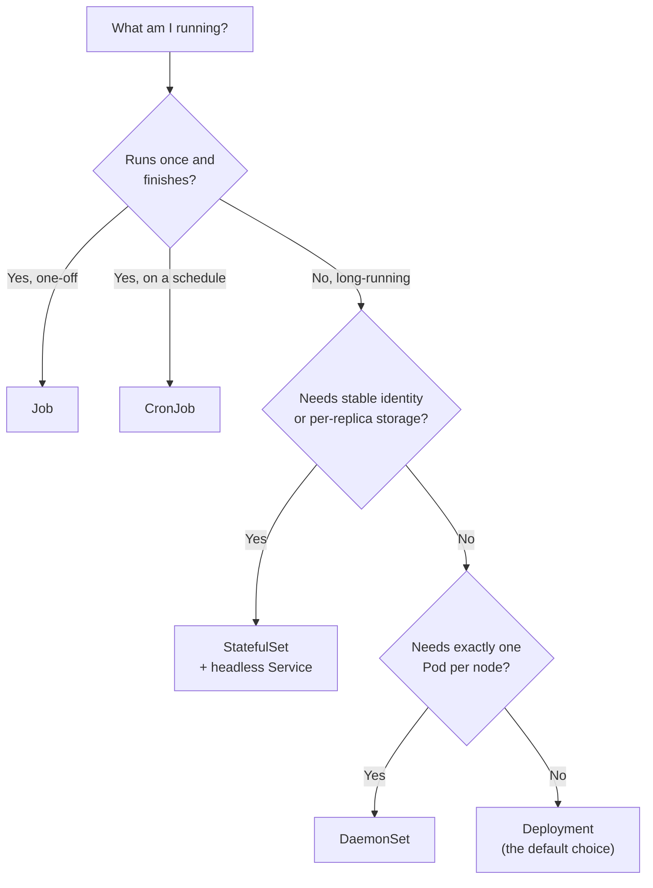
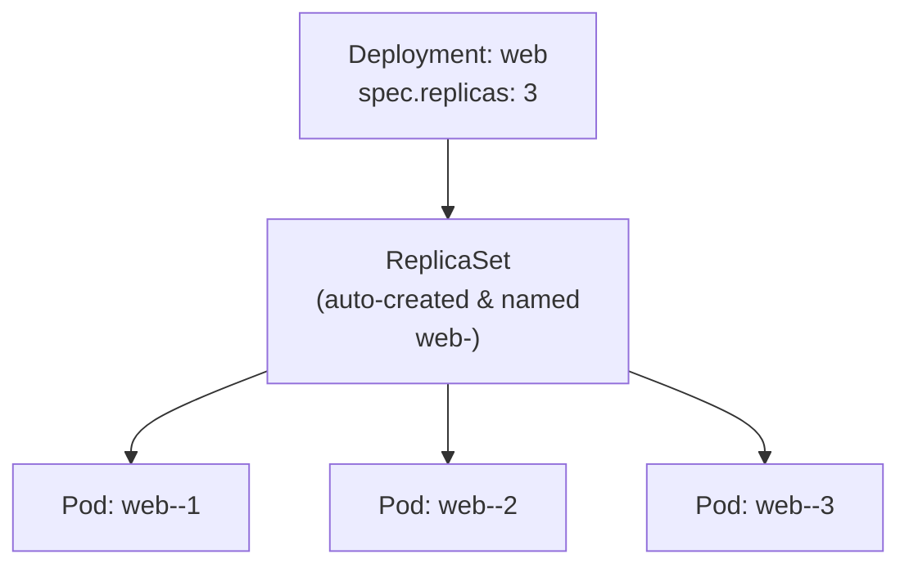
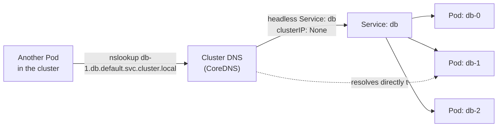
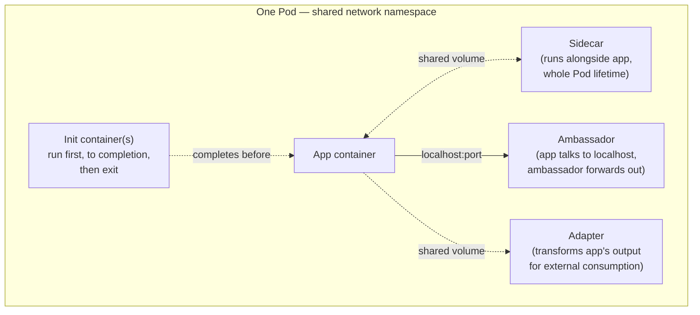
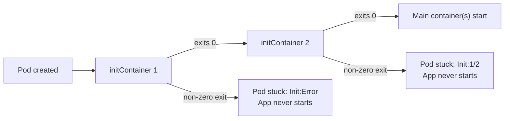
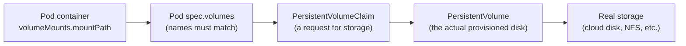

# Chapter 2 — Application Design and Build (20%)

**⏱ Estimated time:** 2.5–3.5 hours across all seven topics below.

## Learning Objectives

By the end of this chapter, you should be able to:

- Build a multi-stage Dockerfile and explain why a smaller final image matters for real deployments.
- Pull an image from a private registry by wiring up `imagePullSecrets` correctly.
- Choose the correct workload resource (Pod, Deployment, StatefulSet, DaemonSet, Job, CronJob) for a given requirement, and justify why the others don't fit.
- Explain why a StatefulSet requires a headless Service, and read/predict its per-Pod DNS names.
- Set a PodDisruptionBudget to protect availability during voluntary disruptions like node drains.
- Recognize and implement the four multi-container Pod patterns: init container, sidecar, ambassador, and adapter.
- Choose the right volume type (`emptyDir`, `hostPath`, PVC-backed) based on the durability an application actually needs.
- Use `subPath` and `projected` volumes to solve specific, common mounting problems.

### Choosing the right workload — decision guide

Several sections in this chapter answer the same underlying question: *"which Kubernetes object should actually run my Pods?"* This decision tree captures the same information as the table in 2.2, framed as a series of yes/no questions:



## 2.1 Container Images 🟡 SHOULD KNOW

**What it is.** The packaged filesystem + metadata a container runs from. CKAD expects you to build, modify, and tag images — not deeply optimize them.

**Why CKAD tests it.** Application developers own their Dockerfiles; you're expected to know the basic build loop even though most exam time goes to the Kubernetes objects around the image.

**Real-world why.** A broken or oversized image is the most common root cause of slow deployments and exam-task failures that have nothing to do with your YAML.

**Commands:**
```bash
docker build -t myapp:1.0 .
docker tag myapp:1.0 registry.example.com/myapp:1.0
docker push registry.example.com/myapp:1.0
docker run --rm myapp:1.0
```

**Multi-stage Dockerfile (reduces final image size):**
```dockerfile
FROM golang:1.22 AS build
WORKDIR /src
COPY . .
RUN go build -o app .

FROM gcr.io/distroless/base
COPY --from=build /src/app /app
ENTRYPOINT ["/app"]
```

🟢 Multi-stage builds matter because a smaller final image pulls faster, has a smaller attack surface, and avoids shipping build tools into production.

**Verify:**
```bash
docker images
docker history myapp:1.0
```

**Exam tip:** if a task asks you to "modify and push an image," confirm which registry the exam's local/private registry uses — it's usually pre-configured and stated in the task.

> **🌍 Real-world example.** A Node.js team once shipped a production image built with a single `FROM node:20` stage that included the full `node_modules` dev dependencies, source maps, and the entire npm cache — a 1.4GB image. Switching to a multi-stage build (compile/install in one stage, copy only the built `dist/` and production `node_modules` into a slim `node:20-slim` final stage) cut the image to 180MB. On a cluster doing frequent rolling deploys across dozens of nodes, that difference is the gap between a 90-second rollout and a 12-second one, because every node has to pull the full image before it can start the container.

### 2.1B Private Registries and imagePullSecrets 🟡 SHOULD KNOW

**What it is.** When a Pod's image is stored in a private registry (requiring authentication), Kubernetes needs credentials to pull it. `imagePullSecrets` provides those credentials.

**Why CKAD tests it.** Real clusters often use private registries for security; hardcoding credentials in YAML is wrong, so you need to know the right pattern.

**The two failure modes:**

| Status | Meaning | Cause | Fix |
|---|---|---|---|
| `ImagePullBackOff` | Kubernetes is retrying the pull | Bad registry credentials, network timeout, rate limit | Add/fix `imagePullSecrets`, verify registry URL and credentials |
| `ErrImagePull` | Immediate permanent failure | Image tag doesn't exist in registry, or registry is unreachable | Verify tag exists, check registry URL spelling, fix credentials |

**Create a Secret for registry credentials:**
```bash

---

---

## 🧪 Practice — Build and Inspect a Multi-Stage Image

### Task

Create a minimal Go application that prints `CKAD practice` and exits.

Write a multi-stage Dockerfile that builds the Go binary in a builder stage and copies only the compiled binary into the final image. Build it as `ckad-go:1.0`, run it, and inspect the image history.

### Requirements

- Use at least two Dockerfile stages.
- The final stage must not be based on the Go builder image.
- Image: `ckad-go:1.0`.
- The running image must print `CKAD practice`.

### Success Criteria

The image runs successfully, prints the required text, and its final stage contains only the application runtime/artifact rather than the Go build environment.

### Suggested Time

**10 minutes**

<details>
<summary>💡 Hint</summary>

Use `COPY --from=<builder-stage>` to transfer only the compiled binary.

</details>

<details>
<summary>✅ Solution</summary>

Create `main.go`:

```go
package main

import "fmt"

func main() {
    fmt.Println("CKAD practice")
}
```

Dockerfile:

```dockerfile
FROM golang:1.22 AS build
WORKDIR /src
COPY main.go .
RUN go build -o app main.go

FROM gcr.io/distroless/base
COPY --from=build /src/app /app
ENTRYPOINT ["/app"]
```

Build and verify:

```bash
docker build -t ckad-go:1.0 .
docker run --rm ckad-go:1.0
docker history ckad-go:1.0
```

</details>

## 🧪 Practice — Configure a Private Image Pull

### Task

In namespace `registry-demo`, configure a Pod named `private-app` to pull `registry.example.com/team/app:1.0` from a private registry.

The registry credentials are username `student` and password `CKAD-pass-1`. Create the required Secret named `registry-creds` and configure the Pod to reference it.

### Requirements

- Namespace: `registry-demo`
- Secret: `registry-creds`
- Registry: `registry.example.com`
- Image: `registry.example.com/team/app:1.0`
- Use `imagePullSecrets`.
- Do not put the credentials directly in the Pod manifest.

### Success Criteria

`private-app` references `registry-creds` through `spec.imagePullSecrets`, and Pod events no longer report an authentication error.

### Suggested Time

**8 minutes**

<details>
<summary>💡 Hint</summary>

Use `kubectl create secret docker-registry`. If the existing Pod cannot be changed safely, recreate it from a corrected manifest.

</details>

<details>
<summary>✅ Solution</summary>

```bash
kubectl create namespace registry-demo
kubectl create secret docker-registry registry-creds   --docker-server=registry.example.com   --docker-username=student   --docker-password='CKAD-pass-1'   -n registry-demo
```

The Pod specification should contain:

```yaml
spec:
  imagePullSecrets:
  - name: registry-creds
  containers:
  - name: app
    image: registry.example.com/team/app:1.0
```

Verify:

```bash
kubectl get secret registry-creds -n registry-demo
kubectl describe pod private-app -n registry-demo
```

</details>

# Create a Docker config secret (standard way)
kubectl create secret docker-registry myregistry \
  --docker-server=registry.example.com \
  --docker-username=myuser \
  --docker-password=mypassword \
  --docker-email=user@example.com

# Or create a generic secret if the registry format is non-standard
kubectl create secret generic myregistry \
  --from-file=.dockerconfigjson=<path-to-.docker/config.json>
```

**Use the secret in a Pod:**
```yaml
apiVersion: v1
kind: Pod
metadata:
  name: private-app
spec:
  imagePullSecrets:
  - name: myregistry           # references the Secret created above
  containers:
  - name: app
    image: registry.example.com/myapp:1.0   # private registry URL
    imagePullPolicy: Always    # pull on every container start
```

**Declarative Secret (base64 encoded):**
```yaml
apiVersion: v1
kind: Secret
metadata:
  name: myregistry
type: kubernetes.io/dockercfg
data:
  .dockercfg: <base64-encoded ~/.docker/config.json>
```

**Verify imagePullSecrets:**
```bash
kubectl get secret myregistry
kubectl describe secret myregistry
kubectl get pod private-app -o jsonpath='{.spec.imagePullSecrets}'
```

**Troubleshoot ImagePullBackOff:**
```bash
kubectl describe pod private-app | grep -A 10 Events
# should show the specific error: "authentication required" or "image not found"
kubectl logs private-app                     # won't work if pull is still failing
kubectl rollout history deployment/app       # check if image was pulled successfully before
```

🔴 **Exam tip:** If a task says "pull an image from a private registry," you *must* create an `imagePullSecret` and add it to the Pod spec. Without it, the Pod will be stuck in `ImagePullBackOff` forever.

> **🌍 Real-world example.** A developer once spent 30 minutes debugging "why does my app work locally but the Kubernetes Pod can't pull the image" — they'd built and run the image locally using `docker login` (credentials stored in `~/.docker/config.json`), then pushed to a private registry. They assumed the Kubernetes cluster could "just" pull it, but the kubelet running on each node has no access to the developer's personal Docker credentials. The fix was simple: create an `imagePullSecret` from a registry token/password and reference it in the Pod. Now the kubelet has explicit credentials for that private registry and can pull the image.

> **📚 Theory.** Kubernetes doesn't have built-in registry credentials — it relies on the kubelet (running on each node) to execute the actual `docker pull` or equivalent. The kubelet has no default access to any developer's `~/.docker/config.json`. So every Pod that needs a private image must declare an `imagePullSecret` pointing to a Secret object that contains the registry credentials. This is a security best-practice: credentials are never hardcoded in YAML or Dockerfiles, they're stored in Secrets and referenced by Pods that need them.

---

## 2.2 Choosing the Right Workload Resource 🔴 MUST KNOW

**What it is.** Kubernetes offers several controllers for running Pods; picking the right one for the job is graded directly.

| Resource | Use when |
|---|---|
| **Pod** | Rare — direct use only for quick debugging/one-offs |
| **Deployment** | Stateless, replicated, needs rolling updates/rollback |
| **ReplicaSet** | Rarely created directly — Deployments manage these for you |
| **StatefulSet** | Needs stable network identity and/or stable storage per replica (databases, brokers) |
| **DaemonSet** | Exactly one Pod per (matching) node — log shippers, node monitors |
| **Job** | Run-to-completion, one-off or batch work |
| **CronJob** | Job on a recurring schedule |

**Deployment — imperative:**
```bash
kubectl create deployment web --image=nginx --replicas=3
kubectl scale deployment web --replicas=5
kubectl set image deployment/web nginx=nginx:1.27
```

**Deployment — declarative:**
```yaml
apiVersion: apps/v1
kind: Deployment
metadata:
  name: web
spec:
  replicas: 3
  selector:
    matchLabels:
      app: web
  template:
    metadata:
      labels:
        app: web
    spec:
      containers:
      - name: web
        image: nginx:1.27
        ports:
        - containerPort: 80
```

A Deployment never manages Pods directly — it manages a ReplicaSet, which in turn manages the Pods. Understanding this hierarchy explains why deleting a Pod that belongs to a Deployment doesn't "fix" anything permanently — a replacement appears within seconds:



Each rolling update (`kubectl set image`) creates a *new* ReplicaSet and scales it up while scaling the old one down — this is also why `kubectl rollout undo` works: the old ReplicaSet isn't deleted immediately, just scaled to zero, so rolling back is just scaling it back up.

**DaemonSet:**
```yaml
apiVersion: apps/v1
kind: DaemonSet
metadata:
  name: node-agent
spec:
  selector:
    matchLabels:
      app: node-agent
  template:
    metadata:
      labels:
        app: node-agent
    spec:
      containers:
      - name: agent
        image: node-agent:1.0
```

**StatefulSet — requires a headless Service:**
```yaml
apiVersion: v1
kind: Service
metadata:
  name: db
spec:
  clusterIP: None       # headless
  selector:
    app: db
  ports:
  - port: 5432
---
apiVersion: apps/v1
kind: StatefulSet
metadata:
  name: db
spec:
  serviceName: db
  replicas: 3
  selector:
    matchLabels:
      app: db
  template:
    metadata:
      labels:
        app: db
    spec:
      containers:
      - name: db
        image: postgres:16
  volumeClaimTemplates:
  - metadata:
      name: data
    spec:
      accessModes: ["ReadWriteOnce"]
      resources:
        requests:
          storage: 5Gi
```

Each StatefulSet Pod gets a stable name (`db-0`, `db-1`, `db-2`) and stable DNS (`db-0.db.<namespace>.svc.cluster.local`) — this is *why* it needs the headless Service; a normal Service load-balances and hides individual Pod identity.

### 2.2A Headless Services and StatefulSet DNS 🔴 MUST KNOW

*(Renumbered from the original heading "4.1B" — this content covers a StatefulSet's own required Service, so it belongs in this chapter's workload-resource numbering, not Chapter 4's networking numbering. Nothing about the content itself has changed.)*

**What it is.** A Service with `clusterIP: None` doesn't get a single stable IP — instead, DNS resolves directly to the individual Pod IPs. This is mandatory for StatefulSets, where Pods need to know each other's exact identity, not go through a load-balancer.

**Why CKAD tests it.** StatefulSets can't work without a headless Service; the connection between the two is a direct exam question.

**The difference:**

| Service Type | DNS Resolution | Use Case |
|---|---|---|
| **Normal** (ClusterIP) | Single stable IP, load-balances across Pods | Stateless apps (Deployments) |
| **Headless** (clusterIP: None) | Resolves to *individual* Pod IPs, no load-balancing | StatefulSets, clustered databases, peer-to-peer |



Unlike a normal Service, DNS doesn't stop at a single load-balanced IP — it resolves straight through to the specific Pod's own IP, which is what lets `db-1` reliably always mean the same replica.

**Real exam pattern:**
```yaml
---

---

---

## 🧪 Practice — Choose the Correct Workload

### Task

For each scenario, choose the correct Kubernetes workload resource and explain why:

1. An HTTP API with 4 interchangeable replicas and rolling updates.
2. Exactly one node-monitoring Pod on every matching node.
3. A database where each replica needs stable identity and its own persistent storage.
4. A report that runs once and retries failures.
5. An inventory report that runs every night at 02:00 and must not overlap.

Then create the CronJob for scenario 5.

### Requirements

- Choose from Pod, Deployment, StatefulSet, DaemonSet, Job, CronJob.
- CronJob name: `nightly-inventory`.
- Image: `busybox:1.36`.
- Schedule: `0 2 * * *`.
- `concurrencyPolicy: Forbid`.
- Command prints `nightly inventory report`.

### Success Criteria

Correct choices are Deployment, DaemonSet, StatefulSet, Job, and CronJob respectively. The created CronJob has the exact schedule and `Forbid` concurrency policy.

### Suggested Time

**8–10 minutes**

<details>
<summary>💡 Hint</summary>

Match the distinctive requirement phrases to the decision tree: interchangeable replicas, one per node, stable identity, run once, recurring schedule.

</details>

<details>
<summary>✅ Solution</summary>

```text
1. Deployment
2. DaemonSet
3. StatefulSet
4. Job
5. CronJob
```

Create the CronJob:

```bash
kubectl create cronjob nightly-inventory   --image=busybox:1.36   --schedule="0 2 * * *"   -- /bin/sh -c 'echo nightly inventory report'

kubectl patch cronjob nightly-inventory   -p '{"spec":{"concurrencyPolicy":"Forbid"}}'

kubectl get cronjob nightly-inventory -o yaml
```

</details>

## 🧪 Practice — Verify StatefulSet Stable Identity

### Task

Create a headless Service named `web` and a StatefulSet named `web` with 3 replicas using image `nginx:1.27`.

The StatefulSet must use `serviceName: web`. After the Pods are running, determine the stable DNS name for Pod `web-1`.

### Requirements

- Service: `web`, with `clusterIP: None`.
- StatefulSet: `web`, 3 replicas.
- `serviceName: web`.
- Pod label: `app: web`.
- Determine the stable DNS name for `web-1`.

### Success Criteria

The StatefulSet creates `web-0`, `web-1`, and `web-2`; `web-1` has the stable DNS form `<pod>.<service>.<namespace>.svc.cluster.local`.

### Suggested Time

**8 minutes**

<details>
<summary>💡 Hint</summary>

The individual Pod DNS pattern is `<pod-name>.<service-name>.<namespace>.svc.cluster.local`.

</details>

<details>
<summary>✅ Solution</summary>

```yaml
apiVersion: v1
kind: Service
metadata:
  name: web
spec:
  clusterIP: None
  selector:
    app: web
  ports:
  - port: 80
    targetPort: 80
---
apiVersion: apps/v1
kind: StatefulSet
metadata:
  name: web
spec:
  serviceName: web
  replicas: 3
  selector:
    matchLabels:
      app: web
  template:
    metadata:
      labels:
        app: web
    spec:
      containers:
      - name: nginx
        image: nginx:1.27
```

Apply and inspect:

```bash
kubectl apply -f statefulset.yaml
kubectl get pods
kubectl get svc web
```

For namespace `default`, `web-1` resolves as:

```text
web-1.web.default.svc.cluster.local
```

</details>

# Headless Service for StatefulSet discovery
apiVersion: v1
kind: Service
metadata:
  name: db
spec:
  clusterIP: None          # THIS is what makes it headless
  selector:
    app: db
  ports:
  - port: 5432
    targetPort: 5432
---
# StatefulSet requiring the headless Service
apiVersion: apps/v1
kind: StatefulSet
metadata:
  name: db
spec:
  serviceName: db          # MUST match the headless Service name
  replicas: 3
  selector:
    matchLabels:
      app: db
  template:
    metadata:
      labels:
        app: db
    spec:
      containers:
      - name: postgres
        image: postgres:16
        ports:
        - containerPort: 5432
```

**DNS names inside the cluster:**
```bash
# Individual Pod DNS (only works with headless Service)
db-0.db.default.svc.cluster.local  → resolves to db-0's actual IP
db-1.db.default.svc.cluster.local  → resolves to db-1's actual IP
db-2.db.default.svc.cluster.local  → resolves to db-2's actual IP

# Collective DNS (works with both normal and headless)
db.default.svc.cluster.local       → resolves to all Pod IPs (or single IP for normal)
```

**Verify DNS and connectivity:**
```bash
kubectl get svc db                 # should show CLUSTER-IP as None
kubectl run -it debug --image=busybox --restart=Never -- nslookup db.default.svc.cluster.local
# output should show all three Pod IPs, not a single service IP
kubectl run -it debug --image=busybox --restart=Never -- nslookup db-0.db.default.svc.cluster.local
# output should show db-0's specific IP
```

**Troubleshoot StatefulSet Pods can't reach each other:**

| Problem | Cause | Fix |
|---|---|---|
| StatefulSet Pods can't reach db-0, db-1, db-2 by hostname | Service missing or not headless (has a clusterIP) | Verify `clusterIP: None` exists; StatefulSet's `serviceName` matches Service name |
| Pods resolve DNS but connection times out | Pod isn't actually listening on the port | Check container startup, logs, and port binding |
| DNS query works, but StatefulSet Pod still starts before cluster is ready | Pods may boot before others are DNS-resolvable | Use init containers to wait for peer DNS resolution |

🔴 **Exam tip:** If a StatefulSet task mentions "Pods should reach each other by name" or "Pods need stable DNS names," the answer requires a `clusterIP: None` Service with `serviceName: <service-name>` in the StatefulSet.

> **🌍 Real-world example.** An etcd cluster (3 nodes) requires members to discover and communicate with *specific* peers by hostname, not through a load-balancer — `etcd-0` talks to `etcd-1` and `etcd-2` directly to maintain quorum, and it must talk to the *same* `etcd-1` every time, not be randomly load-balanced to different instances. Without a headless Service pointing to a stable DNS name for each Pod, etcd's Raft consensus breaks. The same is true for Kafka clusters, RabbitMQ clusters, and any stateful system where individual node identity matters — the headless Service makes that identity DNS-discoverable rather than requiring hardcoded IPs or service discovery hacks.

> **📚 Theory.** A normal Service's load-balancing (`iptables` rules or kube-proxy) intercepts traffic destined for the Service IP and rewrites the destination to a random Pod IP. This is great for stateless apps where "any replica" is fine. But for StatefulSets, you *need* to address specific Pods — `db-0` and `db-1` are different, running different parts of a replicated data store. DNS is the standard way to make individual Pod IPs discoverable: `headless Service → DNS A records → individual Pod IPs`, no load-balancer in the middle.

**Jobs and CronJobs:**
```yaml
apiVersion: batch/v1
kind: Job
metadata:
  name: report
spec:
  completions: 3
  parallelism: 1
  backoffLimit: 4
  activeDeadlineSeconds: 300
  template:
    spec:
      restartPolicy: Never
      containers:
      - name: report
        image: report-gen
```
```yaml
apiVersion: batch/v1
kind: CronJob
metadata:
  name: nightly-report
spec:
  schedule: "0 2 * * *"
  concurrencyPolicy: Forbid       # Allow | Forbid | Replace
  successfulJobsHistoryLimit: 3
  failedJobsHistoryLimit: 1
  jobTemplate:
    spec:
      template:
        spec:
          restartPolicy: Never
          containers:
          - name: report
            image: report-gen
```

**Imperative shortcuts:**
```bash
kubectl create job report --image=report-gen
kubectl create cronjob nightly --image=report-gen --schedule="0 2 * * *"
kubectl create job manual-run --from=cronjob/nightly    # trigger a CronJob on demand
```

**Verify:**
```bash
kubectl rollout status deployment/web
kubectl get pods -o wide
kubectl get jobs
kubectl get cronjobs
kubectl get pods --selector=job-name=report
```

**Troubleshoot:**

| Problem | Cause | Fix |
|---|---|---|
| Job never completes | `completions` count too high, or Pod keeps failing | `kubectl describe job`, check `backoffLimit`, inspect Pod logs |
| CronJob never runs | `concurrencyPolicy: Forbid` and previous run still active, or schedule wrong | `kubectl get cronjobs`, check `LAST SCHEDULE`, verify cron syntax |
| StatefulSet Pods stuck `Pending` | PVC can't bind (see Ch. 2.4), or headless Service missing | `kubectl describe pod`, `kubectl get svc` |
| DaemonSet missing Pods on some nodes | Node taints not tolerated | `kubectl describe daemonset`, check node taints vs Pod tolerations |

🔴 **Exam tip:** "run this once" or "run this on a schedule and don't overlap" are the two phrases that instantly tell you Job vs CronJob, and `concurrencyPolicy: Forbid` vs `Allow`.

> **🌍 Real-world example.** A logistics company runs Elasticsearch as a StatefulSet (each node needs stable identity and its own disk — `es-0`, `es-1`, `es-2` always mean the same shard data), Fluent Bit as a DaemonSet (exactly one log-shipping agent per node, automatically scheduled onto every new node added to the cluster with zero extra configuration), a nightly inventory-reconciliation Job as a CronJob (`0 3 * * *`, `concurrencyPolicy: Forbid` so a slow run never overlaps with the next night's), and their actual customer-facing API as a Deployment (stateless, horizontally scaled, rolling-updated on every release). Each workload type in this chapter maps to a real, distinct operational need — none of them are interchangeable in production even though all four ultimately just run Pods.

> **📚 Theory.** Every controller in this table (Deployment, StatefulSet, DaemonSet, Job) follows the same reconciliation-loop pattern: it watches the actual cluster state, compares it to the desired state you declared, and takes action to close the gap — repeatedly, forever. A Deployment doesn't "create three Pods once"; it continuously ensures three Pods matching its selector exist, which is *why* deleting a Pod managed by a Deployment just causes a replacement to appear instantly. Understanding this loop is what makes Kubernetes's declarative model click, instead of feeling like a pile of special-cased commands.

---

## 2.2B Pod Disruption Budgets 🔴 MUST KNOW

**What it is.** A guarantee that specifies the minimum number (or percentage) of Pods that must remain available during voluntary disruptions — maintenance, node drain, eviction.

**Why CKAD tests it.** Drain and eviction are part of cluster operations; PDB is how you ensure graceful rolling updates and maintenance without service degradation.

**Real-world why.** Without a PDB, `kubectl drain` or a cloud provider's planned node shutdown can evict your entire Deployment at once, causing an outage. With a PDB, the cluster respects your availability requirements and evicts Pods one-by-one.

**PDB declarative:**
```yaml
apiVersion: policy/v1
kind: PodDisruptionBudget
metadata:
  name: web-pdb
spec:
  minAvailable: 2           # Keep at least 2 Pods running during disruption
  selector:
    matchLabels:
      app: web
---

---

## 🧪 Practice — Protect Replicas During Voluntary Disruption

### Task

A Deployment named `payments` in namespace `production` has 4 replicas, labeled `app=payments`.

Create a PodDisruptionBudget named `payments-pdb` that guarantees at least 3 matching Pods remain available during voluntary disruptions.

### Requirements

- PDB: `payments-pdb`.
- Namespace: `production`.
- Selector: `app=payments`.
- `minAvailable: 3`.
- API version: `policy/v1`.

### Success Criteria

The PDB selects the Deployment's Pods and reports a minimum availability of 3.

### Suggested Time

**5 minutes**

<details>
<summary>💡 Hint</summary>

Translate “at least 3 must remain available” directly into `minAvailable: 3`.

</details>

<details>
<summary>✅ Solution</summary>

```yaml
apiVersion: policy/v1
kind: PodDisruptionBudget
metadata:
  name: payments-pdb
  namespace: production
spec:
  minAvailable: 3
  selector:
    matchLabels:
      app: payments
```

```bash
kubectl apply -f payments-pdb.yaml
kubectl get pdb payments-pdb -n production
kubectl describe pdb payments-pdb -n production
```

</details>

# Alternative: maxUnavailable (same concept, expressed as "how many *can* fail")
apiVersion: policy/v1
kind: PodDisruptionBudget
metadata:
  name: batch-pdb
spec:
  maxUnavailable: 1         # Allow at most 1 Pod down during disruption
  selector:
    matchLabels:
      app: batch-job
```

**Verify and inspect PDB:**
```bash
kubectl get pdb                           # list all PDBs in the namespace
kubectl describe pdb web-pdb              # see current disruptions allowed/remaining
kubectl drain node-1 --dry-run=client     # see what drain would do, respecting PDB
```

🔴 **Exam tip:** `minAvailable` is what most tasks test. If the task says "ensure at least 2 Pods stay running during updates," use `minAvailable: 2`. If it says "no more than 1 Pod can be evicted," use `maxUnavailable: 1`.

> **🌍 Real-world example.** A payment processing service runs a Deployment with 5 replicas. During a routine node maintenance window, the operator runs `kubectl drain` on one node. Without a PodDisruptionBudget, all Pods on that node are evicted at once, causing a brief but significant spike in latency as the remaining nodes are saturated. With `minAvailable: 3`, the drain process ensures at least 3 replicas remain running at all times, evicting Pods one at a time and waiting for new ones to become Ready before evicting the next. This is the practical insurance behind graceful maintenance: the cluster respects the "minimum availability" guarantee rather than blindly optimizing for speed. Even better: a PDB on your database StatefulSet prevents that production db from being rebooted while its replicas are syncing.

> **📚 Theory.** PDB doesn't prevent *forced* terminations (e.g., `kubectl delete pod --grace-period=0` or node reboot), only *voluntary* disruptions (drain, planned node maintenance via a cloud provider, cluster autoscaling, API-driven evictions). This is the important distinction: a Pod with a healthy PDB is still vulnerable to hard shutdowns and cluster failures, but the vast majority of real maintenance windows are voluntary and PDB-aware.

---

## 2.3 Multi-Container Pod Design Patterns 🔴 MUST KNOW

**What it is.** Multiple containers sharing one Pod's network namespace and (optionally) volumes, following one of a few well-known patterns.

**Why CKAD tests it.** This is one of the most distinctive CKAD skills — recognizing which pattern a task describes and wiring the shared volume/network correctly.

**Real-world why.** Composing small single-purpose containers (log shipper, proxy, format-converter) next to a main app avoids bloating the app's own image with unrelated responsibilities.

All four patterns below rely on the same underlying guarantee: every container in one Pod shares the same network namespace (so `localhost` reaches every container) and can share volumes. This is what makes "sidecar-style" composition possible without any special networking configuration:



### Init containers

Run to completion, in order, before any main container starts. Use for setup: waiting on a dependency, seeding a shared volume, running a migration.

```yaml
spec:
  initContainers:
  - name: wait-for-db
    image: busybox
    command: ['sh', '-c', 'until nc -z db 5432; do sleep 2; done']
  - name: seed-cache
    image: busybox
    command: ['sh', '-c', 'echo "seeded" > /cache/ready']
    volumeMounts:
    - name: cache
      mountPath: /cache
  containers:
  - name: app
    image: myapp
    volumeMounts:
    - name: cache
      mountPath: /cache
  volumes:
  - name: cache
    emptyDir: {}
```

**Critical init container behavior:**
- Init containers **run sequentially** (one at a time, in order).
- **If any init container fails, the Pod never starts** — the app container is never begun.
- **The Pod is not considered "Ready" until all init containers succeed**.
- Restart behavior on init failure: controlled by `restartPolicy` at the Pod level.



**Real exam pattern:**

| Scenario | What happens |
|---|---|
| Init container succeeds, app starts and runs | Normal flow |
| Init container fails | Pod stuck in `Init:0/2` or `Init:Error` — does not start app container |
| Init container hangs (infinite loop, deadlock) | Pod waits forever in `Init:0/2` — app never starts |
| App container crashes, init already succeeded | App restarts (controlled by liveness); init is skipped on restart |

**Verify init container progress:**
```bash
kubectl describe pod mypod | grep -A 10 "Init Containers"
kubectl get pod mypod -o jsonpath='{.status.initContainerStatuses}'
```

**Common init container pattern — wait for a dependency:**
```yaml
spec:
  initContainers:
  - name: wait-for-service
    image: busybox
    command: ['sh', '-c', 'until nslookup db.default.svc.cluster.local; do echo waiting; sleep 2; done']
  containers:
  - name: app
    image: myapp
```

This waits for `db.default.svc.cluster.local` to be DNS-resolvable (i.e., the database Service exists and has at least one endpoint) before starting the app.

🔴 **Exam tip:** If a task says "the app must wait for the database to be ready before starting," that's an init container, not a readiness probe. The distinction: init containers block Pod startup; probes just determine traffic routing.

> **🌍 Real-world example.** A microservices application needs to initialize a database schema via a migration script before the app starts. Without an init container, the app would start and immediately crash trying to query a schema that doesn't exist yet, enter `CrashLoopBackOff`, and eventually give up. With an init container running `database-migrate.sh`, the schema is created before the app ever starts, and the app's first query finds a ready database. The same pattern is used for cache warming, downloading configuration from a remote server, or waiting for a peer to be reachable in a StatefulSet.

> **📚 Theory.** Init containers formalize a synchronization point: "before this app starts, these prerequisites must be satisfied." This is distinct from a sidecar (which runs alongside the app for its whole lifetime) or a readiness probe (which determines traffic routing after the app has started). Because init containers run *before* the app, they're used to enforce hard dependencies ("app cannot start without this"); readiness probes are used for soft degradation ("app can start, but might not be ready to serve traffic yet").

### Sidecar pattern

Runs alongside the main container for the Pod's whole lifetime, extending it (log shipping, TLS termination, metric scraping). Since Kubernetes 1.29+, sidecars can be declared natively as `initContainers` with `restartPolicy: Always`, so they start before the main container and the Pod is considered ready only once both are ready.

```yaml
spec:
  initContainers:
  - name: log-shipper
    image: log-shipper:1.0
    restartPolicy: Always          # marks this as a native sidecar, not a one-shot init container
    volumeMounts:
    - name: logs
      mountPath: /var/log/app
  containers:
  - name: app
    image: myapp
    volumeMounts:
    - name: logs
      mountPath: /var/log/app
  volumes:
  - name: logs
    emptyDir: {}
```

### Ambassador pattern

A sidecar that proxies network traffic on behalf of the main container — the app talks to `localhost`, the ambassador forwards it (and can handle retries, TLS, service discovery).

```yaml
containers:
- name: app
  image: myapp          # connects to localhost:6379 as if Redis were local
- name: redis-ambassador
  image: ambassador-proxy
  ports:
  - containerPort: 6379
```

### Adapter pattern

A sidecar that transforms the main container's output into a standard format for external consumption (e.g., converting a custom log/metrics format into Prometheus format).

```yaml
containers:
- name: app
  image: myapp
  volumeMounts:
  - name: logs
    mountPath: /var/log/app
- name: log-adapter
  image: log-format-adapter
  volumeMounts:
  - name: logs
    mountPath: /var/log/app
volumes:
- name: logs
  emptyDir: {}
```

### Working with specific containers in a multi-container Pod

```bash
kubectl logs mypod -c log-shipper
kubectl logs mypod --all-containers=true
kubectl exec -it mypod -c app -- sh
kubectl top pod mypod --containers
```

**Verify:**
```bash
kubectl get pod mypod -o jsonpath='{.spec.containers[*].name}'
kubectl describe pod mypod         # check each container's State/Ready column
```

**Troubleshoot:**

| Problem | Cause | Fix |
|---|---|---|
| Pod stuck `Init:0/2` | An init container is failing or blocked | `kubectl logs mypod -c <init-container-name>` |
| Main container never starts | Regular init container never exits 0 | Check init container logs/exit code with `kubectl describe pod` |
| Sidecar and app can't share files | Same volume not mounted to both containers | Check `volumeMounts.name` matches on both |
| Ambassador connection refused | App pointed at wrong host/port (should be `localhost`) | Fix app's connection target |

🔴 **Init container vs sidecar, in one line:** init containers *finish* before the app starts; sidecars run *alongside* the app for its whole life. If the task says "must complete before the app starts," it's an init container; if it says "runs continuously alongside," it's a sidecar.

> **🌍 Real-world example.** The service mesh Istio is essentially a massive, standardized application of the ambassador pattern: every Pod in the mesh gets an `istio-proxy` sidecar container injected automatically, and the application container is configured to send *all* its network traffic to `localhost`, where the sidecar intercepts it, handles mutual TLS, retries, and traffic routing, and only then forwards it to the real destination. The app code never needs to know a service mesh exists. Similarly, the classic "log shipping" adapter pattern — a Fluent Bit or Filebeat sidecar tailing a shared `emptyDir` volume and forwarding formatted logs to a central store — is the standard way legacy apps that only write to local log files get integrated into centralized logging without any code changes.

> **📚 Theory.** All three sidecar-family patterns (sidecar, ambassador, adapter) rely on the same underlying Kubernetes guarantee: containers in one Pod share a network namespace (so `localhost` reaches every container in the Pod) and can share volumes. This is fundamentally different from two Pods talking over a Service — there's no load-balancing, no DNS lookup, and no network hop between containers in the same Pod, which is exactly why the ambassador pattern can transparently intercept "localhost" traffic without the app being aware.

---

---

## 🧪 Practice — Init Container with a Shared Volume

### Task

Create Pod `init-demo` in namespace `patterns`.

It must have an init container `prepare` and a main container `app`, both using `busybox:1.36`. The init container writes `ready` to `/work/status.txt` and exits successfully. The main container runs `sleep 3600` and must see the same file through a shared volume.

### Requirements

- Namespace: `patterns`.
- Pod: `init-demo`.
- Init container: `prepare`.
- Main container: `app`.
- Shared volume: `emptyDir`.
- Both containers mount it at `/work`.
- Main command: `sleep 3600`.

### Success Criteria

The Pod is Running and:

```bash
kubectl exec -n patterns init-demo -c app -- cat /work/status.txt
```

returns `ready`.

### Suggested Time

**8 minutes**

<details>
<summary>💡 Hint</summary>

The init and main containers need the same named volume and matching `volumeMounts`. The init container must finish before the main container starts.

</details>

<details>
<summary>✅ Solution</summary>

```yaml
apiVersion: v1
kind: Pod
metadata:
  name: init-demo
  namespace: patterns
spec:
  initContainers:
  - name: prepare
    image: busybox:1.36
    command: ["sh", "-c", "echo ready > /work/status.txt"]
    volumeMounts:
    - name: work
      mountPath: /work
  containers:
  - name: app
    image: busybox:1.36
    command: ["sleep", "3600"]
    volumeMounts:
    - name: work
      mountPath: /work
  volumes:
  - name: work
    emptyDir: {}
```

```bash
kubectl apply -f init-demo.yaml
kubectl get pod init-demo -n patterns
kubectl exec -n patterns init-demo -c app -- cat /work/status.txt
```

</details>

## 2.4 Volumes 🔴 MUST KNOW

**What it is.** Pod-level and cluster-level storage abstractions: ephemeral (`emptyDir`), node-local (`hostPath`), and cluster-provisioned persistent storage (`PersistentVolume`/`PersistentVolumeClaim`).

**Why CKAD tests it.** Correctly wiring a Pod to the right kind of storage — and knowing when persistence is even necessary — is core application-design judgment.

**Real-world why.** Losing data on Pod restart is fine for a cache, catastrophic for a database — the volume type you pick has to match the durability the app actually needs.

**The chain for persistent storage:**

```
Pod -> volumeMount -> volume (references a PVC) -> PersistentVolumeClaim -> PersistentVolume -> actual storage
```



The PVC is the only piece an application developer usually writes by hand — in most clusters (including the exam environment) a default `StorageClass` watches for new PVCs and dynamically creates a matching PV automatically.

### emptyDir — ephemeral, shared between containers in one Pod

```yaml
volumes:
- name: scratch
  emptyDir: {}
```
Deleted when the Pod is removed. Perfect for scratch space or sharing files between containers in the same Pod (see 2.3).

### hostPath — node-local storage

```yaml
volumes:
- name: host-logs
  hostPath:
    path: /var/log/app
    type: DirectoryOrCreate
```
🟢 Ties the Pod to whatever is on that specific node — rarely appropriate outside DaemonSets or single-node dev/test.

### PersistentVolume and PersistentVolumeClaim

```yaml
apiVersion: v1
kind: PersistentVolume
metadata:
  name: pv-data
spec:
  capacity:
    storage: 5Gi
  accessModes:
    - ReadWriteOnce
  persistentVolumeReclaimPolicy: Retain
  storageClassName: manual
  hostPath:
    path: /mnt/data
---
apiVersion: v1
kind: PersistentVolumeClaim
metadata:
  name: pvc-data
spec:
  accessModes:
    - ReadWriteOnce
  resources:
    requests:
      storage: 5Gi
  storageClassName: manual
---
apiVersion: v1
kind: Pod
metadata:
  name: db
spec:
  containers:
  - name: db
    image: postgres
    volumeMounts:
    - name: data
      mountPath: /var/lib/postgresql/data
  volumes:
  - name: data
    persistentVolumeClaim:
      claimName: pvc-data
```

In most clusters (including the exam environment) a default `StorageClass` exists and dynamically provisions the PV for you — you typically only write the PVC.

### Access modes

| Mode | Meaning |
|---|---|
| `ReadWriteOnce` (RWO) | Mounted read-write by a single node |
| `ReadOnlyMany` (ROX) | Mounted read-only by many nodes |
| `ReadWriteMany` (RWX) | Mounted read-write by many nodes |
| `ReadWriteOncePod` | Mounted read-write by a single Pod (stricter than RWO) |

### ConfigMap/Secret as volumes

Covered fully in Chapter 1 — the same `volumes`/`volumeMounts` mechanism, source is `configMap:` or `secret:` instead of `persistentVolumeClaim:`.

### subPath — mounting one file without hiding the rest of a directory

By default, mounting a volume at a path replaces everything already there. `subPath` mounts just one key/file from the volume, leaving the rest of the target directory untouched — essential when you need to drop a single config file into a directory that already has other files (e.g., an image's existing `/etc/nginx/conf.d/`).

```yaml
volumeMounts:
- name: config-vol
  mountPath: /etc/nginx/conf.d/custom.conf
  subPath: custom.conf          # only this one key from the ConfigMap is mounted
volumes:
- name: config-vol
  configMap:
    name: nginx-config
```

🟡 **Trade-off:** a `subPath` mount does **not** receive live updates when the source ConfigMap/Secret changes (unlike a normal whole-directory mount) — the file is copied in at Pod start, not symlinked.

### Projected volumes — combining multiple sources into one mount

A `projected` volume merges a ConfigMap, a Secret, and the Downward API (see Chapter 1.3) into a single mounted directory, instead of managing three separate volumes.

```yaml
volumes:
- name: all-in-one
  projected:
    sources:
    - configMap:
        name: app-config
    - secret:
        name: app-secret
    - downwardAPI:
        items:
        - path: "pod-name"
          fieldRef:
            fieldPath: metadata.name
containers:
- name: app
  volumeMounts:
  - name: all-in-one
    mountPath: /etc/app
```

**Verify:**
```bash
kubectl get pv
kubectl get pvc
kubectl describe pvc pvc-data
kubectl exec db -- df -h /var/lib/postgresql/data
```

**Troubleshoot:**

| Problem | Likely cause | Diagnostic | Fix |
|---|---|---|---|
| PVC stuck `Pending` | No PV matches size/accessMode/storageClass, or no default StorageClass and none specified | `kubectl describe pvc` -> Events | Create a matching PV, or set correct `storageClassName` |
| Pod stuck `Pending`, "unbound PVC" | PVC itself isn't bound yet | `kubectl get pvc`, `kubectl describe pod` | Fix the PVC first |
| Data lost after Pod restart | Used `emptyDir` for something that needed persistence | n/a | Switch to PVC-backed volume |
| Multi-Pod write conflict | Used RWO where RWX was needed | `kubectl describe pvc` (accessMode) | Use an RWX-capable StorageClass or redesign as single-writer |

> **🌍 Real-world example.** A media-processing pipeline needed multiple worker Pods to read and write to the *same* directory of uploaded video files simultaneously — a classic ReadWriteMany requirement. On a cloud provider whose default block-storage StorageClass only supports `ReadWriteOnce` (the storage is physically attached to one node at a time), the team's PVC sat `Pending` forever until they switched to an RWX-capable backend like an NFS server or a managed file service (e.g., AWS EFS, Azure Files). This is a common real production gotcha: not every StorageClass supports every access mode, and the failure looks identical to a simple typo unless you check `kubectl describe storageclass` and the provider's documentation for what that class actually supports.

**Exam Tips — Chapter 2**
- "One Pod per node" -> DaemonSet. "Run once" -> Job. "Run on a schedule" -> CronJob. "Stable identity per replica" -> StatefulSet. Everything else -> Deployment.
- If a task says containers must "share files," check whether it needs to survive Pod restart — that decides `emptyDir` vs PVC.
- A PVC stuck `Pending` is almost always a StorageClass or accessMode mismatch — check both before anything else.
- Multi-container Pod tasks are graded on the *shared volume wiring*, not the containers' business logic — get the `volumeMounts` name-matching right first.
- Need to drop one file into a directory without wiping out what's already there? That's `subPath` — and remember it won't hot-update if the source changes.
- Task mentions combining a ConfigMap, a Secret, and Pod metadata into one mount point? That's a `projected` volume, not three separate `volumeMounts`.

---

## 🧪 Practice — Persist Data with a PVC

### Task

Create a PersistentVolumeClaim named `app-data` in namespace `storage-demo`, requesting `1Gi` with `ReadWriteOnce`.

Create Pod `storage-demo` using `busybox:1.36` and `sleep 3600`, mounting the PVC at `/data`. Write `persistent-data` to `/data/value.txt`, delete the Pod, recreate it with the same PVC, and verify the file remains.

### Requirements

- PVC: `app-data`.
- Storage request: `1Gi`.
- Access mode: `ReadWriteOnce`.
- Pod: `storage-demo`.
- Image: `busybox:1.36`.
- Mount path: `/data`.
- Use the PVC, not `emptyDir`.

### Success Criteria

The PVC becomes `Bound`, the file can be written, and its contents survive Pod deletion and recreation.

### Suggested Time

**10 minutes**

<details>
<summary>💡 Hint</summary>

The Pod references the PVC under `spec.volumes`; the volume name and `volumeMounts.name` must match.

</details>

<details>
<summary>✅ Solution</summary>

```bash
kubectl create namespace storage-demo
```

PVC:

```yaml
apiVersion: v1
kind: PersistentVolumeClaim
metadata:
  name: app-data
  namespace: storage-demo
spec:
  accessModes: [ReadWriteOnce]
  resources:
    requests:
      storage: 1Gi
```

Pod:

```yaml
apiVersion: v1
kind: Pod
metadata:
  name: storage-demo
  namespace: storage-demo
spec:
  containers:
  - name: app
    image: busybox:1.36
    command: ["sleep", "3600"]
    volumeMounts:
    - name: data
      mountPath: /data
  volumes:
  - name: data
    persistentVolumeClaim:
      claimName: app-data
```

Test persistence:

```bash
kubectl apply -f pvc.yaml
kubectl apply -f pod.yaml
kubectl get pvc -n storage-demo
kubectl exec -n storage-demo storage-demo -- sh -c 'echo persistent-data > /data/value.txt'
kubectl delete pod storage-demo -n storage-demo
kubectl apply -f pod.yaml
kubectl exec -n storage-demo storage-demo -- cat /data/value.txt
```

</details>

## Chapter Summary

| Topic | One-line takeaway |
|---|---|
| Container images (2.1) | Multi-stage builds = smaller, faster-pulling, lower-attack-surface images |
| Private registries (2.1B) | `ImagePullBackOff` on a private image almost always means a missing/wrong `imagePullSecrets` |
| Workload resource choice (2.2) | Deployment is the default; StatefulSet/DaemonSet/Job/CronJob each solve one specific need the others don't |
| Headless Services (2.2A) | `clusterIP: None` is what lets StatefulSet Pods resolve each other by stable, individual DNS names |
| Pod Disruption Budgets (2.2B) | Protects *voluntary* disruptions only (drain, autoscaling) — not hard crashes or forced deletes |
| Multi-container patterns (2.3) | Init containers block startup; sidecar/ambassador/adapter all run alongside the app, sharing network + volumes |
| Volumes (2.4) | Match volume durability to the data's actual durability need — `emptyDir` for scratch, PVC for anything that must survive a restart |

**Next:** Chapter 3 — Application Deployment (20%) builds on the Deployment fundamentals from 2.2, going deeper into rolling updates, rollback, and blue/green and canary release strategies.
\newpage

---

## 🧪 Practice — Chapter Challenge — Select and Build the Workloads

### Task

You need three components:

- a stateless HTTP frontend with 3 interchangeable replicas;
- a cleanup operation every day at 01:30 that must not overlap;
- a stateful component with stable identity and per-replica persistent storage.

Choose the correct workload for each, then create the frontend and cleanup resources. Write the stateful Service + StatefulSet skeleton.

### Requirements

- Frontend: Deployment `frontend`, 3 replicas, `nginx:1.27`, label `app=frontend`.
- Cleanup: CronJob `cleanup`, `busybox:1.36`, schedule `30 1 * * *`, `Forbid`.
- Stateful: StatefulSet `stateful-app`, 2 replicas, matching headless Service.
- Stateful image: `busybox:1.36`, command `sleep 3600`.
- Stateful storage: `1Gi`, `ReadWriteOnce`.

### Success Criteria

Frontend is a Deployment, cleanup is a CronJob, and the stateful component is a StatefulSet with a headless Service and PVC template. The created resources match all specified values.

### Suggested Time

**15 minutes**

<details>
<summary>💡 Hint</summary>

Classify first: interchangeable stateless replicas → Deployment; recurring work → CronJob; stable identity + per-replica storage → StatefulSet.

</details>

<details>
<summary>✅ Solution</summary>

```text
Frontend       -> Deployment
Cleanup        -> CronJob
Stateful app   -> StatefulSet + headless Service
```

Frontend:

```bash
kubectl create deployment frontend --image=nginx:1.27 --replicas=3
```

Cleanup:

```bash
kubectl create cronjob cleanup   --image=busybox:1.36   --schedule="30 1 * * *"   -- /bin/sh -c 'echo cleanup'

kubectl patch cronjob cleanup   -p '{"spec":{"concurrencyPolicy":"Forbid"}}'
```

Stateful skeleton:

```yaml
apiVersion: v1
kind: Service
metadata:
  name: stateful-app
spec:
  clusterIP: None
  selector:
    app: stateful-app
  ports:
  - port: 80
---
apiVersion: apps/v1
kind: StatefulSet
metadata:
  name: stateful-app
spec:
  serviceName: stateful-app
  replicas: 2
  selector:
    matchLabels:
      app: stateful-app
  template:
    metadata:
      labels:
        app: stateful-app
    spec:
      containers:
      - name: app
        image: busybox:1.36
        command: ["sleep", "3600"]
        volumeMounts:
        - name: data
          mountPath: /data
  volumeClaimTemplates:
  - metadata:
      name: data
    spec:
      accessModes: ["ReadWriteOnce"]
      resources:
        requests:
          storage: 1Gi
```

</details>

