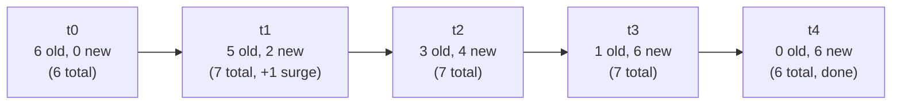
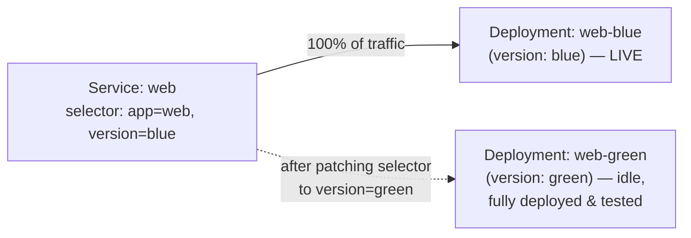
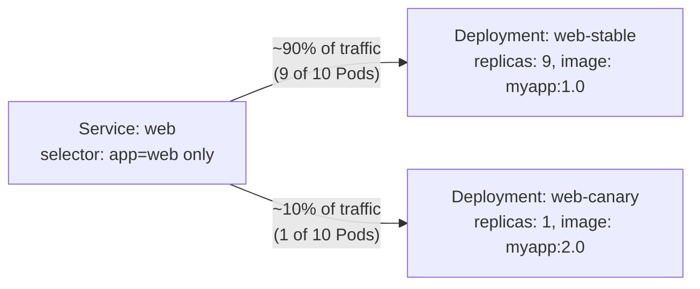
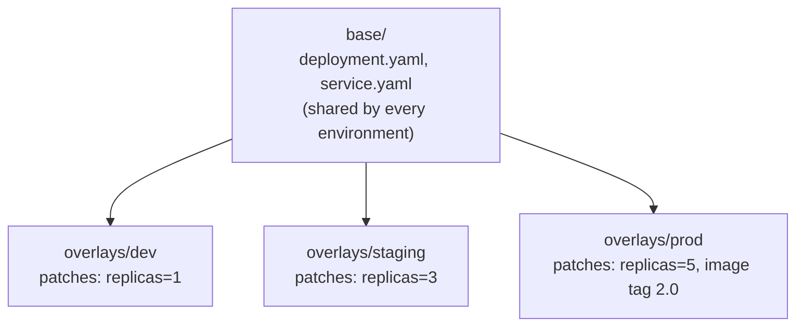

# Chapter 3 — Application Deployment (20%)

**⏱ Estimated time:** 1.5–2 hours across all four topics below. This chapter builds directly on the Deployment fundamentals from Chapter 2.2 — if those felt shaky, a quick review pays off here.

## Learning Objectives

By the end of this chapter, you should be able to:

- Configure `maxSurge`/`maxUnavailable` to control exactly how much capacity a rolling update can sacrifice.
- Explain when `Recreate` is the correct strategy instead of `RollingUpdate`, and why.
- Use `kubectl rollout` (status, history, undo, pause, resume) to manage and recover a deployment.
- Build a blue/green release using two Deployments and a Service selector switch.
- Build a canary release using two Deployments sharing a Service's selector, with traffic ratio controlled by replica count.
- Install, upgrade, and roll back an existing Helm chart, and inspect what values it was installed with.
- Apply environment-specific overlays to a shared base of manifests using Kustomize.

## 3.1 Deployments and Rolling Updates 🔴 MUST KNOW

**What it is.** A Deployment manages a ReplicaSet, which manages Pods. Updating a Deployment's Pod template triggers a new ReplicaSet and a controlled rollover from old Pods to new.

**Why CKAD tests it.** Shipping changes without downtime is the whole point of running on Kubernetes — this is directly tested with rollout status, history, and rollback tasks.

**Real-world why.** A bad rollout that takes down 100% of replicas at once is an outage; rolling updates keep some capacity serving traffic throughout.

**Rolling update strategy:**
```yaml
apiVersion: apps/v1
kind: Deployment
metadata:
  name: web
spec:
  replicas: 6
  strategy:
    type: RollingUpdate
    rollingUpdate:
      maxSurge: 2          # up to 2 extra Pods above desired count during rollout
      maxUnavailable: 1    # at most 1 Pod below desired count during rollout
  selector:
    matchLabels: {app: web}
  template:
    metadata: {labels: {app: web}}
    spec:
      containers:
      - name: web
        image: nginx:1.27
```

**Imperative:**
```bash
kubectl set image deployment/web nginx=nginx:1.28
kubectl rollout status deployment/web
kubectl rollout history deployment/web
kubectl rollout history deployment/web --revision=2
kubectl rollout undo deployment/web
kubectl rollout undo deployment/web --to-revision=2
kubectl rollout pause deployment/web
kubectl rollout resume deployment/web
kubectl rollout restart deployment/web
```

With `maxSurge: 2` and `maxUnavailable: 1` on 6 desired replicas, a rollout might progress like this — capacity never drops below 5, and never exceeds 8:



Each step waits for new Pods to pass their readiness probe before removing the next old Pod — this is exactly why a broken readiness probe on the new version makes a rollout "hang" instead of failing fast (see the troubleshooting table below).

### The other strategy: Recreate

`RollingUpdate` isn't the only option. `strategy.type: Recreate` kills every old Pod before creating any new ones — the opposite of zero-downtime, but sometimes required.

```yaml
spec:
  strategy:
    type: Recreate
```

🟡 **Use `Recreate` when the app can't tolerate two versions running simultaneously** — e.g., a schema migration that's incompatible between versions, or a single-writer workload where old and new Pods would corrupt shared state if both ran at once. It trades an outage window for the guarantee that only one version ever exists at a time. If a task says "the application cannot run two versions simultaneously," this is the field being tested.

**RollingUpdate vs Recreate, side by side:**

| | RollingUpdate | Recreate |
|---|---|---|
| Downtime | None (if probes are correct) | Yes — a gap between old Pods dying and new ones being ready |
| Versions running simultaneously | Yes, briefly | Never |
| Best for | Stateless apps, backward-compatible changes | Incompatible schema/version changes, single-writer workloads |
| Rollback speed | Fast — old ReplicaSet already exists at scale 0 | Same rollback mechanism, but a fresh outage window either way |

🟡 Add `--record` (or set `kubectl.kubernetes.io/change-cause` via annotation) so `rollout history` shows meaningful change descriptions instead of blank entries:
```bash
kubectl annotate deployment/web kubernetes.io/change-cause="bump nginx to 1.28"
```

**Verify:**
```bash
kubectl get deployment web
kubectl get rs -l app=web              # old + new ReplicaSets, watch counts shift
kubectl describe deployment web
```

**Troubleshoot:**

| Problem | Cause | Diagnostic | Fix |
|---|---|---|---|
| Rollout stuck | New Pods `CrashLoopBackOff`/`ImagePullBackOff`, `maxUnavailable` too restrictive | `kubectl rollout status`, `kubectl describe pod` (new RS) | Fix the underlying Pod issue or `rollout undo` |
| `rollout status` never finishes | Readiness probe on new Pods never succeeds | `kubectl describe pod`, `kubectl logs` | Fix probe or app startup |
| Old and new Pods both serving, unexpected mix | Rollout is mid-flight — this is normal | `kubectl get rs` | Wait, or pause/investigate |

> **🌍 Real-world example.** A ride-hailing app's driver-matching service deploys dozens of times a day. Their Deployment sets `maxUnavailable: 0, maxSurge: 25%` specifically so that during business hours a rollout never reduces serving capacity below 100% — new Pods must become Ready *before* any old Pod is torn down, at the cost of briefly running up to 25% more replicas than normal (and paying for that extra compute for the few minutes a rollout takes). A batch reporting job's Deployment, by contrast, is fine with `maxUnavailable: 50%` since a brief capacity dip doesn't affect end users. The same `strategy` fields get tuned completely differently based on what "acceptable risk" means for that specific workload.

> **📚 Theory.** A Deployment never edits Pods in place when the template changes — it creates a brand-new ReplicaSet with the updated template and scales it up while scaling the old ReplicaSet down. This is why `kubectl get rs` during a rollout shows two ReplicaSets with shifting replica counts, and why rollback is cheap: the old ReplicaSet (and its exact Pod template) still exists at scale 0, ready to be scaled back up instantly via `rollout undo` rather than needing to be reconstructed from memory.

---

## 🧪 Practice — Control and Roll Back a Rolling Update

### Task

Create Deployment `web` with 6 replicas using `nginx:1.27`. Configure a `RollingUpdate` strategy with `maxSurge: 2` and `maxUnavailable: 1`.

Change the image to `nginx:1.28`, watch the rollout, inspect the ReplicaSets, then roll back to the previous revision.

### Requirements

- Deployment: `web`
- Replicas: `6`
- Initial image: `nginx:1.27`
- Updated image: `nginx:1.28`
- `maxSurge: 2`
- `maxUnavailable: 1`
- Use `kubectl rollout status`, `history`, and `undo`.
- Verify that the old image is restored after rollback.

### Success Criteria

The Deployment uses the requested strategy, creates a new ReplicaSet during the update, and after rollback the active Pod template uses `nginx:1.27`.

### Suggested Time

**10 minutes**

<details>
<summary>💡 Hint</summary>

Set the strategy before changing the image. `kubectl get rs -l app=web` lets you see the old and new ReplicaSets during the rollout.

</details>

<details>
<summary>✅ Solution</summary>

```bash
kubectl create deployment web --image=nginx:1.27 --replicas=6
kubectl patch deployment web -p '{"spec":{"strategy":{"type":"RollingUpdate","rollingUpdate":{"maxSurge":2,"maxUnavailable":1}}}}'
kubectl set image deployment/web nginx=nginx:1.28
kubectl rollout status deployment/web
kubectl get rs -l app=web
kubectl rollout history deployment/web
kubectl rollout undo deployment/web
kubectl rollout status deployment/web
kubectl get deployment web -o jsonpath='{.spec.template.spec.containers[0].image}'
```

</details>

## 3.2 Deployment Strategies — Blue/Green and Canary 🔴 MUST KNOW

**What it is.** Kubernetes has no dedicated "blue/green" or "canary" object — you build both using ordinary Deployments, Services, and label selectors.

**Why CKAD tests it.** Explicitly named as AD-01: "use Kubernetes primitives to implement common deployment strategies." You're expected to assemble the pattern from Deployments + Services, not use a special resource.

**Real-world why.** RollingUpdate alone doesn't let you test a new version under real traffic before committing, or instantly cut traffic back on failure — blue/green and canary give you that control.

### Blue/Green

Run two full Deployments (`web-blue`, `web-green`) simultaneously; the Service's selector decides which one receives traffic. Switch traffic instantly by changing the Service selector.

```yaml
apiVersion: apps/v1
kind: Deployment
metadata:
  name: web-blue
spec:
  replicas: 3
  selector: {matchLabels: {app: web, version: blue}}
  template:
    metadata: {labels: {app: web, version: blue}}
    spec:
      containers: [{name: web, image: myapp:1.0}]
---
apiVersion: apps/v1
kind: Deployment
metadata:
  name: web-green
spec:
  replicas: 3
  selector: {matchLabels: {app: web, version: green}}
  template:
    metadata: {labels: {app: web, version: green}}
    spec:
      containers: [{name: web, image: myapp:2.0}]
---
apiVersion: v1
kind: Service
metadata:
  name: web
spec:
  selector:
    app: web
    version: blue        # cutover: change this to "green" and apply
  ports:
  - port: 80
```

```bash
kubectl patch service web -p '{"spec":{"selector":{"app":"web","version":"green"}}}'
```



The cutover is a single selector change on an existing Service — both Deployments already exist at full scale beforehand, which is what makes rollback just as instant as the original cutover: patch the selector back to `blue`.

### Canary

Run a small second Deployment with the same labels the Service already selects on, so the Service load-balances across both — the canary gets a proportional slice of traffic based on its replica count relative to the stable version.

```yaml
apiVersion: apps/v1
kind: Deployment
metadata:
  name: web-stable
spec:
  replicas: 9                          # ~90% of traffic
  selector: {matchLabels: {app: web, track: stable}}
  template:
    metadata: {labels: {app: web, track: stable}}
    spec:
      containers: [{name: web, image: myapp:1.0}]
---
apiVersion: apps/v1
kind: Deployment
metadata:
  name: web-canary
spec:
  replicas: 1                          # ~10% of traffic
  selector: {matchLabels: {app: web, track: canary}}
  template:
    metadata: {labels: {app: web, track: canary}}
    spec:
      containers: [{name: web, image: myapp:2.0}]
---
apiVersion: v1
kind: Service
metadata:
  name: web
spec:
  selector:
    app: web                            # note: no "track" — matches BOTH Deployments
  ports:
  - port: 80
```



Unlike blue/green, both versions receive traffic simultaneously here — the split is proportional to replica count because a Service load-balances evenly across every matching endpoint, with no separate weighting mechanism needed.

**Verify:**
```bash
kubectl get endpoints web -o wide       # confirm Pods from both Deployments are listed
for i in $(seq 1 20); do curl -s web | grep version; done   # observe traffic split
```

**Troubleshoot:**

| Problem | Cause | Fix |
|---|---|---|
| Canary gets 0% of traffic | Service selector still includes a label the canary Pods don't share (e.g., `version:`) | Align selector to only the labels both share |
| Blue/green cutover doesn't take effect | Wrong Service patched, or Service selector still pinned to old version label | `kubectl get svc -o yaml`, verify selector |
| Rollback after bad canary | Simply scale canary Deployment to 0 or delete it | `kubectl scale deployment web-canary --replicas=0` |

🔴 **Exam pattern:** if the task says "route only 10% of traffic to a new version without disrupting the stable version," it wants a canary via replica-count ratio and a shared-label Service — not `kubectl rollout` on a single Deployment.

> **🌍 Real-world example.** A social media company rolling out a new recommendation-ranking model doesn't trust a rolling update alone — a subtle ranking regression wouldn't crash any Pods or fail any probe, so a normal `RollingUpdate` would happily ship it to 100% of users. Instead they run it as a canary at 5% of traffic for an hour, watching business metrics (click-through rate, session length) rather than infrastructure metrics, before manually promoting it to 100%. This is the real reason canary and blue/green exist as *separate* concepts from rolling updates: rolling updates protect against infrastructure-level failure (crashes, failed health checks); canary and blue/green protect against business-logic regressions that Kubernetes itself has no way to detect.

**Blue/Green vs Canary — the distinction the exam expects you to know cold:**

| | Blue/Green | Canary |
|---|---|---|
| Traffic split | All-or-nothing (Service selector switch) | Proportional (replica-count ratio) |
| Both versions receive live traffic? | No — only whichever the selector currently matches | Yes — simultaneously |
| Rollback speed | Instant (repoint the selector) | Instant (scale canary to 0) |
| Resource cost | Double — both versions fully scaled | Low — canary usually runs 1-2 replicas |
| Best for | Clean cutover, easy instant rollback | Gradual exposure, real-traffic validation before full rollout |

---

## 🧪 Practice — Perform a Blue/Green Cutover

### Task

Create two Deployments: `web-blue` running `nginx:1.27` and `web-green` running `nginx:1.28`. Each must have 3 replicas. Create Service `web` so only blue initially receives traffic. Cut traffic over to green by changing the Service selector, then demonstrate rollback by pointing the Service back to blue.

### Requirements

- Both Deployments: 3 replicas.
- Shared label: `app=web`.
- Blue label: `version=blue`.
- Green label: `version=green`.
- Service `web` initially selects `app=web,version=blue`.
- Cutover changes the Service selector to `version=green`.
- Rollback changes it back to `version=blue`.

### Success Criteria

Before cutover, Service endpoints contain only blue Pods. After cutover, only green Pods are selected. After rollback, only blue Pods are selected.

### Suggested Time

**10 minutes**

<details>
<summary>💡 Hint</summary>

The Service selector is the traffic switch. Do not merge the two versions into one Deployment.

</details>

<details>
<summary>✅ Solution</summary>

Create both Deployments with selectors/templates containing the version label:

```yaml
# web-blue
spec:
  replicas: 3
  selector:
    matchLabels: {app: web, version: blue}
  template:
    metadata:
      labels: {app: web, version: blue}
    spec:
      containers:
      - name: web
        image: nginx:1.27
---
# web-green
spec:
  replicas: 3
  selector:
    matchLabels: {app: web, version: green}
  template:
    metadata:
      labels: {app: web, version: green}
    spec:
      containers:
      - name: web
        image: nginx:1.28
```

Service:

```yaml
apiVersion: v1
kind: Service
metadata:
  name: web
spec:
  selector:
    app: web
    version: blue
  ports:
  - port: 80
    targetPort: 80
```

Verify and switch:

```bash
kubectl get endpoints web
kubectl patch service web -p '{"spec":{"selector":{"app":"web","version":"green"}}}'
kubectl get endpoints web
kubectl patch service web -p '{"spec":{"selector":{"app":"web","version":"blue"}}}'
kubectl get endpoints web
```

</details>

## 3.3 Helm 🟡 SHOULD KNOW

**What it is.** A package manager for Kubernetes — a "chart" bundles templated manifests; `values.yaml` parameterizes them.

**Why CKAD tests it.** AD-03, explicitly in scope: "use the Helm package manager to deploy existing packages." You are not expected to author complex charts — you're expected to install, upgrade, inspect, and roll back existing ones.

**Real-world why.** Most real-world applications (databases, ingress controllers, monitoring stacks) ship as Helm charts rather than raw manifests.

**Commands:**
```bash
helm repo add bitnami https://charts.bitnami.com/bitnami
helm repo update
helm search repo bitnami/nginx
helm install my-release bitnami/nginx
helm install my-release bitnami/nginx --set replicaCount=3
helm install my-release bitnami/nginx -f custom-values.yaml
helm list
helm status my-release
helm show values bitnami/nginx
helm upgrade my-release bitnami/nginx --set replicaCount=5
helm rollback my-release 1
helm uninstall my-release
helm template my-release bitnami/nginx        # render manifests without installing
helm create mychart                            # scaffold a new chart
```

**Chart anatomy (🟢 for reading, not authoring from scratch):**
```
mychart/
  Chart.yaml
  values.yaml
  templates/
    deployment.yaml
    service.yaml
    _helpers.tpl
```

**Verify:**
```bash
helm list -A
helm get values my-release
kubectl get all -l app.kubernetes.io/instance=my-release
```

**Troubleshoot:**

| Problem | Cause | Fix |
|---|---|---|
| `helm install` fails, "already exists" | Release name or a resource it creates already exists | `helm list`, `helm uninstall` old release or pick a new name |
| Wrong values applied | `--set` and `-f` both used — later flag/file wins, order matters | `helm get values my-release` to confirm what actually took effect |
| Upgrade broke the release | Bad chart version or values change | `helm rollback my-release <previous-revision>` |

> **🌍 Real-world example.** Installing a production-grade Prometheus + Grafana monitoring stack from raw YAML would mean hand-writing dozens of interdependent manifests (Deployments, RBAC, ConfigMaps for dashboards, ServiceMonitors, PVCs) and keeping them all in sync across every environment. Almost every team instead runs `helm install` against the community `kube-prometheus-stack` chart, overriding perhaps a dozen `values.yaml` fields (retention period, storage size, ingress hostname) for their specific needs. This is the mainstream real-world use of Helm on CKAD's radar: consuming a well-maintained chart someone else wrote, not authoring one from scratch.

---

## 🧪 Practice — Install, Override, Upgrade, and Roll Back a Helm Release

### Task

Use an existing Helm chart available in the exam environment. Inspect its values, install a release named `ckad-web` with a replica override, upgrade the replica count, then roll back to the previous revision.

### Requirements

- Release name: `ckad-web`.
- Use an existing chart; do not author a chart from scratch.
- Inspect default values before installation.
- Supply a value override during installation.
- Perform an upgrade that changes a value.
- Verify release history and roll back to the earlier revision.

### Success Criteria

`helm list` shows `ckad-web`; `helm history` shows multiple revisions; after rollback the release is at the earlier revision and its earlier configuration is restored.

### Suggested Time

**10 minutes**

<details>
<summary>💡 Hint</summary>

Use `helm show values` before choosing the value. `helm history` gives you the revision number to roll back to.

</details>

<details>
<summary>✅ Solution</summary>

Example using a supplied/available NGINX chart:

```bash
helm show values <repo>/<chart> | less
helm install ckad-web <repo>/<chart> --set replicaCount=2
helm get values ckad-web
helm upgrade ckad-web <repo>/<chart> --set replicaCount=4
helm history ckad-web
helm rollback ckad-web 1
helm status ckad-web
helm get values ckad-web
```

Use the chart/repository supplied by the environment rather than assuming an external repository is available.

</details>

## 3.4 Kustomize 🟡 SHOULD KNOW

**What it is.** A template-free way to customize raw YAML using overlays and patches, built into `kubectl` (`kubectl apply -k`).

**Why CKAD tests it.** AD-04, explicitly in scope. Kustomize is how many teams manage the same base manifests across dev/staging/prod without Helm's templating.

**Real-world why.** You often want the *same* Deployment YAML in every environment except a couple of fields (replica count, image tag, a ConfigMap value) — Kustomize expresses that as small overlay diffs instead of duplicated files.

**Helm vs Kustomize — a common point of confusion:**

| | Helm | Kustomize |
|---|---|---|
| Approach | Templating (variables filled into a chart) | Patching (overlay diffs on top of plain YAML) |
| Best for | Consuming charts someone else wrote (databases, ingress controllers) | Managing your own manifests across environments |
| Built into `kubectl`? | No — separate `helm` binary | Yes — `kubectl apply -k` |
| Packaging concept | "Chart" with `values.yaml` | "Base" + "overlays", no packaging format |
| CKAD scope | Install/upgrade/rollback existing charts | Author your own overlays on your own base |

## 🧪 Practice — Build an Environment Overlay

### Task

Create a Kustomize base containing Deployment `web` and Service `web`. Create a `prod` overlay that changes the Deployment to 5 replicas, changes the application image tag to `2.0`, and generates a ConfigMap containing `MODE=prod`.

Render the overlay before applying it.

### Requirements

- Base contains Deployment and Service.
- Overlay references the base rather than duplicating resources.
- Production replicas: `5`.
- Production image tag: `2.0`.
- ConfigMap literal: `MODE=prod`.
- Use `kubectl kustomize` before `kubectl apply -k`.

### Success Criteria

The rendered production manifests show 5 replicas, image tag `2.0`, the generated ConfigMap, and the inherited Service without duplicating base resources.

### Suggested Time

**10 minutes**

<details>
<summary>💡 Hint</summary>

Render first with `kubectl kustomize overlays/prod`. Fix the overlay if the rendered output is not exactly what the task requires.

</details>

<details>
<summary>✅ Solution</summary>

Directory:

```text
base/
  deployment.yaml
  service.yaml
  kustomization.yaml
overlays/
  prod/
    kustomization.yaml
```

Base:

```yaml
resources:
- deployment.yaml
- service.yaml
```

Production overlay:

```yaml
resources:
- ../../base

patches:
- target:
    kind: Deployment
    name: web
  patch: |-
    - op: replace
      path: /spec/replicas
      value: 5

images:
- name: myapp
  newTag: "2.0"

configMapGenerator:
- name: app-config
  literals:
  - MODE=prod
```

Render and apply:

```bash
kubectl kustomize overlays/prod
kubectl apply -k overlays/prod
kubectl get deployment web
kubectl get configmap
```

</details>

**Base `kustomization.yaml`:**
```yaml
resources:
- deployment.yaml
- service.yaml
```

**Overlay (e.g., production):**
```yaml
# overlays/prod/kustomization.yaml
resources:
- ../../base
patches:
- target:
    kind: Deployment
    name: web
  patch: |-
    - op: replace
      path: /spec/replicas
      value: 5
images:
- name: myapp
  newTag: "2.0"
configMapGenerator:
- name: app-config
  literals:
  - MODE=prod
```



A fix to `base/deployment.yaml` (say, adding a new probe) automatically applies to every overlay — nothing needs to be duplicated or manually kept in sync.

**Commands:**
```bash
kubectl apply -k overlays/prod/
kubectl kustomize overlays/prod/          # render without applying — use to debug
kubectl delete -k overlays/prod/
```

**Verify:**
```bash
kubectl kustomize overlays/prod/ | less
kubectl get deployment web -o jsonpath='{.spec.replicas}'
```

**Troubleshoot:**

| Problem | Cause | Fix |
|---|---|---|
| `apply -k` applies unexpected resources | Base included in overlay's `resources:` unintentionally duplicates objects | Check `kustomization.yaml` resource list, render with `kubectl kustomize` first |
| Patch doesn't seem to apply | Wrong `target` (kind/name mismatch), or JSON path wrong | `kubectl kustomize` to see rendered output before applying |
| Generated ConfigMap name changes every apply | `configMapGenerator` appends a content hash by design | This is intentional (forces Pod rollout on config change) — reference the generated name via `kustomization.yaml`'s automatic substitution, not a hardcoded name |

> **🌍 Real-world example.** A platform team maintains one `base/` directory of Deployment, Service, and Ingress manifests for their internal API gateway, then three thin overlays — `overlays/dev`, `overlays/staging`, `overlays/prod` — each patching only replica count, resource limits, and an image tag. When a new field needs to be added to every environment's Deployment (say, a new probe), it's added once in `base/deployment.yaml` and every overlay inherits it automatically. This is Kustomize's core value proposition versus copy-pasting: eliminate the "I updated staging's YAML but forgot prod's" class of bug entirely, without needing Helm's templating language for teams who find raw YAML overlays simpler to reason about.

**Exam Tips — Chapter 3**
- Blue/green = two Deployments + a Service you repoint. Canary = two Deployments sharing the Service's selector, ratio controlled by replica counts. Know both cold — this is a favorite scenario-style task.
- `maxSurge`/`maxUnavailable` questions are almost always "why did the rollout behave this way" — read the current values with `kubectl get deployment -o yaml` before guessing.
- For Helm/Kustomize tasks, render first (`helm template` / `kubectl kustomize`) and read the output before applying — catches mistakes for free and costs no cluster state.
- `kubectl rollout undo --to-revision=N` beats trying to manually recreate an old spec from memory.

## Chapter Summary

| Topic | One-line takeaway |
|---|---|
| Rolling updates (3.1) | `maxSurge`/`maxUnavailable` control the capacity trade-off; `Recreate` trades an outage window for "never two versions at once" |
| Blue/Green & Canary (3.2) | Both are built from ordinary Deployments + Service selectors — no special Kubernetes object exists for either |
| Helm (3.3) | Package manager for *consuming* charts — CKAD expects install/upgrade/rollback, not authoring |
| Kustomize (3.4) | Template-free overlay patching, built into `kubectl apply -k` — one base, many thin per-environment diffs |

**Next:** Chapter 4 — Services and Networking (20%) covers how traffic actually reaches the Pods these deployment strategies manage — Services, Ingress, and NetworkPolicy.
\newpage

---

## 🧪 Practice — Chapter Challenge — Release a New Version Safely

### Task

A Deployment named `shop` currently runs 4 replicas of `nginx:1.27`. Introduce `nginx:1.28` using a canary first, then perform a controlled full release.

Use ordinary Deployments and a Service to keep the stable version serving while the canary is tested, verify the endpoints, promote the new version, and demonstrate rollback.

### Requirements

- Stable: `shop-stable`, 4 replicas, `nginx:1.27`.
- Canary: `shop-canary`, 1 replica, `nginx:1.28`.
- Service: `shop`.
- Both Pod templates share `app=shop`.
- Use a separate `track` label for stable/canary.
- Verify endpoints before promotion.
- Promotion must leave only `nginx:1.28` serving.
- Be able to restore stable if the release fails.

### Success Criteria

Before promotion, both stable and canary Pods are selected by the Service. After promotion, only the new version is serving. You can explain why this differs from blue/green.

### Suggested Time

**10 minutes**

<details>
<summary>💡 Hint</summary>

Use a common `app=shop` selector and separate `track` labels. A normal Service does not provide a percentage-weight field; replica counts determine the approximate split.

</details>

<details>
<summary>✅ Solution</summary>

Stable Pod template:

```yaml
labels:
  app: shop
  track: stable
```

Canary Pod template:

```yaml
labels:
  app: shop
  track: canary
```

Service:

```yaml
apiVersion: v1
kind: Service
metadata:
  name: shop
spec:
  selector:
    app: shop
  ports:
  - port: 80
    targetPort: 80
```

Create stable with 4 replicas and canary with 1 replica, then verify:

```bash
kubectl get endpoints shop
```

Promote:

```bash
kubectl scale deployment shop-canary --replicas=4
kubectl scale deployment shop-stable --replicas=0
kubectl get endpoints shop
```

Rollback:

```bash
kubectl scale deployment shop-stable --replicas=4
kubectl scale deployment shop-canary --replicas=0
```

The key exam pattern is that both versions share the Service's selector during the canary phase; the approximate traffic split follows the number of matching endpoints.

</details>

