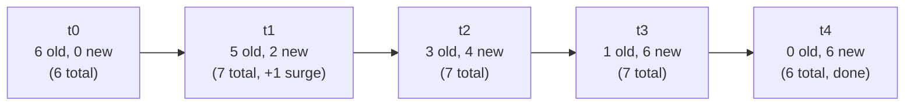
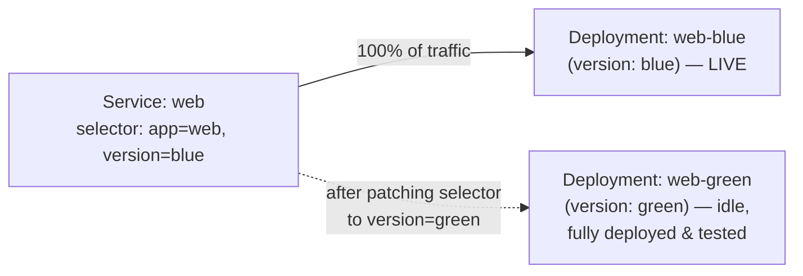
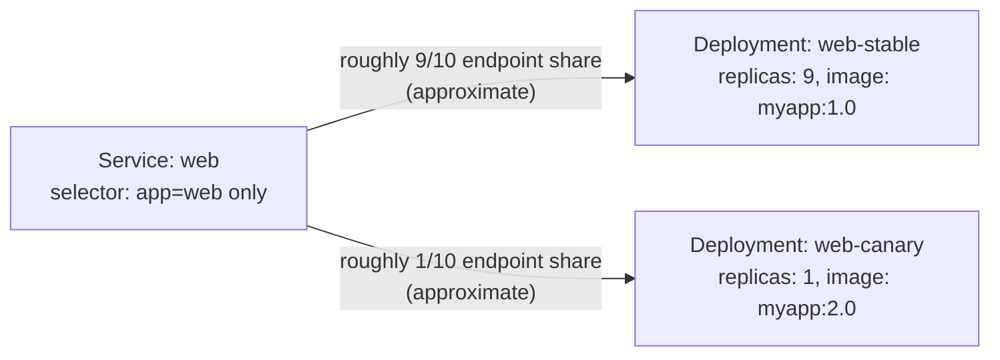
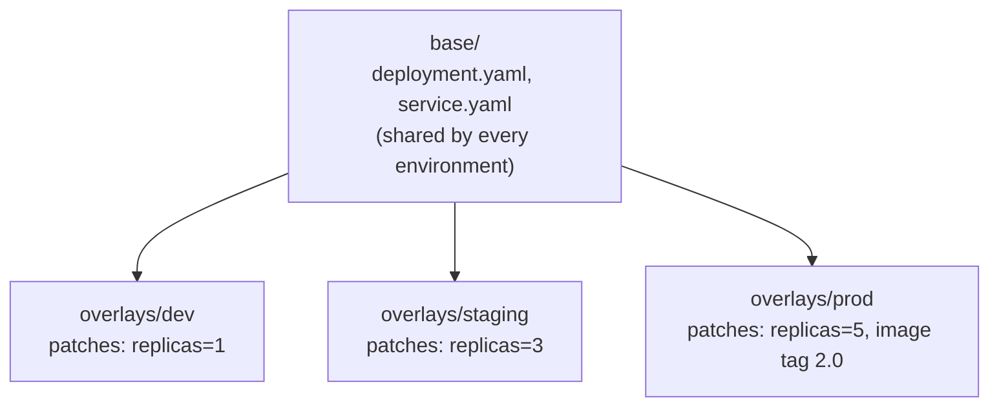

# Chapter 3 — Application Deployment (20%)

**⏱ Estimated time:** 1.5–2 hours across all four topics below. This chapter builds directly on the Deployment fundamentals from Chapter 2.2 — if those felt shaky, a quick review pays off here.

## Learning Objectives

By the end of this chapter, you should be able to:

- Configure `maxSurge`/`maxUnavailable` to control how much extra capacity may be created and how many desired replicas may be unavailable during a rolling update.
- Explain when `Recreate` is the correct strategy instead of `RollingUpdate`, and why.
- Use `kubectl rollout` (status, history, undo, pause, resume) to manage and recover a deployment.
- Build a blue/green release using two Deployments and a Service selector switch.
- Build a canary release using two Deployments sharing a Service's selector, with exposure influenced by the relative number of ready matching endpoints.
- Install, upgrade, and roll back an existing Helm chart, and inspect what values it was installed with.
- Apply environment-specific overlays to a shared base of manifests using Kustomize.

## 3.1 Deployments and Rolling Updates 🔴 MUST KNOW

**What it is.** A Deployment manages a ReplicaSet, which manages Pods. Updating a Deployment's Pod template triggers a new ReplicaSet and a controlled rollover from old Pods to new.

**Why CKAD tests it.** Controlled application updates are a core Kubernetes workload skill — CKAD tests rollout status, history, rollback, and strategy behavior.

**Real-world why.** A rolling update can maintain application capacity while a new version is introduced, but it is not an absolute zero-downtime guarantee: application failures, node failures, and readiness problems can still reduce availability.

**Rolling update strategy:**
```yaml
apiVersion: apps/v1
kind: Deployment
metadata:
  name: web
spec:
  replicas: 6
  strategy:
    type: RollingUpdate
    rollingUpdate:
      maxSurge: 2          # up to 2 non-terminating surge Pods above desired count during rollout
      maxUnavailable: 1    # at most 1 desired replica may be unavailable because of the rollout
  selector:
    matchLabels: {app: web}
  template:
    metadata: {labels: {app: web}}
    spec:
      containers:
      - name: web
        image: nginx:1.27
```

**Imperative:**
```bash
kubectl set image deployment/web nginx=nginx:1.28
kubectl rollout status deployment/web
kubectl rollout history deployment/web
kubectl rollout history deployment/web --revision=2
kubectl rollout undo deployment/web
kubectl rollout undo deployment/web --to-revision=2
kubectl rollout pause deployment/web
kubectl rollout resume deployment/web
kubectl rollout restart deployment/web
```

**Rollback note:** `kubectl rollout undo` needs a previous revision. If the Deployment only has revision 1, there is nothing to roll back to and the command returns an error.

**Rollback scope:** a Deployment rollback restores the selected revision's **Pod template**. It does not roll back unrelated fields such as the current replica count, so treat scaling as a separate operation. Also note that changing only `spec.replicas` does not create a new Deployment revision.

With `maxSurge: 2` and `maxUnavailable: 1` on 6 desired replicas, the normal controller bounds are up to 8 non-terminating Pods and at least 5 available replicas during the update. These are controller constraints, not absolute cluster-wide guarantees: terminating Pods can temporarily remain on nodes and push the total number of Pods and resource consumption above `replicas + maxSurge` until termination completes. Percentage values are rounded differently: `maxSurge` rounds up, while `maxUnavailable` rounds down.

For stalled rollouts, `spec.progressDeadlineSeconds` controls how long Kubernetes waits for deployment progress before surfacing `ProgressDeadlineExceeded` in Deployment status (600 seconds by default). It reports the condition; it does not automatically roll the Deployment back.



The Deployment controller continuously reconciles the old and new ReplicaSets against the `maxSurge`/`maxUnavailable` constraints. New Pods need to become available before the controller can remove enough old capacity to cross the configured availability bound, so a broken readiness probe can leave a rollout stalled rather than producing a fast failure.

### The other strategy: Recreate

`RollingUpdate` isn't the only option. `strategy.type: Recreate` kills every old Pod before creating any new ones — the opposite of zero-downtime, but sometimes required.

```yaml
spec:
  strategy:
    type: Recreate
```

🟡 **Use `Recreate` when the app can't tolerate two versions running simultaneously** — e.g., a schema migration that's incompatible between versions, or a single-writer workload where old and new Pods would corrupt shared state if both ran at once. It trades an outage window for the guarantee that only one version ever exists at a time. If a task says "the application cannot run two versions simultaneously," this is the field being tested.

**RollingUpdate vs Recreate, side by side:**

| | RollingUpdate | Recreate |
|---|---|---|
| Downtime | Intended to maintain availability; not an absolute guarantee | Yes — a gap between old Pods being removed and new ones being ready |
| Versions running simultaneously | Yes, briefly | Never |
| Best for | Stateless apps, backward-compatible changes | Incompatible schema/version changes, single-writer workloads |
| Rollback speed | Fast — old ReplicaSet already exists at scale 0 | Same rollback mechanism, but a fresh outage window either way |

🟡 Add a change-cause annotation **before** changing the Pod template if you want the new revision in `rollout history` to show a meaningful description:
```bash
kubectl annotate deployment/web kubernetes.io/change-cause="bump nginx to 1.28"
```
The annotation is copied into the revision when that revision is created.

**Verify:**
```bash
kubectl get deployment web
kubectl get rs -l app=web              # old + new ReplicaSets, watch counts shift
kubectl describe deployment web
```

**Troubleshoot:**

| Problem | Cause | Diagnostic | Fix |
|---|---|---|---|
| Rollout stuck | New Pods `CrashLoopBackOff`/`ImagePullBackOff`, insufficient capacity, or a very conservative rollout configuration | `kubectl rollout status`, `kubectl describe pod` (new RS) | Fix the underlying Pod issue, adjust the strategy if appropriate, or `rollout undo` |
| `rollout status` never finishes | Readiness probe on new Pods never succeeds | `kubectl describe pod`, `kubectl logs` | Fix probe or app startup |
| Old and new Pods both serving, unexpected mix | Rollout is mid-flight — this is normal | `kubectl get rs` | Wait, or pause/investigate |

> **🌍 Real-world example.** A ride-hailing app's driver-matching service deploys dozens of times a day. Their Deployment sets `maxUnavailable: 0, maxSurge: 25%` specifically so that during business hours a rollout never reduces serving capacity below 100% — new Pods must become Ready *before* any old Pod is torn down, at the cost of briefly running up to 25% more replicas than normal (and paying for that extra compute for the few minutes a rollout takes). A batch reporting job's Deployment, by contrast, is fine with `maxUnavailable: 50%` since a brief capacity dip doesn't affect end users. The same `strategy` fields get tuned completely differently based on what "acceptable risk" means for that specific workload.

> **📚 Theory.** A Deployment never edits Pods in place when the template changes — it creates a brand-new ReplicaSet with the updated template and scales it up while scaling the old ReplicaSet down. This is why `kubectl get rs` during a rollout shows two ReplicaSets with shifting replica counts, and why rollback is cheap: the old ReplicaSet (and its exact Pod template) still exists at scale 0, ready to be scaled back up instantly via `rollout undo` rather than needing to be reconstructed from memory.

---

## 🧪 Practice — Control and Roll Back a Rolling Update

### Task

Create Deployment `web` with 6 replicas using `nginx:1.27`. Configure a `RollingUpdate` strategy with `maxSurge: 2` and `maxUnavailable: 1`.

Change the image to `nginx:1.28`, watch the rollout, inspect the ReplicaSets, then roll back to the previous revision.

### Requirements

- Deployment: `web`
- Replicas: `6`
- Initial image: `nginx:1.27`
- Updated image: `nginx:1.28`
- `maxSurge: 2`
- `maxUnavailable: 1`
- Use `kubectl rollout status`, `history`, and `undo`.
- Verify that the old image is restored after rollback.

### Success Criteria

The Deployment uses the requested strategy, creates a new ReplicaSet during the update, and after rollback the active Pod template uses `nginx:1.27`.

### Suggested Time

**10 minutes**

<details>
<summary>💡 Hint</summary>

Set the strategy before changing the image. `kubectl get rs -l app=web` lets you see the old and new ReplicaSets during the rollout.

</details>

<details>
<summary>✅ Solution</summary>

```bash
kubectl create deployment web --image=nginx:1.27 --replicas=6
kubectl patch deployment web -p '{"spec":{"strategy":{"type":"RollingUpdate","rollingUpdate":{"maxSurge":2,"maxUnavailable":1}}}}'
kubectl set image deployment/web nginx=nginx:1.28
kubectl rollout status deployment/web
kubectl get rs -l app=web
kubectl rollout history deployment/web
kubectl rollout undo deployment/web
kubectl rollout status deployment/web
kubectl get deployment web -o jsonpath='{.spec.template.spec.containers[0].image}'
```

</details>

## 3.2 Deployment Strategies — Blue/Green and Canary 🔴 MUST KNOW

**What it is.** Kubernetes has no dedicated "blue/green" or "canary" object — you build both using ordinary Deployments, Services, and label selectors.

**Why CKAD tests it.** Explicitly named as AD-01: "use Kubernetes primitives to implement common deployment strategies." You're expected to assemble the pattern from Deployments + Services, not use a special resource.

**Real-world why.** RollingUpdate alone does not provide a separate stable/canary traffic-selection mechanism; blue/green and canary patterns let you stage or expose versions independently.

### Blue/Green

Run two full Deployments (`web-blue`, `web-green`) simultaneously; once their Pods are Ready, the Service's selector decides which one receives traffic. Switch traffic by changing the Service selector; the EndpointSlice update is asynchronous, so verify the resulting endpoints after the change rather than treating the cutover as literally instantaneous.

```yaml
apiVersion: apps/v1
kind: Deployment
metadata:
  name: web-blue
spec:
  replicas: 3
  selector: {matchLabels: {app: web, version: blue}}
  template:
    metadata: {labels: {app: web, version: blue}}
    spec:
      containers: [{name: web, image: myapp:1.0}]
---
apiVersion: apps/v1
kind: Deployment
metadata:
  name: web-green
spec:
  replicas: 3
  selector: {matchLabels: {app: web, version: green}}
  template:
    metadata: {labels: {app: web, version: green}}
    spec:
      containers: [{name: web, image: myapp:2.0}]
---
apiVersion: v1
kind: Service
metadata:
  name: web
spec:
  selector:
    app: web
    version: blue        # cutover: change this to "green" and apply
  ports:
  - port: 80
```

```bash
kubectl patch service web -p '{"spec":{"selector":{"app":"web","version":"green"}}}'
```



The cutover is a single selector change on an existing Service — both Deployments already exist at full scale beforehand, which makes rollback rapid once the Service's EndpointSlices converge: patch the selector back to `blue`.

### Canary

Run a small second Deployment whose Pods share the labels selected by the Service, so both versions are eligible endpoints. In a simple configuration, replica counts can influence the observed traffic share, but ordinary Services do not provide exact percentage weighting; session affinity, topology-aware traffic distribution, and the Service proxy implementation can change the distribution.

```yaml
apiVersion: apps/v1
kind: Deployment
metadata:
  name: web-stable
spec:
  replicas: 9                          # approximately 9/10 of matching endpoints
  selector: {matchLabels: {app: web, track: stable}}
  template:
    metadata: {labels: {app: web, track: stable}}
    spec:
      containers: [{name: web, image: myapp:1.0}]
---
apiVersion: apps/v1
kind: Deployment
metadata:
  name: web-canary
spec:
  replicas: 1                          # approximately 1/10 of matching endpoints
  selector: {matchLabels: {app: web, track: canary}}
  template:
    metadata: {labels: {app: web, track: canary}}
    spec:
      containers: [{name: web, image: myapp:2.0}]
---
apiVersion: v1
kind: Service
metadata:
  name: web
spec:
  selector:
    app: web                            # note: no "track" — matches BOTH Deployments
  ports:
  - port: 80
```



Unlike blue/green, both versions can receive traffic simultaneously here when their Pods are Ready — replica counts can influence approximate exposure because a Service routes across matching endpoints, but ordinary Kubernetes Service routing does not provide an exact percentage-weighting guarantee.

**Verify:**
```bash
kubectl get pods -l app=web -L track -o wide
kubectl get endpointslice -l kubernetes.io/service-name=web -o wide
```
Compare Pod IPs with EndpointSlice addresses to verify that both `stable` and `canary` Pods are eligible endpoints. Do not treat a short request sample as proof of an exact traffic percentage.

**Troubleshoot:**

| Problem | Cause | Fix |
|---|---|---|
| Canary gets 0% of traffic | Service selector excludes the canary Pods, or canary Pods are not Ready | Inspect selector and EndpointSlices; verify Pod readiness | Align the shared selector and fix readiness |
| Blue/green cutover doesn't take effect | Wrong Service patched, or Service selector still pinned to old version label | `kubectl get svc -o yaml`, verify selector |
| Rollback after bad canary | Simply scale canary Deployment to 0 or delete it | `kubectl scale deployment web-canary --replicas=0` |

🔴 **CKAD-style pattern:** when a task asks for a canary using only ordinary Deployments and a Service, use shared selector labels so both versions are eligible. Treat replica-count-based exposure as approximate, not an exact 10%/90% guarantee.

> **🌍 Real-world example.** A social media company rolling out a new recommendation-ranking model doesn't trust a rolling update alone — a subtle ranking regression wouldn't crash any Pods or fail any probe, so a normal `RollingUpdate` would happily ship it to 100% of users. Instead they run it as a canary at 5% of traffic for an hour, watching business metrics (click-through rate, session length) rather than infrastructure metrics, before manually promoting it to 100%. This is the real reason canary and blue/green exist as *separate* concepts from rolling updates: rolling updates protect against infrastructure-level failure (crashes, failed health checks); canary and blue/green protect against business-logic regressions that Kubernetes itself has no way to detect.

> **📚 Theory.** Neither pattern is a dedicated Kubernetes resource — both are built from ordinary Deployments and Services. A Service selects Pods in **its own namespace** by labels; it does not care which Deployment owns a selected Pod. Blue/green works by changing the selector so a different pre-existing set of Pods becomes eligible. Canary works by selecting only labels shared by both versions. Replica counts can influence the number of eligible endpoints, but the observed traffic distribution is implementation/configuration dependent rather than an exact percentage rule; for example, session affinity or `trafficDistribution` can affect which endpoint receives a request. Chapter 4 covers how the EndpointSlice list is built and kept in sync.

**Blue/Green vs Canary — the distinction the exam expects you to know cold:**

| | Blue/Green | Canary |
|---|---|---|
| Traffic approach | All-or-nothing (Service selector switch) | Both versions selected simultaneously; exposure is approximate |
| Both versions receive live traffic? | No — only whichever the selector currently matches | Yes — simultaneously |
| Rollback speed | Rapid after endpoint convergence | Rapid after endpoint convergence |
| Resource cost | Double — both versions fully scaled | Low — canary usually runs 1-2 replicas |
| Best for | Clean cutover, rapid selector-based rollback | Gradual exposure, real-traffic validation before full rollout |

---

## 🧪 Practice — Perform a Blue/Green Cutover

### Task

Create two Deployments: `web-blue` running `nginx:1.27` and `web-green` running `nginx:1.28`. Each must have 3 replicas. Create Service `web` so only blue initially receives traffic. Cut traffic over to green by changing the Service selector, then demonstrate rollback by pointing the Service back to blue.

### Requirements

- Both Deployments: 3 replicas.
- Shared label: `app=web`.
- Blue label: `version=blue`.
- Green label: `version=green`.
- Service `web` initially selects `app=web,version=blue`.
- Cutover changes the Service selector to `version=green`.
- Rollback changes it back to `version=blue`.

### Success Criteria

Before cutover, Service endpoints contain only blue Pods. After cutover, only green Pods are selected. After rollback, only blue Pods are selected.

### Suggested Time

**10 minutes**

<details>
<summary>💡 Hint</summary>

The Service selector is the traffic switch. Do not merge the two versions into one Deployment.

</details>

<details>
<summary>✅ Solution</summary>

Create both Deployments with selectors/templates containing the version label:

```yaml
# web-blue
spec:
  replicas: 3
  selector:
    matchLabels: {app: web, version: blue}
  template:
    metadata:
      labels: {app: web, version: blue}
    spec:
      containers:
      - name: web
        image: nginx:1.27
---
# web-green
spec:
  replicas: 3
  selector:
    matchLabels: {app: web, version: green}
  template:
    metadata:
      labels: {app: web, version: green}
    spec:
      containers:
      - name: web
        image: nginx:1.28
```

Service:

```yaml
apiVersion: v1
kind: Service
metadata:
  name: web
spec:
  selector:
    app: web
    version: blue
  ports:
  - port: 80
    targetPort: 80
```

Verify and switch:

```bash
kubectl get endpointslice -l kubernetes.io/service-name=web
kubectl patch service web -p '{"spec":{"selector":{"app":"web","version":"green"}}}'
kubectl get endpointslice -l kubernetes.io/service-name=web
kubectl patch service web -p '{"spec":{"selector":{"app":"web","version":"blue"}}}'
kubectl get endpointslice -l kubernetes.io/service-name=web
```

</details>

---

## 🧪 Practice — Run a Canary Release

### Task

Create Deployment `api-stable` (8 replicas, image `myapi:1.0`, labels `app=api,track=stable`) and Deployment `api-canary` (2 replicas, image `myapi:2.0`, labels `app=api,track=canary`). Create Service `api` that selects only `app=api` — not `track` — so it matches both.

Confirm both track values appear in the Service's endpoints, then roll back the canary by scaling it to 0.

### Requirements

- Deployments: `api-stable` (8 replicas, `myapi:1.0`), `api-canary` (2 replicas, `myapi:2.0`).
- Shared label: `app=api`. Distinguishing label: `track`.
- Service `api` selector: `app=api` only.
- Verify both `stable` and `canary` Pods are eligible endpoints simultaneously.
- Roll back by scaling `api-canary` to 0, not by deleting the Service or editing its selector.

### Success Criteria

While both Deployments are scaled up, `kubectl get endpointslice` for `api` shows Pods from both track values. After scaling `api-canary` to 0, only `stable` Pods remain as endpoints, and the Service itself was never touched.

### Suggested Time

**8 minutes**

<details>
<summary>💡 Hint</summary>

The only thing that makes this a canary rather than two unrelated Deployments is that the Service's selector deliberately omits the `track` label. If you accidentally include `track` in the selector, only one Deployment's Pods will ever match.

</details>

<details>
<summary>✅ Solution</summary>

```yaml
apiVersion: apps/v1
kind: Deployment
metadata:
  name: api-stable
spec:
  replicas: 8
  selector:
    matchLabels: {app: api, track: stable}
  template:
    metadata:
      labels: {app: api, track: stable}
    spec:
      containers:
      - name: api
        image: myapi:1.0
---
apiVersion: apps/v1
kind: Deployment
metadata:
  name: api-canary
spec:
  replicas: 2
  selector:
    matchLabels: {app: api, track: canary}
  template:
    metadata:
      labels: {app: api, track: canary}
    spec:
      containers:
      - name: api
        image: myapi:2.0
---
apiVersion: v1
kind: Service
metadata:
  name: api
spec:
  selector:
    app: api
  ports:
  - port: 80
    targetPort: 80
```

Verify both tracks are being served, then roll back:

```bash
kubectl apply -f api-canary-release.yaml
kubectl get endpointslice -l kubernetes.io/service-name=api -o wide
# expect endpoints from both api-stable and api-canary Pods

kubectl scale deployment api-canary --replicas=0
kubectl get endpointslice -l kubernetes.io/service-name=api -o wide
# expect only api-stable Pods remain
```

</details>

## 3.3 Helm 🟡 SHOULD KNOW

**What it is.** A package manager for Kubernetes — a "chart" bundles templated manifests; `values.yaml` parameterizes them.

**Why CKAD tests it.** AD-03, explicitly in scope: use the Helm package manager to deploy existing packages. You should know how to inspect, install, upgrade, and roll back existing charts; complex chart authoring is outside this chapter's focus.

**Real-world why.** Most real-world applications (databases, ingress controllers, monitoring stacks) ship as Helm charts rather than raw manifests.

**Commands:**
```bash
helm repo add bitnami https://charts.bitnami.com/bitnami
helm repo update
helm search repo bitnami/nginx
helm install my-release bitnami/nginx
helm install my-release bitnami/nginx --set replicaCount=3
helm install my-release bitnami/nginx -f custom-values.yaml
helm list
helm status my-release
helm show values bitnami/nginx
helm upgrade my-release bitnami/nginx --set replicaCount=5
helm rollback my-release 1
helm uninstall my-release
helm template my-release bitnami/nginx        # render manifests without installing
helm create mychart                            # scaffold a new chart
```

**Chart anatomy (🟢 for reading, not authoring from scratch):**
```
mychart/
  Chart.yaml
  values.yaml
  templates/
    deployment.yaml
    service.yaml
    _helpers.tpl
```

**Verify:**
```bash
helm list -A
helm get values my-release              # user-supplied values
helm get values my-release --all         # include computed chart values
kubectl get all -l app.kubernetes.io/instance=my-release
```

**Troubleshoot:**

| Problem | Cause | Fix |
|---|---|---|
| `helm install` fails, "already exists" | Release name or a resource it creates already exists | `helm list`, `helm uninstall` old release or pick a new name |
| Wrong values applied | A values file, `--set`, or multiple overrides specify the same key; `--set` has higher precedence than `-f`, while repeated `-f`/`--set` flags use the right-most value | `helm get values my-release` to confirm what actually took effect |
| Upgrade broke the release | Bad chart version or values change | `helm rollback my-release <previous-revision>` |

> **🌍 Real-world example.** Installing a production-grade Prometheus + Grafana monitoring stack from raw YAML would mean hand-writing dozens of interdependent manifests (Deployments, RBAC, ConfigMaps for dashboards, ServiceMonitors, PVCs) and keeping them all in sync across every environment. Almost every team instead runs `helm install` against the community `kube-prometheus-stack` chart, overriding perhaps a dozen `values.yaml` fields (retention period, storage size, ingress hostname) for their specific needs. This is the mainstream real-world use of Helm on CKAD's radar: consuming a well-maintained chart someone else wrote, not authoring one from scratch.

> **📚 Theory.** A Helm release stores its release state, including the rendered manifest and configuration used for each revision. With the default Secrets storage backend, that release history is stored in Kubernetes Secrets in the release namespace. `helm rollback` restores the selected earlier configuration by creating a **new release revision**; it does not make the current revision number move backward. This is analogous to Deployment rollback: prior state is retained so it can be restored without reconstructing it manually.

---

## 🧪 Practice — Install, Override, Upgrade, and Roll Back a Helm Release

### Task

Use an existing Helm chart available in the practice environment. Inspect its values, install a release named `ckad-web` with a replica override, upgrade the replica count, then roll back to the previous revision.

### Requirements

- Release name: `ckad-web`.
- Use an existing chart; do not author a chart from scratch.
- Inspect default values before installation.
- Supply a value override during installation.
- Perform an upgrade that changes a value.
- Verify release history and roll back so the earlier configuration is restored.

### Success Criteria

`helm list` shows `ckad-web`; `helm history` shows multiple revisions; after rollback the release has **a new revision** whose configuration matches the selected earlier revision.

### Suggested Time

**10 minutes**

<details>
<summary>💡 Hint</summary>

Use `helm show values` before choosing the value. `helm history` gives you the revision number to roll back to.

</details>

<details>
<summary>✅ Solution</summary>

Example using a supplied/available NGINX chart:

```bash
helm show values <repo>/<chart> | less
helm install ckad-web <repo>/<chart> -n staging --create-namespace --set replicaCount=2
helm get values ckad-web
helm upgrade ckad-web <repo>/<chart> --set replicaCount=4
helm history ckad-web
helm rollback ckad-web 1
helm history ckad-web
helm status ckad-web
helm get values ckad-web
```

Use the chart/repository supplied by the environment rather than assuming an external repository is available.

</details>

## 3.4 Kustomize 🟡 SHOULD KNOW

**What it is.** A template-free way to customize raw YAML using overlays and patches, built into `kubectl` (`kubectl apply -k`). Kustomize supports both Strategic Merge-style patches and JSON 6902 patches; the latter uses operations such as `replace`, `add`, and `remove` with explicit JSON paths.

**Why CKAD tests it.** AD-04, explicitly in scope. Kustomize is how many teams manage the same base manifests across dev/staging/prod without Helm's templating.

**Real-world why.** You often want the *same* Deployment YAML in every environment except a couple of fields (replica count, image tag, a ConfigMap value) — Kustomize expresses that as small overlay diffs instead of duplicated files.

### Strategic Merge example

For simple field changes on Kubernetes resources that support strategic merge, a small patch can be faster than JSON pointer syntax:

```yaml
apiVersion: apps/v1
kind: Deployment
metadata:
  name: web
spec:
  template:
    spec:
      containers:
      - name: web
        image: nginx:1.28
```

This contrasts with JSON 6902 patches, which use explicit operations such as `replace` and JSON paths. Not every resource supports strategic merge semantics; JSON 6902 is the general option when you need arbitrary field targeting.

**Helm vs Kustomize — a common point of confusion:**

| | Helm | Kustomize |
|---|---|---|
| Approach | Templating (variables filled into a chart) | Patching (overlay diffs on top of plain YAML) |
| Best for | Consuming charts someone else wrote (databases, ingress controllers) | Managing your own manifests across environments |
| Built into `kubectl`? | No — separate `helm` binary | Yes — `kubectl apply -k` |
| Packaging concept | "Chart" with `values.yaml` | "Base" + "overlays", no packaging format |
| CKAD scope | Install/upgrade/rollback existing charts | Author your own overlays on your own base |
| Rollback mechanism | `helm rollback <rev>` restores a stored prior revision natively | No built-in equivalent — reapplying a previous overlay (or `git revert` on the overlay files) is how you go back |

**Base `kustomization.yaml`:**
```yaml
apiVersion: kustomize.config.k8s.io/v1beta1
kind: Kustomization
resources:
- deployment.yaml
- service.yaml
```

**Overlay (e.g., production):**
```yaml
# overlays/prod/kustomization.yaml
apiVersion: kustomize.config.k8s.io/v1beta1
kind: Kustomization
resources:
- ../../base
patches:
- target:
    kind: Deployment
    name: web
  patch: |-
    - op: replace
      path: /spec/replicas
      value: 5
images:
- name: myapp
  newTag: "2.0"
configMapGenerator:
- name: app-config
  literals:
  - MODE=prod
```



A fix to `base/deployment.yaml` (say, adding a new probe) automatically applies to every overlay — nothing needs to be duplicated or manually kept in sync.

**Commands:**
```bash
kubectl apply -k overlays/prod/
kubectl kustomize overlays/prod/          # render without applying — use to debug
kubectl delete -k overlays/prod/
```

**Verify:**
```bash
kubectl kustomize overlays/prod/ | less
kubectl get deployment web -o jsonpath='{.spec.replicas}'
```

**Troubleshoot:**

| Problem | Cause | Fix |
|---|---|---|
| `apply -k` applies unexpected resources | Base included in overlay's `resources:` unintentionally duplicates objects | Check `kustomization.yaml` resource list, render with `kubectl kustomize` first |
| Patch doesn't seem to apply | Wrong `target` (kind/name mismatch), or JSON path wrong | `kubectl kustomize` to see rendered output before applying |
| Generated ConfigMap name changes every apply | `configMapGenerator` appends a content hash by design | This is intentional (forces Pod rollout on config change) — reference the generated name via `kustomization.yaml`'s automatic substitution, not a hardcoded name |

> **🌍 Real-world example.** A platform team maintains one `base/` directory of Deployment, Service, and Ingress manifests for their internal API gateway, then three thin overlays — `overlays/dev`, `overlays/staging`, `overlays/prod` — each patching only replica count, resource limits, and an image tag. When a new field needs to be added to every environment's Deployment (say, a new probe), it's added once in `base/deployment.yaml` and every overlay inherits it automatically. This is Kustomize's core value proposition versus copy-pasting: eliminate the "I updated staging's YAML but forgot prod's" class of bug entirely, without needing Helm's templating language for teams who find raw YAML overlays simpler to reason about.

> **📚 Theory.** Kustomize has no client-server model and no in-cluster memory of what it applied — `kubectl apply -k overlays/prod/` is conceptually just `kubectl kustomize overlays/prod/ | kubectl apply -f -`, a one-shot rendering step with nothing stored afterward about *how* those manifests came to be. This is the direct opposite of Helm's per-revision Secret (3.3) and explains a question learners often ask: "why isn't there a `kustomize rollback`?" There's nothing to roll back to — Kustomize's only source of truth is whatever's on disk right now, so "rollback" means going back to a previous version of the overlay files themselves (a `git revert`, typically), not asking a tool to restore a state it never tracked in the first place.

## 🧪 Practice — Build an Environment Overlay

### Task

Create a Kustomize base containing Deployment `web` (using image `myapp:1.0`) and Service `web`. Create a `prod` overlay that changes the Deployment to 5 replicas, changes the application image tag to `2.0`, and generates a ConfigMap containing `MODE=prod`.

Render the overlay before applying it.

### Requirements

- Base contains Deployment and Service.
- Overlay references the base rather than duplicating resources.
- Production replicas: `5`.
- Production image tag: `2.0`.
- ConfigMap literal: `MODE=prod`.
- Use `kubectl kustomize` before `kubectl apply -k`.

### Success Criteria

The rendered production manifests show 5 replicas, image tag `2.0`, the generated ConfigMap, and the inherited Service without duplicating base resources.

### Suggested Time

**10 minutes**

<details>
<summary>💡 Hint</summary>

Render first with `kubectl kustomize overlays/prod`. Fix the overlay if the rendered output is not exactly what the task requires.

</details>

<details>
<summary>✅ Solution</summary>

Directory:

```text
base/
  deployment.yaml
  service.yaml
  kustomization.yaml
overlays/
  prod/
    kustomization.yaml
```

Base `kustomization.yaml`:

```yaml
apiVersion: kustomize.config.k8s.io/v1beta1
kind: Kustomization
resources:
- deployment.yaml
- service.yaml
```

Base `deployment.yaml`:

```yaml
apiVersion: apps/v1
kind: Deployment
metadata:
  name: web
spec:
  replicas: 2
  selector:
    matchLabels:
      app: web
  template:
    metadata:
      labels:
        app: web
    spec:
      containers:
      - name: web
        image: myapp:1.0
        ports:
        - containerPort: 80
```

Base `service.yaml`:

```yaml
apiVersion: v1
kind: Service
metadata:
  name: web
spec:
  selector:
    app: web
  ports:
  - port: 80
    targetPort: 80
```

Production overlay:

```yaml
apiVersion: kustomize.config.k8s.io/v1beta1
kind: Kustomization
resources:
- ../../base

patches:
- target:
    kind: Deployment
    name: web
  patch: |-
    - op: replace
      path: /spec/replicas
      value: 5

images:
- name: myapp
  newTag: "2.0"

configMapGenerator:
- name: app-config
  literals:
  - MODE=prod
```

Render and apply:

```bash
kubectl kustomize overlays/prod
kubectl apply -k overlays/prod
kubectl get deployment web
kubectl get configmap
```

</details>
**Exam Tips — Chapter 3**
- Blue/green = two Deployments + a Service you repoint. Canary = two Deployments sharing the Service's selector, with exposure influenced by endpoint/replica distribution. Know both patterns well.
- `maxSurge`/`maxUnavailable` questions often reduce to "why did the rollout behave this way" — read the current values with `kubectl get deployment -o yaml` before guessing.
- For Helm/Kustomize tasks, render first (`helm template` / `kubectl kustomize`) and read the output before applying — catches mistakes for free and costs no cluster state.
- `kubectl rollout undo --to-revision=N` beats trying to manually recreate an old spec from memory.

## Chapter Summary

| Topic | One-line takeaway |
|---|---|
| Rolling updates (3.1) | `maxSurge`/`maxUnavailable` bound rollout capacity and availability; `Recreate` trades an outage window for non-overlapping versions |
| Blue/Green & Canary (3.2) | Both are built from ordinary Deployments + Service selectors — no special Kubernetes object exists for either; a Service selects eligible Pods by labels and does not care which Deployment owns them |
| Helm (3.3) | Package manager for consuming charts — this chapter focuses on inspect/install/upgrade/rollback; complex chart authoring is outside scope |
| Kustomize (3.4) | Template-free overlay patching, built into `kubectl apply -k` — one base, many thin per-environment diffs |

## 🧪 Practice — Chapter Challenge — Release a New Version Safely

### Task

A stable Deployment named `shop-stable` currently runs 4 replicas of `nginx:1.27`. Introduce `nginx:1.28` using a canary first, then perform a controlled full release.

Use ordinary Deployments and a Service to keep the stable version serving while the canary is tested, verify the endpoints, promote the new version, and demonstrate rollback.

### Requirements

- Stable: `shop-stable`, 4 replicas, `nginx:1.27`.
- Canary: `shop-canary`, 1 replica, `nginx:1.28`.
- Service: `shop`.
- Both Pod templates share `app=shop`.
- Use a separate `track` label for stable/canary.
- Verify endpoints before promotion.
- Promotion must leave only `nginx:1.28` serving.
- Be able to restore stable if the release fails.

### Success Criteria

Before promotion, both stable and canary Pods are selected by the Service. After the new version is Ready and the stable Deployment is scaled to zero, only the new version is serving. You can explain why this differs from blue/green.

### Suggested Time

**10 minutes**

<details>
<summary>💡 Hint</summary>

Use a common `app=shop` selector and separate `track` labels. A normal Service does not provide an exact percentage-weight field; matching endpoint counts can influence exposure, but the observed traffic split is not guaranteed.

</details>

<details>
<summary>✅ Solution</summary>

Stable Pod template:

```yaml
labels:
  app: shop
  track: stable
```

Canary Pod template:

```yaml
labels:
  app: shop
  track: canary
```

Service:

```yaml
apiVersion: v1
kind: Service
metadata:
  name: shop
spec:
  selector:
    app: shop
  ports:
  - port: 80
    targetPort: 80
```

Create stable with 4 replicas and canary with 1 replica, wait for both workloads to be Ready, then verify:

```bash
kubectl get endpointslice -l kubernetes.io/service-name=shop
```

Promote:

```bash
kubectl scale deployment shop-canary --replicas=4
kubectl rollout status deployment/shop-canary
kubectl scale deployment shop-stable --replicas=0
kubectl get endpointslice -l kubernetes.io/service-name=shop
```

Rollback:

```bash
kubectl scale deployment shop-stable --replicas=4
kubectl rollout status deployment/shop-stable
kubectl scale deployment shop-canary --replicas=0
kubectl get endpointslice -l kubernetes.io/service-name=shop
```

The key CKAD-style pattern is that both versions share the Service's selector during the canary phase; exposure may be influenced by the number of matching ready endpoints, but ordinary Service routing does not guarantee an exact percentage split.

</details>

**Next:** Chapter 4 — Services and Networking (20%) covers how traffic actually reaches the Pods these deployment strategies manage — Services, Ingress, and NetworkPolicy.
