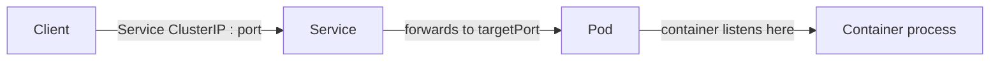
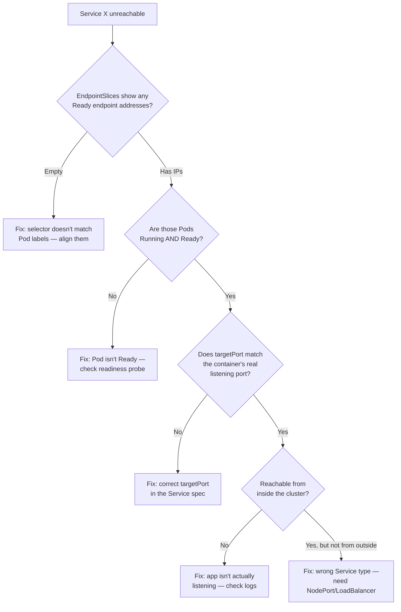
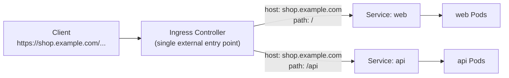
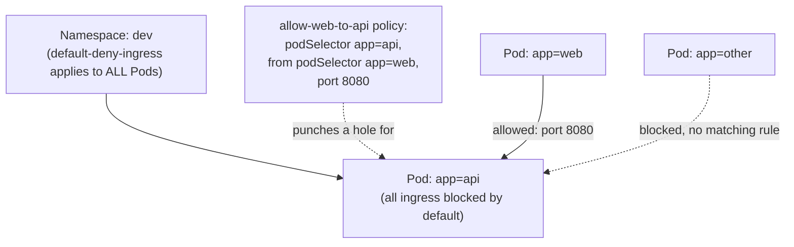
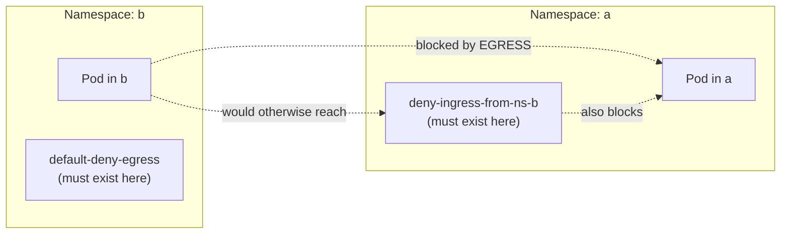

# Chapter 4 — Services and Networking (20%)

**⏱ Estimated time:** 2–2.5 hours across all three topics below.

## Learning Objectives

By the end of this chapter, you should be able to:

- Trace a request from client to container through `port`, `targetPort`, and the container's actual listening port — and know which one to fix when something doesn't connect.
- Diagnose "Service has no endpoints" using a fixed, repeatable sequence instead of guessing.
- Choose the right Service type (`ClusterIP`, `NodePort`, `LoadBalancer`, `ExternalName`, headless) for a given exposure requirement.
- Write an Ingress resource that routes multiple hostnames/paths to different backend Services through a single entry point.
- Implement a default-deny NetworkPolicy and layer narrow allow rules on top of it.
- Correctly scope a NetworkPolicy across namespaces — including the common trap of only securing one side of a cross-namespace connection.

## 4.1 Services 🔴 MUST KNOW

**What it is.** A stable virtual IP and/or DNS identity that routes traffic to a dynamic set of Pods selected by labels (for selector-based Services).

**Why CKAD tests it.** SN-02: "provide and troubleshoot access to applications via services" — one of the most heavily tested single competencies on the whole exam.

**Real-world why.** Pods are ephemeral and get new IPs on every restart; a Service gives clients a fixed address that keeps working as Pods come and go.

**The traffic path — memorize this:**

```
Client
  ↓  Service's ClusterIP : port
Service
  ↓  forwards to targetPort on a matching Pod
Pod
  ↓  container listening on that port
Container process
```



| Field             | Meaning                                                                                               |
| ----------------- | ----------------------------------------------------------------------------------------------------- |
| `port`          | Port the Service exposes to clients                                                                     |
| `targetPort`    | Port on the Pod traffic is forwarded to; it may be a number or named port and must resolve to the application's listening port |
| `containerPort` | Documentation only, in the Pod spec — declares what the container listens on; not enforced by itself |

**Named ports:** `targetPort` can also reference a port name declared on the selected container, e.g. `targetPort: http` matching `ports: [{name: http, containerPort: 8080}]`.

**Service types:**

| Type                           | Behavior                                                                               |
| ------------------------------ | -------------------------------------------------------------------------------------- |
| `ClusterIP` (default)        | Internal-only virtual IP, cluster-reachable                                            |
| `NodePort`                   | ClusterIP + a static port opened on every node (default range is commonly 30000–32767; clusters can configure the range) |
| `LoadBalancer`               | Requests an external load-balancer implementation; external reachability and IP allocation depend on the environment |
| `ExternalName`               | DNS CNAME to an external name, no proxying                                             |
| headless (`clusterIP: None`) | No virtual ClusterIP — DNS can return individual Pod IPs directly; commonly used for StatefulSet identities |

**Imperative:**

```bash
kubectl expose deployment web --port=80 --target-port=8080
kubectl expose deployment web --port=80 --type=NodePort
kubectl create service clusterip web --tcp=80:8080
```

**Declarative:**

```yaml
apiVersion: v1
kind: Service
metadata:
  name: web
spec:
  type: ClusterIP
  selector:
    app: web
  ports:
  - port: 80
    targetPort: 8080
```

**Service discovery / DNS:**

```
<service-name>.<namespace>.svc.cluster.local
```

```bash
kubectl run tmp -n dev --image=busybox --rm -it -- nslookup web.dev.svc.cluster.local
kubectl run tmp -n dev --image=busybox --rm -it -- wget -qO- web.dev
```

**Verify:**

```bash
kubectl get svc web
kubectl get endpointslice -l kubernetes.io/service-name=web              # inspect EndpointSlices; use -o yaml to inspect Ready conditions
kubectl describe svc web
```

**Troubleshoot — Service has no ready backends (a high-value networking task):**

| Step | Command                                             | What you're checking                                                                                |
| ---- | --------------------------------------------------- | --------------------------------------------------------------------------------------------------- |
| 1    | `kubectl get endpointslice -l kubernetes.io/service-name=web -o yaml`                 | Inspect endpoint addresses and `.conditions.ready`; no Ready addresses means selector, Pod readiness, or publishing issue                            |
| 2    | `kubectl get svc web -o yaml `                     | Confirm ` spec.selector `                                                                            |
| 3    | `kubectl get pods --show-labels `                  | Confirm Pods actually carry those exact label key/values                                            |
| 4    | `kubectl get pods -o wide `                        | Confirm Pods are ` Running ` and ` Ready ` — a Pod failing readiness is excluded from endpoints too |
| 5    | `kubectl get svc web -o yaml ` again               | Confirm `targetPort` matches the container's actual listening port                                 |
| 6    | `kubectl exec <pod> -- netstat -tlnp ` or app logs | Confirm the app is actually listening on the expected port inside the container                     |

The same six steps, as a decision tree — follow it top to bottom and stop at the first "no". Start by checking for **Ready** endpoint addresses rather than treating an empty EndpointSlice object by itself as proof of a selector mismatch:



| Problem                               | Likely cause                                                       | Fix                                                                                                                |
| ------------------------------------- | ------------------------------------------------------------------ | ------------------------------------------------------------------------------------------------------------------ |
| No endpoints                          | Selector doesn't match Pod labels (typo, wrong value)              | Align ` spec.selector ` to Pod's actual labels                                                                      |
| EndpointSlices exist, still unreachable | `targetPort` or application listener is wrong | Check the Service port mapping and verify what port the application actually listens on |
| Reachable inside cluster, not outside | Used `ClusterIP` where `NodePort`/`LoadBalancer` was needed   | Change ` spec.type `                                                                                                |
| Intermittent connection refused       | A selected endpoint is unhealthy despite reporting Ready, or readiness is flapping | Inspect EndpointSlice conditions, Pod readiness, logs, and the application's listener |
| DNS lookup fails entirely             | Wrong namespace in the FQDN, or CoreDNS issue                      | Recheck the `<svc>.<namespace>.svc.cluster.local ` string; `kubectl get pods -n kube-system -l k8s-app=kube-dns ` |

🔴 **CKAD-style pattern:** "Service X isn't reachable" tasks commonly reduce to selector mismatch, wrong `targetPort`, or backend Pods not Ready. Check `kubectl get endpointslice` first to see whether ready backend addresses are being published.

> **🌍 Real-world example.** An engineer renamed a Deployment's label from ` app: cart ` to ` app: cart-service ` as part of a naming-convention cleanup, updated the Deployment and its own Service, but missed a * second *, older Service (` cart-internal `) that other teams still depended on for internal calls — its selector still read ` app: cart `. The internal Service silently went to zero endpoints; nothing crashed, no alert fired on the Service itself, and the outage only surfaced as a wave of timeout errors in a completely different team's logs twenty minutes later. `kubectl get endpointslice` across every Service that selects a given label is the real-world habit this section is training: a label change is a breaking API change to every Service selector depending on it, and nothing in Kubernetes warns you at edit time.

> **📚 Theory.** A Service has no idea which Pods exist when you create it — the `EndpointSlice` objects are populated continuously by a controller that watches for Pods matching the Service selector. Ready status is reflected in endpoint conditions, so unhealthy backends can be excluded from normal traffic. This loose coupling (Service and Pods never reference each other by name or UID, only by label match) is exactly what lets Pods be replaced, rescheduled, and scaled without reconfiguring the Service.

> **Current API note.** The legacy `Endpoints` API is deprecated in modern Kubernetes; use `EndpointSlice` for current inspection. `kubectl get endpoints` may still exist for compatibility, but it should not be the primary troubleshooting command in a v1.35-focused guide.

---

## 🧪 Practice — Diagnose and Fix a Broken Service

### Task

A Deployment named ` web ` in namespace ` shop ` is running and its Pods are Ready, but Service ` web ` has no endpoints and clients cannot connect.

Diagnose the problem using the chapter's Service troubleshooting sequence. Fix the smallest configuration mistake so the Service selects the intended Pods.

### Requirements

- Namespace: ` shop `.
- Service: ` web `.
- Deployment: ` web `.
- The Service exposes port ` 80 ` and should forward to the application's port ` 8080 `.
- Do not replace the Deployment unless required.
- Verify the endpoints after the fix.

### Success Criteria

`kubectl get endpointslice -l kubernetes.io/service-name=web -n shop ` shows the intended Pod IPs after the fix, and a request to ` web:80 ` from a temporary Pod reaches the application.

### Suggested Time

**10 minutes**

<details>
<summary>💡 Hint</summary>

Start with `kubectl get endpointslice -l kubernetes.io/service-name=web -n shop `. If it is empty, compare the Service selector with the actual Pod labels before looking at ports.

</details>

<details>
<summary>✅ Solution</summary>

```bash
kubectl get endpointslice -l kubernetes.io/service-name=web -n shop
kubectl get svc web -n shop -o yaml
kubectl get pods -n shop --show-labels
kubectl get pods -n shop -o wide
```

Align the Service selector with the actual Pod labels. Then verify:

```bash
kubectl get endpointslice -l kubernetes.io/service-name=web -n shop
kubectl run tmp -n shop --image=busybox:1.36 --rm -it -- wget -qO- web:80
```

If endpoints exist but the request fails, continue with `targetPort` and the application's actual listening port rather than changing the selector.

</details>

## 4.2 Ingress 🔴 MUST KNOW

> **Ingress v1 note:** In `networking.k8s.io/v1`, each HTTP path must specify `pathType`, typically `Prefix` or `Exact`.

**What it is.** An L7 HTTP(S) routing rule set, interpreted by an Ingress Controller (not built into the API server itself — the controller must be running in-cluster).

**Why CKAD tests it.** SN-03: exposing applications via host- and path-based routing rather than one Service/LoadBalancer per app.

**Real-world why.** Running one cloud load balancer per microservice gets expensive and hard to manage; Ingress lets one entry point route to many backend Services by hostname or path.

**Declarative:**

```yaml
apiVersion: networking.k8s.io/v1
kind: Ingress
metadata:
  name: web-ingress
spec:
  ingressClassName: nginx   # substitute the installed IngressClass name if different
  rules:
  - host: shop.example.com
    http:
      paths:
      - path: /
        pathType: Prefix
        backend:
          service:
            name: web
            port:
              number: 80
      - path: /api
        pathType: Prefix
        backend:
          service:
            name: api
            port:
              number: 8080
  tls:
  - hosts:
    - shop.example.com
    secretName: shop-tls
```



A shared Ingress Controller can expose many backend Services through one externally reachable entry point, depending on the controller and environment; the routing rules determine which backend Service handles a request.

**Imperative (basic rule only — most real Ingress needs the YAML above):**

```bash
kubectl create ingress web-ingress --class=nginx --rule="shop.example.com/*=web:80"
```

**Verify:**

```bash
kubectl get ingress
kubectl describe ingress web-ingress
kubectl get ingressclass
curl -H "Host: shop.example.com" http://<ingress-controller-ip>/
```

**Troubleshoot:**

| Problem                     | Cause                                                                                          | Fix                                                          |
| --------------------------- | ---------------------------------------------------------------------------------------------- | ------------------------------------------------------------ |
| 404 from Ingress controller | ` pathType `/` path ` mismatch, or wrong ` host `                                              | `kubectl describe ingress `, confirm exact host/path match  |
| Ingress has no address      | No Ingress controller installed, or ` ingressClassName ` doesn't match any installed controller | `kubectl get ingressclass `, confirm controller is deployed |
| TLS not working             | ` secretName ` doesn't exist or isn't type ` kubernetes.io/tls `                               | `kubectl get secret shop-tls -o yaml `, check ` type:`     |
| Backend 502/503             | Backend Service has no endpoints (see 4.1)                                                     | Diagnose the Service, not the Ingress                        |

🟡 **Note:** In newer clusters the Gateway API is emerging as Ingress's eventual successor, but **Ingress remains the explicitly tested resource on the current CKAD curriculum** — know Ingress cold; treat Gateway API as awareness-only unless your specific exam version's docs say otherwise.

> **🌍 Real-world example.**A SaaS company runs ` app.example.com ` (frontend), ` api.example.com ` (backend API), and ` docs.example.com ` (documentation site) — three entirely separate Deployments and Services — behind one single cloud load balancer, routed purely by an Ingress's host-based rules. Without Ingress, exposing three services externally the naive way (three `LoadBalancer`-type Services) would mean provisioning and paying for three separate cloud load balancers, each needing its own TLS certificate management. This cost and operational consolidation — one external IP and one certificate story for an arbitrary number of internal services — is the actual business reason Ingress exists and is tested so heavily.

> **📚 Theory.** An Ingress object, by itself, does nothing — it's a declarative routing spec sitting in etcd. All the actual work (opening a listener, terminating TLS, proxying to the right Service) is done by whatever Ingress Controller is running in the cluster (nginx, Traefik, cloud-provider-specific, etc.), which watches Ingress objects the same way a Deployment's controller watches Deployment objects and reconfigures its own proxy to match. This is exactly why `kubectl apply -f ingress.yaml` succeeding tells you nothing about whether routing actually works: the object was accepted by the API server, but no controller may exist to act on it. This is also why `ingressClassName` matters — in a cluster running multiple controllers, it's the field that says which one should claim this particular Ingress object.

---

## 🧪 Practice — Route Two Paths Through One Ingress

### Task

Namespace `web` already contains ready frontend Pods labeled `app=frontend` listening on port `80` and API Pods labeled `app=api` listening on port `8080`. Create two Services in namespace `web` for those backends, then expose them through one Ingress.

`shop.example.com/` must route to Service `frontend` on port `80`. `shop.example.com/api` must route to Service `api` on port `8080`.

Use the cluster's installed Ingress class and verify the routing configuration.

### Requirements

- Namespace: ` web `.
- Services: ` frontend ` and ` api `.
- Ingress: ` shop-ingress `.
- Host: ` shop.example.com `.
- `/` → ` frontend:80 `.
- `/api ` → ` api:8080 `.
- API version: ` networking.k8s.io/v1 `.
- Both paths use ` pathType: Prefix `.

### Success Criteria

The two Services have the intended backend endpoints, and `kubectl describe ingress shop-ingress` shows both rules and the correct backend Services/ports.

### Suggested Time

**10 minutes**

<details>
<summary>💡 Hint</summary>

Check `kubectl get ingressclass ` first. The Ingress resource defines routing; the Ingress controller implements it.

</details>

<details>
<summary>✅ Solution</summary>

Create the two backend Services first and save them as `services.yaml`:

```yaml
apiVersion: v1
kind: Service
metadata:
  name: frontend
  namespace: web
spec:
  selector:
    app: frontend
  ports:
  - port: 80
    targetPort: 80
---
apiVersion: v1
kind: Service
metadata:
  name: api
  namespace: web
spec:
  selector:
    app: api
  ports:
  - port: 8080
    targetPort: 8080
```

Then create the Ingress as `shop-ingress.yaml`:

```yaml
apiVersion: networking.k8s.io/v1
kind: Ingress
metadata:
  name: shop-ingress
  namespace: web
spec:
  ingressClassName: nginx
  rules:
  - host: shop.example.com
    http:
      paths:
      - path: /
        pathType: Prefix
        backend:
          service:
            name: frontend
            port:
              number: 80
      - path: /api
        pathType: Prefix
        backend:
          service:
            name: api
            port:
              number: 8080
```

Apply and verify:

```bash
kubectl apply -f services.yaml
kubectl get endpointslice -n web -l kubernetes.io/service-name=frontend
kubectl get endpointslice -n web -l kubernetes.io/service-name=api
kubectl apply -f shop-ingress.yaml
kubectl get ingress shop-ingress -n web
kubectl describe ingress shop-ingress -n web
```

The example uses `nginx`. If the environment uses a different installed IngressClass, substitute that class name in the manifest before applying it.

</details>

## 4.3 NetworkPolicies 🔴 MUST KNOW

**What it is.** Firewall rules for Pod-to-Pod traffic, selected by labels and enforced by the cluster's network plugin when it supports NetworkPolicy. In a practice cluster, verify that the installed CNI implements NetworkPolicy before relying on a policy test.

**Why CKAD tests it.** SN-01, and a classic "default deny + explicit allow" pattern that's easy to get backwards under time pressure.

**Real-world why.** In a cluster without applicable NetworkPolicies (and with a CNI that permits the traffic), Pods can generally reach other Pods across namespaces; NetworkPolicy is how you enforce least-privilege network access between services.

**Default deny all ingress in a namespace:**

```yaml
apiVersion: networking.k8s.io/v1
kind: NetworkPolicy
metadata:
  name: default-deny-ingress
  namespace: dev
spec:
  podSelector: {}          # selects ALL pods in the namespace
  policyTypes:
  - Ingress
```

**Allow specific traffic (must be added on top of a deny-all to have any effect):**

```yaml
apiVersion: networking.k8s.io/v1
kind: NetworkPolicy
metadata:
  name: allow-web-to-api
  namespace: dev
spec:
  podSelector:
    matchLabels:
      app: api               # this policy applies to Pods labeled app=api
  policyTypes:
  - Ingress
  ingress:
  - from:
    - podSelector:
        matchLabels:
          app: web            # only Pods labeled app=web may reach app=api
    ports:
    - protocol: TCP
      port: 8080
```

The two policies above combine additively — the deny-all establishes the baseline, and the allow rule punches a narrow, specific hole in it:



**Egress example — allow DNS + a specific external CIDR:**

```yaml
apiVersion: networking.k8s.io/v1
kind: NetworkPolicy
metadata:
  name: allow-egress-dns-and-db
  namespace: dev
spec:
  podSelector:
    matchLabels:
      app: web
  policyTypes:
  - Egress
  egress:
  - to:
    - namespaceSelector: {}
    ports:
    - protocol: UDP
      port: 53
    - protocol: TCP
      port: 53
  - to:
    - ipBlock:
        cidr: 10.0.5.0/24
    ports:
    - protocol: TCP
      port: 5432
```

> **Note:** `namespaceSelector: {}` allows UDP and TCP port 53 to Pods in any namespace. It is a simple CKAD pattern, not a strict 'only CoreDNS' rule. A production policy can narrow the DNS destination using the cluster's CoreDNS namespace/Pod labels — check the actual CoreDNS Service/Endpoints in the cluster (`kubectl get svc,ep -n kube-system -l k8s-app=kube-dns`) rather than hard-coding a namespace/IP assumption, since some clusters run DNS outside `kube-system` or under a different label.

**IPBlock note:** `ipBlock` is intended for IP/CIDR-based policy, commonly cluster-external destinations or sources. Pod IPs are ephemeral, so use `podSelector`/`namespaceSelector` when the requirement is specifically about Kubernetes Pods or namespaces.

**Verify:**

```bash
kubectl get networkpolicy -n dev
kubectl describe networkpolicy allow-web-to-api -n dev
kubectl run net-test -n dev --image=busybox:1.36 --rm -it -- wget -qO- -T3 http://api:8080   # test allowed path
kubectl run other-test -n dev --image=busybox:1.36 --rm -it -- wget -qO- -T3 http://api:8080 # should time out
```

**Troubleshoot:**

| Problem                                              | Cause                                                             | Fix                                               |
| ---------------------------------------------------- | ----------------------------------------------------------------- | ------------------------------------------------- |
| Everything still connects, deny policy seems ignored | CNI plugin in this cluster doesn't enforce NetworkPolicy          | Confirm the installed CNI supports and enforces NetworkPolicy |
| Legitimate traffic blocked after adding deny-all     | Forgot to add a matching "allow" policy for that specific traffic | Add an explicit ` ingress `/` egress ` rule for it |
| Policy has no effect at all                          | ` podSelector ` doesn't match the Pods you intended               | `kubectl get pods --show-labels `, fix selector  |
| DNS breaks after adding an egress deny-all           | Forgot to allow UDP/TCP port 53 egress                            | Add the DNS-allow rule shown above                |

🔴 **CKAD-style pattern — memorize this order of operations:**(1) ` podSelector: {}` + ` policyTypes: [Ingress]` with no ` ingress:` block = deny all ingress to every Pod in the namespace. (2) Layer specific ` NetworkPolicy ` objects with narrow ` podSelector ` s to re-allow exactly the traffic that should be permitted. NetworkPolicies are additive — multiple policies selecting the same Pod combine with OR logic, they never subtract from each other.

> **🌍 Real-world example.** A fintech company's payments namespace runs a database Pod that should only ever be reachable from the one payment-processing service that needs it — not from a marketing dashboard, a logging sidecar experiment, or any other Pod someone happens to spin up in the same namespace later. Without NetworkPolicy, all of those have equal network access to the database by default. The team's actual policy is exactly the two-object pattern above: a namespace-wide `default-deny-ingress`, plus one narrowly-scoped allow rule naming the specific payment-processor label and port. Critically, this means a brand-new, unrelated Pod added to the namespace six months later is *automatically* denied by default — nobody has to remember to update a policy every time the namespace grows, which is the opposite of how a traditional allow-list firewall rule usually degrades over time.

> **📚 Theory.** NetworkPolicy objects don't "do" anything themselves — like Ingress, they're a spec that the cluster's CNI plugin reads and translates into actual packet-filtering rules (iptables, eBPF, or similar, depending on the plugin). This is why the very first troubleshooting question for "my deny policy isn't working" is never about the YAML — it's whether the installed CNI enforces NetworkPolicy at all; some don't. It also explains the OR-only combination rule: each policy independently tells the CNI plugin "also allow this," so the CNI is simply unioning every applicable allow rule for a given Pod — there's no mechanism for one policy to subtract permission granted by another, because each is evaluated as its own independent addition to what's permitted.

---

## 🧪 Practice — Default Deny, Then Allow Only Frontend → Backend

### Task

In namespace ` network-demo `, Pods labeled ` app=frontend ` must be able to reach Pods labeled ` app=backend ` on TCP port ` 8080 `.

First apply a default-deny ingress policy. Then add the narrow allow policy. Verify an allowed frontend connection and a blocked connection from an unrelated Pod.

### Requirements

- Namespace: ` network-demo `.
- Default deny applies to all Pods.
- Backend selector: ` app=backend `.
- Allowed source: ` app=frontend `.
- Allowed port: TCP ` 8080 `.
- Do not allow all ports or all Pods.
- Test both allowed and blocked traffic.

### Success Criteria

Frontend → backend TCP/8080 succeeds. An unrelated Pod cannot reach backend TCP/8080.

### Suggested Time

**10 minutes**

<details>
<summary>💡 Hint</summary>

Write the deny-all first. The allow policy selects the backend Pods, while ` from.podSelector ` selects the frontend Pods.

</details>

<details>
<summary>✅ Solution</summary>

Default deny:

```yaml
apiVersion: networking.k8s.io/v1
kind: NetworkPolicy
metadata:
  name: default-deny-ingress
  namespace: network-demo
spec:
  podSelector: {}
  policyTypes:
  - Ingress
```

Allow rule:

```yaml
apiVersion: networking.k8s.io/v1
kind: NetworkPolicy
metadata:
  name: allow-frontend-to-backend
  namespace: network-demo
spec:
  podSelector:
    matchLabels:
      app: backend
  policyTypes:
  - Ingress
  ingress:
  - from:
    - podSelector:
        matchLabels:
          app: frontend
    ports:
    - protocol: TCP
      port: 8080
```

Apply both and test from a frontend Pod and an unrelated Pod.

</details>

### 4.3B NetworkPolicy Cross-Namespace Scoping — Critical Detail

**Critical insight: NetworkPolicies are namespace-scoped, but Pods talk across namespaces by default.**

A NetworkPolicy in namespace A does * not * affect Pods in namespace B. This is a common exam trap:

**Wrong understanding:**

> "A NetworkPolicy in namespace A automatically controls traffic to or from Pods in namespace B."

That is false. A NetworkPolicy is namespace-scoped and its `podSelector` selects only Pods in the policy's own namespace. Cross-namespace rules become possible by selecting the peer namespace with `namespaceSelector` and, when needed, selecting peer Pods with `podSelector`.

**Key mental model:**

```text
Policy namespace
      ↓
top-level podSelector → selects the Pods protected by this policy

namespaceSelector → selects peer namespace(s)
peer podSelector    → selects peer Pod(s); by itself it means Pods in the policy namespace,
                       or, when combined with namespaceSelector, Pods in those namespaces
```

When `namespaceSelector` and `podSelector` appear in the **same `from` or `to` item**, they are ANDed:

```yaml
from:
- namespaceSelector:
    matchLabels:
      name: app
  podSelector:
    matchLabels:
      app: frontend
```

This means:

> Pods labeled `app=frontend` AND located in a namespace labeled `name=app`.

When they are separate list items, the entries are alternatives (OR):

```yaml
from:
- namespaceSelector:
    matchLabels:
      name: app
- podSelector:
    matchLabels:
      app: frontend
```

This means:

> Pods from namespace `app` OR matching `app=frontend` in the policy namespace.

This distinction is a high-value NetworkPolicy detail to practice.

**Written in namespace A:**

```yaml
apiVersion: networking.k8s.io/v1
kind: NetworkPolicy
metadata:
  name: deny-ns-b
  namespace: a
spec:
  podSelector: {}
  policyTypes: [Ingress]
```

This policy denies ingress * within namespace A * only. A policy in namespace A that does not allow traffic from B can block ingress to A's Pods; NetworkPolicies are additive and apply only to the Pods selected by the policy in that namespace. A separate egress policy in B may be added when the goal is to constrain outbound connections too.

**To enforce defense-in-depth, you can control both ends of a cross-namespace connection:**

1. **In the source namespace (B)**— optionally restrict egress to prevent workloads from initiating unwanted connections:

```yaml
apiVersion: networking.k8s.io/v1
kind: NetworkPolicy
metadata:
  name: default-deny-egress
  namespace: b
spec:
  podSelector: {}           # all Pods in namespace B
  policyTypes: [Egress]
  # No 'egress' block = deny all egress
```

This example denies **all** egress from namespace B, not just traffic to namespace A. Narrow it further with an explicit `egress` allow-list when B still needs DNS or other outbound traffic.

2. **In the destination namespace (A)**— restrict ingress from namespace B:

```yaml
apiVersion: networking.k8s.io/v1
kind: NetworkPolicy
metadata:
  name: deny-ingress-from-ns-b
  namespace: a
spec:
  podSelector: {}           # all Pods in namespace A
  policyTypes: [Ingress]
  # No 'ingress' block = deny all ingress
```

**To allow specific cross-namespace traffic, use ` namespaceSelector `:**

```yaml
apiVersion: networking.k8s.io/v1
kind: NetworkPolicy
metadata:
  name: allow-from-ns-b
  namespace: a
spec:
  podSelector:
    matchLabels:
      app: db               # only database Pods in namespace A
  policyTypes: [Ingress]
  ingress:
  - from:
    - namespaceSelector:
        matchLabels:
          name: b            # Pods from any Pod in namespace B (if namespace is labeled)
    ports:
    - protocol: TCP
      port: 5432
```

A connection is allowed when neither side imposes a policy that blocks it. If the source is isolated for egress, its egress policy must allow the connection; if the destination is isolated for ingress, its ingress policy must allow the connection. A destination ingress rule alone can therefore block a connection even when source egress is unrestricted. Using controls at both ends is a defense-in-depth choice.



A common trap is assuming the policy has to live in both namespaces. For example, a destination ingress policy can block the connection even when source egress remains unrestricted; use both sides when the task calls for defense in depth.

**Verify namespace labels (they're used for namespaceSelector):**

```bash
kubectl get ns b --show-labels
# if namespace B doesn't have a label, add one:
kubectl label namespace b name=b
```

🔴 **Exam tip:** If a task says "block traffic from namespace A to namespace B," determine which side the task requires you to control. A destination ingress rule can block the connection by itself; add source egress controls when the requirement calls for defense in depth.

> **🌍 Real-world example.** A multi-tenant cluster has `tenant-a` and `tenant-b` namespaces running in the same cluster. Without NetworkPolicy, tenant-b's Pods can query tenant-a's database. The platform team restricts ingress into the database namespace and, when required, also restricts egress from tenant-b using namespace/pod selectors. Even if one boundary is misconfigured, the other can provide an additional control. This is defense in depth rather than a requirement to duplicate every policy on both sides.

> **📚 Theory.** In a cluster without applicable NetworkPolicies, Kubernetes networking is generally open between Pods across namespaces. This default-allow starting point makes basic networking work without additional policy configuration, but production clusters can use NetworkPolicy to reconstruct explicit network segmentation. For cross-namespace traffic, reason about both source and destination boundaries when the requirement explicitly constrains both.

## 🧪 Practice — Allow One Cross-Namespace Database Connection

### Task

Namespace `app` contains `app=frontend` Pods. Namespace `data` contains `app=db` Pods listening on TCP `5432`. Assume no other NetworkPolicy selects the database Pods.

Configure NetworkPolicy so only frontend Pods in namespace `app` can reach database Pods in namespace `data` on TCP `5432`. Other namespaces must not be allowed by this rule.

### Requirements

- Source namespace: ` app `.
- Destination namespace: ` data `.
- Source Pods: ` app=frontend `.
- Destination Pods: ` app=db `.
- Database port: TCP ` 5432 `.
- Ensure namespace ` app ` has label ` name=app ` if needed.
- The policy protecting the database is created in namespace ` data `.
- Use both ` namespaceSelector ` and ` podSelector ` in the same ` from ` item.

### Success Criteria

Frontend Pods in ` app ` can reach database Pods in ` data:5432 `; a frontend-labeled Pod in another namespace cannot use this policy to reach the database.

### Suggested Time

**10 minutes**

<details>
<summary>💡 Hint</summary>

Put the policy in namespace ` data `. In one ` from ` item, ` namespaceSelector ` and ` podSelector ` are ANDed; separate list items would create OR behavior.

</details>

<details>
<summary>✅ Solution</summary>

Label the source namespace:

```bash
kubectl label namespace app name=app --overwrite
```

Create the policy in ` data `:

```yaml
apiVersion: networking.k8s.io/v1
kind: NetworkPolicy
metadata:
  name: allow-app-frontend-to-db
  namespace: data
spec:
  podSelector:
    matchLabels:
      app: db
  policyTypes:
  - Ingress
  ingress:
  - from:
    - namespaceSelector:
        matchLabels:
          name: app
      podSelector:
        matchLabels:
          app: frontend
    ports:
    - protocol: TCP
      port: 5432
```

Verify:

```bash
kubectl describe networkpolicy allow-app-frontend-to-db -n data
kubectl get ns app --show-labels
```

</details>

**Exam Tips — Chapter 4**

- `kubectl get endpointslice -l kubernetes.io/service-name=<service>` is the current EndpointSlice-based triage step for any "can't reach my app" task — no Ready addresses means investigate selector, readiness, or EndpointSlice publishing; populated-but-unreachable means continue with ports/networking.
- Know `port` vs `targetPort` vs `containerPort` cold — this three-way mix-up is one of the most common exam traps.
- For NetworkPolicy tasks, write the deny-all first mentally, then figure out exactly what narrow rule needs to exist on top — don't try to write one clever policy that does both.
- Ingress requires a running controller in the cluster — if `kubectl get ingress ` shows no address, check ` ingressclass ` and controller Pods before touching your own YAML.

## Chapter Summary

| Topic                          | One-line takeaway                                                                                                                        |
| ------------------------------ | ---------------------------------------------------------------------------------------------------------------------------------------- |
| Services (4.1)                 | Inspect the Service's EndpointSlices first — no Ready addresses means investigate selector/readiness/publishing; populated-but-unreachable means continue with ports/networking |
| Ingress (4.2)                  | One entry point, host/path-based routing to many backend Services — requires a running Ingress controller to do anything                |
| NetworkPolicies (4.3)          | Default-deny first, then layer narrow allow rules — policies combine additively, never subtractively                                    |
| Cross-namespace scoping (4.3B) | A policy is namespace-scoped; a destination ingress or source egress boundary can enforce the required block, while both sides can be used for defense in depth |

---

## 🧪 Practice — Chapter Challenge — Expose and Secure an Application

### Task

In namespace ` shop `, a frontend and API are already running.

Expose both internally with Services, expose them through one Ingress using host/path routing, apply default-deny ingress, then allow the required Ingress Controller → backend traffic and frontend → API on TCP `8080`. Verify each layer and prove that unrelated direct API traffic is denied.

### Requirements

- Namespace: ` shop `.
- Frontend Pods: ` app=frontend `.
- API Pods: ` app=api `.
- Frontend Service: ` frontend:80 `.
- API Service: ` api:8080 `.
- Ingress host: ` shop.example.com `.
- Assume the cluster has an `nginx` IngressClass whose controller Pods run in namespace `ingress-nginx` and carry label `app.kubernetes.io/component=controller`.
- `/` → ` frontend:80 `.
- `/api ` → ` api:8080 `.
- Default deny ingress.
- Allow the Ingress Controller to reach the frontend and API backends on their Service target ports.
- Allow ` app=frontend ` → ` app=api ` on TCP ` 8080 `.
- Do not permit unrelated application Pods to reach the API.

### Success Criteria

Services have endpoints, the Ingress contains both routes, the Ingress Controller can reach both backends, frontend-to-API traffic is permitted, and unrelated direct API traffic is denied.

### Suggested Time

**15 minutes**

<details>
<summary>💡 Hint</summary>

Build in this order: Services → EndpointSlices → Ingress → default deny → narrow NetworkPolicy allow. If something breaks, identify the layer before changing configuration.

</details>

<details>
<summary>✅ Solution</summary>

Service pattern:

```yaml
apiVersion: v1
kind: Service
metadata:
  name: frontend
  namespace: shop
spec:
  selector:
    app: frontend
  ports:
  - port: 80
    targetPort: 80
---
apiVersion: v1
kind: Service
metadata:
  name: api
  namespace: shop
spec:
  selector:
    app: api
  ports:
  - port: 8080
    targetPort: 8080
```

Ingress:

```yaml
apiVersion: networking.k8s.io/v1
kind: Ingress
metadata:
  name: shop
  namespace: shop
spec:
  ingressClassName: nginx
  rules:
  - host: shop.example.com
    http:
      paths:
      - path: /
        pathType: Prefix
        backend:
          service:
            name: frontend
            port:
              number: 80
      - path: /api
        pathType: Prefix
        backend:
          service:
            name: api
            port:
              number: 8080
```

NetworkPolicy:

```yaml
apiVersion: networking.k8s.io/v1
kind: NetworkPolicy
metadata:
  name: default-deny-ingress
  namespace: shop
spec:
  podSelector: {}
  policyTypes: [Ingress]
---
# Allow the Ingress Controller to reach both backends.
# Assumption from the task: ingress-nginx namespace + controller label.
apiVersion: networking.k8s.io/v1
kind: NetworkPolicy
metadata:
  name: allow-ingress-controller
  namespace: shop
spec:
  podSelector:
    matchLabels:
      app: frontend
  policyTypes: [Ingress]
  ingress:
  - from:
    - namespaceSelector:
        matchLabels:
          kubernetes.io/metadata.name: ingress-nginx
      podSelector:
        matchLabels:
          app.kubernetes.io/component: controller
    ports:
    - protocol: TCP
      port: 80
---
apiVersion: networking.k8s.io/v1
kind: NetworkPolicy
metadata:
  name: allow-ingress-controller-to-api
  namespace: shop
spec:
  podSelector:
    matchLabels:
      app: api
  policyTypes: [Ingress]
  ingress:
  - from:
    - namespaceSelector:
        matchLabels:
          kubernetes.io/metadata.name: ingress-nginx
      podSelector:
        matchLabels:
          app.kubernetes.io/component: controller
    - podSelector:
        matchLabels:
          app: frontend
    ports:
    - protocol: TCP
      port: 8080
```


Verify:

```bash
kubectl get endpointslice -l kubernetes.io/service-name=frontend -n shop
kubectl get endpointslice -l kubernetes.io/service-name=api -n shop
kubectl get ingress shop -n shop
kubectl get networkpolicy -n shop
kubectl describe networkpolicy allow-ingress-controller -n shop
kubectl describe networkpolicy allow-ingress-controller-to-api -n shop
kubectl run unrelated-test -n shop --image=busybox:1.36 --rm -it -- wget -qO- -T3 http://api:8080
kubectl run frontend-test -n shop --image=busybox:1.36 --labels=app=frontend --rm -it -- wget -qO- -T3 http://api:8080
```

The `unrelated-test` command should time out or otherwise fail because it has no allowed source label; the `frontend-test` command should succeed because it carries `app=frontend`. When the Ingress Controller has a reachable address, also send a request with `Host: shop.example.com` and verify that `/` and `/api` route to the expected Services.

</details>

**Next:**Chapter 5 — Application Observability and Maintenance (15%) is the smallest domain by weight but the highest-leverage — the debugging skills there are what let you finish tasks in every other chapter when something doesn't work the first time.
\newpage
