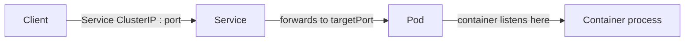
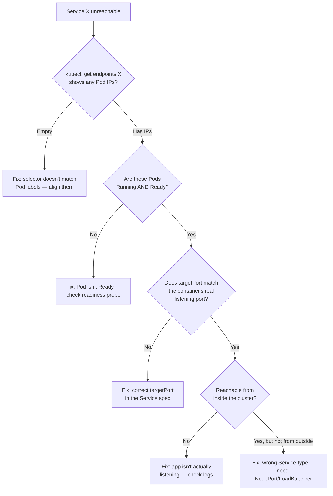
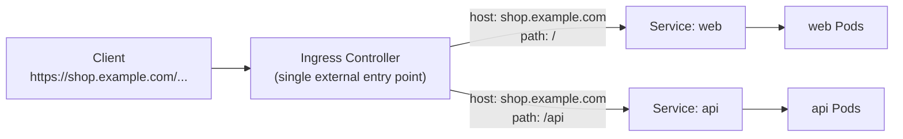
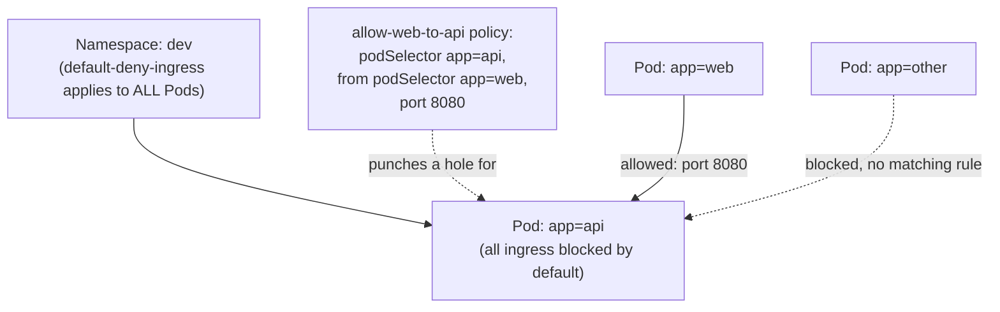

# Chapter 4 — Services and Networking (20%)

**⏱ Estimated time:** 2–2.5 hours across all three topics below.

## Learning Objectives

By the end of this chapter, you should be able to:

- Trace a request from client to container through ` port `, ` targetPort `, and the container's actual listening port — and know which one to fix when something doesn't connect.
- Diagnose "Service has no endpoints" using a fixed, repeatable sequence instead of guessing.
- Choose the right Service type (` ClusterIP `, ` NodePort `, ` LoadBalancer `, ` ExternalName `, headless) for a given exposure requirement.
- Write an Ingress resource that routes multiple hostnames/paths to different backend Services through a single entry point.
- Implement a default-deny NetworkPolicy and layer narrow allow rules on top of it.
- Correctly scope a NetworkPolicy across namespaces — including the common trap of only securing one side of a cross-namespace connection.

## 4.1 Services 🔴 MUST KNOW

** What it is.** A stable virtual IP/DNS name that load-balances to a dynamic set of Pods matched by a label selector.

** Why CKAD tests it.** SN-02: "provide and troubleshoot access to applications via services" — one of the most heavily tested single competencies on the whole exam.

** Real-world why.** Pods are ephemeral and get new IPs on every restart; a Service gives clients a fixed address that keeps working as Pods come and go.

** The traffic path — memorize this:**

```
Client
  ↓  Service's ClusterIP : port
Service
  ↓  forwards to targetPort on a matching Pod
Pod
  ↓  container listening on that same port
Container process
```



| Field             | Meaning                                                                                               |
| ----------------- | ----------------------------------------------------------------------------------------------------- |
| ` port `          | Port the * Service * exposes to clients                                                                |
| ` targetPort `    | Port on the * Pod * traffic is forwarded to (must match what the container listens on)                 |
| ` containerPort ` | Documentation only, in the Pod spec — declares what the container listens on; not enforced by itself |

** Service types:**

| Type                           | Behavior                                                                               |
| ------------------------------ | -------------------------------------------------------------------------------------- |
| ` ClusterIP ` (default)        | Internal-only virtual IP, cluster-reachable                                            |
| ` NodePort `                   | ClusterIP + a static port opened on every node (30000–32767)                          |
| ` LoadBalancer `               | NodePort + a cloud provider's external load balancer                                   |
| ` ExternalName `               | DNS CNAME to an external name, no proxying                                             |
| headless (` clusterIP: None `) | No load-balancing IP — DNS returns individual Pod IPs directly (used by StatefulSets) |

** Imperative:**

```bash
kubectl expose deployment web --port=80 --target-port=8080
kubectl expose deployment web --port=80 --type=NodePort
kubectl create service clusterip web --tcp=80:8080
```

** Declarative:**

```yaml
apiVersion: v1
kind: Service
metadata:
  name: web
spec:
  type: ClusterIP
  selector:
    app: web
  ports:
  - port: 80
    targetPort: 8080
```

** Service discovery / DNS:**

```
<service-name>.<namespace>.svc.cluster.local
```

```bash
kubectl run tmp --image=busybox --rm -it -- nslookup web.dev.svc.cluster.local
kubectl run tmp --image=busybox --rm -it -- wget -qO- web.dev
```

** Verify:**

```bash
kubectl get svc web
kubectl get endpoints web              # empty = selector matches nothing, THE key diagnostic
kubectl describe svc web
```

** Troubleshoot — Service has no endpoints (the single most common networking task):**

| Step | Command                                             | What you're checking                                                                                |
| ---- | --------------------------------------------------- | --------------------------------------------------------------------------------------------------- |
| 1    | ` kubectl get endpoints web `                       | Empty list = selector problem                                                                       |
| 2    | ` kubectl get svc web -o yaml `                     | Confirm ` spec.selector `                                                                            |
| 3    | ` kubectl get pods --show-labels `                  | Confirm Pods actually carry those exact label key/values                                            |
| 4    | ` kubectl get pods -o wide `                        | Confirm Pods are ` Running ` and ` Ready ` — a Pod failing readiness is excluded from endpoints too |
| 5    | ` kubectl get svc web -o yaml ` again               | Confirm ` targetPort ` matches the container's actual listening port                                 |
| 6    | ` kubectl exec <pod> -- netstat -tlnp ` or app logs | Confirm the app is actually listening on the expected port inside the container                     |

The same six steps, as a decision tree — follow it top to bottom and stop at the first "no":



| Problem                               | Likely cause                                                       | Fix                                                                                                                |
| ------------------------------------- | ------------------------------------------------------------------ | ------------------------------------------------------------------------------------------------------------------ |
| No endpoints                          | Selector doesn't match Pod labels (typo, wrong value)              | Align ` spec.selector ` to Pod's actual labels                                                                      |
| Endpoints exist, still unreachable    | Wrong ` targetPort ` (Service forwards to the wrong container port) | Fix ` targetPort ` to match the app's real listening port                                                           |
| Reachable inside cluster, not outside | Used ` ClusterIP ` where ` NodePort `/` LoadBalancer ` was needed   | Change ` spec.type `                                                                                                |
| Intermittent connection refused       | Some Pods behind the Service are not actually ready                | ` kubectl get pods `, check readiness probe                                                                        |
| DNS lookup fails entirely             | Wrong namespace in the FQDN, or CoreDNS issue                      | Recheck the `<svc>.<namespace>.svc.cluster.local ` string; ` kubectl get pods -n kube-system -l k8s-app=kube-dns ` |

🔴 ** Exam pattern:** "Service X isn't reachable" tasks are graded on fixing exactly one of: selector mismatch, wrong ` targetPort `, or Pod not Ready. Check ` kubectl get endpoints ` first — it immediately tells you whether the problem is the Service side or the Pod side.

> **🌍 Real-world example.** An engineer renamed a Deployment's label from ` app: cart ` to ` app: cart-service ` as part of a naming-convention cleanup, updated the Deployment and its own Service, but missed a * second *, older Service (` cart-internal `) that other teams still depended on for internal calls — its selector still read ` app: cart `. The internal Service silently went to zero endpoints; nothing crashed, no alert fired on the Service itself, and the outage only surfaced as a wave of timeout errors in a completely different team's logs twenty minutes later. ` kubectl get endpoints ` across every Service that selects a given label is the real-world habit this section is training: a label change is a breaking API change to every Service selector depending on it, and nothing in Kubernetes warns you at edit time.

> **📚 Theory.** A Service has no idea which Pods exist when you create it — the ` Endpoints `/` EndpointSlice ` object is populated * continuously * by a controller that watches for Pods matching the selector and are ` Ready `. This loose coupling (Service and Pods never reference each other by name or UID, only by label match) is exactly what lets Pods be replaced, rescheduled, and scaled without ever touching the Service — but it also means a Service's health is only as good as the label discipline of everything that creates Pods underneath it.

---

## 🧪 Practice — Diagnose and Fix a Broken Service

### Task

A Deployment named ` web ` in namespace ` shop ` is running and its Pods are Ready, but Service ` web ` has no endpoints and clients cannot connect.

Diagnose the problem using the chapter's Service troubleshooting sequence. Fix the smallest configuration mistake so the Service selects the intended Pods.

### Requirements

- Namespace: ` shop `.
- Service: ` web `.
- Deployment: ` web `.
- The Service exposes port ` 80 ` and should forward to the application's port ` 8080 `.
- Do not replace the Deployment unless required.
- Verify the endpoints after the fix.

### Success Criteria

` kubectl get endpoints web -n shop ` shows the intended Pod IPs after the fix, and a request to ` web:80 ` from a temporary Pod reaches the application.

### Suggested Time

** 10 minutes **

<details>
<summary>💡 Hint</summary>

Start with ` kubectl get endpoints web -n shop `. If it is empty, compare the Service selector with the actual Pod labels before looking at ports.

</details>

<details>
<summary>✅ Solution</summary>

```bash
kubectl get endpoints web -n shop
kubectl get svc web -n shop -o yaml
kubectl get pods -n shop --show-labels
kubectl get pods -n shop -o wide
```

Align the Service selector with the actual Pod labels. Then verify:

```bash
kubectl get endpoints web -n shop
kubectl run tmp -n shop --image=busybox:1.36 --rm -it -- wget -qO- web:80
```

If endpoints exist but the request fails, continue with ` targetPort ` and the application's actual listening port rather than changing the selector.

</details>

## 4.2 Ingress 🔴 MUST KNOW

** What it is.** An L7 HTTP(S) routing rule set, interpreted by an Ingress Controller (not built into the API server itself — the controller must be running in-cluster).

** Why CKAD tests it.** SN-03: exposing applications via host- and path-based routing rather than one Service/LoadBalancer per app.

** Real-world why.** Running one cloud load balancer per microservice gets expensive and hard to manage; Ingress lets one entry point route to many backend Services by hostname or path.

** Declarative:**

```yaml
apiVersion: networking.k8s.io/v1
kind: Ingress
metadata:
  name: web-ingress
  annotations:
    nginx.ingress.kubernetes.io/rewrite-target: /
spec:
  ingressClassName: nginx
  rules:
  - host: shop.example.com
    http:
      paths:
      - path: /
        pathType: Prefix
        backend:
          service:
            name: web
            port:
              number: 80
      - path: /api
        pathType: Prefix
        backend:
          service:
            name: api
            port:
              number: 8080
  tls:
  - hosts:
    - shop.example.com
    secretName: shop-tls
```



One external IP, one TLS certificate, and the routing rules alone decide which backend Service handles a given request — this is the whole cost-and-complexity argument for Ingress over one ` LoadBalancer ` Service per microservice.

** Imperative (basic rule only — most real Ingress needs the YAML above):**

```bash
kubectl create ingress web-ingress --class=nginx --rule="shop.example.com/*=web:80"
```

** Verify:**

```bash
kubectl get ingress
kubectl describe ingress web-ingress
kubectl get ingressclass
curl -H "Host: shop.example.com" http://<ingress-controller-ip>/
```

** Troubleshoot:**

| Problem                     | Cause                                                                                          | Fix                                                          |
| --------------------------- | ---------------------------------------------------------------------------------------------- | ------------------------------------------------------------ |
| 404 from Ingress controller | ` pathType `/` path ` mismatch, or wrong ` host `                                              | ` kubectl describe ingress `, confirm exact host/path match  |
| Ingress has no address      | No Ingress controller installed, or ` ingressClassName ` doesn't match any installed controller | ` kubectl get ingressclass `, confirm controller is deployed |
| TLS not working             | ` secretName ` doesn't exist or isn't type ` kubernetes.io/tls `                               | ` kubectl get secret shop-tls -o yaml `, check ` type:`     |
| Backend 502/503             | Backend Service has no endpoints (see 4.1)                                                     | Diagnose the Service, not the Ingress                        |

🟡 ** Note:** in newer clusters the Gateway API is emerging as Ingress's eventual successor, but ** Ingress remains the explicitly tested resource on the current CKAD curriculum ** — know Ingress cold; treat Gateway API as awareness-only unless your specific exam version's docs say otherwise.

> **🌍 Real-world example.** A SaaS company runs ` app.example.com ` (frontend), ` api.example.com ` (backend API), and ` docs.example.com ` (documentation site) — three entirely separate Deployments and Services — behind one single cloud load balancer, routed purely by an Ingress's host-based rules. Without Ingress, exposing three services externally the naive way (three ` LoadBalancer `-type Services) would mean provisioning and paying for three separate cloud load balancers, each needing its own TLS certificate management. This cost and operational consolidation — one external IP and one certificate story for an arbitrary number of internal services — is the actual business reason Ingress exists and is tested so heavily.

---

## 🧪 Practice — Route Two Paths Through One Ingress

### Task

Create two backend Services in namespace ` web `, then expose them through one Ingress.

` shop.example.com/` must route to Service ` frontend ` on port ` 80 `. ` shop.example.com/api ` must route to Service ` api ` on port ` 8080 `.

Use the cluster's installed Ingress class and verify the routing configuration.

### Requirements

- Namespace: ` web `.
- Services: ` frontend ` and ` api `.
- Ingress: ` shop-ingress `.
- Host: ` shop.example.com `.
- `/` → ` frontend:80 `.
- `/api ` → ` api:8080 `.
- API version: ` networking.k8s.io/v1 `.
- Both paths use ` pathType: Prefix `.

### Success Criteria

` kubectl describe ingress shop-ingress ` shows both rules and the correct backend Services/ports.

### Suggested Time

** 10 minutes **

<details>
<summary>💡 Hint</summary>

Check ` kubectl get ingressclass ` first. The Ingress resource defines routing; the Ingress controller implements it.

</details>

<details>
<summary>✅ Solution</summary>

```yaml
apiVersion: networking.k8s.io/v1
kind: Ingress
metadata:
  name: shop-ingress
  namespace: web
spec:
  ingressClassName: nginx
  rules:
  - host: shop.example.com
    http:
      paths:
      - path: /
        pathType: Prefix
        backend:
          service:
            name: frontend
            port:
              number: 80
      - path: /api
        pathType: Prefix
        backend:
          service:
            name: api
            port:
              number: 8080
```

Apply and verify:

```bash
kubectl apply -f shop-ingress.yaml
kubectl get ingress shop-ingress -n web
kubectl describe ingress shop-ingress -n web
```

If the environment uses a different installed IngressClass, use that class instead of ` nginx `.

</details>

## 4.3 NetworkPolicies 🔴 MUST KNOW

** What it is.** Firewall rules for Pod-to-Pod traffic, selected by labels, enforced by the CNI plugin (not all CNIs enforce NetworkPolicy — the exam environment's does).

** Why CKAD tests it.** SN-01, and a classic "default deny + explicit allow" pattern that's easy to get backwards under time pressure.

** Real-world why.** By default every Pod can talk to every other Pod in the cluster — NetworkPolicy is how you enforce least-privilege network access between services.

** Default deny all ingress in a namespace:**

```yaml
apiVersion: networking.k8s.io/v1
kind: NetworkPolicy
metadata:
  name: default-deny-ingress
  namespace: dev
spec:
  podSelector: {}          # selects ALL pods in the namespace
  policyTypes:
  - Ingress
```

** Allow specific traffic (must be added on top of a deny-all to have any effect):**

```yaml
apiVersion: networking.k8s.io/v1
kind: NetworkPolicy
metadata:
  name: allow-web-to-api
  namespace: dev
spec:
  podSelector:
    matchLabels:
      app: api               # this policy applies to Pods labeled app=api
  policyTypes:
  - Ingress
  ingress:
  - from:
    - podSelector:
        matchLabels:
          app: web            # only Pods labeled app=web may reach app=api
    ports:
    - protocol: TCP
      port: 8080
```

The two policies above combine additively — the deny-all establishes the baseline, and the allow rule punches a narrow, specific hole in it:



** Egress example — allow DNS + a specific external CIDR:**

```yaml
apiVersion: networking.k8s.io/v1
kind: NetworkPolicy
metadata:
  name: allow-egress-dns-and-db
  namespace: dev
spec:
  podSelector:
    matchLabels:
      app: web
  policyTypes:
  - Egress
  egress:
  - to:
    - namespaceSelector: {}
    ports:
    - protocol: UDP
      port: 53
  - to:
    - ipBlock:
        cidr: 10.0.5.0/24
    ports:
    - protocol: TCP
      port: 5432
```

** Verify:**

```bash
kubectl get networkpolicy -n dev
kubectl describe networkpolicy allow-web-to-api -n dev
kubectl exec web-pod -- curl -sS -m3 api:8080          # test allowed path
kubectl exec other-pod -- curl -sS -m3 api:8080        # test blocked path (should time out)
```

** Troubleshoot:**

| Problem                                              | Cause                                                             | Fix                                               |
| ---------------------------------------------------- | ----------------------------------------------------------------- | ------------------------------------------------- |
| Everything still connects, deny policy seems ignored | CNI plugin in this cluster doesn't enforce NetworkPolicy          | Confirm CNI supports it (exam environment does)   |
| Legitimate traffic blocked after adding deny-all     | Forgot to add a matching "allow" policy for that specific traffic | Add an explicit ` ingress `/` egress ` rule for it |
| Policy has no effect at all                          | ` podSelector ` doesn't match the Pods you intended               | ` kubectl get pods --show-labels `, fix selector  |
| DNS breaks after adding an egress deny-all           | Forgot to allow UDP/TCP port 53 egress                            | Add the DNS-allow rule shown above                |

🔴 ** Exam pattern — memorize this order of operations:** (1) ` podSelector: {}` + ` policyTypes: [Ingress]` with no ` ingress:` block = deny all ingress to every Pod in the namespace. (2) Layer specific ` NetworkPolicy ` objects with narrow ` podSelector ` s to re-allow exactly the traffic that should be permitted. NetworkPolicies are additive — multiple policies selecting the same Pod combine with OR logic, they never subtract from each other.

### 4.3B NetworkPolicy Cross-Namespace Scoping — Critical Detail

** Critical insight: NetworkPolicies are namespace-scoped, but Pods talk across namespaces by default.**

A NetworkPolicy in namespace A does * not * affect Pods in namespace B. This is a common exam trap:

** Wrong understanding:**

```yaml

---

---
```

## 🧪 Practice — Default Deny, Then Allow Only Frontend → Backend

### Task

In namespace ` network-demo `, Pods labeled ` app=frontend ` must be able to reach Pods labeled ` app=backend ` on TCP port ` 8080 `.

First apply a default-deny ingress policy. Then add the narrow allow policy. Verify an allowed frontend connection and a blocked connection from an unrelated Pod.

### Requirements

- Namespace: ` network-demo `.
- Default deny applies to all Pods.
- Backend selector: ` app=backend `.
- Allowed source: ` app=frontend `.
- Allowed port: TCP ` 8080 `.
- Do not allow all ports or all Pods.
- Test both allowed and blocked traffic.

### Success Criteria

Frontend → backend TCP/8080 succeeds. An unrelated Pod cannot reach backend TCP/8080.

### Suggested Time

** 10 minutes **

<details>
<summary>💡 Hint</summary>

Write the deny-all first. The allow policy selects the backend Pods, while ` from.podSelector ` selects the frontend Pods.

</details>

<details>
<summary>✅ Solution</summary>

Default deny:

```yaml
apiVersion: networking.k8s.io/v1
kind: NetworkPolicy
metadata:
  name: default-deny-ingress
  namespace: network-demo
spec:
  podSelector: {}
  policyTypes:
  - Ingress
```

Allow rule:

```yaml
apiVersion: networking.k8s.io/v1
kind: NetworkPolicy
metadata:
  name: allow-frontend-to-backend
  namespace: network-demo
spec:
  podSelector:
    matchLabels:
      app: backend
  policyTypes:
  - Ingress
  ingress:
  - from:
    - podSelector:
        matchLabels:
          app: frontend
    ports:
    - protocol: TCP
      port: 8080
```

Apply both and test from a frontend Pod and an unrelated Pod.

</details>

## 🧪 Practice — Allow One Cross-Namespace Database Connection

### Task

Namespace ` app ` contains ` app=frontend ` Pods. Namespace ` data ` contains ` app=db ` Pods listening on TCP ` 5432 `.

Configure NetworkPolicy so only frontend Pods in namespace ` app ` can reach database Pods in namespace ` data ` on TCP ` 5432 `. Other namespaces must not be allowed by this rule.

### Requirements

- Source namespace: ` app `.
- Destination namespace: ` data `.
- Source Pods: ` app=frontend `.
- Destination Pods: ` app=db `.
- Database port: TCP ` 5432 `.
- Ensure namespace ` app ` has label ` name=app ` if needed.
- The policy protecting the database is created in namespace ` data `.
- Use both ` namespaceSelector ` and ` podSelector ` in the same ` from ` item.

### Success Criteria

Frontend Pods in ` app ` can reach database Pods in ` data:5432 `; a frontend-labeled Pod in another namespace cannot use this policy to reach the database.

### Suggested Time

** 10 minutes **

<details>
<summary>💡 Hint</summary>

Put the policy in namespace ` data `. In one ` from ` item, ` namespaceSelector ` and ` podSelector ` are ANDed; separate list items would create OR behavior.

</details>

<details>
<summary>✅ Solution</summary>

Label the source namespace:

```bash
kubectl label namespace app name=app --overwrite
```

Create the policy in ` data `:

```yaml
apiVersion: networking.k8s.io/v1
kind: NetworkPolicy
metadata:
  name: allow-app-frontend-to-db
  namespace: data
spec:
  podSelector:
    matchLabels:
      app: db
  policyTypes:
  - Ingress
  ingress:
  - from:
    - namespaceSelector:
        matchLabels:
          name: app
      podSelector:
        matchLabels:
          app: frontend
    ports:
    - protocol: TCP
      port: 5432
```

Verify:

```bash
kubectl describe networkpolicy allow-app-frontend-to-db -n data
kubectl get ns app --show-labels
```

</details>

** Written in namespace A:**

```yaml
apiVersion: networking.k8s.io/v1
kind: NetworkPolicy
metadata:
  name: deny-ns-b
  namespace: a
spec:
  podSelector: {}
  policyTypes: [Ingress]
```

This policy denies ingress * within namespace A * only. Pods in namespace B can still reach Pods in namespace A — there's no NetworkPolicy in namespace A's pods * accepting * traffic from namespace B, but the cluster's flat network still allows it by default.

** To truly block cross-namespace traffic, you must deny at both ends:**

1. ** In the source namespace (B)** — deny egress to the target namespace's CIDR or use ` namespaceSelector `:

```yaml
apiVersion: networking.k8s.io/v1
kind: NetworkPolicy
metadata:
  name: deny-egress-to-ns-a
  namespace: b
spec:
  podSelector: {}           # all Pods in namespace B
  policyTypes: [Egress]
  # No 'egress' block = deny all egress
```

2. ** In the destination namespace (A)** — deny ingress from namespace B:

```yaml
apiVersion: networking.k8s.io/v1
kind: NetworkPolicy
metadata:
  name: deny-ingress-from-ns-b
  namespace: a
spec:
  podSelector: {}           # all Pods in namespace A
  policyTypes: [Ingress]
  # No 'ingress' block = deny all ingress
```

** To allow specific cross-namespace traffic, use ` namespaceSelector `:**

```yaml
apiVersion: networking.k8s.io/v1
kind: NetworkPolicy
metadata:
  name: allow-from-ns-b
  namespace: a
spec:
  podSelector:
    matchLabels:
      app: db               # only database Pods in namespace A
  policyTypes: [Ingress]
  ingress:
  - from:
    - namespaceSelector:
        matchLabels:
          name: b            # Pods from any Pod in namespace B (if namespace is labeled)
    ports:
    - protocol: TCP
      port: 5432
```

Blocking cross-namespace traffic completely requires policies on * both * sides of the connection — a single policy in only one namespace leaves the other side's default-allow behavior intact:


Either policy alone leaves a gap — the exam-favorite trap is writing only one side and assuming the connection is fully blocked.

** Verify namespace labels (they're used for namespaceSelector):**

```bash
kubectl get ns b --show-labels
# if namespace B doesn't have a label, add one:
kubectl label namespace b name=b
```

🔴 ** Exam tip:** If a task says "block traffic from namespace A to namespace B," and you only write a NetworkPolicy in one namespace, you're incomplete. Consider * both * sides: source namespace's egress and destination namespace's ingress.

> **🌍 Real-world example.** A multi-tenant cluster has ` tenant-a ` and ` tenant-b ` namespaces running in the same cluster. Without NetworkPolicy, tenant-b's Pods can query tenant-a's database — a security disaster. The platform team writes NetworkPolicies in both namespaces: ` tenant-a ` denies ingress from ` tenant-b ` (or explicitly allows only internal traffic), and ` tenant-b ` denies egress to ` tenant-a `'s CIDR. Even if one is misconfigured, the other catches it. This defense-in-depth (deny at both boundaries) is the real-world standard.

> **📚 Theory.** By default Kubernetes networking is a flat, fully-open mesh — every Pod can reach every other Pod's IP directly, cluster-wide, regardless of namespace. This is a deliberate simplicity choice (it makes basic networking "just work" without configuration), but it means production clusters running multiple teams' workloads need NetworkPolicy to reconstruct the network segmentation that a traditional multi-VLAN data center would have had by default. The "default allow, must opt into deny" starting point is precisely why the "default-deny-ingress" pattern in this section is the first thing any team hardening a namespace reaches for. * And * why you need to think about both the source and destination sides of a cross-namespace connection.

** Exam Tips — Chapter 4 **

- ` kubectl get endpoints <service>` is the fastest triage step for any "can't reach my app" task — empty means fix the Pod/selector side, populated-but-unreachable means fix the port/network side.
- Know ` port ` vs ` targetPort ` vs ` containerPort ` cold — this three-way mix-up is one of the most common exam traps.
- For NetworkPolicy tasks, write the deny-all first mentally, then figure out exactly what narrow rule needs to exist on top — don't try to write one clever policy that does both.
- Ingress requires a running controller in the cluster — if ` kubectl get ingress ` shows no address, check ` ingressclass ` and controller Pods before touching your own YAML.

## Chapter Summary

| Topic                          | One-line takeaway                                                                                                                        |
| ------------------------------ | ---------------------------------------------------------------------------------------------------------------------------------------- |
| Services (4.1)                 | ` kubectl get endpoints ` is the fastest triage step — empty means fix the Pod/selector side, populated means fix the port/network side |
| Ingress (4.2)                  | One entry point, host/path-based routing to many backend Services — requires a running Ingress controller to do anything                |
| NetworkPolicies (4.3)          | Default-deny first, then layer narrow allow rules — policies combine additively, never subtractively                                    |
| Cross-namespace scoping (4.3B) | Blocking traffic between namespaces needs policies on * both * the source's egress and the destination's ingress                          |

** Next:** Chapter 5 — Application Observability and Maintenance (15%) is the smallest domain by weight but the highest-leverage — the debugging skills there are what let you finish tasks in every other chapter when something doesn't work the first time.
\newpage

---

## 🧪 Practice — Chapter Challenge — Expose and Secure an Application

### Task

In namespace ` shop `, a frontend and API are already running.

Expose both internally with Services, expose them through one Ingress using host/path routing, apply default-deny ingress, and allow only frontend → API on TCP ` 8080 `. Verify each layer and prove that unrelated direct API traffic is denied.

### Requirements

- Namespace: ` shop `.
- Frontend Pods: ` app=frontend `.
- API Pods: ` app=api `.
- Frontend Service: ` frontend:80 `.
- API Service: ` api:8080 `.
- Ingress host: ` shop.example.com `.
- `/` → ` frontend:80 `.
- `/api ` → ` api:8080 `.
- Default deny ingress.
- Allow only ` app=frontend ` → ` app=api ` on TCP ` 8080 `.

### Success Criteria

Services have endpoints, the Ingress contains both routes, frontend-to-API traffic is permitted, and unrelated direct API traffic is denied.

### Suggested Time

** 15 minutes **

<details>
<summary>💡 Hint</summary>

Build in this order: Services → endpoints → Ingress → default deny → narrow NetworkPolicy allow. If something breaks, identify the layer before changing configuration.

</details>

<details>
<summary>✅ Solution</summary>

Service pattern:

```yaml
apiVersion: v1
kind: Service
metadata:
  name: frontend
  namespace: shop
spec:
  selector:
    app: frontend
  ports:
  - port: 80
    targetPort: 80
---
apiVersion: v1
kind: Service
metadata:
  name: api
  namespace: shop
spec:
  selector:
    app: api
  ports:
  - port: 8080
    targetPort: 8080
```

Ingress:

```yaml
apiVersion: networking.k8s.io/v1
kind: Ingress
metadata:
  name: shop
  namespace: shop
spec:
  ingressClassName: nginx
  rules:
  - host: shop.example.com
    http:
      paths:
      - path: /
        pathType: Prefix
        backend:
          service:
            name: frontend
            port:
              number: 80
      - path: /api
        pathType: Prefix
        backend:
          service:
            name: api
            port:
              number: 8080
```

NetworkPolicy:

```yaml
apiVersion: networking.k8s.io/v1
kind: NetworkPolicy
metadata:
  name: default-deny-ingress
  namespace: shop
spec:
  podSelector: {}
  policyTypes: [Ingress]
---
apiVersion: networking.k8s.io/v1
kind: NetworkPolicy
metadata:
  name: allow-frontend-api
  namespace: shop
spec:
  podSelector:
    matchLabels:
      app: api
  policyTypes: [Ingress]
  ingress:
  - from:
    - podSelector:
        matchLabels:
          app: frontend
    ports:
    - protocol: TCP
      port: 8080
```

Verify:

```bash
kubectl get endpoints frontend api -n shop
kubectl get ingress shop -n shop
kubectl get networkpolicy -n shop
kubectl describe networkpolicy allow-frontend-api -n shop
```

</details>
