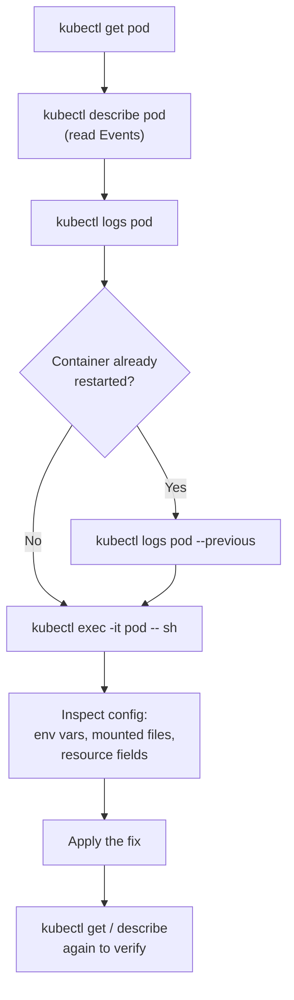
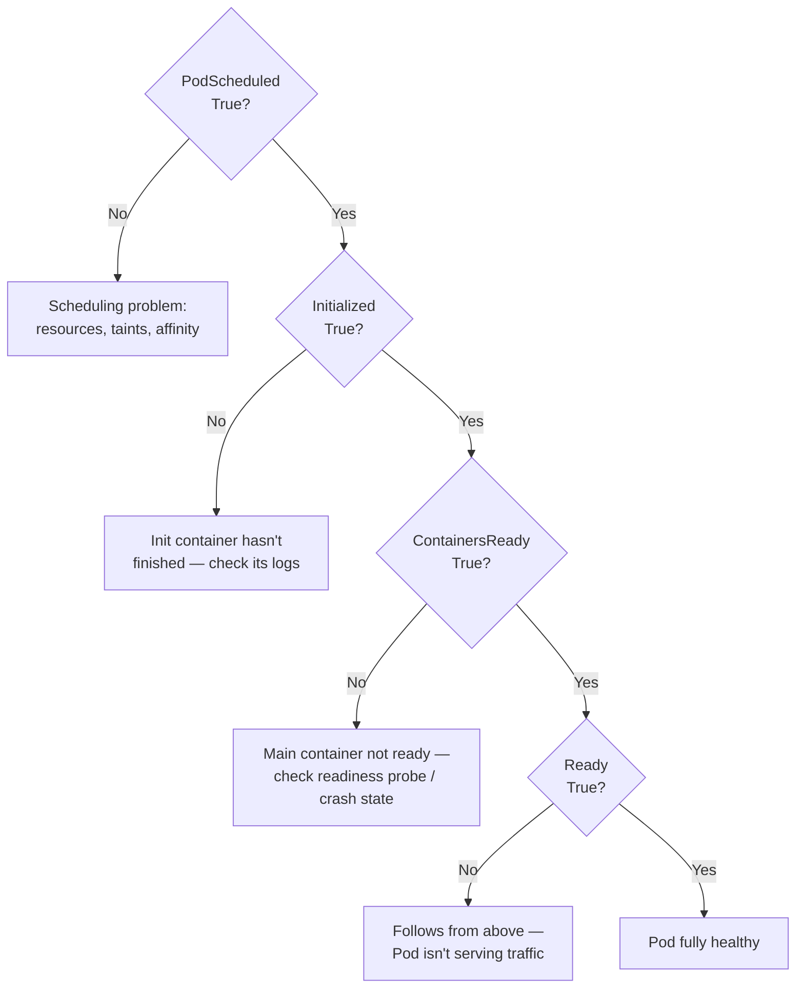
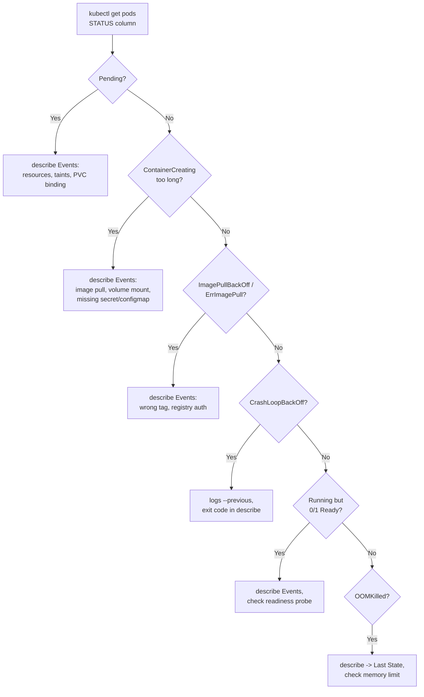
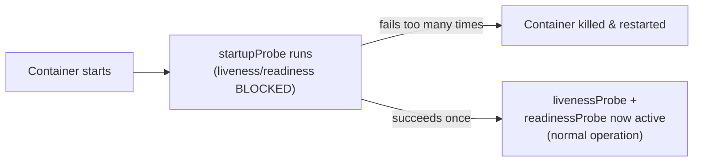

# Chapter 5 — Application Observability and Maintenance (15%)

This is the smallest domain by weight but arguably the highest-leverage: debugging skill from this chapter is what actually lets you finish the *other* four domains' tasks when something doesn't work on the first try.

**⏱ Estimated time:** 1.5–2 hours across all seven topics below — but the habits here pay for themselves throughout every other chapter's practice.

## Learning Objectives

By the end of this chapter, you should be able to:

- Follow a fixed, repeatable diagnostic sequence instead of guessing when something is broken.
- Read a Pod's `Conditions` block to identify exactly which lifecycle stage is stuck, faster than scanning Events.
- Recognize each common Pod failure state (`Pending`, `ImagePullBackOff`, `CrashLoopBackOff`, `OOMKilled`, etc.) on sight and know where to look first.
- Read a container's exit code and map it directly to a likely cause without needing to open logs.
- Explain why `startupProbe` must gate `livenessProbe`/`readinessProbe` for slow-starting applications.
- Use CLI monitoring commands (`top`, custom columns, event sorting) to get a fast operational picture of a namespace.
- Recognize a deprecated `apiVersion` error and fix it without needing to touch the rest of the spec.
- Explain what `cordon` and `drain` do, and recognize Pod rescheduling caused by planned node maintenance.

## 5.1 The Debugging Workflow 🔴 MUST KNOW

---

## 🧪 Practice — Diagnose a Failing Pod

### Task
A Pod named `checkout` in namespace `debug` is not working. Diagnose the failure using the chapter's workflow. Do not change anything until you have collected enough evidence to identify the failing stage, then make the smallest required correction.

### Requirements
- Use `get`, then `describe`, then `logs` or `exec` only when appropriate.
- Inspect Conditions and Events.
- If the container has restarted, inspect previous logs.
- Verify the final Pod state after the fix.

### Success Criteria
You can state the failure stage, identify the evidence that proves it, make the smallest correction, and verify the Pod becomes healthy.

### Suggested Time
**10 minutes**

<details>
<summary>💡 Hint</summary>

Start with `kubectl get pod checkout -n debug -o wide`, then `kubectl describe pod checkout -n debug`. Match the next command to the lifecycle stage that is failing.

</details>

<details>
<summary>✅ Solution</summary>

```bash
kubectl get pod checkout -n debug -o wide
kubectl describe pod checkout -n debug
kubectl get pod checkout -n debug -o jsonpath='{.status.conditions}'
kubectl logs checkout -n debug
kubectl logs checkout -n debug --previous
```

Use the evidence to identify the failure stage, correct that issue, then verify with `kubectl get pod checkout -n debug` and `kubectl describe pod checkout -n debug`.

</details>

Use this exact sequence on every broken resource, every time, instead of guessing:

```
kubectl get <kind>
      ↓  (status, restarts, READY column)
kubectl describe <kind> <name>
      ↓  (Events section — almost always names the exact problem)
kubectl logs <pod> [-c <container>]
      ↓  (application-level errors)
kubectl logs <pod> --previous
      ↓  (if the container already restarted — see the crash, not the fresh boot)
inspect Events again for scheduling/image/volume problems
      ↓
kubectl exec -it <pod> -- sh
      ↓  (confirm files, env vars, connectivity from inside the container)
inspect configuration (env vars, mounted files, resource fields)
      ↓
apply the fix
      ↓
kubectl get / describe again to verify
```

The same sequence as a flowchart — the point is to always move top to bottom, never skip a stage to jump straight to a guess:



🔴 **Discipline matters more than any individual command here.** Don't jump straight to `exec` on a Pod that's `Pending` — it isn't running yet, so there's nothing to exec into. Match the tool to the failure stage: `Pending`/scheduling problems live in `describe` Events; `CrashLoopBackOff`/runtime problems live in `logs`.

### Reading the Conditions block — faster than Events for "which stage failed"

`kubectl describe pod` also prints a `Conditions` table, separate from Events. Where Events is a scrolling log of what happened, Conditions is a snapshot of exactly which lifecycle stage the Pod is currently stuck at:

```bash
kubectl describe pod mypod | grep -A6 Conditions
```
```
Conditions:
  Type              Status
  PodScheduled      True
  Initialized       True
  ContainersReady   False
  Ready             False
```

| Condition | `False` means |
|---|---|
| `PodScheduled` | Not yet placed on a node — scheduling problem (resources, taints, affinity) |
| `Initialized` | An init container hasn't finished — check init container logs |
| `ContainersReady` | A main container isn't ready — check readiness probe / crash state |
| `Ready` | Follows from the above — overall Pod isn't serving traffic |

🟡 Reading top-to-bottom, the **first `False` condition tells you exactly which stage to investigate** — no need to guess between a scheduling problem and a runtime problem before you've even opened Events.



> **🌍 Real-world example.** On-call engineers at most companies follow almost exactly this sequence during an incident, often without consciously naming it: PagerDuty fires because a Deployment's replica count dropped, `kubectl get pods` shows `CrashLoopBackOff`, `kubectl describe pod` Events shows `Back-off restarting failed container`, and `kubectl logs --previous` reveals the actual application stack trace from the crash. The entire "identify -> describe -> logs -> exec -> fix -> verify" loop in this chapter isn't exam-specific trivia — it's the literal muscle memory that separates a five-minute incident from a forty-five-minute one in production.

---

## 5.2 Container Logs 🔴 MUST KNOW

---

## 🧪 Practice — Find the Previous Crash

### Task
Pod `worker` in namespace `ops` has restarted at least once. The current container is running. Find why the previous instance crashed.

### Requirements
- Pod: `worker`; namespace: `ops`.
- Retrieve the previous container's output.
- Do not delete or restart the Pod before collecting evidence.

### Success Criteria
You retrieve the previous instance's logs and identify the error responsible for the restart.

### Suggested Time
**5 minutes**

<details>
<summary>💡 Hint</summary>

The flag you need is `--previous`.

</details>

<details>
<summary>✅ Solution</summary>

```bash
kubectl get pod worker -n ops
kubectl logs worker -n ops --previous
kubectl describe pod worker -n ops
```

For a multi-container Pod, add `-c <container-name>`.

</details>

```bash
kubectl logs mypod
kubectl logs mypod -c sidecar              # multi-container pod
kubectl logs mypod --previous              # logs from the container BEFORE its last restart
kubectl logs mypod --previous -c sidecar
kubectl logs mypod -f                      # follow/stream
kubectl logs mypod --since=10m
kubectl logs mypod --tail=50
kubectl logs -l app=web --all-containers=true --prefix=true   # logs from every matching pod
```

🔴 `--previous` is the detail candidates forget most often — if a container has already restarted, `kubectl logs` without `--previous` shows the *new* attempt's logs, which are often just a clean startup with no sign of what actually crashed it.

> **🌍 Real-world example.** A support engineer once spent twenty minutes convinced a service had "no error logs at all" during an incident — `kubectl logs` showed a perfectly clean, quiet startup sequence, nothing unusual. The container had actually been crash-looping every 90 seconds; every time they ran `kubectl logs`, it happened to catch the brand-new attempt's fresh boot, seconds after the previous crash. The instant they added `--previous`, the real stack trace (a missing environment variable causing a null pointer exception at startup) was right there. This gap between "the crash" and "the freshest restart" is the single most common reason logs look misleadingly clean during an active `CrashLoopBackOff`.

---

## 5.3 Debugging Failure States 🔴 MUST KNOW

---

## 🧪 Practice — Diagnose OOMKilled

### Task
Pod `memory-test` in namespace `debug` repeatedly restarts. Determine whether the container was killed because it exceeded its memory limit. Report the termination reason, exit code, and configured memory limit.

### Requirements
- Inspect the last termination state.
- Confirm the resource limit instead of inferring from restart count.
- Explain what the evidence means.

### Success Criteria
You identify the termination evidence and the configured memory limit.

### Suggested Time
**7 minutes**

<details>
<summary>💡 Hint</summary>

`kubectl describe pod` shows `Last State`; JSONPath can retrieve the termination reason and exit code directly.

</details>

<details>
<summary>✅ Solution</summary>

```bash
kubectl describe pod memory-test -n debug
kubectl get pod memory-test -n debug -o jsonpath='{.status.containerStatuses[*].lastState.terminated.reason}{"\n"}{.status.containerStatuses[*].lastState.terminated.exitCode}{"\n"}'
kubectl get pod memory-test -n debug -o jsonpath='{.spec.containers[*].resources.limits.memory}{"\n"}'
```

If the termination reason is `OOMKilled`, the container exceeded its memory limit. Exit code `137` commonly accompanies this termination.

</details>

| State | Meaning | Where to look |
|---|---|---|
| `Pending` | Not yet scheduled | `describe` Events — resources, taints, PVC binding, node selector |
| `ContainerCreating` | Scheduled, container not started | `describe` Events — image pull, volume mount, secret/configmap missing |
| `ImagePullBackOff` / `ErrImagePull` | Can't pull the image | `describe` Events — wrong tag, private registry auth, typo |
| `CrashLoopBackOff` | Container starts then exits repeatedly | `logs --previous`, exit code in `describe` |
| `Error` / non-zero exit | Container ran and failed | `logs`, exit code in `describe` under Last State |
| `OOMKilled` | Killed for exceeding memory limit | `describe` -> Last State: reason |
| `Running` but `0/1 Ready` | Readiness probe failing | `describe` Events, check probe config and app health endpoint |
| `Unknown` | Node unreachable / kubelet not reporting | `kubectl get nodes`, node-level issue |

The same table as a quick-lookup flow — useful when `kubectl get pods` shows a status you need to act on immediately:



**Diagnosing `ImagePullBackOff`:**
```bash
kubectl describe pod mypod | grep -A5 Events
# common causes: typo'd tag, private registry with no imagePullSecrets, rate-limited public registry
kubectl get pod mypod -o jsonpath='{.spec.containers[*].image}'
```

**Diagnosing `CrashLoopBackOff`:**
```bash
kubectl logs mypod --previous
kubectl describe pod mypod | grep -A5 "Last State"
# common causes: app crashes on bad config/missing env var, wrong command/args, failing startup probe
```

### Exit codes — a faster read than logs, when logs are empty

`kubectl describe pod` shows the container's last exit code under `Last State`. Recognizing common codes on sight saves a diagnostic round-trip:

| Exit code | Meaning | What to check |
|---|---|---|
| `0` | Clean exit | Normal for a Job/init container; unexpected for a long-running app — likely missing `sleep`/foreground process |
| `1` | Generic application error | App-level logic error — check `logs` |
| `137` | `128 + 9` = killed by `SIGKILL` | Almost always `OOMKilled` — check memory limit, or the node killed it |
| `139` | `128 + 11` = segmentation fault | Application/runtime bug, not a Kubernetes config issue |
| `143` | `128 + 15` = killed by `SIGTERM` | Graceful shutdown request — normal during scale-down/rollout, investigate only if unexpected |

```bash
kubectl describe pod mypod | grep -A3 "Last State"
```

**Ephemeral debug containers — for Pods too minimal to have a shell:**
```bash
kubectl debug mypod -it --image=busybox --target=app
kubectl debug node/<node-name> -it --image=busybox   # debug a node itself
```
🟡 Use this when the running container image has no shell/tools (`distroless`, `scratch`) — it attaches a temporary debug container sharing the target's process namespace without modifying the original Pod spec.

> **🌍 Real-world example.** Security-conscious teams increasingly ship production images built `FROM scratch` or `FROM gcr.io/distroless/static` — no shell, no package manager, no `ls`, nothing an attacker could use if they somehow got code execution inside the container (this is the same security principle behind Chapter 1's `readOnlyRootFilesystem` and dropped capabilities: minimize what's available to abuse). The tradeoff is that a developer can no longer `kubectl exec -it mypod -- sh` to poke around when something's wrong. `kubectl debug --target=app` was built specifically to resolve this tension: it attaches a full-featured temporary container (e.g., `busybox` or a custom debug image with `curl`, `netstat`, `strace`) that shares the *same* process and network namespace as the minimal target container, giving you a shell to investigate without ever weakening the production image itself.

**Verify after any fix:**
```bash
kubectl get pod mypod -w
kubectl get pod mypod -o jsonpath='{.status.phase}'
kubectl describe pod mypod | tail -20
```

---

## 5.4 Probes and Health Checks 🔴 MUST KNOW

---

## 🧪 Practice — Correct Application Probes

### Task
Deployment `api` in namespace `prod` starts slowly. Its readiness endpoint is `/ready` on port `8080`; its liveness endpoint is `/healthz`. Configure the probes so slow startup is protected, readiness controls Service traffic, and liveness controls restarts.

### Requirements
- Use a `startupProbe` for the slow startup.
- Readiness must use `/ready` on `8080`.
- Liveness must use `/healthz` on `8080`.
- Verify rollout and Service endpoints after the change.

### Success Criteria
The Pod is not sent traffic before readiness succeeds, slow startup is not killed prematurely, and liveness checks the health endpoint after startup.

### Suggested Time
**10 minutes**

<details>
<summary>💡 Hint</summary>

Readiness controls routing; liveness controls restarts; `startupProbe` protects slow-starting containers.

</details>

<details>
<summary>✅ Solution</summary>

Inspect first:

```bash
kubectl describe deployment api -n prod
kubectl get pods -n prod
kubectl describe pod <api-pod> -n prod
```

A representative configuration is:

```yaml
startupProbe:
  httpGet:
    path: /healthz
    port: 8080
  failureThreshold: 30
  periodSeconds: 2
readinessProbe:
  httpGet:
    path: /ready
    port: 8080
livenessProbe:
  httpGet:
    path: /healthz
    port: 8080
```

Verify with:

```bash
kubectl rollout status deployment/api -n prod
kubectl get pods -n prod
kubectl get endpoints api -n prod
```

</details>

**What it is.** Kubernetes-native health checks the kubelet runs against each container.

| Probe | Purpose | Effect on failure |
|---|---|---|
| `startupProbe` | Handles slow-starting apps | Blocks liveness/readiness checks until it succeeds; failing it kills and restarts the container |
| `livenessProbe` | "Is this container still healthy?" | Failure -> container is killed and restarted |
| `readinessProbe` | "Can this container serve traffic right now?" | Failure -> Pod removed from Service endpoints (not restarted) |

**Why CKAD tests it.** OM-02, and one of the highest-value skills for real production apps — misconfigured probes cause both false restarts and silent traffic blackholes.

```yaml
containers:
- name: web
  image: myapp
  startupProbe:
    httpGet:
      path: /startupz
      port: 8080
    failureThreshold: 30
    periodSeconds: 10
  livenessProbe:
    httpGet:
      path: /healthz
      port: 8080
    initialDelaySeconds: 15
    periodSeconds: 10
    failureThreshold: 3
  readinessProbe:
    tcpSocket:
      port: 8080
    periodSeconds: 5
```

**Probe mechanisms:**
```yaml
httpGet: {path: /healthz, port: 8080}     # success = 2xx/3xx response
tcpSocket: {port: 8080}                   # success = TCP connection succeeds
exec:
  command: ["cat", "/tmp/healthy"]        # success = exit code 0
```

**Verify:**
```bash
kubectl describe pod mypod | grep -A10 Liveness
kubectl get pod mypod                     # READY column reflects readinessProbe state
kubectl describe pod mypod | grep -A5 Events   # probe failure events appear here
```

**Troubleshoot:**

| Problem | Cause | Fix |
|---|---|---|
| Pod restarts repeatedly despite app looking fine in logs | `initialDelaySeconds` too short for actual app startup time | Increase `initialDelaySeconds` or add a `startupProbe` |
| Pod `Running` but never receives traffic | `readinessProbe` failing (wrong path/port) | Fix probe target, confirm endpoint returns success from inside the container |
| Probe checks the wrong port | `port` doesn't match container's actual listening port | Align probe `port` with app config |
| App marked healthy but actually deadlocked | Liveness probe target too shallow (e.g., pings a static file, not real app logic) | Point liveness at a meaningful health endpoint |

🔴 **The one-line distinction the exam loves:** readiness failure = "stop sending me traffic, I'm still alive" (no restart). Liveness failure = "I'm broken, kill and restart me."

### Startup Probe Priority — Critical for Slow-Starting Apps

**Key insight:** `startupProbe` gates `livenessProbe` and `readinessProbe`. If a container has a `startupProbe`:
- Kubelet runs the `startupProbe` first, ignoring liveness/readiness until it succeeds.
- Once `startupProbe` succeeds *once*, `livenessProbe` and `readinessProbe` activate.
- If `startupProbe` fails too many times, the container is killed and restarted.

**Critical**: `initialDelaySeconds` is *ignored* on `livenessProbe` and `readinessProbe` if a `startupProbe` exists — the startup probe itself provides the grace period.



**Real exam pattern:**
```yaml
containers:
- name: slow-app
  image: myapp
  startupProbe:
    httpGet:
      path: /health
      port: 8080
    failureThreshold: 30        # 30 attempts × 10s = 5 minutes to start
    periodSeconds: 10
  livenessProbe:
    httpGet:
      path: /health
      port: 8080
    periodSeconds: 10           # runs *after* startupProbe succeeds
  readinessProbe:
    httpGet:
      path: /ready
      port: 8080
    periodSeconds: 5
```

The wrong way (old code, no startupProbe):
```yaml
containers:
- name: slow-app
  image: myapp
  livenessProbe:
    httpGet:
      path: /health
      port: 8080
    initialDelaySeconds: 10    # WRONG: only gives 10 seconds, but app needs 45+
    periodSeconds: 10
```

Result: CrashLoopBackOff until you add the startupProbe or increase `initialDelaySeconds` to 45+, which is brittle (app slow-down breaks it).

> **🌍 Real-world example.** A payments API that took 45 seconds to warm up its JVM and database connection pool used to get killed and restarted in an endless loop under load — the `livenessProbe`'s `initialDelaySeconds: 10` fired long before the app was actually ready, the probe failed, Kubernetes concluded the container was broken, killed it, and the *new* container hit the exact same 45-second warm-up and got killed again. Nothing was ever actually wrong with the app; the probe configuration itself was the bug. Adding a `startupProbe` with a generous `failureThreshold` (e.g., 30 attempts at 10-second intervals = 5 minutes of grace) fixed it instantly: `startupProbe` exists precisely to give slow-booting apps room to start without either disabling liveness checking altogether or setting a liveness delay so long it can't catch a real hang once the app is up.

> **📚 Theory.** The readiness/liveness split reflects two genuinely different failure questions that a naive single health check conflates: "is this process alive" and "is this process currently able to do useful work." A database connection pool that's temporarily exhausted, or a downstream dependency that's briefly unreachable, is a *readiness* problem — restarting the container fixes nothing and just adds restart churn on top of an already-degraded dependency. Only a genuinely stuck or deadlocked process — one where restarting is actually curative — should ever trigger a liveness failure.

---

## 5.5 CLI Monitoring Tools 🟡 SHOULD KNOW

---

## 🧪 Practice — Identify the Highest Resource Consumer

### Task
Namespace `load` contains several running Pods. Identify the highest CPU consumer and highest memory consumer using Kubernetes metrics.

### Requirements
- Use `kubectl top`.
- Report the highest CPU and memory consumers.
- If metrics are unavailable, diagnose that instead of inventing values.

### Success Criteria
You identify the consumers from current metrics, or correctly identify that the metrics API is unavailable.

### Suggested Time
**5 minutes**

<details>
<summary>💡 Hint</summary>

Use `kubectl top pods -n load` and, when container-level detail is needed, `--containers`.

</details>

<details>
<summary>✅ Solution</summary>

```bash
kubectl top pods -n load
kubectl top pods -n load --containers
kubectl top nodes
```

If metrics are unavailable, inspect the API service rather than substituting resource requests/limits for actual usage:

```bash
kubectl get apiservice | grep metrics
```

</details>

```bash
kubectl top pods
kubectl top pods --containers
kubectl top nodes
kubectl get pods -o wide
kubectl get pods --sort-by=.status.startTime
kubectl get pods -o custom-columns='NAME:.metadata.name,STATUS:.status.phase,RESTARTS:.status.containerStatuses[0].restartCount'
kubectl get events --sort-by=.lastTimestamp
kubectl get events -n dev --field-selector involvedObject.name=mypod
```

🟢 `kubectl top` requires the metrics-server add-on to be running in-cluster — assume it's present in the exam environment.

---

## 5.6 API Deprecations 🟡 SHOULD KNOW

---

## 🧪 Practice — Repair a Rejected API Version

### Task
A supplied manifest is rejected because its `apiVersion` is no longer served by the cluster. Determine the supported API version for the same resource and update only what is required.

### Requirements
- Identify the resource `kind`.
- Determine the served API version.
- Validate with server-side dry run.
- Avoid unrelated changes.

### Success Criteria
The manifest passes server-side validation and applies using a currently served API version.

### Suggested Time
**7 minutes**

<details>
<summary>💡 Hint</summary>

Use `kubectl api-resources` and `kubectl api-versions`.

</details>

<details>
<summary>✅ Solution</summary>

```bash
kubectl api-resources
kubectl api-versions
kubectl apply -f manifest.yaml --dry-run=server
```

Change only the obsolete `apiVersion` to the served version for that resource, then apply:

```bash
kubectl apply -f manifest.yaml
```

</details>

**What it is.** Kubernetes periodically removes old API versions of a resource after a deprecation window; manifests using a removed `apiVersion` are rejected outright.

**Why CKAD tests it.** OM-01 — recognizing and migrating a deprecated `apiVersion` is a realistic, common real-world maintenance task.

```bash
kubectl api-resources                                  # current available kinds/versions
kubectl api-versions
kubectl explain deployment                              # shows the current recommended apiVersion
kubectl apply -f old-manifest.yaml --dry-run=server     # server will reject/warn on removed APIs
kubectl convert -f old.yaml --output-version apps/v1    # if the convert plugin is installed
```

Common historical migrations worth recognizing on sight: `extensions/v1beta1` -> `apps/v1` (Deployments, DaemonSets), `policy/v1beta1` -> `policy/v1` (PodDisruptionBudget), `batch/v1beta1` -> `batch/v1` (CronJob), `networking.k8s.io/v1beta1` -> `networking.k8s.io/v1` (Ingress).

🟡 **Exam tip:** if applying a manifest fails with an error naming an unrecognized `apiVersion` or `kind`, that's the whole task — fix the `apiVersion` string to the current one and re-apply; nothing else in the spec usually needs to change.

> **🌍 Real-world example.** Teams that pin a Kubernetes cluster's minor version for stability (common in regulated environments that only upgrade twice a year after a change-control review) periodically get an unpleasant surprise when they finally upgrade several versions at once: manifests that had been working unchanged for two years suddenly fail outright because an `apiVersion` used since a very old tutorial (`extensions/v1beta1` Deployments, for instance) was removed entirely, not just deprecated. The exam tests the same muscle real platform teams need before any cluster upgrade: run `kubectl apply --dry-run=server` against every manifest in the repo ahead of time and fix deprecated API versions proactively, rather than discovering them mid-outage during the actual upgrade window.

---

## 5.7 Node Maintenance — Cordon and Drain 🟢 NICE TO KNOW

---

## 🧪 Practice — Prepare a Node for Maintenance

### Task
Node `node1` must be taken out of scheduling and prepared for maintenance. Cordon it, drain eligible workloads, verify the result, then uncordon it.

### Requirements
- Cordon before drain.
- Use `--ignore-daemonsets`.
- Use `--delete-emptydir-data` only when accepting removal of ephemeral data.
- Do not delete the node.

### Success Criteria
The node becomes `SchedulingDisabled`, eligible workloads are evicted/rescheduled, and the node is schedulable again after uncordoning.

### Suggested Time
**7 minutes**

<details>
<summary>💡 Hint</summary>

`cordon` prevents new scheduling; `drain` evicts existing Pods. Read any drain error before adding force options.

</details>

<details>
<summary>✅ Solution</summary>

```bash
kubectl cordon node1
kubectl get nodes
kubectl drain node1 --ignore-daemonsets --delete-emptydir-data
kubectl get pods -A -o wide
kubectl uncordon node1
kubectl get nodes
```

</details>

**What it is.** `cordon` marks a node unschedulable (existing Pods keep running); `drain` additionally evicts existing Pods so the node can be safely taken down.

**Why CKAD tests it.** Listed under OM-05 debugging awareness — you may need to recognize *why* Pods rescheduled, even though performing cluster maintenance itself is more of a CKA task.

```bash
kubectl cordon node1
kubectl drain node1 --ignore-daemonsets --delete-emptydir-data
kubectl uncordon node1
```

**Verify:**
```bash
kubectl get nodes                          # SCHEDULING DISABLED next to cordoned node
kubectl get pods -o wide                   # confirm Pods moved off the drained node
```

> **🌍 Real-world example.** Before applying a security patch to a node's operating system, or right before that node is scheduled for decommission by a cloud provider, an SRE cordons it (stopping any *new* Pods from landing there) and then drains it (gracefully evicting every existing Pod, respecting PodDisruptionBudgets so a rolling drain doesn't take an entire Deployment down at once). The Pods reschedule onto other nodes automatically because the Deployment/StatefulSet controllers behind them are continuously reconciling toward their desired replica count — the exact same reconciliation loop discussed in Chapter 2.2. As an application developer you rarely run `drain` yourself, but recognizing "my Pod moved nodes and I didn't touch it" as a routine maintenance event — not a mystery — is the OM-05 competency being tested here.

**Exam Tips — Chapter 5**
- Always run `describe` before `logs` — Events often name the exact problem (bad image, unschedulable, failed mount) before you'd ever see it in application logs.
- `--previous` is the single most forgotten flag on the exam; use it by default whenever `RESTARTS` is greater than 0.
- Readiness ≠ Liveness: readiness pulls a Pod out of Service rotation without restarting it; liveness kills and restarts the container.
- If `kubectl exec` isn't available (no shell in the image), reach for `kubectl debug` instead of declaring the Pod unfixable.
- Check `Conditions` before `Events` when you just need to know *which stage* is stuck — it's a four-line snapshot instead of a scrolling log.
- Exit code `137` means OOMKilled almost every time — go straight to the memory limit instead of reading application logs first.

## Chapter Summary

| Topic | One-line takeaway |
|---|---|
| Debugging workflow (5.1) | `get` → `describe` → `logs` → `exec`, in that order — match the tool to the failure stage |
| Conditions (5.1) | The first `False` condition top-to-bottom tells you exactly which stage is stuck |
| Container logs (5.2) | `--previous` is the most forgotten flag — use it whenever RESTARTS > 0 |
| Failure states (5.3) | Each status (`Pending`, `ImagePullBackOff`, `CrashLoopBackOff`, `OOMKilled`...) has one clear diagnostic path |
| Exit codes (5.3) | `137` = OOMKilled, `139` = segfault, `143` = graceful SIGTERM — a faster read than logs when logs are empty |
| Probes (5.4) | Readiness failure = stop routing traffic (no restart); liveness failure = kill and restart; `startupProbe` gates both for slow-starting apps |
| CLI monitoring (5.5) | `kubectl top` needs metrics-server; custom-columns and event sorting give a fast operational picture |
| API deprecations (5.6) | A rejected `apiVersion` is a one-line fix — update the string, nothing else usually changes |
| Cordon/Drain (5.7) | Planned maintenance moves Pods automatically via the same reconciliation loop from Chapter 2 |

**Next:** Chapter 6 — CKAD Command Mastery consolidates every `kubectl` command from Chapters 0–5 into fast-reference form for exam-day speed.
\newpage

