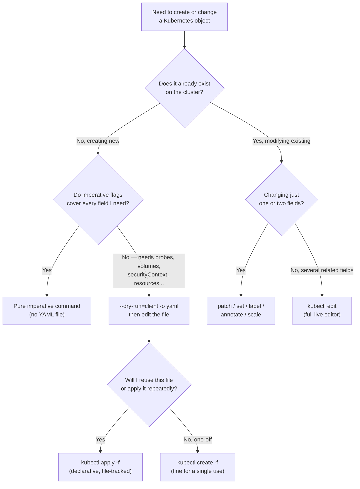

# Chapter 6 — CKAD Command Mastery

Speed on the exam comes from commands, not memorized YAML. This chapter is a working reference, not new material — everything here was already used in context in Chapters 0–5. The goal now is to compress it into muscle memory.

**⏱ Estimated time:** 45–60 minutes to read through once, but the real investment is ongoing — re-run these commands daily until typing them is automatic. Treat this chapter as a drill sheet, not a one-time read.

## Learning Objectives

By the end of this chapter, you should be able to:

- Decide instantly whether a task calls for a pure imperative command, a generated-then-edited YAML file, or a targeted patch/set/label command.
- Generate a working YAML skeleton for any common object type in under 30 seconds.
- Modify a single field on a live object without regenerating or reapplying the whole manifest.
- Use `kubectl apply`/`diff`/`delete -f` confidently for declarative, file-based management.
- Query cluster state quickly with output formats, label/field selectors, JSONPath, and custom columns.
- Set your working namespace once per task instead of repeating `-n <namespace>` on every command.

---

## 🧪 Practice — Command Decision Challenge

### Task

For each scenario, choose the fastest correct approach before executing it:

A. Create a simple Pod with an image and label.
B. Create a Deployment needing a readiness probe and resource limits.
C. Change only the image of an existing Deployment.
D. Scale an existing Deployment.
E. Apply a reusable multi-object manifest from a file.
F. Add a label to an existing Pod.

Choose: pure imperative, generate-and-edit, targeted command, or apply-from-file.

### Requirements

State your chosen approach for each, then perform the task. Do not choose a slower method merely because it is familiar.

### Success Criteria

You select and execute the appropriate strategy for every scenario.

### Suggested Time

**8 minutes**

<details>
<summary>💡 Hint</summary>

The section's decision rule is the framework: simple creation → imperative; unsupported fields → generate/edit; one-field live change → targeted command; reusable multi-object state → YAML/apply.

</details>

<details>
<summary>✅ Solution</summary>

A: pure imperative.
B: generate with `--dry-run=client -o yaml`, then edit.
C: `kubectl set image`.
D: `kubectl scale`.
E: apply from YAML.
F: `kubectl label`.

Verify each result with a focused `get` or `describe`.

</details>

## 6.1 Imperative + Declarative Philosophy 🔴 MUST KNOW

**What it is.** There is no ideological "correct" way to create a Kubernetes object — the goal is **speed and accuracy under a 2-hour clock.**

**Why CKAD tests it.** The exam rewards whichever path gets a correct object onto the cluster fastest. Knowing the decision rule below, cold, is what separates candidates who finish with time to spare from candidates who don't.

Use this decision rule:

| Situation | Use |
|---|---|
| Simple object, all needed fields covered by an imperative flag | Pure imperative command, no YAML file at all |
| Object needs fields no imperative flag covers (probes, volumes, securityContext, resources) | Generate with `--dry-run=client -o yaml`, then edit the file |
| Modifying one field on an existing object | `kubectl edit`, `kubectl patch`, `kubectl set`, `kubectl label`/`annotate`/`scale` — don't regenerate the whole object |
| Object you'll want to reuse or that's part of a multi-object manifest | Write/edit YAML, `kubectl apply -f` |

The same decision, as a quick visual:



🔴 **The four-way decision above (imperative / generate-and-edit / targeted-patch / apply-from-file) is the single highest-leverage habit in this whole guide** — internalizing it is what actually determines your exam pace, more than knowing any individual command's flags.

---

## 🧪 Practice — Imperative Creation Speed Drill

### Task

Create these objects using the fastest appropriate `kubectl` commands. Do not write YAML unless the command cannot satisfy the requirement.

1. Pod `web` using `nginx`.
2. Deployment `api` using `nginx` with 3 replicas.
3. Job `report` using `busybox` that runs `echo done`.
4. CronJob `nightly` using `busybox` that runs `echo hi` every 5 minutes.
5. ConfigMap `app-config` containing `MODE=prod`.
6. Secret `app-secret` containing `TOKEN=demo`.

### Requirements

- Complete all six from the command line.
- Prefer imperative creation.
- Verify the created objects.

### Success Criteria

All six objects exist with the requested names and configuration.

### Suggested Time

**8 minutes**

<details>
<summary>💡 Hint</summary>

Use the command patterns in section 6.2. The exercise is testing command recall and speed.

</details>

<details>
<summary>✅ Solution</summary>

```bash
kubectl run web --image=nginx
kubectl create deployment api --image=nginx --replicas=3
kubectl create job report --image=busybox -- echo done
kubectl create cronjob nightly --image=busybox --schedule="*/5 * * * *" -- echo hi
kubectl create configmap app-config --from-literal=MODE=prod
kubectl create secret generic app-secret --from-literal=TOKEN=demo
kubectl get pods,deployments,jobs,cronjobs,configmaps,secrets
```

</details>

## 6.2 Fast Creation Reference 🔴 MUST KNOW

These are the imperative commands that cover the large majority of "create a `<kind>`" tasks without ever opening an editor.

```bash
kubectl run mypod --image=nginx
kubectl run mypod --image=nginx --port=80 --env="MODE=prod" --labels="app=web"
kubectl run mypod --image=nginx --restart=Never    # a bare Pod, not a Deployment

**Batch-Pod note:** `kubectl run` defaults a Pod to `restartPolicy: Always`; use `--restart=Never` or `--restart=OnFailure` when the Pod is intended for batch-style execution.

kubectl create deployment web --image=nginx --replicas=3
kubectl create job report --image=busybox -- echo done
kubectl create cronjob nightly --image=busybox --schedule="*/5 * * * *" -- echo hi
kubectl create configmap app-config --from-literal=key=value
kubectl create secret generic app-secret --from-literal=key=value
kubectl create serviceaccount app-sa
kubectl create namespace dev
kubectl create role pod-reader --verb=get,list --resource=pods
kubectl create rolebinding rb --role=pod-reader --serviceaccount=dev:app-sa
kubectl expose deployment web --port=80 --target-port=8080
kubectl create ingress web-ing --rule="host.com/*=web:80"
```

🟡 **Common mistake:** `kubectl run` creates a bare Pod by default (not a Deployment) — use `kubectl create deployment` when you actually need replicas, rollouts, or self-healing.

---

## 🧪 Practice — Generate Then Edit

### Task

Create Deployment `web` in namespace `practice` using `nginx:1.27` with 2 replicas.

Generate the initial YAML using `--dry-run=client -o yaml`, then edit it to add:
- Pod template label `app=web`;
- container port `80`;
- readiness probe `/` on port `80`;
- memory request `64Mi`;
- memory limit `128Mi`.

Apply and verify.

### Requirements

Generate the initial manifest rather than writing it from an empty file. Add the requested fields, apply it, and verify.

### Success Criteria

The Deployment applies successfully with 2 replicas and all requested fields.

### Suggested Time

**10 minutes**

<details>
<summary>💡 Hint</summary>

Generate the skeleton first; add only fields that the imperative command does not conveniently provide.

</details>

<details>
<summary>✅ Solution</summary>

```bash
kubectl create deployment web --image=nginx:1.27 --replicas=2 --dry-run=client -o yaml > web.yaml
```

Edit `web.yaml`, then:

```bash
kubectl apply -f web.yaml
kubectl get deployment web
kubectl get pods --show-labels
kubectl describe deployment web
```

</details>

## 6.3 Generate YAML, Then Edit 🔴 MUST KNOW

When a task needs a field no imperative flag exposes, generate the skeleton first — never start from a blank file.

```bash
kubectl create deployment web --image=nginx --dry-run=client -o yaml > deploy.yaml
kubectl run mypod --image=nginx --dry-run=client -o yaml > pod.yaml
kubectl create configmap app-config --from-literal=key=value --dry-run=client -o yaml > cm.yaml
kubectl create secret generic app-secret --from-literal=key=value --dry-run=client -o yaml > secret.yaml
kubectl expose deployment web --port=80 --dry-run=client -o yaml > svc.yaml
```

Set this once per exam session:
```bash
export do="--dry-run=client -o yaml"
kubectl create deployment web --image=nginx $do > deploy.yaml
```

🔴 **Never hand-write a manifest from a blank file if an imperative command can generate 90% of it.** Generate, then open in your editor and add only the fields the imperative command can't set (probes, volumes, resources, security context).

---

## 🧪 Practice — Targeted Modification Drill

### Task

A Deployment named `web` already exists.

Perform these changes using the fastest targeted command:
1. Scale to 5 replicas.
2. Change the image to `nginx:1.28`.
3. Add label `team=platform`.
4. Add annotation `owner=platform`.
5. Set container environment variable `MODE=prod`.
6. Perform one targeted patch.

### Requirements

- Do not regenerate the Deployment YAML.
- Use the appropriate targeted command for each change.
- Verify the final state.

### Success Criteria

All requested changes are present without regenerating the whole object.

### Suggested Time

**8 minutes**

<details>
<summary>💡 Hint</summary>

Match each operation to `scale`, `set image`, `label`, `annotate`, `set env`, or `patch`.

</details>

<details>
<summary>✅ Solution</summary>

```bash
kubectl scale deployment web --replicas=5
kubectl set image deployment/web <container-name>=nginx:1.28
kubectl label deployment web team=platform
kubectl annotate deployment web owner=platform
kubectl set env deployment web MODE=prod
kubectl patch deployment web --type='json' -p='[{"op":"replace","path":"/spec/replicas","value":5}]'
kubectl get deployment web -o yaml
```

</details>

## 6.4 Modifying Existing Resources 🔴 MUST KNOW

```bash
kubectl edit deployment web                       # opens in $KUBE_EDITOR, full live edit
kubectl patch deployment web -p '{"spec":{"replicas":5}}'
kubectl patch pod mypod --type=json -p='[{"op":"replace","path":"/spec/containers/0/image","value":"nginx:1.28"}]'
kubectl set image deployment/web nginx=nginx:1.28
kubectl set env deployment/web MODE=prod
kubectl set resources deployment/web -c=web --limits=cpu=500m,memory=256Mi
kubectl label pod mypod tier=frontend
kubectl annotate pod mypod description="checkout service"
kubectl scale deployment web --replicas=5
```

🔴 **`kubectl edit` opens a full YAML editor on the live object** — often the single fastest way to add a field (a probe, a volume) that has no dedicated flag, without regenerating the whole manifest from scratch.

**Picking the right patch strategy:**

| Patch type | Flag | Behavior | Use when |
|---|---|---|---|
| Strategic merge (default) | *(none)* | Understands Kubernetes list semantics — merges list items by key (e.g. container `name`) instead of index | Most field updates, including updating one container in a list |
| JSON merge patch | `--type=merge` | Simpler merge, but replaces whole arrays if you touch them at all | Rare — only when you intentionally want to overwrite a full array |
| JSON patch | `--type=json` | Surgical control via `op`/`path`/`value`, addressing exact array indices | You need to target a specific array position, like `/spec/containers/0/image` |

> **📚 Theory — why `patch` has a `--type` flag.** Kubernetes supports three patch strategies, and picking the wrong one is a real source of confusion: a **strategic merge patch** (the default) understands Kubernetes list semantics — e.g., patching `containers` by matching on the `name` key rather than array index, so you can update one container in a list without restating the others. A **JSON merge patch** is simpler but replaces whole arrays wholesale if you touch them at all. A **JSON patch** (`--type=json`, used with the `op`/`path`/`value` array syntax) gives surgical control over array indices, which is why the example above targeting `/spec/containers/0/image` uses it — you're addressing a specific array position, not merging by key.

> **🌍 Real-world example.** GitOps tools like Argo CD and Flux are, under the hood, running a continuous loop of exactly the `kubectl diff` / `kubectl apply` pattern from 6.5 — reading the desired state from a Git repository, comparing it against the live cluster, and applying a patch to reconcile any drift. Understanding `apply` as "converge live state toward this declared state" rather than "overwrite the object" is what makes GitOps possible: two people can independently patch different fields of the same object with `apply` and neither one clobbers the other's unrelated change, because `apply` merges rather than replaces.

## 6.5 Declarative Management 🔴 MUST KNOW

```bash
kubectl apply -f deploy.yaml
kubectl apply -f manifests/                 # every file in a directory
kubectl apply -k overlays/prod/             # Kustomize
kubectl diff -f deploy.yaml                 # preview changes before applying
kubectl delete -f deploy.yaml
kubectl replace -f deploy.yaml --force      # destructive delete + recreate; use only when deliberately replacing an object
```

🟡 **Common mistake:** reaching for `kubectl replace --force` out of habit. It deletes and recreates the object (briefly removing it from the cluster), so do not reach for it as a normal edit mechanism. For immutable Pod fields, prefer updating the owning controller or deliberately recreating the standalone Pod.

---

## 🧪 Practice — Extract Exact Values Without Reading YAML

### Task

A Pod named `web` exists in namespace `practice`. Extract:
1. Pod IP;
2. container image;
3. Pod name;
4. restart count.

Use JSONPath or custom columns rather than manually reading full YAML.

### Requirements

Produce each requested value directly from `kubectl`. Do not use full YAML and manually scan it.

### Success Criteria

Each requested value is extracted directly from structured Kubernetes output.

### Suggested Time

**5 minutes**

<details>
<summary>💡 Hint</summary>

Use JSONPath for individual fields and custom columns for compact output.

</details>

<details>
<summary>✅ Solution</summary>

```bash
kubectl get pod web -n practice -o jsonpath='{.status.podIP}{"\n"}'
kubectl get pod web -n practice -o jsonpath='{.spec.containers[0].image}{"\n"}'
kubectl get pod web -n practice -o jsonpath='{.metadata.name}{"\n"}'
kubectl get pod web -n practice -o jsonpath='{.status.containerStatuses[0].restartCount}{"\n"}'
```

</details>

## 6.6 Inspection and Output Formats 🟡 SHOULD KNOW

```bash
kubectl get pods -o wide
kubectl get pod mypod -o yaml
kubectl get pod mypod -o json
kubectl get pods --show-labels
kubectl get pods -l app=web
kubectl get pods --field-selector=status.phase=Running
kubectl get pods -o jsonpath='{.items[*].metadata.name}'
kubectl get pod mypod -o jsonpath='{.status.podIP}'

kubectl get pods -o jsonpath='{range .items[*]}{.metadata.name}{"\t"}{.status.podIP}{"\n"}{end}'
kubectl get pods -o custom-columns='NAME:.metadata.name,IMAGE:.spec.containers[0].image'
kubectl get pods --sort-by=.metadata.creationTimestamp
```

**Why it matters.** Several CKAD tasks explicitly ask you to extract a specific value (an IP, an image tag, a count) into a file or variable — JSONPath and custom columns are how you do that without eyeballing YAML output and transcribing by hand.

---

## 🧪 Practice — Namespace Speed Drill

### Task

Perform three tasks in namespace `practice` and one task in namespace `dev`. Set your current namespace for the first three so you do not repeatedly type `-n practice`, then deliberately switch to `dev`.

### Requirements

Inspect the current context, set the namespace, complete the tasks, switch namespaces, complete the final task, and verify the active namespace.

### Success Criteria

The tasks target the correct namespaces and the namespace is verified after switching.

### Suggested Time

**5 minutes**

<details>
<summary>💡 Hint</summary>

Use `kubectl config current-context` and `kubectl config set-context --current --namespace=...`.

</details>

<details>
<summary>✅ Solution</summary>

```bash
kubectl config current-context
kubectl config set-context --current --namespace=practice
kubectl config view --minify --output 'jsonpath={..namespace}{"\n"}'

# Perform the three practice tasks.

kubectl config set-context --current --namespace=dev
kubectl config view --minify --output 'jsonpath={..namespace}{"\n"}'

# Perform the final dev task.
```

</details>

## 6.7 Namespace and Context Shortcuts 🔴 MUST KNOW

```bash
kubectl config get-contexts
kubectl config current-context
kubectl config use-context <name>
kubectl config set-context --current --namespace=dev
kubectl get pods --all-namespaces
```

🔴 **Set the namespace once with `set-context --current --namespace=<ns>` at the start of a task** instead of typing `-n <ns>` on every single command — this alone saves meaningful time across a 20-task exam.

---

**Exam Tips — Chapter 6**
- Never write full YAML from a blank file when an imperative command generates 90% of it correctly.
- For a one-field change on a live object, `patch`/`set`/`label`/`scale` beats `edit`, and `edit` beats regenerating and re-applying a whole file.
- `kubectl diff -f file.yaml` before `apply` catches mistakes for free when you're unsure what a change will actually do.
- Bookmark this chapter mentally — during the actual exam you won't have it, but the muscle memory built from typing these hundreds of times during practice is the actual product.

---

## 🧪 Practice — Timed Command Sprint

### Task

Complete this rapid-fire round using only commands already taught in Chapters 0–5:

1. Create namespace `speed`.
2. Create Pod `web` using `nginx`.
3. Label it `app=web`.
4. Create Deployment `api` with 2 replicas.
5. Scale `api` to 3.
6. Extract the `web` Pod IP.
7. Change `api` image to `nginx:1.28`.
8. Create ConfigMap `settings` with `MODE=prod`.
9. Create Service `api` exposing port `80`.
10. List Pods with labels and wide output.

Do not look at the solution until time expires.

### Requirements

Use the fastest suitable command, target the correct namespace, avoid unnecessary YAML, and verify the final state.

### Success Criteria

All ten tasks are completed correctly within the target time.

### Suggested Time

**15–20 minutes**

<details>
<summary>💡 Hint</summary>

Set the namespace once and work from memory. Skip and return rather than losing time on one task.

</details>

<details>
<summary>✅ Solution</summary>

```bash
kubectl create namespace speed
kubectl config set-context --current --namespace=speed
kubectl run web --image=nginx
kubectl label pod web app=web
kubectl create deployment api --image=nginx --replicas=2
kubectl scale deployment api --replicas=3
kubectl get pod web -o jsonpath='{.status.podIP}{"\n"}'
kubectl set image deployment/api <container-name>=nginx:1.28
kubectl create configmap settings --from-literal=MODE=prod
kubectl expose deployment api --port=80
kubectl get pods --show-labels -o wide
```

</details>

## Chapter Summary

| Topic | One-line takeaway |
|---|---|
| Imperative vs. declarative (6.1) | Pick the fastest correct path: pure imperative → generate-and-edit → targeted patch → apply-from-file |
| Fast creation (6.2) | Imperative commands cover most "create a `<kind>`" tasks without ever opening an editor |
| Generate then edit (6.3) | `--dry-run=client -o yaml` builds the skeleton; you only hand-write the fields with no flag |
| Modifying live objects (6.4) | `patch`/`set`/`label`/`scale` for one field, `edit` for several — never regenerate the whole object |
| Declarative management (6.5) | `apply` converges state and merges; `replace --force` is for immutable-field changes only |
| Inspection (6.6) | JSONPath and custom columns extract exact values fast, without hand-parsing YAML |
| Namespace shortcuts (6.7) | Set the namespace once per task with `set-context --current --namespace=<ns>` |

**Next:** Chapter 7 — End-to-End Worked Example puts every command from this chapter to work building one real application from nothing to fully deployed.
\newpage
