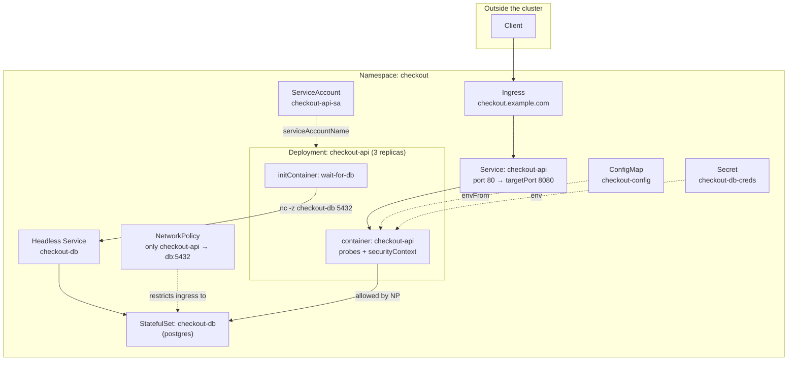

# Chapter 7 — End-to-End Worked Example

Every chapter so far taught one concept at a time. Real tasks — and the exam itself — combine several concepts into one small application. This chapter builds **one app, `checkout-api`, from nothing to fully deployed**, adding one domain's concerns at each step, so you can see how the pieces actually fit together instead of just referencing them in isolation.

**⏱ Estimated time:** 1–1.5 hours if you type every command and YAML block yourself in a real cluster (recommended) — 20–30 minutes for a read-through only. Typing it yourself is what actually builds the "one Deployment spec accumulating fields" instinct this chapter is teaching.

## Learning Objectives

By the end of this chapter, you should be able to:

- Trace how a single Deployment's Pod spec accumulates fields as new requirements (config, secrets, identity, security, probes) stack on top of each other.
- Explain why the init container deliberately fails at first (`Init:0/1`), and read that as confirmation the gate is working, not a bug.
- Predict, at each step, exactly which fields the *next* domain's requirements will add to the spec, before reading ahead.
- Run the full verification pass and interpret each command's output as evidence a specific requirement is actually satisfied.

**The scenario:** `checkout-api` is a small HTTP service. It needs configuration from a ConfigMap, a database password from a Secret, must wait for its database to be reachable before starting, needs to be reachable internally and externally, must be network-restricted to only talk to what it needs, and must roll out with zero downtime.

Namespace `checkout` is used throughout — create it first: `kubectl create namespace checkout`.

**Where this is headed — the finished system:**



This is the target. Each step below adds one labeled piece of it to the same Deployment spec.

## Step 1 — Application Design and Build: the base Deployment 🟢 NICE TO KNOW

Start with the container spec and an init container that waits for the database.

```yaml
apiVersion: apps/v1
kind: Deployment
metadata:
  name: checkout-api
  namespace: checkout
spec:
  replicas: 3
  selector:
    matchLabels:
      app: checkout-api
  template:
    metadata:
      labels:
        app: checkout-api
    spec:
      initContainers:
      - name: wait-for-db
        image: busybox:1.36
        command: ["sh", "-c", "until nc -z checkout-db 5432; do echo waiting; sleep 2; done"]
      containers:
      - name: checkout-api
        image: myorg/checkout-api:1.0
        ports:
        - containerPort: 8080
```

```bash
kubectl apply -f deployment.yaml
kubectl get pods -n checkout -w
```

At this point the Pods will sit at `Init:0/1` forever — there's no `checkout-db` yet, which is expected; it proves the init container is correctly gating startup. Move on.

---

## 🧪 Practice — Configuration Change

### Task

The completed `checkout-api` application already uses `checkout-config`.

Add the configuration value `FEATURE_MODE=checkout-v2`, expose it to the `checkout-api` container using the same configuration mechanism demonstrated in this chapter, and verify that a running container receives it.

### Requirements

- Work in namespace `checkout`.
- Modify the existing configuration.
- Expose the new value to the application.
- Verify from a running Pod.

### Success Criteria

The ConfigMap contains `FEATURE_MODE=checkout-v2` and the running application container shows the same value.

### Suggested Time

**8 minutes**

<details>
<summary>💡 Hint</summary>

Follow the existing ConfigMap-to-container pattern. Environment variables from a ConfigMap require the Pod to be recreated/restarted before the running container sees the new value.

</details>

<details>
<summary>✅ Solution</summary>

```bash
kubectl get configmap checkout-config -n checkout -o yaml
kubectl edit configmap checkout-config -n checkout
```

Add:

```yaml
data:
  FEATURE_MODE: "checkout-v2"
```

Ensure the Deployment consumes the key, then recreate its Pods:

```bash
kubectl rollout restart deployment/checkout-api -n checkout
kubectl rollout status deployment/checkout-api -n checkout
kubectl exec -n checkout deploy/checkout-api -- env | grep FEATURE_MODE
```

</details>

## Step 2 — Environment, Configuration and Security: wire in config, secrets, resources, identity 🟢 NICE TO KNOW

```yaml
apiVersion: v1
kind: ConfigMap
metadata:
  name: checkout-config
  namespace: checkout
data:
  LOG_LEVEL: "info"
  DB_HOST: "checkout-db"
  DB_PORT: "5432"
---
apiVersion: v1
kind: Secret
metadata:
  name: checkout-db-creds
  namespace: checkout
stringData:
  DB_PASSWORD: "s3cret-pw"
---
apiVersion: v1
kind: ServiceAccount
metadata:
  name: checkout-api-sa
  namespace: checkout
```

Now update the Deployment's Pod template to consume all three, add resource limits, and harden the security posture:

```yaml
    spec:
      serviceAccountName: checkout-api-sa
      automountServiceAccountToken: false
      initContainers:
      - name: wait-for-db
        image: busybox:1.36
        command: ["sh", "-c", "until nc -z checkout-db 5432; do echo waiting; sleep 2; done"]
      containers:
      - name: checkout-api
        image: myorg/checkout-api:1.0
        ports:
        - containerPort: 8080
        envFrom:
        - configMapRef:
            name: checkout-config
        env:
        - name: DB_PASSWORD
          valueFrom:
            secretKeyRef:
              name: checkout-db-creds
              key: DB_PASSWORD
        - name: POD_NAME
          valueFrom:
            fieldRef:
              fieldPath: metadata.name
        resources:
          requests: {cpu: "100m", memory: "128Mi"}
          limits: {cpu: "300m", memory: "256Mi"}
        securityContext:
          runAsNonRoot: true
          allowPrivilegeEscalation: false
          readOnlyRootFilesystem: true
          capabilities: {drop: ["ALL"]}
        volumeMounts:
        - name: tmp
          mountPath: /tmp
      volumes:
      - name: tmp
        emptyDir: {}
```

```bash
kubectl apply -f configmap.yaml -f secret.yaml -f serviceaccount.yaml -f deployment.yaml
kubectl exec -n checkout deploy/checkout-api -- env | grep -E 'LOG_LEVEL|DB_HOST|POD_NAME'
```

(Pods still won't be `Running` yet — `checkout-db` doesn't exist. That's Step 3's problem to solve, deliberately.)

🟡 **Note the pattern:** `readOnlyRootFilesystem: true` is why the `tmp` `emptyDir` volume exists — a hardened container often needs at least one writable scratch mount even when the rest of the filesystem is locked down. This pairing (read-only root + a narrow writable `emptyDir`) is a common CKAD security task in its own right.

## Step 3 — Application Deployment: the database it depends on, and a rollout-safe strategy 🟢 NICE TO KNOW

`checkout-db` is a StatefulSet so it gets a stable name the init container's `nc -z checkout-db 5432` can resolve:

```yaml
apiVersion: v1
kind: Service
metadata:
  name: checkout-db
  namespace: checkout
spec:
  clusterIP: None
  selector:
    app: checkout-db
  ports:
  - port: 5432
---
apiVersion: apps/v1
kind: StatefulSet
metadata:
  name: checkout-db
  namespace: checkout
spec:
  serviceName: checkout-db
  replicas: 1
  selector:
    matchLabels: {app: checkout-db}
  template:
    metadata: {labels: {app: checkout-db}}
    spec:
      containers:
      - name: postgres
        image: postgres:16
        env:
        - name: POSTGRES_PASSWORD
          valueFrom:
            secretKeyRef: {name: checkout-db-creds, key: DB_PASSWORD}
        ports: [{containerPort: 5432}]
```

Now that `checkout-db` exists, add a rollout strategy to the `checkout-api` Deployment so future updates never drop capacity:

```yaml
  strategy:
    type: RollingUpdate
    rollingUpdate:
      maxSurge: 1
      maxUnavailable: 0
```

```bash
kubectl apply -f db-service.yaml -f db-statefulset.yaml
kubectl apply -f deployment.yaml
kubectl wait --for=condition=Ready pod/checkout-db-0 -n checkout --timeout=60s
kubectl rollout status deployment/checkout-api -n checkout
```

Pods should now reach `Running`, `1/1 Ready` — the init container's wait condition is finally satisfied.

---

## 🧪 Practice — Add Health Checks

### Task

The completed `checkout-api` Deployment needs health checks.

Add both a readiness probe and a liveness probe to the application container using the `/healthz` endpoint on port `8080` shown in the worked example. Apply the change and verify the Pods become Ready.

### Requirements

- Modify the existing Deployment.
- Add readiness and liveness probes to the `checkout-api` container.
- Use `/healthz` and port `8080`.
- Verify the rollout and Pod conditions.

### Success Criteria

The Deployment contains both probes and the resulting Pods report Ready.

### Suggested Time

**8–10 minutes**

<details>
<summary>💡 Hint</summary>

Use the exact probe configuration already demonstrated in Step 4 rather than inventing a different endpoint.

</details>

<details>
<summary>✅ Solution</summary>

Add:

```yaml
readinessProbe:
  httpGet:
    path: /healthz
    port: 8080
  periodSeconds: 5

livenessProbe:
  httpGet:
    path: /healthz
    port: 8080
  initialDelaySeconds: 15
  periodSeconds: 10
```

Then:

```bash
kubectl apply -f deployment.yaml
kubectl rollout status deployment/checkout-api -n checkout
kubectl describe pod -n checkout -l app=checkout-api
```

</details>

## Step 4 — Application Observability and Maintenance: probes 🟢 NICE TO KNOW

The API isn't actually being health-checked yet. Add probes to the same container block from Step 2:

```yaml
        readinessProbe:
          httpGet: {path: /healthz, port: 8080}
          periodSeconds: 5
        livenessProbe:
          httpGet: {path: /healthz, port: 8080}
          initialDelaySeconds: 15
          periodSeconds: 10
```

```bash
kubectl apply -f deployment.yaml
kubectl rollout status deployment/checkout-api -n checkout
kubectl describe pod -n checkout -l app=checkout-api | grep -A8 Conditions
```

If `Ready` shows `False`, this is exactly the Chapter 5 debugging workflow: `describe` → Events/Conditions → `logs` → fix. In this worked example it should go straight to `Ready: True` since the app was assumed healthy on `/healthz`.

---

## 🧪 Practice — Service Modification and Internal Verification

### Task

Change the `checkout-api` Service so clients connect on Service port `8088` while the application container continues listening on its existing target port `8080`.

Verify the Service from another Pod in the `checkout` namespace.

### Requirements

- Modify only the Service port mapping.
- Keep `targetPort: 8080`.
- Verify the Service object.
- Test connectivity from a temporary Pod.

### Success Criteria

The Service exposes port `8088`, forwards to target port `8080`, and an in-cluster request reaches the application.

### Suggested Time

**8–10 minutes**

<details>
<summary>💡 Hint</summary>

Remember: `port` is the Service port; `targetPort` is the application port.

</details>

<details>
<summary>✅ Solution</summary>

```yaml
ports:
- port: 8088
  targetPort: 8080
```

Apply and verify:

```bash
kubectl apply -f service.yaml
kubectl get service checkout-api -n checkout
kubectl run test-client -n checkout --image=busybox:1.36 --rm -it --restart=Never -- wget -qO- checkout-api:8088
```

</details>

## Step 5 — Services and Networking: exposing and restricting traffic 🟢 NICE TO KNOW

```yaml
apiVersion: v1
kind: Service
metadata:
  name: checkout-api
  namespace: checkout
spec:
  selector:
    app: checkout-api
  ports:
  - port: 80
    targetPort: 8080
---
apiVersion: networking.k8s.io/v1
kind: Ingress
metadata:
  name: checkout-api
  namespace: checkout
spec:
  ingressClassName: nginx
  rules:
  - host: checkout.example.com
    http:
      paths:
      - path: /
        pathType: Prefix
        backend:
          service:
            name: checkout-api
            port:
              number: 80
---
apiVersion: networking.k8s.io/v1
kind: NetworkPolicy
metadata:
  name: checkout-db-restrict
  namespace: checkout
spec:
  podSelector:
    matchLabels: {app: checkout-db}
  policyTypes: [Ingress]
  ingress:
  - from:
    - podSelector: {matchLabels: {app: checkout-api}}
    ports:
    - {protocol: TCP, port: 5432}
```

```bash
kubectl apply -f service.yaml -f ingress.yaml -f networkpolicy.yaml
kubectl get endpointslice -l kubernetes.io/service-name=checkout-api -n checkout
kubectl get ingress checkout-api -n checkout
```

---

## 🧪 Practice — Deliberate Failure — Diagnose and Fix

### Task

The completed `checkout-api` application has been deliberately broken, but you are not told how.

Diagnose the failure and restore the application. The possible failure categories are wrong Service selector, wrong `targetPort`, missing ConfigMap key, bad image, or failing probe.

Do not assume the category. Use Kubernetes evidence first.

### Requirements

- Work only in namespace `checkout`.
- Inspect Pods, Service/endpoints, Events, and relevant configuration.
- Identify the actual failure before changing anything.
- Make the smallest correction.
- Verify the application end-to-end.

### Success Criteria

You identify the actual failure from evidence, make the smallest correction, and demonstrate that the application is healthy and reachable.

### Suggested Time

**10–15 minutes**

<details>
<summary>💡 Hint</summary>

Start with `get` for Pods, Service, and endpoints. Then use `describe` and Events to narrow the problem.

</details>

<details>
<summary>✅ Solution</summary>

```bash
kubectl get pods -n checkout
kubectl get svc -n checkout
kubectl get endpointslice -l kubernetes.io/service-name=checkout-api -n checkout
kubectl get events -n checkout --sort-by=.lastTimestamp
kubectl describe pod -n checkout -l app=checkout-api
kubectl describe service checkout-api -n checkout
```

Inspect the implicated object:

```bash
kubectl get deployment checkout-api -n checkout -o yaml
kubectl get configmap checkout-config -n checkout -o yaml
kubectl get service checkout-api -n checkout -o yaml
```

Fix only the field supported by the evidence, then verify:

```bash
kubectl rollout status deployment/checkout-api -n checkout
kubectl get endpointslice -l kubernetes.io/service-name=checkout-api -n checkout
kubectl run test-client -n checkout --image=busybox:1.36 --rm -it --restart=Never -- wget -qO- checkout-api:80
```

Use the final Service port if it differs from `80`.

</details>

## Full Verification Pass 🔴 MUST KNOW

```bash
kubectl get deploy,sts,pods,svc -n checkout
kubectl get pods -n checkout -o wide
kubectl get endpointslice -l kubernetes.io/service-name=checkout-api -n checkout
kubectl get endpointslice -l kubernetes.io/service-name=checkout-db -n checkout
kubectl describe pod -n checkout -l app=checkout-api | grep -A6 Conditions
kubectl exec -n checkout deploy/checkout-api -- env | grep DB_HOST
kubectl get pod -n checkout -l app=checkout-api -o jsonpath='{.items[0].status.qosClass}'
kubectl run tmp -n checkout --image=busybox --rm -it -- wget -qO- checkout-api.checkout
```

🔴 **CKAD habit this trains:** never consider a task "done" after `kubectl apply` alone. Every one of the commands above is checking a *different* claim (Pods ready, EndpointSlices populated, env vars actually injected, QoS class, and finally an end-to-end request) — a real exam task is only fully correct when the outcome it describes is independently verifiable, not just when `apply` returns without an error.

---

## 🧪 Practice — Controlled Deployment Change

### Task

Perform a controlled image update of `checkout-api` to the next image version specified by your exercise environment.

Watch the rollout, inspect ReplicaSets, verify readiness, and roll back if the new revision is unhealthy.

### Requirements

- Change only the application image.
- Watch rollout progress.
- Inspect ReplicaSets before and after.
- Verify readiness.
- If unhealthy, use rollout history and undo.

### Success Criteria

You can complete a controlled rollout and recover from an unhealthy revision without deleting the Deployment.

### Suggested Time

**8–10 minutes**

<details>
<summary>💡 Hint</summary>

Use `set image` → `rollout status` → `get rs` → `rollout history`; use `rollout undo` only if the new revision is unhealthy.

</details>

<details>
<summary>✅ Solution</summary>

```bash
kubectl get rs -n checkout
kubectl set image deployment/checkout-api <container-name>=<required-image> -n checkout
kubectl rollout status deployment/checkout-api -n checkout
kubectl get rs -n checkout
kubectl get pods -n checkout
kubectl rollout history deployment/checkout-api -n checkout
```

If the new revision is unhealthy:

```bash
kubectl rollout undo deployment/checkout-api -n checkout
kubectl rollout status deployment/checkout-api -n checkout
```

</details>

## What This Example Ties Together

| Domain | What appeared in this example |
|---|---|
| Application Design and Build | Init container gating startup, StatefulSet + headless Service for the database |
| Application Environment, Configuration and Security | ConfigMap, Secret, Downward API env var, resource requests/limits, ServiceAccount with disabled token automount, full SecurityContext hardening |
| Application Deployment | `RollingUpdate` strategy with `maxUnavailable: 0` |
| Application Observability and Maintenance | Readiness/liveness probes, Conditions-based verification |
| Services and Networking | ClusterIP Service, Ingress, NetworkPolicy restricting DB access to only the API |

Every piece here was covered in isolation in Chapters 1–5 — the only thing new in this chapter is the order of operations and how one Deployment's spec accumulates fields as requirements stack up. That accumulation, done live, under time pressure, reading a task description instead of this book, is what the exam actually measures.

**Next:** Chapter 8 — CKAD Reference & Cheat Sheets condenses everything from Chapters 0–7 into a compact revision format for the final study phase.
\newpage
