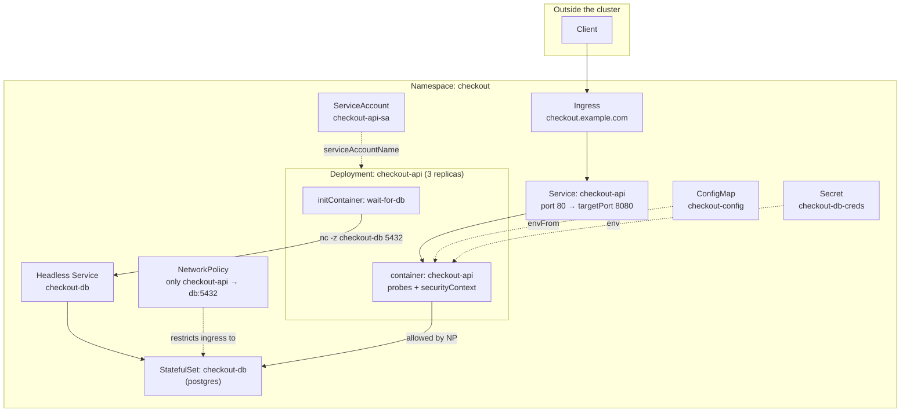

# Chapter 7 — End-to-End Worked Example

Every chapter so far taught one concept at a time. Real tasks — and the exam itself — combine several concepts into one small application. This chapter builds **one app, `checkout-api`, from nothing to fully deployed**, adding one domain's concerns at each step, so you can see how the pieces actually fit together instead of just referencing them in isolation.

**How the chapter is organized.** Each step follows the same rhythm: *explanation → build → verify → predict the next step*. Hands-on labs (🧪) only appear **after** the step that teaches the concept they test — and after the cluster is in a state where the lab can actually run.

**⏱ Estimated time:** 1.5–2 hours if you type every command and YAML block yourself in a real cluster (recommended) — about 30 minutes for a read-through only. Typing it yourself is what actually builds the "one Deployment spec accumulating fields" instinct this chapter is teaching.

## Learning Objectives

By the end of this chapter, you should be able to:

- Trace how a single Deployment's Pod spec accumulates fields as new requirements (config, secrets, identity, security, probes) stack on top of each other, and say which of those edits created a new rollout revision. *(Steps 1–4, assembled Deployment, revision check)*
- Explain why the init container deliberately **blocks/waits** at first (`Init:0/1`), and read that as confirmation the gate is working, not a bug. *(Step 1)*
- Predict, at each step, exactly which fields the *next* domain's requirements will add to the spec, before reading ahead. *(🔮 Predict checkpoints)*
- Change a ConfigMap value and explain why environment variables need a Pod restart to pick it up. *(Lab A)*
- Add a probe to a dependency and explain how readiness gates Service traffic and affects Pod availability during a Deployment rollout. *(Step 4, Lab B)*
- Change a Service port and trace the change through every object that refers to it. *(Lab C)*
- Run the full verification pass and interpret each command's output as evidence a specific requirement is actually satisfied. *(Full Verification Pass)*
- Perform a controlled image update, watch a bad revision stall safely, and roll back. *(Lab D)*
- Diagnose an unknown failure from Kubernetes evidence before changing anything. *(Lab E)*

**The scenario:** `checkout-api` is a small HTTP service. It needs configuration from a ConfigMap, a database password from a Secret, must wait for its database to be reachable before starting, must be reachable internally and externally, must run with a hardened security posture, and must roll out while maintaining the desired number of available replicas. Its database must accept connections **only** from `checkout-api`.

Namespace `checkout` is used throughout — create it first: `kubectl create namespace checkout`.

> **🛠 Practising without a real `myorg/checkout-api` image?** The image name in this chapter is a placeholder. Any container that answers HTTP 200 on `/healthz` at port `8080` works. A dependency-free stand-in built from `busybox` — replace the `image:` line of the `checkout-api` container with the two lines below:
>
> ```yaml
>         image: busybox:1.36
>         command: ["sh", "-c", "mkdir -p /tmp/www && echo ok > /tmp/www/healthz && exec httpd -f -p 8080 -h /tmp/www"]
> ```
>
> It serves `ok` on `/healthz`, has a shell (so the `kubectl exec ...` checks in this chapter work), and writes only to `/tmp` — which is exactly why the hardened version in Step 2 needs its `emptyDir`. The verification commands below assume this stand-in; if you use your own image, it must expose `/healthz` on port `8080` and support the shell/file operations used by the checks.

**Where this is headed — the finished system:**



This is the target. Each step below adds one labeled piece of it to the same Deployment spec.

---

## Step 1 — Application Design and Build: the base Deployment 🟢 NICE TO KNOW

Start with the container spec and an init container that waits for the database. This step uses Chapter 2's init-container pattern.

> **⚡ Exam speed.** Generate the skeleton instead of typing it (Chapter 6.3), then hand-add only the part with no flag — the init container:
>
> ```bash
> kubectl create deployment checkout-api -n checkout --image=myorg/checkout-api:1.0 --replicas=3 --port=8080 --dry-run=client -o yaml > deployment.yaml
> ```

```yaml
apiVersion: apps/v1
kind: Deployment
metadata:
  name: checkout-api
  namespace: checkout
spec:
  replicas: 3
  selector:
    matchLabels:
      app: checkout-api
  template:
    metadata:
      labels:
        app: checkout-api
    spec:
      initContainers:
      - name: wait-for-db
        image: busybox:1.36
        command: ["sh", "-c", "until nc -z checkout-db 5432; do echo waiting; sleep 2; done"]
      containers:
      - name: checkout-api
        image: myorg/checkout-api:1.0
        ports:
        - containerPort: 8080
```

```bash
kubectl apply -f deployment.yaml
kubectl get pods -n checkout -w                       # Ctrl-C to stop watching
kubectl logs -n checkout deploy/checkout-api -c wait-for-db --tail=3
kubectl describe pod -n checkout -l app=checkout-api | grep -A6 -E 'Init Containers|Conditions'
```

At this point the Pods remain at `Init:0/1` until `checkout-db` exists and becomes reachable — there's no `checkout-db` yet, which is expected. Read the evidence rather than assuming: the log shows `waiting` lines (possibly preceded by an `nc: bad address` message — that is DNS failing to resolve a Service that doesn't exist yet), `describe` shows the init container `Running`, and the `Initialized` condition is `False`. `Init:0/1` means *zero of one* init containers have completed. The main container has not even been created. That is the gate working as designed: the init container remains running until its dependency becomes reachable.

> **🌍 Real-world example.** After a maintenance window or a cluster-wide restart, applications and databases come back at the same time, in no particular order. An app with no gate starts first, fails to connect, and enters `CrashLoopBackOff` — and Kubernetes backs off restarts exponentially, up to five minutes between attempts. The database can be healthy for minutes while the app is still sitting out its back-off. An init container that polls the dependency turns that into a clean wait: the app container starts within seconds of the database becoming reachable, with no crash history and no noisy alerts.

> **📚 Theory.** Init containers run to completion, one at a time and in order, *before* any app container starts. While an init container is still running, a normal Deployment Pod remains in the `Pending` phase with an `Initialized` condition of `False`; if the Pod uses `restartPolicy: Never` and an init container fails, the Pod can instead enter `Failed`. This makes init containers a **hard dependency gate**. A readiness probe (Step 4) is a different tool: it lets the app start, then controls whether it receives traffic. Choose the init container when "the app must not even start without X"; choose readiness when "the app can start but might not be able to serve yet."

<details>
<summary>🔮 Predict before Step 2</summary>

The requirements are now: configuration values, a database password, a dedicated identity, resource limits, and a hardened security posture. Before scrolling, write down which **Pod-spec fields** each one adds and which of them need a **new object** first.

**Answer:** ConfigMap → `envFrom.configMapRef` (new ConfigMap); Secret → `env[].valueFrom.secretKeyRef` (new Secret); identity → `serviceAccountName` (new ServiceAccount); limits → `resources`; hardening → `securityContext` (plus a writable `emptyDir` volume if the root filesystem becomes read-only). Three new objects, plus several field additions grouped into five requirement areas on one Pod template.

</details>

---

## Step 2 — Environment, Configuration and Security: wire in config, secrets, resources, identity 🟢 NICE TO KNOW

First create the three objects the Pod template will refer to. They are independent API objects — the Deployment only references them by name.

```yaml
apiVersion: v1
kind: ConfigMap
metadata:
  name: checkout-config
  namespace: checkout
data:
  LOG_LEVEL: "info"
  DB_HOST: "checkout-db"
  DB_PORT: "5432"
---
apiVersion: v1
kind: Secret
metadata:
  name: checkout-db-creds
  namespace: checkout
stringData:
  DB_PASSWORD: "s3cret-pw"      # fine for practice — never commit a real Secret manifest to git
---
apiVersion: v1
kind: ServiceAccount
metadata:
  name: checkout-api-sa
  namespace: checkout
```

> **⚡ Exam speed.** The same three objects, imperatively:
>
> ```bash
> kubectl create configmap checkout-config -n checkout --from-literal=LOG_LEVEL=info --from-literal=DB_HOST=checkout-db --from-literal=DB_PORT=5432
> kubectl create secret generic checkout-db-creds -n checkout --from-literal=DB_PASSWORD='s3cret-pw'
> kubectl create serviceaccount checkout-api-sa -n checkout
> ```

Now edit the Deployment's Pod template. Only the **new** fields are shown, marked `# +`; everything else stays as in Step 1 (the fully assembled file appears at the end of Step 4):

```yaml
    spec:
      serviceAccountName: checkout-api-sa            # + identity
      automountServiceAccountToken: false            # + this app never calls the API server
      # initContainers: ... unchanged
      containers:
      - name: checkout-api
        # image, ports: ... unchanged
        envFrom:                                     # + every ConfigMap key becomes an env var
        - configMapRef:
            name: checkout-config
        env:
        - name: DB_PASSWORD                          # + one Secret key as one env var
          valueFrom:
            secretKeyRef:
              name: checkout-db-creds
              key: DB_PASSWORD
        - name: POD_NAME                             # + Downward API: the Pod's own name
          valueFrom:
            fieldRef:
              fieldPath: metadata.name
        resources:                                   # + requests = scheduling; limits = ceiling
          requests: {cpu: "100m", memory: "128Mi"}
          limits: {cpu: "300m", memory: "256Mi"}
        securityContext:                             # + hardening
          runAsNonRoot: true
          runAsUser: 10001
          allowPrivilegeEscalation: false
          readOnlyRootFilesystem: true
          capabilities: {drop: ["ALL"]}
        volumeMounts:                                # + writable scratch space
        - name: tmp
          mountPath: /tmp
      volumes:                                       # + (sibling of containers)
      - name: tmp
        emptyDir: {}
```

```bash
kubectl apply -f configmap.yaml -f secret.yaml -f serviceaccount.yaml -f deployment.yaml
kubectl describe pod -n checkout -l app=checkout-api | grep -A8 'Environment'
```

The Pods are still stuck in `Init:0/1` (`checkout-db` doesn't exist — that is Step 3's problem, deliberately), so you can't `exec` into them yet. `describe` still shows the wiring: `Environment Variables from: checkout-config`, and `DB_PASSWORD` displayed as `<set to the key 'DB_PASSWORD' in secret 'checkout-db-creds'>` — note that the value itself is never printed.

🟡 **Note the pattern:** `readOnlyRootFilesystem: true` is why the `tmp` `emptyDir` volume exists — a hardened container often needs at least one writable scratch mount even when the rest of the filesystem is locked down. This pairing (read-only root + a narrow writable `emptyDir`) is a common CKAD security task in its own right.

🟡 **Note the second pattern:** `runAsNonRoot: true` is a *check*, not a switch — it doesn't change who the container runs as, it makes the kubelet refuse to start a container that would run as root. If the image's user is root or non-numeric you get `CreateContainerConfigError`. Setting a numeric `runAsUser` satisfies the check explicitly. (The database container is deliberately *not* hardened this way in Step 3: the official Postgres image starts as root and drops privileges itself.)

> **🌍 Real-world example.** By default, a Pod using a ServiceAccount can receive a token that authenticates to the API server. If an attacker gets remote code execution in a web service, that token becomes an additional credential to abuse. A checkout API never calls the Kubernetes API, so `automountServiceAccountToken: false` removes that automatically mounted credential. Combined with a read-only root filesystem and dropped capabilities, this reduces the credential and filesystem write surface; the application still has access to the configuration and credentials it legitimately consumes, and `/tmp` remains writable.

> **📚 Theory.** ConfigMap, Secret, and ServiceAccount are separate objects; the Pod template holds only *references* by name. That separation is what lets one image run unchanged in every environment (Chapter 1). One mechanism matters for the next lab: **environment variables are resolved once, when the container is created.** Editing the ConfigMap afterwards updates the stored object but not the environment of already-running containers — only a new container (a Pod restart or rollout) sees the change. ConfigMaps mounted as *volumes* behave differently: the kubelet refreshes the mounted files eventually (though not for `subPath` mounts), but the application must re-read them.

<details>
<summary>🔮 Predict before Step 3</summary>

The `wait-for-db` init container is polling `checkout-db:5432`. What object must exist for that name to resolve? Should it be a Deployment or something else, and how will you make future updates to `checkout-api` safe?

**Answer:** A Service named `checkout-db` (headless, so DNS resolves straight to the Pod) backed by a StatefulSet for stable identity. For safe updates: a `strategy` block on the `checkout-api` Deployment — which sits under `spec`, *outside* the Pod template.

</details>

---

## Step 3 — Application Deployment: the database it depends on, and a rollout-safe strategy 🟢 NICE TO KNOW

This step does two jobs from two domains: the database is Chapter 2 material (StatefulSet + headless Service), the `strategy` is Chapter 3 material (Deployment updates).

The `checkout-db` Service provides the DNS name that the init container can resolve, while the StatefulSet gives its database Pod a stable ordinal identity. The Service name and the Pod's ordinal name are related but are not the same thing:

```yaml
apiVersion: v1
kind: Service
metadata:
  name: checkout-db
  namespace: checkout
spec:
  clusterIP: None
  selector:
    app: checkout-db
  ports:
  - port: 5432
---
apiVersion: apps/v1
kind: StatefulSet
metadata:
  name: checkout-db
  namespace: checkout
spec:
  serviceName: checkout-db
  replicas: 1
  selector:
    matchLabels: {app: checkout-db}
  template:
    metadata: {labels: {app: checkout-db}}
    spec:
      containers:
      - name: postgres
        image: postgres:16
        env:
        - name: POSTGRES_PASSWORD
          valueFrom:
            secretKeyRef: {name: checkout-db-creds, key: DB_PASSWORD}
        ports: [{containerPort: 5432}]
```

> This StatefulSet has no `volumeClaimTemplates`, so the database's data disappears if its Pod is recreated. That keeps the example small; a real database would add a `volumeClaimTemplates` block like the one in Chapter 2.

Now add a rollout strategy to the `checkout-api` Deployment, directly under `spec` (a sibling of `replicas`, *not* inside `template`) so normal rollouts do not intentionally reduce available capacity below the configured `maxUnavailable` bound:

```yaml
spec:
  replicas: 3
  strategy:
    type: RollingUpdate
    rollingUpdate:
      maxSurge: 1
      maxUnavailable: 0
```

```bash
kubectl apply -f db-service.yaml -f db-statefulset.yaml
kubectl rollout status statefulset/checkout-db -n checkout
kubectl apply -f deployment.yaml
kubectl rollout status deployment/checkout-api -n checkout
kubectl exec -n checkout deploy/checkout-api -- env | grep -E 'LOG_LEVEL|DB_HOST|DB_PORT|POD_NAME'
```

Pods should now reach `Running`, `1/1 Ready` — the init container's wait condition is finally satisfied. And because a container is now running, the `exec` finally works: you should see the ConfigMap values and the Pod's own name injected.

> **🌍 Real-world example.** The app finds its database through `DB_HOST=checkout-db` — a name from a ConfigMap that resolves through a Service. That indirection pays off across environments: in dev the name points at the in-cluster Postgres built here; in production many teams keep the database outside the cluster (a managed cloud database) and make `checkout-db` an `ExternalName` Service pointing at it. The application image, the Deployment, and the ConfigMap key are identical in both places — only the object behind the Service name changes. An `ExternalName` Service is a DNS CNAME-style abstraction for an external hostname; it is not a normal virtual-IP Service and does not create EndpointSlices for Pods.

> **📚 Theory.** With `maxSurge: 1, maxUnavailable: 0` and 3 replicas, a rollout may run **up to 4** Pods, and the Deployment controller will not intentionally reduce the number of available replicas below 3 as part of the rollout. In the normal case, it starts one new Pod, waits for it to become *Ready* and available, then removes one old Pod and repeats. "Ready" is doing all the work in that sentence — the strategy is only as safe as the Pod's definition of ready, which is why Step 4 matters. Also note what this step did *not* do to the revision history: `strategy` lives outside `.spec.template`, and only template changes create a new ReplicaSet, so applying it triggered no rollout.

---

## 🧪 Practice A — Configuration Change

**Concepts tested:** ConfigMap consumption via `envFrom` and the "env vars are fixed at container creation" rule (Step 2). This lab needs *running* Pods, which is why it comes after Step 3.

### Task

The completed `checkout-api` application already uses `checkout-config`.

Add the configuration value `FEATURE_MODE=checkout-v2`, expose it to the `checkout-api` container using the same configuration mechanism demonstrated in this chapter, and verify that a running container receives it.

### Requirements

- Work in namespace `checkout`.
- Modify the existing ConfigMap; do not create a new one.
- Confirm whether the Deployment needs any change before you touch it.
- Verify from a running Pod.

### Success Criteria

The ConfigMap contains `FEATURE_MODE=checkout-v2` and the running application container shows the same value.

### Suggested Time

**8 minutes**

<details>
<summary>💡 Hint</summary>

Look at how the Deployment consumes the ConfigMap: `envFrom` pulls in **every** key. Then ask yourself when an environment variable's value is decided.

</details>

<details>
<summary>✅ Solution</summary>

```bash
kubectl get configmap checkout-config -n checkout -o yaml
kubectl patch configmap checkout-config -n checkout --type merge -p '{"data":{"FEATURE_MODE":"checkout-v2"}}'
```

(`kubectl edit configmap checkout-config -n checkout` and adding `FEATURE_MODE: "checkout-v2"` under `data:` works equally well.)

Because the Deployment uses `envFrom.configMapRef`, the new key is picked up automatically — **no Deployment edit is needed**. But the running containers were created before the change, so prove that first:

```bash
kubectl exec -n checkout deploy/checkout-api -- env | grep FEATURE_MODE     # prints nothing yet
```

Recreate the Pods, then verify:

```bash
kubectl rollout restart deployment/checkout-api -n checkout
kubectl rollout status deployment/checkout-api -n checkout
kubectl exec -n checkout deploy/checkout-api -- env | grep FEATURE_MODE     # FEATURE_MODE=checkout-v2
```

</details>

> **🌍 Real-world example (why this matters after the lab).** Teams regularly "update the ConfigMap" during an incident and then wonder why nothing changed. Helm charts commonly solve it by putting a checksum of the ConfigMap into a Pod-template annotation, so any config change alters the template and triggers a rollout automatically. `kubectl rollout restart` is the manual version of the same idea.

<details>
<summary>🔮 Predict before Step 4</summary>

The Pods are `Running`, but is anything actually checking that the *application* is healthy — or that it is safe to send it traffic? What two behaviors do you want, and what will each one do when the check fails?

**Answer:** Two probes on the container: **readiness** (failure ⇒ the Pod is removed from Service endpoints, no restart) and **liveness** (failure ⇒ the kubelet restarts the container).

</details>

---

## Step 4 — Application Observability and Maintenance: probes 🟢 NICE TO KNOW

The API isn't actually being health-checked yet. Add probes to the same container block from Step 2:

```yaml
        readinessProbe:
          httpGet: {path: /healthz, port: 8080}
          periodSeconds: 5
        livenessProbe:
          httpGet: {path: /healthz, port: 8080}
          initialDelaySeconds: 15
          periodSeconds: 10
```

```bash
kubectl apply -f deployment.yaml
kubectl rollout status deployment/checkout-api -n checkout
kubectl describe pod -n checkout -l app=checkout-api | grep -A8 Conditions
kubectl rollout history deployment/checkout-api -n checkout
```

If `Ready` shows `False`, this is exactly the Chapter 5 debugging workflow: `describe` → Events/Conditions → `logs` → fix. In this worked example it should go straight to `Ready: True` since the app was assumed healthy on `/healthz`.

Now look at the revision history and try to account for every line. You should see one revision per **Pod-template** change: the initial Step 1 deployment, the Step 2 wiring, the `rollout restart` from Lab A (it stamps a `restartedAt` annotation into the template), and this probe change. The Step 3 `strategy` edit is *not* in the list. That is the accumulation idea made visible: every new requirement so far was another edit to one Pod template, and every such edit was a rolling replacement.

> **🌍 Real-world example.** A checkout service pointed its **liveness** probe at an endpoint that also checked database connectivity. During a 30-second database failover, every replica's liveness probe failed at once, the kubelet restarted all of them together, and a brief database blip became a multi-minute full outage while the Pods came back up and re-warmed. The lesson most teams learn the hard way: **readiness may reflect dependencies** (stop sending traffic while the dependency is down), but **liveness should reflect only "this process is wedged and a restart would help."** This chapter uses the same `/healthz` path for both to keep the example small; in production they are often different endpoints.

> **📚 Theory.** Probes are executed by the **kubelet on the node**, not by the API server or the Service. The two outcomes are wired to different consumers: a failing readiness probe flips the Pod's `Ready` condition to `False`, and the EndpointSlice controller responds by removing that Pod from Service endpoints — the container keeps running. A failing liveness probe makes the kubelet kill and restart the container. Readiness is also what a Deployment rollout waits on: with `maxUnavailable: 0` from Step 3, a new Pod that never becomes Ready stalls the rollout while the old Pods keep serving. **Without a readiness probe or readiness gates, Kubernetes can consider a Pod ready once its containers are running, so the rollout strategy alone does not prove that the application can serve traffic correctly.**

### The Deployment, fully assembled

Steps 1–4 each touched the same file. This is what `deployment.yaml` should contain now, with the step that introduced each field:

```yaml
apiVersion: apps/v1
kind: Deployment
metadata:
  name: checkout-api
  namespace: checkout
spec:
  replicas: 3
  strategy:                                    # Step 3
    type: RollingUpdate
    rollingUpdate:
      maxSurge: 1
      maxUnavailable: 0
  selector:
    matchLabels:
      app: checkout-api
  template:
    metadata:
      labels:
        app: checkout-api
    spec:
      serviceAccountName: checkout-api-sa      # Step 2
      automountServiceAccountToken: false      # Step 2
      initContainers:                          # Step 1
      - name: wait-for-db
        image: busybox:1.36
        command: ["sh", "-c", "until nc -z checkout-db 5432; do echo waiting; sleep 2; done"]
      containers:
      - name: checkout-api                     # Step 1
        image: myorg/checkout-api:1.0
        ports:
        - containerPort: 8080
        envFrom:                               # Step 2
        - configMapRef:
            name: checkout-config
        env:                                   # Step 2
        - name: DB_PASSWORD
          valueFrom:
            secretKeyRef:
              name: checkout-db-creds
              key: DB_PASSWORD
        - name: POD_NAME
          valueFrom:
            fieldRef:
              fieldPath: metadata.name
        resources:                             # Step 2
          requests: {cpu: "100m", memory: "128Mi"}
          limits: {cpu: "300m", memory: "256Mi"}
        securityContext:                       # Step 2
          runAsNonRoot: true
          runAsUser: 10001
          allowPrivilegeEscalation: false
          readOnlyRootFilesystem: true
          capabilities: {drop: ["ALL"]}
        volumeMounts:                          # Step 2
        - name: tmp
          mountPath: /tmp
        readinessProbe:                        # Step 4
          httpGet: {path: /healthz, port: 8080}
          periodSeconds: 5
        livenessProbe:                         # Step 4
          httpGet: {path: /healthz, port: 8080}
          initialDelaySeconds: 15
          periodSeconds: 10
      volumes:                                 # Step 2
      - name: tmp
        emptyDir: {}
```

Compare it with `kubectl get deployment checkout-api -n checkout -o yaml`: the live object is this file plus defaults the API server filled in — and, if you did Lab A, the `restartedAt` annotation.

---

## 🧪 Practice B — Give the Database a Readiness Probe

**Concepts tested:** probe mechanics and the role of readiness (Step 4), applied to a *different* workload with a different probe type. The database currently has no probe, so Kubernetes considers `checkout-db-0` Ready as soon as the Postgres container starts — before it can accept connections.

### Task

Add a readiness probe to the `postgres` container of the `checkout-db` StatefulSet that reports Ready only when Postgres accepts connections.

### Requirements

- Work in namespace `checkout`; modify the existing StatefulSet.
- Use an `exec` probe (the Postgres image ships `pg_isready`).
- Verify the rollout and the Pod's `Ready` condition.

### Success Criteria

`checkout-db-0` reports `1/1 Ready` after the update, its `Ready` condition is `True`, and the StatefulSet template contains the probe.

### Suggested Time

**8–10 minutes**

<details>
<summary>💡 Hint</summary>

An `exec` probe succeeds when the command exits `0`. The command is `pg_isready -U postgres`. Put the probe on the container, alongside `env` and `ports`.

</details>

<details>
<summary>✅ Solution</summary>

Add under the `postgres` container in `db-statefulset.yaml`:

```yaml
        readinessProbe:
          exec:
            command: ["pg_isready", "-U", "postgres"]
          initialDelaySeconds: 5
          periodSeconds: 5
```

Then:

```bash
kubectl apply -f db-statefulset.yaml
kubectl rollout status statefulset/checkout-db -n checkout
kubectl get pod checkout-db-0 -n checkout
kubectl describe pod checkout-db-0 -n checkout | grep -A6 Conditions
```

Changing the template makes the StatefulSet replace `checkout-db-0`. Because this example has no persistent volume, the database's contents are lost with the old Pod — one more reason a real database needs `volumeClaimTemplates`. The payoff of the probe: for this headless Service, the EndpointSlice/DNS path exposes the Pod as a ready backend once the readiness probe succeeds (unless `publishNotReadyAddresses` is enabled). Thus `checkout-db` becomes discoverable as a ready backend only after Postgres is accepting connections, which makes the `wait-for-db` gate more trustworthy.

</details>

---

## Step 5 — Services and Networking: exposing and restricting traffic 🟢 SUPPORTING INTEGRATION

```yaml
apiVersion: v1
kind: Service
metadata:
  name: checkout-api
  namespace: checkout
spec:
  selector:
    app: checkout-api
  ports:
  - port: 80
    targetPort: 8080
---
apiVersion: networking.k8s.io/v1
kind: Ingress
metadata:
  name: checkout-api
  namespace: checkout
spec:
  ingressClassName: nginx
  rules:
  - host: checkout.example.com
    http:
      paths:
      - path: /
        pathType: Prefix
        backend:
          service:
            name: checkout-api
            port:
              number: 80
---
apiVersion: networking.k8s.io/v1
kind: NetworkPolicy
metadata:
  name: checkout-db-restrict
  namespace: checkout
spec:
  podSelector:
    matchLabels: {app: checkout-db}
  policyTypes: [Ingress]
  ingress:
  - from:
    - podSelector: {matchLabels: {app: checkout-api}}
    ports:
    - {protocol: TCP, port: 5432}
```

```bash
kubectl apply -f service.yaml -f ingress.yaml -f networkpolicy.yaml
kubectl get endpointslice -l kubernetes.io/service-name=checkout-api -n checkout
kubectl get ingress checkout-api -n checkout
kubectl run np-test -n checkout --image=busybox:1.36 --rm -it --restart=Never -- sh -c 'nc -z -w 3 checkout-db 5432 && echo reachable || echo blocked'
```

The EndpointSlice should list three ready addresses on port `8080` — one per `checkout-api` Pod. The last command starts an unrelated Pod and tries to reach the database: it should print `blocked`, while the API's own init container reached the same port earlier. Two caveats: the Ingress only routes if an `nginx` Ingress controller is installed (`kubectl get ingressclass`), and a NetworkPolicy is only *enforced* if the cluster's network plugin supports it — the default plugin in some local clusters, such as `kind`, does not, in which case you will see `reachable` and the policy is inert.

> **🌍 Real-world example.** By default every Pod in a cluster can open a connection to every other Pod. That means a compromised, unrelated container — a forgotten debug Pod, a vulnerable third-party tool in the same namespace — can reach the production database and start guessing passwords. The NetworkPolicy shrinks the database's exposure from "anything in the cluster" to "the one client that needs it," so the password becomes a second line of defense rather than the only one.

> **📚 Theory.** Three separate mechanisms are at work, but they key on different information. The Service selector builds the EndpointSlice: a controller continuously watches for Ready Pods labelled `app=checkout-api` and lists their IPs — the Service holds no Pod names at all. The Ingress matches **host/path** and maps the request to a Service; an Ingress controller (nginx here) performs the routing. The NetworkPolicy selects Pods by labels and acts as an **allow-list**: once any policy selects a Pod for `Ingress`, traffic not explicitly allowed by the applicable ingress rules is denied. Note that the init container passes the policy for free — it shares the Pod's network identity and labels. A Ready Pod labelled `app=checkout-api` therefore both receives Service traffic and matches the NetworkPolicy source rule for database access.

<details>
<summary>🔮 Predict before Lab C</summary>

If you change the Service's `port` from `80` to `8088`, which *other* object in this chapter refers to the Service by port number — and what will break if you forget it?

**Answer:** The Ingress backend (`service.port.number: 80`). The Ingress would point at a Service port that no longer exists; the Service itself could still work on its new port, but external requests would fail until the Ingress backend port is updated.

</details>

---

## 🧪 Practice C — Service Modification and Internal Verification

**Concepts tested:** the `port` / `targetPort` distinction and the fact that other objects depend on a Service's port (Step 5).

### Task

Change the `checkout-api` Service so clients connect on Service port `8088` while the application container continues listening on its existing target port `8080`. Keep the Ingress working. Verify from another Pod in the `checkout` namespace, then restore the original configuration.

### Requirements

- Keep `targetPort: 8080` and do not touch the Deployment.
- Update whatever else depends on the old Service port.
- Verify the Service object, the Ingress backend, and connectivity from a temporary Pod.
- When finished, restore port `80` everywhere so the Full Verification Pass below still matches.

### Success Criteria

The Service exposes `8088` and forwards to `8080`, the Ingress backend references `8088`, an in-cluster request to `checkout-api:8088` reaches the application — and after restoring, everything is back on `80`.

### Suggested Time

**8–10 minutes**

<details>
<summary>💡 Hint</summary>

`port` is what clients of the *Service* use; `targetPort` is the application's port. An Ingress backend names a Service **port**, not a targetPort. `kubectl describe ingress` confirms the configured Service backend; use the Service's EndpointSlices to inspect the actual Pod addresses behind it.

</details>

<details>
<summary>✅ Solution</summary>

In `service.yaml`:

```yaml
ports:
- port: 8088
  targetPort: 8080
```

In `ingress.yaml`, change the backend to `port: {number: 8088}`. Apply and verify:

```bash
kubectl apply -f service.yaml -f ingress.yaml
kubectl get service checkout-api -n checkout
kubectl describe ingress checkout-api -n checkout | grep -A2 Backends
kubectl run test-client -n checkout --image=busybox:1.36 --rm -it --restart=Never -- wget -qO- checkout-api:8088/healthz
```

`kubectl describe ingress` should show the backend Service port `8088`, while the `checkout-api` EndpointSlice should still show the backend Pods on target port `8080`. The old Service port `80` is no longer exposed: `wget checkout-api:80/healthz` from the same kind of Pod should fail. To restore, set both files back to `80` and re-apply.

</details>

---

## Full Verification Pass 🔴 MUST KNOW

Before running these, write down the *claims* you expect to be true: Pods ready, endpoints populated, config injected, identity locked down, filesystem read-only, end-to-end request works. Each command below checks exactly one claim, and the comment says what a passing result looks like.

```bash
kubectl get deploy,sts,pods,svc -n checkout                                  # deploy 3/3, sts 1/1, every Pod Running and Ready
kubectl get pods -n checkout -o wide                                         # replicas spread over nodes, each with its own IP
kubectl get endpointslice -l kubernetes.io/service-name=checkout-api -n checkout   # 3 ready endpoints on port 8080
kubectl get endpointslice -l kubernetes.io/service-name=checkout-db -n checkout    # 1 endpoint on port 5432
kubectl describe pod -n checkout -l app=checkout-api | grep -A6 Conditions   # Initialized, Ready, ContainersReady, PodScheduled: True
kubectl exec -n checkout deploy/checkout-api -- env | grep DB_HOST           # DB_HOST=checkout-db (config really injected)
kubectl get pod -n checkout -l app=checkout-api -o jsonpath='{.items[0].status.qosClass}'   # Burstable (requests < limits)
kubectl exec -n checkout deploy/checkout-api -- ls /var/run/secrets/kubernetes.io/serviceaccount   # should fail because automountServiceAccountToken=false
kubectl exec -n checkout deploy/checkout-api -- touch /probe-test            # fails: read-only file system
kubectl exec -n checkout deploy/checkout-api -- touch /tmp/probe-test        # succeeds: the emptyDir is writable
kubectl run tmp -n checkout --image=busybox:1.36 --rm -it --restart=Never -- wget -qO- checkout-api.checkout/healthz   # end-to-end request answered
```

🔴 **CKAD habit this trains:** never consider a task "done" after `kubectl apply` alone. Every one of the commands above is checking a *different* claim (Pods ready, EndpointSlices populated, env vars actually injected, QoS class, security posture, and finally an end-to-end request) — a real exam task is only fully correct when the outcome it describes is independently verifiable, not just when `apply` returns without an error.

---

## 🧪 Practice D — Controlled Deployment Change

**Concepts tested:** rolling updates, `maxUnavailable: 0`, ReplicaSets, and rollback (Step 3, Chapter 3). This lab uses the finished, healthy system — including the readiness probe from Step 4, which is what makes a bad revision stall *safely*.

### Task

Perform a controlled image update of `checkout-api` to a newer, valid image tag. Then deliberately push a **bad** tag, observe what a zero-downtime strategy does with it, and roll back — all without deleting the Deployment.

### Requirements

- Change only the application container's image (use `kubectl set image`).
- Inspect ReplicaSets and Pods before and after each change.
- For the good update: watch the rollout finish and confirm every Pod is Ready.
- For the bad update (a tag that does not exist): confirm the rollout does not complete, confirm the application is still serving, then use rollout history and `undo`.

### Success Criteria

You can complete a controlled rollout, explain from the ReplicaSet and Pod output why a bad revision did not take the application down, and recover without deleting the Deployment.

### Suggested Time

**10 minutes**

<details>
<summary>💡 Hint</summary>

Use `set image` → `rollout status` → `get rs` → `rollout history`. For the bad tag, add `--timeout=60s` to `rollout status` so it doesn't wait forever. If you used the `busybox` stand-in, a valid new tag is `busybox:1.37` and a nonexistent one is `busybox:1.36-does-not-exist`; with your own image, use your real next tag and any made-up one.

</details>

<details>
<summary>✅ Solution</summary>

Good update:

```bash
kubectl get rs -n checkout
kubectl set image deployment/checkout-api checkout-api=busybox:1.37 -n checkout
kubectl rollout status deployment/checkout-api -n checkout
kubectl get rs -n checkout            # new ReplicaSet at 3, previous one scaled to 0 but kept
kubectl get pods -n checkout
kubectl rollout history deployment/checkout-api -n checkout
```

Bad update:

```bash
kubectl set image deployment/checkout-api checkout-api=busybox:1.36-does-not-exist -n checkout
kubectl rollout status deployment/checkout-api -n checkout --timeout=60s     # times out: never completes
kubectl get pods -n checkout          # 3 old Pods still Ready + 1 new Pod in ErrImagePull/ImagePullBackOff
kubectl get rs -n checkout            # old RS still at 3, new RS at 1 with 0 ready
kubectl run tmp -n checkout --image=busybox:1.36 --rm -it --restart=Never -- wget -qO- checkout-api.checkout/healthz   # still answers
```

That is the payoff of Steps 3 and 4: `maxUnavailable: 0` means no old Pod is removed until a new one is Ready, and the new one never becomes Ready, so capacity never dropped. Recover:

```bash
kubectl rollout undo deployment/checkout-api -n checkout
kubectl rollout status deployment/checkout-api -n checkout
kubectl get pods -n checkout
```

Note that `set image` changes only the live object — your `deployment.yaml` still says the old tag. In real work, edit the file and `apply` so Git remains the source of truth.

</details>

---

## 🧪 Practice E — Deliberate Failure — Diagnose and Fix

**Concepts tested:** the whole chapter, plus the Chapter 5 workflow. Keep the Chapter 8 troubleshooting table (8.4) open if you get stuck.

### Task

The completed `checkout-api` application has been deliberately broken, but you are not told how. Diagnose the failure and restore the application. The possible failure categories are: wrong Service selector, wrong `targetPort`, wrong Secret key reference, bad image, or failing readiness probe.

Do not assume the category. Use Kubernetes evidence first.

### Setup

Run this **once, in a fresh terminal, and don't read the output** (or ask a study partner to run one of the five commands for you). It picks one failure at random:

```bash
clear
case $((RANDOM % 5)) in
  0) kubectl patch svc checkout-api -n checkout --type=json -p='[{"op":"replace","path":"/spec/selector/app","value":"checkout-apii"}]' ;;
  1) kubectl patch svc checkout-api -n checkout --type=json -p='[{"op":"replace","path":"/spec/ports/0/targetPort","value":9090}]' ;;
  2) kubectl patch deploy checkout-api -n checkout --type=json -p='[{"op":"replace","path":"/spec/template/spec/containers/0/env/0/valueFrom/secretKeyRef/key","value":"DB_PASSWD"}]' ;;
  3) kubectl set image deploy/checkout-api checkout-api=busybox:no-such-tag -n checkout ;;
  4) kubectl patch deploy checkout-api -n checkout --type=json -p='[{"op":"replace","path":"/spec/template/spec/containers/0/readinessProbe/httpGet/path","value":"/nope"}]' ;;
esac
clear
```

### Requirements

- Work only in namespace `checkout`.
- Inspect Pods, Service/endpoints, Events, and relevant configuration **before** changing anything.
- Name the actual failure and the evidence that proves it.
- Make the smallest correction.
- Verify the application end-to-end.

### Success Criteria

You identify the actual failure from evidence, make the smallest correction, and demonstrate that the Deployment is fully rolled out (3/3 Ready), the Service has three endpoints, and an in-cluster request succeeds. (Note that some of these failures leave the app *partially* serving, because of `maxUnavailable: 0` — "still answers" is not the same as "fixed.")

### Suggested Time

**10–15 minutes**

<details>
<summary>💡 Hint</summary>

Start with `get` for Pods, Service, and endpoints, and read the `STATUS` and `READY` columns as a symptom. Then `describe` and Events narrow it down. Ask two questions: *Are the Pods the problem, or is the path to the Pods the problem?* and *Is a rollout stuck?*

</details>

<details>
<summary>✅ Solution</summary>

```bash
kubectl get pods -n checkout
kubectl get svc -n checkout
kubectl get endpointslice -l kubernetes.io/service-name=checkout-api -n checkout
kubectl get events -n checkout --sort-by=.lastTimestamp
kubectl describe pod -n checkout -l app=checkout-api
kubectl describe service checkout-api -n checkout
kubectl rollout status deployment/checkout-api -n checkout --timeout=30s
```

What each failure looks like:

| Failure | Evidence | Minimal correction |
|---|---|---|
| Wrong Service selector | All Pods Running and Ready; the Service has **no endpoints**; selector differs from Pod labels | Restore `.spec.selector.app` to `checkout-api` |
| Wrong `targetPort` | Endpoints exist, but they list port `9090`; requests get "connection refused" | Restore `.spec.ports[0].targetPort` to `8080` |
| Wrong Secret key | A new Pod stuck in `CreateContainerConfigError`; Event names the missing key; rollout stalled | Restore the Secret key reference to `DB_PASSWORD` |
| Bad image | A new Pod in `ErrImagePull` / `ImagePullBackOff`; Event shows the pull failure; rollout stalled | Restore the previous image with `kubectl rollout undo` |
| Failing readiness probe | A new Pod `Running` but `0/1` Ready; Events show `Readiness probe failed`; rollout stalled | Restore the probe path to `/healthz` |

Inspect the implicated object, fix only the field the evidence supports, and verify:

```bash
kubectl get deployment checkout-api -n checkout -o yaml
kubectl get service checkout-api -n checkout -o yaml
```

For the two Service failures and the Secret/probe faults, patch the exact field identified by the evidence. For the bad-image case, `kubectl rollout undo deployment/checkout-api -n checkout` is an acceptable recovery shortcut in this lab because the injected Deployment fault is the only change since the last known-good revision. Then:

Examples of minimal fixes:

```bash
# wrong Service selector
kubectl patch svc checkout-api -n checkout --type=json \
  -p='[{"op":"replace","path":"/spec/selector/app","value":"checkout-api"}]'

# wrong targetPort
kubectl patch svc checkout-api -n checkout --type=json \
  -p='[{"op":"replace","path":"/spec/ports/0/targetPort","value":8080}]'

# wrong Secret key
kubectl patch deploy checkout-api -n checkout --type=json \
  -p='[{"op":"replace","path":"/spec/template/spec/containers/0/env/0/valueFrom/secretKeyRef/key","value":"DB_PASSWORD"}]'

# failing readiness probe
kubectl patch deploy checkout-api -n checkout --type=json \
  -p='[{"op":"replace","path":"/spec/template/spec/containers/0/readinessProbe/httpGet/path","value":"/healthz"}]'

# bad image
kubectl rollout undo deployment/checkout-api -n checkout
```

Then verify:

```bash
kubectl rollout status deployment/checkout-api -n checkout
kubectl get endpointslice -l kubernetes.io/service-name=checkout-api -n checkout
kubectl run test-client -n checkout --image=busybox:1.36 --rm -it --restart=Never -- wget -qO- checkout-api:80/healthz
```

Use the final Service port if it differs from `80`.

</details>

---

## What This Example Ties Together

| Step | Domain | What appeared in this example |
|---|---|---|
| 1 | Application Design and Build (Ch. 2) | Init container gating startup |
| 2 | Environment, Configuration and Security (Ch. 1) | ConfigMap, Secret, Downward API env var, resource requests/limits, ServiceAccount with disabled token automount, full SecurityContext hardening |
| 3 | Design and Build (Ch. 2) + Application Deployment (Ch. 3) | StatefulSet + headless Service for the database; `RollingUpdate` strategy with `maxUnavailable: 0` |
| 4 | Application Observability and Maintenance (Ch. 5) | Readiness/liveness probes, Conditions-based verification |
| 5 | Services and Networking (Ch. 4) | ClusterIP Service, Ingress, NetworkPolicy restricting DB access to only the API |

| Learning objective | Where you practiced it |
|---|---|
| Trace the accumulating Pod spec, and which edits made revisions | Steps 1–4, assembled Deployment, revision history in Step 4 |
| Explain `Init:0/1` | Step 1 (`logs -c`, `describe`) |
| Predict the next step's fields | 🔮 Predict checkpoints |
| Config change and the restart rule | Practice A |
| Probes and readiness gating | Step 4, Practice B |
| Service ports and their dependents | Practice C |
| Full verification pass | Full Verification Pass |
| Controlled rollout and rollback | Practice D |
| Diagnose from evidence | Practice E |

Nearly every Kubernetes concept here was covered in isolation in Chapters 1–5 — the main new skill in this chapter is the order of operations and how one Deployment's spec accumulates fields as requirements stack up. That accumulation, done live, under time pressure, reading a task description instead of this book, is what the exam actually measures.

**Next:** Chapter 8 — CKAD Reference & Cheat Sheets condenses everything from Chapters 0–7 into a compact revision format for the final study phase.
\newpage
