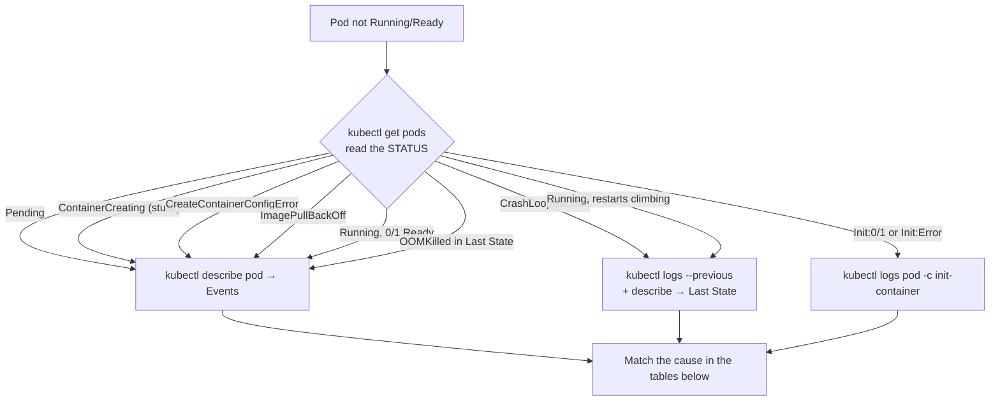

# Chapter 8 — CKAD Reference & Cheat Sheets

Use this chapter during timed practice, not during the real exam (no personal notes allowed) — the goal is to internalize it before exam day.

**⏱ Estimated time:** 20–30 minutes to read once, plus about 35 minutes for the three drills. This chapter is designed to be revisited constantly — keep it open during Chapter 9's labs and Chapter 10's timed practice sessions rather than reading it once and moving on.

**How the chapter is organized.** The reference sections (8.1–8.12) come first; each drill (🧪) appears right after the section it exercises, and the timed lookup sprint comes last because it draws on the whole chapter.

## Learning Objectives

By the end of this chapter, you should be able to:

- Locate the correct cheat-sheet table for any command, YAML skeleton, or troubleshooting symptom in seconds. *(Lookup Sprint drill)*
- Write from memory the manifests that have **no imperative generator** (StatefulSet, NetworkPolicy, PVC, probe/security fragments), and generate every other skeleton with `kubectl ... --dry-run=client -o yaml`. *(Skeletons drill)*
- Map a Pod/Service/Job symptom straight to its likely cause using 8.4, without re-deriving the diagnosis from first principles each time. *(Symptom Triage drill)*

> **📚 Theory — why cheat sheets work as a study tool even though you can't bring them to the exam.** The goal of drilling against a cheat sheet isn't memorizing the sheet itself — it's *offloading recall* so your working memory during the exam is spent on reading the task and reasoning about the fix, not on reconstructing syntax. This mirrors how experienced engineers actually work: they don't have `kubectl explain` output memorized either, they've just internalized the handful of patterns that cover 90% of real usage (this is the same "recognize the pattern, then generate/edit" workflow from Chapter 0). Repetition against this reference is what converts "I could look this up" into "I just typed it," which is the only thing that matters under a 2-hour clock.

## Quick Navigation

| Section | Covers | Priority |
|---|---|---|
| [8.1](#81-kubectl-cheat-sheet) kubectl Cheat Sheet | Core inspection, edit, and control commands | 🔴 MUST KNOW |
| [8.2](#82-imperative-command-cheat-sheet) Imperative Commands | Every `kubectl create`/`run`/`expose`/`set` pattern | 🔴 MUST KNOW |
| [8.3](#83-yaml-cheat-sheet--skeletons) YAML Skeletons | Which kinds need hand-written YAML, and minimal manifests for them | 🔴 MUST KNOW |
| [8.4](#84-troubleshooting-cheat-sheet) Troubleshooting | Symptom → first command → likely cause, for every common failure state | 🔴 MUST KNOW |
| [8.5](#85-labels--selectors-cheat-sheet) Labels & Selectors | Equality, set-based, and CLI label operations | 🟡 |
| [8.6](#86-probes-cheat-sheet) Probes | Probe roles, types, timing fields and defaults | 🟡 |
| [8.7](#87-volumes-cheat-sheet) Volumes | Persistence and sharing behavior by volume type | 🟡 |
| [8.8](#88-configmap--secret-cheat-sheet) ConfigMap & Secret | Consumption method to API field, side by side | 🟡 |
| [8.9](#89-deployment--rollout-cheat-sheet) Deployment/Rollout | Rollout control commands and strategy fields | 🔴 MUST KNOW |
| [8.10](#810-jobs--cronjobs-cheat-sheet) Jobs/CronJobs | Every Job/CronJob spec field | 🟡 |
| [8.11](#811-jsonpath-cheat-sheet) JSONPath | Common extraction patterns | 🟡 |
| [8.12](#812-helm--kustomize-quick-reference) Helm/Kustomize | Install/upgrade/rollback and overlay commands | 🟢 NICE TO KNOW |

## 8.1 kubectl Cheat Sheet

**Shell setup (first minute).** Check whether these already exist before typing them — the point is to have them, not to retype them:

```bash
alias k=kubectl
export do="--dry-run=client -o yaml"      # usage: k run x --image=nginx $do > x.yaml
source <(kubectl completion bash) && complete -o default -F __start_kubectl k
```

| Command | Purpose |
|---|---|
| `kubectl get <kind> [-n ns] [-o wide/yaml/json] [--show-labels]` | List/inspect objects |
| `kubectl describe <kind> <name>` | Full detail + Events |
| `kubectl get events --sort-by=.lastTimestamp` | Recent cluster events, newest last |
| `kubectl explain <kind>.<path> [--recursive]` | Field-level API reference |
| `kubectl api-resources` | Kinds, short names, and whether they are namespaced |
| `kubectl logs <pod> [-c container] [--previous] [-f]` | Container logs |
| `kubectl exec -it <pod> [-c container] -- <cmd>` | Shell into a container |
| `kubectl debug <pod> -it --image=busybox --target=<container>` | Ephemeral debug container |
| `kubectl run tmp --image=busybox:1.36 --rm -it --restart=Never -- <cmd>` | Throwaway Pod for in-cluster tests |
| `kubectl port-forward <pod\|svc/name> LOCAL:REMOTE` | Reach a workload from your terminal |
| `kubectl apply -f <file/dir>` / `apply -k <dir>` | Declarative create/update |
| `kubectl diff -f <file>` | Preview what `apply` would change |
| `kubectl delete -f <file>` / `delete <kind> <name>` | Remove objects |
| `kubectl replace --force -f <file>` | Delete and recreate (immutable-field changes) |
| `kubectl edit <kind> <name>` | Live-edit an object |
| `kubectl patch <kind> <name> -p '<json>'` | Targeted field update |
| `kubectl label / annotate <kind> <name> k=v` | Add/update labels or annotations |
| `kubectl scale <kind>/<name> --replicas=N` | Resize a workload |
| `kubectl rollout status/history/undo/pause/resume/restart <kind>/<name>` | Deployment rollout control |
| `kubectl top pods/nodes` | Live resource usage |
| `kubectl auth can-i <verb> <resource> --as=<identity>` | Permission check |
| `kubectl config set-context --current --namespace=<ns>` | Switch default namespace |

## 8.2 Imperative Command Cheat Sheet

```bash
# Workloads
kubectl run <name> --image= [--port=P] [--env=K=V] [--labels=k=v] [--restart=Never]
kubectl create deployment <name> --image= [--replicas=N] [--port=P]
kubectl create job <name> --image= [-- cmd args]
kubectl create job <name> --from=cronjob/<cronjob-name>          # run a CronJob once, now
kubectl create cronjob <name> --image= --schedule="* * * * *"

# Config and identity
kubectl create configmap <name> --from-literal=k=v | --from-file=f | --from-env-file=f
kubectl create secret generic <name> --from-literal=k=v
kubectl create secret docker-registry <name> --docker-server=.. --docker-username=.. --docker-password=..
kubectl create secret tls <name> --cert=c.crt --key=c.key
kubectl create serviceaccount <name>
kubectl create role <name> --verb=get,list --resource=pods
kubectl create rolebinding <name> --role=<role> --serviceaccount=ns:sa
kubectl create namespace <name>
kubectl create quota <name> --hard=cpu=2,memory=2Gi,pods=10

# Networking
kubectl expose deployment <name> --port=P [--target-port=P2] [--type=NodePort]
kubectl create ingress <name> --rule="host/path=svc:port"

# Change an existing workload without editing YAML
kubectl set image deployment/<name> <container>=
kubectl set env deployment/<name> K=V
kubectl set resources deployment/<name> --requests=cpu=100m,memory=64Mi --limits=cpu=200m,memory=128Mi
kubectl set serviceaccount deployment/<name> <sa>
kubectl autoscale deployment <name> --min=2 --max=5 --cpu-percent=80
```

## 8.3 YAML Cheat Sheet — Skeletons

Most kinds have an imperative generator (8.2). Append `--dry-run=client -o yaml` to produce the skeleton instead of typing it. The kinds with **no generator** are the ones worth being able to write from memory:

| Kind / fragment | Fastest way to get a skeleton |
|---|---|
| Pod, Deployment, Job, CronJob | `kubectl run` / `create deployment` / `create job` / `create cronjob` with `--dry-run=client -o yaml` |
| Service | `kubectl expose ... --dry-run=client -o yaml` or `kubectl create service` |
| Ingress, ConfigMap, Secret, Role, RoleBinding, ServiceAccount | `kubectl create ...` with `--dry-run=client -o yaml` |
| ✍️ StatefulSet, DaemonSet | Generate a Deployment, then change `kind`, add `serviceName` (StatefulSet) and `volumeClaimTemplates`; remove `replicas`/strategy for DaemonSet |
| ✍️ NetworkPolicy, PVC, PV | **Write by hand** (or copy from `kubectl explain`/docs) |
| ✍️ Probes, `securityContext`, `resources`, volumes, init containers | **Write by hand** — they are fragments inside a Pod spec |

### Pod

```yaml
apiVersion: v1
kind: Pod
metadata: {name: x, labels: {app: x}}
spec:
  containers:
  - {name: x, image: nginx, ports: [{containerPort: 80}]}
```

### Deployment

```yaml
apiVersion: apps/v1
kind: Deployment
metadata: {name: x}
spec:
  replicas: 3
  selector: {matchLabels: {app: x}}
  template:
    metadata: {labels: {app: x}}
    spec: {containers: [{name: x, image: nginx}]}
```

### Service

```yaml
apiVersion: v1
kind: Service
metadata: {name: x}
spec:
  selector: {app: x}
  ports: [{port: 80, targetPort: 8080}]
```

### Ingress (v1)

```yaml
apiVersion: networking.k8s.io/v1
kind: Ingress
metadata:
  name: web
spec:
  # ingressClassName: nginx        # required if the cluster has no default IngressClass
  rules:
  - host: app.example.com
    http:
      paths:
      - path: /
        pathType: Prefix
        backend:
          service:
            name: web
            port:
              number: 80
```

### ConfigMap

```yaml
apiVersion: v1
kind: ConfigMap
metadata: {name: x}
data: {KEY: "value"}
```

### Secret (plaintext authoring)

```yaml
apiVersion: v1
kind: Secret
metadata: {name: x}
type: Opaque
stringData: {KEY: "value"}
```

### PersistentVolumeClaim ✍️

```yaml
apiVersion: v1
kind: PersistentVolumeClaim
metadata: {name: x}
spec:
  accessModes: [ReadWriteOnce]
  resources: {requests: {storage: 1Gi}}
```

### StatefulSet with `volumeClaimTemplates` ✍️

```yaml
apiVersion: apps/v1
kind: StatefulSet
metadata:
  name: web
spec:
  serviceName: web
  replicas: 2
  selector:
    matchLabels:
      app: web
  template:
    metadata:
      labels:
        app: web
    spec:
      containers:
      - name: web
        image: nginx
        volumeMounts:
        - name: data
          mountPath: /data
  volumeClaimTemplates:
  - metadata:
      name: data
    spec:
      accessModes: ["ReadWriteOnce"]
      resources:
        requests:
          storage: 1Gi
```

### NetworkPolicy — deny all ingress, then allow one client ✍️

```yaml
apiVersion: networking.k8s.io/v1
kind: NetworkPolicy
metadata: {name: deny-all, namespace: dev}
spec: {podSelector: {}, policyTypes: [Ingress]}
---
apiVersion: networking.k8s.io/v1
kind: NetworkPolicy
metadata: {name: allow-api-to-db, namespace: dev}
spec:
  podSelector: {matchLabels: {app: db}}
  policyTypes: [Ingress]
  ingress:
  - from:
    - podSelector: {matchLabels: {app: api}}
    ports: [{protocol: TCP, port: 5432}]
```

If you also list `Egress` in `policyTypes`, remember to allow DNS (port 53, UDP and TCP) or name resolution will break.

### Job and CronJob

```yaml
apiVersion: batch/v1
kind: Job
metadata: {name: x}
spec:
  completions: 1
  backoffLimit: 4
  template:
    spec:
      restartPolicy: Never              # Never or OnFailure, never Always
      containers:
      - {name: x, image: busybox, command: ["sh", "-c", "echo done"]}
---
apiVersion: batch/v1
kind: CronJob
metadata: {name: y}
spec:
  schedule: "*/5 * * * *"
  concurrencyPolicy: Forbid
  jobTemplate:
    spec:
      template:
        spec:
          restartPolicy: OnFailure
          containers:
          - {name: y, image: busybox, command: ["sh", "-c", "date"]}
```

### Role and RoleBinding

```yaml
apiVersion: rbac.authorization.k8s.io/v1
kind: Role
metadata: {name: pod-reader, namespace: dev}
rules:
- apiGroups: [""]
  resources: ["pods"]
  verbs: ["get", "list", "watch"]
---
apiVersion: rbac.authorization.k8s.io/v1
kind: RoleBinding
metadata: {name: pod-reader-binding, namespace: dev}
subjects:
- {kind: ServiceAccount, name: sa-x, namespace: dev}
roleRef: {kind: Role, name: pod-reader, apiGroup: rbac.authorization.k8s.io}
```

### Pod-spec fragments ✍️

These slot into a Pod (or a Deployment's `template.spec`). They are the fields no generator produces:

```yaml
spec:
  serviceAccountName: sa-x
  securityContext: {runAsNonRoot: true, runAsUser: 10001}        # Pod-level
  initContainers:
  - {name: wait, image: busybox, command: ["sh", "-c", "until nc -z db 5432; do sleep 2; done"]}
  containers:
  - name: x
    image: nginx
    envFrom: [{configMapRef: {name: cm}}]
    env:
    - {name: PW, valueFrom: {secretKeyRef: {name: sec, key: PW}}}
    - {name: POD_NAME, valueFrom: {fieldRef: {fieldPath: metadata.name}}}
    resources: {requests: {cpu: 100m, memory: 64Mi}, limits: {cpu: 200m, memory: 128Mi}}
    securityContext: {allowPrivilegeEscalation: false, readOnlyRootFilesystem: true, capabilities: {drop: ["ALL"]}}
    readinessProbe: {httpGet: {path: /ready, port: 8080}, periodSeconds: 5}
    livenessProbe: {httpGet: {path: /healthz, port: 8080}, initialDelaySeconds: 10}
    volumeMounts:
    - {name: data, mountPath: /data}
    - {name: cfg, mountPath: /etc/cfg, readOnly: true}
  volumes:
  - {name: data, emptyDir: {}}                                   # or: persistentVolumeClaim: {claimName: my-pvc}
  - {name: cfg, configMap: {name: cm}}
```

## 🧪 Practice — Write the Hand-Written Skeletons from Memory

**Objective tested:** reproduce the manifests that have no generator (8.3).

### Task

Without looking at 8.3, write these four manifests into files in namespace `drill`: a StatefulSet `db` (2 replicas, image `nginx`, a 1Gi `ReadWriteOnce` volume claim template mounted at `/data`), a PVC `cache` (`500Mi`, `ReadWriteOnce`), a NetworkPolicy `deny-all` (deny all ingress to every Pod in the namespace), and a Deployment `web` (2 replicas, `nginx`) that has a readiness probe on `/` port `80`.

### Requirements

- Type the StatefulSet, PVC and NetworkPolicy from scratch; generate the Deployment skeleton with `--dry-run=client -o yaml` and add the probe by hand.
- Validate every file with a server-side dry run before you compare against 8.3.
- Fix errors using the API's own messages and `kubectl explain`, not by copying.

### Success Criteria

All four files pass `kubectl apply --dry-run=server`, and you can name the field you got wrong first on each attempt.

### Suggested Time

**10 minutes**

<details>
<summary>💡 Hint</summary>

Common misses: StatefulSet `serviceName`; `selector.matchLabels` not matching the template labels; PVC `resources.requests.storage` (not `resources.storage`); NetworkPolicy `policyTypes` and an empty `podSelector: {}`.

</details>

<details>
<summary>✅ Solution</summary>

```bash
kubectl create namespace drill
kubectl apply --dry-run=server -n drill -f statefulset.yaml
kubectl apply --dry-run=server -n drill -f pvc.yaml
kubectl apply --dry-run=server -n drill -f networkpolicy.yaml
kubectl create deployment web -n drill --image=nginx --replicas=2 --dry-run=client -o yaml > web.yaml
# add under the container: readinessProbe: {httpGet: {path: /, port: 80}}
kubectl apply --dry-run=server -n drill -f web.yaml
```

When the server rejects a file, read the message for the exact field path, then:

```bash
kubectl explain statefulset.spec --recursive | less
kubectl explain persistentvolumeclaim.spec.resources
```

Compare the finished files with the StatefulSet, PVC and NetworkPolicy blocks in 8.3, then repeat the exercise a day later until you no longer need the dry run.

</details>

## 8.4 Troubleshooting Cheat Sheet

🔴 **MUST KNOW**

> **📚 Theory.** A Pod's `STATUS` tells you *which stage of its life it failed in*: scheduling (`Pending`) → preparing the container (`ContainerCreating`, `CreateContainerConfigError`, `ImagePullBackOff`) → init containers (`Init:...`) → running the app (`CrashLoopBackOff`, `OOMKilled`) → passing probes (`Running` but `0/1`, or restarting). The stage decides which tool can see the problem: before any container starts there are **no logs**, so `describe` → Events is the only source; once a container has run, `logs` (and `--previous` after a restart) holds the answer.

> **🌍 Real-world example.** A common time-waster: an engineer runs `kubectl logs` on a Pod stuck in `Pending` or `ContainerCreating`, gets an empty result or an error, and concludes "no information." The Pod isn't broken *inside* — it never got a node or a working image. Reading `STATUS` first sends you to `describe pod`, where the Events say `0/3 nodes are available: insufficient cpu` in one line.

**Symptom triage** — start here, then match the cause in the table below:



### Pod symptoms

| Symptom | First commands | Likely causes |
|---|---|---|
| `Pending` | `describe pod` → Events | Insufficient CPU/memory; unbound PVC; taint with no toleration; `nodeSelector`/affinity mismatch |
| `ContainerCreating` (stuck) | `describe pod` → Events | Volume mount failure (`FailedMount`): a ConfigMap/Secret used as a **volume** doesn't exist, PVC not bound; slow image pull |
| `CreateContainerConfigError` | `describe pod` → Events | ConfigMap/Secret (or a key in it) referenced by **env** doesn't exist; `runAsNonRoot: true` on an image that runs as root |
| `ImagePullBackOff` / `ErrImagePull` | `describe pod` → Events | Image name/tag typo; private registry without `imagePullSecrets`; registry rate limit |
| `Init:0/1`, `Init:Error`, `Init:CrashLoopBackOff` | `logs <pod> -c <init-container>`; `describe pod` | Init container waiting on a dependency that doesn't exist yet, or failing — the app container has not started |
| `CrashLoopBackOff` | `logs --previous`; `describe` → Last State / exit code | Bad command/args; missing required env var; app-level fatal error |
| `OOMKilled` (Last State, exit code 137) | `describe` → Last State: reason | Memory limit too low, or a real memory leak → raise the limit or fix the app |
| `Running`, `0/1` Ready (no restarts) | `describe` → Events, Conditions | Readiness probe path/port wrong; app or its dependency not ready yet |
| `Running`, restart count climbing | `describe` → Events; `logs --previous` | Liveness probe failing: `initialDelaySeconds` too short (consider a `startupProbe`) or probe too strict |
| `Forbidden` on `kubectl apply` | Read the error text; `auth can-i` | RBAC denied (`... cannot create resource ...`) vs an admission policy (message names the policy, e.g. Pod Security) |

### Service, network, storage and batch symptoms

| Symptom | First commands | Likely causes |
|---|---|---|
| Service has no ready backends | `get endpointslice -l kubernetes.io/service-name=<svc>` | Selector doesn't match Pod labels; Pods not Ready |
| Endpoints exist but traffic is unreachable | `describe svc`; test with a temporary Pod | `targetPort` ≠ the port the app listens on; NetworkPolicy blocking; wrong Service type |
| Ingress not routing | `describe ingress`; `get ingressclass` | Host/path/`pathType` wrong; no controller installed; backend Service has no endpoints (verify independently) |
| NetworkPolicy blocking legitimate traffic | `get networkpolicy`; compare labels | A deny-all with no matching allow rule; `podSelector` labels don't match the intended Pods exactly |
| PVC `Pending` | `describe pvc` → Events | `storageClassName` mismatch; no default StorageClass; accessMode mismatch; capacity too large for any PV |
| Job not completing | `describe job`; `logs` of the Pods it created | `backoffLimit` exhausted; `completions` count; `activeDeadlineSeconds` reached |
| CronJob not creating Jobs | `get cronjob` → LAST SCHEDULE | Schedule syntax; `concurrencyPolicy: Forbid` blocking overlap; `suspend: true` |

## 🧪 Practice — Symptom Triage

**Objective tested:** map a symptom to its cause and first command using 8.4.

### Task

Five Pods in namespace `triage` are broken in five different ways. For each Pod, record its `STATUS`, the first command you should run, the evidence that proves the cause, and the fix — using only the tables above.

### Setup

```bash
kubectl create namespace triage
kubectl run bad-image -n triage --image=nginx:no-such-tag
kubectl run crasher -n triage --image=busybox:1.36 -- sh -c 'echo boom; exit 1'
kubectl run too-big -n triage --image=nginx --overrides='{"spec":{"containers":[{"name":"too-big","image":"nginx","resources":{"requests":{"cpu":"1000","memory":"1000Gi"}}}]}}'
kubectl run bad-cfg -n triage --image=nginx --overrides='{"spec":{"containers":[{"name":"bad-cfg","image":"nginx","env":[{"name":"X","valueFrom":{"configMapKeyRef":{"name":"nope","key":"k"}}}]}]}}'
kubectl run not-ready -n triage --image=nginx --overrides='{"spec":{"containers":[{"name":"not-ready","image":"nginx","readinessProbe":{"httpGet":{"path":"/nope","port":80}}}]}}'
```

Give the Pods about 30 seconds to settle.

### Requirements

- Start from `kubectl get pods -n triage` and read `STATUS` and `READY` for every Pod before running anything else.
- Use the first command the table recommends for that symptom; don't shotgun every command at every Pod.
- Do not delete a Pod before you've written down the evidence.

### Success Criteria

For all five Pods you can state the status, the recommended first command, the specific evidence line, and the fix — in under two minutes per Pod.

### Suggested Time

**10 minutes**

<details>
<summary>💡 Hint</summary>

Only two of the five have logs worth reading. For the rest, Events are the evidence. If you find yourself running `logs` on a Pod with no running container, re-read the Theory box above.

</details>

<details>
<summary>✅ Solution</summary>

| Pod | STATUS | First command | Evidence | Fix |
|---|---|---|---|---|
| `bad-image` | `ImagePullBackOff` | `describe pod` | Event: failed to pull `nginx:no-such-tag`, manifest unknown | Correct the image tag |
| `crasher` | `CrashLoopBackOff` | `logs --previous` | Log prints `boom`; Last State: Error, exit code 1 | Fix the command/args |
| `too-big` | `Pending` | `describe pod` | Event `FailedScheduling`: insufficient cpu / memory | Lower the requests |
| `bad-cfg` | `CreateContainerConfigError` | `describe pod` | Event: `configmap "nope" not found` | Create the ConfigMap or fix the reference |
| `not-ready` | `Running`, `0/1` | `describe pod` | Event: `Readiness probe failed`, HTTP 404 on `/nope` | Correct the probe path |

Clean up when done:

```bash
kubectl delete namespace triage
```

</details>

## 8.5 Labels & Selectors Cheat Sheet

```bash
kubectl get pods -l app=web                 # equality
kubectl get pods -l 'app!=web'               # inequality
kubectl get pods -l 'env in (prod,staging)'  # set-based
kubectl get pods -l 'env notin (dev)'
kubectl get pods -l 'app,env'                # existence
kubectl get pods --show-labels               # display all labels
kubectl get pods -L app,env                  # show selected labels as columns
kubectl get pods --field-selector=status.phase=Running   # filter on fields, not labels
kubectl label pod x k=v --overwrite
kubectl label pod x k-                       # delete a label
```
```yaml
matchLabels: {app: web}                      # equality only
matchExpressions:                            # set-based, richer
- {key: env, operator: In, values: [prod, staging]}
```

> **📚 Theory.** Labels are the join key of Kubernetes: Services, Deployments, ReplicaSets, NetworkPolicies and `kubectl -l` all find their targets by matching labels rather than by name or ID. That loose coupling is why Pods can be replaced freely — and why a label edit is a silent breaking change. A Deployment's `spec.selector` is also **immutable** after creation, so changing the labels it selects on means recreating it.

> **🌍 Real-world example.** During a naming cleanup a team renamed `app: cart` to `app: cart-service` on a Deployment and its own Service, but an older Service that other teams called still selected `app: cart`. It silently dropped to zero endpoints; nothing alerted on the Service itself, and the outage surfaced as timeouts in a different team's logs. After any label change, list every Service that selects the old value.

## 8.6 Probes Cheat Sheet

| Probe | Question it answers | When it fails |
|---|---|---|
| `readinessProbe` | Should this Pod receive traffic right now? | Pod removed from Service endpoints; **no restart** |
| `livenessProbe` | Is the container stuck beyond recovery? | kubelet **restarts** the container |
| `startupProbe` | Has a slow app finished starting? | Runs first; liveness/readiness are held off until it succeeds, and the container is restarted if it never does |

| Field | Meaning | Default |
|---|---|---|
| `initialDelaySeconds` | Wait before first probe | 0 |
| `periodSeconds` | Time between probes | 10 |
| `timeoutSeconds` | Time before a probe attempt itself is considered failed | 1 |
| `successThreshold` | Consecutive successes to go from failing -> healthy (must be 1 for liveness/startup) | 1 |
| `failureThreshold` | Consecutive failures to go from healthy -> failing | 3 |

`httpGet` (2xx/3xx = success) · `tcpSocket` (connection succeeds = success) · `exec` (exit 0 = success)

```yaml
startupProbe:   {httpGet: {path: /healthz, port: 8080}, periodSeconds: 5, failureThreshold: 30}   # up to 150 s to start
readinessProbe: {httpGet: {path: /ready,   port: 8080}, periodSeconds: 5}
livenessProbe:  {httpGet: {path: /healthz, port: 8080}, periodSeconds: 10}
```

> **📚 Theory.** Probes are run by the **kubelet on the node**, and each outcome feeds a different consumer: readiness drives the Pod's `Ready` condition (which the EndpointSlice controller and Deployment rollouts both watch), liveness drives container restarts. Because rollouts wait on readiness, a Deployment with `maxUnavailable: 0` is only truly zero-downtime if its Pods have a readiness probe that means something.

> **🌍 Real-world example.** A team whose liveness probe also checked the database saw every replica restart at the same moment during a short database failover, turning a 30-second blip into a multi-minute outage. Rule of thumb: readiness may depend on dependencies; liveness should only test whether the process itself is wedged.

## 8.7 Volumes Cheat Sheet

| Type | Survives container restart? | Survives Pod deletion? | Shared across nodes? |
|---|---|---|---|
| `emptyDir` | Yes | No | No (node-local, Pod-local); `medium: Memory` makes it RAM-backed |
| `hostPath` | Yes | Yes (on that node only) | No |
| `configMap` / `secret` | Yes (re-mounted) | Source object persists; mount is read-only | N/A |
| PVC-backed (network storage) | Yes | Yes | Depends on accessMode (RWO/ROX/RWX) |

## 8.8 ConfigMap & Secret Cheat Sheet

| Need | ConfigMap | Secret |
|---|---|---|
| Plain env var | `configMapKeyRef` | `secretKeyRef` |
| All keys as env vars | `envFrom.configMapRef` | `envFrom.secretRef` |
| Mounted files | `volumes.configMap` | `volumes.secret` |
| Plaintext authoring shortcut | `data:` (plain strings) | `stringData:` (auto-encoded) |
| Change picked up without restart? | Only mounted-file form, eventually (not `subPath` mounts) | Only mounted-file form, eventually (not `subPath` mounts) |

Read a Secret value back: `kubectl get secret x -o jsonpath='{.data.KEY}' | base64 -d`

> **📚 Theory.** Environment variables are resolved once, when the container is created, so editing a ConfigMap or Secret never changes the environment of a running container — a rollout (`kubectl rollout restart`) is required. Mounted volumes are refreshed by the kubelet on a delay, but the application still has to re-read the file. A Secret is base64-*encoded*, not encrypted; treat the manifest as sensitive.

> **🌍 Real-world example.** "I updated the ConfigMap but the app still behaves the same" is one of the most common Kubernetes support questions. Helm charts routinely add a checksum of the ConfigMap to a Pod-template annotation so that any config change also changes the template and triggers a rollout automatically.

## 8.9 Deployment / Rollout Cheat Sheet

```bash
kubectl rollout status deployment/x
kubectl rollout history deployment/x [--revision=N]
kubectl rollout undo deployment/x [--to-revision=N]
kubectl rollout pause|resume|restart deployment/x
kubectl set image deployment/x <container>=
kubectl annotate deployment/x kubernetes.io/change-cause="bump to 1.26"   # shows in rollout history
```

| Field | Meaning |
|---|---|
| `strategy.type: RollingUpdate` (default) | Replace Pods gradually |
| `strategy.type: Recreate` | Stop all old Pods, then start new ones (downtime; use when versions can't run side by side) |
| `maxSurge` | Extra Pods allowed **above** desired count during update (number or %; % rounds up) |
| `maxUnavailable` | Pods allowed **below** desired count during update (number or %; % rounds down) |

> **📚 Theory.** A Deployment never edits Pods in place. Changing `.spec.template` creates a new ReplicaSet, which scales up while the old one scales down; the old ReplicaSet is kept at 0 replicas, which is what makes `rollout undo` instant. Only **template** changes create revisions — editing `strategy` or `replicas` does not. With 4 replicas, `maxSurge: 25%` and `maxUnavailable: 25%` allow at most 5 Pods and at least 3 available (25% of 4 is exactly 1 either way; with 3 replicas, surge rounds up to 1 but unavailable rounds down to 0).

> **🌍 Real-world example.** With `maxUnavailable: 0` and a readiness probe, an update to a nonexistent image tag simply stalls: the new Pod sits in `ImagePullBackOff` while every old Pod keeps serving. The bad release costs nothing but a stuck rollout, and `rollout undo` clears it. Chapter 7's Practice D walks through exactly this.

## 8.10 Jobs / CronJobs Cheat Sheet

| Field | Purpose |
|---|---|
| `completions` | Total successful Pod completions needed |
| `parallelism` | Max Pods running at once |
| `backoffLimit` | Retries before Job is marked failed |
| `activeDeadlineSeconds` | Hard wall-clock timeout for the whole Job |
| `ttlSecondsAfterFinished` | Auto-delete a finished Job (and its Pods) after N seconds |
| `restartPolicy` | Must be `Never` or `OnFailure` inside a Job's Pod template (never `Always`) |
| `schedule` (CronJob) | Standard 5-field cron syntax |
| `concurrencyPolicy` | `Allow` (default) \| `Forbid` \| `Replace` |
| `suspend: true` (CronJob) | Pause future scheduling without deleting the object |
| `startingDeadlineSeconds` (CronJob) | How late a missed run may still start |
| `successfulJobsHistoryLimit` / `failedJobsHistoryLimit` (CronJob) | How many finished Jobs to keep |

## 8.11 JSONPath Cheat Sheet

```bash
kubectl get pods -o jsonpath='{.items[*].metadata.name}'
kubectl get pod x -o jsonpath='{.status.podIP}'
kubectl get pod x -o jsonpath='{.spec.containers[0].image}'
kubectl get pod x -o jsonpath='{.status.containerStatuses[0].lastState.terminated.reason}'
kubectl get nodes -o jsonpath='{.items[*].status.addresses[?(@.type=="InternalIP")].address}'
kubectl get pods -o jsonpath='{range .items[*]}{.metadata.name}{"\t"}{.status.phase}{"\n"}{end}'
kubectl get pods -o custom-columns=NAME:.metadata.name,IMAGE:.spec.containers[*].image
kubectl get pods --sort-by=.metadata.creationTimestamp
```

## 8.12 Helm / Kustomize Quick Reference

```bash
helm repo add <name> <url> && helm repo update
helm search repo <keyword>
helm show values <chart>                       # what can be overridden
helm install <rel> <chart> [--set k=v] [-f values.yaml] [--dry-run]
helm upgrade <rel> <chart> ...
helm history <rel> / helm get values <rel>
helm rollback <rel> <revision>
helm list / helm uninstall <rel>
helm template <rel> <chart>                    # render only, no install
kubectl apply -k <dir>
kubectl kustomize <dir>       # render only, no apply — use to debug
```

```yaml
# kustomization.yaml (overlay)
apiVersion: kustomize.config.k8s.io/v1beta1
kind: Kustomization
resources: [../../base]
namespace: prod
images:
- {name: nginx, newTag: "1.26"}
patches:
- path: replicas-patch.yaml
```

## 🧪 Practice — Timed Lookup Sprint

**Objective tested:** locate the right command in seconds, using only this chapter (8.1, 8.2, 8.5, 8.9, 8.11).

### Task

In namespace `drill`, complete all nine items. Each item should take no more than a minute from "read the task" to "verified."

1. Create a Deployment `web` with image `nginx:1.25` and 3 replicas.
2. Expose it on Service port `80`, forwarding to container port `8080`.
3. Create a ConfigMap `app-config` with `MODE=fast`.
4. Run a Job `hello` (image `busybox:1.36`) that echoes `hello`.
5. Print each Pod's name and image as two columns.
6. Scale `web` to 5 replicas.
7. Update `web` to `nginx:1.26`, then roll it back.
8. Add the label `env=test` to one `web` Pod, then remove it.
9. List only Pods carrying `env=test`.

### Requirements

- Use the cheat-sheet sections, not the Kubernetes docs; note which section you used for each item.
- Imperative commands only — no YAML files.
- Verify each item's result before moving to the next.

### Success Criteria

All nine items done and verified in under 10 minutes, with the section you consulted recorded for each. On a second run, aim to need the chapter for at most two of them.

### Suggested Time

**10 minutes**

<details>
<summary>💡 Hint</summary>

Sections: items 1–4 → 8.2; item 5 → 8.11 (`custom-columns`); items 6–7 → 8.1 and 8.9; items 8–9 → 8.5. `kubectl create deployment` names the container after the image (`nginx`), which you need for `set image`.

</details>

<details>
<summary>✅ Solution</summary>

```bash
kubectl create namespace drill
kubectl create deployment web -n drill --image=nginx:1.25 --replicas=3
kubectl expose deployment web -n drill --port=80 --target-port=8080
kubectl create configmap app-config -n drill --from-literal=MODE=fast
kubectl create job hello -n drill --image=busybox:1.36 -- echo hello
kubectl get pods -n drill -o custom-columns=NAME:.metadata.name,IMAGE:.spec.containers[*].image
kubectl scale deployment web -n drill --replicas=5
kubectl set image deployment/web nginx=nginx:1.26 -n drill
kubectl rollout status deployment/web -n drill
kubectl rollout undo deployment/web -n drill
POD=$(kubectl get pods -n drill -l app=web -o jsonpath='{.items[0].metadata.name}')
kubectl label pod $POD -n drill env=test
kubectl get pods -n drill -l env=test
kubectl label pod $POD -n drill env-
kubectl delete namespace drill
```

</details>

---

**Exam Tips — Chapter 8**
- This chapter is a drilling tool, not exam-day material — repetition against it (not re-reading it) is what builds real recall speed.
- When stuck mid-exam, `kubectl get pods` → the STATUS column → the 8.4 flowchart is faster than trying to remember which symptom maps to which cause from scratch.
- The YAML skeletons in 8.3 are deliberately minimal — pair them with `--dry-run=client -o yaml` from Chapter 6 rather than memorizing full manifests. Memorize the ✍️ kinds; generate the rest.
- After every change, verify the outcome (endpoints populated, rollout complete, value present in the running container) — the habit from Chapter 7's Full Verification Pass.

## Chapter Summary

This chapter has no new concepts — it's a compressed index of everything from Chapters 0–7, organized for fast lookup during practice. Use the Quick Navigation table above to jump straight to what you need, and revisit the 8.4 troubleshooting flow until it's automatic.

| Objective | Where you practiced it |
|---|---|
| Locate the right table in seconds | Timed Lookup Sprint |
| Write the no-generator manifests from memory | Write the Hand-Written Skeletons from Memory |
| Map symptom → cause | Symptom Triage |

**Next:** Chapter 9 — CKAD Practice & Labs is where all of this gets tested hands-on.
\newpage
