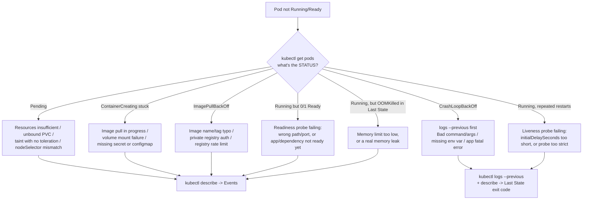

# Chapter 8 — CKAD Reference & Cheat Sheets

Use this chapter during timed practice, not during the real exam (no personal notes allowed) — the goal is to internalize it before exam day.

**⏱ Estimated time:** 20–30 minutes to read once, but this chapter is designed to be revisited constantly — keep it open during Chapter 9's labs and Chapter 10's timed practice sessions rather than reading it once and moving on.

## Learning Objectives

By the end of this chapter, you should be able to:

- Locate the correct cheat-sheet table for any command, YAML skeleton, or troubleshooting symptom in seconds.
- Reproduce any YAML skeleton in 7.3 from memory, without looking.
- Map a Pod/Service/Job symptom straight to its likely cause using 7.4, without re-deriving the diagnosis from first principles each time.

> **📚 Theory — why cheat sheets work as a study tool even though you can't bring them to the exam.** The goal of drilling against a cheat sheet isn't memorizing the sheet itself — it's *offloading recall* so your working memory during the exam is spent on reading the task and reasoning about the fix, not on reconstructing syntax. This mirrors how experienced engineers actually work: they don't have `kubectl explain` output memorized either, they've just internalized the handful of patterns that cover 90% of real usage (this is the same "recognize the pattern, then generate/edit" workflow from Chapter 0). Repetition against this reference is what converts "I could look this up" into "I just typed it," which is the only thing that matters under a 2-hour clock.

## Quick Navigation

| Section | Covers |
|---|---|
| [8.1](#81-kubectl-cheat-sheet) kubectl Cheat Sheet | Core inspection, edit, and control commands |
| [8.2](#82-imperative-command-cheat-sheet) Imperative Commands | Every `kubectl create`/`run`/`expose` pattern |
| [8.3](#83-yaml-cheat-sheet--skeletons) YAML Skeletons | Minimal valid manifests for the most-created kinds |
| [8.4](#84-troubleshooting-cheat-sheet) Troubleshooting | Symptom → likely cause → what to check, for every common failure state |
| [8.5](#85-labels--selectors-cheat-sheet) Labels & Selectors | Equality, set-based, and CLI label operations |
| [8.6](#86-probes-cheat-sheet) Probes | Every probe timing field, at a glance |
| [8.7](#87-volumes-cheat-sheet) Volumes | Persistence and sharing behavior by volume type |
| [8.8](#88-configmap--secret-cheat-sheet) ConfigMap & Secret | Consumption method to API field, side by side |
| [8.9](#89-deployment--rollout-cheat-sheet) Deployment/Rollout | Rollout control commands and strategy fields |
| [8.10](#810-jobs--cronjobs-cheat-sheet) Jobs/CronJobs | Every Job/CronJob spec field |
| [8.11](#811-jsonpath-cheat-sheet) JSONPath | Common extraction patterns |
| [8.12](#812-helm--kustomize-quick-reference) Helm/Kustomize | Install/upgrade/rollback and overlay commands |

*(Note: section numbers below have been corrected from the original guide's `7.x` labels to `8.x`, matching this chapter's actual number — a numbering inconsistency in the source material.)*

## 8.1 kubectl Cheat Sheet

| Command | Purpose |
|---|---|
| `kubectl get <kind> [-n ns] [-o wide/yaml/json]` | List/inspect objects |
| `kubectl describe <kind> <name>` | Full detail + Events |
| `kubectl explain <kind>.<path> [--recursive]` | Field-level API reference |
| `kubectl logs <pod> [-c container] [--previous] [-f]` | Container logs |
| `kubectl exec -it <pod> [-c container] -- <cmd>` | Shell into a container |
| `kubectl debug <pod> -it --image=busybox --target=<c>` | Ephemeral debug container |
| `kubectl apply -f <file/dir>` / `apply -k <dir>` | Declarative create/update |
| `kubectl delete -f <file>` / `delete <kind> <name>` | Remove objects |
| `kubectl edit <kind> <name>` | Live-edit an object |
| `kubectl patch <kind> <name> -p '<json>'` | Targeted field update |
| `kubectl label / annotate <kind> <name> k=v` | Add/update labels or annotations |
| `kubectl scale <kind>/<name> --replicas=N` | Resize a workload |
| `kubectl rollout status/history/undo/pause/resume/restart <kind>/<name>` | Deployment rollout control |
| `kubectl top pods/nodes` | Live resource usage |
| `kubectl auth can-i <verb> <resource> --as=<identity>` | Permission check |
| `kubectl config set-context --current --namespace=<ns>` | Switch default namespace |

## 8.2 Imperative Command Cheat Sheet

```bash
kubectl run <name> --image= [--port=P] [--env=K=V] [--labels=k=v] [--restart=Never]
kubectl create deployment <name> --image= [--replicas=N]
kubectl create job <name> --image= [-- cmd args]
kubectl create cronjob <name> --image= --schedule="* * * * *"
kubectl create configmap <name> --from-literal=k=v | --from-file=f | --from-env-file=f
kubectl create secret generic <name> --from-literal=k=v
kubectl create secret docker-registry <name> --docker-server=.. --docker-username=.. --docker-password=..
kubectl create secret tls <name> --cert=c.crt --key=c.key
kubectl create serviceaccount <name>
kubectl create role <name> --verb=get,list --resource=pods
kubectl create rolebinding <name> --role=<role> --serviceaccount=ns:sa
kubectl create namespace <name>
kubectl expose deployment <name> --port=P [--target-port=P2] [--type=NodePort]
kubectl create ingress <name> --rule="host/path=svc:port"
```

## 8.3 YAML Cheat Sheet — Skeletons

```yaml
# Pod
apiVersion: v1
kind: Pod
metadata: {name: x, labels: {app: x}}
spec:
  containers:
  - {name: x, image: nginx, ports: [{containerPort: 80}]}
```
```yaml
# Deployment
apiVersion: apps/v1
kind: Deployment
metadata: {name: x}
spec:
  replicas: 3
  selector: {matchLabels: {app: x}}
  template:
    metadata: {labels: {app: x}}
    spec: {containers: [{name: x, image: nginx}]}
```
```yaml
# Service
apiVersion: v1
kind: Service
metadata: {name: x}
spec:
  selector: {app: x}
  ports: [{port: 80, targetPort: 8080}]
```
```yaml
# ConfigMap / Secret
apiVersion: v1
kind: ConfigMap        # or Secret (add "type: Opaque"; use stringData for plaintext)
metadata: {name: x}
data: {KEY: "value"}
```
```yaml
# NetworkPolicy — deny all ingress
apiVersion: networking.k8s.io/v1
kind: NetworkPolicy
metadata: {name: deny-all, namespace: dev}
spec: {podSelector: {}, policyTypes: [Ingress]}
```
```yaml
# PVC
apiVersion: v1
kind: PersistentVolumeClaim
metadata: {name: x}
spec:
  accessModes: [ReadWriteOnce]
  resources: {requests: {storage: 1Gi}}
```

## 8.4 Troubleshooting Cheat Sheet 🔴 MUST KNOW

**Pod symptom triage, visually** — start here, then use the full text reference below for the exact commands and checks per symptom:



The full symptom-by-symptom reference:

```
Pod Pending
  -> describe -> Events
  -> check: resources (insufficient cpu/memory) / unbound PVC / taints & no toleration / nodeSelector match

ContainerCreating (stuck)
  -> describe -> Events
  -> check: image pull in progress / volume mount failure / secret or configmap missing

ImagePullBackOff
  -> describe -> Events
  -> check: image name/tag typo / private registry auth (imagePullSecrets) / registry rate limit

CrashLoopBackOff
  -> logs --previous
  -> describe -> Last State / exit code
  -> check: bad command/args / missing required env var / app-level fatal error

OOMKilled
  -> describe -> Last State: reason
  -> check: memory limit too low, or real memory leak -> raise limit or fix app

Readiness probe failing (0/1 Ready, no restart)
  -> describe -> Events
  -> check: probe path/port wrong / app not actually ready yet / dependency unavailable

Liveness probe failing (repeated restarts)
  -> describe -> Events, logs --previous
  -> check: initialDelaySeconds too short / probe target too strict

Service has no endpoints
  -> kubectl get endpoints <svc>
  -> check: selector vs pod labels mismatch / pods not Ready

Service has endpoints but unreachable
  -> check: targetPort vs container's actual listening port / NetworkPolicy blocking / wrong Service type

Ingress not routing
  -> describe ingress -> check host/path/pathType
  -> kubectl get ingressclass -> confirm a controller is installed
  -> verify backend Service has endpoints independently

NetworkPolicy blocking legitimate traffic
  -> check for a deny-all with no matching allow rule
  -> verify podSelector labels match intended pods exactly

PVC Pending
  -> describe pvc -> Events
  -> check: storageClassName mismatch / no default StorageClass / accessMode mismatch / capacity too large for any PV

Job not completing
  -> describe job, describe/logs the pod(s) it created
  -> check: backoffLimit exhausted / completions count / activeDeadlineSeconds

CronJob not creating Jobs
  -> get cronjob -> check LAST SCHEDULE column
  -> check: schedule syntax / concurrencyPolicy: Forbid blocking overlap / suspend: true
```

## 8.5 Labels & Selectors Cheat Sheet

```bash
kubectl get pods -l app=web                 # equality
kubectl get pods -l 'app!=web'               # inequality
kubectl get pods -l 'env in (prod,staging)'  # set-based
kubectl get pods -l 'env notin (dev)'
kubectl get pods -l 'app,env'                # existence
kubectl label pod x k=v --overwrite
kubectl label pod x k-                       # delete a label
```
```yaml
matchLabels: {app: web}                      # equality only
matchExpressions:                            # set-based, richer
- {key: env, operator: In, values: [prod, staging]}
```

## 8.6 Probes Cheat Sheet

| Field | Meaning |
|---|---|
| `initialDelaySeconds` | Wait before first probe |
| `periodSeconds` | Time between probes |
| `timeoutSeconds` | Time before a probe attempt itself is considered failed |
| `successThreshold` | Consecutive successes to go from failing -> healthy |
| `failureThreshold` | Consecutive failures to go from healthy -> failing |

`httpGet` (2xx/3xx = success) · `tcpSocket` (connection succeeds = success) · `exec` (exit 0 = success)

## 8.7 Volumes Cheat Sheet

| Type | Persists past Pod deletion? | Shared across nodes? |
|---|---|---|
| `emptyDir` | No | No (node-local, Pod-local) |
| `hostPath` | Yes (on that node only) | No |
| `configMap` / `secret` | Source persists; mount is read-only | N/A |
| PVC-backed (network storage) | Yes | Depends on accessMode (RWO/ROX/RWX) |

## 8.8 ConfigMap & Secret Cheat Sheet

| Need | ConfigMap | Secret |
|---|---|---|
| Plain env var | `configMapKeyRef` | `secretKeyRef` |
| All keys as env vars | `envFrom.configMapRef` | `envFrom.secretRef` |
| Mounted files | `volumes.configMap` | `volumes.secret` |
| Plaintext authoring shortcut | `data:` (plain strings) | `stringData:` (auto-encoded) |
| Change picked up without restart? | Only mounted-file form, eventually | Only mounted-file form, eventually |

## 8.9 Deployment / Rollout Cheat Sheet

```bash
kubectl rollout status deployment/x
kubectl rollout history deployment/x [--revision=N]
kubectl rollout undo deployment/x [--to-revision=N]
kubectl rollout pause|resume|restart deployment/x
```
`maxSurge` = extra Pods allowed above desired count during update. `maxUnavailable` = Pods allowed below desired count during update.

## 8.10 Jobs / CronJobs Cheat Sheet

| Field | Purpose |
|---|---|
| `completions` | Total successful Pod completions needed |
| `parallelism` | Max Pods running at once |
| `backoffLimit` | Retries before Job is marked failed |
| `activeDeadlineSeconds` | Hard wall-clock timeout for the whole Job |
| `restartPolicy` | Must be `Never` or `OnFailure` inside a Job's Pod template (never `Always`) |
| `schedule` (CronJob) | Standard 5-field cron syntax |
| `concurrencyPolicy` | `Allow` \| `Forbid` \| `Replace` |
| `suspend: true` (CronJob) | Pause future scheduling without deleting the object |

## 8.11 JSONPath Cheat Sheet

```bash
kubectl get pods -o jsonpath='{.items[*].metadata.name}'
kubectl get pod x -o jsonpath='{.status.podIP}'
kubectl get pod x -o jsonpath='{.spec.containers[0].image}'
kubectl get nodes -o jsonpath='{.items[*].status.addresses[?(@.type=="InternalIP")].address}'
kubectl get pods -o jsonpath='{range .items[*]}{.metadata.name}{"\t"}{.status.phase}{"\n"}{end}'
```

## 8.12 Helm / Kustomize Quick Reference

```bash
helm install <rel> <chart> [--set k=v] [-f values.yaml]
helm upgrade <rel> <chart> ...
helm rollback <rel> <revision>
helm list / helm uninstall <rel>
kubectl apply -k <dir>
kubectl kustomize <dir>       # render only, no apply — use to debug
```

---

**Exam Tips — Chapter 8**
- This chapter is a drilling tool, not exam-day material — repetition against it (not re-reading it) is what builds real recall speed.
- When stuck mid-exam, `kubectl get pods` → the STATUS column → the 8.4 flowchart is faster than trying to remember which symptom maps to which cause from scratch.
- The YAML skeletons in 8.3 are deliberately minimal — pair them with `--dry-run=client -o yaml` from Chapter 6 rather than memorizing full manifests.

## Chapter Summary

This chapter has no new concepts — it's a compressed index of everything from Chapters 0–7, organized for fast lookup during practice. Use the Quick Navigation table above to jump straight to what you need, and revisit the 8.4 troubleshooting flow until it's automatic.

**Next:** Chapter 9 — CKAD Practice & Labs is where all of this gets tested hands-on.
\newpage
