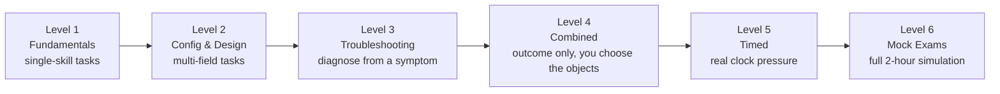

# Chapter 9 — CKAD Practice & Labs

Everything above this point was reference. Everything from here on is hands-on. **Attempt every task yourself in a real cluster (`kind`, `minikube`, or any sandbox) before reading the solution** — reading a solution without typing the commands yourself builds false confidence.

**⏱ Estimated time:** 6–9 hours total, spread across multiple sessions — this is the largest time investment in the guide, and deliberately so. Roughly: Level 1 (45–60 min), Level 2 (1–1.5 hrs), Level 3 (1–1.5 hrs), Level 4 (1.5–2 hrs), Level 5 (1–1.5 hrs), Level 6 (2 x ~2 hrs for the two mock exams).

## Learning Objectives

By the end of this chapter, you should be able to:

- Complete Level 1–2 fundamentals tasks from memory, without consulting Chapter 8.
- Diagnose and fix every Level 3 failure category using only `describe`/`logs`/`get EndpointSlices` — no starting hint beyond the symptom.
- Decide, unprompted, which Kubernetes objects a Level 4 outcome-based task requires, the way the real exam expects.
- Finish Level 5 timed tasks at or under their stated time targets.
- Self-grade a full Level 6 mock exam at or above the 66% pass-proxy threshold.

**Progression:** Level 1 (Fundamentals) -> Level 2 (Configuration & Design) -> Level 3 (Troubleshooting) -> Level 4 (Combined) -> Level 5 (Timed) -> Level 6 (Full Mock Exams). Difficulty and ambiguity increase as you go — later levels intentionally withhold which resource or command to use, in the style of a performance-based exam.



Each level removes a little more scaffolding: Level 1 tells you exactly which object and command to use, Level 4 only describes an outcome, and Level 6 gives you nothing but a 2-hour clock — under the same kind of time pressure.

> **📚 Theory — why struggling first matters.** This is sometimes called "productive failure" or the generation effect: forcing yourself to attempt recall (even unsuccessfully) before seeing an answer builds a stronger, more durable memory trace than reading the answer first ever does — the retrieval attempt itself is what strengthens the neural pathway, not just exposure to the correct answer. It's the same reason flashcards work better than re-reading notes. Skipping straight to the solution below feels efficient in the moment and is measurably worse for retention under exam pressure three weeks later.

---

## Level 1 — Fundamentals

**⏱ Level time budget:** 45–60 minutes for all 8 tasks. These map directly to Chapter 0's core skills — if any task here takes more than double its target, revisit that chapter section before continuing.

### Task 1.1 — Create and label a Pod

- **Scenario:** A teammate needs a quick throwaway Pod to test an image before it's wired into a Deployment.
- **Namespace:** `default`
- **Starting State:** Empty cluster.
- **Time Target:** 3 minutes
- **Skills Tested:** Imperative Pod creation, labeling

**Task:** Create a Pod named `test-pod` running image `nginx:1.27` with label `env=test`. Verify the Pod is `Running` and carries the label.

**Verification:** `kubectl get pod test-pod --show-labels` shows `env=test`; `STATUS` is `Running`.

<details>
<summary>✅ Solution — reveal after attempting the task</summary>

```bash
kubectl run test-pod --image=nginx:1.27 --labels=env=test
kubectl get pod test-pod --show-labels
```

**Explanation:** `--labels` on `kubectl run` sets labels at creation time — no separate `label` command needed.

**Common Mistakes:** Using `kubectl create deployment` instead of `kubectl run` (creates a Deployment + ReplicaSet + Pod, not a bare Pod as asked); forgetting `--labels` and trying to add the label after with a typo'd key.

</details>

---

### Task 1.2 — Namespaces and default context

- **Namespace:** `billing` (to be created)
- **Time Target:** 3 minutes
- **Skills Tested:** Namespace creation, context switching

**Task:** Create a namespace called `billing`. Set your current context's default namespace to `billing`. Confirm any subsequent `kubectl get pods` (no `-n` flag) targets `billing`.

<details>
<summary>✅ Solution — reveal after attempting the task</summary>

```bash
kubectl create namespace billing
kubectl config set-context --current --namespace=billing
kubectl config view --minify | grep namespace:
```

**Common Mistakes:** Passing `-n billing` on every future command instead of switching the default — works, but wastes time across a whole exam.

</details>

---

### Task 1.3 — Label-based selection

- **Namespace:** `default`
- **Starting State:** Three Pods exist: `web-1` (labels `app=web,tier=frontend`), `web-2` (labels `app=web,tier=frontend`), `cache-1` (labels `app=cache,tier=backend`).
- **Time Target:** 3 minutes
- **Skills Tested:** Selectors, set-based queries

**Task:** Using a single `kubectl get pods` command, list only Pods where `tier` is `frontend`.

<details>
<summary>✅ Solution — reveal after attempting the task</summary>

```bash
kubectl get pods -l tier=frontend
```

**Common Mistakes:** Using `--field-selector` (for built-in fields like `status.phase`, not labels) instead of `-l`/`--selector` (for labels).

</details>

---

### Task 1.4 — Basic ConfigMap from literals

- **Namespace:** `default`
- **Time Target:** 4 minutes
- **Skills Tested:** ConfigMap creation and consumption as env vars

**Task:** Create a ConfigMap `app-settings` with `THEME=dark` and `TIMEOUT=30`. Create a Pod `settings-pod` (image `busybox`, command `sleep 3600`) that gets both values as environment variables.

**Verification:** `kubectl exec settings-pod -- env | grep -E 'THEME|TIMEOUT'`

<details>
<summary>✅ Solution — reveal after attempting the task</summary>

```bash
kubectl create configmap app-settings --from-literal=THEME=dark --from-literal=TIMEOUT=30
kubectl run settings-pod --image=busybox --command -- sleep 3600 --dry-run=client -o yaml > pod.yaml
```

Edit `pod.yaml` to add:

```yaml
    envFrom:
    - configMapRef:
        name: app-settings
```

```bash
kubectl apply -f pod.yaml
kubectl exec settings-pod -- env | grep -E 'THEME|TIMEOUT'
```

**Common Mistakes:** Forgetting `envFrom` pulls *every* key as an env var (fine here); confusing it with `env` + `configMapKeyRef` which pulls one named key at a time.

</details>

---

### Task 1.5 — Secret from literals, mounted as a volume

- **Namespace:** `default`
- **Time Target:** 5 minutes
- **Skills Tested:** Secret creation, volume mount

**Task:** Create a Secret `db-secret` with key `password=hunter2`. Mount it as a volume at `/etc/secret` in a Pod `secret-pod` (image `busybox`, command `sleep 3600`).

**Verification:** `kubectl exec secret-pod -- cat /etc/secret/password` prints `hunter2`.

<details>
<summary>✅ Solution — reveal after attempting the task</summary>

```bash
kubectl create secret generic db-secret --from-literal=password=hunter2
kubectl run secret-pod --image=busybox --command -- sleep 3600 --dry-run=client -o yaml > pod.yaml
```

Add to `pod.yaml`:

```yaml
    volumeMounts:
    - name: secret-vol
      mountPath: /etc/secret
  volumes:
  - name: secret-vol
    secret:
      secretName: db-secret
```

```bash
kubectl apply -f pod.yaml
kubectl exec secret-pod -- cat /etc/secret/password
```

**Common Mistakes:** Indenting `volumes:` under `containers:` instead of at the Pod `spec:` level — it's a sibling of `containers`, not a child.

</details>

---

### Task 1.6 — Expose a Deployment with a Service

- **Namespace:** `default`
- **Starting State:** None
- **Time Target:** 4 minutes
- **Skills Tested:** Deployment + Service basics

**Task:** Create a Deployment `hello` with image `nginx:1.27` and 2 replicas. Expose it internally on port 80, forwarding to container port 80.

**Verification:** `kubectl get endpointslice -l kubernetes.io/service-name=hello` lists 2 IPs.

<details>
<summary>✅ Solution — reveal after attempting the task</summary>

```bash
kubectl create deployment hello --image=nginx:1.27 --replicas=2
kubectl expose deployment hello --port=80 --target-port=80
kubectl get endpointslice -l kubernetes.io/service-name=hello
```

</details>

---

### Task 1.7 — kubectl explain fluency

- **Time Target:** 2 minutes
- **Skills Tested:** API discovery without external docs

**Task:** Without looking anything up, determine the exact YAML field path for setting a Pod's DNS policy, and the field for restart policy at the Pod level.

<details>
<summary>✅ Solution — reveal after attempting the task</summary>

```bash
kubectl explain pod.spec.dnsPolicy
kubectl explain pod.spec.restartPolicy
```

**Explanation:** `kubectl explain` returns the field's type and a description straight from the API schema — always available even with only official docs open, and often faster than searching them.

</details>

---

### Task 1.8 — Generate YAML instead of writing it

- **Time Target:** 3 minutes
- **Skills Tested:** `--dry-run=client -o yaml` habit

**Task:** Produce a YAML file `job.yaml` for a Job named `hasher` (image `busybox`, command `echo done`) without writing any YAML by hand.

<details>
<summary>✅ Solution — reveal after attempting the task</summary>

```bash
kubectl create job hasher --image=busybox --dry-run=client -o yaml -- echo done > job.yaml
cat job.yaml
```

**Common Mistakes:** Typing the Job manifest from memory when a one-line imperative command already produces a correct, valid skeleton.

</details>

\newpage

## Level 2 — Application Configuration & Design

**⏱ Level time budget:** 1–1.5 hours for all 8 tasks. These draw mainly on Chapters 1–2 — probes, ConfigMaps/Secrets, multi-container patterns, storage, and Jobs/CronJobs working together rather than in isolation.

### Task 2.1 — Deployment with resource requests/limits and scaling

- **Namespace:** `dev`
- **Time Target:** 5 minutes
- **Skills Tested:** Deployment, resources, scaling

**Task:** In namespace `dev` (create it first), deploy `api` (image `nginx:1.27`, 2 replicas) with CPU request `100m`/limit `250m` and memory request `128Mi`/limit `256Mi`. Then scale to 4 replicas.

<details>
<summary>✅ Solution — reveal after attempting the task</summary>

```bash
kubectl create namespace dev
kubectl create deployment api --image=nginx:1.27 --replicas=2 -n dev --dry-run=client -o yaml > api.yaml
```

Add under `spec.template.spec.containers[0]`:

```yaml
        resources:
          requests: {cpu: "100m", memory: "128Mi"}
          limits: {cpu: "250m", memory: "256Mi"}
```

```bash
kubectl apply -f api.yaml
kubectl scale deployment api --replicas=4 -n dev
kubectl describe deployment api -n dev | grep -A4 Limits
```

</details>

---

### Task 2.2 — Probes for a slow-starting app

- **Namespace:** `dev`
- **Time Target:** 6 minutes
- **Skills Tested:** startupProbe, livenessProbe, readinessProbe together

**Task:** Deployment `slow-app` (image `nginx:1.27`) takes up to 40 seconds to become ready. Configure a `startupProbe` (httpGet `/`, port 80, generous enough to tolerate 40s) so `livenessProbe` (httpGet `/`, port 80) doesn't kill it during startup, and a `readinessProbe` (tcpSocket, port 80).

<details>
<summary>✅ Solution — reveal after attempting the task</summary>

```yaml
startupProbe:
  httpGet: {path: /, port: 80}
  periodSeconds: 5
  failureThreshold: 10        # 5s x 10 = 50s runway before startup is declared failed
livenessProbe:
  httpGet: {path: /, port: 80}
  periodSeconds: 10
readinessProbe:
  tcpSocket: {port: 80}
  periodSeconds: 5
```

**Explanation:** `failureThreshold × periodSeconds` must exceed the app's real startup time, or the `startupProbe` itself fails and kills the container before it ever gets a chance to boot. Liveness/readiness are ignored entirely until the startup probe first succeeds.

**Common Mistakes:** Setting a long `initialDelaySeconds` on liveness instead of using a `startupProbe` — works for one fixed app but doesn't adapt if startup time varies.

</details>

---

### Task 2.3 — Multi-key ConfigMap + Secret combined

- **Namespace:** `dev`
- **Time Target:** 6 minutes
- **Skills Tested:** Mixed ConfigMap/Secret env consumption

**Task:** Create ConfigMap `db-config` (`DB_HOST=postgres`, `DB_PORT=5432`) and Secret `db-auth` (`DB_USER=app`, `DB_PASS=s3cret`). Create Pod `db-client` (image `busybox`, `sleep 3600`) that gets `DB_HOST`/`DB_PORT` from the ConfigMap via `envFrom` and `DB_PASS` specifically (only that one key) from the Secret via `env`.

<details>
<summary>✅ Solution — reveal after attempting the task</summary>

```bash
kubectl create configmap db-config --from-literal=DB_HOST=postgres --from-literal=DB_PORT=5432 -n dev
kubectl create secret generic db-auth --from-literal=DB_USER=app --from-literal=DB_PASS=s3cret -n dev
```

```yaml
containers:
- name: db-client
  image: busybox
  command: ["sleep", "3600"]
  envFrom:
  - configMapRef: {name: db-config}
  env:
  - name: DB_PASS
    valueFrom:
      secretKeyRef: {name: db-auth, key: DB_PASS}
```

**Common Mistakes:** Trying to selectively pull one ConfigMap key via `envFrom` (it always pulls all keys) — use `env`/`valueFrom` for a single key from either source.

</details>

---

### Task 2.4 — Init container gating app startup

- **Namespace:** `dev`
- **Time Target:** 6 minutes
- **Skills Tested:** Init containers, shared emptyDir

**Task:** Pod `web-init` has main container `web` (nginx) that must not start until a file `/data/ready` exists. Add an init container that creates that file on a volume shared with `web`.

<details>
<summary>✅ Solution — reveal after attempting the task</summary>

```yaml
spec:
  initContainers:
  - name: setup
    image: busybox
    command: ["sh", "-c", "touch /data/ready"]
    volumeMounts:
    - {name: shared, mountPath: /data}
  containers:
  - name: web
    image: nginx
    volumeMounts:
    - {name: shared, mountPath: /data}
  volumes:
  - name: shared
    emptyDir: {}
```

**Verify:** `kubectl exec web-init -c web -- cat /data/ready` (empty file, exists).

</details>

---

### Task 2.5 — Sidecar log shipper

- **Namespace:** `dev`
- **Time Target:** 7 minutes
- **Skills Tested:** Native sidecar pattern, shared volume, per-container logs

**Task:** Pod `app-with-sidecar` has a main container `app` (busybox, writes a timestamp to `/var/log/app/out.log` every 2 seconds in a loop) and a native sidecar `tailer` (busybox, runs `tail -f /var/log/app/out.log`) sharing the log directory via `emptyDir`.

<details>
<summary>✅ Solution — reveal after attempting the task</summary>

```yaml
spec:
  initContainers:
  - name: tailer
    image: busybox
    restartPolicy: Always
    command: ["sh", "-c", "tail -f /var/log/app/out.log"]
    volumeMounts:
    - {name: logs, mountPath: /var/log/app}
  containers:
  - name: app
    image: busybox
    command: ["sh", "-c", "while true; do date >> /var/log/app/out.log; sleep 2; done"]
    volumeMounts:
    - {name: logs, mountPath: /var/log/app}
  volumes:
  - name: logs
    emptyDir: {}
```

**Verify:** `kubectl logs app-with-sidecar -c tailer -f`

</details>

---

### Task 2.6 — PVC-backed storage for a database Pod

- **Namespace:** `dev`
- **Time Target:** 6 minutes
- **Skills Tested:** PVC creation and mounting

**Task:** Create a PVC `pg-data` requesting `2Gi`, `ReadWriteOnce`, using the cluster's default StorageClass. Mount it at `/var/lib/postgresql/data` in a Pod `pg` (image `postgres:16`, env `POSTGRES_PASSWORD=test`).

<details>
<summary>✅ Solution — reveal after attempting the task</summary>

```yaml
apiVersion: v1
kind: PersistentVolumeClaim
metadata: {name: pg-data, namespace: dev}
spec:
  accessModes: [ReadWriteOnce]
  resources: {requests: {storage: 2Gi}}
---
apiVersion: v1
kind: Pod
metadata: {name: pg, namespace: dev}
spec:
  containers:
  - name: pg
    image: postgres:16
    env: [{name: POSTGRES_PASSWORD, value: "test"}]
    volumeMounts:
    - {name: data, mountPath: /var/lib/postgresql/data}
  volumes:
  - name: data
    persistentVolumeClaim: {claimName: pg-data}
```

**Verify:** `kubectl get pvc pg-data -n dev` shows `Bound`.

</details>

---

### Task 2.7 — CronJob with concurrency control

- **Namespace:** `dev`
- **Time Target:** 5 minutes
- **Skills Tested:** CronJob fields

**Task:** Create a CronJob `cleanup` running every 5 minutes (image `busybox`, command `echo cleaning`), that must never run two instances concurrently, keeping only the last 2 successful job records.

<details>
<summary>✅ Solution — reveal after attempting the task</summary>

```bash
kubectl create cronjob cleanup --image=busybox --schedule="*/5 * * * *" -n dev --dry-run=client -o yaml -- echo cleaning > cj.yaml
```

Edit `spec`:

```yaml
spec:
  schedule: "*/5 * * * *"
  concurrencyPolicy: Forbid
  successfulJobsHistoryLimit: 2
```

```bash
kubectl apply -f cj.yaml
kubectl get cronjob cleanup -n dev
```

</details>

---

### Task 2.8 — Job with retries and a completion count

- **Namespace:** `dev`
- **Time Target:** 5 minutes
- **Skills Tested:** Job completions/parallelism/backoffLimit

**Task:** Create a Job `batch-work` (image `busybox`, command `echo processing`) that must run to 5 total successful completions, at most 2 in parallel, and give up after 3 failed attempts.

<details>
<summary>✅ Solution — reveal after attempting the task</summary>

```yaml
apiVersion: batch/v1
kind: Job
metadata: {name: batch-work, namespace: dev}
spec:
  completions: 5
  parallelism: 2
  backoffLimit: 3
  template:
    spec:
      restartPolicy: Never
      containers:
      - name: worker
        image: busybox
        command: ["echo", "processing"]
```

**Verify:** `kubectl get job batch-work -n dev` — `COMPLETIONS` reaches `5/5`.

</details>

\newpage

## Level 3 — Troubleshooting Labs

**⏱ Level time budget:** 1–1.5 hours for all 10 labs. Each lab gives you a broken manifest or cluster state. Diagnose using the workflow from Chapter 5 before reading the fix — resist jumping to the Fix section first, even when you're confident you already know the cause.

### Lab 3.1 — Pod won't schedule

- **Namespace:** `dev`
- **Time Target:** 4 minutes

**Starting State:**

```yaml
apiVersion: v1
kind: Pod
metadata: {name: big-pod, namespace: dev}
spec:
  containers:
  - name: app
    image: nginx
    resources:
      requests: {cpu: "32", memory: "128Gi"}
```

**Task:** The Pod has been `Pending` for several minutes. Diagnose and fix.

<details>
<summary>🔎 Diagnostic — reveal if needed</summary>

```bash
kubectl describe pod big-pod -n dev | grep -A5 Events
# Events: 0/3 nodes are available: 3 Insufficient cpu, 3 Insufficient memory.
```

</details>

<details>
<summary>✅ Fix — reveal after attempting the lab</summary>

The request is unreasonably large for any real node. Lower it to something the cluster can satisfy, e.g. `cpu: "250m"`, `memory: "256Mi"`, then re-apply.

**Common Mistakes:** Assuming a `Pending` Pod is a scheduler bug rather than checking Events first — Events name the exact resource shortfall.

</details>

---

### Lab 3.2 — CrashLoopBackOff from a bad command

- **Namespace:** `dev`
- **Time Target:** 4 minutes

**Starting State:**

```yaml
apiVersion: v1
kind: Pod
metadata: {name: crasher, namespace: dev}
spec:
  containers:
  - name: app
    image: busybox
    command: ["sh", "-c", "ech Hello"]
```

<details>
<summary>🔎 Diagnostic — reveal if needed</summary>

```bash
kubectl logs crasher -n dev --previous
# sh: ech: not found
```

</details>

<details>
<summary>✅ Fix — reveal after attempting the lab</summary>

Typo in the command — `ech` -> `echo`. Also add `sleep 3600` after, or the container will still exit immediately after a correct echo (exit 0, not a crash, but the Pod won't stay `Running` — clarify against the task's actual intent before assuming a long-running Pod is required).

**Common Mistakes:** Reading fresh `kubectl logs` (post-restart) instead of `--previous`, and seeing nothing useful because the container hasn't crashed yet on the new attempt.

</details>

---

### Lab 3.3 — ImagePullBackOff from a private registry

- **Namespace:** `dev`
- **Time Target:** 5 minutes

**Starting State:** A Deployment `private-app` references `registry.example.com/private-app:1.0`; no `imagePullSecrets` configured; a Secret `regcred` (type `kubernetes.io/dockerconfigjson`) already exists in the namespace.

<details>
<summary>🔎 Diagnostic — reveal if needed</summary>

```bash
kubectl describe pod -l app=private-app -n dev | grep -A5 Events
# Failed to pull image: unauthorized
```

</details>

<details>
<summary>✅ Fix — reveal after attempting the lab</summary>

```bash
kubectl patch deployment private-app -n dev -p '{"spec":{"template":{"spec":{"imagePullSecrets":[{"name":"regcred"}]}}}}'
```

**Common Mistakes:** Recreating the Secret when it already exists and is correctly typed — the actual missing piece is wiring `imagePullSecrets` into the Pod template, not the Secret itself.

</details>

---

### Lab 3.4 — Readiness probe misconfigured

- **Namespace:** `dev`
- **Time Target:** 5 minutes

**Starting State:**

```yaml
readinessProbe:
  httpGet: {path: /health, port: 8080}
  periodSeconds: 5
```

Pod stays `0/1 Ready` forever; the app actually listens on port `80` and its health path is `/healthz`.

<details>
<summary>🔎 Diagnostic — reveal if needed</summary>

```bash
kubectl describe pod <pod> -n dev | grep -A5 Events
kubectl exec <pod> -n dev -- wget -qO- localhost:80/healthz
```

</details>

<details>
<summary>✅ Fix — reveal after attempting the lab</summary>

correct both the port and the path:

```yaml
readinessProbe:
  httpGet: {path: /healthz, port: 80}
  periodSeconds: 5
```

</details>

---

### Lab 3.5 — Service with no endpoints (selector mismatch)

- **Namespace:** `dev`
- **Time Target:** 4 minutes

**Starting State:** Pods carry label `app: web-frontend`; Service selector is:

```yaml
selector:
  app: web
```

<details>
<summary>🔎 Diagnostic — reveal if needed</summary>

```bash
kubectl get endpointslice -l kubernetes.io/service-name=web -n dev     # empty
kubectl get pods --show-labels -n dev
```

</details>

<details>
<summary>✅ Fix — reveal after attempting the lab</summary>

```bash
kubectl patch service web -n dev -p '{"spec":{"selector":{"app":"web-frontend"}}}'
```

</details>

---

### Lab 3.6 — Service with wrong targetPort

- **Namespace:** `dev`
- **Time Target:** 4 minutes

**Starting State:** EndpointSlices exist and look correct, but `curl` to the Service times out. Container listens on `8080`; Service:

```yaml
ports:
- port: 80
  targetPort: 8081
```

<details>
<summary>🔎 Diagnostic — reveal if needed</summary>

```bash
kubectl get endpointslice -l kubernetes.io/service-name=web -n dev -o wide   # shows pod IPs with :8081 — wrong
kubectl exec <pod> -n dev -- netstat -tlnp  # confirms app is on 8080
```

</details>

<details>
<summary>✅ Fix — reveal after attempting the lab</summary>

`kubectl patch service web -n dev -p '{"spec":{"ports":[{"port":80,"targetPort":8080}]}}'`

</details>

---

### Lab 3.7 — ConfigMap key typo breaks Pod startup

- **Namespace:** `dev`
- **Time Target:** 4 minutes

**Starting State:** ConfigMap `app-config` has key `MODE`; Pod references `configMapKeyRef.key: Mode` (wrong case).

<details>
<summary>🔎 Diagnostic — reveal if needed</summary>

```bash
kubectl describe pod <pod> -n dev | grep -A5 Events
# CreateContainerConfigError: key Mode not found in ConfigMap app-config
```

</details>

<details>
<summary>✅ Fix — reveal after attempting the lab</summary>

Correct the key case to `MODE` in the Pod spec (Kubernetes keys are case-sensitive), then `kubectl apply` and, if it's a Deployment, no restart needed beyond the natural re-create; for a bare Pod, delete and recreate.

</details>

---

### Lab 3.8 — Deployment rollout stuck

- **Namespace:** `dev`
- **Time Target:** 5 minutes

**Starting State:** `kubectl set image deployment/web nginx=nginx:1.999` was run (tag doesn't exist).

<details>
<summary>🔎 Diagnostic — reveal if needed</summary>

```bash
kubectl rollout status deployment/web -n dev     # hangs
kubectl get rs -n dev -l app=web                 # new RS stuck at 0 ready
kubectl describe pod -l app=web -n dev | grep -A5 Events
```

</details>

<details>
<summary>✅ Fix — reveal after attempting the lab</summary>

```bash
kubectl rollout undo deployment/web -n dev
kubectl rollout status deployment/web -n dev
```

</details>

---

### Lab 3.9 — PVC stuck Pending

- **Namespace:** `dev`
- **Time Target:** 5 minutes

**Starting State:**

```yaml
spec:
  accessModes: [ReadWriteMany]
  storageClassName: fast-ssd
  resources: {requests: {storage: 10Gi}}
```

No StorageClass named `fast-ssd` exists in the cluster; the default StorageClass supports `ReadWriteOnce` only.

<details>
<summary>🔎 Diagnostic — reveal if needed</summary>

```bash
kubectl describe pvc <name> -n dev | grep -A5 Events
kubectl get storageclass
```

</details>

<details>
<summary>✅ Fix — reveal after attempting the lab</summary>

Use an existing StorageClass name (or omit `storageClassName` to use the cluster default) and drop to an accessMode the class actually supports:

```yaml
spec:
  accessModes: [ReadWriteOnce]
  resources: {requests: {storage: 10Gi}}
```

</details>

---

### Lab 3.10 — NetworkPolicy blocking required traffic

- **Namespace:** `dev`
- **Time Target:** 6 minutes

**Starting State:** A `default-deny-ingress` NetworkPolicy exists in `dev`. `frontend` Pods (label `app: frontend`) can no longer reach `backend` Pods (label `app: backend`, port `8080`) — this is unwanted; frontend->backend traffic should be allowed.

<details>
<summary>🔎 Diagnostic — reveal if needed</summary>

```bash
kubectl get networkpolicy -n dev
kubectl describe networkpolicy default-deny-ingress -n dev
```

</details>

<details>
<summary>✅ Fix — reveal after attempting the lab</summary>

add a narrow allow policy on top of the deny-all — don't remove the deny-all itself:

```yaml
apiVersion: networking.k8s.io/v1
kind: NetworkPolicy
metadata: {name: allow-frontend-to-backend, namespace: dev}
spec:
  podSelector: {matchLabels: {app: backend}}
  policyTypes: [Ingress]
  ingress:
  - from:
    - podSelector: {matchLabels: {app: frontend}}
    ports:
    - {protocol: TCP, port: 8080}
```

**Common Mistakes:** Deleting the deny-all policy entirely (over-corrects — reopens all traffic) instead of adding a specific allow rule beside it.

</details>

\newpage

## Level 4 — Combined CKAD Tasks

**⏱ Level time budget:** 1.5–2 hours for all 6 tasks. These describe an outcome, not a resource. Decide what to use yourself, in the style of a performance-based exam — the "Skills Tested" line is there for your review afterward, not as a hint before you start.

### Task 4.1 — Externalize configuration for a running app

- **Namespace:** `shop`
- **Starting State:** A Deployment `catalog` (image `nginx:1.27`, 3 replicas) is already running and serving traffic through an existing Service `catalog` on port 80.
- **Time Target:** 10 minutes
- **Skills Tested:** ConfigMap, resource limits, Service verification, rollout

**Task:** The `catalog` app needs an environment variable `FEATURE_FLAGS=beta` sourced from configuration (not hardcoded in the Pod spec), and every container should have a CPU limit of `300m` and a memory limit of `256Mi`. After your change, confirm the application is still reachable through its existing Service with zero Pods ever fully down at once.

<details>
<summary>✅ Solution — reveal after attempting the task</summary>

```bash
kubectl create configmap catalog-config --from-literal=FEATURE_FLAGS=beta -n shop
kubectl set resources deployment/catalog -n shop -c=nginx --limits=cpu=300m,memory=256Mi
kubectl set env deployment/catalog -n shop --from=configmap/catalog-config
kubectl patch deployment catalog -n shop -p '{"spec":{"strategy":{"rollingUpdate":{"maxUnavailable":0}}}}'
kubectl rollout status deployment/catalog -n shop
kubectl get endpointslice -l kubernetes.io/service-name=catalog -n shop
```

**Explanation:** `maxUnavailable: 0` guarantees the Service always has at least the full replica count available during the rollout (relies on `maxSurge` to add capacity instead of removing it first).

**Common Mistakes:** Editing the ConfigMap but forgetting a rollout is required for env-var changes to reach running Pods (Chapter 1.1); setting `maxSurge: 0` and `maxUnavailable: 0` together, which makes a rollout impossible (nothing can be added or removed).

</details>

---

### Task 4.2 — Multi-container observability Pod

- **Namespace:** `shop`
- **Time Target:** 10 minutes
- **Skills Tested:** Multi-container patterns, volumes, logs

**Task:** Create a Pod where a main container continuously appends the current timestamp to a log file, and a second container makes that log's content available for inspection via `kubectl logs` on the second container, without the main container's image needing any log-shipping logic itself.

<details>
<summary>✅ Solution — reveal after attempting the task</summary>

(sidecar pattern with shared `emptyDir`, as in Task 2.5)

```yaml
apiVersion: v1
kind: Pod
metadata: {name: obs-pod, namespace: shop}
spec:
  initContainers:
  - name: sidecar
    image: busybox
    restartPolicy: Always
    command: ["sh", "-c", "tail -f /logs/app.log"]
    volumeMounts: [{name: logs, mountPath: /logs}]
  containers:
  - name: main
    image: busybox
    command: ["sh", "-c", "while true; do date >> /logs/app.log; sleep 5; done"]
    volumeMounts: [{name: logs, mountPath: /logs}]
  volumes:
  - name: logs
    emptyDir: {}
```

**Verify:** `kubectl logs obs-pod -c sidecar -f`

</details>

---

### Task 4.3 — Restrict and verify network access

- **Namespace:** `shop`
- **Starting State:** Pods labeled `app=payments` and `app=web` exist; currently any Pod can reach `payments` on port `9000`.
- **Time Target:** 10 minutes
- **Skills Tested:** NetworkPolicy design, verification

**Task:** Ensure only Pods labeled `app=web` can reach `payments` Pods on port `9000` — everything else should be blocked. Prove both the allow and the deny.

<details>
<summary>✅ Solution — reveal after attempting the task</summary>

```yaml
apiVersion: networking.k8s.io/v1
kind: NetworkPolicy
metadata: {name: payments-restrict, namespace: shop}
spec:
  podSelector: {matchLabels: {app: payments}}
  policyTypes: [Ingress]
  ingress:
  - from:
    - podSelector: {matchLabels: {app: web}}
    ports:
    - {protocol: TCP, port: 9000}
```

```bash
kubectl run web-test --image=busybox -l app=web -n shop --rm -it -- wget -qO- -T3 payments:9000    # should succeed
kubectl run other-test --image=busybox -n shop --rm -it -- wget -qO- -T3 payments:9000              # should time out
```

**Common Mistakes:** Writing a policy scoped to `app=web` (the source) with `policyTypes: [Egress]` instead of scoping it to `app=payments` (the destination) with `Ingress` — NetworkPolicies attach to the Pods they protect, not the Pods initiating traffic.

</details>

---

### Task 4.4 — Canary rollout of a new version

- **Namespace:** `shop`
- **Starting State:** `checkout` is running as a stable Deployment (5 replicas, image `myapp:1.0`) behind Service `checkout`.
- **Time Target:** 12 minutes
- **Skills Tested:** Canary pattern, Service selector design

**Task:** Introduce version `myapp:2.0` so it receives an approximate minority share of `checkout`'s traffic (aim for roughly 20% based on ready endpoint counts), without touching the existing stable Deployment's rollout strategy and without downtime. Kubernetes Service routing does not guarantee an exact percentage split.

<details>
<summary>✅ Solution — reveal after attempting the task</summary>

(see Chapter 3.2 — canary via shared-label Service)

```yaml
apiVersion: apps/v1
kind: Deployment
metadata: {name: checkout-canary, namespace: shop}
spec:
  replicas: 1                       # 1 of 6 ready endpoints; only an approximate share
  selector: {matchLabels: {app: checkout, track: canary}}
  template:
    metadata: {labels: {app: checkout, track: canary}}
    spec: {containers: [{name: app, image: myapp:2.0}]}
```

Confirm the existing Service selects only `app: checkout` (no `track:` key) so it load-balances across both.

```bash
kubectl get svc checkout -n shop -o jsonpath='{.spec.selector}'
```

**Common Mistakes:** Adding `track: stable` as a required selector key on the Service — that would exclude the canary Pods entirely instead of including them.

</details>

---

### Task 4.5 — Scheduled cleanup with least-privilege access

- **Namespace:** `shop`
- **Time Target:** 12 minutes
- **Skills Tested:** CronJob, ServiceAccount, RBAC

**Task:** Create a recurring job (every hour) that lists Pods in the `shop` namespace using `kubectl` from inside the cluster. It must run under an identity that can only `get`/`list` Pods in that namespace — nothing else.

<details>
<summary>✅ Solution — reveal after attempting the task</summary>

```bash
kubectl create serviceaccount pod-lister -n shop
kubectl create role pod-lister-role --verb=get,list --resource=pods -n shop
kubectl create rolebinding pod-lister-binding --role=pod-lister-role --serviceaccount=shop:pod-lister -n shop
```

```yaml
apiVersion: batch/v1
kind: CronJob
metadata: {name: list-pods, namespace: shop}
spec:
  schedule: "0 * * * *"
  jobTemplate:
    spec:
      template:
        spec:
          serviceAccountName: pod-lister
          restartPolicy: Never
          containers:
          - name: lister
            image: bitnami/kubectl
            command: ["kubectl", "get", "pods", "-n", "shop"]
```

**Verify:**

```bash
kubectl auth can-i list pods --as=system:serviceaccount:shop:pod-lister -n shop     # yes
kubectl auth can-i delete pods --as=system:serviceaccount:shop:pod-lister -n shop   # no
```

</details>

---

### Task 4.6 — Hardened Pod security posture

- **Namespace:** `shop`
- **Time Target:** 8 minutes
- **Skills Tested:** SecurityContext, resource limits, probes together

**Task:** Deploy `worker` (image `myapp:1.0`) so that it cannot run as root, cannot escalate privileges, has all Linux capabilities dropped, runs with a read-only root filesystem (mount an `emptyDir` at `/tmp` for anything it needs to write), and reports unhealthy via a liveness probe on `/healthz` port `8080` if it locks up.

<details>
<summary>✅ Solution — reveal after attempting the task</summary>

```yaml
apiVersion: apps/v1
kind: Deployment
metadata: {name: worker, namespace: shop}
spec:
  replicas: 1
  selector: {matchLabels: {app: worker}}
  template:
    metadata: {labels: {app: worker}}
    spec:
      containers:
      - name: worker
        image: myapp:1.0
        securityContext:
          runAsNonRoot: true
          allowPrivilegeEscalation: false
          readOnlyRootFilesystem: true
          capabilities: {drop: ["ALL"]}
        livenessProbe:
          httpGet: {path: /healthz, port: 8080}
          periodSeconds: 10
        volumeMounts:
        - {name: tmp, mountPath: /tmp}
      volumes:
      - name: tmp
        emptyDir: {}
```

</details>

---

## Level 5 — Timed CKAD Tasks

Set a real timer. Stop at the target time whether finished or not, then review what slowed you down.

### Task 5.1 (3 min) — Scale a Deployment

Scale Deployment `web` in namespace `dev` to 6 replicas and confirm all are `Running`.

<details>
<summary>✅ Solution — reveal after attempting the task</summary>

```bash
kubectl scale deployment web -n dev --replicas=6
kubectl get pods -n dev -l app=web
```

</details>

### Task 5.2 (3 min) — Add a label to running Pods

Add label `tier=frontend` to every Pod with label `app=web` in namespace `dev`, without editing YAML files.

<details>
<summary>✅ Solution — reveal after attempting the task</summary>

```bash
kubectl label pods -l app=web tier=frontend -n dev
```

</details>

> **Standalone Pod immutability reminder:** For a bare Pod, many `spec` fields—including container probes and container configuration—cannot be edited in place. If a task asks you to change such a field, modify the source manifest and recreate the Pod. If the Pod is managed by a Deployment/StatefulSet/etc., update the controller's Pod template instead.

### Task 5.3 (5 min) — Create a Secret and inject one key

Create Secret `api-key` (`KEY=abc123`) in namespace `dev`, then patch existing Pod `worker` (assume it can be recreated) to expose it as env var `API_KEY`.

<details>
<summary>✅ Solution — reveal after attempting the task</summary>

```bash
kubectl create secret generic api-key --from-literal=KEY=abc123 -n dev
kubectl get pod worker -n dev -o yaml > worker.yaml
# Add the API_KEY env entry to the clean replacement manifest while preserving the required Pod spec.
# Remove server-generated metadata/status before recreating the standalone Pod.
kubectl delete pod worker -n dev
kubectl create -f worker.yaml
```

</details>

### Task 5.4 (5 min) — Fix a failing readiness probe

Pod `flaky` in `dev` has `readinessProbe.httpGet.port: 9999`; the app listens on `8080`. Fix it.

<details>
<summary>✅ Solution — reveal after attempting the task</summary>

```bash
# Probe configuration on an existing Pod is immutable. Update the source manifest, then recreate the standalone Pod.
kubectl get pod flaky -n dev -o yaml > flaky.yaml
# Change readinessProbe.httpGet.port to 8080 and remove server-generated metadata/status.
kubectl delete pod flaky -n dev
kubectl create -f flaky.yaml
kubectl get pod flaky -n dev
```

</details>

### Task 5.5 (5 min) — Roll back a bad deployment

Deployment `api` in `dev` was just updated to a broken image tag. Roll back to the previous working revision.

<details>
<summary>✅ Solution — reveal after attempting the task</summary>

```bash
kubectl rollout undo deployment/api -n dev
kubectl rollout status deployment/api -n dev
```

</details>

### Task 5.6 (8 min) — Wire a ConfigMap and prove it took effect

Create ConfigMap `feature-flags` (`NEW_UI=true`) in `dev`. Update Deployment `web` to consume it via `envFrom`, then prove the running Pods actually see the value (not just that the manifest was updated).

<details>
<summary>✅ Solution — reveal after attempting the task</summary>

```bash
kubectl create configmap feature-flags --from-literal=NEW_UI=true -n dev
kubectl set env deployment/web -n dev --from=configmap/feature-flags
kubectl rollout status deployment/web -n dev
kubectl exec -n dev deploy/web -- env | grep NEW_UI
```

</details>

### Task 5.7 (8 min) — Expose an app externally through Ingress

Deployment `store` and Service `store` (port 80) exist in `dev`. Add an Ingress routing `store.local/*` to it, assuming an `nginx` IngressClass is already installed.

<details>
<summary>✅ Solution — reveal after attempting the task</summary>

```bash
kubectl create ingress store-ing -n dev --class=nginx --rule="store.local/*=store:80"
kubectl get ingress store-ing -n dev
```

</details>

### Task 5.8 (10 min) — Diagnose and fix from a cold start

Given only "`checkout` in namespace `shop` is unreachable," find and fix the root cause with no other hints. (Practice this against a deliberately-broken lab you set up yourself, mixing any single fault from Level 3 — the value is in the diagnostic speed, not the specific fix.)
\newpage

## Level 6 — Full Mock Exams

> **Self-scoring note:** Each mock contains 17 tasks, but these are course-created practice tasks. For a simple internal score, treat each fully verified task as 1 point: **12/17 = 70.6%**. This is a study heuristic only, not a prediction of the real CKAD score, because the real exam uses subtask-based scoring and different tasks can contribute different amounts.


# CKAD Mock Exam A

**17 tasks · 120 minutes · Kubernetes 1.35**

**Rules**

* Treat this as a real CKAD attempt.
* All tasks are independent.
* Assume resources/files described as provided already exist.
* Do not look at solutions during the attempt.
* Verify your work before moving on.
* Task wording focuses on outcomes rather than always revealing the Kubernetes mechanism.

---

## 1. TLS-protected application access

**Services & Networking**

Namespace `mock-a` contains:

* Service `web`
* Ready backend Pods
* TLS certificate files `tls.crt` and `tls.key`

Users must access the application through `https://app.local/`.

Configure the cluster so that:

* `/` reaches Service `web` on port `80`.
* TLS terminates at the Ingress.
* The supplied certificate and key are used.
* The cluster's installed Ingress class is used.

Verify the resulting Ingress configuration.

---

## 2. Stateful queue workload

**Application Design & Build**

In namespace `mock-a`, deploy a Redis-based queue system.

Requirements:

* 3 Redis replicas using `redis:7`
* Stable network identity for replicas
* Each replica requires its own `1Gi` persistent volume
* Use the cluster's default StorageClass (if one is available in the practice cluster)
* Data must survive an individual Pod restart

Expose the workload using the appropriate Service configuration.

Verify the Pods, PVCs and Service.

---

## 3. Canary release

**Application Deployment**

Namespace `mock-a` contains:

* Deployment `api-stable`
* 3 ready Pods running `myapp:1.0`
* Service `api` selecting the application's Pods

Deploy version `1.1` as a canary while keeping the existing application available throughout the change.

The resulting Service should have:

* 3 stable Pods
* 1 canary Pod

Verify that all four intended Pods are eligible for Service traffic.

---

## 4. Broken worker

**Observability & Maintenance**

Pod `worker` in `mock-a` is repeatedly restarting.

Investigate the Pod using cluster evidence and determine why it fails.

Restore it to a healthy `Running` state **without changing its image**.

Verify that the corrected container remains running.

---

## 5. Restricted database access

**Services & Networking**

Namespace `mock-a` currently permits unrestricted Pod-to-Pod communication.

Database Pods have:

```text
app=db
```

API Pods have:

```text
app=api
```

Database Pods listen on TCP `5432`.

Change the networking rules so that:

* API Pods can reach database Pods on TCP `5432`.
* Other inbound traffic to database Pods is blocked.
* Unrelated workloads do not gain database access.

Verify both an allowed and blocked connection.

---

## 6. Namespace resource protection

**Environment, Configuration & Security**

Protect namespace `mock-a` from excessive resource consumption.

Configure a namespace-level policy so that:

* At most **10 Pods** may exist.
* Total requested CPU cannot exceed **4 CPU**.

Verify the enforced limits.

---

## 7. Application startup dependency

**Application Design & Build**

Deployment `api-stable` in `mock-a` depends on Service `db`.

The application must not start until the database endpoint is reachable on TCP `5432`.

Implement this startup dependency without modifying the database workload.

Verify the dependency behavior.

---

## 8. Canary rollback

**Application Deployment**

Namespace `mock-a` already contains:

* Stable API Pods running `myapp:1.0`
* A failed canary workload running `myapp:1.1`
* Service `api`

Restore the application so that:

* Only version `1.0` Pods serve `api`.
* The failed canary has zero active replicas.
* The stable application remains available.

Verify the final Service endpoints.

**This task is independent of Task 3.**

---

## 9. Slow-starting API

**Observability & Maintenance**

Deployment `api` in `mock-a` serves HTTP on port `8080`.

Health endpoint:

```text
/healthz
```

The application can take up to **30 seconds** to initialize.

Configure health checking so that:

* Slow startup does not cause unnecessary restarts.
* A later unhealthy application can be restarted automatically.

Do not change the application image.

Verify the probe configuration.

---

## 10. Service discovery failure

**Services & Networking**

Clients cannot reach Service `db`.

The database Pods are:

* Running
* Ready
* Correctly labeled

Investigate the Service and backend Pods.

Restore Service discovery without modifying the database Pods.

Verify that the Service resolves to the intended backend endpoints.

---

## 11. Limited CI identity

**Environment, Configuration & Security**

Create ServiceAccount:

```text
ci-bot
```

in namespace `mock-a`.

The identity must be able to:

* `get` Deployments
* `list` Deployments

It must **not** be able to modify Deployments or access unrelated resource types.

Implement minimum required permissions.

Verify using:

```bash
kubectl auth can-i
```

---

## 12. Non-overlapping cleanup

**Application Design & Build**

Create a scheduled cleanup workload in namespace `mock-a`.

Requirements:

* Use `busybox`
* Execute `echo cleanup`
* Run every 15 minutes
* A new execution must not start while the previous execution is still running
* Retain only **1 failed Job** history record

Verify the scheduling and history configuration.

---

## 13. Production Kustomize overlay

**Application Deployment**

You are given:

```text
base/deployment.yaml
base/kustomization.yaml
```

Create:

```text
overlays/prod
```

The production overlay must change **only** the Deployment replicas to:

```text
5
```

Do not duplicate the complete base manifest.

Render the overlay and inspect it before applying.

---

## 14. Deprecated API workload

**Observability & Maintenance**

A supplied workload manifest in namespace `mock-a` cannot be created because its Kubernetes API version is no longer served.

Determine the currently supported API version.

Update **only** the `apiVersion` field.

Validate the corrected manifest using a **server-side dry run**.

Do not change the resource specification.

---

## 15. Custom Kubernetes resource

**Environment, Configuration & Security**

The cluster contains a CustomResourceDefinition.

Discover the available custom resource and determine:

* Its resource type
* Its required fields

Create one valid custom resource instance in namespace `mock-a`.

Verify that Kubernetes accepts it and that it can be queried through the appropriate API resource.

---

## 16. Secure worker workload

**Environment, Configuration & Security**

Deployment `worker` in `mock-a` currently runs with excessive privileges.

Harden it so that the application:

* Does not run as root
* Cannot gain additional privileges
* Has all Linux capabilities dropped
* Uses a read-only root filesystem
* Can write temporary files under `/tmp`

Do not modify the application image.

Verify the resulting Pod security configuration.

---

## 17. Build and use an application image

**Application Design & Build**

A directory containing a small application and Dockerfile is provided.

Build the application into a container image and deploy it to namespace `mock-a`.

Requirements:

* Build the supplied image.
* Do not modify application source code.
* Deploy it using a Kubernetes workload.
* Expose it internally through a Service.
* Verify that the application responds successfully.

---

# CKAD Mock Exam B

**17 tasks · 120 minutes · Kubernetes 1.35**

This set deliberately uses different scenarios from Mock A while testing the same overall CKAD competencies.

---

## 1. Configuration injection

**Environment, Configuration & Security**

Create ConfigMap `settings` containing:

```text
MODE=prod
REGION=us-east
LOG_LEVEL=info
```

Create Secret `creds` containing:

```text
username=app
password=s3cret
```

Create Pod `combo` using `busybox`.

The Pod must:

* Run `sleep 3600`
* Make ConfigMap values available as files under `/etc/settings`
* Make both Secret values available as individual environment variables

Verify both configuration mechanisms.

---

## 2. Sidecar log adapter

**Application Design & Build**

Create Pod `metrics-app`.

The main container must periodically append:

```text
raw <timestamp>
```

to:

```text
/var/log/app/metrics.log
```

A second container must consume the same file and write adapted records to its own stdout:

```text
adapted ...
```

Requirements:

* Use a shared `emptyDir`.
* Do not use networking between containers.
* The adapter must be a separate container.

Verify the sidecar output independently.

---

## 3. Blue/green deployment

**Application Deployment**

Service `web` currently sends traffic to three ready blue Pods running:

```text
myapp:v1
```

Deploy a green version using:

```text
myapp:v2
```

Requirements:

* 3 green replicas
* No interruption while green is prepared
* Switch Service traffic to green
* Verify only green Pods receive Service traffic
* After verification, scale blue to zero

---

## 4. Unschedulable workload

**Observability & Maintenance**

Pod `pending-app` in `mock-b` is stuck in `Pending`.

Investigate the cluster and determine why Kubernetes cannot schedule it.

Correct the configuration so the Pod becomes schedulable without changing its image.

Verify that it reaches `Running`.

---

## 5. Controlled egress and application communication

**Services & Networking**

Namespace `mock-b` contains:

```text
app=frontend
```

Pods and:

```text
app=backend
```

Pods.

Frontend Pods must:

* Reach backend Pods on TCP `8080`
* Continue to resolve DNS

Other application-to-application traffic should remain restricted.

Configure the networking rules appropriately.

Verify:

* Frontend → backend on `8080` works.
* An unrelated application cannot reach backend.
* DNS resolution continues to work.

---

## 6. Restricted workload admission

**Environment, Configuration & Security**

Namespace `mock-b` uses Pod Security Admission with the `restricted` profile.

A workload named `restricted-app` is rejected by the namespace security policy.

Investigate the rejection and create a compliant replacement:

```text
restricted-app-safe
```

Do not weaken the namespace security policy.

Verify that the replacement runs successfully.

---

## 7. Daemon workload conversion

**Application Design & Build**

A Deployment named `agent` exists in `mock-b`.

Its Pod template must be preserved, including:

* Image
* Command
* Ports
* Labels

The workload is actually intended to run once on every eligible node.

Replace it with the appropriate Kubernetes workload.

Verify that one Pod is scheduled per eligible node.

---

## 8. Helm lifecycle

**Application Deployment**

A Helm chart is provided at:

```text
./charts/web
```

Install it as release:

```text
mock-web
```

in namespace `mock-b`.

Initial configuration:

```text
replicaCount=2
service.type=ClusterIP
```

Then:

1. Upgrade it to 3 replicas.
2. Verify the new revision.
3. Roll back to the previous revision.
4. Verify the final state.

---

## 9. Multi-container logging

**Observability & Maintenance**

Pod `multi-app` contains:

```text
app
sidecar
```

Retrieve **only the `sidecar` container's logs**.

Do not combine the output of the two containers.

---

## 10. Broken application Service

**Services & Networking**

Service `web` in `mock-b` is reachable on port `80`, but requests do not reach the application.

The backend Pods are healthy and listening on port `8080`.

Investigate the Service configuration and restore connectivity.

Do not modify the application Pods.

Verify the Service-to-Pod connection.

---

## 11. Namespace defaults

**Environment, Configuration & Security**

Configure namespace `mock-b` so that containers without CPU requests receive:

```text
100m
```

No individual container may specify a CPU limit greater than:

```text
1
```

Create a test Pod without CPU settings.

Verify that the default CPU request was applied.

Inspect the namespace policy.

---

## 12. Broken persistent storage

**Application Design & Build**

PVC `data` in `mock-b` remains `Pending`.

The workload does not require preservation of the current claim contents.

Investigate:

* Available StorageClasses
* PVC configuration

Correct the storage configuration so the claim binds successfully.

Verify the final PVC status.

---

## 13. Paused rollout

**Application Deployment**

Deployment `web` in `mock-b` is partway through an image update.

Inspect the Deployment and its ReplicaSets.

Temporarily stop the rollout from progressing.

Determine which ReplicaSet represents the previous revision and which represents the new revision.

Resume the rollout and verify completion.

---

## 14. Debugging a shell-less container

**Observability & Maintenance**

Pod `distroless-app` contains a container named:

```text
app
```

The container has no shell.

Investigate the running container using Kubernetes debugging capabilities.

Do not:

* Replace the application image
* Modify the original container image
* Restart the application unnecessarily

Use an ephemeral debugging container to inspect its process or networking state.

---

## 15. Broken HTTP routing

**Services & Networking**

Requests to:

```text
shop.example.com/api
```

currently return HTTP 404.

The backend Service is healthy and listens on port `8080`.

Investigate the existing Ingress configuration.

Restore routing so:

```text
/api
```

and deeper paths beneath it reach the API Service.

Verify the final Ingress rules.

---

## 16. Logs-only RBAC

**Environment, Configuration & Security**

Create a ServiceAccount in `mock-b` for a support engineer.

The identity must be able to retrieve Pod logs.

It must **not** be able to retrieve the full Pod objects.

Implement the minimum RBAC permissions required.

Verify both allowed and denied operations with:

```bash
kubectl auth can-i
```

---

## 17. One-off Job

**Application Design & Build**

A data migration needs to run exactly once.

Create the appropriate Kubernetes workload in `mock-b`.

Requirements:

* Use `busybox`
* Execute `echo migration-complete`
* Complete successfully
* Must not run continuously like a Deployment
* Completion status must be inspectable

Verify Kubernetes records the successful completion.

---

# CKAD Mock Exam C

**17 tasks · 120 minutes · Kubernetes 1.35**

Mock C is deliberately more troubleshooting-heavy. The goal is to make you **inspect → diagnose → choose the mechanism → fix → verify**, rather than simply execute a named Kubernetes command.

---

## 1. Service has no ready backends

**Application Observability & Maintenance**

In namespace `mock-c`, Deployment `frontend` has several running Pods and Service `frontend` exists.

Users report that requests to the Service fail.

Investigate the Deployment, Pods, Service, and endpoint information.

Restore the Service so that traffic reaches the intended healthy application Pods.

Do not change the application image.

Verify the Service has the expected ready endpoints.

---

## 2. Readiness vs. liveness

**Application Observability & Maintenance**

Deployment `catalog` in `mock-c`:

* Listens on port `8080`
* Exposes `/ready`
* Exposes `/health`
* Can take approximately 20 seconds to initialize

Configure health checking so that:

* Traffic is withheld until the application is ready.
* A later application failure causes the container to restart.
* Normal slow startup does not cause premature restarts.

Verify both probes and resulting Pod readiness.

---

## 3. Node placement

**Application Design & Build**

Deployment `batch-worker` in `mock-c` must run only on nodes labeled:

```text
workload=batch
```

Modify the workload so that its Pods are scheduled only onto appropriate nodes.

Verify the resulting scheduling constraints.

Do not modify node labels.

---

## 4. Tolerating a dedicated node

**Application Design & Build**

A node in the cluster is dedicated to logging workloads and has the taint:

```text
dedicated=logging:NoSchedule
```

Deployment `log-collector` in `mock-c` must be able to run on that node.

Modify the workload so that it tolerates the existing taint.

Do not remove or modify the node taint.

Verify the Pod can be scheduled appropriately.

---

## 5. ConfigMap update not reflected

**Environment, Configuration & Security**

Pod `config-app` in `mock-c` uses ConfigMap `app-config`.

The ConfigMap has been updated, but the application is still seeing the previous configuration.

Investigate how the configuration is consumed by the Pod.

Restore the expected configuration without changing the ConfigMap's current values.

Verify the application Pod receives the updated configuration.

---

## 6. Secret troubleshooting

**Environment, Configuration & Security**

Pod `payments` in `mock-c` fails to start because a required database credential is unavailable.

Secret `db-creds` already exists.

The application expects:

```text
DB_USER
DB_PASSWORD
```

Investigate the Pod specification and Secret.

Correct the configuration so the application receives the required values.

Do not recreate or modify the Secret.

Verify the Pod starts successfully.

---

## 7. Resource request investigation

**Observability & Maintenance**

Deployment `worker` in `mock-c` has Pods that remain `Pending`.

The cluster has available CPU, but the scheduler refuses to place the Pods.

Inspect the Pod events and resource requests.

Correct the workload so its Pods can be scheduled while preserving its required CPU limit.

Verify successful scheduling.

---

## 8. Container filesystem

**Environment, Configuration & Security**

Deployment `reporter` in `mock-c` must not be able to modify its container image filesystem.

The application nevertheless needs to create temporary files under:

```text
/tmp
```

Configure the workload so that:

* The root filesystem is read-only.
* `/tmp` remains writable.
* No application image changes are required.

Verify the resulting security and volume configuration.

---

## 9. Multi-container startup ordering

**Application Design & Build**

Pod `processor` in `mock-c` has:

* An application container
* A helper/setup requirement

The application must not start until the setup operation has successfully completed.

The setup operation should run once before the main application starts.

Implement the correct container structure.

Verify that the setup operation completes before the application container starts.

---

## 10. Deployment history and rollback

**Application Deployment**

Deployment `orders` in `mock-c` has undergone several revisions.

The current revision is unhealthy.

Inspect the Deployment history and identify the previous known-good revision.

Roll the Deployment back to that revision.

Verify:

* The expected image is restored.
* The rollout completes successfully.
* The Deployment reports a healthy rollout.

Do not manually recreate the Deployment.

---

## 11. CronJob missed executions

**Application Deployment**

CronJob `report` in `mock-c` currently has overlapping executions.

The requirement is:

* Only one Job may run at a time.
* A failed Job should be retained for troubleshooting.
* Successful Jobs should not accumulate indefinitely.

Modify the CronJob to satisfy these operational requirements.

Verify the resulting Job-history and concurrency behavior.

---

## 12. PVC mounted at the wrong location

**Application Design & Build**

Pod `storage-app` in `mock-c` has a bound PVC named `data`.

The application expects persistent data at:

```text
/var/lib/app
```

The Pod starts successfully, but application data is being written somewhere else.

Inspect the PVC and Pod volume configuration.

Correct the Pod so the existing PVC is mounted at the required path.

Do not recreate the PVC.

Verify the volume mount.

---

## 13. NetworkPolicy with namespace selection

**Services & Networking**

Namespace `mock-c` contains database Pods labeled:

```text
app=db
```

Only application Pods from namespace `frontend-prod` should be allowed to connect to the database on TCP `5432`.

Other namespaces must not be able to access the database.

Configure the required network policy.

Verify:

* An allowed connection from `frontend-prod`
* A blocked connection from another namespace

---

## 14. RBAC permission debugging

**Environment, Configuration & Security**

ServiceAccount `deployer` in namespace `mock-c` is used by a deployment automation process.

The automation must:

* `get`, `list`, and `watch` Deployments
* `get` Pods
* Read Pod logs

It currently receives authorization errors.

Inspect its existing Role/RoleBinding configuration.

Correct the permissions using the minimum required privileges.

Verify allowed and denied operations with:

```bash
kubectl auth can-i
```

---

## 15. Helm configuration investigation

**Application Deployment**

Helm release `inventory` is installed in namespace `mock-c`.

The application currently runs with an incorrect replica count and Service configuration.

Determine the release's current values and identify which chart values control:

* Replica count
* Service type

Perform an upgrade using the appropriate values.

Verify the resulting Helm release and Kubernetes resources.

Do not modify the chart itself.

---

## 16. Kustomize patch

**Application Deployment**

The following base configuration is provided:

```text
base/
  deployment.yaml
  service.yaml
  kustomization.yaml
```

Create:

```text
overlays/staging/
```

The staging environment must:

* Change the Deployment image to `myapp:staging`
* Change replicas to `2`
* Leave the base files untouched

Use an overlay/patch rather than copying the complete Deployment.

Render the final manifests and verify the changes before applying.

---

## 17. CRD discovery and troubleshooting

**Environment, Configuration & Security**

A CustomResourceDefinition is installed in `mock-c`, but a supplied custom resource cannot be created.

The manifest contains an invalid field.

Your task is to:

1. Discover the CRD and its schema.
2. Determine which fields are valid.
3. Correct the supplied custom resource.
4. Create it successfully.
5. Verify that the resulting custom resource exists.

Do not modify or delete the CRD.

---

# Final combined coverage

| CKAD Area                | Mock A | Mock B | Mock C |
| ------------------------ | ------ | ------ | ------ |
| Container image/build    | ✅     | —     | —     |
| Deployment               | ✅     | ✅     | ✅     |
| StatefulSet              | ✅     | —     | —     |
| DaemonSet                | —     | ✅     | —     |
| Job                      | —     | ✅     | —     |
| CronJob                  | ✅     | —     | ✅     |
| Init container           | ✅     | —     | ✅     |
| Sidecar                  | —     | ✅     | —     |
| Persistent storage       | ✅     | ✅     | ✅     |
| Ephemeral storage        | ✅     | ✅     | ✅     |
| Canary                   | ✅     | —     | —     |
| Blue/Green               | —     | ✅     | —     |
| Rolling update           | —     | ✅     | —     |
| Rollback                 | ✅     | —     | ✅     |
| Helm                     | —     | ✅     | ✅     |
| Kustomize                | ✅     | —     | ✅     |
| API deprecation          | ✅     | —     | —     |
| CRD                      | ✅     | —     | ✅     |
| Probes                   | ✅     | —     | ✅     |
| Logs                     | ✅     | ✅     | —     |
| Ephemeral debugging      | —     | ✅     | —     |
| RBAC                     | ✅     | ✅     | ✅     |
| Pod Security             | —     | ✅     | —     |
| SecurityContext          | ✅     | ✅     | ✅     |
| ResourceQuota            | ✅     | —     | —     |
| LimitRange               | —     | ✅     | —     |
| NetworkPolicy ingress    | ✅     | —     | ✅     |
| NetworkPolicy egress/DNS | —     | ✅     | —     |
| Namespace selector       | —     | —     | ✅     |
| Service troubleshooting  | ✅     | ✅     | ✅     |
| Ingress                  | ✅     | ✅     | —     |
| Node affinity            | —     | —     | ✅     |
| Taints/tolerations       | —     | —     | ✅     |
| ConfigMap                | —     | ✅     | ✅     |
| Secrets                  | ✅     | ✅     | ✅     |

### The three mocks now have a deliberate progression

**Mock A — Broad CKAD coverage**
Tests the major Kubernetes building blocks and core CKAD mechanisms.

**Mock B — Deployment/operations heavy**
Tests Helm, blue-green, DaemonSets, Jobs, ephemeral debugging, PSA, rollout operations and more operational scenarios.

**Mock C — Troubleshooting heavy**
Tests whether you can actually diagnose Kubernetes rather than merely recognize which command the question is asking for.

**17 × 3 = 51 independent CKAD scenarios, 6 hours of timed practice.**

The goal should be to eventually complete each 17-task mock within **120 minutes**, not simply solve all 51 without a timer.

**Exam Tips — Chapter 9**

- Always attempt a task cold before reading its solution — the struggle itself is what builds exam-day recall (see the productive-failure note above).
- In Level 3 and beyond, run the Chapter 5 diagnostic sequence (`get` → `describe` → `logs`) before forming a hypothesis, even when the symptom looks familiar — the exact cause still varies lab to lab.
- Track which category (Config/Security, Design/Build, Deployment, Observability, Networking) you consistently run over-time on across Level 5 and the two mocks — that's your signal for where to spend final revision time, not just your overall score.

## Chapter Summary

| Level                       | Focus                   | What "ready to move on" looks like                                        |
| --------------------------- | ----------------------- | ------------------------------------------------------------------------- |
| 1 — Fundamentals           | Single-skill tasks      | Completed without referencing Chapter 8                                   |
| 2 — Configuration & Design | Multi-field tasks       | Probes, Config/Secrets, and multi-container patterns combined confidently |
| 3 — Troubleshooting        | Diagnose from a symptom | Root cause found using`describe`/`logs` alone, no guessing            |
| 4 — Combined               | Outcome-only tasks      | You chose the right objects yourself, unprompted                          |
| 5 — Timed                  | Real clock pressure     | Consistently at or under each task's time target                          |
| 6 — Mock Exams             | Full 2-hour simulation  | Self-graded ≥66% on both Mock A and Mock B                               |

**Next:** Chapter 10 — CKAD Study & Exam Plan ties every chapter in this guide into one weight-proportional study schedule and a final exam-day checklist.
\newpage
