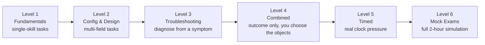

# Chapter 9 — CKAD Practice & Labs

Everything above this point was reference. Everything from here on is hands-on. **Attempt every task yourself in a real cluster (`kind`, `minikube`, or any sandbox) before reading the solution** — reading a solution without typing the commands yourself builds false confidence.

**⏱ Estimated time:** 6–9 hours total, spread across multiple sessions — this is the largest time investment in the guide, and deliberately so. Roughly: Level 1 (45–60 min), Level 2 (1–1.5 hrs), Level 3 (1–1.5 hrs), Level 4 (1.5–2 hrs), Level 5 (1–1.5 hrs), Level 6 (2 x ~2 hrs for the two mock exams).

## Learning Objectives

By the end of this chapter, you should be able to:

- Complete Level 1–2 fundamentals tasks from memory, without consulting Chapter 8.
- Diagnose and fix every Level 3 failure category using only `describe`/`logs`/`get endpoints` — no starting hint beyond the symptom.
- Decide, unprompted, which Kubernetes objects a Level 4 outcome-based task requires, the way the real exam expects.
- Finish Level 5 timed tasks at or under their stated time targets.
- Self-grade a full Level 6 mock exam at or above the 66% pass-proxy threshold.

**Progression:** Level 1 (Fundamentals) -> Level 2 (Configuration & Design) -> Level 3 (Troubleshooting) -> Level 4 (Combined) -> Level 5 (Timed) -> Level 6 (Full Mock Exams). Difficulty and ambiguity increase as you go — later levels intentionally withhold which resource or command to use, exactly like the real exam.



Each level removes a little more scaffolding: Level 1 tells you exactly which object and command to use, Level 4 only describes an outcome, and Level 6 gives you nothing but a 2-hour clock — exactly like exam day.

> **📚 Theory — why struggling first matters.** This is sometimes called "productive failure" or the generation effect: forcing yourself to attempt recall (even unsuccessfully) before seeing an answer builds a stronger, more durable memory trace than reading the answer first ever does — the retrieval attempt itself is what strengthens the neural pathway, not just exposure to the correct answer. It's the same reason flashcards work better than re-reading notes. Skipping straight to the solution below feels efficient in the moment and is measurably worse for retention under exam pressure three weeks later.

---

## Level 1 — Fundamentals

**⏱ Level time budget:** 45–60 minutes for all 8 tasks. These map directly to Chapter 0's core skills — if any task here takes more than double its target, revisit that chapter section before continuing.

### Task 1.1 — Create and label a Pod

- **Scenario:** A teammate needs a quick throwaway Pod to test an image before it's wired into a Deployment.
- **Namespace:** `default`
- **Starting State:** Empty cluster.
- **Time Target:** 3 minutes
- **Skills Tested:** Imperative Pod creation, labeling

**Task:** Create a Pod named `test-pod` running image `nginx:1.27` with label `env=test`. Verify the Pod is `Running` and carries the label.

**Verification:** `kubectl get pod test-pod --show-labels` shows `env=test`; `STATUS` is `Running`.

<details>
<summary>✅ Solution — reveal after attempting the task</summary>

```bash
kubectl run test-pod --image=nginx:1.27 --labels=env=test
kubectl get pod test-pod --show-labels
```
**Explanation:** `--labels` on `kubectl run` sets labels at creation time — no separate `label` command needed.

**Common Mistakes:** Using `kubectl create deployment` instead of `kubectl run` (creates a Deployment + ReplicaSet + Pod, not a bare Pod as asked); forgetting `--labels` and trying to add the label after with a typo'd key.

</details>

---

### Task 1.2 — Namespaces and default context

- **Namespace:** `billing` (to be created)
- **Time Target:** 3 minutes
- **Skills Tested:** Namespace creation, context switching

**Task:** Create a namespace called `billing`. Set your current context's default namespace to `billing`. Confirm any subsequent `kubectl get pods` (no `-n` flag) targets `billing`.

<details>
<summary>✅ Solution — reveal after attempting the task</summary>

```bash
kubectl create namespace billing
kubectl config set-context --current --namespace=billing
kubectl config view --minify | grep namespace:
```
**Common Mistakes:** Passing `-n billing` on every future command instead of switching the default — works, but wastes time across a whole exam.

</details>

---

### Task 1.3 — Label-based selection

- **Namespace:** `default`
- **Starting State:** Three Pods exist: `web-1` (labels `app=web,tier=frontend`), `web-2` (labels `app=web,tier=frontend`), `cache-1` (labels `app=cache,tier=backend`).
- **Time Target:** 3 minutes
- **Skills Tested:** Selectors, set-based queries

**Task:** Using a single `kubectl get pods` command, list only Pods where `tier` is `frontend`.

<details>
<summary>✅ Solution — reveal after attempting the task</summary>

```bash
kubectl get pods -l tier=frontend
```
**Common Mistakes:** Using `--field-selector` (for built-in fields like `status.phase`, not labels) instead of `-l`/`--selector` (for labels).

</details>

---

### Task 1.4 — Basic ConfigMap from literals

- **Namespace:** `default`
- **Time Target:** 4 minutes
- **Skills Tested:** ConfigMap creation and consumption as env vars

**Task:** Create a ConfigMap `app-settings` with `THEME=dark` and `TIMEOUT=30`. Create a Pod `settings-pod` (image `busybox`, command `sleep 3600`) that gets both values as environment variables.

**Verification:** `kubectl exec settings-pod -- env | grep -E 'THEME|TIMEOUT'`

<details>
<summary>✅ Solution — reveal after attempting the task</summary>

```bash
kubectl create configmap app-settings --from-literal=THEME=dark --from-literal=TIMEOUT=30
kubectl run settings-pod --image=busybox --command -- sleep 3600 --dry-run=client -o yaml > pod.yaml
```
Edit `pod.yaml` to add:
```yaml
    envFrom:
    - configMapRef:
        name: app-settings
```
```bash
kubectl apply -f pod.yaml
kubectl exec settings-pod -- env | grep -E 'THEME|TIMEOUT'
```
**Common Mistakes:** Forgetting `envFrom` pulls *every* key as an env var (fine here); confusing it with `env` + `configMapKeyRef` which pulls one named key at a time.

</details>

---

### Task 1.5 — Secret from literals, mounted as a volume

- **Namespace:** `default`
- **Time Target:** 5 minutes
- **Skills Tested:** Secret creation, volume mount

**Task:** Create a Secret `db-secret` with key `password=hunter2`. Mount it as a volume at `/etc/secret` in a Pod `secret-pod` (image `busybox`, command `sleep 3600`).

**Verification:** `kubectl exec secret-pod -- cat /etc/secret/password` prints `hunter2`.

<details>
<summary>✅ Solution — reveal after attempting the task</summary>

```bash
kubectl create secret generic db-secret --from-literal=password=hunter2
kubectl run secret-pod --image=busybox --command -- sleep 3600 --dry-run=client -o yaml > pod.yaml
```
Add to `pod.yaml`:
```yaml
    volumeMounts:
    - name: secret-vol
      mountPath: /etc/secret
  volumes:
  - name: secret-vol
    secret:
      secretName: db-secret
```
```bash
kubectl apply -f pod.yaml
kubectl exec secret-pod -- cat /etc/secret/password
```
**Common Mistakes:** Indenting `volumes:` under `containers:` instead of at the Pod `spec:` level — it's a sibling of `containers`, not a child.

</details>

---

### Task 1.6 — Expose a Deployment with a Service

- **Namespace:** `default`
- **Starting State:** None
- **Time Target:** 4 minutes
- **Skills Tested:** Deployment + Service basics

**Task:** Create a Deployment `hello` with image `nginx:1.27` and 2 replicas. Expose it internally on port 80, forwarding to container port 80.

**Verification:** `kubectl get endpoints hello` lists 2 IPs.

<details>
<summary>✅ Solution — reveal after attempting the task</summary>

```bash
kubectl create deployment hello --image=nginx:1.27 --replicas=2
kubectl expose deployment hello --port=80 --target-port=80
kubectl get endpoints hello
```

</details>

---

### Task 1.7 — kubectl explain fluency

- **Time Target:** 2 minutes
- **Skills Tested:** API discovery without external docs

**Task:** Without looking anything up, determine the exact YAML field path for setting a Pod's DNS policy, and the field for restart policy at the Pod level.

<details>
<summary>✅ Solution — reveal after attempting the task</summary>

```bash
kubectl explain pod.spec.dnsPolicy
kubectl explain pod.spec.restartPolicy
```
**Explanation:** `kubectl explain` returns the field's type and a description straight from the API schema — always available even with only official docs open, and often faster than searching them.

</details>

---

### Task 1.8 — Generate YAML instead of writing it

- **Time Target:** 3 minutes
- **Skills Tested:** `--dry-run=client -o yaml` habit

**Task:** Produce a YAML file `job.yaml` for a Job named `hasher` (image `busybox`, command `echo done`) without writing any YAML by hand.

<details>
<summary>✅ Solution — reveal after attempting the task</summary>

```bash
kubectl create job hasher --image=busybox --dry-run=client -o yaml -- echo done > job.yaml
cat job.yaml
```
**Common Mistakes:** Typing the Job manifest from memory when a one-line imperative command already produces a correct, valid skeleton.
\newpage

</details>

## Level 2 — Application Configuration & Design

**⏱ Level time budget:** 1–1.5 hours for all 8 tasks. These draw mainly on Chapters 1–2 — probes, ConfigMaps/Secrets, multi-container patterns, storage, and Jobs/CronJobs working together rather than in isolation.

### Task 2.1 — Deployment with resource requests/limits and scaling

- **Namespace:** `dev`
- **Time Target:** 5 minutes
- **Skills Tested:** Deployment, resources, scaling

**Task:** In namespace `dev` (create it first), deploy `api` (image `nginx:1.27`, 2 replicas) with CPU request `100m`/limit `250m` and memory request `128Mi`/limit `256Mi`. Then scale to 4 replicas.

<details>
<summary>✅ Solution — reveal after attempting the task</summary>

```bash
kubectl create namespace dev
kubectl create deployment api --image=nginx:1.27 --replicas=2 -n dev --dry-run=client -o yaml > api.yaml
```
Add under `spec.template.spec.containers[0]`:
```yaml
        resources:
          requests: {cpu: "100m", memory: "128Mi"}
          limits: {cpu: "250m", memory: "256Mi"}
```
```bash
kubectl apply -f api.yaml
kubectl scale deployment api --replicas=4 -n dev
kubectl describe deployment api -n dev | grep -A4 Limits
```

</details>

---

### Task 2.2 — Probes for a slow-starting app

- **Namespace:** `dev`
- **Time Target:** 6 minutes
- **Skills Tested:** startupProbe, livenessProbe, readinessProbe together

**Task:** Deployment `slow-app` (image `nginx:1.27`) takes up to 40 seconds to become ready. Configure a `startupProbe` (httpGet `/`, port 80, generous enough to tolerate 40s) so `livenessProbe` (httpGet `/`, port 80) doesn't kill it during startup, and a `readinessProbe` (tcpSocket, port 80).

<details>
<summary>✅ Solution — reveal after attempting the task</summary>

```yaml
startupProbe:
  httpGet: {path: /, port: 80}
  periodSeconds: 5
  failureThreshold: 10        # 5s x 10 = 50s runway before startup is declared failed
livenessProbe:
  httpGet: {path: /, port: 80}
  periodSeconds: 10
readinessProbe:
  tcpSocket: {port: 80}
  periodSeconds: 5
```
**Explanation:** `failureThreshold × periodSeconds` must exceed the app's real startup time, or the `startupProbe` itself fails and kills the container before it ever gets a chance to boot. Liveness/readiness are ignored entirely until the startup probe first succeeds.

**Common Mistakes:** Setting a long `initialDelaySeconds` on liveness instead of using a `startupProbe` — works for one fixed app but doesn't adapt if startup time varies.

</details>

---

### Task 2.3 — Multi-key ConfigMap + Secret combined

- **Namespace:** `dev`
- **Time Target:** 6 minutes
- **Skills Tested:** Mixed ConfigMap/Secret env consumption

**Task:** Create ConfigMap `db-config` (`DB_HOST=postgres`, `DB_PORT=5432`) and Secret `db-auth` (`DB_USER=app`, `DB_PASS=s3cret`). Create Pod `db-client` (image `busybox`, `sleep 3600`) that gets `DB_HOST`/`DB_PORT` from the ConfigMap via `envFrom` and `DB_PASS` specifically (only that one key) from the Secret via `env`.

<details>
<summary>✅ Solution — reveal after attempting the task</summary>

```bash
kubectl create configmap db-config --from-literal=DB_HOST=postgres --from-literal=DB_PORT=5432 -n dev
kubectl create secret generic db-auth --from-literal=DB_USER=app --from-literal=DB_PASS=s3cret -n dev
```
```yaml
containers:
- name: db-client
  image: busybox
  command: ["sleep", "3600"]
  envFrom:
  - configMapRef: {name: db-config}
  env:
  - name: DB_PASS
    valueFrom:
      secretKeyRef: {name: db-auth, key: DB_PASS}
```
**Common Mistakes:** Trying to selectively pull one ConfigMap key via `envFrom` (it always pulls all keys) — use `env`/`valueFrom` for a single key from either source.

</details>

---

### Task 2.4 — Init container gating app startup

- **Namespace:** `dev`
- **Time Target:** 6 minutes
- **Skills Tested:** Init containers, shared emptyDir

**Task:** Pod `web-init` has main container `web` (nginx) that must not start until a file `/data/ready` exists. Add an init container that creates that file on a volume shared with `web`.

<details>
<summary>✅ Solution — reveal after attempting the task</summary>

```yaml
spec:
  initContainers:
  - name: setup
    image: busybox
    command: ["sh", "-c", "touch /data/ready"]
    volumeMounts:
    - {name: shared, mountPath: /data}
  containers:
  - name: web
    image: nginx
    volumeMounts:
    - {name: shared, mountPath: /data}
  volumes:
  - name: shared
    emptyDir: {}
```
**Verify:** `kubectl exec web-init -c web -- cat /data/ready` (empty file, exists).

</details>

---

### Task 2.5 — Sidecar log shipper

- **Namespace:** `dev`
- **Time Target:** 7 minutes
- **Skills Tested:** Native sidecar pattern, shared volume, per-container logs

**Task:** Pod `app-with-sidecar` has a main container `app` (busybox, writes a timestamp to `/var/log/app/out.log` every 2 seconds in a loop) and a native sidecar `tailer` (busybox, runs `tail -f /var/log/app/out.log`) sharing the log directory via `emptyDir`.

<details>
<summary>✅ Solution — reveal after attempting the task</summary>

```yaml
spec:
  initContainers:
  - name: tailer
    image: busybox
    restartPolicy: Always
    command: ["sh", "-c", "tail -f /var/log/app/out.log"]
    volumeMounts:
    - {name: logs, mountPath: /var/log/app}
  containers:
  - name: app
    image: busybox
    command: ["sh", "-c", "while true; do date >> /var/log/app/out.log; sleep 2; done"]
    volumeMounts:
    - {name: logs, mountPath: /var/log/app}
  volumes:
  - name: logs
    emptyDir: {}
```
**Verify:** `kubectl logs app-with-sidecar -c tailer -f`

</details>

---

### Task 2.6 — PVC-backed storage for a database Pod

- **Namespace:** `dev`
- **Time Target:** 6 minutes
- **Skills Tested:** PVC creation and mounting

**Task:** Create a PVC `pg-data` requesting `2Gi`, `ReadWriteOnce`, using the cluster's default StorageClass. Mount it at `/var/lib/postgresql/data` in a Pod `pg` (image `postgres:16`, env `POSTGRES_PASSWORD=test`).

<details>
<summary>✅ Solution — reveal after attempting the task</summary>

```yaml
apiVersion: v1
kind: PersistentVolumeClaim
metadata: {name: pg-data, namespace: dev}
spec:
  accessModes: [ReadWriteOnce]
  resources: {requests: {storage: 2Gi}}
---
apiVersion: v1
kind: Pod
metadata: {name: pg, namespace: dev}
spec:
  containers:
  - name: pg
    image: postgres:16
    env: [{name: POSTGRES_PASSWORD, value: "test"}]
    volumeMounts:
    - {name: data, mountPath: /var/lib/postgresql/data}
  volumes:
  - name: data
    persistentVolumeClaim: {claimName: pg-data}
```
**Verify:** `kubectl get pvc pg-data -n dev` shows `Bound`.

</details>

---

### Task 2.7 — CronJob with concurrency control

- **Namespace:** `dev`
- **Time Target:** 5 minutes
- **Skills Tested:** CronJob fields

**Task:** Create a CronJob `cleanup` running every 5 minutes (image `busybox`, command `echo cleaning`), that must never run two instances concurrently, keeping only the last 2 successful job records.

<details>
<summary>✅ Solution — reveal after attempting the task</summary>

```bash
kubectl create cronjob cleanup --image=busybox --schedule="*/5 * * * *" -n dev --dry-run=client -o yaml -- echo cleaning > cj.yaml
```
Edit `spec`:
```yaml
spec:
  schedule: "*/5 * * * *"
  concurrencyPolicy: Forbid
  successfulJobsHistoryLimit: 2
```
```bash
kubectl apply -f cj.yaml
kubectl get cronjob cleanup -n dev
```

</details>

---

### Task 2.8 — Job with retries and a completion count

- **Namespace:** `dev`
- **Time Target:** 5 minutes
- **Skills Tested:** Job completions/parallelism/backoffLimit

**Task:** Create a Job `batch-work` (image `busybox`, command `echo processing`) that must run to 5 total successful completions, at most 2 in parallel, and give up after 3 failed attempts.

<details>
<summary>✅ Solution — reveal after attempting the task</summary>

```yaml
apiVersion: batch/v1
kind: Job
metadata: {name: batch-work, namespace: dev}
spec:
  completions: 5
  parallelism: 2
  backoffLimit: 3
  template:
    spec:
      restartPolicy: Never
      containers:
      - name: worker
        image: busybox
        command: ["echo", "processing"]
```
**Verify:** `kubectl get job batch-work -n dev` — `COMPLETIONS` reaches `5/5`.
\newpage

</details>

## Level 3 — Troubleshooting Labs

**⏱ Level time budget:** 1–1.5 hours for all 10 labs. Each lab gives you a broken manifest or cluster state. Diagnose using the workflow from Chapter 5 before reading the fix — resist jumping to the Fix section first, even when you're confident you already know the cause.

### Lab 3.1 — Pod won't schedule

- **Namespace:** `dev`
- **Time Target:** 4 minutes

**Starting State:**
```yaml
apiVersion: v1
kind: Pod
metadata: {name: big-pod, namespace: dev}
spec:
  containers:
  - name: app
    image: nginx
    resources:
      requests: {cpu: "32", memory: "128Gi"}
```
**Task:** The Pod has been `Pending` for several minutes. Diagnose and fix.

<details>
<summary>🔎 Diagnostic — reveal if needed</summary>

```bash
kubectl describe pod big-pod -n dev | grep -A5 Events
# Events: 0/3 nodes are available: 3 Insufficient cpu, 3 Insufficient memory.
```
</details>

<details>
<summary>✅ Fix — reveal after attempting the lab</summary>

The request is unreasonably large for any real node. Lower it to something the cluster can satisfy, e.g. `cpu: "250m"`, `memory: "256Mi"`, then re-apply.

**Common Mistakes:** Assuming a `Pending` Pod is a scheduler bug rather than checking Events first — Events name the exact resource shortfall.

</details>

---

### Lab 3.2 — CrashLoopBackOff from a bad command

- **Namespace:** `dev`
- **Time Target:** 4 minutes

**Starting State:**
```yaml
apiVersion: v1
kind: Pod
metadata: {name: crasher, namespace: dev}
spec:
  containers:
  - name: app
    image: busybox
    command: ["sh", "-c", "ech Hello"]
```
<details>
<summary>🔎 Diagnostic — reveal if needed</summary>

```bash
kubectl logs crasher -n dev --previous
# sh: ech: not found
```
</details>

<details>
<summary>✅ Fix — reveal after attempting the lab</summary>

Typo in the command — `ech` -> `echo`. Also add `sleep 3600` after, or the container will still exit immediately after a correct echo (exit 0, not a crash, but the Pod won't stay `Running` — clarify against the task's actual intent before assuming a long-running Pod is required).

**Common Mistakes:** Reading fresh `kubectl logs` (post-restart) instead of `--previous`, and seeing nothing useful because the container hasn't crashed yet on the new attempt.

</details>

---

### Lab 3.3 — ImagePullBackOff from a private registry

- **Namespace:** `dev`
- **Time Target:** 5 minutes

**Starting State:** A Deployment `private-app` references `registry.example.com/private-app:1.0`; no `imagePullSecrets` configured; a Secret `regcred` (type `kubernetes.io/dockerconfigjson`) already exists in the namespace.

<details>
<summary>🔎 Diagnostic — reveal if needed</summary>

```bash
kubectl describe pod -l app=private-app -n dev | grep -A5 Events
# Failed to pull image: unauthorized
```
</details>

<details>
<summary>✅ Fix — reveal after attempting the lab</summary>

```bash
kubectl patch deployment private-app -n dev -p '{"spec":{"template":{"spec":{"imagePullSecrets":[{"name":"regcred"}]}}}}'
```
**Common Mistakes:** Recreating the Secret when it already exists and is correctly typed — the actual missing piece is wiring `imagePullSecrets` into the Pod template, not the Secret itself.

</details>

---

### Lab 3.4 — Readiness probe misconfigured

- **Namespace:** `dev`
- **Time Target:** 5 minutes

**Starting State:**
```yaml
readinessProbe:
  httpGet: {path: /health, port: 8080}
  periodSeconds: 5
```
Pod stays `0/1 Ready` forever; the app actually listens on port `80` and its health path is `/healthz`.

<details>
<summary>🔎 Diagnostic — reveal if needed</summary>

```bash
kubectl describe pod <pod> -n dev | grep -A5 Events
kubectl exec <pod> -n dev -- wget -qO- localhost:80/healthz
```
</details>

<details>
<summary>✅ Fix — reveal after attempting the lab</summary>

correct both the port and the path:
```yaml
readinessProbe:
  httpGet: {path: /healthz, port: 80}
  periodSeconds: 5
```

</details>

---

### Lab 3.5 — Service with no endpoints (selector mismatch)

- **Namespace:** `dev`
- **Time Target:** 4 minutes

**Starting State:** Pods carry label `app: web-frontend`; Service selector is:
```yaml
selector:
  app: web
```
<details>
<summary>🔎 Diagnostic — reveal if needed</summary>

```bash
kubectl get endpoints web -n dev     # empty
kubectl get pods --show-labels -n dev
```
</details>

<details>
<summary>✅ Fix — reveal after attempting the lab</summary>

```bash
kubectl patch service web -n dev -p '{"spec":{"selector":{"app":"web-frontend"}}}'
```

</details>

---

### Lab 3.6 — Service with wrong targetPort

- **Namespace:** `dev`
- **Time Target:** 4 minutes

**Starting State:** Endpoints exist and look correct, but `curl` to the Service times out. Container listens on `8080`; Service:
```yaml
ports:
- port: 80
  targetPort: 8081
```
<details>
<summary>🔎 Diagnostic — reveal if needed</summary>

```bash
kubectl get endpoints web -n dev -o wide   # shows pod IPs with :8081 — wrong
kubectl exec <pod> -n dev -- netstat -tlnp  # confirms app is on 8080
```
</details>

<details>
<summary>✅ Fix — reveal after attempting the lab</summary>

`kubectl patch service web -n dev -p '{"spec":{"ports":[{"port":80,"targetPort":8080}]}}'`

</details>

---

### Lab 3.7 — ConfigMap key typo breaks Pod startup

- **Namespace:** `dev`
- **Time Target:** 4 minutes

**Starting State:** ConfigMap `app-config` has key `MODE`; Pod references `configMapKeyRef.key: Mode` (wrong case).

<details>
<summary>🔎 Diagnostic — reveal if needed</summary>

```bash
kubectl describe pod <pod> -n dev | grep -A5 Events
# CreateContainerConfigError: key Mode not found in ConfigMap app-config
```
</details>

<details>
<summary>✅ Fix — reveal after attempting the lab</summary>

Correct the key case to `MODE` in the Pod spec (Kubernetes keys are case-sensitive), then `kubectl apply` and, if it's a Deployment, no restart needed beyond the natural re-create; for a bare Pod, delete and recreate.

</details>

---

### Lab 3.8 — Deployment rollout stuck

- **Namespace:** `dev`
- **Time Target:** 5 minutes

**Starting State:** `kubectl set image deployment/web nginx=nginx:1.999` was run (tag doesn't exist).

<details>
<summary>🔎 Diagnostic — reveal if needed</summary>

```bash
kubectl rollout status deployment/web -n dev     # hangs
kubectl get rs -n dev -l app=web                 # new RS stuck at 0 ready
kubectl describe pod -l app=web -n dev | grep -A5 Events
```
</details>

<details>
<summary>✅ Fix — reveal after attempting the lab</summary>

```bash
kubectl rollout undo deployment/web -n dev
kubectl rollout status deployment/web -n dev
```

</details>

---

### Lab 3.9 — PVC stuck Pending

- **Namespace:** `dev`
- **Time Target:** 5 minutes

**Starting State:**
```yaml
spec:
  accessModes: [ReadWriteMany]
  storageClassName: fast-ssd
  resources: {requests: {storage: 10Gi}}
```
No StorageClass named `fast-ssd` exists in the cluster; the default StorageClass supports `ReadWriteOnce` only.

<details>
<summary>🔎 Diagnostic — reveal if needed</summary>

```bash
kubectl describe pvc <name> -n dev | grep -A5 Events
kubectl get storageclass
```
</details>

<details>
<summary>✅ Fix — reveal after attempting the lab</summary>

Use an existing StorageClass name (or omit `storageClassName` to use the cluster default) and drop to an accessMode the class actually supports:
```yaml
spec:
  accessModes: [ReadWriteOnce]
  resources: {requests: {storage: 10Gi}}
```

</details>

---

### Lab 3.10 — NetworkPolicy blocking required traffic

- **Namespace:** `dev`
- **Time Target:** 6 minutes

**Starting State:** A `default-deny-ingress` NetworkPolicy exists in `dev`. `frontend` Pods (label `app: frontend`) can no longer reach `backend` Pods (label `app: backend`, port `8080`) — this is unwanted; frontend->backend traffic should be allowed.

<details>
<summary>🔎 Diagnostic — reveal if needed</summary>

```bash
kubectl get networkpolicy -n dev
kubectl describe networkpolicy default-deny-ingress -n dev
```
</details>

<details>
<summary>✅ Fix — reveal after attempting the lab</summary>

add a narrow allow policy on top of the deny-all — don't remove the deny-all itself:
```yaml
apiVersion: networking.k8s.io/v1
kind: NetworkPolicy
metadata: {name: allow-frontend-to-backend, namespace: dev}
spec:
  podSelector: {matchLabels: {app: backend}}
  policyTypes: [Ingress]
  ingress:
  - from:
    - podSelector: {matchLabels: {app: frontend}}
    ports:
    - {protocol: TCP, port: 8080}
```
**Common Mistakes:** Deleting the deny-all policy entirely (over-corrects — reopens all traffic) instead of adding a specific allow rule beside it.
\newpage

</details>

## Level 4 — Combined CKAD Tasks

**⏱ Level time budget:** 1.5–2 hours for all 6 tasks. These describe an outcome, not a resource. Decide what to use yourself, exactly like the real exam — the "Skills Tested" line is there for your review afterward, not as a hint before you start.

### Task 4.1 — Externalize configuration for a running app

- **Namespace:** `shop`
- **Starting State:** A Deployment `catalog` (image `nginx:1.27`, 3 replicas) is already running and serving traffic through an existing Service `catalog` on port 80.
- **Time Target:** 10 minutes
- **Skills Tested:** ConfigMap, resource limits, Service verification, rollout

**Task:** The `catalog` app needs an environment variable `FEATURE_FLAGS=beta` sourced from configuration (not hardcoded in the Pod spec), and every container should have a CPU limit of `300m` and a memory limit of `256Mi`. After your change, confirm the application is still reachable through its existing Service with zero Pods ever fully down at once.

<div style="page-break-after: always;"></div>

<details>
<summary>✅ Solution — reveal after attempting the task</summary>

```bash
kubectl create configmap catalog-config --from-literal=FEATURE_FLAGS=beta -n shop
kubectl set resources deployment/catalog -n shop -c=nginx --limits=cpu=300m,memory=256Mi
kubectl set env deployment/catalog -n shop --from=configmap/catalog-config
kubectl patch deployment catalog -n shop -p '{"spec":{"strategy":{"rollingUpdate":{"maxUnavailable":0}}}}'
kubectl rollout status deployment/catalog -n shop
kubectl get endpoints catalog -n shop
```
**Explanation:** `maxUnavailable: 0` guarantees the Service always has at least the full replica count available during the rollout (relies on `maxSurge` to add capacity instead of removing it first).

**Common Mistakes:** Editing the ConfigMap but forgetting a rollout is required for env-var changes to reach running Pods (Chapter 1.1); setting `maxSurge: 0` and `maxUnavailable: 0` together, which makes a rollout impossible (nothing can be added or removed).

</details>

---

### Task 4.2 — Multi-container observability Pod

- **Namespace:** `shop`
- **Time Target:** 10 minutes
- **Skills Tested:** Multi-container patterns, volumes, logs

**Task:** Create a Pod where a main container continuously appends the current timestamp to a log file, and a second container makes that log's content available for inspection via `kubectl logs` on the second container, without the main container's image needing any log-shipping logic itself.

<details>
<summary>✅ Solution — reveal after attempting the task</summary>

(sidecar pattern with shared `emptyDir`, as in Task 2.5)
```yaml
apiVersion: v1
kind: Pod
metadata: {name: obs-pod, namespace: shop}
spec:
  initContainers:
  - name: sidecar
    image: busybox
    restartPolicy: Always
    command: ["sh", "-c", "tail -f /logs/app.log"]
    volumeMounts: [{name: logs, mountPath: /logs}]
  containers:
  - name: main
    image: busybox
    command: ["sh", "-c", "while true; do date >> /logs/app.log; sleep 5; done"]
    volumeMounts: [{name: logs, mountPath: /logs}]
  volumes:
  - name: logs
    emptyDir: {}
```
**Verify:** `kubectl logs obs-pod -c sidecar -f`

</details>

---

### Task 4.3 — Restrict and verify network access

- **Namespace:** `shop`
- **Starting State:** Pods labeled `app=payments` and `app=web` exist; currently any Pod can reach `payments` on port `9000`.
- **Time Target:** 10 minutes
- **Skills Tested:** NetworkPolicy design, verification

**Task:** Ensure only Pods labeled `app=web` can reach `payments` Pods on port `9000` — everything else should be blocked. Prove both the allow and the deny.

<details>
<summary>✅ Solution — reveal after attempting the task</summary>

```yaml
apiVersion: networking.k8s.io/v1
kind: NetworkPolicy
metadata: {name: payments-restrict, namespace: shop}
spec:
  podSelector: {matchLabels: {app: payments}}
  policyTypes: [Ingress]
  ingress:
  - from:
    - podSelector: {matchLabels: {app: web}}
    ports:
    - {protocol: TCP, port: 9000}
```
```bash
kubectl run web-test --image=busybox -l app=web -n shop --rm -it -- wget -qO- -T3 payments:9000    # should succeed
kubectl run other-test --image=busybox -n shop --rm -it -- wget -qO- -T3 payments:9000              # should time out
```
**Common Mistakes:** Writing a policy scoped to `app=web` (the source) with `policyTypes: [Egress]` instead of scoping it to `app=payments` (the destination) with `Ingress` — NetworkPolicies attach to the Pods they protect, not the Pods initiating traffic.

</details>

---

### Task 4.4 — Canary rollout of a new version

- **Namespace:** `shop`
- **Starting State:** `checkout` is running as a stable Deployment (5 replicas, image `myapp:1.0`) behind Service `checkout`.
- **Time Target:** 12 minutes
- **Skills Tested:** Canary pattern, Service selector design

**Task:** Introduce version `myapp:2.0` so it receives roughly 20% of `checkout`'s traffic, without touching the existing stable Deployment's rollout strategy, and without any downtime.

<details>
<summary>✅ Solution — reveal after attempting the task</summary>

(see Chapter 3.2 — canary via shared-label Service)
```yaml
apiVersion: apps/v1
kind: Deployment
metadata: {name: checkout-canary, namespace: shop}
spec:
  replicas: 1                       # 1 of (5+1)=6 total ≈ 17-20%
  selector: {matchLabels: {app: checkout, track: canary}}
  template:
    metadata: {labels: {app: checkout, track: canary}}
    spec: {containers: [{name: app, image: myapp:2.0}]}
```
Confirm the existing Service selects only `app: checkout` (no `track:` key) so it load-balances across both.
```bash
kubectl get svc checkout -n shop -o jsonpath='{.spec.selector}'
```
**Common Mistakes:** Adding `track: stable` as a required selector key on the Service — that would exclude the canary Pods entirely instead of including them.

</details>

---

### Task 4.5 — Scheduled cleanup with least-privilege access

- **Namespace:** `shop`
- **Time Target:** 12 minutes
- **Skills Tested:** CronJob, ServiceAccount, RBAC

**Task:** Create a recurring job (every hour) that lists Pods in the `shop` namespace using `kubectl` from inside the cluster. It must run under an identity that can only `get`/`list` Pods in that namespace — nothing else.

<details>
<summary>✅ Solution — reveal after attempting the task</summary>

```bash
kubectl create serviceaccount pod-lister -n shop
kubectl create role pod-lister-role --verb=get,list --resource=pods -n shop
kubectl create rolebinding pod-lister-binding --role=pod-lister-role --serviceaccount=shop:pod-lister -n shop
```
```yaml
apiVersion: batch/v1
kind: CronJob
metadata: {name: list-pods, namespace: shop}
spec:
  schedule: "0 * * * *"
  jobTemplate:
    spec:
      template:
        spec:
          serviceAccountName: pod-lister
          restartPolicy: Never
          containers:
          - name: lister
            image: bitnami/kubectl
            command: ["kubectl", "get", "pods", "-n", "shop"]
```
**Verify:**
```bash
kubectl auth can-i list pods --as=system:serviceaccount:shop:pod-lister -n shop     # yes
kubectl auth can-i delete pods --as=system:serviceaccount:shop:pod-lister -n shop   # no
```

</details>

---

### Task 4.6 — Hardened Pod security posture

- **Namespace:** `shop`
- **Time Target:** 8 minutes
- **Skills Tested:** SecurityContext, resource limits, probes together

**Task:** Deploy `worker` (image `myapp:1.0`) so that it cannot run as root, cannot escalate privileges, has all Linux capabilities dropped, runs with a read-only root filesystem (mount an `emptyDir` at `/tmp` for anything it needs to write), and reports unhealthy via a liveness probe on `/healthz` port `8080` if it locks up.

<details>
<summary>✅ Solution — reveal after attempting the task</summary>

```yaml
apiVersion: apps/v1
kind: Deployment
metadata: {name: worker, namespace: shop}
spec:
  replicas: 1
  selector: {matchLabels: {app: worker}}
  template:
    metadata: {labels: {app: worker}}
    spec:
      containers:
      - name: worker
        image: myapp:1.0
        securityContext:
          runAsNonRoot: true
          allowPrivilegeEscalation: false
          readOnlyRootFilesystem: true
          capabilities: {drop: ["ALL"]}
        livenessProbe:
          httpGet: {path: /healthz, port: 8080}
          periodSeconds: 10
        volumeMounts:
        - {name: tmp, mountPath: /tmp}
      volumes:
      - name: tmp
        emptyDir: {}
```

</details>

---

## Level 5 — Timed CKAD Tasks

Set a real timer. Stop at the target time whether finished or not, then review what slowed you down.

### Task 5.1 (3 min) — Scale a Deployment
Scale Deployment `web` in namespace `dev` to 6 replicas and confirm all are `Running`.
<details>
<summary>✅ Solution — reveal after attempting the task</summary>

```bash
kubectl scale deployment web -n dev --replicas=6
kubectl get pods -n dev -l app=web
```

</details>

### Task 5.2 (3 min) — Add a label to running Pods
Add label `tier=frontend` to every Pod with label `app=web` in namespace `dev`, without editing YAML files.
<details>
<summary>✅ Solution — reveal after attempting the task</summary>

```bash
kubectl label pods -l app=web tier=frontend -n dev
```

</details>

### Task 5.3 (5 min) — Create a Secret and inject one key
Create Secret `api-key` (`KEY=abc123`) in namespace `dev`, then patch existing Pod `worker` (assume it can be recreated) to expose it as env var `API_KEY`.
<details>
<summary>✅ Solution — reveal after attempting the task</summary>

```bash
kubectl create secret generic api-key --from-literal=KEY=abc123 -n dev
kubectl get pod worker -n dev -o yaml > worker.yaml
# add env: [{name: API_KEY, valueFrom: {secretKeyRef: {name: api-key, key: KEY}}}]
kubectl replace -f worker.yaml --force
```

</details>

### Task 5.4 (5 min) — Fix a failing readiness probe
Pod `flaky` in `dev` has `readinessProbe.httpGet.port: 9999`; the app listens on `8080`. Fix it.
<details>
<summary>✅ Solution — reveal after attempting the task</summary>

```bash
kubectl edit pod flaky -n dev     # correct port to 8080 (or patch --type=json if the field is immutable on a running Pod — delete/recreate if needed)
```

</details>

### Task 5.5 (5 min) — Roll back a bad deployment
Deployment `api` in `dev` was just updated to a broken image tag. Roll back to the previous working revision.
<details>
<summary>✅ Solution — reveal after attempting the task</summary>

```bash
kubectl rollout undo deployment/api -n dev
kubectl rollout status deployment/api -n dev
```

</details>

### Task 5.6 (8 min) — Wire a ConfigMap and prove it took effect
Create ConfigMap `feature-flags` (`NEW_UI=true`) in `dev`. Update Deployment `web` to consume it via `envFrom`, then prove the running Pods actually see the value (not just that the manifest was updated).
<details>
<summary>✅ Solution — reveal after attempting the task</summary>

```bash
kubectl create configmap feature-flags --from-literal=NEW_UI=true -n dev
kubectl set env deployment/web -n dev --from=configmap/feature-flags
kubectl rollout status deployment/web -n dev
kubectl exec -n dev deploy/web -- env | grep NEW_UI
```

</details>

### Task 5.7 (8 min) — Expose an app externally through Ingress
Deployment `store` and Service `store` (port 80) exist in `dev`. Add an Ingress routing `store.local/*` to it, assuming an `nginx` IngressClass is already installed.
<details>
<summary>✅ Solution — reveal after attempting the task</summary>

```bash
kubectl create ingress store-ing -n dev --class=nginx --rule="store.local/*=store:80"
kubectl get ingress store-ing -n dev
```

</details>

### Task 5.8 (10 min) — Diagnose and fix from a cold start
Given only "`checkout` in namespace `shop` is unreachable," find and fix the root cause with no other hints. (Practice this against a deliberately-broken lab you set up yourself, mixing any single fault from Level 3 — the value is in the diagnostic speed, not the specific fix.)
\newpage

## Level 6 — Full Mock Exams

Simulate real conditions: 2 hours, no notes beyond official docs, one sitting, no pausing between tasks. Weighting mirrors the real domain split.

### Mock Exam A (16 tasks, ~120 minutes)

1. *(Config/Security)* In namespace `mock-a`, create Secret `tls-secret` from a cert/key pair and reference it in a new Ingress `secure-ing` for host `app.local` terminating TLS.
2. *(Design/Build)* Create a StatefulSet `queue` (3 replicas, image `redis:7`) with a headless Service, each replica backed by a 1Gi PVC.
3. *(Deployment)* Deploy `api` at `myapp:1.0`, then perform a canary release of `myapp:1.1` receiving ~25% of traffic.
4. *(Observability)* `worker` Pod is `CrashLoopBackOff` — diagnose and fix (seed it yourself with a bad `command` for practice).
5. *(Networking)* Default-deny all ingress in `mock-a`, then allow only `app=api` to reach `app=db` on port 5432.
6. *(Config/Security)* Create a ResourceQuota capping `mock-a` at 10 Pods and 4 CPU requests total.
7. *(Design/Build)* Add an init container to `api` that waits for `db` to accept TCP connections on 5432 before `api` starts.
8. *(Deployment)* Roll back `api` to the revision before the canary was introduced; confirm only the stable version remains.
9. *(Observability)* Add a `startupProbe` and `livenessProbe` to `api` tuned for a 30-second worst-case boot time.
10. *(Networking)* `db` Service has no endpoints — diagnose and fix (seed a selector mismatch yourself for practice).
11. *(Config/Security)* Create ServiceAccount `ci-bot` that can only `get`/`list` Deployments in `mock-a`; verify with `auth can-i`.
12. *(Design/Build)* Create a CronJob running every 15 minutes that must never overlap and keeps only 1 failed job record.
13. *(Deployment)* Use Kustomize to overlay a `replicas: 5` patch onto a base Deployment manifest without editing the base.
14. *(Observability)* Identify and fix a Deployment using a deprecated `apiVersion`.
15. *(Networking)* Expose `api` via Ingress with two paths: `/` -> `web` Service, `/api` -> `api` Service.
16. *(Config/Security)* Harden `worker`'s Pod spec: non-root, no privilege escalation, all capabilities dropped, read-only root filesystem.

**Self-grade:** award yourself 1 point per fully-correct task; 66% (≈11/16) is a reasonable proxy for a passing effort — treat anything below that as a signal to revisit the corresponding chapter, not just the task.

---

### Mock Exam B (17 tasks, ~120 minutes)

1. *(Config/Security)* Create ConfigMap `settings` (3 keys) and Secret `creds` (2 keys); mount the ConfigMap as a volume and inject the Secret as individual env vars into Pod `combo`.
2. *(Design/Build)* Build a multi-container Pod: main app writes metrics to a shared volume, an adapter sidecar reformats them — no networking between the two, file-based only.
3. *(Deployment)* Perform a blue/green cutover: `web-blue` (`v1`) live, deploy `web-green` (`v2`), cut traffic over, then decommission blue.
4. *(Observability)* `Pending` Pod — diagnose and fix (seed an oversized resource request yourself).
5. *(Networking)* NetworkPolicy allowing `frontend` -> `backend` on 8080 only, denying everything else, in a previously fully-open namespace.
6. *(Config/Security)* Fix a Pod rejected by an admission policy requiring `runAsNonRoot: true`.
7. *(Design/Build)* Convert a single-replica Deployment into a DaemonSet with identical container spec.
8. *(Deployment)* Use Helm to install a chart, override 2 values, then roll back after a bad upgrade.
9. *(Observability)* Multi-container Pod: one container's logs are needed specifically, not the other's — retrieve only that container's log stream.
10. *(Networking)* `port`/`targetPort`/`containerPort` mismatch breaks a Service — diagnose and fix (seed it yourself).
11. *(Config/Security)* LimitRange enforcing a default CPU request of `100m` and max of `1` per container in a namespace.
12. *(Design/Build)* PVC stuck `Pending` due to a StorageClass typo — diagnose and fix (seed it yourself).
13. *(Deployment)* Pause a rollout mid-update, inspect both old and new ReplicaSets, then resume.
14. *(Observability)* Use `kubectl debug` to inspect a distroless container with no shell.
15. *(Networking)* Ingress returns 404 due to a `pathType`/`path` mismatch — diagnose and fix (seed it yourself).
16. *(Config/Security)* Role + RoleBinding scoped to `get pods/log` only (not full `get pods`) for a debugging ServiceAccount.
17. *(Deployment)* CronJob suspended (`suspend: true`) — resume it and confirm the next scheduled run appears.

**Self-grade:** same 66% proxy threshold. If Config/Security tasks are your weakest category across both mocks, that tracks with its 25% exam weight — prioritize Chapter 1 in your final revision pass.

---

**Exam Tips — Chapter 9**
- Always attempt a task cold before reading its solution — the struggle itself is what builds exam-day recall (see the productive-failure note above).
- In Level 3 and beyond, run the Chapter 5 diagnostic sequence (`get` → `describe` → `logs`) before forming a hypothesis, even when the symptom looks familiar — the exact cause still varies lab to lab.
- Track which category (Config/Security, Design/Build, Deployment, Observability, Networking) you consistently run over-time on across Level 5 and the two mocks — that's your signal for where to spend final revision time, not just your overall score.

## Chapter Summary

| Level | Focus | What "ready to move on" looks like |
|---|---|---|
| 1 — Fundamentals | Single-skill tasks | Completed without referencing Chapter 8 |
| 2 — Configuration & Design | Multi-field tasks | Probes, Config/Secrets, and multi-container patterns combined confidently |
| 3 — Troubleshooting | Diagnose from a symptom | Root cause found using `describe`/`logs` alone, no guessing |
| 4 — Combined | Outcome-only tasks | You chose the right objects yourself, unprompted |
| 5 — Timed | Real clock pressure | Consistently at or under each task's time target |
| 6 — Mock Exams | Full 2-hour simulation | Self-graded ≥66% on both Mock A and Mock B |

**Next:** Chapter 10 — CKAD Study & Exam Plan ties every chapter in this guide into one weight-proportional study schedule and a final exam-day checklist.
\newpage
