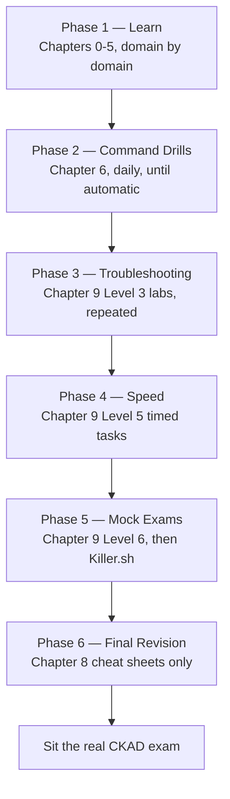

# Chapter 10 — CKAD Study & Exam Plan

This chapter ties every previous chapter into one schedule. It doesn't introduce new Kubernetes material — it tells you, in order, what to do with everything you've already learned.

**⏱ Estimated time:** 15–20 minutes to read through once. The plan itself isn't a one-sitting task — it spans your entire study window, from Phase 1 through exam day.

## Learning Objectives

By the end of this chapter, you should be able to:

- Locate exactly which phase of preparation you're in and what "done" looks like for it, at any point in your study.
- Allocate study time across domains in proportion to their exam weight, without guessing.
- Recite the exam-day habits below from memory, so they're automatic rather than something you're trying to recall mid-task.

## One Learning Path, Six Phases

Everything in this guide funnels into the same six phases, in the same order — there is no alternate "fast track" or "beginner track." Move quickly through a phase if the material is already familiar, but don't skip it.

## Phase-by-Phase Progression

| Phase | Focus | What "done" looks like |
|---|---|---|
| **1 — Learn** | Read Chapters 0–5 domain by domain | Can explain each competency's "why" without notes |
| **2 — Command Drills** | Chapter 6 daily, until typing is automatic | Generate any covered YAML skeleton in under 30 seconds |
| **3 — Troubleshooting** | Level 3 labs, repeated until diagnosis is instant | Identify the failure category from Events alone, before reading logs |
| **4 — Speed** | Level 5 timed tasks | Consistently finish at or under the stated time target |
| **5 — Mock Exams** | Level 6, full 2-hour sessions, then Killer.sh | For these 17-task mocks, aim for ≥12/17 fully verified tasks as a study proxy; then use Killer.sh for independent timed practice |
| **6 — Final Revision** | Chapter 8 cheat sheets only | Can reconstruct any cheat-sheet table from memory |

## How to Use Killer.sh

Killer.sh provides two CKAD simulator sessions, each with 17 scenarios and a 120-minute countdown, and is intended to be used as realistic exam-pressure practice. Its score should not be treated as a direct predictor of the real exam score. Many candidates find the simulator more demanding than the real exam, so a difficult simulator result is a signal to review and learn—not a reason to panic. ([Linux Foundation](https://training.linuxfoundation.org/certification/certified-kubernetes-application-developer-ckad/); [Killer.sh](https://killer.sh/ckad))

## Suggested Time Allocation (weight-proportional)

| Domain | Exam Weight | Suggested Share of Study Time |
|---|---|---|
| Application Environment, Configuration and Security | 25% | ~25% |
| Application Design and Build | 20% | ~20% |
| Application Deployment | 20% | ~20% |
| Services and Networking | 20% | ~20% |
| Application Observability and Maintenance | 15% | ~15% (but weight this higher early — it's the skill that unblocks every other domain) |

## Exam-Day Habits 🔴 MUST KNOW

- Confirm the namespace stated in every task before touching anything.
- Read the full task text before writing a single command — later sentences often specify verification criteria or a namespace you'd otherwise miss.
- Reuse and modify existing resources when a task says "update" — don't delete and recreate unless asked to.
- Verify after every change; a task with no verification step is still graded against the cluster's actual final state.
- If a task is taking far longer than its apparent weight justifies, flag it (exam UI supports this) and move on — return if time remains.
- Don't over-debug obvious configuration errors — check labels, ports, and key names before assuming a deeper platform issue.

## Final Readiness Self-Check

Before scheduling the real exam, confirm all of the following are true:

| Check | Where it was built |
|---|---|
| I can generate any common YAML skeleton in under 30 seconds without looking it up | Chapter 6 |
| I can diagnose a Pod/Service/Ingress/NetworkPolicy failure from its symptom alone | Chapter 5, Chapter 9 Level 3 |
| I finish Level 5 timed tasks at or under their target time | Chapter 9 Level 5 |
| I can complete at least 12/17 tasks on both Mock Exam A and Mock Exam B with every required condition verified | Chapter 9 Level 6 |
| I can reconstruct the Chapter 8 cheat sheets from memory | Chapter 8 |

If any row isn't true yet, that's your signal for where to spend the remaining study time — not a reason to delay scheduling indefinitely.

---

This is the final chapter of the guide. Everything from Chapter 0's object model through this phase plan forms one continuous path — there's nothing further to read except this guide's own reference material (Chapter 8) during your final revision pass.
\newpage
