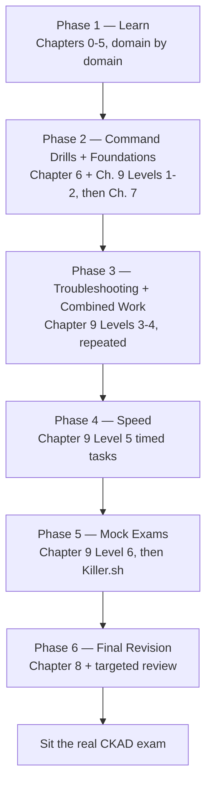

# Chapter 10 — CKAD Study & Exam Plan

This chapter ties every previous chapter into one schedule. It doesn't introduce new Kubernetes material — it tells you, in order, what to do with everything you've already learned, including the end-to-end integration in Chapter 7.

**⏱ Estimated time:** 15–20 minutes to read through once. The plan itself isn't a one-sitting task — it spans your entire study window, from Phase 1 through exam day.

> **Current exam baseline (verified September 2026).** The CKAD is an online, proctored, performance-based exam with **2 hours** to complete the tasks, and the current exam is based on **Kubernetes v1.35**. Use the current Linux Foundation exam page as the authority for any later exam-version or delivery changes. ([Linux Foundation](https://training.linuxfoundation.org/certification/certified-kubernetes-application-developer-ckad/))

## Learning Objectives

By the end of this chapter, you should be able to:

- Locate exactly which phase of preparation you're in and what "done" looks like for it, at any point in your study.
- Allocate study time across domains in proportion to their exam weight, without guessing.
- Recite the exam-day habits below from memory, so they're automatic rather than something you're trying to recall mid-task.

## One Learning Path, Six Phases

Everything in this guide funnels into the same six phases, in the same order — there is no alternate "fast track" or "beginner track." Move quickly through a phase if the material is already familiar, but don't skip it. Chapter 7 is the integration bridge between learning the individual domains and starting deliberate troubleshooting/speed practice. Chapter 9 Levels 1–2 build the fundamentals before Level 3, and Level 4 is the bridge into timed work.

## Where the Chapters Fit

| Chapter | Role in the plan |
|---|---|
| **0–5** | Learn the individual CKAD domains and core mental models |
| **6** | Turn common commands and generation patterns into muscle memory |
| **7** | Integrate the domains into one end-to-end application and practice predicting the next change |
| **8** | Fast-reference material used during practice and final revision |
| **9** | Progressive hands-on practice: fundamentals → troubleshooting → speed → full mocks |
| **10** | The schedule and readiness framework that tells you when to move between phases |

## Phase-by-Phase Progression

| Phase | Focus | What "done" looks like |
|---|---|---|
| **1 — Learn** | Read Chapters 0–5 domain by domain | Can explain each competency's "why" without notes |
| **2 — Command Drills + Foundations** | Chapter 6 daily, Chapter 9 Levels 1–2, then Chapter 7 | Commands are automatic; foundational tasks are reproducible from memory; you can build and explain the integrated example without notes |
| **3 — Troubleshooting + Combined Work** | Chapter 9 Levels 3–4, repeated | Choose the right diagnostic path from the symptom, then solve outcome-based tasks without being told the resource |
| **4 — Speed** | Level 5 timed tasks | Consistently finish at or under the stated time target |
| **5 — Mock Exams** | Level 6, full 2-hour sessions, then Killer.sh | Aim for ≥12/17 fully verified tasks as a study proxy on the course mocks; then use Killer.sh for independent timed practice |
| **6 — Final Revision** | Chapter 8 cheat sheets + targeted review of misses | Can reconstruct the key cheat-sheet patterns and explain the mistakes found in mocks/labs |

## How to Use Killer.sh

Killer.sh provides two CKAD simulator sessions, each with 17 scenarios and a 120-minute countdown, and is intended for realistic exam-pressure practice. Its score should not be treated as a direct predictor of the real exam score. The simulator's own guidance recommends using the first session to learn from the solutions, then using the second session after further study. ([Killer.sh](https://killer.sh/ckad); [Killer.sh FAQ](https://killer.sh/faq))

## Suggested Time Allocation (weight-proportional)

| Domain | Exam Weight | Suggested Share of Study Time |
|---|---|---|
| Application Environment, Configuration and Security | 25% | ~25% |
| Application Design and Build | 20% | ~20% |
| Application Deployment | 20% | ~20% |
| Services and Networking | 20% | ~20% |
| Application Observability and Maintenance | 15% | ~15% (but weight this higher early — it's the skill that unblocks every other domain) |

## Exam-Day Habits 🔴 MUST KNOW

- Confirm the namespace stated in every task before touching anything.
- Read the full task text before writing a single command — later sentences often specify verification criteria or a namespace you'd otherwise miss.
- Reuse and modify existing resources when a task says "update" — don't delete and recreate unless asked to.
- Verify after every change; a task with no verification step is still graded against the cluster's actual final state.
- If a task is taking far longer than its apparent difficulty justifies, move on and return to it if time remains; use the exam interface's navigation controls as provided.
- Don't over-debug obvious configuration errors — check labels, ports, and key names before assuming a deeper platform issue.

## Final Readiness Self-Check

Before scheduling the real exam, confirm all of the following are true:

| Check | Where it was built |
|---|---|
| I can generate any common YAML skeleton in under 30 seconds without looking it up | Chapter 6 |
| I can diagnose a Pod/Service/Ingress/NetworkPolicy failure from its symptom alone | Chapter 5, Chapter 9 Level 3 |
| I finish Level 5 timed tasks at or under their target time | Chapter 9 Level 5 |
| I can complete at least 12/17 fully verified tasks on at least two independent Level 6 mocks, with the remaining mock used as additional confirmation | Chapter 9 Level 6 |
| I can reconstruct the Chapter 8 cheat sheets from memory | Chapter 8 |

If any row isn't true yet, use the gap to decide what to review and re-practice before scheduling the exam. The checklist is a study aid, not a guarantee of exam performance.

---

This is the final chapter of the guide. Everything from Chapter 0's object model through Chapter 7's integration example feeds into the practice and revision phases above. During the final pass, Chapter 8 is the compact reference; return to earlier chapters only to repair a demonstrated knowledge gap.
\newpage
