# CKAD Quick-Read Notes

## Contents

1. [Core Concepts & Workload Resources](#1-core-concepts--workload-resources)
2. [Pod Design](#2-pod-design) (multi-container Pods, init/ephemeral containers, lifecycle hooks)
3. [Configuration](#3-configuration) (command/args, ConfigMaps, Secrets, resources)
4. [Security & Kubernetes Extensions](#4-security--kubernetes-extensions) (ServiceAccounts, RBAC, admission, SecurityContext, CRDs)
5. [Storage & State Persistence](#5-storage--state-persistence)
6. [Application Deployment](#6-application-deployment) (strategies, Helm, Kustomize)
7. [Observability & Application Maintenance](#7-observability--application-maintenance)
8. [Services & Networking](#8-services--networking)
9. [Troubleshooting](#9-troubleshooting)
10. [Final CKAD Revision Sheet](#10-final-ckad-revision-sheet) (commands, confused concepts, traps, checklist)

## Scope

These notes follow the official CKAD curriculum (Kubernetes **v1.35** per the Linux Foundation CKAD page). The exam environment is aligned with the newest Kubernetes minor version within roughly 4-8 weeks of its release, so re-check the version on the LF/CNCF pages before your exam.

| Domain | Weight | Where in these notes |
|---|---:|---|
| Application Design and Build | 20% | Ch. 1, 2, 5 |
| Application Deployment | 20% | Ch. 6 |
| Application Observability and Maintenance | 15% | Ch. 7, 9 |
| Application Environment, Configuration and Security | 25% | Ch. 3, 4 |
| Services and Networking | 20% | Ch. 8 |

Chapter 10 is the revision sheet (with common exam traps).

The notes are application-developer focused. CKA-only administration (control-plane upgrades, etcd backup/restore, cluster bootstrapping) is excluded. If a task reads like a Linux sysadmin task (kernel modules, swap, certificate rotation on the control plane), it almost certainly belongs to CKA, not CKAD.

### Exam format at a glance

- Performance-based and proctored: you solve tasks in a live terminal, not multiple-choice questions.
- Duration is about 2 hours with a 66% passing score. Confirm the current numbers in the Linux Foundation candidate handbook.
- Tasks carry different weights. Do quick, high-weight tasks first and flag the long ones.
- The official Kubernetes (and Helm) documentation sites are available during the exam. Learn where things live (`NetworkPolicy`, `PersistentVolume`, `kubectl` cheat sheet) so you can copy YAML fast.
- Check the task’s **context** and **namespace** first. Set the required context and namespace before making changes.
- The official domain list is maintained in the CNCF curriculum repository (`github.com/cncf/curriculum`).

## How to use these notes

Read each topic as:

**What it is → key idea → example → commands → ⚡ Remember.**

Do not memorize every YAML line. Learn the fields a task is likely to make you change, and use `kubectl explain` for the rest. The exam is **performance-based**: speed of generation and diagnosis matters as much as definitions.

**Suggested study loop:** read a section → work through its example on a real cluster when practical → use the Final CKAD Revision Sheet for review → run mock questions under a timer.

Diagrams are Mermaid. If your viewer does not render Mermaid, each diagram is followed by (or sits next to) a text explanation.

### Speed patterns that save minutes

These four habits alone typically recover 10-15 minutes over a 2-hour exam:

1. Always start a task by confirming the **context** and **namespace** (see the recap on the [Final CKAD Revision Sheet](#10-final-ckad-revision-sheet)).
2. Generate YAML with `kubectl ... --dry-run=client -o yaml` and edit the few fields that matter.
3. After every `apply`, **verify** with `get` / `describe` / `logs` / `auth can-i`; do not move on assuming it worked.
4. Use `kubectl explain <resource>.<field>` for any field you cannot type from memory.

---

# 1. Core Concepts & Workload Resources

## 1.1 Kubernetes architecture

### What it is

A Kubernetes cluster has a **control plane** that manages desired state and **worker nodes** that run workloads.

### Key components

- **kube-apiserver** - API entry point used by `kubectl` and other clients.
- **etcd** - stores Kubernetes cluster state.
- **kube-scheduler** - chooses a node for unscheduled Pods.
- **controller-manager** - runs controllers that reconcile desired and actual state.
- **kubelet** - node agent that manages Pods assigned to the node.
- **container runtime** - runs containers (via the Container Runtime Interface, e.g. containerd, CRI-O).
- **kube-proxy** - supports Service networking on nodes.

Two add-ons run in almost every cluster: **CoreDNS** (Service DNS names) and a **CNI plugin** (Pod networking).

### Example

A Deployment is submitted to the API server. The desired state is stored, the Deployment/ReplicaSet controllers create Pods, the scheduler selects nodes, and kubelets start the containers.

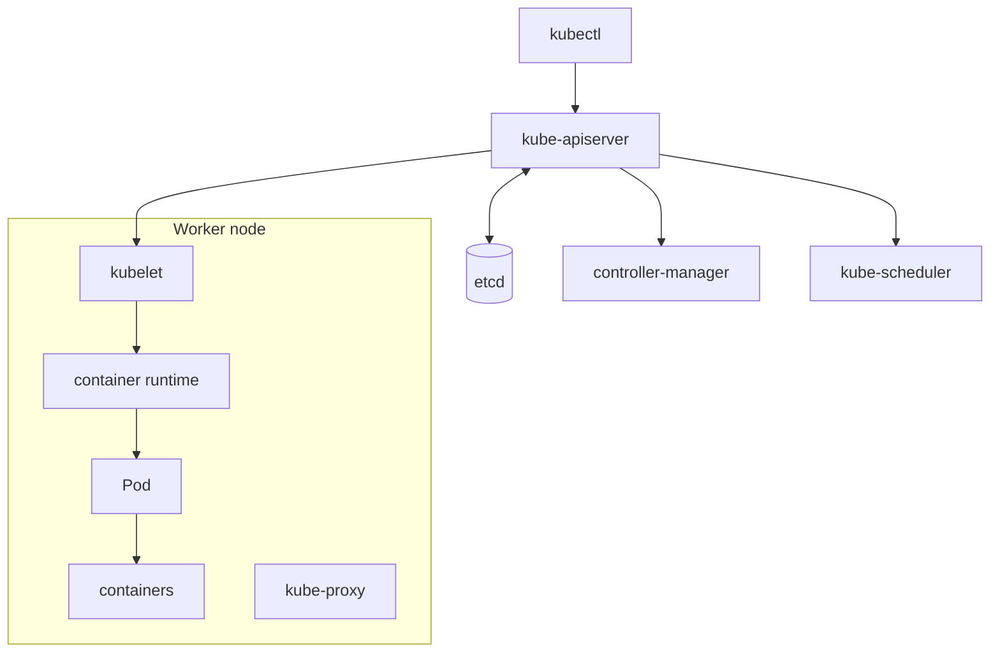

Every component talks to the API server; only the API server talks to etcd.

### ⚡ Remember

**API server = entry point**  
**etcd = state**  
**scheduler = placement**  
**controllers = reconciliation**  
**kubelet = node execution**

---

## 1.2 Container runtime: Docker vs containerd

The container runtime runs containers on a node. Kubernetes uses the **Container Runtime Interface (CRI)** to communicate with a compatible runtime.

Modern Kubernetes commonly uses runtimes such as containerd or CRI-O. Docker Engine is not itself the CRI runtime Kubernetes directly expects by default.

### Why it matters

The kubelet does not start containers itself; it asks a runtime through the CRI. Kubernetes removed its built-in Docker bridge (`dockershim`) in v1.24, so nodes now run **containerd** or **CRI-O** directly. Images are still standard OCI images, so an image built with `docker build` or `podman build` runs the same way on any of them.

| Task | Docker/Podman (your workstation) | Node runtime (containerd / CRI-O) |
|---|---|---|
| Build an image | `docker build` / `podman build` | Not the runtime's job |
| List containers | `docker ps` | `crictl ps` |
| List images | `docker images` | `crictl images` |
| Container logs | `docker logs` | `crictl logs <id>` |

`crictl` is a node-level debugging tool. In CKAD you almost always use `kubectl logs`/`describe` instead.

### ⚡ Remember

For CKAD, know the concept; do not spend study time on CKA-level runtime administration.

---

## 1.3 Pods

### What it is

A **Pod is the smallest deployable unit in Kubernetes**. A Pod contains one or more containers that share the Pod network namespace and can share volumes.

### Example

```yaml
apiVersion: v1
kind: Pod
metadata:
  name: nginx
spec:
  containers:
    - name: nginx
      image: nginx:1.27
```

Create and inspect:

```bash
kubectl apply -f pod.yaml
kubectl get pod nginx
kubectl describe pod nginx
kubectl logs nginx
```

### Important behavior

- Containers in one Pod share the same network namespace.
- They can normally communicate through `localhost`.
- A Pod gets a Pod IP, but that IP is not a stable application endpoint.
- Pods are ephemeral; controllers normally recreate them when necessary.

### ⚡ Remember

**Pod = shared execution boundary for one or more tightly coupled containers.**

## 1.4 YAML resource structure

Most Kubernetes manifests follow this shape:

```yaml
apiVersion: v1
kind: Pod
metadata:
  name: web
spec:
  containers:
    - name: nginx
      image: nginx
```

### Fields

| Field | Purpose |
|---|---|
| `apiVersion` | API version used by the resource |
| `kind` | Resource type |
| `metadata` | Name, namespace, labels, annotations |
| `spec` | Desired configuration |

### `apiVersion` rule

The core API group uses:

```yaml
apiVersion: v1
```

Named API groups use:

```yaml
apiVersion: apps/v1
apiVersion: batch/v1
apiVersion: networking.k8s.io/v1
```

Do **not** write `core/v1` in a normal manifest.

### ⚡ Remember

**What resource? -> what name? -> what desired configuration?**

---

## 1.5 Namespaces

Namespaces provide logical separation for namespaced resources.

### Example

```bash
kubectl create namespace dev
kubectl run web --image=nginx -n dev
kubectl get pods -n dev
```

The same resource name can exist in different namespaces:

```text
dev/web
prod/web
```

### Built-in namespaces

| Namespace | Purpose |
|---|---|
| `default` | Where objects go when you do not specify a namespace |
| `kube-system` | Cluster components (CoreDNS, kube-proxy, ...): look, do not edit |
| `kube-public` | Readable by everyone; rarely used |
| `kube-node-lease` | Node heartbeat (Lease) objects |

### What is (and is not) namespaced

Pods, Deployments, Services, ConfigMaps, Secrets, PVCs, Roles and NetworkPolicies live **inside** a namespace. Nodes, PersistentVolumes, StorageClasses, Namespaces, ClusterRoles and CRDs are **cluster-scoped**.

```bash
kubectl api-resources --namespaced=true     # namespaced kinds
kubectl api-resources --namespaced=false    # cluster-scoped kinds
kubectl config set-context --current --namespace=dev   # stop typing -n dev
kubectl delete namespace dev                # deletes EVERYTHING inside it
```

A Service in another namespace is reached as `<service>.<namespace>` (see Service discovery in Chapter 8). ConfigMaps and Secrets cannot be referenced across namespaces.

### Why namespaces exist

Three practical reasons shape almost every CKAD task that involves namespaces:

- **Multi-tenancy.** Several teams or environments share a cluster; namespaces give each a separate name and RBAC scope. `dev` and `prod` are typical names in the exam.
- **Resource isolation.** `LimitRange` and `ResourceQuota` apply per namespace (see [§3.9 LimitRange](#39-limitrange) and [§3.10 ResourceQuota](#310-resourcequota)), so you can let `dev` consume a lot and cap `prod`.
- **Name uniqueness.** Two namespaces can both contain a `web` Service without conflict; the *fully qualified* name (`web.dev.svc.cluster.local`) is unique cluster-wide.

### DNS suffix per namespace

The namespace name is also a DNS suffix. From any Pod:

```text
<service>             # same namespace
<service>.<namespace> # any namespace (recommended for clarity)
<service>.<ns>.svc.cluster.local   # fully qualified
```

So a Pod in `dev` calling `db.prod` resolves to the `db` Service in `prod`, not a same-namespace `db` even if one exists. The `search` path in the Pod's `/etc/resolv.conf` lists the current namespace first, then `svc.cluster.local`, which is why the short name works inside the same namespace.

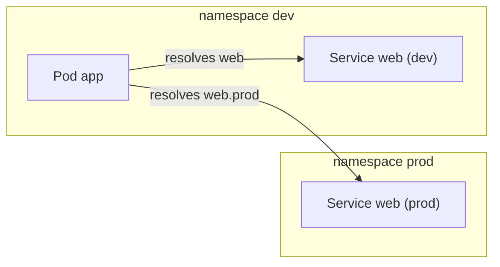

### Default namespace gotcha

If a task says "in the `dev` namespace" and you forget `-n dev`, the object is created in `default` and most tasks silently fail verification. Two habits that prevent this:

```bash
kubectl config set-context --current --namespace=dev   # one-shot, saves -n on every command
kubectl get pods --all-namespaces                       # when unsure where something lives
```

### Common mistakes

- Creating a `NetworkPolicy` or `ResourceQuota` in `default` and expecting it to apply to `dev`. Namespaces are hard walls for these objects.
- Deleting a namespace to "clean up". `kubectl delete namespace dev` deletes **every** object inside it (Pods, Services, Secrets, PVCs, RBAC, ...) and is irreversible. Use a prefix or a label to scope cleanup, or delete the workload objects first.
- Setting `-n` on the *create* command but forgetting it on the *verify* command. The most common CKAD mistake: `kubectl create` ran in `dev`, then `kubectl get pods` (no `-n`) returns an empty list, looks like failure.
- Treating namespaces as a security boundary by themselves. They are a *name* boundary; isolation is provided by `NetworkPolicy`, `ResourceQuota`, and `RBAC` on top of them.

### Every namespace auto-gets a label

Since Kubernetes 1.22, every namespace automatically carries a label `kubernetes.io/metadata.name=<namespace-name>`. This is the canonical way to refer to a namespace from a `NetworkPolicy.namespaceSelector` (see [§8.9 NetworkPolicies](#89-networkpolicies)) and from elsewhere; do not invent a custom label when this one already exists.

### ⚡ Remember

Always know which namespace the task is using. `-n <namespace>` is often the difference between changing the right object and the wrong one.

## 1.6 Labels, selectors and annotations

### Labels

Labels are key-value metadata used for grouping and selection.

```yaml
metadata:
  labels:
    app: web
    version: blue
```

### Selectors

Selectors choose objects by labels.

```yaml
selector:
  matchLabels:
    app: web
```

For controllers such as Deployments, the selector must match the labels on the Pod template.

### `matchExpressions`

For more flexible selection:

```yaml
matchExpressions:
  - key: environment
    operator: In
    values: [dev, stage]
```

### Annotations

Annotations store metadata that is not normally used for selection.

```yaml
annotations:
  description: "frontend application"
```

### Useful commands

```bash
kubectl get pods --show-labels
kubectl get pods -l app=web
kubectl label pod web version=blue
kubectl annotate pod web owner=platform
```

### ⚡ Remember

**Labels identify. Selectors select. Annotations add descriptive metadata.**

| | Used for | Selectable? |
|---|---|---|
| Label | Identify/group objects | Yes |
| Selector | Pick objects by labels (Service, Deployment, NetworkPolicy, `-l`) | - |
| Annotation | Non-identifying metadata (owner, change-cause, tool config) | No |

### Common selector mistakes

- The Deployment `selector.matchLabels` is **immutable**. Changing it after creation forces a delete/recreate; the safer path is to create a new Deployment with a new name and delete the old one.
- `kubectl apply` rejects a Pod template whose labels do not include the selector's matchLabels. Always start from `kubectl create ... --dry-run=client -o yaml`.
- A Service with no matching Pods shows `Endpoints: <none>`, not an error. Verify Pod labels with `kubectl get pods --show-labels`.
- A label is a key and a **string value**. `kubectl get pods -l 'env in (dev,qa)'` works; `--field-selector` is for fields, not labels.

## 1.7 ReplicaSets

A ReplicaSet maintains a specified number of matching Pods.

```yaml
apiVersion: apps/v1
kind: ReplicaSet
metadata:
  name: web-rs
spec:
  replicas: 3
  selector:
    matchLabels:
      app: web
  template:
    metadata:
      labels:
        app: web
    spec:
      containers:
        - name: nginx
          image: nginx:1.27
```

### How it works

A ReplicaSet counts the Pods that match its **label selector**, not the Pods it created. If fewer than `replicas` match it creates more; if more match it deletes extras. A stray Pod carrying the label `app: web` is therefore adopted and counted.

```bash
kubectl apply -f rs.yaml
kubectl delete pod <one-of-the-pods>     # a replacement appears within seconds
kubectl scale rs web-rs --replicas=5
```

A ReplicaSet has no update strategy: changing its Pod template does not replace running Pods, only Pods created afterwards. That gap is why you normally use a **Deployment**, which creates a new ReplicaSet for each template change and shifts replicas between the old and new ones.

### Why CKAD still asks about ReplicaSets

The Deployment API hides ReplicaSets, but a Deployment's *rollout* is implemented as two ReplicaSets. When something goes wrong:

- A Deployment appears stuck at 2/3 replicas -> one of its ReplicaSets is failing. Run `kubectl describe rs <name>`; quota and PodSecurity rejections land here, **not** on the Deployment.
- An old ReplicaSet lingers after `rollout undo` -> it is being held for the revision history limit, not broken.
- A `kubectl delete rs` is rejected while owned Pods exist -> ReplicaSets own their Pods and refuse to be deleted until the Pods are gone (use `--cascade=orphan` to keep Pods).

### Common mistakes

- The ReplicaSet's `spec.selector` is **immutable**. You cannot add a label to widen the match; you have to delete and recreate the ReplicaSet (and the Pods it owns).
- A Deployment's `spec.selector` must match its Pod template's labels, but the *ReplicaSet's* selector is also fixed once the Deployment is created. Changing a Pod template label in a Deployment is rejected by `kubectl apply` for the same reason.
- A manually created Pod that happens to carry the ReplicaSet's labels is **adopted**: when the ReplicaSet sees fewer than `replicas` matching Pods, it counts the orphan and does not create a replacement until one of its own Pods dies. This is the right behavior, but it can look like "the ReplicaSet did not honor `replicas`."

### ⚡ Remember

**ReplicaSet = keep N matching Pods available.**

In normal application deployments, a Deployment manages the ReplicaSet for you (see the relationship diagram in the [workload decision table](#116-workload-relationships-and-decision-table)).

## 1.8 Deployments

A Deployment manages replicated stateless application Pods and supports controlled updates.

### Example

```yaml
apiVersion: apps/v1
kind: Deployment
metadata:
  name: web
spec:
  replicas: 3
  selector:
    matchLabels:
      app: web
  template:
    metadata:
      labels:
        app: web
    spec:
      containers:
        - name: nginx
          image: nginx:1.27
```

### Useful commands

```bash
kubectl create deployment web --image=nginx:1.27 --replicas=3 --dry-run=client -o yaml > deploy.yaml
kubectl get deploy,rs,pods -l app=web
kubectl scale deployment web --replicas=5
kubectl rollout status deployment/web
kubectl rollout history deployment/web
kubectl rollout undo deployment/web --to-revision=2
kubectl rollout pause deployment/web
kubectl rollout resume deployment/web
kubectl rollout restart deployment/web
```

The Deployment `selector.matchLabels` must match `template.metadata.labels`, and the selector cannot be changed after creation. Two more fields that affect a rollout:

- `spec.progressDeadlineSeconds` (default `600`): if the Deployment cannot make progress (e.g. a new ReplicaSet never reaches Ready) for that long, the rollout is marked `False` with `ProgressDeadlineExceeded` in events.
- `spec.revisionHistoryLimit` (default `10`): how many old ReplicaSets to keep so `rollout undo` can return to them. Older revisions are garbage-collected.

### Common mistakes

- Editing a Deployment's `spec.selector.matchLabels`. The selector is immutable; `kubectl apply` rejects the change. Create a new Deployment with a new name if you really need to change the match.
- Scaling a Deployment (`--replicas=N`) does **not** create a new revision. Only changes to the Pod template do. `kubectl rollout history` will not show scale changes.
- Forgetting that a failed `rollout` leaves the Deployment in a half-upgraded state: the new ReplicaSet exists, the old one is still around, and the next `rollout` command (including `rollout undo`) replaces the bad ReplicaSet. Check `kubectl describe deploy` for `Progressing: False` and the reason.
- `kubectl rollout restart` creates a new revision **without** changing the template. Use it to pick up new ConfigMap/Secret env values (the env was frozen at process start).

### ⚡ Remember

**Deployment = desired replicas + controlled application updates.**

## 1.9 DaemonSets

A DaemonSet ensures that a Pod runs on nodes that match its scheduling requirements, commonly one Pod per eligible node.

Typical uses:

- log collection agents
- node monitoring agents
- node-level networking components

### Example

```yaml
apiVersion: apps/v1
kind: DaemonSet
metadata:
  name: node-agent
spec:
  selector:
    matchLabels:
      app: node-agent
  template:
    metadata:
      labels:
        app: node-agent
    spec:
      containers:
        - name: agent
          image: busybox:1.36
          command: ["sh", "-c", "while true; do echo agent on $(hostname); sleep 30; done"]
```

```bash
kubectl get ds node-agent
kubectl get pods -l app=node-agent -o wide   # one Pod per eligible node
```

To also run on tainted nodes (for example control-plane nodes), add a matching `tolerations` entry in the Pod template.

```yaml
spec:
  template:
    spec:
      tolerations:
        - key: node-role.kubernetes.io/control-plane
          effect: NoSchedule
        - key: node-role.kubernetes.io/master
          effect: NoSchedule
```

### YAML generation shortcut

If speed matters, one practical approach is to generate a Deployment manifest and adapt it carefully:

```bash
kubectl create deployment node-agent --image=busybox:1.36 --dry-run=client -o yaml > ds.yaml
```

Then change `kind` to `DaemonSet`, remove Deployment-only fields such as `replicas`, `strategy` and `status`, and ensure the selector/template labels remain correct. (There is no `kubectl create daemonset`.)

### ⚡ Remember

**Deployment -> desired number of replicas.**  
**DaemonSet -> workload on eligible nodes.**

## 1.10 Jobs

A Job runs work to completion.

### Example

```yaml
apiVersion: batch/v1
kind: Job
metadata:
  name: report
spec:
  completions: 1
  parallelism: 1
  backoffLimit: 3
  template:
    spec:
      restartPolicy: Never
      containers:
        - name: report
          image: busybox:1.36
          command: ["sh", "-c", "echo report-generated"]
```

### Important fields

| Field | Meaning |
|---|---|
| `completions` | Successful Pod completions required |
| `parallelism` | Maximum Pods running at once |
| `backoffLimit` | Retry limit for failed Pods |
| `activeDeadlineSeconds` | Overall execution deadline |
| `ttlSecondsAfterFinished` | Optional cleanup time after completion |

### Imperative

```bash
kubectl create job report --image=busybox:1.36 -- echo report-generated
kubectl get job report
kubectl logs job/report
```

Job Pods must use `restartPolicy: Never` or `OnFailure`. With `Never`, each retry creates a new Pod; with `OnFailure`, the same Pod's container is restarted.

### Common Job shapes

| Goal | Settings |
|---|---|
| One task | `completions: 1`, `parallelism: 1` (the defaults) |
| Run 5 tasks, 2 at a time | `completions: 5`, `parallelism: 2` |
| Parallel workers that coordinate themselves | `parallelism: N`, `completions` unset; the Job completes when a Pod succeeds and all Pods have terminated |
| Fail fast | `backoffLimit: 0` and/or `activeDeadlineSeconds: 60` |

#### Work-queue pattern (parallel workers, completion via success)

When the application decides when it has finished (for example it consumed all queue items), set `completions` unset and `parallelism` to the desired worker count. The Job completes when **any** Pod succeeds and **all** Pods have terminated:

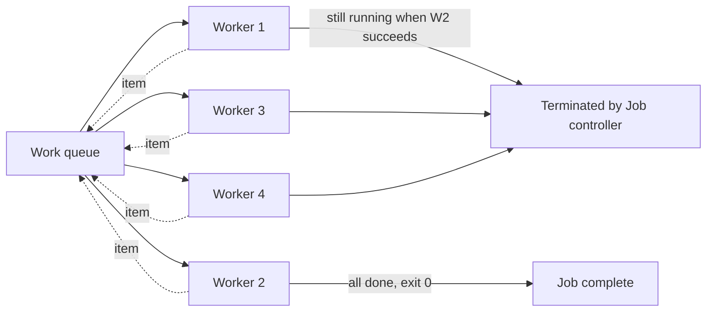

```yaml
apiVersion: batch/v1
kind: Job
metadata:
  name: queue-workers
spec:
  parallelism: 4
  completions: unset
  backoffLimit: 3
  template:
    spec:
      restartPolicy: OnFailure
      containers:
        - name: worker
          image: busybox:1.36
          command: ["sh", "-c", "process items until queue empty; exit 0"]
```

This is the standard pattern when the work is "process N items, any worker can pick any item."

When a Job fails, `kubectl describe job <n>` shows the reason: `BackoffLimitExceeded` (too many failed Pods) or `DeadlineExceeded` (ran past `activeDeadlineSeconds`). Read the Pod logs with `kubectl logs job/<n>` or `kubectl logs <pod>`.

### Common mistakes

- A Job's Pod template **must** set `restartPolicy: Never` or `OnFailure`. `Always` is rejected on creation. With `Never`, each retry uses a new Pod; with `OnFailure`, the same Pod is restarted and keeps its identity.
- `backoffLimit` counts Pods, not application attempts. A Pod that retries its container six times still counts as one failed Pod.
- `kubectl logs job/<n>` only works while a Pod still exists. After cleanup, the logs are gone - read them while the Job is active, or save them with `kubectl logs job/<n> > /tmp/job.log`.
- A Job that ran to completion is not deleted automatically; it lives on as a record. Use `kubectl delete job <n>` (or set `ttlSecondsAfterFinished`) to clean up.
- A successful Job shows `Completions: 1/1` in `kubectl get job`. A failure shows `0/1` and `BackoffLimitExceeded` in events - read the Pod's `--previous` log to see the actual error.

### ⚡ Remember

**Job = finish work.**

## 1.11 CronJobs

A CronJob creates Jobs according to a schedule.

### Example

```yaml
apiVersion: batch/v1
kind: CronJob
metadata:
  name: cleanup
spec:
  schedule: "0 0 * * *"
  concurrencyPolicy: Forbid
  successfulJobsHistoryLimit: 3
  failedJobsHistoryLimit: 1
  jobTemplate:
    spec:
      template:
        spec:
          restartPolicy: Never
          containers:
            - name: cleanup
              image: busybox:1.36
              command: ["sh", "-c", "echo cleanup"]
```

### Useful fields

- `schedule` - cron expression.
- `concurrencyPolicy` - whether overlapping Jobs are allowed.
- `startingDeadlineSeconds` - deadline for starting a missed Job.
- `suspend` - temporarily stop creating Jobs.
- `successfulJobsHistoryLimit` / `failedJobsHistoryLimit` - history retention. Defaults are `3` and `1`; if you set them to `0` you keep no history at all (saves etcd space, but you cannot `get jobs` for past runs). For exam clusters you almost always leave these at the defaults.
- `timeZone` - IANA zone such as `Europe/London` (stable since v1.27). Without it the schedule uses the controller manager's time zone.

| `concurrencyPolicy` | Behaviour when the previous run is still active |
|---|---|
| `Allow` (default) | Multiple Jobs may run in parallel |
| `Forbid` | Skip the new trigger until the previous run finishes |
| `Replace` | Stop the previous run and start a fresh one |

| Schedule | Meaning |
|---|---|
| `*/5 * * * *` | Every 5 minutes |
| `0 2 * * 1-5` | 02:00 on weekdays |
| `30 8 1 * *` | 08:30 on the 1st of each month |
| `@daily` | Once a day at midnight |

### Imperative

```bash
kubectl create cronjob cleanup --image=busybox:1.36 --schedule="0 0 * * *" -- echo cleanup
kubectl create job manual-run --from=cronjob/cleanup   # trigger it once, now
kubectl get cronjob,job
```

### How a CronJob becomes a Pod

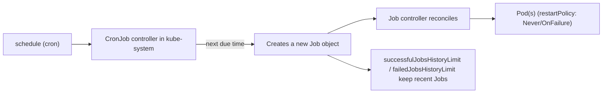

A CronJob does not run Pods directly. It creates a Job for each scheduled time, and the Job controller creates the Pod. That is why `kubectl get cronjob,job` and `kubectl logs job/<name>` are the right commands when something is wrong: the failure is usually in the Job's Pod, not the CronJob itself.

### Common mistakes

- Forgetting that `concurrencyPolicy: Forbid` *skips* the new trigger if the previous run is still active. The Job is never created, and there is no error; the CronJob just does not fire that minute. Use `Allow` (default) or `Replace` if you want every scheduled run to execute.
- Setting `successfulJobsHistoryLimit: 0` and `failedJobsHistoryLimit: 0` to "save space". This deletes the Job and its Pod immediately, so you have nothing to debug with `kubectl logs job/<name>` when a schedule fails. The defaults (`3` and `1`) are sensible.
- Assuming the CronJob's timezone is your laptop's. Without `spec.timeZone`, the controller uses the kube-controller-manager's clock, which on a hosted cluster is usually UTC. A schedule of `0 9 * * *` may fire at 9 AM UTC, not 9 AM local time.
- The CronJob name must be a valid DNS-1035 label (lowercase, alphanumeric, hyphens, max 52 characters). Long descriptive names get rejected.

### ⚡ Remember

**CronJob = schedule the creation of Jobs.**

## 1.12 Container images

CKAD expects you to work with OCI-compliant container images and know how an image is built and referenced.

### Dockerfile example

```dockerfile
FROM python:3.13-slim
WORKDIR /app
COPY app.py .
CMD ["python", "app.py"]
```

Build and tag:

```bash
docker build -t registry.example.com/myapp:1.0 .
docker push registry.example.com/myapp:1.0
```

The image can then be referenced by a Pod:

```yaml
containers:
  - name: app
    image: registry.example.com/myapp:1.0
```

### Multi-stage build, save and load

Multi-stage builds keep build tools out of the final image:

```dockerfile
FROM golang:1.23 AS build
WORKDIR /src
COPY . .
RUN CGO_ENABLED=0 go build -o /app .

FROM alpine:3.20
COPY --from=build /app /app
USER 1000
ENTRYPOINT ["/app"]
```

Build, export and re-import (Docker or Podman use the same verbs):

```bash
podman build -t myapp:1.0 .            # or: docker build -t myapp:1.0 .
podman images
podman save -o myapp.tar myapp:1.0     # image -> tar file
podman load -i myapp.tar               # tar file -> local image
```

To modify an existing image, start a Dockerfile with `FROM <existing-image>`, add your changes, and build it with a new tag.

### ENTRYPOINT vs CMD

Conceptually:

```text
Docker ENTRYPOINT <-> Kubernetes command
Docker CMD        <-> Kubernetes args
```

Concrete example: a Dockerfile with `ENTRYPOINT ["python"]` and `CMD ["app.py"]` runs `python app.py` by default. In a Pod, that becomes `command: ["python"]` and `args: ["app.py"]`. To replace the whole command, override `command` in the Pod; to change only the arguments, override `args`. If you set neither, Kubernetes uses the image's ENTRYPOINT and CMD as if you had not declared them.

### Override matrix (CKAD exam essential)

| Image `ENTRYPOINT` | Image `CMD` | Pod `command` | Pod `args` | Effective container command |
|---|---|---|---|---|
| `["python"]` | `["app.py"]` | _(unset)_ | _(unset)_ | `python app.py` |
| `["python"]` | `["app.py"]` | _(unset)_ | `["worker.py"]` | `python worker.py` |
| `["python"]` | `["app.py"]` | `["python3"]` | _(unset)_ | `python3` (image CMD ignored) |
| `["python"]` | `["app.py"]` | `["python3"]` | `["server.py"]` | `python3 server.py` |
| _(none)_ | `["app.py"]` | `["python"]` | `["app.py"]` | `python app.py` |

The trap: setting only `command` makes the image's CMD irrelevant - Kubernetes runs just the command with no arguments. If the image's ENTRYPOINT was `["python"]` and you set `command: ["python3"]` without `args`, the container runs `python3` alone.

### `kubectl run` --command vs no --command

`kubectl run` mirrors the same idea, and the difference is a frequent exam trap:

```bash
# Without --command: the words after -- become args to the image's ENTRYPOINT
kubectl run busybox --image=busybox:1.36 -- sleep 3600
# Container runs: <image ENTRYPOINT> sleep 3600

# With --command: the words after -- replace ENTRYPOINT entirely
kubectl run busybox --image=busybox:1.36 --command -- sleep 3600
# Container runs: sleep 3600
```

Most images (including `busybox`) have no ENTRYPOINT, so both forms look identical - until you target an image that does. Use `--command` whenever you mean "run exactly this program as PID 1."

### `imagePullPolicy`

`imagePullPolicy` controls when Kubernetes tries to pull the image.

| Value | Behavior |
|---|---|
| `Always` | Check the registry every time a container starts |
| `IfNotPresent` | Pull only if the image is not already on the node |
| `Never` | Never pull; fail if the image is missing locally |

Default: `:latest` or an untagged image -> `Always`; an explicit non-`latest` tag -> `IfNotPresent`.

### Private registries

Use an image pull Secret when the registry requires authentication:

```bash
kubectl create secret docker-registry regcred \
  --docker-server=registry.example.com \
  --docker-username=user \
  --docker-password='password'
```

Then reference it in the Pod spec (or attach it to a ServiceAccount, see [§4.3 ServiceAccounts](#43-serviceaccounts)):

```yaml
spec:
  imagePullSecrets:
    - name: regcred
  containers:
    - name: app
      image: registry.example.com/myapp:1.0
```

### Build -> tag -> push

```text
source -> image build -> tag -> registry -> Kubernetes Pod
```

### ⚡ Remember

**Use versioned image tags; keep image content separate from runtime configuration.**

## 1.13 Basic scheduling controls

These topics are useful for understanding scheduling and Pending Pods, even though they are not standalone CKAD blueprint competencies.

### `nodeSelector`

```yaml
nodeSelector:
  environment: dev
```

### Node affinity

```yaml
affinity:
  nodeAffinity:
    requiredDuringSchedulingIgnoredDuringExecution:
      nodeSelectorTerms:
        - matchExpressions:
            - key: environment
              operator: In
              values: [dev]
```

### Taints and tolerations

A taint repels Pods. A toleration allows a Pod to pass a matching taint; it does not by itself force placement.

```yaml
tolerations:
  - key: dedicated
    operator: Equal
    value: batch
    effect: NoSchedule
```

### Affinity at a glance

| Kind | Meaning |
|---|---|
| `requiredDuringSchedulingIgnoredDuringExecution` | Hard rule: the Pod stays `Pending` if no node matches |
| `preferredDuringSchedulingIgnoredDuringExecution` | Soft rule with a `weight` (1-100) |
| `podAffinity` / `podAntiAffinity` | Place near or away from Pods with given labels, using a `topologyKey` such as `kubernetes.io/hostname` |

`IgnoredDuringExecution` means the rule is checked only when scheduling; already-running Pods are not evicted if node labels change.

### How the scheduler combines rules

A scheduler decision is the intersection of several filters, not a single rule. For any candidate node the scheduler evaluates, in order:

```mermaid
flowchart TD
    S[Scheduler picks a Pod] --> F1{Node has enough<br/>free CPU/memory<br/>for requests?}
    F1 -->|no| SKIP1[Skip node]
    F1 -->|yes| F2{Pod tolerates<br/>all NoSchedule taints<br/>on the node?}
    F2 -->|no| SKIP2[Skip node]
    F2 -->|yes| F3{nodeSelector and<br/>required nodeAffinity match?}
    F3 -->|no| SKIP3[Skip node]
    F3 -->|yes| F4{Required pod (anti)affinity<br/>satisfied?}
    F4 -->|no| SKIP4[Skip node]
    F4 -->|yes| F5{Topology spread<br/>within maxSkew?}
    F5 -->|no - DoNotSchedule| SKIP5[Stay Pending]
    F5 -->|yes / soft| OK[Bind Pod to this node]
```

If a Pod is `Pending` with `FailedScheduling` events, walk this diagram in reverse: read the event message to find which filter rejected the node. `taints`, `nodeAffinity`, `Insufficient cpu`, and `unbound PVC` are the four messages you will see most.

### Taint effects and commands

| Effect | Behavior |
|---|---|
| `NoSchedule` | New Pods without a toleration are not scheduled |
| `PreferNoSchedule` | Scheduler tries to avoid the node |
| `NoExecute` | Also evicts running Pods that do not tolerate the taint |

```bash
kubectl label node node01 disk=ssd                        # then use nodeSelector: {disk: ssd}
kubectl taint nodes node01 dedicated=batch:NoSchedule     # add a taint
kubectl taint nodes node01 dedicated=batch:NoSchedule-    # trailing - removes it
kubectl describe node node01 | grep -i taint
```

### Taint / toleration gotchas

- A toleration matches a taint only when `key`, `value` (if `Equal`), and `effect` all line up. Use `operator: Exists` to match any value of a key (handy for "tolerate every `dedicated` taint regardless of value").
- A toleration does **not** schedule the Pod onto a tainted node. Taints repel; they do not attract. Combine with `nodeSelector` or node affinity when you need placement.
- `NoExecute` with no `tolerationSeconds` evicts immediately. Adding `tolerationSeconds: 60` to a toleration against a `NoExecute` taint gives running Pods 60 seconds to finish before they are killed - useful for graceful rolling node maintenance.
- Control-plane nodes carry the taint `node-role.kubernetes.io/control-plane:NoSchedule` (and historically `node-role.kubernetes.io/master:NoSchedule`). A DaemonSet that should run everywhere, including control-plane nodes, must add tolerations for both.
- `kubectl taint node <name> <key>=<value>:<effect>-` removes a taint; the trailing `-` is required, not optional. The key/value/effect must match the existing taint exactly.

### ⚡ Remember

**nodeSelector/affinity = Pod constraints.**
**taint = node repels.**
**toleration = Pod is allowed past a matching taint.**

### Topology spread constraints

Topology spread controls how Pods are distributed across topology domains (typically zones, regions, or hosts). It is the modern answer to "spread my Pods evenly across zones / hosts."

```yaml
spec:
  topologySpreadConstraints:
    - maxSkew: 1
      topologyKey: kubernetes.io/hostname   # or topology.kubernetes.io/zone
      whenUnsatisfiable: ScheduleAnyway     # or DoNotSchedule
      labelSelector:
        matchLabels:
          app: web
    - maxSkew: 1
      topologyKey: topology.kubernetes.io/zone
      whenUnsatisfiable: DoNotSchedule
      labelSelector:
        matchLabels:
          app: web
```

| Field | Meaning |
|---|---|
| `maxSkew` | Allowed difference between the most-populated and least-populated domain |
| `topologyKey` | Node label whose value defines the domain (`kubernetes.io/hostname`, `topology.kubernetes.io/zone`, `topology.kubernetes.io/region`) |
| `whenUnsatisfiable: DoNotSchedule` | Hard rule: stay `Pending` if the constraint cannot be met |
| `whenUnsatisfiable: ScheduleAnyway` | Soft rule: best-effort spread, do not block scheduling |
| `labelSelector` | Which existing Pods count toward the spread calculation (usually the workload's own labels) |

### Common mistakes

- Picking a `topologyKey` that no node has. If no node carries `topology.kubernetes.io/region`, the constraint applies to a single "no region" domain and spreads nothing. Verify with `kubectl get nodes --show-labels`.
- Setting `whenUnsatisfiable: DoNotSchedule` with `maxSkew: 1` on a single-node cluster. The Pod will stay `Pending` forever because the skew can never reach 1 with one domain.
- Forgetting `labelSelector`. Without it, the scheduler counts **every** Pod on the node when computing skew, which leads to surprising results. Always set `labelSelector.matchLabels` to the workload's own labels.
- Confusing `topologySpreadConstraints` (preferred) with the older `podAntiAffinity` with `topologyKey`. Both spread Pods; topology spread is more flexible and supports `ScheduleAnyway`.

### Pod priority and preemption

`priorityClassName` lets a Pod be more (or less) important than others when the scheduler runs out of capacity.

```yaml
spec:
  priorityClassName: high-priority
```

System classes shipped with Kubernetes include `system-cluster-critical` and `system-node-critical` (used by core cluster components). User-defined PriorityClass objects are namespaced-cluster-scoped (cluster-wide, but in a namespace):

```yaml
apiVersion: scheduling.k8s.io/v1
kind: PriorityClass
metadata:
  name: high-priority
value: 1000000
globalDefault: false
description: "Used for the web tier"
```

Higher `value` wins when the scheduler preempts lower-priority Pods to make room. A Pod without a `priorityClassName` uses the `globalDefault` PriorityClass, or zero if none is set.

## 1.14 Imperative kubectl

Imperative commands save time and are especially useful for YAML generation.

### High-value generators

```bash
kubectl create namespace dev
kubectl run nginx --image=nginx
kubectl run nginx --image=nginx --port=80 --env=APP_ENV=dev
kubectl run nginx --image=nginx --dry-run=client -o yaml

kubectl create deployment web --image=nginx --replicas=3
kubectl create job report --image=busybox:1.36 -- echo done
kubectl create cronjob cleanup --image=busybox:1.36 --schedule="*/5 * * * *" -- echo cleanup
kubectl create configmap app-config --from-literal=APP_ENV=dev
kubectl create secret generic db-creds --from-literal=password=secret
kubectl create serviceaccount app-sa
kubectl create role pod-reader --verb=get,list --resource=pods -n dev
kubectl create rolebinding read-pods --role=pod-reader --serviceaccount=dev:app-sa -n dev
kubectl create quota dev-quota --hard=pods=20,requests.cpu=4,requests.memory=4Gi -n dev
kubectl create clusterrole node-reader --verb=get,list --resource=nodes
kubectl create clusterrolebinding read-nodes --clusterrole=node-reader --serviceaccount=dev:app-sa
kubectl create secret docker-registry regcred --docker-server=registry.example.com --docker-username=user --docker-password=pass
kubectl create ingress web --class=nginx --rule="example.com/=web:80"

# command vs args: --command makes everything after -- the container command
kubectl run busybox --image=busybox:1.36 --command -- sleep 3600
kubectl run busybox --image=busybox:1.36 -- sleep 3600   # without --command: passed as args
```

### Useful modification commands

```bash
kubectl expose deployment web --port=80 --target-port=8080 --type=NodePort
kubectl scale deployment web --replicas=5
kubectl set image deployment/web nginx=nginx:1.28
kubectl set env deployment/web APP_ENV=prod
kubectl set resources deployment/web --requests=cpu=100m,memory=128Mi --limits=cpu=500m,memory=256Mi
kubectl set serviceaccount deployment/web app-sa
kubectl label pod web version=blue
kubectl annotate pod web owner=platform
```

### Edit, patch, replace, delete

```bash
kubectl edit deployment web                                  # opens live object in the editor
kubectl patch deployment web -p '{"spec":{"replicas":4}}'
kubectl apply -f web.yaml                                    # declarative create/update
kubectl replace --force -f pod.yaml                          # delete + recreate (immutable field changed)
kubectl delete pod web --grace-period=0 --force              # fast delete (use deliberately)
kubectl delete -f web.yaml
```

### `$do` / dry-run pattern and exam speed setup

Check what your exam terminal already provides (the `k` alias and completion are commonly preconfigured), then add:

```bash
alias k=kubectl                    # only if missing
export do='--dry-run=client -o yaml'
k run web --image=nginx $do > pod.yaml
```

Indentation errors are the most common YAML mistake; in vim:

```vim
:set expandtab tabstop=2 shiftwidth=2
```

Generate and edit instead of typing long manifests from memory.

### `kubectl run --restart` is a frequent trap

`kubectl run` defaults to creating a **Deployment** with `--restart=Always` (a controller-managed Pod). Other values change the kind it creates:

| `--restart` | Resource created | Pod `restartPolicy` |
|---|---|---|
| `Always` (default) | Deployment | `Always` |
| `OnFailure` | Job | `OnFailure` |
| `Never` | Pod | `Never` |

A task that says "create a Pod that runs once" needs `--restart=Never`; a "Job" needs `--restart=OnFailure`. Without those flags, you get a Deployment whose Pod keeps restarting - and the task fails.

### `--save-config` round-tripping

`kubectl apply` is normally idempotent. If you create an object imperatively (`kubectl create deployment web ...`) and then `kubectl apply -f` a manifest that contains the same object, the cluster already has fields the manifest did not specify. `--save-config` writes the live object back into the manifest's `annotations` so the next `apply` is a no-op for unchanged fields. Use it when you need a manifest to be the source of truth after an imperative create.

### Autoscale, wait, patch at a glance

These three commands are heavily used in CKAD scenarios.

#### `kubectl autoscale` (Horizontal Pod Autoscaler)

```bash
kubectl autoscale deployment web --min=2 --max=10 --cpu-percent=80
kubectl get hpa
```

Generates an HPA resource targeting the Deployment. CPU-based autoscaling needs the metrics-server to be installed. See §1.17 for the YAML form.

#### `kubectl wait`

Wait for a specific condition before continuing (useful in scripts and after `apply`):

```bash
kubectl wait --for=condition=Ready       pod/web           --timeout=60s
kubectl wait --for=condition=Available  deployment/web    --timeout=60s
kubectl wait --for=jsonpath='{.status.phase}'=Running pod/web --timeout=30s
kubectl wait --for=delete               pod/web           --timeout=60s
```

A timed-out `wait` exits non-zero, which is why a script can branch on it.

#### `kubectl patch`

Three patch types map to three on-disk formats:

| Flag | Format | Use when |
|---|---|---|
| `--type=merge` (default) | JSON merge patch (RFC 7396) | Replacing values; arrays are replaced wholesale |
| `--type=strategic` | Strategic merge | Lists merged by `name` (containers, volumes, ports, env) |
| `--type=json` | JSON 6902 | Precise list-element edits; must be valid JSON 6902 |

Examples:

```bash
# JSON merge (default): change a single field
kubectl patch deployment web -p '{"spec":{"replicas":4}}'

# Strategic merge: add an env var without losing existing ones
kubectl patch deployment web --type=strategic -p '{
  "spec": {
    "template": {
      "spec": {
        "containers": [{
          "name": "app",
          "env": [{"name": "FEATURE_X", "value": "enabled"}]
        }]
      }
    }
  }
}'

# JSON 6902: replace an element in a list by index
kubectl patch svc web --type=json -p '[
  {"op":"replace","path":"/spec/ports/0/port","value":8080}
]'
```

The Kustomize `patches:` form mirrors the same three semantics (strategic merge by default, JSON 6902 when the patch starts with `- op:`).

### More utilities worth knowing

```bash
kubectl wait --for=condition=Ready pod/web --timeout=60s
kubectl wait --for=condition=Available deployment/web --timeout=60s
kubectl diff -f web.yaml                       # what would change
kubectl apply -f web.yaml --dry-run=server     # validated by the API server
kubectl get pods -o name                       # pod/web-abc12 ...
kubectl get all -n dev                         # common kinds only: NOT ConfigMaps, Secrets, PVCs, Ingresses

cat <<EOF | kubectl apply -f -                 # apply YAML typed inline
apiVersion: v1
kind: ConfigMap
metadata:
  name: quick
data:
  k: v
EOF
```

`kubectl get all` is a common trap: it does not list every resource kind, so query ConfigMaps, Secrets, PVCs and Ingresses explicitly.

### ⚡ Remember

**Generate quickly -> edit the required fields -> apply -> verify.**

## 1.15 kubectl output, API discovery and schema help

### Inspect objects

```bash
kubectl get pods
kubectl get pods -o wide
kubectl get pod nginx -o yaml
kubectl get pod nginx -o json
```

### Custom columns

```bash
kubectl get pods \
  -o custom-columns=NAME:.metadata.name,STATUS:.status.phase
```

Other useful output forms:

```bash
kubectl get pod nginx -o jsonpath='{.status.podIP}'
kubectl get pods --sort-by=.metadata.creationTimestamp
kubectl get pods -A                 # all namespaces
```

### Filtering and extracting fields

```bash
kubectl get pods --field-selector=status.phase=Running
kubectl get pods --field-selector spec.nodeName=node01 -A
kubectl get deploy web -o jsonpath='{.spec.template.spec.containers[0].image}'
kubectl get pods -o jsonpath='{range .items[*]}{.metadata.name}{"\t"}{.status.podIP}{"\n"}{end}'
kubectl get nodes -o jsonpath='{.items[*].status.addresses[?(@.type=="InternalIP")].address}'
kubectl get pods -o custom-columns=NAME:.metadata.name,IMAGE:.spec.containers[*].image
```

Use `-l` for **labels** and `--field-selector` for **fields** such as phase or node name. Write the result to a file with `> /path/file` when the task asks for it.

### API discovery

```bash
kubectl api-resources
kubectl api-versions
```

### Explain fields

```bash
kubectl explain pod
kubectl explain pod.spec.containers
kubectl explain deployment.spec.strategy
kubectl explain pod --recursive
```

### ⚡ Remember

**Do not guess a field when Kubernetes can tell you the schema.**

## 1.16 Workload relationships and decision table

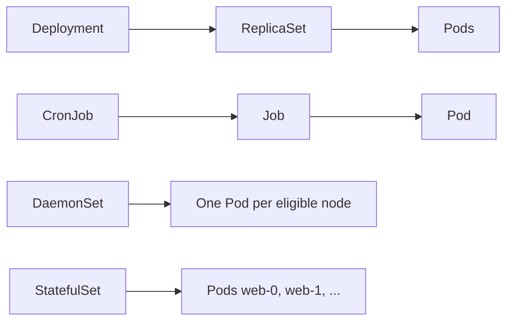

| Requirement | Resource | Lifecycle |
|---|---|---|
| Simple manually managed workload | Pod | Ephemeral |
| Maintain a replica count | ReplicaSet | Long-running |
| Stateless replicas + controlled updates | Deployment | Long-running |
| Run on every eligible node | DaemonSet | Long-running |
| Run work to completion | Job | Finite |
| Run work on a schedule | CronJob | Repeating (creates Jobs) |
| Stable identity / per-Pod storage | StatefulSet | Long-running |

### ⚡ Remember

Deployment -> ReplicaSet -> Pods. CronJob -> Job -> Pod. Pick the resource from the requirement **before** writing YAML.

## 1.17 Horizontal Pod Autoscaler (HPA)

A Horizontal Pod Autoscaler (HPA) scales the replica count of a Deployment, StatefulSet or ReplicaSet based on observed metrics (most commonly CPU utilization). The HPA controller runs in `kube-system` and reads metrics from the metrics-server.

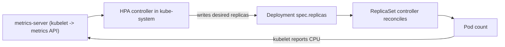

The HPA is a **control loop**: it polls metrics every 15 seconds by default, compares the average against the target, and writes a new desired count. The Deployment's own controller does the actual Pod creation or deletion, which is why HPA never edits Pods directly.

### Imperative

```bash
kubectl autoscale deployment web --min=2 --max=10 --cpu-percent=80
kubectl get hpa
kubectl describe hpa web
```

### Declarative

```yaml
apiVersion: autoscaling/v2
kind: HorizontalPodAutoscaler
metadata:
  name: web
spec:
  scaleTargetRef:
    apiVersion: apps/v1
    kind: Deployment
    name: web
  minReplicas: 2
  maxReplicas: 10
  metrics:
    - type: Resource
      resource:
        name: cpu
        target:
          type: Utilization
          averageUtilization: 80
  behavior:
    scaleDown:
      stabilizationWindowSeconds: 300
    scaleUp:
      stabilizationWindowSeconds: 0
      policies:
        - type: Percent
          value: 100
          periodSeconds: 30
```

`autoscaling/v2` is the current stable API; it is required to use `behavior` and modern metric types. `autoscaling/v1` only supports CPU and is implicitly converted.

### Important rules

- Every container in the target must have `resources.requests.cpu` set, otherwise utilization is undefined and the HPA cannot compute a desired replica count (`<unknown>` / `0%` in `kubectl get hpa`).
- The metrics-server must be running. Verify with `kubectl top pods`; if it errors, HPA cannot read metrics.
- HPA does not change `spec.replicas` directly; it writes the desired count and the Deployment's ReplicaSet controller reconciles.
- Rollout of a new HPA `maxReplicas` lower than the current replica count does not delete Pods by itself; the deployment controller scales the Deployment down at its own pace.

### Metric types

`autoscaling/v2` supports several metric sources; CKAD only requires `Resource` (CPU/memory), but know what the others look like so you can read an HPA in the wild:

| `type` | What it scales on | Where the data comes from |
|---|---|---|
| `Resource` | CPU or memory | `metrics-server` (built-in API: `metrics.k8s.io`) |
| `ContainerResource` | Per-container CPU/memory | `metrics-server` |
| `Pods` | Anything the metrics pipeline exposes per Pod (e.g. request rate) | Custom or adapter (Prometheus) |
| `Object` | A metric on a single Kubernetes object (Ingress, Service) | Custom adapter |
| `External` | A metric from outside the cluster (queue depth, SQS) | Custom adapter |

For exam purposes: CPU HPA needs `requests.cpu` on every container; memory HPA needs `requests.memory`. Without them the HPA prints `<unknown>/0%` and never changes the replica count.

### ⚡ Remember

**HPA = loop on a metric. It needs requests set on the target containers and metrics-server installed.**

## 1.18 PodDisruptionBudget (PDB)

A PodDisruptionBudget limits the number of Pods of a workload that can be **voluntarily** unavailable at the same time (for example during a node drain or a cluster upgrade). It is a guardrail, not a controller: the eviction API refuses to remove Pods that would violate the budget.

### Imperative

```bash
kubectl create poddisruptionbudget web-pdb \
  --selector=app=web \
  --min-available=2
```

### Declarative

```yaml
apiVersion: policy/v1
kind: PodDisruptionBudget
metadata:
  name: web-pdb
spec:
  minAvailable: 2          # OR: maxUnavailable: 1
  selector:
    matchLabels:
      app: web
```

Only one of `minAvailable` / `maxUnavailable` may be set; both may be expressed as a count or a percentage string (for example `"50%"`).

### Important rules

- The PDB `selector` must match the **Pod labels** of the target workload, not the workload's own selector. Pods owned by a Deployment carry `pod-template-hash`, plus the labels from the Pod template.
- A PDB is only enforced against **voluntary** disruptions. `kubectl delete pod`, a node failure, or a hardware-level OOM kill are involuntary and bypass the budget.
- `policy/v1` is the current stable API; `policy/v1beta1` was removed in 1.25.

### ⚡ Remember

**PDB = "no more than N Pods of this workload may be voluntarily down at once."**

# 2. Pod Design

## 2.1 Single-container vs multi-container Pods

A single-container Pod is the normal default. Multiple containers belong in one Pod when they are tightly coupled and should share lifecycle, network and possibly storage.

### When to use more than one container

Put containers together only when they need to **share a lifecycle** (be scheduled, started and stopped together), **talk over `localhost`**, or **share files through a volume**. If two parts can scale or fail independently, use two Deployments and a Service instead.

| Pattern | Runs | Purpose | Typical example |
|---|---|---|---|
| Init container | Before the app, to completion | One-time setup or wait for a dependency | Generate config, wait for a database |
| Sidecar | Alongside the app | Extend the app | Log shipper, proxy, file sync |
| Ambassador | Alongside the app | Local proxy to the outside world | Reach a database through `localhost` |
| Adapter | Alongside the app | Normalize the app's output | Convert metrics to a monitoring format |
| Ephemeral | Injected into a running Pod | Debugging | `kubectl debug` |

All containers in a Pod are scheduled to the **same node** and share the Pod IP.

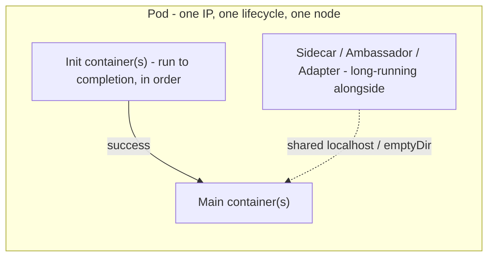

The order in the picture is also the **startup order**: init containers finish first, then main containers and any long-running sidecars start together. A regular init container and a native sidecar (see §2.5) both live in `initContainers`; the difference is `restartPolicy: Always`.

### ⚡ Remember

Do not put unrelated applications in one Pod merely because Kubernetes permits multiple containers.

### Decision rule: one container or many?

A CKAD question will sometimes leave the design open. Use this checklist:

- If the helper can fail and be restarted **without restarting the main application** -> use a sidecar (regular or native).
- If the helper must finish before the main app starts (config generator, wait loop) -> use an init container.
- If the two parts can scale independently or have different release cadences -> use **two Deployments** and a Service. The whole reason multi-container Pods exist is to share lifecycle; do not lose that.
- If the helper just needs to read the application's logs/metrics from outside the Pod -> a **node agent** (DaemonSet) or an **external scraper** is more appropriate than a sidecar.

A common anti-pattern: putting a "log shipper" and a "metrics adapter" and a "config reloader" in one Pod because they all "support" the app. That Pod becomes impossible to update safely. Split the helpers into separate workloads when their lifecycles diverge.

## 2.2 Sidecar pattern

A sidecar supports the main application from inside the same Pod.

### Complete example: shared log file

```yaml
apiVersion: v1
kind: Pod
metadata:
  name: app-with-sidecar
spec:
  containers:
    - name: app
      image: busybox:1.36
      command: ["sh", "-c"]
      args: ["while true; do date >> /var/log/app.log; sleep 5; done"]
      volumeMounts:
        - name: logs
          mountPath: /var/log
    - name: sidecar
      image: busybox:1.36
      command: ["sh", "-c"]
      args: ["tail -F /var/log/app.log"]
      volumeMounts:
        - name: logs
          mountPath: /var/log
  volumes:
    - name: logs
      emptyDir: {}
```

The application writes the file; the sidecar consumes it.

```bash
kubectl logs app-with-sidecar -c sidecar       # tail the log file the sidecar is following
kubectl logs app-with-sidecar -c app            # confirm the app is still writing
```

### Which form should I write?

The exam usually says "sidecar container" or "log shipper". Both forms work, but they differ:

| Form | Where it lives | Lifecycle | Probes | When to choose |
|---|---|---|---|---|
| Regular sidecar | `spec.containers[]` (alongside the main container) | Restarted by kubelet if it crashes | Accepts `livenessProbe` and `readinessProbe` | Quick generation with `kubectl run` and edit; you want a probe on the helper |
| Native sidecar (Kubernetes 1.29+ GA in 1.33) | `spec.initContainers[]` with `restartPolicy: Always` | Ordered: starts before main containers, stops after | Probes not supported | You need guaranteed startup ordering (e.g. the helper must be ready before the main app) |

For CKAD, default to a regular sidecar in `spec.containers` - it is what `kubectl run` and `kubectl explain pod.spec.containers` lead you to, and it is the form that every example in the official docs uses first.

### Common mistakes

- Putting the sidecar in `initContainers` *without* `restartPolicy: Always`. An init container is meant to run to completion, so a long-running `tail -F` will be killed the moment it starts and the Pod will go to `Init:CrashLoopBackOff`.
- Two containers in the same Pod trying to bind the same port. They share the network namespace; only one process can listen on a given port.
- Forgetting to mount the shared volume in *both* containers. The application writes to `/var/log`, the sidecar must mount the same volume at the same or different path to see the file.
- Logging in with `kubectl exec` and seeing "the file is empty" - this is usually a `volumeMounts` typo, not an application bug.

### ⚡ Remember

**Sidecar = helper container beside the main application.**

## 2.3 Init containers

Init containers run before the application containers and must complete successfully before the next init/app container is started.

### Complete example: init container prepares the web root

```yaml
apiVersion: v1
kind: Pod
metadata:
  name: web-init
spec:
  initContainers:
    - name: setup
      image: busybox:1.36
      command: ["sh", "-c", "echo 'prepared by init' > /work/index.html"]
      volumeMounts:
        - name: work
          mountPath: /work
  containers:
    - name: web
      image: nginx:1.27
      volumeMounts:
        - name: work
          mountPath: /usr/share/nginx/html
  volumes:
    - name: work
      emptyDir: {}
```

```bash
kubectl get pod web-init          # Init:0/1 -> PodInitializing -> Running
kubectl exec web-init -c web -- cat /usr/share/nginx/html/index.html
```

A "wait for a dependency" init container is a loop such as `until nslookup db; do sleep 2; done`. Multiple init containers run **one after another, in order**. Complete example:

```yaml
initContainers:
  - name: wait-for-db
    image: busybox:1.36
    command:
      - sh
      - -c
      - "until nslookup db; do echo waiting for db; sleep 2; done"
```

Typical uses:

- prepare directories
- wait for a prerequisite
- generate initial configuration
- perform one-time setup

### ⚡ Remember

**Init container = startup preparation.**

## 2.4 Ambassador and adapter patterns

### Ambassador

A helper container acts as a local proxy or interface so the application talks to a stable local endpoint while the helper handles the external system.

Example idea:

```text
application -> localhost:5432 -> ambassador/proxy -> external database
```

### Adapter

A helper container transforms application output into a format expected by another system.

Example idea:

```text
application metrics -> adapter -> monitoring format
```

### Why they exist

Both patterns keep the main application simple and unaware of its surroundings. The helper is a separate image, so it can be reused, upgraded and owned independently.

- **Ambassador** hides *where* something lives: the app always calls `localhost:5432`, and the ambassador decides which real database (dev, prod, a shard) receives the traffic.
- **Adapter** hides *how* something is formatted: the app writes its native metrics or logs, and the adapter exposes them in the shape the monitoring system expects.

Mechanically both are just another entry in `spec.containers` that talks to the app over `localhost` or through a shared `emptyDir`, exactly like the sidecar example above. If a task asks for one of these, build it as a second container.

### ⚡ Remember

Both are **multi-container Pod patterns**. The exact implementation depends on the application.

## 2.5 Native sidecars

Kubernetes supports a native sidecar form using an entry in `initContainers` with a container-level `restartPolicy: Always`.

```yaml
initContainers:
  - name: logshipper
    image: busybox:1.36
    restartPolicy: Always
    command: ["sh", "-c", "tail -F /shared/app.log"]
    volumeMounts:
      - name: shared
        mountPath: /shared
```

This combines the startup ordering guarantees of init containers with a long-running sidecar lifecycle.

Native sidecars are GA since Kubernetes v1.33 (beta and on by default since v1.29). They start before the main containers, keep running for the life of the Pod, and are stopped after the main containers finish, which also lets a Job's Pod complete cleanly.

### Init container vs sidecar vs main container

A frequent CKAD question is "do I put this in `containers` or `initContainers`?" Use this decision:

| Behaviour you need | Where it goes |
|---|---|
| Runs to completion, then the app starts | `initContainers` (no special `restartPolicy` needed) |
| Runs alongside the app for the whole Pod life | `containers` (regular sidecar) **or** `initContainers` with `restartPolicy: Always` (native sidecar) |
| Is the actual application | `containers`, no `restartPolicy` override |
| Debugging tool for an already-running Pod | `kubectl debug` (ephemeral container), not a manifest change |

The two sidecar forms behave slightly differently for probes: a regular `containers` sidecar accepts readiness/liveness probes (handy when it must be Ready before traffic starts); a native sidecar does **not** support probes but still benefits from ordered startup.

### ⚡ Remember

**Regular init container -> runs to completion.**  
**Native sidecar -> uses `restartPolicy: Always` and keeps running with the Pod.**

## 2.6 Ephemeral containers

An **ephemeral container** is a temporary debugging container added to a **running** Pod. It is meant for troubleshooting, not for running the application.

```bash
kubectl debug -it pod/web --image=busybox:1.36 --target=app
kubectl describe pod web            # shows an "Ephemeral Containers" section
```

Resulting Pod spec (added through the Pod's `ephemeralcontainers` subresource, not by editing the Pod normally):

```yaml
spec:
  ephemeralContainers:
    - name: debugger-x7k2p          # generated name
      image: busybox:1.36
      targetContainerName: app      # join that container's process namespace
      stdin: true
      tty: true
```

| Property | Ephemeral container |
|---|---|
| Added to | An already running Pod |
| Ports, probes, resources | Not supported |
| Restarted / removed | No; it is gone only when the Pod is recreated |
| Typical use | Shell/tools in a distroless or crashing Pod |

Compare: `kubectl exec` enters an existing container; `kubectl debug` adds a new one (or debugs a copy of the Pod). More commands are in the debugging section.

### ⚡ Remember

**Init container = before the app. Sidecar = beside the app. Ephemeral container = injected later for debugging.**

## 2.7 Container communication inside a Pod

All containers in a Pod share the Pod network namespace.

If one container listens on port 8080, another container in the same Pod can normally reach it at:

```text
localhost:8080
```

They should not try to bind the same network port.

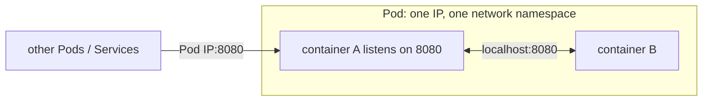

### ⚡ Remember

**Same Pod = same network namespace = `localhost`.**

## 2.8 Shared storage between containers

A volume can be mounted by multiple containers in the same Pod.

```yaml
volumes:
  - name: shared
    emptyDir: {}
```

Each container mounts the same volume at a suitable path.

### ⚡ Remember

**Same Pod + same volume = shared files.**

## 2.9 Pod lifecycle and restart policy

Pod phases include:

```text
Pending
Running
Succeeded
Failed
Unknown
```

The Pod-level `restartPolicy` for ordinary app/init containers can be:

- `Always`
- `OnFailure`
- `Never`

`Always` is the default.

Jobs require `Never` or `OnFailure` at Pod level.

### Which restart policy goes with which workload?

| Workload | `restartPolicy` | Why |
|---|---|---|
| Deployment / DaemonSet / ReplicaSet Pods | `Always` (default) | The controller will create a new Pod if a node dies; restarting the container is also fine for transient crashes |
| StatefulSet Pods | `Always` (default) | Same as Deployment |
| Job | `Never` or `OnFailure` | A "run to completion" workload should not loop on a successful exit; pick `OnFailure` to keep Pod identity across retries, `Never` to start a fresh Pod each time |
| CronJob | `Never` or `OnFailure` | The CronJob creates the Job; the same Pod-template rules apply |
| Bare Pod (created with `kubectl run`) | `Always` (default) | Without a controller, the only way to recover from a crash is a container restart |

### Important distinction

`CrashLoopBackOff` and `ContainerCreating` are **status reasons**, not Pod phases.

### Example

```yaml
spec:
  restartPolicy: Never
```

### Three different kinds of "status"

| Level | Values | Where to see it |
|---|---|---|
| Pod **phase** | `Pending`, `Running`, `Succeeded`, `Failed`, `Unknown` | `.status.phase` |
| **Container state** | `Waiting` (with a reason such as `ImagePullBackOff`), `Running`, `Terminated` (with an exit code) | `kubectl describe pod` |
| Pod **conditions** | `PodScheduled`, `Initialized`, `ContainersReady`, `Ready` | `kubectl describe pod` -> Conditions |

`Ready` is what a Service looks at, so a Pod can be phase `Running` and still receive no traffic. With `restartPolicy: Always` the kubelet restarts an exited container with an exponential back-off (10s, 20s, 40s ... capped at 5 minutes). That waiting period is what you see as `CrashLoopBackOff`.

### ⚡ Remember

**Pod phase != container state != readiness state.**

## 2.10 Self-healing

Controllers continuously reconcile desired state.

For example, if a Deployment should have 3 replicas and one Pod disappears:

```text
Desired = 3
Actual  = 2
      -> controller creates replacement
Actual  = 3
```

This is why controllers are normally preferred over creating individual Pods manually for application workloads.

### Example: replacement Pods get new names and IPs

```bash
kubectl create deployment web --image=nginx:1.27 --replicas=3
kubectl delete pod -l app=web --wait=false   # remove all Pods
kubectl get pods -w                          # replacements appear with new names
```

Replacement Pods get **new names and new IPs**, so applications must not depend on one specific Pod. A bare Pod (created with `kubectl run`) has no controller: if you delete it, it stays deleted, and if its node fails it is not rescheduled.

### ⚡ Remember

**Controller = keep actual state equal to desired state.**

## 2.11 Lifecycle hooks and graceful termination

### What it is

When a Pod is deleted, Kubernetes does not simply kill it. It runs a shutdown sequence so the application can finish in-flight work. Lifecycle hooks let you run a command or HTTP call at two points: right after a container starts (`postStart`) and right before it is stopped (`preStop`).

### Termination sequence

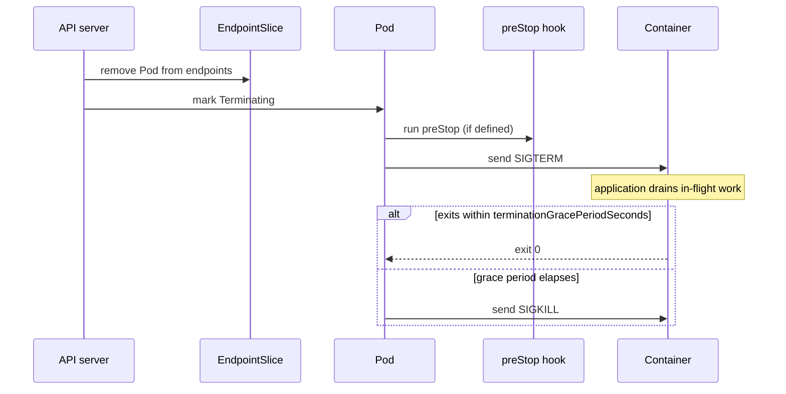

1. The Pod is marked `Terminating` and removed from Service endpoints.
2. The `preStop` hook (if any) runs.
3. The container receives **SIGTERM**.
4. Kubernetes waits up to `terminationGracePeriodSeconds` (default **30**); `preStop` time counts against this budget.
5. Anything still running receives **SIGKILL**.

### Example

```yaml
spec:
  terminationGracePeriodSeconds: 45
  containers:
    - name: web
      image: nginx:1.27
      lifecycle:
        postStart:
          exec:
            command: ["sh", "-c", "echo started > /usr/share/nginx/html/started.txt"]
        preStop:
          exec:
            command: ["sh", "-c", "sleep 10"]    # let traffic drain, then SIGTERM is sent
```

### Notes

- `postStart` runs alongside the container's main process with no ordering guarantee, but the container is not reported `Running` until the hook finishes. If the hook fails, the container is killed and restarted.
- Keep hooks short and idempotent; a hanging hook delays startup or shutdown.
- A container started as `sh -c "..."` may not forward SIGTERM to your program. Use `exec` in the script or run the program directly as PID 1.
- `kubectl delete pod <pod> --grace-period=0 --force` skips the graceful window (use deliberately).

### SIGTERM and `sh -c` — a classic trap

When a container's command is a shell, the shell receives SIGTERM and exits, but the child process (e.g. `python app.py` started with `&` or in the background) does **not** see the signal. The kubelet then sends SIGKILL after the grace period, and any in-flight work is lost.

Two fixes, pick whichever fits the image:

```dockerfile
# Option 1: use exec in the shell so the process becomes PID 1
CMD ["sh", "-c", "exec python app.py"]
```

```dockerfile
# Option 2: make the application PID 1 directly
CMD ["python", "app.py"]
```

The same problem hits `preStop: sleep N`. The sleep counts against `terminationGracePeriodSeconds`, so a 30 s sleep plus a default 30 s grace leaves the container no time to drain traffic before SIGKILL. Use a shorter `preStop` and a longer `terminationGracePeriodSeconds` if you need both.

### ⚡ Remember

**preStop -> SIGTERM -> grace period -> SIGKILL.**

# 3. Configuration

## 3.1 Commands and arguments

The image may define `ENTRYPOINT` and `CMD`. Kubernetes maps these conceptually to `command` and `args`.

### Override matrix

| Kubernetes fields | Effective behavior |
|---|---|
| neither | use image ENTRYPOINT + CMD |
| `args` only | keep image ENTRYPOINT, replace CMD/arguments |
| `command` only | replace image ENTRYPOINT; image CMD is not used as the default command |
| both | replace ENTRYPOINT and provide the arguments |

### Example

```yaml
containers:
  - name: app
    image: busybox:1.36
    command: ["sh", "-c"]
    args: ["echo hello; sleep 3600"]
```

### ⚡ Remember

**command replaces the entrypoint. args supplies the command's arguments.**

## 3.2 ConfigMaps

A ConfigMap stores non-sensitive configuration separately from application code.

### Create it

```bash
kubectl create configmap app-config --from-literal=APP_ENV=prod
kubectl create configmap app-files --from-file=application.properties
kubectl create configmap app-env --from-env-file=.env
```

### Declarative ConfigMap

```yaml
apiVersion: v1
kind: ConfigMap
metadata:
  name: app-config
data:
  APP_ENV: prod
  app.properties: |
    log.level=info
```

### Consume as one environment variable

```yaml
env:
  - name: APP_ENV
    valueFrom:
      configMapKeyRef:
        name: app-config
        key: APP_ENV
```

### Consume all keys as environment variables

```yaml
envFrom:
  - configMapRef:
      name: app-config
```

### Consume as a volume

```yaml
volumes:
  - name: config
    configMap:
      name: app-files
containers:
  - name: app
    image: nginx:1.27
    volumeMounts:
      - name: config
        mountPath: /etc/app
```

For normal ConfigMap volume mounts, file content can update after propagation delay. A `subPath` mount does not receive later ConfigMap updates.

### Four ways to consume a ConfigMap (or Secret)

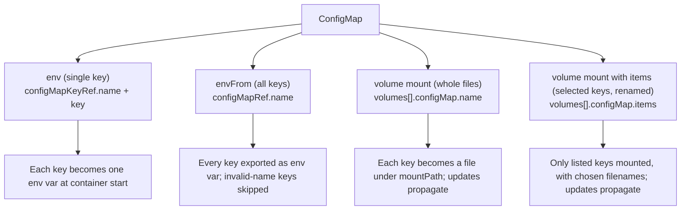

Rule of thumb:

- Need **one** value -> `env.valueFrom.configMapKeyRef`.
- Need **all** values as env vars -> `envFrom.configMapRef`.
- Need **whole files** or values that can change without a restart -> volume mount (no `subPath`).
- Need only **some** files under custom names -> `items:` in the volume.

### Complete Pod using both forms

```yaml
apiVersion: v1
kind: Pod
metadata:
  name: cfg-demo
spec:
  containers:
    - name: app
      image: busybox:1.36
      command: ["sh", "-c", "echo env=$APP_ENV; cat /etc/app/app.properties; sleep 3600"]
      env:
        - name: APP_ENV
          valueFrom:
            configMapKeyRef:
              name: app-config
              key: APP_ENV
      volumeMounts:
        - name: config
          mountPath: /etc/app
  volumes:
    - name: config
      configMap:
        name: app-config
```

`kubectl logs cfg-demo` should show `env=prod` and the properties file.

### Good to know

- A ConfigMap is limited to 1 MiB. Use volumes or images for large files.
- `data` holds UTF-8 text; use `binaryData` for binary content.
- With `--from-file=application.properties` the **file name becomes the key** and the file content the value. Use `--from-file=mykey=path` to choose the key.
- Mount only selected keys, under names you choose, with `items`:

```yaml
volumes:
  - name: config
    configMap:
      name: app-files
      items:
        - key: application.properties
          path: app.properties
```

- Set `immutable: true` on a ConfigMap (or Secret) to block edits. To change values you delete and recreate it, and the API server no longer has to watch it.

### How updates propagate

When you edit a ConfigMap, the kubelet on each node receives the change through a watch and refreshes the volume mount **eventually** (typically tens of seconds). The propagation also depends on the cache TTL: `kubelet --config` may set `configMapAndSecretChangeDetectionStrategy` and a TTL. For exam purposes: assume the new value is visible in the container after a short delay, **except** when the mount uses `subPath` (the file is bound at container start and never refreshed) or the value is consumed as an environment variable (the env var is fixed at process start).

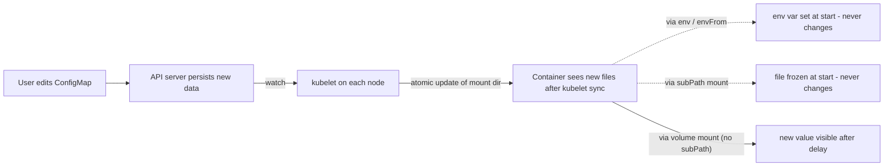

### Common pitfalls

- `subPath` mounts never see updates. Mount the **directory** if the application needs new values without a restart.
- Env vars from a ConfigMap are read once. A `kubectl rollout restart deployment/<name>` is the simplest way to make a config change take effect.
- `data` values must be valid UTF-8 text. Binary content goes in `binaryData` and is base64-encoded on write.
- A 1 MiB limit is enforced on the **total** ConfigMap. Large config files belong in a separate object or an image.

### Quick decision table (CKAD exam speed)

| You need to... | Use |
|---|---|
| Inject a few specific values as env vars at start | `env[].valueFrom.configMapKeyRef` |
| Inject every key of a ConfigMap as env vars | `envFrom[].configMapRef` |
| Make a few specific values available as files (with custom names) | `volumes[].configMap` with `items:` |
| Make every key available as files (and watch for updates) | `volumes[].configMap` without `subPath` |
| Update values without restarting the Pod | Mount as a volume, **not** via env vars, and **not** via `subPath` |

### ⚡ Remember

**ConfigMap = non-sensitive configuration.**

## 3.3 Secrets

Secrets are intended for sensitive values such as passwords, tokens, TLS material and registry credentials.

Base64 encoding is **not encryption**.

### Create

```bash
kubectl create secret generic db-creds \
  --from-literal=username=admin \
  --from-literal=password='S3cr3t'

kubectl create secret tls my-tls --cert=tls.crt --key=tls.key

kubectl create secret docker-registry regcred \
  --docker-server=registry.example.com \
  --docker-username=user \
  --docker-password='password'
```

### Declarative example

```yaml
apiVersion: v1
kind: Secret
metadata:
  name: db-creds
type: Opaque
stringData:
  username: admin
  password: S3cr3t
```

`stringData` lets you provide plain text and Kubernetes converts it into Secret data.

### Consume as a single environment variable

```yaml
env:
  - name: DB_PASSWORD
    valueFrom:
      secretKeyRef:
        name: db-creds
        key: password
```

### Consume all keys

```yaml
envFrom:
  - secretRef:
      name: db-creds
```

### Consume as a volume

```yaml
volumes:
  - name: secret-vol
    secret:
      secretName: db-creds
containers:
  - name: app
    image: nginx:1.27
    volumeMounts:
      - name: secret-vol
        mountPath: /etc/creds
        readOnly: true
```

### Encode/decode

```bash
echo -n 'admin' | base64
echo -n 'YWRtaW4=' | base64 -d
kubectl get secret db-creds -o jsonpath='{.data.password}' | base64 -d
```

Under `data:` values must be base64; under `stringData:` they are plain text.

### Secret types

| Type | Used for | Required keys |
|---|---|---|
| `Opaque` (default for `generic`) | Arbitrary key-value data | none |
| `kubernetes.io/tls` | TLS certificate and key (Ingress, apps) | `tls.crt`, `tls.key` |
| `kubernetes.io/dockerconfigjson` | Image pull credentials (`docker-registry`) | `.dockerconfigjson` |
| `kubernetes.io/basic-auth` | Username/password | `username` and/or `password` |
| `kubernetes.io/service-account-token` | Legacy long-lived ServiceAccount token | managed by Kubernetes |

### Handling Secrets safely

- Base64 only prevents accidental display. Anyone who can `get secret` can decode it, so control access with RBAC.
- Encryption at rest for etcd is an admin setting, not a CKAD task, but know that it exists.
- Prefer a `secretKeyRef` or a mounted volume over baking values into an image or a manifest in Git.
- Mounted Secret files can get tighter permissions with `defaultMode: 0400` on the `secret` volume.

### Common mistakes

- Treating `data:` and `stringData:` as interchangeable. `data` requires base64; `stringData` takes plain text and the API server converts it. Mixing them up produces "illegal base64" errors at apply time.
- Reading a Secret with `kubectl get secret <n> -o yaml` and pasting the whole object into Git. Use `stringData` in your source manifest and keep the base64 form in the cluster only.
- Forgetting `automountServiceAccountToken: false` for a Pod that does not need the API. Even a `default` ServiceAccount token is mounted, and the Secret it uses is visible to anyone with Pod exec.
- Since Kubernetes 1.24, **no long-lived ServiceAccount token Secret is created automatically**. Old exam material showing `kubectl get secret <sa>-token-xxxxx` is outdated; the Pod now receives a projected, expiring token at `/var/run/secrets/kubernetes.io/serviceaccount` instead. Use `kubectl create token <sa>` for external clients.
- A Secret referenced by a Pod that is later deleted leaves the Pod stuck in `CreateContainerConfigError` (the kubelet retries indefinitely; recreate the Secret to recover).
- `optional: false` (the default) on `secretKeyRef` makes the whole Pod fail to start if the key is missing. `optional: true` lets the Pod start with an empty value - useful when the key is genuinely optional, dangerous when it is not.

### ⚡ Remember

**Secret = sensitive data. Base64 != encryption.**

## 3.4 Environment variables

### Direct value

```yaml
env:
  - name: APP_ENV
    value: production
```

### From ConfigMap/Secret

Use `configMapKeyRef`, `secretKeyRef`, `envFrom`, or mounted files depending on the application.

### Update behavior

Environment variables are loaded into the process when the container starts. Changing the source ConfigMap/Secret does not rewrite an already-running process environment. A restart is normally required.

Normal ConfigMap/Secret volume mounts can reflect source changes after propagation; `subPath` mounts do not.

### Mental model: env vs file vs both

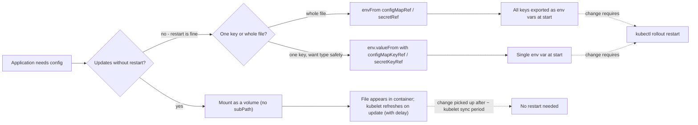

Choose env vars when the application reads them at startup and you are happy to roll on change. Choose a volume mount when the app watches the file (Nginx, Java `-Dconfig.file`, log shippers), or when you need the new value to take effect without a redeploy.

### Precedence and useful tricks

- If the same variable appears in `env` and `envFrom`, **`env` wins**. With several `envFrom` sources, the **last** one wins.
- `envFrom` accepts a prefix: `envFrom: [{prefix: CFG_, configMapRef: {name: app-config}}]`.
- Later `env` entries can reference earlier ones: `value: "$(DB_HOST):5432"`.
- Keys that are not valid variable names are skipped by `envFrom`.
- To pick up a changed ConfigMap/Secret used as env vars: `kubectl rollout restart deployment/<name>`.

| Need | Use |
|---|---|
| A few simple values | `env` with `configMapKeyRef` / `secretKeyRef` |
| Every key of a ConfigMap as variables | `envFrom` |
| Whole config files, or values that must update without a restart | Volume mount (without `subPath`) |

### ⚡ Remember

**Environment variables are read once, when the container starts.**

## 3.5 Downward API

The Downward API exposes selected information about the Pod to its own containers without requiring a Kubernetes API call.

### Environment form

```yaml
env:
  - name: POD_NAME
    valueFrom:
      fieldRef:
        fieldPath: metadata.name
  - name: NAMESPACE
    valueFrom:
      fieldRef:
        fieldPath: metadata.namespace
  - name: NODE_NAME
    valueFrom:
      fieldRef:
        fieldPath: spec.nodeName
  - name: POD_IP
    valueFrom:
      fieldRef:
        fieldPath: status.podIP
```

### Resource information

The Downward API can also expose container resource values with `resourceFieldRef`:

```yaml
env:
  - name: MEM_LIMIT_MI
    valueFrom:
      resourceFieldRef:
        resource: limits.memory
        divisor: 1Mi
```

### Volume form

A `downwardAPI` volume can expose metadata such as labels and annotations as files.

```yaml
volumes:
  - name: podinfo
    downwardAPI:
      items:
        - path: labels
          fieldRef:
            fieldPath: metadata.labels
```

### ⚡ Remember

**Downward API = Pod self-knowledge.**

## 3.6 Resource requests

A request is used by the scheduler when deciding whether a node has enough available capacity.

```yaml
resources:
  requests:
    cpu: "100m"
    memory: "128Mi"
```

### Why a request is a "promise"

The scheduler treats the request as the Pod's guaranteed share. The kubelet reserves that amount on the node so other Pods cannot claim it, even if the workload is currently idle. This is also what the **eviction manager** and **HPA** read: a HPA's `target.averageUtilization` is calculated against `requests.cpu`, not real CPU usage.

If a container has no request, the scheduler assumes zero. That makes the Pod `BestEffort` (see §3.8) and the first to be evicted under node pressure.

### ⚡ Remember

**Request = scheduling promise.**

## 3.7 Resource limits

A limit caps the resource consumption of a container.

```yaml
resources:
  limits:
    cpu: "500m"
    memory: "256Mi"
```

### CPU vs memory

- CPU is **compressible** -> reaching the CPU limit results in throttling.
- Memory is **incompressible** -> exceeding the memory limit can cause `OOMKilled`.

If only a limit is specified for a container, Kubernetes can default the request to the same value for that resource.

### How requests and limits flow

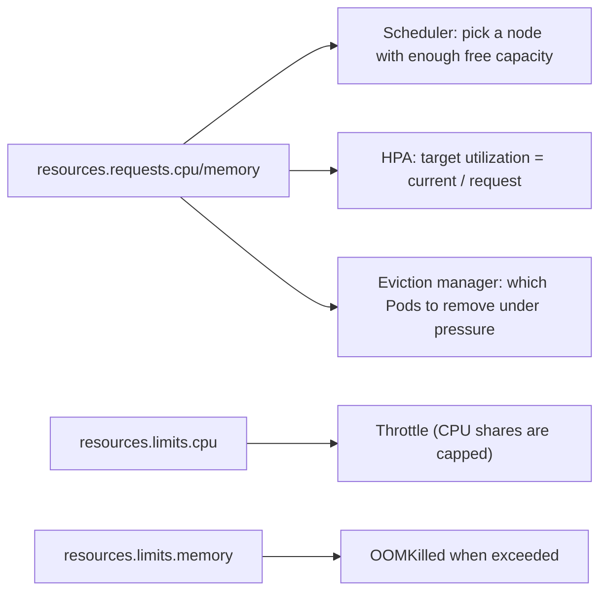

The same `requests` value is used by three different components. The same `limits` value is enforced by the kernel cgroup on the node. That is why a misconfigured request (too small -> HPA stays at 0%; too large -> Pods stay `Pending`) has more impact than a misconfigured limit.

### Complete example

```yaml
apiVersion: v1
kind: Pod
metadata:
  name: resource-demo
spec:
  containers:
    - name: app
      image: nginx:1.27
      resources:
        requests:
          cpu: 100m
          memory: 128Mi
        limits:
          cpu: 500m
          memory: 256Mi
```

```bash
kubectl set resources deployment/web --requests=cpu=100m,memory=128Mi --limits=cpu=500m,memory=256Mi
kubectl get pod resource-demo -o jsonpath='{.status.qosClass}'
```

### Units (a classic trap)

| Resource | Notation |
|---|---|
| CPU | `1` = `1000m` = one core; `250m` = a quarter core |
| Memory | `128Mi` = 128 x 1024 x 1024 bytes; `128M` = 128 x 1000 x 1000 bytes |
| Memory (wrong) | `128m` means 0.128 bytes (millibytes): it is valid syntax but almost certainly not what you meant |
| Ephemeral storage | `ephemeral-storage: 1Gi` limits writable-layer and log space |

### Ephemeral storage (often missed)

Container logs and the writable layer count against `ephemeral-storage`. If the container writes a lot to its filesystem (for example a debug container that captures packets) it can run the node out of disk and trigger eviction. Add it when the task is "this container uses local disk" or when the cluster has had `DiskPressure` events:

```yaml
resources:
  requests:
    ephemeral-storage: 100Mi
  limits:
    ephemeral-storage: 1Gi
```

A missing `ephemeral-storage` request/limit is the most common reason a `BestEffort` Pod that otherwise looks innocuous gets evicted.

### ⚡ Remember

**Request -> scheduling. Limit -> runtime ceiling.**

### Request/limit defaults and how they interact

- If you set only a **limit** and not a **request**, Kubernetes does **not** automatically copy the limit to the request. The Pod's request stays whatever the LimitRange defaults to (or zero if there is no LimitRange). This is a common reason an HPA reports `<unknown>/0%` even though the container has a memory limit.
- If you set only a **request** and not a **limit**, the container has no runtime ceiling - it can consume the node's full resources until evicted under pressure.
- A LimitRange can default the request to the limit for a given resource (`defaultRequest == default`). That is how some clusters push Burstable Pods up to Guaranteed QoS without the user setting both.
- The four combinations and their effects:

| `requests` | `limits` | Scheduling guarantee | Runtime cap | QoS class (typically) |
|---|---|---|---|---|
| unset | unset | none | none | BestEffort (first evicted) |
| set | unset | yes | none (Burstable) | Burstable |
| unset | set (no LimitRange) | none | yes | Burstable (request still 0) |
| set | set (equal) | yes | yes | Guaranteed (last evicted) |
| set | set (limits > requests) | yes | yes | Burstable |

## 3.8 QoS classes

Kubernetes assigns a Pod a QoS class from its resource configuration:

| Class | Rule | Under node memory pressure |
|---|---|---|
| **Guaranteed** | Every container has CPU **and** memory requests and limits, and requests == limits | Evicted last |
| **Burstable** | At least one request or limit set, but not Guaranteed | Middle |
| **BestEffort** | No requests or limits on any container | Evicted first |

The class appears in `kubectl get pod <pod> -o jsonpath='{.status.qosClass}'`.

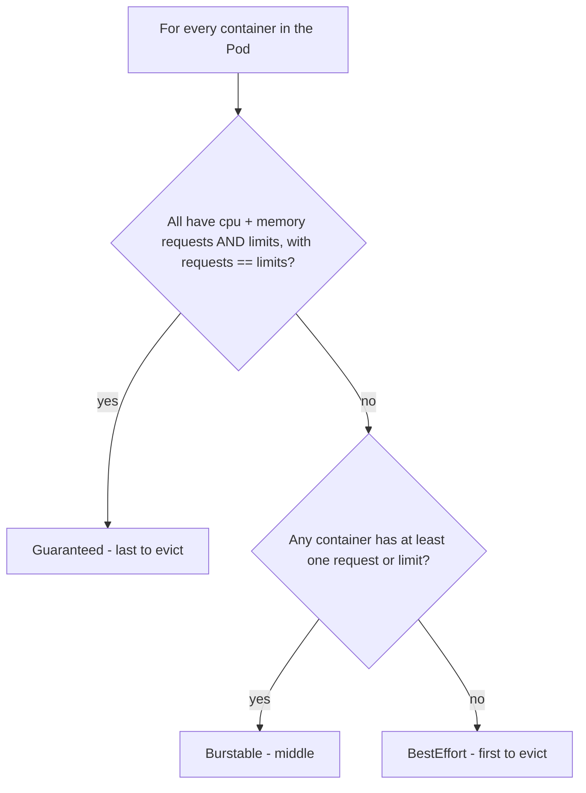

A common exam scenario: a task sets only `limits.memory` and not `requests.memory`. By default the request is **not** set, so the Pod is `Burstable`. If a `LimitRange` is also active in the namespace, it can default a request equal to the limit, which can push the Pod to `Guaranteed`. The QoS class is computed per-Pod using the **least-favorable** container, so a single `BestEffort` container makes the whole Pod `BestEffort`.

### ⚡ Remember

QoS affects behavior under resource pressure; it is not the same thing as scheduling requests.

## 3.9 LimitRange

A LimitRange sets defaults and/or minimum/maximum values within a namespace.

```yaml
apiVersion: v1
kind: LimitRange
metadata:
  name: container-limits
  namespace: dev
spec:
  limits:
    - type: Container
      default:
        cpu: 500m
        memory: 256Mi
      defaultRequest:
        cpu: 100m
        memory: 128Mi
      min:
        cpu: 50m
      max:
        cpu: "1"
```

### Key naming trap

- `default` = default **limit**
- `defaultRequest` = default **request**

### ⚡ Remember

**LimitRange = per-container namespace defaults/bounds.**

## 3.10 ResourceQuota

A ResourceQuota limits aggregate consumption in a namespace.

```yaml
apiVersion: v1
kind: ResourceQuota
metadata:
  name: dev-quota
  namespace: dev
spec:
  hard:
    pods: "20"
    requests.cpu: "4"
    requests.memory: 4Gi
    limits.cpu: "8"
    limits.memory: 8Gi
```

### Important interplay

A quota can reject a directly-created Pod when the namespace has no remaining quota. If a Deployment is creating Pods and quota blocks those Pods, the Deployment object can still exist while its replica count remains unsatisfied: the error (`exceeded quota`) appears in the **ReplicaSet's** events.

If a quota covers `requests.cpu`/`limits.memory` and similar compute resources, **every new Pod must specify them** (directly or through LimitRange defaults) or it is rejected.

```bash
kubectl describe quota dev-quota -n dev      # Used vs Hard
kubectl describe rs <replicaset> -n dev      # quota errors for Deployment Pods
```

### Order of operations: `LimitRange` -> `ResourceQuota` -> Pod

When a Pod is created in a namespace with both a `LimitRange` and a `ResourceQuota`, the API server applies them in this order:

1. The Pod is **validated** for missing required fields. If the quota requires `requests.cpu`/`limits.memory` and they are absent, the Pod is rejected immediately.
2. The `LimitRange` defaults (and minimum/maximum constraints) are applied: missing `requests`/`limits` are filled in from the LimitRange's `defaultRequest`/`default`.
3. The new values are checked against the `ResourceQuota`: if the namespace has no remaining quota, the Pod is rejected.
4. If accepted, the resources count against the quota's `Used`.

The practical consequence: a missing `requests` field is fine if a LimitRange provides a default; it is fatal if a quota requires it and no LimitRange exists.

### ⚡ Remember

**ResourceQuota = namespace-wide total.**

### 🎯 CKAD Focus (requests, limits, LimitRange, ResourceQuota)

Set requests/limits on a container, read a quota's Used/Hard values, and fix a Pod that is rejected for missing or exceeding resources.

---

# 4. Security & Kubernetes Extensions

## 4.1 Authentication

Authentication answers:

> **Who are you?**

Kubernetes can authenticate clients using mechanisms such as client certificates, bearer tokens and configured external identity integrations.

Authentication occurs before authorization.

Kubernetes has **no `User` object**: a human identity is whatever the credential says (for a client certificate, the CN is the user name and the O fields are groups). **ServiceAccounts** are the only identity Kubernetes stores as API objects, which is why Pods use them. A request with no valid credential is treated as anonymous and is normally denied later.

Every API request passes three gates in order:

```text
Authentication (who?) -> Authorization (allowed?) -> Admission (acceptable/defaulted?) -> etcd
```

`401 Unauthorized` means authentication failed. `403 Forbidden` means you are known but not permitted (usually RBAC).

### How authentication and authorization differ in practice

The two failure modes look similar in a terminal but the fix is completely different. A candidate who treats them as the same problem wastes minutes:

| Error code | Where it fails | Typical cause | First fix |
|---|---|---|---|
| `401 Unauthorized` | Authentication | No valid credential, expired token, wrong kubeconfig context | `kubectl config use-context <ctx>`; re-login; check the certificate has not expired |
| `403 Forbidden` | Authorization (RBAC) | Identity is known, but no Role/ClusterRole grants the verb on the resource | `kubectl auth can-i <verb> <resource> -n <ns> --as=<identity>` |
| `admission webhook ... denied the request` | Admission (mutating or validating) | PodSecurity, ResourceQuota, or a custom webhook rejected the object | Read the message; fix the object (more RBAC does not help) |

A single command covers both questions: `kubectl auth can-i <verb> <resource> -n <ns> --as=<who>`. If it returns `yes` and the operation still fails, the cause is admission, not auth or RBAC.

### Common mistakes

- "Re-authenticating" to fix a `403`. The user is already known; the problem is RBAC. Re-login does not add permissions.
- A ServiceAccount with no RoleBinding. The projected token is valid (so authentication succeeds), but every API call is `403`. The fix is a `RoleBinding` or `ClusterRoleBinding`, not a new token.
- A kubeconfig whose `current-context` no longer matches the cluster the task names. `kubectl config get-contexts` first; pick the right one.

### ⚡ Remember

**Authentication = who you are. Authorization = what you may do.**

---

## 4.2 KubeConfig

KubeConfig stores clusters, users/credentials, contexts and the current context.

### Useful commands

```bash
kubectl config get-contexts
kubectl config current-context
kubectl config use-context <context>
kubectl config set-context --current --namespace=dev
```

A context combines connection and identity information and can include a namespace.

### Structure

```yaml
apiVersion: v1
kind: Config
clusters:
  - name: prod-cluster
    cluster:
      server: https://10.0.0.10:6443
      certificate-authority-data: <base64>
users:
  - name: dev-user
    user:
      client-certificate-data: <base64>
      client-key-data: <base64>
contexts:
  - name: dev@prod
    context:
      cluster: prod-cluster
      user: dev-user
      namespace: dev
current-context: dev@prod
```

A **context = cluster + user + optional namespace**. `use-context` only changes `current-context`.

```bash
kubectl config view --minify                    # only the active context
kubectl --kubeconfig=/path/to/config get pods   # use another file for one command
export KUBECONFIG=/path/a:/path/b               # merge several files
```

### ⚡ Remember

Before every task, verify **current context + namespace**.

## 4.3 ServiceAccounts

A ServiceAccount provides an identity for workloads that interact with the Kubernetes API.

### Create and use

```bash
kubectl create serviceaccount app-sa -n dev
kubectl create token app-sa -n dev
```

Pod:

```yaml
spec:
  serviceAccountName: app-sa
```

### Security controls

When API access is unnecessary, set this in the Pod spec (or on the ServiceAccount):

```yaml
automountServiceAccountToken: false
```

Since Kubernetes 1.24, a long-lived token Secret is not automatically created for every ServiceAccount. `kubectl create token` can request a short-lived token. Pods receive a **projected** (mounted via a `projected` token volume), **expiring** token at `/var/run/secrets/kubernetes.io/serviceaccount` unless automount is disabled. The token is automatically rotated by kubelet before its expiry.

Request a token for an external client (CI, script) with a custom audience and TTL:

```bash
kubectl create token app-sa -n dev --audience=https://my-api --duration=1h
```

`--duration` requires the API server to be configured with a max TTL (typically 1h or longer); longer durations are rejected.

Attach an image pull Secret to a ServiceAccount so every Pod using it can pull private images:

```bash
kubectl patch serviceaccount app-sa -n dev -p '{"imagePullSecrets":[{"name":"regcred"}]}'
kubectl set serviceaccount deployment/web app-sa
```

Every namespace has a `default` ServiceAccount that Pods use when `serviceAccountName` is not set.

### Token lifecycle (1.24+)

Before Kubernetes 1.24, every ServiceAccount automatically got a long-lived Secret holding a bearer token. That is gone. Modern Pods receive a **projected**, **short-lived** token mounted at `/var/run/secrets/kubernetes.io/serviceaccount`, and kubelet rotates it before it expires.

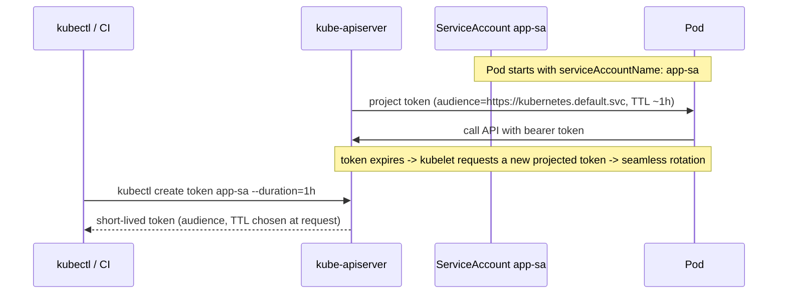

Practical consequences for the exam:

- You no longer see a Secret named after the ServiceAccount. `kubectl get secret -n dev` no longer surfaces a token Secret automatically.
- `automountServiceAccountToken: false` on the Pod or ServiceAccount removes the projected mount entirely - the Pod cannot reach the API at all.
- For external clients (CI, scripts), `kubectl create token` is the supported way; long-lived tokens are no longer the default.
- Image pull Secrets still use the regular Secret mechanism; they are unrelated to API tokens.

### When to disable `automountServiceAccountToken`

Set it to `false` (on the Pod or on the ServiceAccount) when the workload does not call the Kubernetes API: typical web apps, batch jobs that only talk to an external database, sidecars that only read files. The reasons are real, not theoretical:

- An idle mount is a small attack surface, but the projected token has real RBAC permissions. If the workload is compromised, the token is too.
- A Pod that does not need the API has no business carrying the credential.

For a Deployment, prefer setting the field on the ServiceAccount (one place, applies to every Pod that uses it):

```bash
kubectl patch serviceaccount app-sa -n dev --type=merge \
  -p '{"automountServiceAccountToken": false}'
```

### `default` ServiceAccount trap

Every namespace has a `default` ServiceAccount. If a Pod does not set `serviceAccountName`, it gets `default`. RBAC exam tasks frequently rely on this:

- A ServiceAccount is not granted any API permissions by itself. The token it mounts is useless until a `RoleBinding` references the ServiceAccount.
- `kubectl auth can-i ... --as=system:serviceaccount:<ns>:<sa>` is the way to test what a ServiceAccount can do, including `default`.

### ⚡ Remember

**ServiceAccount = identity. RBAC = permissions.**

## 4.4 Authorization

Authorization answers:

> **What are you allowed to do?**

RBAC expresses permissions with Roles/ClusterRoles and attaches them to identities using Bindings.

```mermaid
flowchart LR
    REQ["API request: (user, verb, resource, namespace)"] --> LOOK[Authorization: collect all rules bound to the user]
    LOOK --> R1[Role bindings in the namespace]
    LOOK --> R2[ClusterRole bindings (role-wide or namespace-wide)]
    R1 --> UNION{Any rule allows this (verb, resource, namespace)?}
    R2 --> UNION
    UNION -->|yes| OK[Allowed]
    UNION -->|no| NO[403 Forbidden]
```

The decision is a union: every binding that names the user is collected, and if any rule in any of them matches the (verb, resource, namespace, optional resourceName) tuple, the request is allowed. There is no notion of "deny" rules - if a single binding allows, the request is allowed.

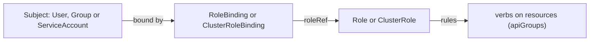

| Object | Scope | Purpose |
|---|---|---|
| Role | One namespace | Permissions on namespaced resources |
| ClusterRole | Cluster | Cluster-scoped resources, or reusable permission set |
| RoleBinding | One namespace | Grants a Role **or ClusterRole** inside that namespace |
| ClusterRoleBinding | Cluster | Grants a ClusterRole in all namespaces |

### Reading a rule

```yaml
rules:
  - apiGroups: ["apps"]                    # "" = core group (pods, services, configmaps, secrets)
    resources: ["deployments", "deployments/scale"]
    verbs: ["get", "list", "watch", "update", "patch"]
  - apiGroups: [""]
    resources: ["configmaps"]
    resourceNames: ["app-config"]          # restrict to one named object
    verbs: ["get"]
```

Common verbs: `get`, `list`, `watch`, `create`, `update`, `patch`, `delete`. Sub-resources have their own entries (`pods/log`, `pods/exec`). Find a resource's API group and verbs with `kubectl api-resources -o wide`.

### Sub-resources and verb traps

A verb on a parent resource does **not** grant access to its sub-resources. This is the most common source of "I added `get pods` but `kubectl logs` still says Forbidden":

| You want to... | API path | Required rule |
|---|---|---|
| List Pods | `GET /api/v1/pods` | `resources: ["pods"]`, `verbs: ["list"]` |
| Read a Pod's logs | `GET /api/v1/pods/<name>/log` | `resources: ["pods/log"]`, `verbs: ["get"]` |
| `exec` into a container | `POST /api/v1/pods/<name>/exec` | `resources: ["pods/exec"]`, `verbs: ["create"]` |
| `kubectl exec -- kubectl port-forward` | `POST /api/v1/pods/<name>/portforward` | `resources: ["pods/portforward"]`, `verbs: ["create"]` |
| Attach to a running container | `POST /api/v1/pods/<name>/attach` | `resources: ["pods/attach"]`, `verbs: ["create"]` |
| Scale a Deployment | `PUT /apis/apps/v1/.../scale` | `resources: ["deployments/scale"]` (or `deployments` with `update`) |

A quick verification recipe when an exam task asks for "this ServiceAccount can read logs":

```bash
kubectl auth can-i get pods/log -n dev --as=system:serviceaccount:dev:app-sa
```

### Common mistakes

- Forgetting `apps` as the API group. `pods` lives in `""` (core), but `deployments` lives in `apps`, and `networkpolicies` lives in `networking.k8s.io`. A rule with `apiGroups: [""]` and `resources: ["deployments"]` never matches anything.
- Writing `apiGroups: [""]` for a resource that actually needs a group. `kubectl api-resources` shows the right group in the `APIGROUP` column.
- Using `resources: ["pod"]` (singular). Use the **plural** form; singular is allowed in some URLs but not in RBAC rules.
- Binding a `ClusterRole` with a `RoleBinding`: the role's permissions apply only in that RoleBinding's namespace, but the role itself can still reference cluster-scoped resources - those will be denied.
- Adding a `RoleBinding` to a namespace without listing the subject's namespace. `--serviceaccount=dev:app-sa` means *ServiceAccount `app-sa` in namespace `dev`*. A subject without a namespace is silently treated as belonging to the binding's own namespace, which is rarely what you want.

### ⚡ Remember

**RBAC is additive: there are no deny rules. No matching rule means no access.**
**Parent verbs do not cover sub-resources - log/exec/portforward need their own rule.**

---

## 4.5 Role and RoleBinding

A Role grants permissions in a namespace.

```yaml
apiVersion: rbac.authorization.k8s.io/v1
kind: Role
metadata:
  name: pod-reader
  namespace: dev
rules:
  - apiGroups: [""]
    resources: ["pods"]
    verbs: ["get", "list"]
```

Bind it:

```yaml
apiVersion: rbac.authorization.k8s.io/v1
kind: RoleBinding
metadata:
  name: read-pods
  namespace: dev
subjects:
  - kind: ServiceAccount
    name: app-sa
    namespace: dev
roleRef:
  apiGroup: rbac.authorization.k8s.io
  kind: Role
  name: pod-reader
```

### Imperative

```bash
kubectl create role pod-reader --verb=get,list --resource=pods -n dev
kubectl create rolebinding read-pods \
  --role=pod-reader \
  --serviceaccount=dev:app-sa \
  -n dev
```

### Subjects: kind matters

A `RoleBinding` connects a Role/ClusterRole to one or more *subjects*. The three kinds you will see in CKAD:

| `kind` | Format in `--serviceaccount`/`--user`/`--group` | Typical exam use |
|---|---|---|
| `ServiceAccount` | `<namespace>:<name>` | "Let this Pod's identity do X" |
| `User` | Just a name (e.g. `jane`, `system:serviceaccount:dev:app-sa`) | "Let this human do X" |
| `Group` | A name (e.g. `system:authenticated`) | "Let everyone in this group do X" |

The subject's namespace only matters for `ServiceAccount`; `User` and `Group` are cluster-wide identities.

### Common mistakes

- Creating a `Role` and `RoleBinding` in the wrong namespace. Both must be in the namespace they protect; a binding in `default` does not grant access to Pods in `dev`.
- Forgetting the subject's namespace. `kubectl create rolebinding read-pods --role=pod-reader --serviceaccount=app-sa -n dev` creates a binding whose subject is "ServiceAccount `app-sa` in namespace `dev`" - if `app-sa` actually lives in `prod`, the binding matches no one.
- Confusing `Role` with `RoleBinding`. Editing the Role's `rules` changes what every binding of that Role grants. The binding is just the wire.
- Binding a `Role` (namespaced) with a `ClusterRoleBinding`. The API rejects this pairing at apply time. Use a `RoleBinding` for a `Role`.
- A `RoleBinding` that names a `ClusterRole` only grants the role's permissions in the binding's namespace, even if the `ClusterRole` would normally grant cluster-scoped access. The binding's scope is what counts.

### ⚡ Remember

**Role = permission definition. RoleBinding = attachment.**

## 4.6 ClusterRole and ClusterRoleBinding

A ClusterRole can define permissions for cluster-scoped resources or permissions that are usable across namespaces.

A ClusterRole can also be attached through a **RoleBinding**, in which case the permission is limited to that RoleBinding's namespace.

### Scope table

| Permission object | Binding | Effective scope |
|---|---|---|
| Role | RoleBinding | One namespace |
| Role | ClusterRoleBinding | Not a valid pairing |
| ClusterRole | RoleBinding | Bound namespace |
| ClusterRole | ClusterRoleBinding | Cluster-wide / cluster-scoped as defined by rules |

### Example

```yaml
apiVersion: rbac.authorization.k8s.io/v1
kind: ClusterRole
metadata:
  name: node-reader
rules:
  - apiGroups: [""]
    resources: ["nodes"]
    verbs: ["get", "list"]
```

### Imperative

```bash
kubectl create clusterrole node-reader --verb=get,list --resource=nodes
kubectl create clusterrolebinding read-nodes --clusterrole=node-reader --serviceaccount=dev:app-sa
kubectl create rolebinding view-in-dev --clusterrole=view --user=jane -n dev   # ClusterRole limited to one namespace
```

Resources from a named group use `resource.group`, for example `--resource=deployments.apps`.

### ⚡ Remember

Do not equate **ClusterRole** with automatically cluster-wide effective access. The binding determines where the permission applies.

### Mental model for the exam

- A `Role` is a *list of rules*. The list is namespaced by definition (most rule resources live in a namespace).
- A `ClusterRole` is also a list of rules. It can additionally reference cluster-scoped resources (`nodes`, `persistentvolumes`, `clusterrolebindings`).
- A `RoleBinding` says "use this list of rules, but only in this namespace."
- A `ClusterRoleBinding` says "use this list of rules, in every namespace plus for cluster-scoped resources."

If a task says "give this ServiceAccount read access to Pods in `dev` only", you need a `Role` (or a `ClusterRole` reused across namespaces) bound by a `RoleBinding` in `dev`. A `ClusterRoleBinding` would over-grant.

### Common mistakes

- Using `RoleBinding` (not `ClusterRoleBinding`) to attach a `ClusterRole` and assuming the role's permissions now apply cluster-wide. They apply only in the binding's namespace. The role *type* does not determine scope; the *binding* does.
- Confusing `RoleBinding` (namespaced) with `Role` (namespaced rules). `kubectl create rolebinding --clusterrole=view` is valid and grants `view` in that namespace; `kubectl create rolebinding --role=view` requires a Role called `view` in the same namespace.
- Assuming a built-in `ClusterRole` like `view` or `edit` already exists in a custom cluster. They ship by default, but `kubectl get clusterrole view` is the fastest check; if it is missing, recreate with `kubectl create clusterrole view --verb=get,list,watch --resource=...` (the YAML is long, copy from the docs).

## 4.7 Verify RBAC

Never assume an RBAC change worked.

```bash
kubectl auth can-i get pods -n dev
kubectl auth can-i list pods -n dev
kubectl auth can-i --list -n dev
kubectl auth can-i get pods \
  --as=system:serviceaccount:dev:app-sa \
  -n dev
```

### End-to-end RBAC workflow

```bash
kubectl create serviceaccount app-sa -n dev
kubectl create role pod-reader --verb=get,list --resource=pods -n dev
kubectl create rolebinding read-pods --role=pod-reader --serviceaccount=dev:app-sa -n dev
kubectl auth can-i list pods   -n dev --as=system:serviceaccount:dev:app-sa   # yes
kubectl auth can-i delete pods -n dev --as=system:serviceaccount:dev:app-sa   # no
kubectl set serviceaccount deployment/web app-sa -n dev
```

### ⚡ Remember

**Test the effective permission, not just the YAML.**

## 4.8 Admission control

Admission runs after authentication/authorization and before the object is persisted.

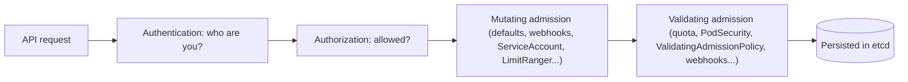

Admission can:

- **mutate/default** an object (mutating runs first)
- **validate and reject** an object (validating runs after mutation)

Relevant built-in/policy mechanisms include ResourceQuota, LimitRanger, ServiceAccount, Pod Security Admission, ValidatingAdmissionPolicy (CEL rules) and external validating/mutating webhooks.

The order matters: a mutating webhook can add a default `serviceAccountName` or storage class, and a validating webhook then runs against the **post-mutation** object. Built-in mutating plugins (`ServiceAccount`, `DefaultStorageClass`, `LimitRanger`) run before built-in validating plugins (`ResourceQuota`, `PodSecurity`), so a Pod that violates Pod Security can be rejected even if the request came in without a SecurityContext.

### ⚡ Remember

An object can be authenticated and authorized and still be rejected during admission.

## 4.9 Pod Security Admission

Pod Security Admission applies Pod Security Standards at the namespace level using labels such as:

```yaml
metadata:
  labels:
    pod-security.kubernetes.io/enforce: restricted
```

A Pod can be rejected because it violates the namespace's enforced security profile.

| Level | Meaning |
|---|---|
| `privileged` | Unrestricted |
| `baseline` | Blocks known privilege escalations (for example privileged containers, hostPath, host namespaces) |
| `restricted` | Hardened best practice: non-root, no privilege escalation, `drop: ["ALL"]`, seccomp `RuntimeDefault` |

| Mode | Effect on violation |
|---|---|
| `enforce` | Pod is rejected |
| `audit` | Recorded in the audit log |
| `warn` | Warning shown to the user |

```bash
kubectl label namespace dev pod-security.kubernetes.io/enforce=restricted
kubectl label namespace dev pod-security.kubernetes.io/warn=restricted
```

The hardened SecurityContext example in the next sections satisfies `restricted`. Note: with a Deployment, the rejection appears in the **ReplicaSet** events, not on the Deployment.

### Profile-by-profile: what each level rejects

The "block X" list is the part CKAD tasks actually test. Pick the level that matches the SecurityContext the task asks for:

| Field | `privileged` | `baseline` | `restricted` |
|---|---|---|---|
| `privileged: true` | allowed | **rejected** | **rejected** |
| `hostNetwork`, `hostPID`, `hostIPC` | allowed | **rejected** | **rejected** |
| `hostPath` volumes | allowed | restricted paths only | **rejected** |
| Containers with no `securityContext.runAsNonRoot` and image runs as root | allowed | allowed | **rejected** |
| `allowPrivilegeEscalation: true` (or unset) | allowed | allowed | **rejected** (must be `false`) |
| `capabilities` not dropped | allowed | allowed | **rejected** (must `drop: ["ALL"]`) |
| `seccompProfile.type` not `RuntimeDefault` or `Localhost` | allowed | allowed | **rejected** (must be one of these) |
| `runAsUser: 0` (root) | allowed | allowed | **rejected** |
| Adding capabilities beyond `NET_BIND_SERVICE` | allowed | allowed | **rejected** |

If a Pod is rejected with "violates PodSecurity", the error message names the field that failed and the profile that rejected it. Read the field, set the right value, retry.

### Common mistakes

- Confusing the three levels. `baseline` is "no obvious privilege escalation"; `restricted` is "no obvious privilege escalation **and** run as non-root with minimal capabilities." A task that says "satisfy the restricted profile" needs all of: `runAsNonRoot: true`, `allowPrivilegeEscalation: false`, `capabilities.drop: ["ALL"]`, `seccompProfile.type: RuntimeDefault`, and a non-root `runAsUser` (numeric).
- Using `privileged: true` to "fix" a permissions problem in a `restricted` namespace. It does not; the Pod is rejected outright.
- Forgetting that `hostPath` is rejected by both `baseline` (with restrictions) and `restricted` (always). Use a `PersistentVolumeClaim` instead.
- Setting `pod-security.kubernetes.io/warn=restricted` and `enforce=baseline`. The Pod is admitted (because `enforce` is the gate) but the user sees a warning. Useful for staged rollouts, not for CKAD tasks that ask for an enforced level.

### ⚡ Remember

When a Pod is rejected with a PodSecurity message, inspect the exact security requirement and fix the Pod accordingly.

## 4.10 Validating vs mutating admission

**Validating** admission checks and can reject.

**Mutating** admission can modify/default an incoming object before persistence. (Order: see the admission diagram above.)

### Where you meet them

| Mechanism | Type | What it does |
|---|---|---|
| ServiceAccount admission | Mutating | Sets the `default` ServiceAccount and token mount when unspecified |
| DefaultStorageClass | Mutating | Fills in the default `storageClassName` on a PVC |
| LimitRanger | Mutating + validating | Injects default requests/limits, then rejects values outside min/max |
| ResourceQuota | Validating | Rejects objects that would exceed the namespace quota |
| Pod Security Admission | Validating | Rejects Pods that violate the namespace's level |
| ValidatingAdmissionPolicy | Validating | Rejects objects that fail a CEL expression |
| Webhooks | Either | Call an external service that mutates or validates |

The error text tells you who rejected the object (`violates PodSecurity`, `exceeded quota`, `admission webhook ... denied the request`). Fix the object to satisfy the rule; more RBAC permissions do not bypass admission.

### ⚡ Remember

**Mutating changes. Validating decides.**

---

## 4.11 SecurityContext

SecurityContext controls security properties at Pod or container scope.

### Common fields

| Field | Scope |
|---|---|
| `runAsUser` | Pod or container |
| `runAsGroup` | Pod or container |
| `runAsNonRoot` | Pod or container |
| `fsGroup` | Pod |
| `seccompProfile` | Pod or container |
| `allowPrivilegeEscalation` | Container |
| `readOnlyRootFilesystem` | Container |
| `capabilities` | Container |
| `privileged` | Container |

Container-level security settings override equivalent Pod-level settings:

```yaml
spec:
  securityContext:
    runAsUser: 1000        # Pod-level default for all containers
  containers:
    - name: app
      image: busybox:1.36
      command: ["sh", "-c", "sleep 3600"]
      securityContext:
        runAsUser: 2000    # wins for this container
```

### Hardened example

```yaml
spec:
  securityContext:
    runAsUser: 1000
    runAsGroup: 1000
    runAsNonRoot: true
    fsGroup: 1000
    seccompProfile:
      type: RuntimeDefault
  containers:
    - name: app
      image: busybox:1.36
      command: ["sh", "-c", "sleep 3600"]
      securityContext:
        allowPrivilegeEscalation: false
        readOnlyRootFilesystem: true
        capabilities:
          drop: ["ALL"]
```

Verify user inside the container:

```bash
kubectl exec <pod> -- id
```

### ⚡ Remember

Know **which level owns the field** and which container-level values override Pod-level values.

### Pod-level vs container-level fields at a glance

A field is valid at Pod level only, container level only, or both. Putting it at the wrong level is silently ignored, which is the worst kind of mistake:

| Field | Pod-level | Container-level | Notes |
|---|---|---|---|
| `runAsUser`, `runAsGroup` | yes | yes | Container overrides Pod |
| `runAsNonRoot` | yes | yes | Container overrides Pod |
| `fsGroup` | yes | no | Pod-level only; sets the group on volume mounts |
| `seccompProfile` | yes | yes | Container overrides Pod |
| `supplementalGroups` | yes | no | Pod-level only |
| `sysctls` | yes | no | Pod-level only; some are "unsafe" and need an annotation to allow |
| `allowPrivilegeEscalation` | no | yes | Container only |
| `readOnlyRootFilesystem` | no | yes | Container only |
| `capabilities` | no | yes | Container only |
| `privileged` | no | yes | Container only |

A common CKAD scenario: "the application's `volumes` mount returns `Permission denied`." That is almost always a missing `fsGroup` on the Pod, not a missing `runAsUser`. `fsGroup` makes the kubelet set the group ownership of the mounted volume to the given GID, so a container running as non-root can still read and write the volume.

### What `privileged: true` actually means

It puts the container in the same cgroup as the host, gives it all capabilities, and lets it see host devices. It is required for some networking and storage drivers but is **rarely** needed by application code. The `restricted` Pod Security profile rejects it; `baseline` rejects it on most setups. If a task says "container needs to access the host network", prefer `hostNetwork: true` on the Pod over `privileged: true`.

### ⚡ Remember

**Pick the level that owns the field. `fsGroup` lives on the Pod, `capabilities` on the container.**

## 4.12 Linux capabilities and privilege

Linux capabilities split privileged operations into smaller permissions.

A common hardening pattern is:

```yaml
securityContext:
  capabilities:
    drop: ["ALL"]
```

Add only a capability the application actually needs:

```yaml
securityContext:
  capabilities:
    add: ["NET_BIND_SERVICE"]
```

Use `privileged: true` only when the task actually requires it.

Examples of what capabilities gate: `NET_BIND_SERVICE` (listen on ports below 1024 as non-root), `NET_ADMIN` (change network configuration), `SYS_TIME` (set the system clock). The Pod Security `restricted` level requires dropping `ALL` and only allows adding back `NET_BIND_SERVICE`; `privileged: true` is blocked by both `baseline` and `restricted`.

### Common mistakes

- Writing `add: ["NET_BIND_SERVICE"]` alone. Capabilities are evaluated as a *final set*: the container starts with the Docker default set, and `drop: ["ALL"]` is what produces a clean baseline. Use `drop: ["ALL"]` plus `add: ["NET_BIND_SERVICE"]` if you only need the one.
- Trying to add a capability that is **not** in the allowed set for the namespace's Pod Security level. `restricted` only allows `NET_BIND_SERVICE` to be added back. To use `SYS_ADMIN` (for example for a network plugin DaemonSet), the namespace must be `privileged` or `baseline` at minimum.
- Forgetting that a non-root user cannot bind to ports below 1024 even with `NET_BIND_SERVICE` set on capabilities only by default; in practice the capability lets the bind succeed, but verify with `kubectl exec <pod> -- id` and a port-bind test.
- Using `privileged: true` to "fix" a permissions problem. That bypasses every other capability and security context field. Diagnose the underlying missing capability first; reach for `privileged` only when a CSI driver or CNI requires it.

### ⚡ Remember

**Least privilege is the goal.**

## 4.13 CRDs, Custom Resources and Operators

### CRD

A **CustomResourceDefinition** extends the Kubernetes API with a new resource type.

### Minimal CRD example

```yaml
apiVersion: apiextensions.k8s.io/v1
kind: CustomResourceDefinition
metadata:
  name: databases.example.com
spec:
  group: example.com
  scope: Namespaced
  names:
    plural: databases
    singular: database
    kind: Database
    shortNames:
      - db
  versions:
    - name: v1
      served: true
      storage: true
      schema:
        openAPIV3Schema:
          type: object
          properties:
            spec:
              type: object
              properties:
                engine:
                  type: string
```

### Custom Resource

A Custom Resource is an actual object created from the CRD:

```yaml
apiVersion: example.com/v1
kind: Database
metadata:
  name: orders-db
  namespace: dev
spec:
  engine: postgres
```

### Operator

An Operator is a controller that watches custom resources and reconciles the cluster to implement domain-specific behavior.

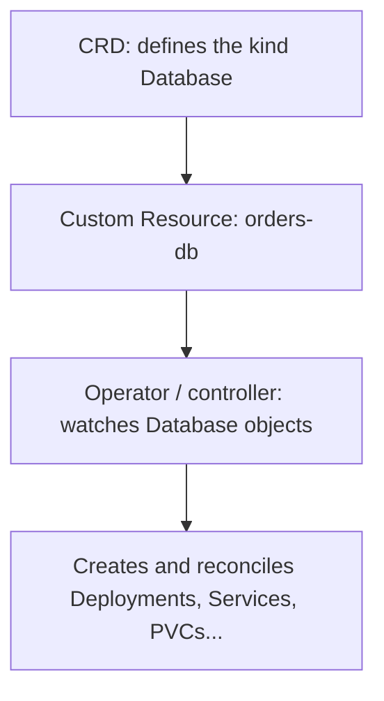

Create the CRD first; wait until it is established, then create Custom Resources of that kind.

### Discovery workflow

```bash
kubectl get crd
kubectl api-resources
kubectl explain databases
kubectl explain databases.spec --recursive
kubectl get databases -n dev        # or the shortName: kubectl get db -n dev
kubectl describe database orders-db -n dev
kubectl get crd databases.example.com -o yaml
```

### ⚡ Remember

**CRD = resource type. CR = object. Operator = controller/reconciliation logic.**

# 5. Storage & State Persistence

## 5.1 Container storage basics

A container's writable layer belongs to that container instance. Data stored only there can disappear when the container is replaced.

Kubernetes volumes provide a filesystem with a different lifecycle. The right way to think about volumes:

- A **Volume** is a directory mounted into one or more containers in a Pod, with a lifetime chosen by its type (per-Pod, per-node, per-ConfigMap, ...).
- A **PersistentVolume (PV)** is a cluster-scoped resource that represents a piece of real storage.
- A **PersistentVolumeClaim (PVC)** is a namespaced request for storage. The cluster binds a PVC to a PV; the Pod then mounts the PVC.

Volumes are a Pod-level concept. PVs and PVCs are how durable storage is described and bound. PVCs travel with the workload; PVs are tied to the storage backend.

### Volume types you will meet

| Volume | Lifetime | Typical use |
|---|---|---|
| `emptyDir` | The Pod | Scratch space, sharing files between containers |
| `configMap` / `secret` | The object | Inject config files or credentials |
| `downwardAPI` | The Pod | Expose Pod metadata as files |
| `projected` | The Pod | Combine several sources (ConfigMap, Secret, token) in one mount |
| `hostPath` | The node | Read/write a node directory; practice or node agents only |
| `persistentVolumeClaim` | Independent of the Pod | Durable application data |

`hostPath` ties a Pod to one node's filesystem and is blocked by the Pod Security `baseline` and `restricted` levels, so avoid it in real workloads.

### Projected volume: several sources in one directory

```yaml
volumes:
  - name: all-in-one
    projected:
      sources:
        - configMap:
            name: app-config
        - secret:
            name: db-creds
        - downwardAPI:
            items:
              - path: labels
                fieldRef:
                  fieldPath: metadata.labels
```

Every source appears as files under the single mount path. Keys must not collide.

### ⚡ Remember

**The container filesystem is disposable. A volume is data with a lifetime you choose.**

---

## 5.2 Ephemeral volumes

Ephemeral storage follows the Pod lifecycle.

### `emptyDir`

```yaml
volumes:
  - name: shared
    emptyDir: {}
```

Mount:

```yaml
volumeMounts:
  - name: shared
    mountPath: /shared
```

`emptyDir` survives container restarts but is removed when the Pod is deleted.

```yaml
volumes:
  - name: cache
    emptyDir:
      medium: Memory      # optional: tmpfs
      sizeLimit: 100Mi    # optional
```

### ⚡ Remember

**emptyDir = shared scratch space for a Pod.**

## 5.3 Persistent Volumes

A PersistentVolume (PV) represents persistent storage available to the cluster.

### Example: hostPath PV

```yaml
apiVersion: v1
kind: PersistentVolume
metadata:
  name: app-pv
spec:
  capacity:
    storage: 10Gi
  accessModes:
    - ReadWriteOnce
  persistentVolumeReclaimPolicy: Retain
  hostPath:
    path: /mnt/data/app
```

`hostPath` is useful for local practice but is generally not the preferred production persistence mechanism for replicated applications.

| Reclaim policy | After the PVC is deleted |
|---|---|
| `Retain` | PV keeps its data and becomes `Released`; an admin must clean it up before reuse |
| `Delete` | PV and the backing storage are deleted (the usual default for dynamically provisioned volumes) |

| PV status | Meaning |
|---|---|
| `Available` | Free, not yet claimed |
| `Bound` | Bound to a PVC |
| `Released` | PVC deleted, PV not yet reclaimed |
| `Failed` | Automatic reclamation failed |

### ⚡ Remember

**A PV is real storage and is cluster-scoped: it has no namespace.**

## 5.4 Persistent Volume Claims

A PVC is an application request for storage. The PVC is namespaced and follows the application; the PV it binds to is cluster-scoped and follows the storage.

```yaml
apiVersion: v1
kind: PersistentVolumeClaim
metadata:
  name: app-data
spec:
  accessModes:
    - ReadWriteOnce
  resources:
    requests:
      storage: 5Gi
```

### Binding basics

A PVC can bind to a compatible PV when the storage class, capacity and access mode requirements can be satisfied. The match is evaluated by the PV controller in this order:

1. The PV's `storageClassName` must equal the PVC's `storageClassName`. A `nil` StorageClass on the PVC is filled in by the cluster's default; setting `storageClassName: ""` explicitly opts out.
2. `accessModes` must overlap. Requesting `ReadWriteOnce` against a PV that only offers `ReadOnlyMany` does not bind.
3. PV `capacity` must be greater than or equal to PVC `resources.requests.storage`.
4. `volumeMode` (Filesystem vs Block) must match.

**Trap:** if the cluster has a default StorageClass, a PVC with **no** `storageClassName` is assigned that class and will not bind to a classless, manually created PV. To bind to a pre-created PV, set the **same** `storageClassName` on both (as in the next example), or set `storageClassName: ""` on the PVC to disable dynamic provisioning.

### After binding: what happens when you delete the PVC

| PV `persistentVolumeReclaimPolicy` | When PVC is deleted |
|---|---|
| `Retain` | PV keeps its data and becomes `Released`; an admin must remove the `claimRef` and clean up before it is `Available` again |
| `Delete` | PV and the backing storage are deleted automatically (the usual default for dynamically provisioned volumes) |
| `Recycle` (deprecated) | Basic scrub; removed in newer clusters - do not use |

### ⚡ Remember

**PV = storage resource. PVC = storage request.**

### Common mistakes

- Treating `storage` as a "max size" you can fill later. The PVC `requests.storage` is a **reservation**: the PV is bound at that capacity. A 5 Gi request on a 10 Gi PV uses only 5 Gi (most filesystems) but the PVC cannot grow into the rest. If you need 10 Gi, request 10 Gi.
- Believing access modes can be widened on an existing PV. `ReadWriteOnce` cannot be promoted to `ReadWriteMany`; the PV is fixed at creation. The PVC's `accessModes` is also immutable after the PVC is created (resize is the only field that can change).
- Setting `storageClassName: ""` on a PVC and expecting it to bind to a default-class PV. An empty string means **no** class, which is a deliberate opt-out from dynamic provisioning; the PVC will only bind to a PV that also has no class.
- Forgetting that a deleted PVC goes to `Released` (with `Retain`), and the PV is unavailable for re-binding until an admin removes the `claimRef` and re-applies the PV (or the admin uses `--edit` to set the PV back to `Available`). A `Released` PV does **not** auto-bind to a new PVC even if the class, mode, and capacity match.
- A PVC's `volumeName` (when set explicitly) names a specific PV. If that PV is in a different zone from where the Pod is scheduled, the Pod stays `Pending` with `FailedMount`. The fix is to delete the PVC and let dynamic provisioning pick a PV in the right zone, or use `WaitForFirstConsumer` so binding is delayed until the Pod is scheduled.

## 5.5 PV -> PVC -> Pod chain

### End-to-end example

```yaml
apiVersion: v1
kind: PersistentVolume
metadata:
  name: app-pv
spec:
  capacity:
    storage: 10Gi
  accessModes: ["ReadWriteOnce"]
  persistentVolumeReclaimPolicy: Retain
  storageClassName: manual
  hostPath:
    path: /mnt/data/app
---
apiVersion: v1
kind: PersistentVolumeClaim
metadata:
  name: app-data
spec:
  storageClassName: manual
  accessModes: ["ReadWriteOnce"]
  resources:
    requests:
      storage: 5Gi
---
apiVersion: v1
kind: Pod
metadata:
  name: app
spec:
  containers:
    - name: app
      image: nginx:1.27
      volumeMounts:
        - name: data
          mountPath: /data
  volumes:
    - name: data
      persistentVolumeClaim:
        claimName: app-data
```

The relationship is:

```mermaid
flowchart LR
    SC["StorageClass (defines a provisioner + reclaim policy)"] -.->|"dynamic provisioning"| PV
    PV["PersistentVolume (cluster-scoped, real storage)"] <-->|"binds on capacity / accessMode / class match"| PVC["PersistentVolumeClaim (request, namespaced)"]
    PVC -->|"mounted by"| POD["Pod (volumeMount)"]
    PV2["(or pre-created PV)"] -.->|"can bind if match"| PVC
```

The match checks three things: `storageClassName`, `accessModes`, and that PV `capacity >= PVC.resources.requests.storage`. Volume mode (`Filesystem` vs `Block`) and `volumeBindingMode` (`Immediate` vs `WaitForFirstConsumer`) also matter; a mismatch is a typical `Pending` cause (see §9.14).

```text
PV <-binds-> PVC <-mounted by-> Pod
```

```bash
kubectl get pv,pvc          # PV and PVC should both show Bound
kubectl exec app -- sh -c 'echo hi > /data/test.txt && ls /data'
```

## 5.6 Access modes

Access modes describe how a volume can be mounted:

| Mode | Short | Meaning |
|---|---|---|
| `ReadWriteOnce` | RWO | Read-write by **one node** (several Pods on that node can share it) |
| `ReadOnlyMany` | ROX | Read-only by many nodes |
| `ReadWriteMany` | RWX | Read-write by many nodes (needs NFS/CephFS-style storage) |
| `ReadWriteOncePod` | RWOP | Read-write by exactly **one Pod** in the whole cluster |

A PVC binds only to a PV that offers the requested mode, so a mismatch is a classic cause of a `Pending` PVC. The mode is a capability, not a restriction inside the Pod; use `readOnly: true` on the mount when the app must not write. Support depends on the storage implementation.

### `volumeMode`

| `volumeMode` | Meaning |
|---|---|
| `Filesystem` (default) | Mounted as a directory; kubelet formats the volume on first use |
| `Block` | Exposed as a raw block device; the application reads/writes at the device level (databases sometimes need this) |

`kubectl describe pvc` shows both `accessModes` and `volumeMode`. A `Filesystem` PVC binding to a `Block` PV (or vice versa) is a common `Pending` cause.

### ⚡ Remember

Do not assume an arbitrary storage backend supports every access mode.

## 5.7 StorageClass

A StorageClass defines a class of dynamically provisioned storage.

### Example

```yaml
apiVersion: storage.k8s.io/v1
kind: StorageClass
metadata:
  name: fast
provisioner: example.com/csi
reclaimPolicy: Delete
volumeBindingMode: WaitForFirstConsumer
```

A PVC can request it:

```yaml
spec:
  storageClassName: fast
  resources:
    requests:
      storage: 10Gi
```

### Important fields

- `provisioner` - storage provisioner/driver.
- `reclaimPolicy` - commonly `Delete` or `Retain`.
- `volumeBindingMode` - `Immediate` or `WaitForFirstConsumer`.

### `WaitForFirstConsumer`

Binding/provisioning waits until a Pod using the PVC is scheduled, which can help topology-aware storage placement.

#### How `WaitForFirstConsumer` vs `Immediate` differ

| Binding mode | When PV is created and bound |
|---|---|
| `Immediate` (default) | As soon as the PVC is created - even before any Pod uses it |
| `WaitForFirstConsumer` | Only when a Pod that references the PVC is scheduled; the scheduler can then pick a zone/node that offers the volume |

`WaitForFirstConsumer` is required for topology-aware provisioning (zonal volumes, local SSDs); otherwise the volume can land in a different zone than the Pod and the Pod will not start.

### Default StorageClass

```yaml
metadata:
  name: fast
  annotations:
    storageclass.kubernetes.io/is-default-class: "true"
```

```bash
kubectl get storageclass     # the default is marked (default)
```

A cluster can have only one default StorageClass at a time. A PVC that has `storageClassName: <not-the-default>` is bound to that class only; a PVC that has `storageClassName: ""` opts out of dynamic provisioning and will only bind to a pre-created, classless PV.

### Complete PVC that uses a StorageClass

```yaml
apiVersion: v1
kind: PersistentVolumeClaim
metadata:
  name: fast-data
spec:
  storageClassName: fast
  accessModes: ["ReadWriteOnce"]
  resources:
    requests:
      storage: 10Gi
```

With `WaitForFirstConsumer`, this PVC stays `Pending` until a Pod that uses it is scheduled. That is normal.

### Disable dynamic provisioning

An explicit:

```yaml
storageClassName: ""
```

prevents a default StorageClass from being selected for that PVC.

### ⚡ Remember

**StorageClass = provisioning policy/class, not the storage data itself.**

### Common mistakes

- Marking two StorageClasses as default. There is one annotation `storageclass.kubernetes.io/is-default-class: "true"`, and Kubernetes tolerates only one true default at a time. The second annotation is ignored. Pick one and remove the other; PVCs without `storageClassName` go to the latest true default.
- Forgetting that `WaitForFirstConsumer` keeps the PVC `Pending` until a Pod is scheduled. A standalone `kubectl get pvc` then shows `Pending` and looks like a failure, but it is normal: bind happens on first use. The `kubectl describe pvc` event reads `waiting for first consumer to be created before binding`.
- Choosing `Immediate` for a zonal volume. The PV is created in a zone at PVC creation time, not at Pod schedule time. If the Pod is then scheduled to a different zone, the volume mount fails. Always use `WaitForFirstConsumer` for zonal or local storage.
- A PVC that requests `storageClassName: ""` on a cluster with a default class. The empty string opts out of dynamic provisioning; the PVC will only bind to a pre-created, classless PV. The behavior is "do not provision," not "use the default."

### What the default StorageClass actually does

- A PVC with no `storageClassName` is filled in with the cluster's default at admission time.
- A PVC with `storageClassName: <name>` uses that specific class.
- A PVC with `storageClassName: ""` opts out of dynamic provisioning entirely.

If the cluster has no default StorageClass, a PVC with no `storageClassName` stays `Pending` and `kubectl describe pvc` says "no storage class is set." Adding `storageClassName: <existing-class>` or marking an existing class as default both fix it.

## 5.8 Dynamic provisioning

With dynamic provisioning, a PVC can cause a compatible PV/backing storage to be created automatically through the StorageClass provisioner.

```mermaid
flowchart LR
    POD[Pod] -->|claimName| PVC["PVC (storageClassName: fast)"]
    PVC --> SC["StorageClass fast"] --> PROV["Provisioner / CSI driver"] --> PV["New PV created automatically"]
    PV -->|binds| PVC
```

You never write a PV by hand. With `reclaimPolicy: Delete` the PV and the underlying disk disappear when the PVC is deleted, so use `Retain` for data you cannot lose. Verify with `kubectl get pvc,pv,storageclass`.

### PVC stuck in Pending

See the **PVC Pending** entry in the Troubleshooting chapter for the symptom -> cause -> fix table.

### ⚡ Remember

**PVC + StorageClass = a PV created for you.**

## 5.9 StatefulSets, Headless Services and storage

StatefulSets are for workloads where each instance needs a **stable identity** and usually its **own storage**.

| | Deployment | StatefulSet |
|---|---|---|
| Pod names | Random suffix | Ordered: `db-0`, `db-1`, `db-2` |
| Startup / scale | Parallel | Ordered by default (`OrderedReady`) |
| Storage | Shared PVC or none | One PVC per Pod via `volumeClaimTemplates` |
| Network identity | Via Service only | Stable per-Pod DNS through a headless Service |

A **headless Service** (`clusterIP: None`) has no virtual IP; DNS returns the individual Pod records instead.

```mermaid
flowchart TD
    subgraph HS["Headless Service db - clusterIP: None"]
        DNS["DNS: db-0.db.dev.svc.cluster.local<br/>db-1.db.dev.svc.cluster.local<br/>db-2.db.dev.svc.cluster.local"]
    end
    HS -.->|"returns A records per Pod"| CLIENT["Client resolves db-0.db, db-1.db, db-2.db explicitly"]
    CLIENT --> P0["Pod db-0"] --> PVC0["PVC data-db-0"] --> PV0[PV] --> S0[(Storage)]
    CLIENT --> P1["Pod db-1"] --> PVC1["PVC data-db-1"] --> PV1[PV] --> S1[(Storage)]
    CLIENT --> P2["Pod db-2"] --> PVC2["PVC data-db-2"] --> PV2[PV] --> S2[(Storage)]
    STS["StatefulSet db (serviceName: db)"] --> P0
    STS --> P1
    STS --> P2
```

The key difference from a normal Service: a headless Service does **not** load-balance. The client is expected to know which Pod it wants (`db-0.db`, `db-1.db`) and reach it directly. That is why most database clients (PostgreSQL, MySQL) work well with a headless Service: they can target a primary, fail over to a replica, and reconnect to a stable name.

### Ordered lifecycle (default `podManagementPolicy: OrderedReady`)

A StatefulSet creates, updates and terminates Pods **one at a time, in ordinal order**. `web-1` does not start until `web-0` is `Ready`; on a scale-down, the highest-ordinal Pod is terminated first. This matters for clustered software (etcd, ZooKeeper, Kafka) where joining members must contact existing peers by stable name.

```mermaid
sequenceDiagram
    participant STS as StatefulSet controller
    participant P0 as Pod web-0
    participant P1 as Pod web-1
    participant P2 as Pod web-2
    STS->>P0: create
    P0-->>STS: Ready
    STS->>P1: create
    P1-->>STS: Ready
    STS->>P2: create
    P2-->>STS: Ready
    Note over STS: scale-down reverses the order
```

| `podManagementPolicy` | Behaviour |
|---|---|
| `OrderedReady` (default) | Strict one-at-a-time, must be `Ready` before the next |
| `Parallel` | All Pods created/terminated at once, like a Deployment. Use only when the workload is fine with parallel membership changes |

### Complete example

```yaml
apiVersion: v1
kind: Service
metadata:
  name: db
spec:
  clusterIP: None
  selector:
    app: db
  ports:
    - name: tcp
      port: 80
---
apiVersion: apps/v1
kind: StatefulSet
metadata:
  name: db
spec:
  serviceName: db
  replicas: 3
  selector:
    matchLabels:
      app: db
  template:
    metadata:
      labels:
        app: db
    spec:
      containers:
        - name: db
          image: nginx:1.27
          volumeMounts:
            - name: data
              mountPath: /data
  volumeClaimTemplates:
    - metadata:
        name: data
      spec:
        accessModes: ["ReadWriteOnce"]
        resources:
          requests:
            storage: 5Gi
```

Each Pod gets its own PVC (`<template>-<statefulset>-<ordinal>`):

```text
data-db-0
data-db-1
data-db-2
```

Stable DNS: `db-0.db.<namespace>.svc.cluster.local`.

```bash
kubectl get pods -l app=db
kubectl get pvc
kubectl scale statefulset db --replicas=5
kubectl run tmp --rm -it --restart=Never --image=busybox:1.36 -- nslookup db-0.db
```

By default, PVCs created by a StatefulSet are **not** deleted when Pods are scaled down or the StatefulSet is deleted (an optional `persistentVolumeClaimRetentionPolicy` can change this). The `serviceName` field must name the headless Service.

### Common mistakes

- Forgetting `serviceName`. The StatefulSet API requires `spec.serviceName` and refuses to create the StatefulSet without it. The value must be a Service that already exists in the same namespace and has `clusterIP: None`.
- Assuming the `volumeClaimTemplates` name is the final PVC name. The StatefulSet controller appends `-<statefulset-name>-<ordinal>`, so a template named `data` produces `data-db-0`, `data-db-1`, and so on. A Pod must mount `data-db-0`, not `data`.
- Scaling a StatefulSet down and expecting the PVC to follow the Pod. By default (`persistentVolumeClaimRetentionPolicy.whenDeleted: Retain` and `whenScaled: Retain`), the PVCs remain. If the cluster uses `Delete`, deleting a Pod also deletes its PVC. Verify with `kubectl get pvc` after a scale-down.
- Treating a StatefulSet as a "Deployment with stable names". The two are not interchangeable: StatefulSets have ordered startup (`OrderedReady`), per-Pod identity, and one PVC per Pod. Use a Deployment for stateless replicas; use a StatefulSet for clustered software (etcd, ZooKeeper, Kafka) and database primaries/replicas.
- Trying to use `kubectl set image` with the wrong container name. A StatefulSet Pod template has one container in most cases, but the API still requires the right name. Use `kubectl get statefulset <n> -o jsonpath='{.spec.template.spec.containers[*].name}'` to confirm.

### Stable identity, in practice

The combination is what makes a StatefulSet useful, not any single field:

| What | Where it comes from |
|---|---|
| Stable hostname | `<pod-name>.<service-name>.<namespace>.svc.cluster.local` (e.g. `db-0.db.dev.svc.cluster.local`) |
| Stable Pod name | `db-0`, `db-1`, `db-2` (never re-used by a different Pod) |
| Stable storage | One PVC per Pod, named `<claim-template-name>-<statefulset-name>-<ordinal>` |
| Ordered operations | Default `podManagementPolicy: OrderedReady` |

A normal Service's `ClusterIP` does not help here: it load-balances across all Pods. The headless Service's per-Pod DNS is what makes `db-0` resolve to that one Pod's IP.

### ⚡ Remember

**Deployment = interchangeable replicas. StatefulSet = stable name + stable per-Pod storage + ordered management.**

# 6. Application Deployment

## 6.1 Deployment strategies at a glance

```mermaid
flowchart LR
    subgraph CN["Canary"]
        direction TB
        s2["Service selector: app=web"] --> st["9 x stable v1"]
        s2 --> ca["1 x canary v2"]
    end
    subgraph BG["Blue/Green"]
        direction TB
        s1["Service selector: version=blue"] --> b1["3 x blue v1"]
        s1 -.->|"patch selector: version=green"| g1["3 x green v2"]
    end
    subgraph RC["Recreate"]
        direction TB
        c1["3 x v1"] --> c2["0 Pods (downtime)"] --> c3["3 x v2"]
    end
    subgraph RU["RollingUpdate"]
        direction TB
        r1["3 x v1"] --> r2["2 x v1 + 1 x v2"] --> r3["1 x v1 + 2 x v2"] --> r4["3 x v2"]
    end
```

| Strategy | Built-in? | Downtime | Rollback |
|---|---|---|---|
| RollingUpdate | Deployment `strategy.type` (default) | No | `kubectl rollout undo` |
| Recreate | Deployment `strategy.type` | Yes | `kubectl rollout undo` |
| Blue/Green | Pattern: 2 Deployments + Service selector | No | Switch selector back |
| Canary | Pattern: 2 Deployments + shared Service selector | No | Scale canary to 0 |

### How to choose (CKAD-style)

Read the task for one of these signals and match the strategy:

| Task says... | Pick | Why |
|---|---|---|
| "No downtime" / "zero-downtime deploy" | `RollingUpdate` with `maxSurge: 1`, `maxUnavailable: 0` | Guarantees `replicas` Pods stay Ready |
| "Old and new cannot coexist" (schema, RWO volume, single-instance license) | `Recreate` | Only strategy that fully replaces before bringing up new |
| "Instant cutover" / "switch traffic atomically" / "rollback by flipping back" | Blue/Green | Two Deployments + a Service selector change does it in one command |
| "Gradual rollout to a small subset" / "test in production with 5-10% of users" | Canary | Two Deployments, same Service selector; replica count is the share |
| "Update the image and keep all replicas serving" | `RollingUpdate` (default) | You almost never need to specify a strategy for the default behavior |

### Common mistakes

- Choosing blue/green when the task asks for "no downtime"; blue/green has no downtime either, but it doubles resource use. If the cluster is tight on capacity, `RollingUpdate` is safer.
- Forgetting that canary traffic is split **by replica count**. A canary Deployment with 1 replica behind a Service with 10 stable Pods gets roughly 1/11 of the traffic, not 1%.
- A blue/green Service selector switch is permanent. "Reverting" means flipping the selector back - keep the old Deployment around until you confirm the new version works.
- Setting `maxSurge: 0` and `maxUnavailable: 0` at the same time. The Deployment cannot make progress, and `kubectl rollout` will hang.

### ⚡ Remember

**Pick the strategy from the requirement: downtime acceptable -> Recreate; gradual replacement -> RollingUpdate; instant switch -> blue/green; small traffic share -> canary.**

---

## 6.2 Rolling updates

Deployments normally use a `RollingUpdate` strategy.

```yaml
strategy:
  type: RollingUpdate
  rollingUpdate:
    maxSurge: 25%
    maxUnavailable: 25%
```

### Key behavior

- `maxSurge` controls how many Pods above the desired count can exist during the update.
- `maxUnavailable` controls how many desired Pods may be unavailable during the update.
- Both may be integer counts or percentages.
- Both cannot be `0` at the same time.

| Field | Default |
|---|---|
| `maxSurge` | 25% |
| `maxUnavailable` | 25% |
| `minReadySeconds` | 0 |
| `revisionHistoryLimit` | 10 |
| `progressDeadlineSeconds` | 600 |

### How the two parameters interact

The Deployment controller computes the upper and lower bound for **total** Pod count at any moment:

```mermaid
flowchart LR
    subgraph OLD["Old ReplicaSet v1"]
        O1[v1] --- O2[v1] --- O3[v1]
    end
    OLD -->|scale up by maxSurge| MID["Mix: 3 x v1 + 1 x v2 (maxSurge=1, maxUnavailable=0)"]
    MID --> MID2["Mix: 2 x v1 + 2 x v2"]
    MID2 --> MID3["Mix: 1 x v1 + 3 x v2"]
    MID3 --> NEW["New ReplicaSet v2 (3 pods)"]
```

The "current" pod count is constrained by:

```text
desired - maxUnavailable <= current <= desired + maxSurge
```

So with `replicas: 3` and the defaults (`maxSurge: 25%`, `maxUnavailable: 25%`) the rollout is allowed to run between `3` and `4` Pods, replacing one at a time. Common presets:

| Preset | Trade-off |
|---|---|
| `maxSurge: 1`, `maxUnavailable: 0` | Strict zero-downtime: always run >= `replicas` Pods, but temporarily need cluster room for `replicas + 1` |
| `maxSurge: 0`, `maxUnavailable: 1` | No extra capacity needed, but `replicas - 1` is briefly serving traffic |
| `maxSurge: 25%`, `maxUnavailable: 25%` | Default; balanced |
| `maxSurge: 0`, `maxUnavailable: 0` | **Rejected** - the controller would have no room to make progress |

### Commands

```bash
kubectl create deployment web --image=nginx:1.27 --replicas=3
kubectl set image deployment/web nginx=nginx:1.28     # container name = "nginx"
kubectl rollout status deployment/web
kubectl get rs                                         # old RS scaled down, new RS scaled up
kubectl rollout history deployment/web
kubectl rollout undo deployment/web
```

Only changes to the **Pod template** create a new revision; scaling does not. Verify the container name first with `kubectl get deploy web -o jsonpath='{.spec.template.spec.containers[*].name}'`.

Zero-downtime tuning example:

```yaml
strategy:
  type: RollingUpdate
  rollingUpdate:
    maxSurge: 1
    maxUnavailable: 0
```

### ⚡ Remember

**RollingUpdate replaces old Pods gradually.**

## 6.3 Recreate strategy and rollout controls

`Recreate` stops the old Pods before creating the new ones.

```yaml
strategy:
  type: Recreate
```

Useful commands:

```bash
kubectl rollout pause deployment/web
kubectl rollout resume deployment/web
kubectl rollout restart deployment/web
kubectl scale deployment/web --replicas=5
kubectl edit deployment/web
kubectl rollout history deployment/web --revision=2
kubectl rollout undo deployment/web --to-revision=2
```

### When to choose Recreate

Use it when two versions must never run together: a schema change the old code cannot read, a `ReadWriteOnce` volume only one Pod may mount, or a licence that allows a single instance. The trade-off is downtime between the last old Pod stopping and the first new Pod becoming Ready.

`rollout pause` is useful with either strategy: make several edits (image, env, resources) while paused, then `rollout resume` to apply them as a single rollout.

### ⚡ Remember

**RollingUpdate = overlap possible. Recreate = old version goes away before new version starts.**

## 6.4 Rollbacks and revision reasoning

Deployment revisions represent previous Pod-template versions.

```bash
kubectl rollout history deployment/web
kubectl rollout history deployment/web --revision=2
kubectl rollout undo deployment/web --to-revision=2
```

Prefer an explicit revision when the task specifies which revision to restore.

### Change cause

Do not rely on the old `--record` habit; it was **removed in Kubernetes 1.21**. Record change information with the annotation that `rollout history` displays:

```bash
kubectl annotate deployment/web kubernetes.io/change-cause="upgrade to nginx 1.28"
kubectl rollout history deployment/web
```

### ⚡ Remember

`rollout undo` returns to the previous revision; add `--to-revision=<n>` when the task names one.

## 6.5 Blue/Green deployment

Blue/green keeps two versions available and switches Service selection from one to the other.

### Complete example

```yaml
apiVersion: apps/v1
kind: Deployment
metadata:
  name: web-blue
spec:
  replicas: 3
  selector:
    matchLabels:
      app: web
      version: blue
  template:
    metadata:
      labels:
        app: web
        version: blue
    spec:
      containers:
        - name: nginx
          image: nginx:1.27
---
apiVersion: apps/v1
kind: Deployment
metadata:
  name: web-green
spec:
  replicas: 3
  selector:
    matchLabels:
      app: web
      version: green
  template:
    metadata:
      labels:
        app: web
        version: green
    spec:
      containers:
        - name: nginx
          image: nginx:1.28
---
apiVersion: v1
kind: Service
metadata:
  name: web
spec:
  selector:
    app: web
    version: blue      # switch to "green" to cut over
  ports:
    - port: 80
      targetPort: 80
```

The two Deployments must have **different selectors** (here `version`), otherwise they overlap.

After validating green, switch the Service, then confirm where traffic goes:

```bash
kubectl patch service web -p '{"spec":{"selector":{"app":"web","version":"green"}}}'
kubectl get endpointslices -l kubernetes.io/service-name=web
kubectl get pods -l version=green -o wide     # endpoint IPs should match these Pods
```

### ⚡ Remember

**Service selector = traffic switch.**

### Verification checklist (do this after every cutover)

1. The new Deployment's Pods are `Running` and `READY 1/1` (or whatever replica count).
2. The Service's EndpointSlice lists only the new Pods' IPs.
3. A test request to the Service's ClusterIP (or the Ingress that fronts it) returns the new version's response.
4. The old Deployment is still around (do not delete it until you have confirmed).

```bash
kubectl get endpointslices -l kubernetes.io/service-name=web
kubectl get pods -l version=green -o wide     # endpoint IPs should match these Pods
kubectl run tmp --rm -it --restart=Never --image=busybox:1.36 -- wget -qO- http://web
```

If the cutover "did not take", the most common cause is the Service selector not matching the new Pods' labels. `kubectl describe svc web` shows the selector; `kubectl get pods --show-labels` shows the labels.

## 6.6 Canary deployment

Canary sends a smaller share of traffic to a new version while the old version remains in service.

A simple Kubernetes-only pattern uses two Deployments with a shared application selector and different version labels.

### Complete example

```yaml
apiVersion: apps/v1
kind: Deployment
metadata:
  name: web-stable
spec:
  replicas: 3
  selector:
    matchLabels:
      app: web
      track: stable
  template:
    metadata:
      labels:
        app: web
        track: stable
    spec:
      containers:
        - name: nginx
          image: nginx:1.27
---
apiVersion: apps/v1
kind: Deployment
metadata:
  name: web-canary
spec:
  replicas: 1
  selector:
    matchLabels:
      app: web
      track: canary
  template:
    metadata:
      labels:
        app: web
        track: canary
    spec:
      containers:
        - name: nginx
          image: nginx:1.28
---
apiVersion: v1
kind: Service
metadata:
  name: web
spec:
  selector:
    app: web          # matches BOTH Deployments
  ports:
    - port: 80
      targetPort: 80
```

The Service selects only `app: web`, so it spreads traffic over stable and canary Pods; the split is roughly the replica ratio (here about 1 in 4). Shift the share by scaling:

```bash
kubectl scale deployment web-canary --replicas=2
kubectl scale deployment web-canary --replicas=0   # abort the canary
```

### ⚡ Remember

**Blue/green = switch versions. Canary = gradually increase the new version's share.**

## 6.7 Helm fundamentals

Helm is a Kubernetes package manager. A chart contains templates and metadata used to install an application as a release.

### Common commands

```bash
helm repo add bitnami https://charts.bitnami.com/bitnami
helm repo update
helm search repo nginx
helm show chart bitnami/nginx
helm show values bitnami/nginx
helm install web bitnami/nginx
helm list
helm status web
helm history web
helm get values web
helm upgrade web bitnami/nginx
helm rollback web 1
helm uninstall web
```

### Typical exam workflow

`bitnami/nginx` is only an example chart; use the repository and chart the task names.

```bash
helm repo add bitnami https://charts.bitnami.com/bitnami
helm repo update
helm search repo nginx
helm install web bitnami/nginx -n dev --create-namespace --set service.type=NodePort
helm upgrade web bitnami/nginx -n dev --set replicaCount=2
helm history web -n dev
helm rollback web 1 -n dev          # revision number from history
helm uninstall web -n dev
```

### Namespace behavior

```bash
helm install web bitnami/nginx -n dev --create-namespace
helm list -A
```

`helm list` defaults to the current namespace; `-A` lists across namespaces.

### Useful operations

```bash
helm template web bitnami/nginx
helm upgrade --install web bitnami/nginx -n dev
helm install web bitnami/nginx --dry-run
helm install web bitnami/nginx --version <chart-version>
helm upgrade web bitnami/nginx --reuse-values
helm pull bitnami/nginx
helm get values web                  # values supplied for the release
helm lint ./mychart                  # check a local chart
helm create mychart                  # scaffold a new chart
```

### Values

```bash
helm install web bitnami/nginx \
  --set service.type=NodePort
```

or:

```bash
helm install web bitnami/nginx -f values.yaml
```

### Chart anatomy and values

```text
mychart/
  Chart.yaml        # name, chart version, appVersion
  values.yaml       # default values
  templates/        # Go-templated manifests (deployment.yaml, service.yaml, ...)
  charts/           # dependencies
```

Templates read values such as `{{ .Values.replicaCount }}`. `-f` files are applied in order and `--set` overrides them all.

#### Template syntax at a glance

Templates are Go-templated YAML. The most common reference is `.Values`, with helpers for built-ins:

```yaml
# templates/deployment.yaml
apiVersion: apps/v1
kind: Deployment
metadata:
  name: {{ .Release.Name }}-web
spec:
  replicas: {{ .Values.replicaCount }}
  selector:
    matchLabels:
      app: {{ .Values.appName }}
  template:
    metadata:
      labels:
        app: {{ .Values.appName }}
    spec:
      containers:
        - name: web
          image: "{{ .Values.image.repository }}:{{ .Values.image.tag }}"
          port: {{ .Values.service.port }}
```

Render without installing:

```bash
helm template web bitnami/nginx > rendered.yaml
helm template web ./mychart -f my-values.yaml > rendered.yaml
```

```bash
helm show values bitnami/nginx > values.yaml        # start from the defaults, edit, then use -f
helm install web bitnami/nginx -f values.yaml --set replicaCount=2
helm get values web            # only your overrides
helm get values web -a         # all values including defaults
helm get manifest web          # the rendered YAML that was installed
helm upgrade web bitnami/nginx --reset-values       # discard earlier overrides
```

Release state is stored in the release's namespace, so pass `-n` whenever the task names one. `helm rollback` creates a **new** revision that copies the old one, so `helm history` keeps growing.

### ⚡ Remember

**Chart -> install -> release.**

### Common mistakes

- Forgetting `-n <namespace>`. `helm list` defaults to the current namespace, and `helm install` does **not** create the namespace by default. The release "disappears" from a query with `-A` if you are in the wrong namespace, but `helm list -A` shows it.
- Expecting `helm upgrade` to use only the new values. By default, the previous `--set` and `-f` overrides are kept on top of the new `--set` and `-f`. Add `--reset-values` to start from defaults, or use `--reuse-values` to ignore new `-f` files.
- Editing a chart's `values.yaml` and expecting a re-install to pick it up. Helm only uses the values passed at install/upgrade time, not the chart's defaults. Use `helm show values` to see the chart's defaults, then `-f values.yaml` to override.
- Running `helm uninstall` and assuming `helm rollback` can still help. Uninstall removes the release and its revision history. Roll back *before* uninstalling if you might want to return.
- A release with a stuck `pending-install` or `pending-upgrade` state happens when the job hook failed. `helm history <release>` shows the failed revision. Use `helm rollback` to recover, or `helm uninstall` and start over.

### Values precedence (low to high)

Helm merges values in this order; later wins:

1. Chart's `values.yaml` defaults.
2. Any `values.yaml` in chart dependencies.
3. `-f values.yaml` files in the order specified.
4. `--set key=value` and `--set-string`, `--set-json` flags.
5. Individual `--set` flags after `-f` (override the file).

This is why `--set` always wins against `-f`, and why passing multiple `-f` files later in the command overrides earlier ones.

## 6.8 Kustomize

Kustomize customizes existing Kubernetes manifests without requiring a template language.

### Typical structure

```text
base/
  deployment.yaml
  service.yaml
  kustomization.yaml
overlays/
  dev/
    kustomization.yaml
    patch.yaml
  prod/
    kustomization.yaml
    patch.yaml
```

### Base

`base/kustomization.yaml`:

```yaml
apiVersion: kustomize.config.k8s.io/v1beta1
kind: Kustomization
resources:
  - deployment.yaml
  - service.yaml
```

`base/deployment.yaml` (plain manifest; `service.yaml` is a normal Service):

```yaml
apiVersion: apps/v1
kind: Deployment
metadata:
  name: web
spec:
  replicas: 1
  selector:
    matchLabels:
      app: web
  template:
    metadata:
      labels:
        app: web
    spec:
      containers:
        - name: nginx
          image: nginx:1.27
```

### Useful transformations

These fields go in a `kustomization.yaml` (base or overlay):

```yaml
namePrefix: dev-
namespace: dev
images:
  - name: nginx
    newTag: "1.28"
replicas:
  - name: web
    count: 2
```

### Overlay patch

`overlays/dev/kustomization.yaml`:

```yaml
apiVersion: kustomize.config.k8s.io/v1beta1
kind: Kustomization
resources:
  - ../../base
patches:
  - path: patch.yaml
    target:
      kind: Deployment
      name: web
```

`patch.yaml`:

```yaml
apiVersion: apps/v1
kind: Deployment
metadata:
  name: web
spec:
  template:
    spec:
      containers:
        - name: nginx
          resources:
            requests:
              cpu: "100m"
```

A JSON6902 patch can be written inline instead of in a separate file:

```yaml
patches:
  - target:
      kind: Deployment
      name: web
    patch: |-
      - op: replace
        path: /spec/replicas
        value: 3
```

Patch `metadata.name` and `target.name` refer to the **base** name, before any `namePrefix`.

### Patch types: strategic merge vs JSON 6902

Two patch formats appear in `kustomization.yaml`:

| Form | Field | Behavior |
|---|---|---|
| Strategic merge patch | `patches:` (path or inline) with regular YAML | Merges by field semantics (lists merged by `name`/`kind`); familiar `kubectl patch --type=strategic` style |
| JSON 6902 patch | `patches:` (path or inline) starting with `- op:` and using JSON pointers | Exact operations (`replace`, `add`, `remove`); familiar `kubectl patch --type=json` style |

A patch written in JSON 6902 form looks like:

```yaml
patches:
  - target:
      kind: Deployment
      name: web
    patch: |-
      - op: replace
        path: /spec/replicas
        value: 3
      - op: add
        path: /spec/template/spec/containers/0/resources
        value:
          requests:
            cpu: "100m"
```

Rule of thumb: use strategic-merge for small structural changes (labels, resources, env), and JSON 6902 for precise list-element edits where strategic merge would otherwise be ambiguous. The `kubectl patch` flags mirror this: `--type=merge` (default) is JSON merge, `--type=strategic` does field-level merge, `--type=json` requires the patch to be valid JSON 6902.

### ConfigMap generator

```yaml
configMapGenerator:
  - name: app-config
    literals:
      - APP_ENV=dev
```

### Commands

```bash
kubectl kustomize overlays/dev       # render only, do not apply
kubectl apply -k overlays/dev
kubectl delete -k overlays/dev
```

### More useful fields

```yaml
labels:
  - pairs:
      env: dev
    includeSelectors: true
commonAnnotations:
  owner: platform
secretGenerator:
  - name: db-creds
    literals:
      - password=S3cr3t
```

- Generators append a **content hash** to the name (for example `app-config-7b9f2k`) and rewrite references inside the same kustomization, so changing the data rolls the Pods. Add `generatorOptions: {disableNameSuffixHash: true}` when a task needs a fixed name.
- `labels:` is the newer, more controllable form of `commonLabels:`. Adding selector labels with `includeSelectors: true` can conflict with an existing Deployment selector (immutable), so use it deliberately.
- `kubectl kustomize` only renders; nothing changes in the cluster until `kubectl apply -k`.

### ⚡ Remember

**Base = common manifests. Overlay = environment-specific differences.**

### Common mistakes

- Putting `namePrefix:` in the base. The base should be reusable across overlays; environment-specific naming belongs in the overlay.
- Forgetting that generators append a **content hash** to the name (`app-config-7b9f2k`). The reference inside the same kustomization is rewritten to match, but a Pod that mounted `app-config` directly will break. Either use `disableNameSuffixHash: true` or always reference the ConfigMap through the kustomization.
- Writing a strategic-merge patch with a `name:` that already includes the `namePrefix`. Use the **base** name. The kustomization applies the prefix during build.
- `labels:` with `includeSelectors: true` on an existing Deployment. Changing the Deployment's selector labels is rejected (the selector is immutable), so the patch fails. Use `includeSelectors: false` (the default) when modifying existing workloads.
- A JSON 6902 patch with the wrong path. The path uses JSON pointer syntax (`/spec/replicas`, `/spec/template/spec/containers/0/resources`), and a single wrong slash (e.g. `spec/replicas`) makes the entire patch fail at apply time. `kubectl kustomize | kubectl apply --dry-run=server -f -` is the fastest way to validate.
- A patch that tries to add an item to a list using strategic merge without naming the existing items. Lists in strategic merge are merged by `name`/`kind`, so adding a new container without a unique `name:` makes the patch replace the whole list.

## 6.9 Helm vs Kustomize

| Helm | Kustomize |
|---|---|
| Package manager | Manifest customization |
| Charts | Bases and overlays |
| Values/templates | Patches/transformations |
| Releases | Rendered manifests |
| Strong for reusable packaged applications | Strong for environment-specific customization |

### When to use which

- Use **Helm** to install third-party or reusable packaged software (databases, ingress controllers), when you want one-command upgrade and rollback with release history, or when many settings are driven by values.
- Use **Kustomize** to adapt plain manifests you already own for each environment (dev/prod) without templates. It is built into `kubectl` (`-k`).
- They combine: `helm template` output can be applied directly or patched with Kustomize.
- Helm keeps release state in the cluster (release Secrets); Kustomize is stateless and only renders YAML.

### ⚡ Remember

Both are named in the CKAD deployment competencies. Learn their **purpose and workflow**, not just command syntax.

# 7. Observability & Application Maintenance

## 7.1 Readiness probes

A readiness probe answers:

> **Can this container receive traffic now?**

If it fails, the container can remain running while the Pod is marked not ready for Service traffic.

### Example

```yaml
readinessProbe:
  httpGet:
    path: /ready
    port: 8080
  initialDelaySeconds: 5
  periodSeconds: 10
  timeoutSeconds: 2
```

### Why it matters

Without a readiness probe a container counts as ready the moment it starts, so a Service can send requests to an app that is still loading. During a rolling update the Deployment also waits for new Pods to become Ready before removing old ones, so a good readiness probe is what makes an update zero-downtime. A failing readiness probe never restarts the container; it only takes the Pod out of the Service's endpoints until the probe passes again.

### Readiness gates

A **readiness gate** is a Pod-level condition that must be `True` (added by something external) before the Pod can be marked Ready. Common exam use: hold a Pod out of the Service endpoints until its PVC is bound, or until a node agent has registered it.

```yaml
spec:
  readinessGates:
    - conditionType: www.example.com/feature-initialized
```

`PodScheduled`, `Initialized`, `ContainersReady`, and `Ready` are reserved and cannot be used as gates. Gates are evaluated by `kubectl get pod -o yaml` (`status.conditions[]`); an external controller (often a CRD operator) sets the condition to `True` to allow the Pod to become Ready. The Pod's `Ready` condition is `True` only when **all** readiness gates are `True` and `ContainersReady` is `True`.

### ⚡ Remember

**Readiness controls traffic eligibility.**

## 7.2 Liveness probes

A liveness probe answers:

> **Should this container keep running?**

Repeated failure causes kubelet to restart the container according to the Pod/container restart behavior.

### HTTP example

```yaml
livenessProbe:
  httpGet:
    path: /health
    port: 8080
  periodSeconds: 10
```

### Exec example

```yaml
livenessProbe:
  exec:
    command: ["cat", "/tmp/healthy"]
  initialDelaySeconds: 5
  periodSeconds: 5
```

### TCP example

```yaml
livenessProbe:
  tcpSocket:
    port: 8080
```

### ⚡ Remember

**Liveness can trigger a restart.**

## 7.3 Startup probes

A startup probe gives a slow-starting application time to initialize.

When a startup probe is configured, Kubernetes does not execute liveness/readiness probes until the startup probe succeeds.

If startup fails for `failureThreshold` consecutive checks, Kubernetes kills/restarts the container.

### Example

```yaml
startupProbe:
  httpGet:
    path: /startup
    port: 8080
  failureThreshold: 30
  periodSeconds: 10
```

This gives roughly 300 seconds of startup checks before failure, assuming the defaults/values shown.

### ⚡ Remember

**Startup = initialization gate.**

## 7.4 Probe mechanisms and defaults

| Probe | Purpose | Failure effect |
|---|---|---|
| Startup | Has the application finished starting? | Other probes are held back until it succeeds; failing past `failureThreshold` restarts the container |
| Readiness | Can it receive traffic now? | Pod is removed from Service endpoints; **no restart** |
| Liveness | Is the container still healthy? | Container is restarted |

```mermaid
flowchart TD
    START[Container starts] --> SP{startupProbe configured?}
    SP -->|no| ACT
    SP -->|yes| OK{Startup probe succeeds?}
    OK -->|"no, failureThreshold reached"| RST[Container killed and restarted]
    OK -->|yes| ACT["Liveness and readiness probes become active"]
    ACT --> L{Liveness fails?}
    L -->|yes| RST
    ACT --> R{Readiness fails?}
    R -->|yes| REM[Pod removed from Service endpoints]
    R -->|no| TRAF[Pod receives Service traffic]
```

The three probes answer three different questions and have different consequences:

| Probe | Question answered | Fail action | Run time |
|---|---|---|---|
| `startupProbe` | Has the app finished initializing? | Restart (after `failureThreshold`) | Until first success, then disabled |
| `livenessProbe` | Is the app still healthy? | Restart | For the whole Pod life |
| `readinessProbe` | Can it accept traffic right now? | Remove from Service endpoints (no restart) | For the whole Pod life |

The probes share the same `httpGet`/`exec`/`tcpSocket`/`grpc` mechanism and the same timing fields, but a single failure in liveness eventually causes a Pod restart, while a single failure in readiness only pauses traffic.

Each probe uses one mechanism:

- `exec`
- `httpGet`
- `tcpSocket`
- `grpc`

Useful defaults:

| Field | Default |
|---|---:|
| `initialDelaySeconds` | 0 |
| `periodSeconds` | 10 |
| `timeoutSeconds` | 1 |
| `failureThreshold` | 3 |
| `successThreshold` | 1 |

`successThreshold` must be `1` for liveness and startup probes.

### Timing math

- Time to declare failure is roughly `initialDelaySeconds + failureThreshold x periodSeconds` (each attempt is limited by `timeoutSeconds`).
- Default liveness: 3 failures x 10 s, so about 30 s before a restart.
- Startup budget is `failureThreshold x periodSeconds` (for example 30 x 10 = 300 s).
- For a slow-starting app prefer a **startup probe** over a large `initialDelaySeconds`: once the app is up, failures are detected quickly again.

### gRPC example

```yaml
livenessProbe:
  grpc:
    port: 2379
```

### Complete example: all three probes

```yaml
apiVersion: v1
kind: Pod
metadata:
  name: probe-demo
spec:
  containers:
    - name: web
      image: nginx:1.27
      ports:
        - containerPort: 80
      startupProbe:
        httpGet:
          path: /
          port: 80
        failureThreshold: 30
        periodSeconds: 2
      readinessProbe:
        httpGet:
          path: /
          port: 80
        periodSeconds: 5
      livenessProbe:
        httpGet:
          path: /
          port: 80
        periodSeconds: 10
        failureThreshold: 3
```

Verify:

```bash
kubectl get pod probe-demo                 # READY 1/1 once the readiness probe passes
kubectl describe pod probe-demo            # Liveness/Readiness/Startup lines + probe failure events
```

A probe that points at the wrong path or port fails on every check: a wrong liveness probe causes restarts; a wrong readiness probe leaves the Pod `Running` but `0/1` Ready.

### Quick decision guide for the exam

| Symptom in the Pod | Probe to suspect | Where to look |
|---|---|---|
| Pod restarts continuously, liveness events | Liveness probe wrong | `describe` -> Events `Liveness probe failed: ...` |
| `Running`, `READY 0/1`, no traffic, no restarts | Readiness probe wrong | Conditions -> `Ready = False (Readiness probe failed)` |
| App takes minutes to start, killed before ready | Liveness fires before app is up | Use a `startupProbe` or raise `initialDelaySeconds` |
| Probe succeeds once then is replaced by liveness | Startup success | `Startup` event, then `Liveness/Readiness` become active |

### Common probe misconfigurations

- A readiness probe that hits a **different port** than `targetPort` of the Service. The probe fails (Pod not Ready), so the Service has no endpoints, and the Pod sits `Running 0/1`. Fix the probe to use the same port the app actually serves, or fix the Service.
- A liveness probe that returns a `4xx` because the path is missing. The kubelet then restarts the container, which never recovers. Pick a path that always returns `2xx` once the app is up; use the **startup** probe to delay liveness for slow apps.
- Setting `initialDelaySeconds: 30` on a Pod that takes 5 s to start. The Pod is healthy for 25 s, then the first probe fires; if the probe is wrong, the Pod restarts. The fix is a working probe, not a larger delay.
- Mixing `httpGet` and `tcpSocket` on the same port. A `tcpSocket` probe succeeds as soon as the port is open, even if the HTTP server is not serving yet. For HTTP apps, use `httpGet` with a status check.
- Forgetting `scheme: HTTPS` for an HTTPS-only service. The default `httpGet` uses HTTP and the probe fails (or works but on the wrong virtual host). Set `scheme: HTTPS` and verify with `kubectl exec` and `curl -k https://localhost:<port>/<path>`.
- Setting `failureThreshold: 1` on a startup probe. A single failed check before the app is ready kills the container. Keep `failureThreshold` high (>= 3) for startup, low (1-3) for liveness.

### ⚡ Remember

**Startup = can it finish initializing?**
**Readiness = should it receive traffic?**
**Liveness = should it keep running?**

## 7.5 Container logs

### Common commands

```bash
kubectl logs pod-name
kubectl logs pod-name -c container-name
kubectl logs pod-name -c container-name --previous
kubectl logs -f pod-name
kubectl logs pod-name --tail=100
kubectl logs pod-name --since=10m
kubectl logs -l app=web --all-containers      # by label (no Pod name)
kubectl logs deployment/web                    # one Pod of the Deployment
kubectl logs job/report
```

Save output:

```bash
kubectl logs pod-name > /tmp/app.log
```

### ⚡ Remember

For a crashed container, try **`--previous`**.

### Common mistakes

- `kubectl logs <pod>` on a multi-container Pod without `-c`. The command fails with "a container name must be specified." Add `-c <container-name>`.
- `kubectl logs job/<name>` returns nothing because the Job's Pod was garbage-collected. Capture logs while the Job is running, or set `ttlSecondsAfterFinished` high enough to keep Pods around for debugging.
- `kubectl logs <pod>` returns "previous terminated container not found in pod". That means the container has not restarted yet; the message is informational, not an error.
- `kubectl logs -f` and the Pod stays "Pending". There is no container yet, so there is nothing to follow. Check `kubectl describe pod` for why scheduling has not happened.
- `--previous` only works for the **last** terminated container. If the container restarted several times, the older logs are gone. Pipe to a sidecar/log shipper if you need history.

## 7.6 Monitoring with CLI tools

When Metrics Server is installed:

```bash
kubectl top pods
kubectl top pods --containers
kubectl top pods --sort-by=cpu
kubectl top nodes
```

Watch resources:

```bash
kubectl get pods -w
```

### ⚡ Remember

**`kubectl top` = metrics, not logs.**

## 7.7 `kubectl describe` and events

`describe` exposes conditions, container state, mounts and related events. The full **symptom -> evidence -> fix** mapping for each failure state lives in Chapter 9; this section only lists the commands and event reasons that are useful to recognize on sight.

```bash
kubectl describe pod web
kubectl describe deployment web
kubectl describe pvc app-data
```

### Events

```bash
kubectl events                                         # namespace events
kubectl events --for pod/web
kubectl get events --sort-by=.lastTimestamp            # newest last
kubectl get events --field-selector involvedObject.name=web
```

Useful event reasons to recognize (their fixes are in Chapter 9):

- `FailedScheduling` - resources, taints, nodeSelector/affinity, unbound PVC
- `FailedMount` - missing ConfigMap, Secret or PVC
- `BackOff` - container repeatedly crashing
- `Unhealthy` - probe failure
- `FailedPull`, `ErrImagePull` - image name, tag, or registry credentials

### ⚡ Remember

When behavior is unexpected, inspect the **object plus its events**, then jump to the matching row in the Troubleshooting decision tree.

## 7.8 Debugging in Kubernetes

### Exec

```bash
kubectl exec -it pod/web -- sh
kubectl exec pod/web -- env
```

### Distroless or missing shell

Use an ephemeral container (details in the Pod Design chapter):

```bash
kubectl debug -it pod/web --image=busybox:1.36 --target=app
```

### Copy/debug a Pod

```bash
kubectl debug pod/web --copy-to=web-debug --share-processes --container=app --image=busybox:1.36
```

### Debug a node

```bash
kubectl debug node/<node-name> -it --image=busybox:1.36
```

### Temporary utility Pod

```bash
kubectl run tmp --rm -it --restart=Never --image=busybox:1.36 -- sh
```

### Copy files

```bash
kubectl cp web:/tmp/app.log /tmp/app.log
```

### Port forward

```bash
kubectl port-forward pod/web 8080:80
kubectl port-forward svc/web 8080:80       # test through the Service
```

### ⚡ Remember

**`exec` = enter an existing container. `debug` = add a debugging environment or create a debug copy.**

### Distroless / minimal-image debugging workflow

CKAD tasks frequently give you a Pod running an image without `sh` or `bash` (a distroless or scratch-based image). `kubectl exec <pod> -- sh` returns `Error: exec: "sh": executable file not found in $PATH`. The fix is `kubectl debug`:

```bash
# Attach a temporary busybox to the running Pod, sharing the app's PID namespace
kubectl debug -it pod/web --image=busybox:1.36 --target=app

# Make a copy of the Pod (with the original container overridden by a debug one)
kubectl debug pod/web --copy-to=web-debug \
  --share-processes --container=app --image=busybox:1.36
```

`--target=app` joins the existing container's namespaces (network, PID), so the debug shell sees the same ports, environment, and process tree. The original Pod is untouched; the ephemeral container is added through the `ephemeralcontainers` subresource and is removed when the Pod is deleted.

### Common mistakes

- `kubectl debug pod/web` on a Pod that has `ephemeralcontainers` disabled. Some hardened PodSecurity profiles or admission policies block ephemeral containers. The error says "ephemeral containers are forbidden for pod"; switch to `--copy-to` to make a debug copy instead.
- Forgetting `--target=<container>` on a multi-container Pod. The debug container needs to know which namespace to share, otherwise it gets its own network namespace and cannot reach the app on `localhost`.
- Using `kubectl debug node/<node>` on a managed cluster (EKS, GKE, AKS). The command requires the node's `SSHD` access; on managed clusters the API call is rejected or the resulting Pod has no useful privileges. Skip it on CKAD.

## 7.9 API deprecations

API versions can be deprecated and removed between Kubernetes releases.

### Identify resource/API

```bash
kubectl api-resources
kubectl api-versions
kubectl explain ingress
```

### Typical migration examples

Old manifests may need to be migrated to current stable versions:

| Old API | Current API | Removed in |
|---|---|---|
| `apps/v1beta1`, `apps/v1beta2`, `extensions/v1beta1` Deployment | `apps/v1` | 1.16 |
| `extensions/v1beta1`, `networking.k8s.io/v1beta1` Ingress | `networking.k8s.io/v1` | 1.22 |
| `batch/v1beta1` CronJob | `batch/v1` | 1.25 |
| `policy/v1beta1` PodSecurityPolicy | Removed; use Pod Security Admission | 1.25 |

Do not simply guess the replacement. Verify the current API and schema:

```bash
kubectl api-resources | grep -i cronjob        # APIVERSION column
kubectl explain cronjob                        # GROUP/VERSION at the top
kubectl apply -f old.yaml --dry-run=server     # "no matches for kind ... in version ..." = removed API
```

Migrating Ingress also changes fields: `networking.k8s.io/v1` needs `pathType` and uses `backend.service.name` + `backend.service.port.number` (old: `serviceName`/`servicePort`), plus `ingressClassName`.

### Endpoint API note

The legacy Endpoints API is deprecated in modern Kubernetes; prefer EndpointSlices for current cluster inspection.

```bash
kubectl get endpointslices
```

### ⚡ Remember

**Know the current API version before editing an old manifest.**

# 8. Services & Networking

## 8.1 Pod networking

Pods receive Pod IPs and participate in the cluster network.

Within one Pod, containers share the network namespace.

Between Pods, use Pod networking or, for stable application access, a Service.

### The Kubernetes network model

- Every Pod gets its own IP address.
- Any Pod can reach any other Pod by IP, on any node, **without NAT**.
- Agents on a node (such as the kubelet) can reach all Pods on that node.
- The **CNI plugin** (Calico, Cilium, Flannel, ...) implements this. NetworkPolicy enforcement also depends on the CNI.

Because Pod IPs change whenever Pods are recreated, applications should connect to a **Service** name, not a Pod IP.

### ⚡ Remember

**Pod IP = ephemeral. Service = stable endpoint.**

---

## 8.2 Services

A Service provides a stable virtual endpoint in front of Pods selected by labels.

### Example

```yaml
apiVersion: v1
kind: Service
metadata:
  name: web
spec:
  selector:
    app: web
  ports:
    - port: 80
      targetPort: 8080
```

```mermaid
flowchart LR
    C[Client Pod] -->|"dns: web.dev.svc -> ClusterIP"| S[Service web]
    S -->|"selector: app=web"| E{"Ready Pods (endpoints)"}
    E -->|"targetPort 8080"| P1["Pod A"]
    E -->|"targetPort 8080"| P2["Pod B"]
    KP[kube-proxy on each node] -.->|programs DNAT rules| S
```

The flow has three stages:

1. **Name resolution.** CoreDNS returns the Service's ClusterIP for the name `web` (or `web.dev` from another namespace).
2. **DNAT to a Pod.** `kube-proxy` on the node intercepts the connection to the ClusterIP (which no interface owns) and rewrites the destination to one of the ready Pods' IPs and the `targetPort`.
3. **Forward.** The connection reaches the chosen Pod. If the Pod is no longer ready, kube-proxy drops it from the EndpointSlice and the next connection goes to a different Pod.

### Port meanings

| Field | Meaning |
|---|---|
| `port` | Service port that clients connect to |
| `targetPort` | Container/application port the Service forwards to (number or named port) |
| `nodePort` | Port opened on every node (NodePort/LoadBalancer only; default range 30000-32767) |

A Service with more than one port must give each port a `name`.

### Service types

| Type | Reachable from | Notes |
|---|---|---|
| `ClusterIP` (default) | Inside the cluster | Virtual IP + DNS name |
| `NodePort` | `<node-ip>:<nodePort>` | Builds on ClusterIP |
| `LoadBalancer` | External IP from the provider | Builds on NodePort; needs a supporting environment |
| `ExternalName` | Inside the cluster | DNS CNAME to an external hostname; no selector or proxying |
| Headless (`clusterIP: None`) | Inside the cluster | DNS returns Pod IPs directly |

### Imperative

```bash
kubectl expose deployment web --port=80 --target-port=8080
kubectl expose pod nginx --port=80 --name=nginx-svc
kubectl get svc,endpointslices
kubectl port-forward svc/web 8080:80
```

### Named ports and multiple ports

```yaml
# In the Pod / Deployment template
ports:
  - name: http
    containerPort: 8080

# In the Service
spec:
  ports:
    - name: web
      port: 80
      targetPort: http      # the container port NAME
    - name: metrics
      port: 9090
      targetPort: 9090
```

A named `targetPort` lets the container port number change without editing the Service. `containerPort` is informational (it does not open or block anything), so a wrong `targetPort` is the real failure. Other useful fields:

- `sessionAffinity: ClientIP` keeps a client connected to the same Pod for the duration of the session. The default (`None`) is round-robin; set `ClientIP` when the backend stores in-memory state per client (legacy web apps, some WebSocket gateways). You can also set `sessionAffinityConfig.clientIP.timeoutSeconds` to control how long the stickiness lasts (default 10800 = 3h).
- `externalTrafficPolicy: Local` (NodePort / LoadBalancer) preserves the **client IP** by routing the connection to a Pod on the node that received it; if no local Pod exists, traffic is **dropped** instead of forwarded. Use `Local` when the app needs the client IP (rate limiting, audit logging), and the default `Cluster` when you cannot afford a node with no local Pod to be invisible from outside.
- `internalTrafficPolicy: Cluster` (default) / `Local` does the same for internal Service traffic. Combine with `Cluster` Service type and `Local` to keep cluster-internal traffic on the same node as the caller when possible.

### ⚡ Remember

**`port` != `targetPort` != `nodePort`.**

### Service debugging recipe (CKAD exam speed)

When a Service does not route traffic, walk this list in order:

1. `kubectl get svc <name>` - is the type right? Is the `port` what the task asked for?
2. `kubectl get endpointslices -l kubernetes.io/service-name=<name>` - is the list non-empty? Empty list = no matching ready Pods.
3. `kubectl get pods --show-labels` - does any Pod have the labels the Service selects?
4. `kubectl get pods -l <service-selector>` - are those Pods `Running` and Ready?
5. `kubectl describe pod <ready-pod>` - check `Conditions: Ready = True` and the readiness probe.
6. `kubectl exec <pod> -- wget -qO- http://<pod-ip>:<container-port>/<path>` - does the app respond on the port the Service forwards to?
7. `kubectl exec <pod> -- nslookup <service>` - does the Service name resolve inside the cluster?

The single most common Service failure is "Service exists, no endpoints." That is a **selector / readiness** problem, not a Service problem.

### Common mistakes

- A Service whose `port` matches the container's port but whose `targetPort` does not. The Service routes to a port nobody listens on; clients see "connection refused" or timeouts. Use a **named** `targetPort` that matches the container's `ports[].name`, so the two never drift.
- A multi-port Service without unique `name`s on each port. The API rejects it with "duplicate port name" or refuses to update.
- A Service in one namespace selecting Pods in another. Selectors are intra-namespace; the Service and the Pods must be in the same namespace, or the selector matches nothing.
- A Service with no `selector` and no manually created Endpoints. The Service has nothing to forward to; EndpointSlices are empty. Use this pattern deliberately (e.g. for an external database) and create the Endpoints object, or set `type: ExternalName`.

## 8.3 ClusterIP

ClusterIP is the default Service type and provides an internal virtual IP.

```yaml
spec:
  type: ClusterIP
```

Typical use: service-to-service communication within the cluster.

### How it works

The ClusterIP is a **virtual IP** that no network interface owns. `kube-proxy` (or the CNI's replacement for it) programs rules on every node that rewrite traffic sent to the Service IP and port to the IP and `targetPort` of one ready Pod. Cluster DNS maps the Service name to the ClusterIP, so clients use `web` instead of an address. Because the IP is virtual you usually cannot `ping` it; test with `curl` or `wget` against the port.

Only **ready** Pods receive traffic: a Pod that fails its readiness probe is removed from the Service's EndpointSlices.

### ⚡ Remember

**ClusterIP = internal virtual IP + DNS name.**

## 8.4 NodePort

NodePort exposes the Service on a port on each eligible node.

```yaml
apiVersion: v1
kind: Service
metadata:
  name: web
spec:
  type: NodePort
  selector:
    app: web
  ports:
    - port: 80
      targetPort: 8080
      nodePort: 30080
```

The default Kubernetes NodePort range is commonly `30000-32767`.

### Imperative

```bash
kubectl expose deployment web --port=80 --target-port=8080 --type=NodePort
```

### How it works

A NodePort Service is a ClusterIP Service **plus** the same port opened on every node. `<any-node-IP>:30080` is forwarded to the Service and on to a ready Pod, even if that Pod runs on another node.

```text
client -> <node-ip>:30080 -> Service (ClusterIP:80) -> Pod:8080
```

If you omit `nodePort`, Kubernetes picks a free one in the range; read it from `kubectl get svc web` (shown as `80:31234/TCP`). In CKAD tasks, `curl <node-ip>:<nodePort>` or `kubectl port-forward` is the usual test.

### Common mistakes

- Specifying a `nodePort` outside the allowed range (`30000-32767` by default). The API rejects it with "provided port is not in the valid range." Use a value in the range, or omit `nodePort` and let Kubernetes pick one.
- Trying to test with `<node-ip>` from a laptop that cannot reach the node's network. On a managed cluster the node IP is often private; `kubectl port-forward svc/web 8080:80` is the CKAD-friendly way to test the same Service.
- Choosing `nodePort` and `targetPort` to be the same number. The Service still works, but readers confuse which port is which. The convention is: `port` = what clients connect to, `targetPort` = what the container listens on, `nodePort` = the externally reachable port on each node.
- Forgetting that a NodePort is also a ClusterIP. The Service gets a virtual ClusterIP in addition to the per-node port. `curl <cluster-ip>:80` works from inside the cluster; `curl <node-ip>:30080` works from outside.

### ⚡ Remember

**NodePort = ClusterIP + a port opened on every node.**

## 8.5 LoadBalancer

LoadBalancer requests an external load-balancing mechanism from supported infrastructure.

```yaml
spec:
  type: LoadBalancer
```

The actual external behavior depends on the cluster environment/provider.

A LoadBalancer Service builds on NodePort: the cloud provider creates an external load balancer that targets the node ports and writes its address to `EXTERNAL-IP`. On clusters without that integration (kubeadm, kind, minikube without `minikube tunnel`) `EXTERNAL-IP` stays `<pending>`; use NodePort or `kubectl port-forward` there. One load balancer per Service gets expensive, which is one reason to put an Ingress in front of many Services.

### ⚡ Remember

**LoadBalancer = NodePort + an external load balancer (needs provider support).**

## 8.6 ExternalName Service

An `ExternalName` Service maps a cluster DNS name to an external hostname (a DNS CNAME). It has no selector, no endpoints and does no proxying.

```yaml
apiVersion: v1
kind: Service
metadata:
  name: external-db
spec:
  type: ExternalName
  externalName: db.example.com
```

Pods can then connect to `external-db` (or `external-db.<namespace>.svc.cluster.local`).

### ⚡ Remember

**ExternalName = a DNS alias: no selector, no endpoints, no proxying.**

## 8.7 Service selectors, endpoints and EndpointSlices

A Service selects Pods by labels.

### Debugging sequence

```bash
kubectl get svc web
kubectl describe svc web                                        # Selector, Port, TargetPort, Endpoints
kubectl get pods --show-labels
kubectl get endpointslices -l kubernetes.io/service-name=web
kubectl get pods -l app=web                                     # same selector as the Service
```

Check:

1. Service selector.
2. Pod labels.
3. Pod readiness.
4. Service `port`.
5. Service `targetPort`.
6. EndpointSlices.

### ⚡ Remember

No endpoints usually means **selector, readiness or Pod availability** should be checked before blaming the client.

## 8.8 Service discovery

Kubernetes provides DNS names for Services.

| From | Name to use |
|---|---|
| Same namespace | `web` |
| Other namespace | `web.dev` or `web.dev.svc.cluster.local` |
| StatefulSet Pod via headless Service | `db-0.db.dev.svc.cluster.local` |

Applications should normally use Service DNS names rather than hard-coded Pod IPs.

```bash
kubectl run tmp --rm -it --restart=Never --image=busybox:1.36 -- nslookup web.dev
```

### ⚡ Remember

**Same namespace: `web`. Other namespace: `web.<namespace>`.**

## 8.9 NetworkPolicies

A NetworkPolicy controls ingress and/or egress traffic to selected Pods, provided the CNI/network plugin enforces NetworkPolicy.

```mermaid
flowchart LR
    F["from: podSelector, namespaceSelector or ipBlock"] -->|ingress| SEL["Selected Pods (spec.podSelector)"]
    SEL -->|egress| T["to: podSelector, namespaceSelector or ipBlock"]
```

Rules to keep in mind:

- `spec.podSelector` chooses the Pods the policy applies to; `{}` selects **all** Pods in the policy's namespace.
- A Pod selected by no policy is unrestricted. Once a policy selects it for `Ingress` (or `Egress`), only what is allowed is permitted in that direction.
- Policies are **additive**: the union of all allow rules applies. There are no deny rules.
- `policyTypes` says which directions the policy governs; list `Egress` explicitly to restrict egress.

### How the "no policy vs one policy vs many policies" rules combine

```mermaid
flowchart TD
    P[Pod about to send/receive traffic] --> Q{Any NetworkPolicy selects this Pod?}
    Q -->|no, in this direction| OK[Allowed]
    Q -->|yes, but no rule allows this traffic| DEN[Denied - timeout]
    Q -->|yes, and at least one rule allows it| ALLOW[Allowed]
    subgraph ADD["Additive: any matching allow wins"]
        P1[Policy A allows frontend in ns X] --> ALLOW
        P2[Policy B allows 10.0.0.0/16] --> ALLOW
    end
```

The mental model:

- "No policy" means "no restrictions" for that Pod, in that direction.
- "One policy" means "the union of its allow rules" - anything not matched is denied.
- "Multiple policies" mean "the union of all their allow rules across all selecting policies" - still no explicit deny.

That is why a "default-deny-all" policy plus several "allow" policies is the standard pattern: the deny is implicit (anything not explicitly allowed by any allow rule), and individual allows compose across policies.

### Default deny all ingress and egress

```yaml
apiVersion: networking.k8s.io/v1
kind: NetworkPolicy
metadata:
  name: default-deny-all
  namespace: dev
spec:
  podSelector: {}
  policyTypes:
    - Ingress
    - Egress
```

(Use only `- Ingress` for a default-deny-ingress policy.)

### Allow ingress from a namespace and Pod label

```yaml
apiVersion: networking.k8s.io/v1
kind: NetworkPolicy
metadata:
  name: allow-platform-frontend
  namespace: dev
spec:
  podSelector:
    matchLabels:
      app: web
  policyTypes:
    - Ingress
  ingress:
    - from:
        - namespaceSelector:
            matchLabels:
              kubernetes.io/metadata.name: platform
          podSelector:
            matchLabels:
              app: frontend
      ports:
        - protocol: TCP
          port: 8080
```

Every namespace automatically carries the label `kubernetes.io/metadata.name=<namespace-name>`, which is handy for `namespaceSelector`.

### AND vs OR

When `namespaceSelector` and `podSelector` are in the **same `from` item**, both must match (**AND**). Separate `from` items are alternatives (**OR**):

```yaml
# AND: frontend Pods that are in a team=platform namespace
from:
  - namespaceSelector:
      matchLabels:
        team: platform
    podSelector:
      matchLabels:
        app: frontend

# OR: frontend Pods in the policy's own namespace, OR any Pod in a team=platform namespace
from:
  - podSelector:
      matchLabels:
        app: frontend
  - namespaceSelector:
      matchLabels:
        team: platform
```

```mermaid
flowchart LR
    subgraph OR["OR: two separate from items"]
        direction TB
        b1["frontend Pod in the policy's own namespace"] --> b1r[allowed]
        b2["any Pod in a team=platform namespace"] --> b2r[allowed]
        b3["frontend Pod in another namespace"] --> b3r[denied]
    end
    subgraph AND["AND: one from item with both selectors"]
        direction TB
        a1["frontend Pod in a team=platform namespace"] --> a1r[allowed]
        a2["frontend Pod in the policy's own namespace"] --> a2r[denied]
        a3["other Pod in a team=platform namespace"] --> a3r[denied]
    end
```

### Egress with DNS

If egress is restricted, DNS lookups are blocked too unless port 53 is allowed:

```yaml
apiVersion: networking.k8s.io/v1
kind: NetworkPolicy
metadata:
  name: web-egress
  namespace: dev
spec:
  podSelector:
    matchLabels:
      app: web
  policyTypes:
    - Egress
  egress:
    - to:
        - namespaceSelector:
            matchLabels:
              kubernetes.io/metadata.name: kube-system
          podSelector:
            matchLabels:
              k8s-app: kube-dns
      ports:
        - protocol: UDP
          port: 53
        - protocol: TCP
          port: 53
    - to:
        - podSelector:
            matchLabels:
              app: db
      ports:
        - protocol: TCP
          port: 5432
```

If you are unsure of the DNS Pod labels, a wider rule `- to: [{namespaceSelector: {}}]` with ports 53/UDP and 53/TCP also restores name resolution.

### IP ranges

```yaml
ingress:
  - from:
      - ipBlock:
          cidr: 10.0.0.0/16
          except:
            - 10.0.5.0/24
```

`ipBlock` covers off-cluster sources (the node IPs, your laptop on a VPN, peer-cluster CIDRs) and on-cluster sources that are not Pods. The `except` list subtracts sub-ranges; it is useful when you want to allow a CIDR but block a sensitive subnet inside it. Pod-to-Pod rules should use `podSelector` / `namespaceSelector`, which are evaluated in the cluster's identity space.

### Test traffic

```bash
kubectl get networkpolicy -n dev
kubectl describe networkpolicy allow-platform-frontend -n dev
kubectl run tmp --rm -it --restart=Never --labels=app=frontend --image=busybox:1.36 -n dev -- wget -qO- --timeout=2 http://web:80
```

`--labels` gives the test Pod the labels the policy expects. A **timeout** (not "connection refused") is the typical symptom of a blocked connection.

### ⚡ Remember

**Which Pods are selected? -> which direction? -> which sources/destinations? -> which ports?**

### NetworkPolicy debugging recipe

When traffic to a Pod times out (not "refused"), work through this list:

1. **Is there a NetworkPolicy that selects the target Pod?** `kubectl get networkpolicy -A`. If none, the cluster's CNI is not enforcing policies and traffic is open. If yes, every selecting policy's `policyTypes` decides what's allowed.
2. **Does the policy's `podSelector` match the target Pod's labels?** `kubectl get pod --show-labels` vs the policy.
3. **Is the right direction restricted?** A policy with `policyTypes: [Ingress]` does not affect egress; a policy with `[Egress]` does not affect ingress. The default is "no restriction in the un-listed direction."
4. **Do the `from` / `to` selectors match the actual client/server?** A namespaceSelector with a typo or a podSelector with a wrong label returns zero matches, and the rule is effectively a deny.
5. **Is the protocol and port right?** `port` in a NetworkPolicy is the **container port the Pod listens on**, not the Service's `port`. With `protocol: TCP` (default) and `port: 8080`, a TCP listener on `9090` is not matched.
6. **For egress policies: is DNS allowed?** With `policyTypes: [Egress]` and no rule for port 53, every name lookup fails and the connection times out regardless of the rest of the policy. Allow UDP 53 (and TCP 53 for large responses) to CoreDNS.

A **timeout** is the NetworkPolicy fingerprint; "connection refused" means the Service is forwarding to a port nothing is listening on, which is not a NetworkPolicy problem.

### Common mistakes

- Forgetting `policyTypes`. A policy with only `ingress:` rules is implicitly `policyTypes: [Ingress]`, but adding an `egress:` block without listing `Egress` in `policyTypes` makes the egress rule inert.
- A `namespaceSelector` without a `kubernetes.io/metadata.name` match. Every namespace has this label; use it instead of a custom `team: platform` label that some namespaces may not have.
- A policy that selects all Pods (`podSelector: {}`) and lists an empty `from:` list. The implicit deny applies to the whole namespace, including CoreDNS egress. Either narrow the selector or add the DNS egress allow first.
- Setting `podSelector: {}` and forgetting this also selects Pods in other namespaces via the policy's own namespace. `podSelector` is intra-namespace; use `namespaceSelector` for cross-namespace selection.

## 8.10 Ingress

Ingress defines HTTP/HTTPS routing to Services. It only works if an **Ingress controller** (for example ingress-nginx) is running in the cluster.

```mermaid
flowchart LR
    C[Client] --> ING["Ingress (host/path rules, TLS)"] --> SVC[Service] --> P[Pods]
```

### Complete example

```yaml
apiVersion: networking.k8s.io/v1
kind: Ingress
metadata:
  name: web
spec:
  ingressClassName: nginx
  tls:
    - hosts:
        - example.com
      secretName: web-tls
  rules:
    - host: example.com
      http:
        paths:
          - path: /api
            pathType: Prefix
            backend:
              service:
                name: api
                port:
                  number: 8080
          - path: /
            pathType: Prefix
            backend:
              service:
                name: web
                port:
                  number: 80
```

`pathType` is required for `networking.k8s.io/v1` Ingress rules (`Prefix` or `Exact`). The TLS Secret is created with `kubectl create secret tls web-tls --cert=tls.crt --key=tls.key`.

### Imperative

The exact syntax depends on the requested rule, for example:

```bash
kubectl create ingress web \
  --class=nginx \
  --rule="example.com/=web:80" \
  --rule="example.com/api*=api:8080"      # trailing * = Prefix; without it the path is Exact
kubectl get ingress
kubectl describe ingress web
kubectl get ingressclass
```

### Common mistakes

- Forgetting `ingressClassName`. An Ingress with no class is silently ignored when the cluster has more than one Ingress controller, or rejected outright. The class must match an `IngressClass` object that has a controller running - `kubectl get ingressclass` shows the available classes.
- Mixing up the old and new fields. `networking.k8s.io/v1` requires `pathType` and uses `backend.service.name` + `backend.service.port.number`. The old `serviceName` / `servicePort` / `path` (without `pathType`) produces "field is required" or "unknown field" errors.
- Putting the Ingress in the wrong namespace. An Ingress only resolves to Services in its own namespace. `web.dev` from the Ingress in `prod` does not match a `web` Service in `dev`.
- Forgetting TLS. An `Ingress` with `tls:` references a Secret of type `kubernetes.io/tls`; a `generic` Secret will be rejected with "tls.crt / tls.key missing."
- Using `http://` to test an HTTPS-only Ingress. The browser shows a cert error; for local testing use `curl -k` or rely on `ingress-nginx` to issue a self-signed cert.

### ⚡ Remember

**Ingress -> Service -> Pod.**

Ingress is not a replacement for a Service.

## 8.11 Host-based and path-based routing

### Host-based

```text
api.example.com -> api-service
www.example.com -> web-service
```

### Path-based

```text
example.com/api -> api-service
example.com/    -> web-service
```

Choose the rule structure from the requirement and validate it with `kubectl describe ingress`.

### Host rules example

```yaml
spec:
  ingressClassName: nginx
  rules:
    - host: api.example.com
      http:
        paths:
          - path: /
            pathType: Prefix
            backend:
              service:
                name: api-service
                port:
                  number: 80
    - host: www.example.com
      http:
        paths:
          - path: /
            pathType: Prefix
            backend:
              service:
                name: web-service
                port:
                  number: 80
```

### `pathType` behavior

| `pathType` | Matches | Example with `path: /api` |
|---|---|---|
| `Exact` | The exact path only, case-sensitive | `/api` yes; `/api/` and `/api/v1` no |
| `Prefix` | Whole path segments split by `/` | `/api`, `/api/`, `/api/v1` yes; `/apix` no |
| `ImplementationSpecific` | Decided by the Ingress controller | varies |

When several paths match, the **longest** wins and `Exact` beats `Prefix`. A rule with no `host` matches every host. Test without DNS by sending the Host header: `curl -H 'Host: api.example.com' http://<ingress-ip>/`.

If the backend expects `/` but the Ingress path is `/api`, a controller-specific annotation rewrites the path (for ingress-nginx: `nginx.ingress.kubernetes.io/rewrite-target`). Rewriting is controller behavior, not core Kubernetes.

### ⚡ Remember

**Host = which site. Path = which page. Both end at a Service and port.**

## 8.12 Ingress troubleshooting

Trace the full chain:

```text
client
  -> Ingress controller
  -> Ingress rule
  -> Service
  -> EndpointSlice
  -> ready Pod
```

Commands:

```bash
kubectl get ingress
kubectl describe ingress web
kubectl get svc
kubectl get endpointslices
kubectl get pods --show-labels
```

Check the IngressClass/controller as well as the backend Service.

### ⚡ Remember

An Ingress problem does not automatically mean the Pod is broken.

## 8.13 Capstone: a realistic web tier

A single annotated reference showing how the major resources fit together. Each object can be generated with the standard kubectl commands, edited, and applied.

```yaml
apiVersion: v1
kind: ConfigMap
metadata:
  name: web-config
  namespace: dev
data:
  APP_ENV: dev
  LOG_LEVEL: info
---
apiVersion: v1
kind: ServiceAccount
metadata:
  name: web
  namespace: dev
---
apiVersion: apps/v1
kind: Deployment
metadata:
  name: web
  namespace: dev
  labels:
    app: web
spec:
  replicas: 3
  selector:
    matchLabels:
      app: web
  template:
    metadata:
      labels:
        app: web
    spec:
      serviceAccountName: web
      containers:
        - name: web
          image: nginx:1.27
          ports:
            - name: http
              containerPort: 8080
          envFrom:
            - configMapRef:
                name: web-config
          resources:
            requests:
              cpu: 100m
              memory: 128Mi
            limits:
              cpu: 500m
              memory: 256Mi
          readinessProbe:
            httpGet: {path: /, port: http}
            periodSeconds: 5
          livenessProbe:
            httpGet: {path: /, port: http}
            periodSeconds: 10
          securityContext:
            allowPrivilegeEscalation: false
            runAsNonRoot: true
            capabilities:
              drop: ["ALL"]
---
apiVersion: v1
kind: Service
metadata:
  name: web
  namespace: dev
spec:
  selector:
    app: web
  ports:
    - name: http
      port: 80
      targetPort: http
---
apiVersion: autoscaling/v2
kind: HorizontalPodAutoscaler
metadata:
  name: web
  namespace: dev
spec:
  scaleTargetRef:
    apiVersion: apps/v1
    kind: Deployment
    name: web
  minReplicas: 3
  maxReplicas: 10
  metrics:
    - type: Resource
      resource:
        name: cpu
        target:
          type: Utilization
          averageUtilization: 80
---
apiVersion: policy/v1
kind: PodDisruptionBudget
metadata:
  name: web
  namespace: dev
spec:
  minAvailable: 2
  selector:
    matchLabels:
      app: web
---
apiVersion: networking.k8s.io/v1
kind: NetworkPolicy
metadata:
  name: web
  namespace: dev
spec:
  podSelector:
    matchLabels:
      app: web
  policyTypes:
    - Ingress
    - Egress
  ingress:
    - from:
        - podSelector: {}
        - namespaceSelector: {}
      ports:
        - protocol: TCP
          port: 8080
  egress:
    - to:
        - namespaceSelector: {}
      ports:
        - protocol: UDP
          port: 53
        - protocol: TCP
          port: 53
```

What this stack gives you:

- The Deployment runs three Pods (HPA can grow to ten).
- The Service selects those Pods by `app: web`; the HPA scales the Deployment.
- The PDB keeps at least two Pods available during a voluntary disruption.
- The NetworkPolicy lets any Pod in any namespace connect to the app on port 8080, and lets the app reach DNS.
- The ConfigMap supplies non-sensitive configuration; the HPA reads CPU from `resources.requests.cpu`.
- The ServiceAccount is the Pod's identity in the API; the SecurityContext is the `restricted` profile.

# 9. Troubleshooting

## 9.1 Systematic troubleshooting flow

Use a consistent sequence:

```text
symptom
  -> resource status
  -> describe/events
  -> logs
  -> configuration
  -> dependencies
  -> fix
  -> verify
```

Useful first commands:

```bash
kubectl get pods
kubectl describe pod <pod>
kubectl logs <pod>
kubectl logs <pod> --previous
kubectl get events
```

### ⚡ Remember

Do not change random fields before understanding the failure.

## 9.2 Pending Pod

**Symptom:** `STATUS Pending`; `kubectl get pod <pod> -o wide` shows `NODE <none>`.

**Inspect:**

```bash
kubectl describe pod <pod>          # read Events (FailedScheduling ...)
kubectl describe node <node>        # Allocatable vs Allocated resources
kubectl get nodes --show-labels
```

```mermaid
flowchart TD
    A[Pod Pending] --> B[describe pod - read events]
    B --> C{Event text?}
    C -->|Insufficient cpu / memory| R[Sum of requests > node free capacity - lower requests, scale down, or add nodes]
    C -->|untolerated taint| T[Add a toleration matching the taint]
    C -->|didn't match nodeSelector / affinity| N[Fix selector or label the right node]
    C -->|unbound immediate PVC| P[See PVC Pending section]
    C -->|no nodes match at all| X[Check node Ready status and kubelet]
    R --> V[Verify: pod scheduled]
    T --> V
    N --> V
    P --> V
    X --> V
```

| Event text (interpretation) | Likely cause | Fix |
|---|---|---|
| `Insufficient cpu` / `Insufficient memory` | Requests larger than any node's free capacity | Lower `resources.requests` or free capacity |
| `node(s) had untolerated taint` | Node tainted, Pod has no toleration | Add a matching toleration |
| `didn't match Pod's node selector/affinity` | `nodeSelector`/affinity label exists on no node | Fix the selector or label the node |
| `unbound immediate PersistentVolumeClaims` | PVC is `Pending` | See **PVC Pending** below |

---

## 9.3 ImagePullBackOff / ErrImagePull

**Symptom:** `ErrImagePull` first, then `ImagePullBackOff` (waiting between retries).

**Inspect:** `kubectl describe pod <pod>` -> Events (`Failed to pull image ...`).

| Message (interpretation) | Likely cause | Fix |
|---|---|---|
| `manifest unknown` / `not found` | Wrong image name or tag | Correct it: `kubectl set image pod/<pod> <container>=<image>` or edit the Deployment |
| `pull access denied` / `unauthorized` | Private registry, no credentials | Create a `docker-registry` Secret and add `imagePullSecrets` (Pod or ServiceAccount) |
| `no such host` / timeout | Registry unreachable or DNS problem | Fix the registry host or network |

---

## 9.4 CrashLoopBackOff

**Symptom:** container starts, exits, and restarts with growing back-off; `RESTARTS` keeps rising.

**Inspect:**

```bash
kubectl logs <pod> --previous          # output of the crashed run
kubectl describe pod <pod>             # Last State, Exit Code, probe events
```

| Clue (interpretation) | Likely cause | Fix |
|---|---|---|
| Exit code `0` and it restarts | Command finished; `restartPolicy: Always` restarts it | Use a long-running command, or a Job |
| Exit code `1` + stack trace in logs | Application error / missing config or dependency | Fix config, env, or dependency |
| Exit code `126` / `127` | Command not executable / not found | Fix `command`/`args`, image or path |
| Exit code `137` + `OOMKilled` | Memory limit exceeded | See **OOMKilled** |
| Events: `Liveness probe failed` then `Killing` | Bad liveness probe (path/port/timing) | Fix the probe, add a startup probe |

**Remember:** CrashLoopBackOff is a status reason, not a Pod phase.

### Exit code quick reference

`describe pod` shows the Last State reason and exit code; combine with the table above to triage:

| Exit code | Signal / meaning | Common cause | First fix |
|---|---|---|---|
| `0` | Normal exit | Command finished, restartPolicy is `Always` | Use a long-running command or a Job |
| `1` | Application error | Exception, bad config, missing dependency | Read the application stack trace in `logs --previous` |
| `2` | Misuse of shell builtins | Bad script syntax in `args` | Validate the script locally |
| `126` | Command found, not executable | Wrong file mode, wrong path | Check the image and command |
| `127` | Command not found | Typo in `command`/`args`, missing PATH | Use an absolute path or fix the image |
| `130` | SIGINT (128+2) | Someone Ctrl-C'd the container | Likely unrelated; check who has access |
| `137` | SIGKILL (128+9) | OOM, or `oom_score_adj` from node pressure | See **OOMKilled** vs **Evicted** |
| `139` | SIGSEGV (128+11) | Segmentation fault in the application | Application bug; read the coredump or logs |
| `143` | SIGTERM (128+15) | Normal graceful stop | Expected during `kubectl delete pod` |

### Common mistakes

- Reading only the latest `kubectl logs` and missing the actual error. Each container restart overwrites the previous logs; use `--previous` (or `--previous --previous` is not a thing - only the last terminated container is kept). For deeper history, ship logs to a sidecar or a log aggregator.
- Setting `initialDelaySeconds` on the liveness probe to "give the app more time". If the app is slow to start, the right tool is a `startupProbe`, not a longer delay. A long `initialDelaySeconds` also delays detection of *real* failures.
- Treating `CrashLoopBackOff` as a single bug. The state just means "the container exited and the kubelet is backing off retries"; the *reason* is in `describe` (exit code, OOMKilled, probe failure). Fix the reason, not the back-off.

---

## 9.5 CreateContainerConfigError

**Symptom:** container never starts; status `CreateContainerConfigError`.

**Inspect:** `kubectl describe pod <pod>` -> Events, then `kubectl get configmap,secret`.

| Message (interpretation) | Likely cause | Fix |
|---|---|---|
| `configmap "x" not found` / `secret "x" not found` | Referenced object missing or in another namespace | Create it in the Pod's namespace or fix the name |
| `couldn't find key K in ConfigMap/Secret` | Wrong `key` in `configMapKeyRef`/`secretKeyRef` | Fix the key or add it to the object |

| `container has runAsNonRoot and image will run as root` (or `image has non-numeric user ... cannot verify user is non-root`) | `runAsNonRoot: true` but the image runs as root or a named user | Set a numeric `runAsUser` (for example `1000`) or use an image with a numeric non-root `USER` |

The kubelet retries automatically once the object exists.

---

## 9.6 ContainerCreating

**Symptom:** Pod stays in `ContainerCreating`.

**Inspect:**

```bash
kubectl describe pod <pod>
kubectl get events --sort-by=.lastTimestamp
```

| Event (interpretation) | Likely cause | Fix |
|---|---|---|
| `FailedMount` ... `configmap/secret not found` | Volume source missing | Create the ConfigMap/Secret |
| `FailedMount` ... `persistentvolumeclaim not found` or unbound | PVC missing or `Pending` | Create/fix the PVC |
| `FailedCreatePodSandBox` | Network/runtime problem on the node | Cluster-level issue; report or reschedule |
| Long image pull, no error | Large image / slow registry | Wait; verify with events |

---

## 9.7 Init container failure

**Symptom:** `Init:Error`, `Init:CrashLoopBackOff`, or stuck at `Init:0/1`.

**Inspect:**

```bash
kubectl get pod <pod>
kubectl describe pod <pod>                 # which init container, its state and exit code
kubectl logs <pod> -c <init-container>
```

`Init:N/M` means N of M init containers have finished. Stuck at `Init:0/1` usually means the init container is still running (for example a wait loop for a dependency that is not ready). App containers do not start until all init containers succeed.

---

## 9.8 Running but not Ready

**Symptom:** `STATUS Running`, `READY 0/1`; the Service has no endpoints for this Pod.

**Inspect:**

```bash
kubectl describe pod <pod>                        # Conditions: Ready False; Events: Readiness probe failed
kubectl get endpointslices -l kubernetes.io/service-name=<svc>
kubectl exec <pod> -- wget -qO- localhost:<port>/<probe-path>
```

```mermaid
flowchart LR
    P[Pod is Running] -->|probe fails| R[Ready condition: False]
    R -->|kube-proxy watches| ES[EndpointSlice: Pod removed]
    ES -->|Service has no endpoints| NX[Connection times out or 'no endpoints']
    P -->|probe eventually passes| OK[Ready: True -> EndpointSlice adds Pod]
```

**Interpretation and fix:** the readiness probe fails because its path/port/command does not match what the application serves, or the app is not up yet. Fix the probe (or the app), or increase `initialDelaySeconds` / add a startup probe.

Common, easy-to-miss causes:

- The container listens on a different port than `targetPort` of the Service (so the Service sends traffic into a closed port - symptom is connection refused, not a probe failure).
- The probe path returns 4xx/5xx because the route is not registered yet (startup vs readiness confusion - use a `startupProbe` for slow apps).
- The app is healthy but on `localhost` only; the readiness probe must reach the same port the Service forwards to.

**Remember:** Running != Ready.

---

## 9.9 OOMKilled

**Symptom:** container restarts; `describe` shows the last termination.

**Inspect:**

```bash
kubectl describe pod <pod>
kubectl top pod <pod>
```

```text
Last State:  Terminated
  Reason:    OOMKilled
  Exit Code: 137
```

**Interpretation and fix:** the container exceeded its memory limit. Raise `limits.memory` (keeping requests <= limits and within any quota), or fix the memory growth. CPU over-use only throttles; it never causes `OOMKilled`.

---

## 9.10 Service has no endpoints

**Symptom:** `kubectl describe svc <svc>` shows `Endpoints: <none>`, or clients cannot connect.

**Inspect:** the diagnostic sequence is in the Services chapter (selector, Pod labels, readiness, EndpointSlices).

| Clue (interpretation) | Likely cause | Fix |
|---|---|---|
| Selector matches no labels in `--show-labels` | Selector/label typo | Fix the Service selector or Pod labels |
| Matching Pods are `0/1` Ready | Readiness failing | See **Running but not Ready** |
| Pods exist in another namespace | Service and Pods in different namespaces | Create the Service in the Pods' namespace |

---

## 9.11 Service port mismatch

**Symptom:** endpoints exist, but connections are refused or time out.

```text
client -> Service port -> targetPort -> container listener
```

**Inspect:**

```bash
kubectl get svc web -o yaml                 # port / targetPort
kubectl get pod <pod> -o yaml               # containerPort (informational only)
kubectl exec <pod> -- netstat -ln           # what the app really listens on (if available)
kubectl run tmp --rm -it --restart=Never --image=busybox:1.36 -- wget -qO- --timeout=2 http://<pod-ip>:<port>
```

**Interpretation and fix:** if the Pod IP works on the app's real port but the Service does not, `targetPort` is wrong. Example: `targetPort: 8080` while the app listens on `9090` -> change `targetPort` to `9090`.

---

## 9.12 NetworkPolicy blocks traffic

**Symptom:** Service has endpoints and Pods are Ready, but connections **time out** (not "refused").

**Inspect:**

```bash
kubectl get networkpolicy -A
kubectl describe networkpolicy <name> -n <ns>
kubectl get pods --show-labels -n <ns>
```

| Check | Fix |
|---|---|
| Does `spec.podSelector` select the target Pod? | Fix labels/selector |
| Is the right direction restricted (`policyTypes`)? | Add the needed ingress or egress allow rule |
| Do `from`/`to` selectors match the client (AND vs OR)? | Correct the selector structure |
| Does the rule allow the right port/protocol? | Add the port |
| Is DNS egress allowed when egress is restricted? | Allow UDP/TCP 53 to CoreDNS |

Test with a labelled temporary Pod (see the NetworkPolicy section).

---

## 9.13 RBAC failure

**Symptom:**

```text
Error from server (Forbidden): pods is forbidden: User "system:serviceaccount:dev:app-sa" cannot list resource "pods" in API group "" in the namespace "dev"
```

The message names the subject, verb, resource, API group and namespace: use them.

**Inspect:**

```bash
kubectl auth can-i list pods -n dev --as=system:serviceaccount:dev:app-sa
kubectl get role,rolebinding -n dev
kubectl describe rolebinding <binding> -n dev       # Subjects and Role
kubectl get clusterrole,clusterrolebinding | grep <name>
```

**Interpretation and fix:** check that the binding's subject (kind, name, **namespace**) matches, `roleRef` points at the right Role, and the rule has the right `apiGroups`, `resources` and `verbs`. A ClusterRole bound through a RoleBinding only applies in that namespace.

---

## 9.14 PVC Pending

**Symptom:** `kubectl get pvc` shows `Pending`; a Pod using it may also be `Pending` or `ContainerCreating`.

**Inspect:**

```bash
kubectl describe pvc app-data       # Events explain why
kubectl get pv
kubectl get storageclass
```

| Event / clue (interpretation) | Likely cause | Fix |
|---|---|---|
| `no persistent volumes available for this claim and no storage class is set` | No PV matches capacity, access mode or class | Create a matching PV or adjust the PVC |
| `storageclass ... not found` | Wrong `storageClassName` | Correct the class name |
| `waiting for first consumer to be created before binding` | `WaitForFirstConsumer` | Normal: create the Pod that uses the PVC |
| Bound to nothing although a PV exists | `storageClassName` differs (a default class was applied) | Use the same class on PV and PVC, or `""` on the PVC |
| Requested size > PV capacity, or access mode not offered | Mismatch | Reduce the request or fix the PV |

### The "stuck Pending" decision flow

Read the event text in `kubectl describe pvc` first; the message is specific. If the event is generic, the most common causes in CKAD are:

1. **No StorageClass matches the request** and the cluster has no default class -> the PVC has no class, no provisioner can pick it up. Add `storageClassName: <existing-class>` or set an existing class as default.
2. **Capacity too large for any available PV** -> reduce `resources.requests.storage` to fit the largest PV (or provision dynamically).
3. **Access mode not offered by any PV** -> `ReadWriteMany` requires a backend that supports it (NFS, CephFS). `ReadWriteOncePod` is supported on fewer backends than `ReadWriteOnce`. Pick a mode the cluster can satisfy.
4. **Storage class exists but the provisioner cannot create the volume** -> look for `Failed to provision volume` events with a CSI error. The CSI driver may need credentials, may be unavailable, or may have hit a quota.
5. **`WaitForFirstConsumer` and no Pod uses the PVC yet** -> the PVC stays `Pending` until a Pod is scheduled. This is normal; create the Pod and the PVC binds.

### Common mistakes

- A pre-created PV with a `storageClassName` of (say) `manual` and a PVC with no `storageClassName` on a cluster that has a default StorageClass. The PVC gets the default class at admission, and the PV is not a match. Fix: set `storageClassName: manual` on the PVC, or `""` on the PVC to opt out of dynamic provisioning.
- A `ReadWriteOnce` PVC mounted by two Pods on different nodes. `RWO` allows multiple Pods on the same node to mount the volume, but only one node total. The second Pod stays `ContainerCreating` with `FailedMount: volume is already exclusively attached`. Use `ReadWriteMany` for cross-node sharing.
- A `Pod` with `volumes: - persistentVolumeClaim: claimName: <name>` referencing a PVC in another namespace. PVCs are namespaced; the Pod must be in the same namespace.

---

## 9.15 Which object do I inspect?

| Problem | Inspect |
|---|---|
| Pod not starting / restarting | `kubectl describe pod`, `kubectl logs`, events |
| Deployment has fewer Pods than expected | `kubectl describe deployment`, then `kubectl describe rs` (quota and PodSecurity errors appear on the ReplicaSet) |
| Rollout stuck | `kubectl rollout status`, `kubectl describe deployment`, new ReplicaSet's Pods |
| Job not completing | `kubectl describe job`, `kubectl logs job/<name>` (`BackoffLimitExceeded` = retries exhausted) |
| CronJob not creating Jobs | `kubectl describe cronjob` (schedule, `suspend`), `kubectl get jobs` |
| Service unreachable | `kubectl describe svc`, EndpointSlices, Pod labels/readiness |
| Ingress not routing | `kubectl describe ingress`, backend Service, IngressClass/controller |
| PVC Pending | `kubectl describe pvc`, `kubectl get pv,storageclass` |
| Permission denied | `kubectl auth can-i --as=...`, `kubectl describe rolebinding` |

---

## 9.16 Status quick map

| State / symptom | Likely area | First evidence |
|---|---|---|
| `Pending` | scheduling / storage | `describe pod` + events |
| `ContainerCreating` | mounts / image / setup | `describe pod` + events |
| `ImagePullBackOff` | image / registry | `describe pod` |
| `CrashLoopBackOff` | app / command / probe | `logs --previous` |
| `Init:Error` | init container | `logs -c <init>` |
| `CreateContainerConfigError` | ConfigMap / Secret / key | `describe pod` |
| `OOMKilled` | memory limit | `describe pod` + `top` |
| `Running`, READY `0/1` | readiness / dependencies | `describe pod` + EndpointSlices |
| Service has no endpoints | selector / readiness | Service + labels + EndpointSlices |
| `Forbidden` | RBAC | `auth can-i` |
| PVC `Pending` | PV / StorageClass / binding | `describe pvc` |
| Pod `Evicted` | node pressure | `describe pod` + events |

Debugging tools (`exec`, `debug`, temporary Pods) are in the Observability chapter.

### Exit code hint

- `1` often means application error.
- `137` commonly indicates SIGKILL (128 + 9), frequently seen with OOM-related termination.
- `139` is SIGSEGV (128 + 11): the process crashed with a segmentation fault.
- `143` is SIGTERM (128 + 15): normal graceful stop.

Use `describe` to confirm the actual reason rather than relying only on the exit code.

### `OOMKilled` vs `Evicted`: do not confuse them

| Symptom | Where it is decided | What the message means |
|---|---|---|
| Container restart with `Reason: OOMKilled`, exit `137` | Per-container cgroup on the node | This container exceeded **its own** `limits.memory`; the node is fine |
| Several Pods at once with `STATUS Evicted`, `Reason: Evicted` | Node-level eviction manager | The whole node was under pressure (memory or disk); the kubelet removed Pods to protect the node |

OOMKilled is a per-Pod signal: raising `limits.memory` (or fixing the leak) fixes the next restart. Evicted is a cluster signal: the node is the problem. Setting realistic `requests` so the scheduler packs Pods more sensibly and avoiding `BestEffort` workloads both reduce the chance of eviction.

---

## 9.17 Evicted Pods

**Symptom:** `STATUS Evicted` (Pod phase `Failed`), often several at once.

**Inspect:**

```bash
kubectl describe pod <pod>          # Reason: Evicted, e.g. "The node was low on resource: memory"
kubectl describe node <node>        # Conditions: MemoryPressure / DiskPressure
```

**Interpretation and fix:** the kubelet evicts Pods to protect a node under resource pressure, starting with `BestEffort` Pods, then `Burstable` Pods using more than their requests, and `Guaranteed` Pods last (see QoS classes). Set realistic requests and limits, and let the controller recreate the Pods. Evicted Pods remain listed as `Failed` records until you remove them with `kubectl delete pod <pod>`. This differs from `OOMKilled`, where one container exceeded **its own** memory limit.

---

# 10. Final CKAD Revision Sheet

## Essential commands

```bash
# Context / namespace (check first, every task)
kubectl config use-context <ctx>
kubectl config set-context --current --namespace=<ns>

# Inspect
kubectl get <resource> -o wide            # -o yaml, --show-labels, -l k=v, -A
kubectl describe <resource> <name>
kubectl explain <resource>.<field> --recursive
kubectl events --for <resource>/<name>    # or: kubectl get events --sort-by=.lastTimestamp

# Generate / create
kubectl run <pod> --image=<image> --dry-run=client -o yaml
kubectl create deployment <name> --image=<image> --replicas=3
kubectl create job <name> --image=<image> -- <command>
kubectl create cronjob <name> --image=<image> --schedule="*/5 * * * *" -- <command>
kubectl create configmap <name> --from-literal=KEY=value
kubectl create secret generic <name> --from-literal=KEY=value
kubectl create serviceaccount <name>
kubectl expose deployment <name> --port=80 --target-port=8080 [--type=NodePort]
kubectl create ingress <name> --class=<class> --rule="host/path*=svc:port"

# Change
kubectl edit <resource> <name>
kubectl patch <resource> <name> -p '<json>'
kubectl scale deployment/<name> --replicas=5
kubectl set image deployment/<name> <container>=<image>
kubectl set resources deployment/<name> --requests=cpu=100m --limits=cpu=500m
kubectl set serviceaccount deployment/<name> <sa>
kubectl rollout status|history|undo|restart deployment/<name>   # undo --to-revision=<n>

# RBAC
kubectl create role <r> --verb=get,list --resource=pods -n <ns>
kubectl create rolebinding <b> --role=<r> --serviceaccount=<ns>:<sa> -n <ns>
kubectl create clusterrole|clusterrolebinding ...
kubectl auth can-i <verb> <resource> -n <ns> --as=system:serviceaccount:<ns>:<sa>

# Helm / Kustomize
helm repo add|update; helm search repo <x>; helm show values <chart>
helm install|upgrade <rel> <chart> -n <ns> --set k=v -f values.yaml
helm list -A; helm history|rollback <rel> [rev]; helm uninstall <rel>
kubectl kustomize <dir>; kubectl apply -k <dir>

# Debug
kubectl logs <pod> -c <container> [--previous] [-f] [--tail=50]
kubectl exec -it <pod> -c <container> -- sh
kubectl debug -it <pod> --image=busybox:1.36 --target=<container>
kubectl run tmp --rm -it --restart=Never --image=busybox:1.36 -- sh
kubectl port-forward svc/<name> 8080:80
kubectl top pods|nodes
```

## Most commonly confused concepts

| Pair / group | The difference |
|---|---|
| `command` vs `args` | `command` replaces the image ENTRYPOINT; `args` replaces CMD (arguments) |
| Pod vs Deployment | Pod = one workload unit; Deployment = replicated, updatable, self-healing Pods via ReplicaSets |
| Deployment vs ReplicaSet | ReplicaSet keeps N Pods; Deployment manages ReplicaSets, rollouts and history |
| Deployment vs StatefulSet vs DaemonSet | Interchangeable replicas / stable identity + own PVC / one Pod per eligible node |
| Job vs CronJob | Run to completion / create Jobs on a schedule |
| ConfigMap vs Secret | Non-sensitive config / sensitive data (base64 is not encryption) |
| Requests vs limits | Scheduling guarantee / runtime ceiling |
| CPU vs memory limit | CPU exceeded -> throttled; memory exceeded -> `OOMKilled` |
| Startup vs readiness vs liveness | Startup gate / traffic eligibility (no restart) / restart decision |
| `port` vs `targetPort` vs `nodePort` | Service port / container port / port on each node |
| Service vs Ingress | Stable L4 endpoint to Pods / HTTP(S) host+path routing to Services (needs a controller) |
| ClusterIP vs NodePort vs LoadBalancer | Internal / node port / external LB (each builds on the previous) |
| PV vs PVC vs StorageClass | Storage / request for storage / provisioning policy |
| Role vs ClusterRole | Namespaced permissions / cluster-scoped or reusable permissions |
| RoleBinding vs ClusterRoleBinding | Grants within one namespace (Role **or** ClusterRole) / grants a ClusterRole cluster-wide |
| Labels vs selectors vs annotations | Identify / select by labels / non-identifying metadata |
| CRD vs CR vs Operator | New resource type / an instance of it / controller that acts on instances |
| Helm vs Kustomize | Charts, templates, releases / bases, overlays, patches (no templating) |
| Pod-level vs container-level `securityContext` | Pod: `runAsUser`, `runAsGroup`, `runAsNonRoot`, `fsGroup`, `seccompProfile`. Container: also `allowPrivilegeEscalation`, `readOnlyRootFilesystem`, `capabilities`, `privileged`; container values override Pod values |
| Init vs sidecar vs ephemeral container | Runs before the app / runs beside the app / injected into a running Pod for debugging |

## YAML fields worth memorizing

| Object | Fields |
|---|---|
| Pod | `spec.containers[]` (`name`, `image`, `command`, `args`, `env`, `envFrom`, `ports`, `resources`, `volumeMounts`, `securityContext`, three probes); `spec.initContainers`, `volumes`, `serviceAccountName`, `restartPolicy`, `nodeSelector`, `tolerations`, `imagePullSecrets` |
| Deployment | `spec.replicas`, `spec.selector.matchLabels` (must equal `template.metadata.labels`), `spec.strategy`, `spec.template` |
| Job / CronJob | `completions`, `parallelism`, `backoffLimit`, `activeDeadlineSeconds`, Pod `restartPolicy: Never/OnFailure`; `schedule`, `concurrencyPolicy`, `jobTemplate`, `suspend` |
| Service | `selector`, `type`, `ports[]` (`port`, `targetPort`, `nodePort`) |
| Ingress | `ingressClassName`, `rules[].host`, `http.paths[]` (`path`, `pathType`, `backend.service.name`, `backend.service.port.number`), `tls` |
| NetworkPolicy | `podSelector`, `policyTypes`, `ingress[].from`, `egress[].to`, `ports` |
| PV / PVC / StorageClass | `capacity.storage`, `accessModes`, `persistentVolumeReclaimPolicy`, `storageClassName`, `resources.requests.storage`; `provisioner`, `volumeBindingMode` |
| StatefulSet | `serviceName`, `volumeClaimTemplates` |
| RBAC | `rules[]` (`apiGroups`, `resources`, `verbs`); `subjects[]` (`kind`, `name`, `namespace`); `roleRef` (`apiGroup`, `kind`, `name`) |
| Resources | `resources.requests.{cpu,memory}`, `resources.limits.{cpu,memory}`; quota `spec.hard` |
| Probes | `httpGet`/`exec`/`tcpSocket`/`grpc`, `initialDelaySeconds`, `periodSeconds`, `timeoutSeconds`, `failureThreshold` |
| Volumes | `emptyDir`, `configMap.name`, `secret.secretName`, `persistentVolumeClaim.claimName`, `downwardAPI` |

## Troubleshooting decision tree

```mermaid
flowchart TD
    A[Pod problem] --> B["kubectl get pod -o wide"]
    B --> C{STATUS}
    C -->|Pending| P1["describe pod: FailedScheduling? resources, taints, selector, PVC"]
    C -->|ContainerCreating| P2["describe pod: FailedMount? missing ConfigMap, Secret or PVC"]
    C -->|"ImagePullBackOff / ErrImagePull"| P3["describe pod: image name/tag, imagePullSecrets"]
    C -->|CrashLoopBackOff| P4["logs --previous; exit code, command/args, liveness probe"]
    C -->|CreateContainerConfigError| P5["describe pod: missing ConfigMap, Secret or key"]
    C -->|"Init:Error"| P6["logs -c init-container"]
    C -->|"Running, READY 0/1"| P7["describe pod: readiness probe; get endpointslices"]
    C -->|"OOMKilled"| P8["raise limits.memory or fix leak"]
    C -->|"Running and Ready"| P9["Service selector/targetPort, NetworkPolicy, Ingress, RBAC"]
```

## Common exam traps

| Trap | What goes wrong | Prevention |
|---|---|---|
| Wrong context or namespace | The object exists, but not where the task asked | Set both first; add `-n` to every command |
| `kubectl run x -- sleep 3600` without `--command` | Values are passed as `args`, not the command | Add `--command` when you mean the command |
| Deployment selector != template labels | `apply` is rejected | Start from generated YAML |
| Wrong Service `targetPort` | Endpoints exist but connections fail | `targetPort` = the port the app listens on |
| PVC without `storageClassName` on a cluster with a default class | PVC stays `Pending` or binds elsewhere | Same class on PV and PVC, or `""` on the PVC |
| ConfigMap changed, env vars unchanged | Env vars are read at start | `kubectl rollout restart` |
| `subPath` mount of a ConfigMap | File never updates | Mount the whole directory |
| Job with `restartPolicy: Always` | Job is rejected | Use `Never` or `OnFailure` |
| NetworkPolicy AND vs OR | Policy too open or too closed | One `from` item = AND; separate items = OR |
| Egress default-deny with no DNS rule | Name lookups time out | Allow UDP/TCP 53 |
| RoleBinding subject without a namespace | Binding does not match the ServiceAccount | `--serviceaccount=<ns>:<name>` |
| Kustomize patch uses the prefixed name | Patch does not match | Use the **base** name |
| Helm command without `-n` | Release "disappears" | `-n <ns>` or `helm list -A` |
| Generated YAML never applied | Nothing exists | `apply`, then verify |
| Editing an immutable field | `edit` or `apply` fails | `kubectl replace --force -f`, or delete and recreate |
| Memory written as `128m` | Millibytes, not mebibytes | Use `128Mi` |
| Ingress without `pathType` or with old field names | Rejected by `networking.k8s.io/v1` | Use `pathType` and `service.port.number` |
| `kubectl get all` used as a full inventory | ConfigMaps, Secrets, PVCs, Ingresses are missing | Query those kinds explicitly |
| HPA shows `<unknown>` / 0% | CPU requests missing on containers | Add `resources.requests.cpu` |
| `kubectl set image` uses wrong container name | Image is not updated | `kubectl get deploy -o jsonpath='{.spec.template.spec.containers[*].name}'` first |

## Quick JSONPath and field-selector patterns

These expressions appear often in the exam (and in real life). Memorize the shape, not the exact syntax.

| Goal | Command |
|---|---|
| Get only the Pod IP | `kubectl get pod nginx -o jsonpath='{.status.podIP}'` |
| List all Pod IPs across the cluster | `kubectl get pods -A -o jsonpath='{range .items[*]}{.metadata.namespace}/{.metadata.name} {.status.podIP}{\"\n\"}{end}'` |
| Find the first container's image | `kubectl get deploy web -o jsonpath='{.spec.template.spec.containers[0].image}'` |
| All container names | `kubectl get deploy web -o jsonpath='{.spec.template.spec.containers[*].name}'` |
| Sort by age | `kubectl get pods --sort-by=.metadata.creationTimestamp` |
| Only `Running` Pods | `kubectl get pods --field-selector=status.phase=Running` |
| Only Pods on a specific node | `kubectl get pods -A --field-selector=spec.nodeName=node01` |
| Custom columns | `kubectl get pods -o custom-columns=NAME:.metadata.name,STATUS:.status.phase,IP:.status.podIP` |

### "Save your work" patterns

Tasks sometimes ask to save the rendered manifest in a specific path. Common ways:

```bash
# Pipe rendered manifest to a file
kubectl create deploy web --image=nginx --dry-run=client -o yaml > /tmp/web.yaml
kubectl get deploy web -o yaml > /tmp/web-current.yaml

# Save a Pod log
kubectl logs web > /tmp/web.log

# Capture a describe dump
kubectl describe pod web > /tmp/web-describe.txt
```

If the task says "write the YAML to a file and apply it", do both - the file is the proof you used the correct fields, and `apply` makes it live.

## Mental model

```text
IMAGE -> POD -> container(s), volumes, probes, resources/security/config

CONTROLLER -> Deployment / ReplicaSet / DaemonSet / StatefulSet / Job / CronJob -> Pods

STORAGE  : PV <-> PVC <- Pod ;  StorageClass -> dynamic provisioning
NETWORK  : Pod -> Service -> Ingress ;  NetworkPolicy controls allowed traffic
SECURITY : ServiceAccount -> RBAC ;  SecurityContext ;  admission (PSA, quota) ;  CRD -> CR -> Operator
```

## Last-minute checklist

- [ ] Switch context and namespace before every task; re-check after.
- [ ] Generate YAML with `--dry-run=client -o yaml`; use `kubectl explain` for any field you are unsure of.
- [ ] Create and verify: Pod, Deployment (scale, update, roll back), DaemonSet, Job, CronJob.
- [ ] Build a multi-container Pod (sidecar) and an init container; debug with `kubectl debug`.
- [ ] Add `postStart`/`preStop` hooks and set `terminationGracePeriodSeconds`.
- [ ] Create ConfigMap and Secret, and consume each as env vars and as volumes.
- [ ] Set requests/limits, a LimitRange and a ResourceQuota; read `describe quota`.
- [ ] Write a ServiceAccount + Role + RoleBinding and prove it with `auth can-i --as`.
- [ ] Apply a SecurityContext (Pod vs container level) and satisfy Pod Security `restricted`.
- [ ] Create PV + PVC + Pod, a StorageClass, and a StatefulSet with a headless Service.
- [ ] Perform blue/green and canary with labels and Service selectors.
- [ ] Use Helm (install, upgrade, rollback) and Kustomize (base + overlay, `apply -k`).
- [ ] Add and fix liveness, readiness and startup probes.
- [ ] Expose an app with a Service (`port` vs `targetPort`); write an Ingress with host/path rules.
- [ ] Write NetworkPolicies: default deny, namespace + Pod selector, egress with DNS.
- [ ] Fix a manifest that uses a removed API version.
- [ ] Troubleshoot each failure state in Chapter 9 from symptom to fix.

## CKAD revision rule

For any task, think in this order:

**Context -> resource -> selector/labels -> spec -> dependencies -> verify -> troubleshoot.**

The exam is performance-based, so command speed and the ability to diagnose a broken resource matter as much as knowing definitions.

### Exam-day tactics

- Read the whole task first; note the **context, namespace, resource names** and any file path where the answer must be saved.
- Do quick, high-weight tasks first; flag long ones and come back.
- Generate YAML with `--dry-run=client -o yaml`, and copy examples from the docs for objects with no generator (PV/PVC, NetworkPolicy, StatefulSet).
- Always verify: `get`, `describe`, `logs`, `auth can-i`, or a `curl`/`wget` from a temporary Pod.
- Change only the object the task names; do not recreate unrelated resources.
- Leave a few minutes at the end to re-check the namespace of each answer.

### First 60 seconds of every task (memorize this)

1. `kubectl config use-context <ctx>` (if the task names a context)
2. `kubectl config set-context --current --namespace=<ns>` (if it names a namespace)
3. Read the task end to end; note the resource, name, and any file path the answer must be saved to
4. Pick a generator:
   - `kubectl create deployment ... --dry-run=client -o yaml > x.yaml` for Deployments
   - `kubectl run <pod> --image=... $do` for Pods
   - `kubectl create ingress ...` for Ingress
   - `kubectl create job/cronjob ...` for batch
   - For everything else, copy a working example from this guide or the docs and edit
5. Edit the few fields that matter; do not type a long manifest from memory
6. `kubectl apply -f x.yaml`
7. Verify: `get`, `describe`, `logs`, `auth can-i`, or `curl` from a temporary Pod
8. If the task asked to save the manifest, write it to the named file **before** applying

If you do this for every task, you will not lose points to wrong context, wrong namespace, or unverified changes.

### "If only one thing goes wrong" pattern

When the exam says "the Pod is not Ready" or "the Service is not responding", resist the urge to start editing random fields. The fastest recovery is one command in this order:

```bash
kubectl describe pod <pod>          # read Events
kubectl get events --sort-by=.lastTimestamp --field-selector involvedObject.name=<pod>
kubectl logs <pod> --previous       # if the container restarted
```

Then walk the chapter 9 decision tree by symptom. Most CKAD failures are one of: image pull, CrashLoopBackOff (exit code), readiness probe, Service `targetPort`, missing ConfigMap/Secret, or NetworkPolicy DNS.

---
