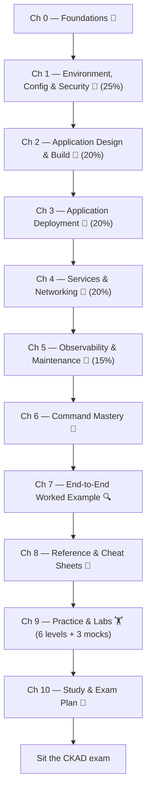

# CKAD Study Guide — Certified Kubernetes Application Developer

[](https://creativecommons.org/licenses/by/4.0/)
[](https://kubernetes.io)
[](https://www.cncf.io/certification/ckad/)

A **comprehensive, exam-focused study guide** for the Certified Kubernetes Application Developer (CKAD) certification. This guide combines theory, real-world examples, and practical exam patterns covering all 5 official domains — organized as **one continuous learning path**, from first principles through three full mock exams.

## 📊 Quick Stats

- **Coverage:** Comprehensive coverage of all the CKAD syllabus.
- **Chapters:** 11 (Foundations + 5 Domains + Mastery + Worked Example + Reference + Practice + Plan)
- **Examples:** 60+ illustrative real-world scenarios
- **Code Snippets:** 150+ practical patterns
- **Total study time:** ~40–60 hours end to end (reading + drilling + practice — see the roadmap below)

---

## 🗺️ The Learning Path

There is **one path** through this guide — no separate beginner/intermediate/advanced tracks to choose between. Everyone follows the same chapters in the same order. If material feels familiar, move through it quickly; if it's new, slow down.

**Practice is built into the learning path.** Chapters 0–7 include focused hands-on exercises alongside the material. Complete each chapter's practice before moving on. Chapter 9 then provides additional cumulative practice and timed labs after the core learning path.

Each chapter carries a label showing its role on that path:

| Label                       | Meaning                                                                           |
| --------------------------- | --------------------------------------------------------------------------------- |
| 🧱**Foundation**      | Groundwork every later chapter assumes you already have                           |
| 🎯**Core CKAD Skill** | Directly scored exam domains                                                      |
| 🧭**Exam Focus**      | Execution speed and recall — how you actually perform under the clock            |
| 🔍**Deep Dive**       | Pulls several chapters together into one realistic scenario                       |
| 🏋️**Practice**      | Hands-on exercises integrated into the chapter so you apply the skill immediately |



The five domain chapters (1–5) mirror the five scored domains on the real exam, in the order dependencies actually run: design what you'll run, configure it, deploy it safely, expose it on the network, then learn to debug it when something breaks. **Each chapter includes hands-on practice for the concepts you just learned.** Chapters 6–10 then convert that knowledge into exam-day speed, cumulative practice, reference use, and final revision.

> **Content preservation:** The chapter enhancements add practice and readability improvements without removing the existing learning content. Reference and cheat-sheet formatting has been kept aligned with the current chapter structure.

### Chapter Roadmap

| #  | Chapter                                                                               | Label              | Weight | Time                      |
| -- | ------------------------------------------------------------------------------------- | ------------------ | ------ | ------------------------- |
| 0  | [Foundations](00_chapter_foundations.md)                                               | 🧱 Foundation      | —     | 30–45 min                |
| 1  | [Environment, Configuration &amp; Security](01_chapter_environment_config_security.md) | 🎯 Core CKAD Skill | 25%    | 3–4 hrs                  |
| 2  | [Application Design &amp; Build](02_chapter_application_design_build.md)               | 🎯 Core CKAD Skill | 20%    | 2.5–3.5 hrs              |
| 3  | [Application Deployment](03_chapter_application_deployment.md)                         | 🎯 Core CKAD Skill | 20%    | 1.5–2 hrs                |
| 4  | [Services &amp; Networking](04_chapter_services_networking.md)                         | 🎯 Core CKAD Skill | 20%    | 2–2.5 hrs                |
| 5  | [Observability &amp; Maintenance](05_chapter_observability_maintenance.md)             | 🎯 Core CKAD Skill | 15%    | 1.5–2 hrs                |
| 6  | [CKAD Command Mastery](06_chapter_command_mastery.md)                                  | 🧭 Exam Focus      | —     | 45–60 min + daily drills |
| 7  | [End-to-End Worked Example](07_chapter_worked_example.md)                              | 🔍 Deep Dive       | —     | 1–1.5 hrs                |
| 8  | [Reference &amp; Cheat Sheets](08_chapter_reference_cheatsheets.md)                    | 🧭 Exam Focus      | —     | 20–30 min per pass       |
| 9  | [Practice &amp; Labs](09_chapter_practice_labs.md)                                     | 🏋️ Practice      | —     | 6–9 hrs                  |
| 10 | [Study &amp; Exam Plan](10_chapter_study_exam_plan.md)                                 | 🧭 Exam Focus      | —     | 15–20 min                |

### Companion & Architecture References

| Reference | Purpose |
|---|---|
| [YAML Structure Companion](yaml_structure.md) | Read Kubernetes YAML as a tree; identify maps, lists, ownership, and nesting |
| [Kubernetes Architecture & Communication Flow](kubernetes-architecture-and-communication-flow.md) | Build the control-plane, reconciliation, scheduling, networking, and troubleshooting mental model |

---

## 🧪 How Practice Works

Practice is **not postponed until the end**. The intended workflow is:

**Learn → Understand → Do the chapter lab → Verify → Continue**

Each integrated lab is designed to make you perform the Kubernetes task yourself rather than simply recognize the command or YAML.

- **Attempt the task first.** Do not open the solution before trying it yourself.
- **Use the success criteria to verify your result.** The task should be objectively complete before you move on.
- **Hints are optional.** Open a hint only when you are genuinely stuck.
- **Solutions are hidden.** In the Markdown files, hints and solutions are placed inside collapsible sections so they do not immediately reveal the answer on GitHub.
- **Use the solution to learn, not to copy.** If you needed the solution, close it and repeat the task from scratch.
- **Practice is exam-oriented.** Tasks specify the namespace, resource names, required configuration, verification expectations, and the outcome you must achieve rather than giving generic instructions.
- **Chapter 9 is reinforcement.** After completing the chapter-by-chapter labs, use Chapter 9 for broader cumulative scenarios, timed practice, and three independent 17-task mock exams.

### Recommended Chapter Routine

1. Read the explanation and examples.
2. Work through the commands and understand what each one changes.
3. Attempt the practice exercise without opening the hint or solution.
4. Verify the result using the success criteria.
5. If you used a hint or solution, redo the task from scratch.
6. Continue to the next chapter only when you can reproduce the key operation yourself.

This keeps the guide as **one continuous learning path** while building hands-on skill at the exact point where each concept is introduced.

---

## 🚀 How to Use This Guide

1. **Start at Chapter 0** and move through the chapters in order — the roadmap above *is* the plan.
2. **Do the practice inside each chapter before moving on.** The integrated exercises are part of the chapter, not optional material to postpone.
3. **Watch for the priority markers** inside each chapter: 🔴 **MUST KNOW** is heavily tested and non-negotiable, 🟡 **SHOULD KNOW** rounds out solid coverage, 🟢 **NICE TO KNOW** is useful context. If you're short on time, prioritize in that order.
4. **Read the "Real-world" and "Theory" callouts**, not just the command blocks — they're what make the commands stick instead of just being copied.
5. **Use Chapter 9 for cumulative practice and timed labs** after progressing through the earlier chapters. Attempt every lab and mock task before opening its hidden solution.
6. **Use Chapter 10's phase plan** to pace yourself across your whole study window, and its Final Readiness Self-Check before you schedule the actual exam.

### Study Timeline

**Total prep time:** 40–60 hours (varies by background) — the chapter-level time estimates in the roadmap above cover reading and drilling; the phases below show how that time is typically distributed.

| Phase                                     | Time           | Focus                                             |
| ----------------------------------------- | -------------- | ------------------------------------------------- |
| **Phase 1: Learn**                  | 15–20h        | Chapters 0–5, domain by domain                   |
| **Phase 2: Command Drills**         | Ongoing, daily | Chapter 6, until typing is automatic              |
| **Phase 3: Cumulative Practice**    | 15–25h        | Chapter 9, Levels 1–4 + repeat weak chapter labs |
| **Phase 4: Timed Practice & Mocks** | 6–10h         | Chapter 9, Levels 5–6 + three 2-hour mock exams |
| **Phase 5: Final Revision**         | 5h             | Chapter 8 cheat sheets, weak-area review          |

This mirrors Chapter 10's Phase-by-Phase Progression in more detail — see that chapter for the full breakdown and a Final Readiness Self-Check.

---

## 🎯 What You'll Learn

### Domain 1: Environment, Configuration & Security (25% of exam)

✓ ConfigMaps and Secrets · ✓ Downward API · ✓ Resource Requests, Limits, and Quotas · ✓ ServiceAccounts and RBAC · ✓ SecurityContext and Pod Security Admission · ✓ Custom Resources (CRDs)

### Domain 2: Application Design & Build (20% of exam)

✓ Container Images and Multi-stage Builds · ✓ Workload Resources (Deployment, StatefulSet, DaemonSet, Job, CronJob) · ✓ Multi-Container Patterns (sidecar, init, ambassador, adapter) · ✓ Volumes and Storage

### Domain 3: Application Deployment (20% of exam)

✓ Rolling Updates and Deployment Strategies · ✓ Blue/Green and Canary Deployments · ✓ Helm and Kustomize

### Domain 4: Services & Networking (20% of exam)

✓ Services and Load Balancing · ✓ Ingress · ✓ NetworkPolicies (including cross-namespace scoping)

### Domain 5: Observability & Maintenance (15% of exam)

✓ Debugging Workflow · ✓ Container Logs and Monitoring · ✓ Probes and Health Checks · ✓ Node Maintenance

---

## ✨ What Makes This Guide Different

### Real-World Examples

Every major concept includes a production scenario — fintech namespace isolation, OOMKilled recommendation services, Istio sidecar/ambassador patterns, HIPAA-compliant NetworkPolicy, multi-stage Docker builds cutting image size 8x, and more.

### Theory Sections

Not just "how to" but "why": Linux kernel compressible vs. incompressible resources, reconciliation loops and Kubernetes controllers, DNS resolution for headless Services, permission scoping and RBAC attack surfaces.

### Hands-On Practice at the Point of Learning

Every major chapter includes focused practice tasks that immediately apply the material just learned. Tasks are concrete and exam-oriented, with explicit requirements and success criteria. Hints and solutions are collapsed so you can attempt the task without seeing the answer first.

### Exam-Style Pattern Recognition

Task-to-solution shortcuts trained throughout the guide:

- "Run this once" = Job (not Deployment)
- "Pods need stable DNS" = headless Service + StatefulSet
- "Grant log access but not exec" = RBAC subresources
- "Ensure N Pods stay up during maintenance" = PodDisruptionBudget

### Visual Troubleshooting

Decision trees and flowcharts (Mermaid diagrams throughout Chapters 5, 8, and 9) for common failures — Pending, CrashLoopBackOff, ImagePullBackOff, no Service endpoints, and more — alongside the original text-based diagnostic references.

---

## 🎓 Key Concepts at a Glance

### The Exam's Mental Model

**Kubernetes is declarative reconciliation:**

- You declare desired state (YAML manifests)
- Controllers continuously reconcile actual ← desired
- Status/conditions tell you if reconciliation succeeded

```bash
kubectl apply -f deployment.yaml    # declare desired: 3 replicas
# controller sees: actual 0, desired 3 → creates 3 Pods
kubectl scale deployment web --replicas=5
# controller sees: actual 3, desired 5 → creates 2 more Pods
kubectl delete pod <pod>            # controller sees: actual 4, desired 5 → creates 1 more
```

### The 5 Core Domains as One Flow

```
DESIGN (Ch. 2) → what to run
    ↓
CONFIG (Ch. 1) → how to configure it
    ↓
DEPLOY (Ch. 3) → how to update it safely
    ↓
NETWORK (Ch. 4) → how to expose it
    ↓
OBSERVE (Ch. 5) → how to debug it when broken
```

Chapter 7's End-to-End Worked Example builds one real application through exactly this flow, so you see the accumulation happen in a single Deployment spec instead of five separate examples.

---

## 📖 File Structure

```text
.
├── README.md                                      # This file
├── 00_chapter_foundations.md                      # Ch 0: Foundations + integrated practice
├── 01_chapter_environment_config_security.md      # Ch 1: Configuration & Security + integrated practice
├── 02_chapter_application_design_build.md         # Ch 2: Application Design & Build + integrated practice
├── 03_chapter_application_deployment.md           # Ch 3: Application Deployment + integrated practice
├── 04_chapter_services_networking.md              # Ch 4: Services & Networking + integrated practice
├── 05_chapter_observability_maintenance.md        # Ch 5: Observability & Maintenance + integrated practice
├── 06_chapter_command_mastery.md                  # Ch 6: kubectl Command Mastery + integrated practice
├── 07_chapter_worked_example.md                   # Ch 7: End-to-End Worked Example + integrated practice
├── 08_chapter_reference_cheatsheets.md            # Ch 8: Reference & Cheat Sheets (unchanged)
├── 09_chapter_practice_labs.md                    # Ch 9: Cumulative Hands-on Labs
├── 10_chapter_study_exam_plan.md                  # Ch 10: Study & Exam Plan
├── kubernetes-architecture-and-communication-flow.md # Architecture foundation
└── yaml_structure.md                              # YAML structure reference
```

---

## 🎯 Target Audience

✅ **Ideal for:**

- Kubernetes developers preparing for CKAD
- DevOps engineers needing an application-developer perspective
- Platform engineers building for developers
- Anyone learning Kubernetes at production scale

⚠️ **Not ideal for:**

- Kubernetes operators/cluster admins (needs CKA instead)
- Pure infrastructure/IaC work (needs a different focus)
- Complete beginners with zero Linux/container experience (start elsewhere first, then come back)

---

## 🔗 Exam Information

**Official:** [CKAD at CNCF](https://www.cncf.io/certification/ckad/)

**Exam Format:**

- Duration: 2 hours
- Format: Hands-on, terminal-based (no multiple choice)
- Passing score: 66%, weighted across 5 domains
- Environment: Pre-configured Linux terminal + a real Kubernetes cluster
- Documentation/resources: follow the current Linux Foundation exam-resource policy; the Kubernetes documentation is the primary reference allowed during the exam. Verify the current policy before exam day.

**Domain Breakdown:**

- 25%: Environment, Configuration & Security
- 20%: Application Design & Build
- 20%: Application Deployment
- 20%: Services & Networking
- 15%: Observability & Maintenance

---

## 💡 Study Tips

### Before the Exam

1. **Practice under time pressure.** Complete the three independent 2-hour mock exams in Chapter 9 after finishing Levels 5–6.
2. **Know kubectl.** You'll spend more time typing than thinking; practice `--dry-run=client -o yaml` (Chapter 6) until it's automatic.
3. **Test your probes.** The gap between "knowing how probes work" and "writing a working startup probe" is exactly what costs exam points.
4. **Verify your edits.** After every `kubectl apply`, run `kubectl describe` to confirm — typos that look correct in YAML are silent failures.
5. **Read task descriptions carefully.** "The app must be accessible from the internet" is not the same as "the app should be accessible" — know which Ingress/Service pattern each task wants.

### During the Exam

1. **Read the full task before typing anything.** Understand the namespace, resource names, and exit criteria first.
2. **Run `kubectl config get-contexts`** immediately. Know which cluster/namespace you're in.
3. **Generate, don't hand-write.** Use `kubectl create <kind> ... --dry-run=client -o yaml`, then edit — don't start from blank YAML.
4. **Verify every step.** After `apply`, run `get` and `describe` to confirm the resource is correct.
5. **If stuck, move on.** The exam has many smaller tasks; spend at most ~15 minutes on one, then come back later if time remains.
6. **Read error messages carefully.** API errors often identify the failing resource, field, or authorization boundary directly.

### After the Exam

Review any tasks you didn't finish or weren't confident about — those are the gaps worth studying if you need to retake it.

---

## 🤝 Contributing

Found an error, outdated pattern, or missing edge case? Contributions welcome!

**How to contribute:**

1. Fork the repository
2. Create a branch (`git checkout -b feature/clarify-xyz`)
3. Make edits (add examples, fix typos, expand sections)
4. Open a pull request with context (what was wrong, what's better)

**Guidelines:**

- Keep real-world examples accurate and anonymized
- Verify code snippets against Kubernetes v1.35+
- Maintain the exam-focused tone
- Include both "what" and "why" explanations

---

## 📝 License

This work is licensed under the **Creative Commons Attribution 4.0 International** (CC BY 4.0).

You are free to:

- Share, copy, redistribute this material
- Adapt, remix, transform it
- Use it commercially or personally

**On condition that you:**

- Give appropriate credit
- Link to the license
- Indicate if changes were made

See [LICENSE](LICENSE) for details.

---

## 📬 Feedback & Questions

- **Found an error?** Open an issue.
- **Have a better explanation?** Open a PR.
- **Exam tips to share?** Discussion/issue.
- **Passed the exam?** We'd love to hear about it!

---

## 🙏 Acknowledgments

- **CNCF** for the CKAD curriculum and exam standards
- **Kubernetes Community** for exceptional documentation
- **Real-world operators** whose production incidents taught these lessons
- **Students & reviewers** who identified gaps and edge cases

---

**Last Updated:** September 11, 2026
**Kubernetes Version:** v1.35
**Exam Focus:** CKAD (Application Developer)
**Learning Model:** One continuous path with hands-on practice integrated into Chapters 0–7

Happy studying! 🚀
