# Kubernetes: The Real-World 80/20

What you actually touch day-to-day running production workloads - not exam trivia. If something here isn't in your daily/weekly workflow within a few months of using Kubernetes for real, it doesn't belong in this file.

## How real-world K8s work actually looks

Most engineers don't hand-write raw Pod YAML and `kubectl apply` it from their laptop. The real loop is:

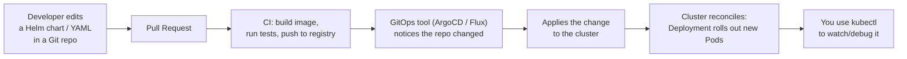

`kubectl apply -f` from a laptop is how you **learn** and **debug**; in production the source of truth is a Git repo, and a controller (ArgoCD, Flux, or a CI job) applies it for you. Knowing this changes what's worth memorizing: you'll write far more YAML (usually inside Helm charts) and read far more `kubectl describe`/`logs` output than you'll ever type imperative one-liners.

---

## 1. The objects you'll actually write, constantly

You will write these four things in nearly every project. Everything else in Kubernetes exists to support them.

| Object | What it's for | How often you touch it |
|---|---|---|
| **Deployment** | Run and keep N copies of your app alive | Every app, every day |
| **Service** | Give those Pods a stable network name | Every app |
| **ConfigMap / Secret** | Inject config and credentials without baking them into the image | Every app |
| **Ingress** (or a Gateway) | Route external HTTP traffic in | Every app with a web-facing component |

You will **rarely** write a bare Pod by hand (only for quick debugging), and you will rarely write a ReplicaSet directly - the Deployment manages that for you.

**Ingress vs. Gateway API:** most existing clusters you'll join still use `Ingress` with a controller like nginx or ALB, so it's still essential to know. But upstream Kubernetes has frozen the Ingress API and is steering new development toward the **Gateway API** (more expressive routing, better multi-team support). Practical rule: on an existing cluster, use whatever the platform team already runs (usually Ingress); if you're involved in standing up new routing infrastructure, look at Gateway API first.

### The next tier: objects you'll meet regularly (not daily, but often)

Once the basics are second nature, these show up every few weeks - each gets its own section below.

| Object | What it's for |
|---|---|
| **HorizontalPodAutoscaler (HPA)** | Auto-scale replica count based on CPU/memory/custom metrics |
| **Job / CronJob** | Run a task to completion once, or on a schedule |
| **NetworkPolicy** | Restrict which Pods can talk to which other Pods |
| **PersistentVolumeClaim / StatefulSet** | Give a workload durable, stable storage or identity |
| **PodDisruptionBudget (PDB)** | Stop a node drain/upgrade from taking down all your replicas at once |

### The complete real-world shape of one service

This is close to what a real microservice's manifest set looks like - memorize this shape, not the individual fields:

```yaml
apiVersion: apps/v1
kind: Deployment
metadata:
  name: orders-api
  labels: {app: orders-api}
spec:
  replicas: 3
  selector:
    matchLabels: {app: orders-api}
  template:
    metadata:
      labels: {app: orders-api}
    spec:
      containers:
        - name: orders-api
          image: registry.example.com/orders-api:1.4.2   # avoid :latest in production - prefer a version tag or a digest
          ports:
            - containerPort: 8080
          envFrom:
            - configMapRef: {name: orders-api-config}
            - secretRef: {name: orders-api-secrets}
          resources:
            requests: {cpu: "100m", memory: "128Mi"}
            limits: {memory: "256Mi"}                      # no CPU limit - see §3
          readinessProbe:
            httpGet: {path: /healthz, port: 8080}
            periodSeconds: 5
          livenessProbe:
            httpGet: {path: /healthz, port: 8080}
            periodSeconds: 10
---
apiVersion: v1
kind: Service
metadata:
  name: orders-api
spec:
  selector: {app: orders-api}
  ports:
    - port: 80
      targetPort: 8080
---
apiVersion: networking.k8s.io/v1
kind: Ingress
metadata:
  name: orders-api
  annotations:
    cert-manager.io/cluster-issuer: letsencrypt      # real clusters auto-provision TLS like this
spec:
  ingressClassName: nginx
  rules:
    - host: orders.example.com
      http:
        paths:
          - path: /
            pathType: Prefix
            backend:
              service: {name: orders-api, port: {number: 80}}
  tls:
    - hosts: [orders.example.com]
      secretName: orders-api-tls
```

A large share of the real services you'll own look like some variant of this. If you internalize nothing else from this file, internalize this shape.

---

## 2. `kubectl`: the 20% of commands you use 80% of the time

You'll live in about a dozen commands. Everything else is looked up when you need it.

```bash
kubectl get pods -n <namespace>                    # what's running
kubectl get pods -n <namespace> -w                 # watch it change live
kubectl describe pod <pod>                          # WHY is it broken (events at the bottom)
kubectl logs <pod>                                  # what did it print
kubectl logs <pod> -f                               # follow live
kubectl logs <pod> --previous                       # what did the CRASHED instance print
kubectl exec -it <pod> -- sh                        # get a shell inside it
kubectl port-forward pod/<pod> 8080:8080            # tunnel a Pod's port to your laptop, no Ingress needed
kubectl apply -f file.yaml                          # create or update from YAML
kubectl rollout status deployment/<name>            # is my deploy done yet
kubectl rollout undo deployment/<name>               # PANIC BUTTON: roll back
kubectl top pods                                     # who's eating CPU/memory right now
kubectl debug <pod> -it --image=busybox --target=<container>  # attach a debug shell to a distroless/scratch container
kubectl get svc <name>                              # does the Service exist, what's its selector
kubectl get endpointslice -l kubernetes.io/service-name=<name>  # which Pod IPs is the Service actually routing to
kubectl get pods --show-labels                      # do the Pod labels actually match the Service selector
kubectl get events --sort-by=.lastTimestamp -n <namespace>  # cluster-wide timeline of what just happened
kubectl explain deployment.spec.template.spec        # look up a field you've forgotten, inline
```

`kubectl debug` matters more every year: many production images are distroless (no shell, no `curl`, nothing to `exec` into). It attaches an **ephemeral container** with real debugging tools alongside your running container without restarting it.

### The 90% troubleshooting flow

In real incidents you almost always walk this exact path:

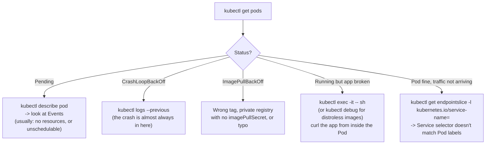

The chain to hold in your head: **Service selector → matching Pod labels → EndpointSlice → Pod IP:port.** `EndpointSlice` is the current, scalable API for a Service's backend list; the older `Endpoints` object still exists but is being phased out. Two different failure shapes to tell apart: if the `EndpointSlice` has **no entries at all**, the selector likely doesn't match any Pod's labels; if it **has entries but none are marked ready** (each endpoint carries `ready`/`serving`/`terminating` conditions), the problem is more likely Pod readiness or Pods mid-termination, not the selector.

This one flowchart resolves the large majority of real production issues you'll hit. `kubectl describe` and `kubectl logs` are where the answer almost always is - people waste time guessing before running them.

---

## 3. Resource requests and limits (the setting that breaks the most things when skipped)

This is the single most common real-world mistake: shipping a Deployment with **no `resources` block at all**.

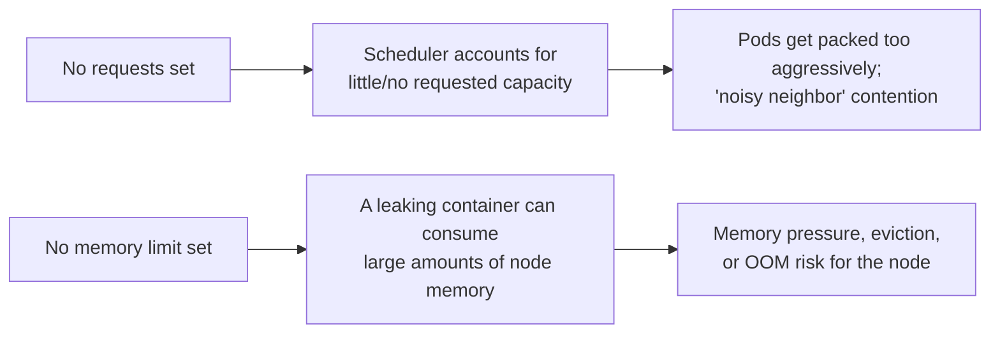

**What to actually set:**

```yaml
resources:
  requests:
    cpu: "100m"        # what the scheduler uses for placement and accounting - be honest here
    memory: "128Mi"
  limits:
    memory: "256Mi"     # memory ceiling - enforced reactively; the kernel OOM-kills the container if it's crossed
    # deliberately no cpu limit in most real setups: a CPU limit causes throttling,
    # not a kill, and throttling under load is a common self-inflicted latency bug
```

A request isn't a hard reservation the container is capped to - it's what the scheduler uses to decide which node a Pod fits on and what a container is accounted against; actual usage can run above the request if the node has spare capacity. A limit is what's actually enforced, and CPU and memory are enforced differently: a CPU limit throttles (slows the container down), while a memory limit is enforced reactively - the container can briefly exceed it before the kernel's OOM killer steps in and kills it.

**Real-world rule of thumb:** set `requests` based on real observed usage. Set a memory `limit`. Think twice before setting a CPU `limit` - CPU throttling under a hard cap is a very common cause of mysterious latency spikes that people spend days debugging.

At the namespace level, platform teams often cap this with a **ResourceQuota** (total CPU/memory a namespace can consume) and a **LimitRange** (default requests/limits applied if a Pod doesn't set its own). As an app developer you'll occasionally hit "exceeded quota" errors from these - that's the platform team's guardrail, not a bug.

---

## 4. Health checks (the setting that breaks the most *deploys* when skipped)

Without a **readiness probe**, Kubernetes sends traffic to a Pod the instant its process starts - even if your app takes 10 seconds to warm up (load config, connect to a DB). That means every rolling update causes a burst of errors.

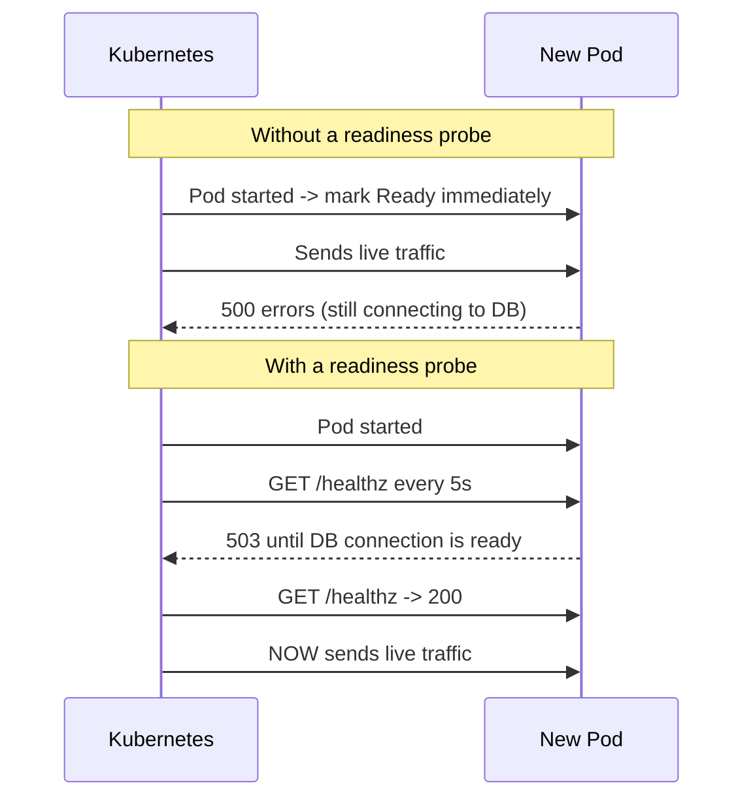

- **Readiness probe** = "can this Pod take traffic right now?" A failing readiness probe pulls the Pod out of the Service's endpoints - no restart, just no traffic until it passes again. This is what makes a rolling update actually zero-downtime.
- **Liveness probe** = "is this Pod stuck/deadlocked?" A failing liveness probe gets the container **killed and restarted**. Don't point it at something that can fail for reasons unrelated to the process being stuck (like a downstream DB outage) - that turns a database blip into a restart storm.

Real-world default that works for most HTTP services:

```yaml
readinessProbe:
  httpGet: {path: /readyz, port: 8080}
  periodSeconds: 5
  failureThreshold: 3
livenessProbe:
  httpGet: {path: /livez, port: 8080}
  periodSeconds: 10
  failureThreshold: 3
  initialDelaySeconds: 10
```

Use **separate endpoints** where you can, since they answer different questions: `/livez` means "is the process fundamentally alive/not deadlocked," `/readyz` means "can this instance serve traffic right now" (DB connected, caches warm, etc.). Wiring both to the same `/healthz` is a common simplification, but it means a slow downstream dependency can look identical to a genuinely stuck process.

If your app is slow to start (JVM, large model load), use a **startup probe** instead of a huge `initialDelaySeconds` - it protects the slow boot without weakening the liveness probe's normal sensitivity afterward.

### Graceful shutdown (the other half of zero-downtime deploys)

Readiness gets a new Pod safely *into* rotation; graceful termination is what gets an old Pod safely *out* of it. When a Pod is deleted (during a rollout, a scale-down, or a node drain):

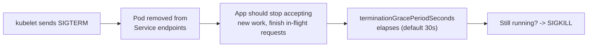

Removal from Service endpoints and the SIGTERM happen close together but aren't strictly ordered, so a container that exits instantly on SIGTERM can still drop a few in-flight requests. The fix most real apps use: catch SIGTERM, keep serving for a few seconds while finishing existing requests, *then* shut down - and raise `terminationGracePeriodSeconds` if your requests can legitimately run longer than the 30-second default.

---

## 5. Config and Secrets: how real projects actually do it

`ConfigMap` and `Secret` are the mechanism, but real orgs rarely stop there:

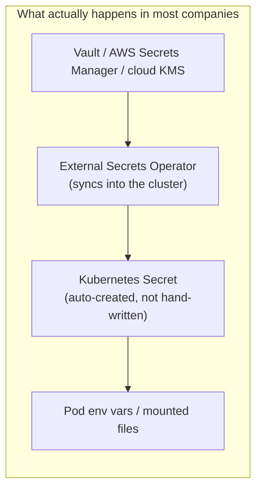

**Why:** a raw Kubernetes `Secret` value is only base64-encoded (not encrypted) by default, stored unencrypted at rest unless the cluster has encryption-at-rest configured, and readable by anyone who can `kubectl get secret`. Many production setups avoid committing Secrets straight into Git or typing them by hand - they use a tool like **External Secrets Operator**, **Sealed Secrets**, or a cloud provider's native secret-sync integration to pull from a real secrets manager and materialize a Kubernetes `Secret` automatically. As an app developer you'll still just reference the Secret by name (`secretKeyRef`/`envFrom`) - you rarely need to know how it got there, but you should know **why committing a real password into a manifest is a bad idea even when it "works."**

```yaml
envFrom:
  - configMapRef: {name: orders-api-config}   # non-sensitive: feature flags, URLs, log level
  - secretRef: {name: orders-api-secrets}     # sensitive: DB password, API keys
```

One real gotcha worth knowing: **changing a ConfigMap/Secret does not restart Pods that already read it as an env var.** Env vars are read once at container start. If you need the change to take effect, you either mount it as a volume (which does update live, minus a short propagation delay) or trigger a rollout yourself:

```bash
kubectl rollout restart deployment/orders-api
```

---

## 6. Deployments in practice: rollouts, rollbacks, and disruptions

This is the actual day-to-day lifecycle of shipping code:

```bash
kubectl set image deployment/orders-api orders-api=registry.example.com/orders-api:1.4.3
kubectl rollout status deployment/orders-api          # watch it finish (or hang)
kubectl rollout history deployment/orders-api          # see past versions
kubectl rollout undo deployment/orders-api             # instantly go back one version
```

By default a Deployment does a **rolling update**: it replaces old Pods with new ones gradually, keeping the app available the whole time (assuming your readiness probe is real). The two knobs that matter in practice:

```yaml
strategy:
  rollingUpdate:
    maxUnavailable: 0     # never drop below full capacity during a deploy
    maxSurge: 1            # allow one extra Pod temporarily while rolling
```

Kubernetes' own default is `maxUnavailable: 25%, maxSurge: 25%`. The tradeoff to understand: `maxUnavailable` is how much serving capacity may temporarily disappear during a rollout, and `maxSurge` is how many extra Pods may temporarily exist. For latency- or capacity-sensitive user-facing services, many teams tighten this to `maxUnavailable: 0` (the old Pod isn't removed until the new one is confirmed ready, so a bad deploy fails to progress instead of reducing capacity) - but that's a workload/platform decision, not a universal setting, and it costs a bit of extra capacity headroom during every deploy.

**`kubectl rollout undo` is one of the most useful incident commands you have** - but only when the recent rollout is actually the cause. If a deploy went out shortly before things broke, roll back first and investigate after; if the timing doesn't line up (a downstream DB is down, DNS is broken, a NetworkPolicy just changed), rolling back your app won't fix an incident it didn't cause, so confirm the correlation before reaching for it.

### PodDisruptionBudget: protecting yourself from voluntary disruptions

Kubernetes distinguishes **voluntary** disruptions (things a human or controller *chooses* to do - node drains, cluster upgrades, cluster-autoscaler scale-downs) from **involuntary** ones (a node crashing, hardware failure, a kernel panic). A `PodDisruptionBudget` (PDB) only limits the voluntary kind.

```yaml
apiVersion: policy/v1
kind: PodDisruptionBudget
metadata: {name: orders-api-pdb}
spec:
  minAvailable: 2        # or use maxUnavailable: 1
  selector:
    matchLabels: {app: orders-api}
```

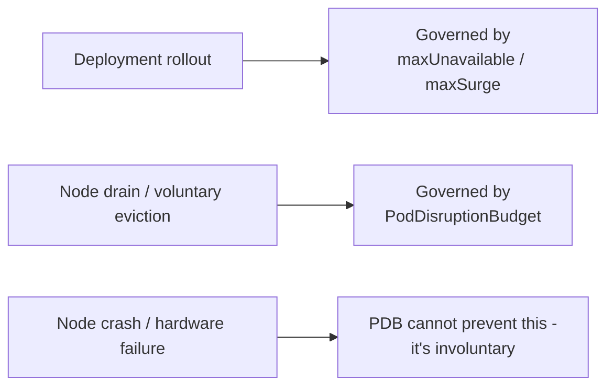

This tells the eviction API: "don't voluntarily evict my Pods below this threshold." It's real protection during a planned node drain or cluster upgrade, but it does nothing if a node simply dies out from under you, and it doesn't govern your own Deployment's rolling update - that's `maxUnavailable`/`maxSurge` instead. It's still cheap, commonly-used insurance for a replicated service that matters for uptime; it just isn't a general disruption shield.

### Availability is a combination, not one setting

No single object gives you high availability - it's the sum of several:

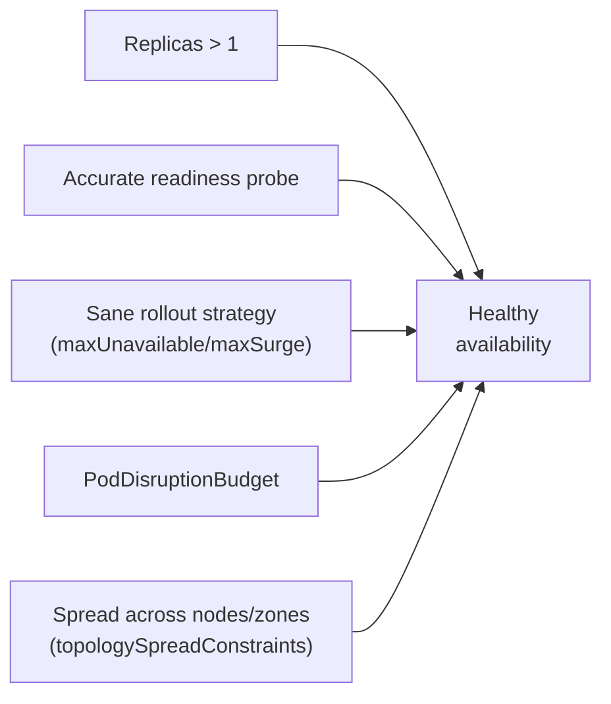

That last one is easy to miss: 3 replicas that all happen to land on the same node give you zero real redundancy if that node fails. A `topologySpreadConstraint` on the Deployment's Pod template tells the scheduler to spread replicas across nodes or availability zones instead of letting them cluster together - worth adding once you actually care about surviving a single node or zone going down.

---

## 7. Namespaces and access control: the org-scale piece

In a real company, a cluster is shared by many teams. Two mechanisms keep that manageable:

- **Namespaces** partition the cluster (`payments`, `checkout`, `platform`). You'll `-n <namespace>` on almost every command once you're past a toy cluster - set your default with `kubectl config set-context --current --namespace=<ns>` so you stop typing it.
- **RBAC (Role/RoleBinding)** controls who or what can do what. As an app developer you mostly *consume* this - your CI pipeline's ServiceAccount has a Role scoped to your namespace, and you'll occasionally need to ask a platform team to grant one.

```yaml
apiVersion: rbac.authorization.k8s.io/v1
kind: Role
metadata: {name: deployer, namespace: checkout}
rules:
  - apiGroups: ["apps"]
    resources: ["deployments"]
    verbs: ["get", "list", "update", "patch"]
---
apiVersion: rbac.authorization.k8s.io/v1
kind: RoleBinding
metadata: {name: ci-deployer, namespace: checkout}
subjects:
  - kind: ServiceAccount
    name: ci-bot
    namespace: checkout
roleRef: {kind: Role, name: deployer, apiGroup: rbac.authorization.k8s.io}
```

The real-world rule: **least privilege, per namespace.** A CI pipeline for `checkout` should not be able to touch the `payments` namespace. If you ever see a ServiceAccount with a `ClusterRoleBinding` granting cluster-admin "to make things easier," that's a red flag, not a shortcut.

---

## 8. Autoscaling: letting the cluster react to load

Fixed `replicas: 3` is fine until traffic isn't fixed. The **HorizontalPodAutoscaler (HPA)** is the one you'll actually configure yourself.

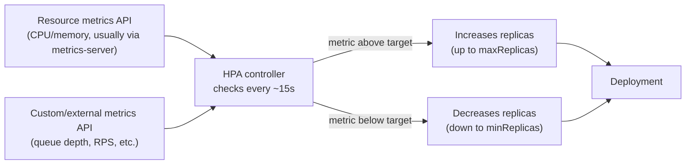

```yaml
apiVersion: autoscaling/v2
kind: HorizontalPodAutoscaler
metadata: {name: orders-api}
spec:
  scaleTargetRef: {apiVersion: apps/v1, kind: Deployment, name: orders-api}
  minReplicas: 3
  maxReplicas: 20
  metrics:
    - type: Resource
      resource: {name: cpu, target: {type: Utilization, averageUtilization: 70}}
```

**What actually matters in practice:**
- HPA is only as good as your `resources.requests` (§3) - CPU/memory utilization percentages are calculated against the request, so an unset or wrong request makes the HPA scale on nonsense.
- Choose `minReplicas` based on your actual availability needs, not a fixed number - 2-3 is a common starting point for a replicated user-facing service so scaling down never removes your redundancy entirely, but a batch-style internal service might reasonably go lower.
- HPA can scale on more than CPU/memory - it also supports custom and external metrics (queue depth, requests-per-second) via the metrics APIs. **Metrics Server** is the common way to supply the basic CPU/memory numbers, but it's not the only source, and knowing that helps when someone mentions scaling on a custom metric.
- Two related autoscalers you'll hear about but rarely configure yourself: the **Cluster Autoscaler** (adds/removes *nodes* when Pods can't be scheduled) and the **Vertical Pod Autoscaler** (adjusts a Pod's requests/limits over time) - these are usually a platform team's concern, but knowing they exist explains "why did a new node just appear" or "why did my Pod's memory request change overnight."

---

## 9. Jobs and CronJobs: work that isn't a long-running service

Not everything is a Deployment. Batch work, migrations, and scheduled tasks use a different shape:

```yaml
apiVersion: batch/v1
kind: Job
metadata: {name: db-migrate}
spec:
  backoffLimit: 2                # retry twice on failure, then give up
  template:
    spec:
      restartPolicy: Never
      containers:
        - name: migrate
          image: registry.example.com/orders-api:1.4.3
          command: ["./migrate", "up"]
---
apiVersion: batch/v1
kind: CronJob
metadata: {name: nightly-report}
spec:
  schedule: "0 2 * * *"           # standard cron syntax
  timeZone: "Asia/Kolkata"         # be explicit - without this, it uses the controller-manager's timezone, which surprises people
  jobTemplate:
    spec:
      template:
        spec:
          restartPolicy: OnFailure
          containers:
            - name: report
              image: registry.example.com/reporting:2.0.0
```

**Where you'll actually meet these:** a `Job` run from a Helm hook to migrate the database before a Deployment rolls out (see §12), a nightly `CronJob` for cleanup/reporting, or a one-off `Job` you launch by hand to backfill data. The real-world gotcha: a `CronJob` that overruns its schedule can stack up concurrent runs unless you set `concurrencyPolicy: Forbid`.

---

## 10. NetworkPolicies: locking down pod-to-pod traffic

By default, **every Pod in a cluster can talk to every other Pod** - there's no network isolation between namespaces or apps out of the box. In a real multi-team cluster this is a security gap, so most orgs adopt a default-deny stance and open specific paths.

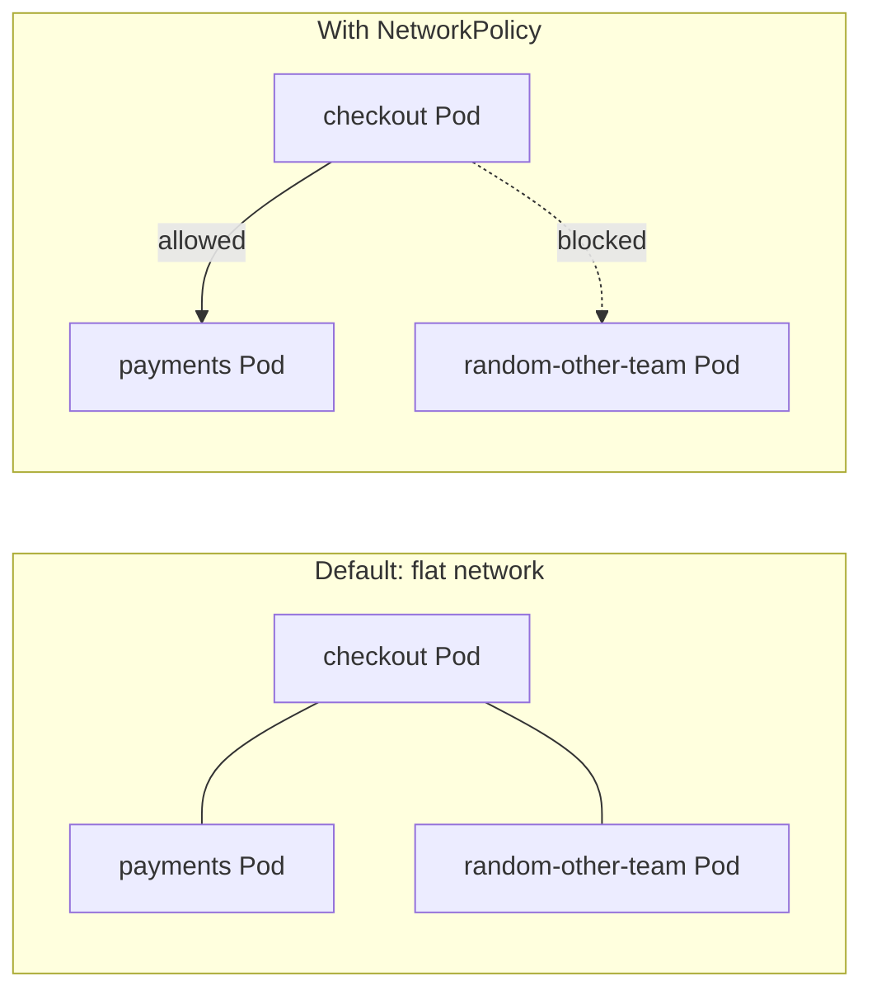

```yaml
apiVersion: networking.k8s.io/v1
kind: NetworkPolicy
metadata: {name: default-deny, namespace: checkout}
spec:
  podSelector: {}          # applies to every Pod in this namespace
  policyTypes: [Ingress]
---
apiVersion: networking.k8s.io/v1
kind: NetworkPolicy
metadata: {name: allow-from-checkout, namespace: payments}
spec:
  podSelector: {matchLabels: {app: payments-api}}
  policyTypes: [Ingress]
  ingress:
    - from:
        - namespaceSelector: {matchLabels: {team: checkout}}
```

**What you actually need to know:** a `NetworkPolicy` with an empty `podSelector: {}`, `policyTypes: [Ingress]`, and no `ingress` rules is a **default-deny-ingress** for that namespace - it says nothing about outbound traffic. If you also want to lock down what Pods in the namespace can call *out* to, you add `Egress` to `policyTypes` and write explicit `egress` rules too - "default deny" in general usage often means both, so check which one a given policy actually covers before assuming you're protected.

The `namespaceSelector: {matchLabels: {team: checkout}}` example only works if the `checkout` namespace is actually labeled `team: checkout` - namespace labels aren't automatic, so this is a common reason a policy that looks correct still blocks everything: check `kubectl get ns --show-labels` before assuming the label exists.

As an app developer you'll rarely write these from scratch, but you'll frequently need to ask a platform team to add an allow-rule when a new service-to-service call starts mysteriously timing out with everything else looking healthy - that's the first thing to suspect when a Pod is `Running` and passing probes but a specific downstream call never connects.

---

## 11. Storage and stateful workloads: when Pods need to remember things

Most services you'll own are stateless (any replica can handle any request), which is why Deployments dominate this guide. But databases, queues, and caches need durable, identity-aware storage.

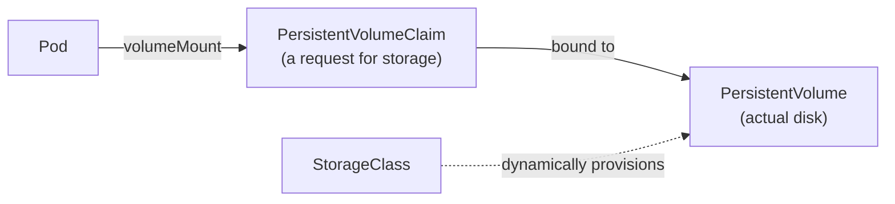

```yaml
apiVersion: v1
kind: PersistentVolumeClaim
metadata: {name: orders-db-data}
spec:
  accessModes: [ReadWriteOnce]
  storageClassName: fast-ssd     # cloud provider's StorageClass provisions the disk automatically
  resources:
    requests: {storage: 20Gi}
```

**The real-world rule of thumb:** a `Deployment` *can* mount a `PersistentVolumeClaim`, so "Deployment + storage" isn't inherently broken. The real question is whether the workload needs **per-replica** stable identity and storage - a fixed, predictable name and its own dedicated disk that follows *that specific replica* across rescheduling, plus ordered startup/shutdown. A Deployment's Pods are interchangeable by design and don't provide that; a `StatefulSet` with a `volumeClaimTemplate` does. Run a database on a Deployment with a shared or naively-attached volume and you can get two replicas fighting over the same disk - that's the failure mode to know about, not storage-on-a-Deployment in general. Most teams don't hand-roll databases on Kubernetes at all - they use a managed cloud database and reserve StatefulSets for things like self-hosted Kafka/Redis/Elasticsearch where an Operator (a controller that knows how to run that specific stateful app) does the hard part.

---

## 12. Packaging: Helm (what you'll actually use instead of raw YAML)

Most real projects move off raw, hand-applied YAML fairly quickly - they use **Helm**, the Kubernetes package manager, to template and version manifests, especially across environments (dev/staging/prod). It's not the only option (Kustomize is a common lighter-weight alternative for pure overlay-based config), but Helm is the one you'll run into most often. This is worth learning properly: on most teams that use it, you'll touch a Helm chart nearly every week.

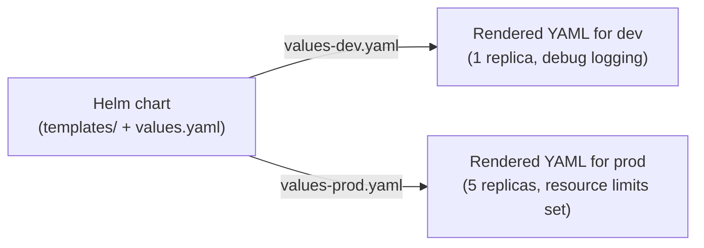

### Anatomy of a chart

```
orders-api-chart/
  Chart.yaml              # chart name, version, dependencies
  values.yaml              # default config values
  values-dev.yaml           # per-environment overrides
  values-prod.yaml
  templates/
    deployment.yaml          # YAML + Go template syntax
    service.yaml
    ingress.yaml
    _helpers.tpl             # reusable named template snippets
    NOTES.txt                # printed to the user after install/upgrade
  charts/                    # vendored dependency charts (subcharts)
```

`values.yaml` holds the knobs; `templates/` holds Kubernetes YAML with `{{ }}` placeholders filled in from those knobs at install/upgrade time. **What you actually need to know as a consumer:** most companies already have a shared "base chart" that every service reuses - your job is usually just editing a `values.yaml` (replica count, image tag, env vars, resource sizes), not writing chart templates from scratch. Learn to read `values.yaml` and a rendered template fluently before you learn to write new templates.

### A minimal real template

```yaml
# values.yaml
replicaCount: 3
image:
  repository: registry.example.com/orders-api
  tag: "1.4.2"
resources:
  requests: {cpu: 100m, memory: 128Mi}
  limits: {memory: 256Mi}
```

```yaml
# templates/deployment.yaml
apiVersion: apps/v1
kind: Deployment
metadata:
  name: {{ include "orders-api.fullname" . }}
spec:
  replicas: {{ .Values.replicaCount }}
  selector:
    matchLabels: {app: {{ .Chart.Name }}}
  template:
    metadata:
      labels: {app: {{ .Chart.Name }}}
    spec:
      containers:
        - name: {{ .Chart.Name }}
          image: "{{ .Values.image.repository }}:{{ .Values.image.tag }}"
          resources:
            {{- toYaml .Values.resources | nindent 12 }}
```

```smarty
{{/* templates/_helpers.tpl - reusable naming logic, shared across every template */}}
{{- define "orders-api.fullname" -}}
{{- printf "%s-%s" .Release.Name .Chart.Name | trunc 63 -}}
{{- end -}}
```

### The template syntax you'll actually read and write

| Syntax | Meaning |
|---|---|
| `{{ .Values.x.y }}` | A value from `values.yaml` |
| `{{ .Release.Name }}` | The name given at `helm install <name>` |
| `{{ .Chart.Name }}` / `{{ .Chart.Version }}` | From `Chart.yaml` |
| `{{- if .Values.ingress.enabled }} ... {{- end }}` | Only render this block conditionally |
| `{{- range .Values.env }} ... {{- end }}` | Loop over a list (e.g. a list of env vars) |
| `{{ include "name.fullname" . }}` | Call a reusable snippet defined in `_helpers.tpl` |
| `{{ .Values.tier \| default "standard" }}` | Fall back to a default if unset |
| `{{ toYaml .Values.resources \| nindent 12 }}` | Dump a whole YAML block from values, correctly indented |

The `-` inside `{{-` / `-}}` trims surrounding whitespace/newlines - without it, rendered YAML often ends up with stray blank lines that don't matter for correctness but make diffs noisy.

### Commands you'll actually run

```bash
helm install orders-api ./chart -f values-prod.yaml
helm upgrade orders-api ./chart -f values-prod.yaml --set image.tag=1.4.3
helm upgrade --install orders-api ./chart -f values-prod.yaml   # idempotent - use this in CI
helm rollback orders-api 1              # back to revision 1
helm history orders-api                  # see every past release
helm uninstall orders-api

helm template ./chart -f values-prod.yaml   # render locally WITHOUT touching the cluster - your dry run
helm lint ./chart                            # catch template mistakes before you install
helm get values orders-api                   # what values is the live release actually using
helm show values ./chart                     # what values does this chart accept
```

`helm template` is the command you'll reach for constantly, but be precise about what it does: it renders the chart to YAML **locally, without contacting the cluster at all** - "what would this chart produce," not "what would actually happen to my release." For something closer to a real dry-run against the live cluster and its current state, use `helm upgrade --dry-run`. Many teams also install the `helm diff` plugin (`helm diff upgrade`) to see a diff against the *currently running* release, not just the chart defaults - genuinely useful before a prod change.

### Dependencies (subcharts)

A chart can depend on other charts (e.g. bundling a Redis chart alongside your app):

```yaml
# Chart.yaml
dependencies:
  - name: redis
    version: "18.x.x"
    repository: "https://charts.bitnami.com/bitnami"
    condition: redis.enabled
```

```bash
helm dependency update ./chart      # pulls dependency charts into charts/
```

### Hooks

A **hook** runs a Job (or other resource) at a specific point in a release's lifecycle - one common pattern is a database migration before the new app version comes up, though it's one option among several (a separate migration pipeline step is just as valid):

```yaml
apiVersion: batch/v1
kind: Job
metadata:
  name: orders-api-migrate
  annotations:
    "helm.sh/hook": pre-upgrade
    "helm.sh/hook-weight": "0"
    "helm.sh/hook-delete-policy": before-hook-creation,hook-succeeded
spec:
  template:
    spec:
      restartPolicy: Never
      containers:
        - {name: migrate, image: "{{ .Values.image.repository }}:{{ .Values.image.tag }}", command: ["./migrate", "up"]}
```

Hook resources aren't tracked as part of the normal release like everything else in `templates/`, so without a `hook-delete-policy` a fixed-name Job like this can collide with itself on the next upgrade. `before-hook-creation,hook-succeeded` cleans up the previous run before creating a new one and after a successful run - close to the default expectation for a one-shot hook Job.

### Real-world gotchas

- **Secrets don't belong in `values.yaml` in plaintext**, even though it's tempting since it's "just a value." Committed `values-prod.yaml` files with real credentials are a common source of leaks - many production setups reference a `Secret` by name (created via External Secrets Operator, see §5) instead of templating the actual secret value, and practice varies by org, but that's the direction to default toward.
- Prefer `helm upgrade --install` over `helm install` in CI/CD - it works whether or not the release already exists, which is what makes pipelines idempotent.
- GitOps tools (ArgoCD/Flux, §0) usually render Helm charts *for* you as part of their sync - you still edit the chart/values in Git, you just rarely type `helm` commands by hand in a mature setup.

---

## 13. Observability: one common triage flow

Real debugging isn't "read every log" - it's a fast triage sequence. The exact order depends on the symptom, but here's a common starting flow when a Pod-level issue is suspected:

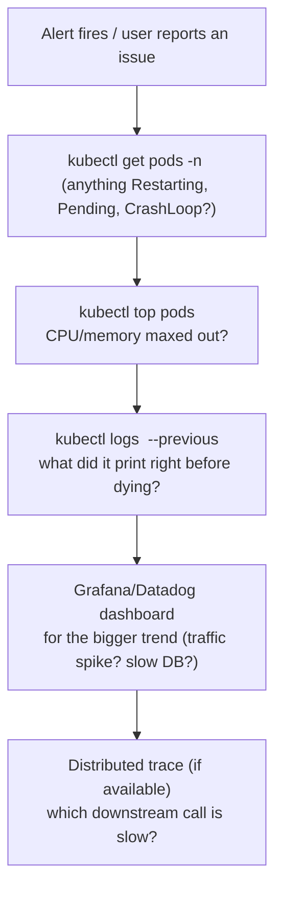

Other symptoms lead you in on a different foot - an HTTP error-rate spike usually starts at metrics/logs/traces and only drops down to `kubectl` state if those don't explain it; Pods stuck `Pending` start at `describe`/events/node resources instead; a service that just can't be reached starts at the Service/EndpointSlice/readiness chain from §2. Treat the diagram above as one common path, not the only one.

In real companies, `kubectl` gives you the **cluster-level** picture (is it even running, is it resourced correctly), while a metrics/logging stack (Prometheus + Grafana, Datadog, ELK) gives you the **application-level** picture (request rates, error rates, latency percentiles). You need both instincts: `kubectl` answers "is Kubernetes doing what I told it to," dashboards answer "is my application actually healthy."

---

## 14. The real-world mistakes that cause the most incidents

This list is worth more than any other section here - most production fires trace back to one of these:

| Mistake | What happens | Fix |
|---|---|---|
| Using `:latest` as the image tag | You can't tell what's actually running; rollbacks become guesswork | Avoid `:latest` in production; prefer a version tag, or an image digest (`@sha256:...`) for true immutability |
| No `resources.requests` | Scheduler packs Pods badly; one Pod starves its neighbors, and HPA math breaks | Always set requests, based on real observed usage |
| No memory `limit` | A leak in one Pod can take down the whole node | Always set a memory limit |
| No readiness probe | Every rollout causes a burst of user-facing errors | Add one, pointed at a real health check, not just "process is running" |
| ConfigMap/Secret changed but Pods not restarted | "I updated the config but nothing changed" | `kubectl rollout restart`, or mount as a volume instead of env var |
| Secrets committed to Git in plaintext YAML/Helm values | Credential leak, sometimes company-wide | Use a secrets manager + External Secrets Operator / Sealed Secrets |
| `maxUnavailable` too high for the service's needs | A bad deploy drops real capacity while it's rolling out | Set conservative rollout settings for the service's availability needs; `maxUnavailable: 0` is a common choice for critical user-facing services |
| No PodDisruptionBudget | A planned node drain/cluster upgrade can voluntarily evict every replica at once (it won't help against a node crash - that's involuntary) | Set `minAvailable` on replicated, uptime-sensitive services |
| No NetworkPolicy | Any Pod can reach any other Pod/namespace - one compromised service can pivot cluster-wide | Default-deny per namespace, then explicitly allow needed paths |
| Debugging live in production without checking for a recent deploy first | Incident drags on while a bad rollout keeps causing damage | If the incident correlates with a recent deployment, roll back quickly, then investigate; if it doesn't correlate, rolling back won't fix it |
| ClusterRoleBinding "just to make it easier" | Blast radius of a mistake or breach is the whole cluster | Scope RBAC to a namespace with the minimum verbs needed |

---

## The mental model

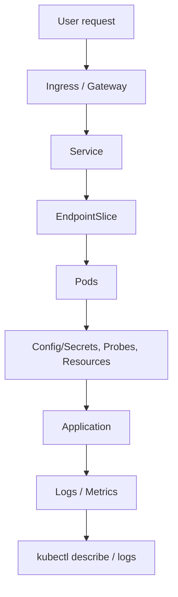

A **Deployment** keeps your app's Pods alive and handles rolling out new versions; a **Service**, backed by an **EndpointSlice**, gives those Pods one stable address; an **Ingress** (or increasingly, a **Gateway**) lets the outside world reach that Service over HTTP; **ConfigMaps/Secrets** inject configuration without rebuilding the image; **requests/limits**, **probes**, and **graceful shutdown** are what make the whole thing *reliable* instead of just *running*. Beyond that: an **HPA** adjusts replica count to real load, a **PodDisruptionBudget** limits voluntary evictions during maintenance, topology spread keeps you from losing every replica to one bad node, and a **NetworkPolicy** keeps Pods from talking to things they shouldn't. **Helm** is how most of this YAML actually gets written and shipped across environments in practice. And **`kubectl describe` + `logs`** (or `get endpointslice` when traffic just isn't arriving) is where you go first every single time something breaks. Everything else in Kubernetes exists to support this loop at scale.
