# Kubernetes Architecture & Communication Flow

> **Mental-model guide:** Don't memorize Kubernetes as a list of components. Learn to **see what happens inside the cluster** when you type `kubectl apply`, when a Pod is scheduled, when traffic reaches a Service, and when something fails.
>
> **CKAD focus:** You do not need to administer the control plane. You need enough architecture knowledge to predict what Kubernetes will do and to know where to look when something is not working.

---

## 1. The Big Picture

Kubernetes separates **cluster-wide decision making** from **workload execution on nodes**.

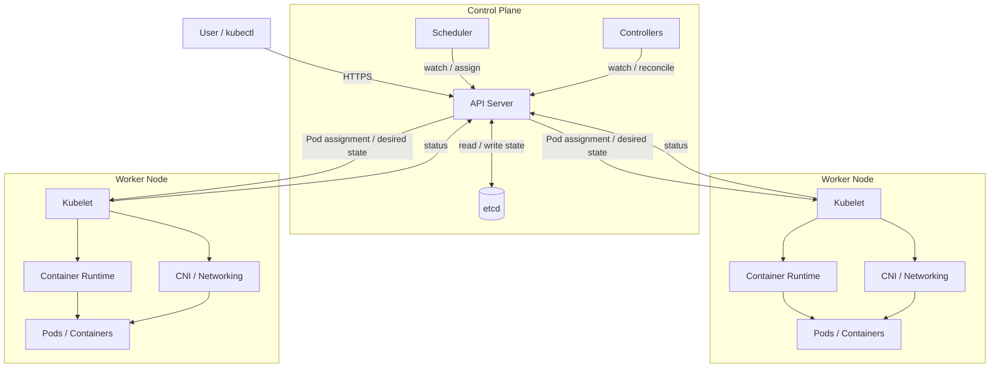

### Component responsibilities

| Component | Where | Main responsibility |
|---|---|---|
| **API Server** | Control plane | Kubernetes API, authentication, authorization, admission, coordination |
| **etcd** | Control plane | Durable cluster state |
| **Scheduler** | Control plane | Chooses a node for an unscheduled Pod |
| **Controllers** | Control plane | Continuously reconcile desired and observed state |
| **Kubelet** | Worker node | Makes Pods assigned to its node actually run |
| **Container Runtime** | Worker node | Pulls images and creates/runs containers |
| **CNI / networking** | Worker node | Configures Pod networking |
| **Service routing** | Cluster/node networking | Routes Service traffic toward selected endpoints |
| **CoreDNS** | Usually a cluster workload | Resolves Kubernetes DNS names |

### The architecture in one sentence

> **You declare desired state → the API Server records it → controllers and the scheduler coordinate what should happen → the Kubelet makes assigned Pods real → status flows back → reconciliation continues.**

---

## 2. The Core Mental Model: Desired State → Reconciliation

Kubernetes is fundamentally **declarative**.

If a Deployment says:

```yaml
spec:
  replicas: 3
```

you are saying:

> **There should be three replicas.**

You are not telling Kubernetes the individual steps required to create them.

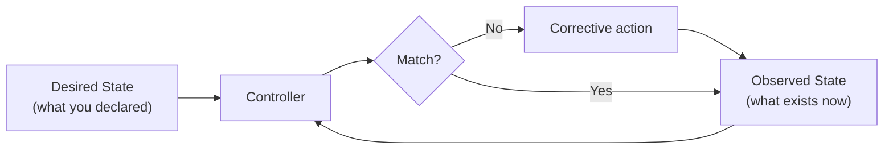

The same pattern appears throughout Kubernetes:

```text
Observe → Compare → Act → Observe again
```

This explains:

- Deployments maintaining replicas
- ReplicaSets maintaining Pods
- Jobs maintaining completions
- EndpointSlices tracking Service backends
- node health handling
- self-healing after failures

### Why reconciliation matters

A controller does not simply run once.

If a Deployment wants 3 Pods and one disappears:

```text
Desired: 3
Actual:  2
   ↓
Controller detects drift
   ↓
Replacement Pod
   ↓
Actual moves toward 3
```

The controller's job is **ensure**, not simply **create once**.

---

## 3. The API Server — Kubernetes' Front Door

The API Server is the central interface through which Kubernetes components and clients interact with cluster state.

A request such as:

```bash
kubectl apply -f deployment.yaml
```

goes through the API Server.

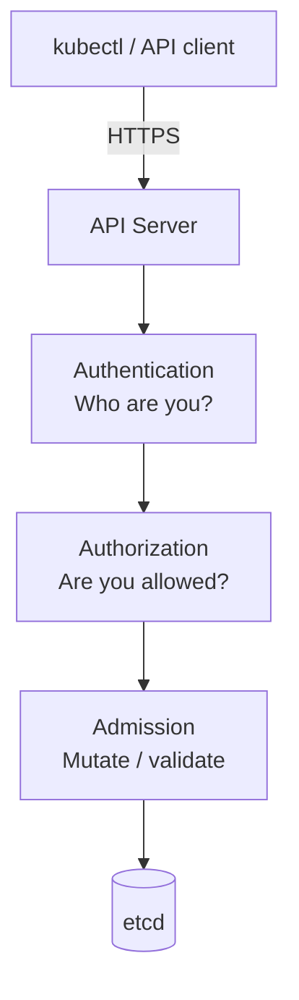

### The three important checks

| Stage | Question |
|---|---|
| **Authentication** | Who is making this request? |
| **Authorization** | Is this identity allowed to perform this action? |
| **Admission** | Should the object be mutated or rejected before persistence? |

A successful `kubectl apply` means the API Server accepted the request. It **does not necessarily mean the workload is already running**.

That distinction is important:

```text
API request accepted
        ≠
Pod already running
```

The rest of the process is asynchronous reconciliation.

### Keep this distinction clear

> **API Server = interface and coordination point**
>
> **etcd = persistent storage**

Application traffic between Pods does **not** go through the API Server.

---

## 4. etcd — The Cluster's Persistent State

`etcd` is a distributed, consistent key-value store used to persist Kubernetes cluster state.

Conceptually:

```text
Client / Component
        ↓
   API Server
        ↓
       etcd
```

State represented in the cluster includes objects such as:

- Deployments
- Pods
- Services
- ConfigMaps
- Secrets
- Nodes
- RBAC objects
- desired configuration
- observed status

For CKAD, remember:

> **The API Server is the Kubernetes API. etcd is where cluster state is persisted.**

You normally interact with etcd indirectly through the API Server.

---

## 5. Controllers — The Reconciliation Engines

Controllers continuously watch relevant Kubernetes resources and act when observed state differs from desired state.

Examples:

| Controller | Main responsibility |
|---|---|
| **Deployment controller** | Manages Deployments and their ReplicaSets |
| **ReplicaSet controller** | Maintains the desired number of matching Pods |
| **Job controller** | Tracks Job completions and retries |
| **Node controller** | Reacts to node health changes |
| **EndpointSlice controller** | Keeps Service endpoint information current |

A controller's generic pattern is:

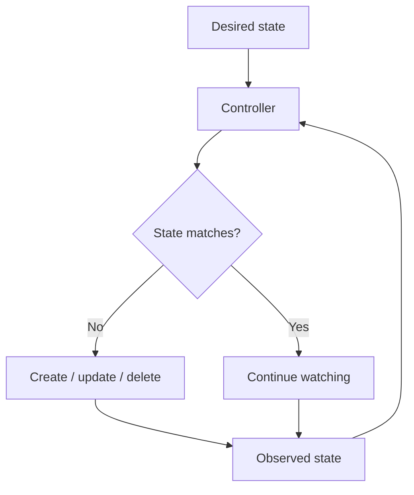

### Deployment example

```text
Deployment
    ↓
Deployment Controller
    ↓
ReplicaSet
    ↓
Pods
```

The controller does not directly start a Linux process. It manages Kubernetes objects. Node-level execution happens later through the scheduler, Kubelet, runtime, and networking components.

---

## 6. Scheduler — Deciding *Where*

A newly created Pod may exist without a node assignment.

The scheduler watches for such Pods and chooses an appropriate node.

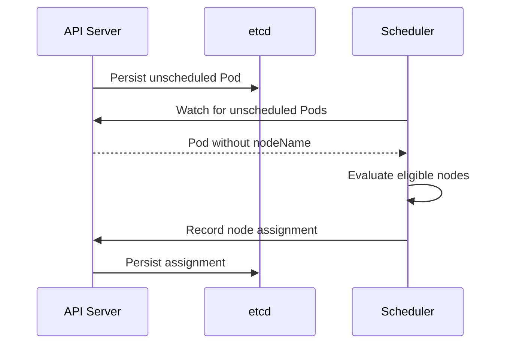

The scheduler considers constraints such as:

- resource requests
- node selectors
- node affinity / anti-affinity
- taints and tolerations
- topology-related constraints

### The key distinction

> **Scheduler = decides WHERE.**
>
> **Kubelet = makes the Pod run THERE.**

The scheduler does not start containers and does not directly command the Kubelet.

Its decision is represented in Kubernetes state through the API Server.

---

## 7. Kubelet — Making the Decision Real

The Kubelet runs on each worker node.

Its responsibility is local:

> **Make the Pods assigned to this node run and remain in the expected state.**

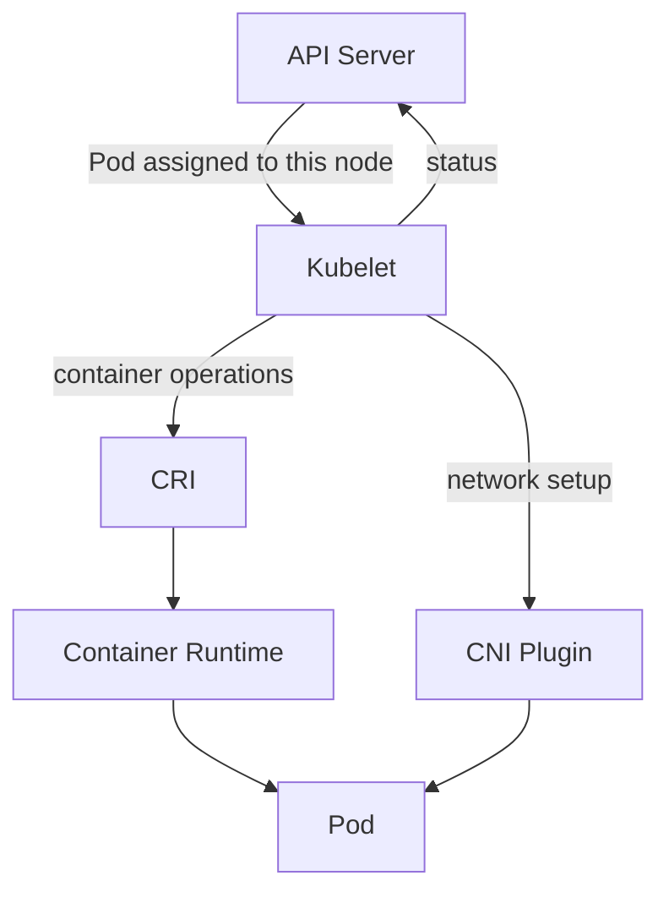

The Kubelet:

- watches for Pods assigned to its node
- asks the runtime to pull images and manage containers
- works with networking components to configure Pod networking
- monitors container/Pod health
- reports status through the API Server

### Important distinction

```text
Scheduler
  → selects a node

Kubelet
  → manages assigned Pods on that node

Runtime
  → actually runs containers
```

---

## 8. Container Runtime and CRI

Kubernetes does not directly implement the low-level mechanics of starting a container.

The Kubelet communicates with a container runtime through the **Container Runtime Interface (CRI)**.

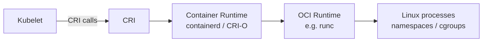

### Division of responsibility

- **Kubelet** — Kubernetes-aware node agent
- **CRI** — standard interface/contract
- **Container runtime** — pulls images and manages containers
- **OCI runtime** — performs low-level container execution

For CKAD, you mainly need to know:

> **Kubelet manages Pods; the runtime manages containers.**

---

## 9. Pod Creation — End to End

This is the most important architecture flow to understand.

Suppose you run:

```bash
kubectl apply -f deployment.yaml
```

The simplified lifecycle is:

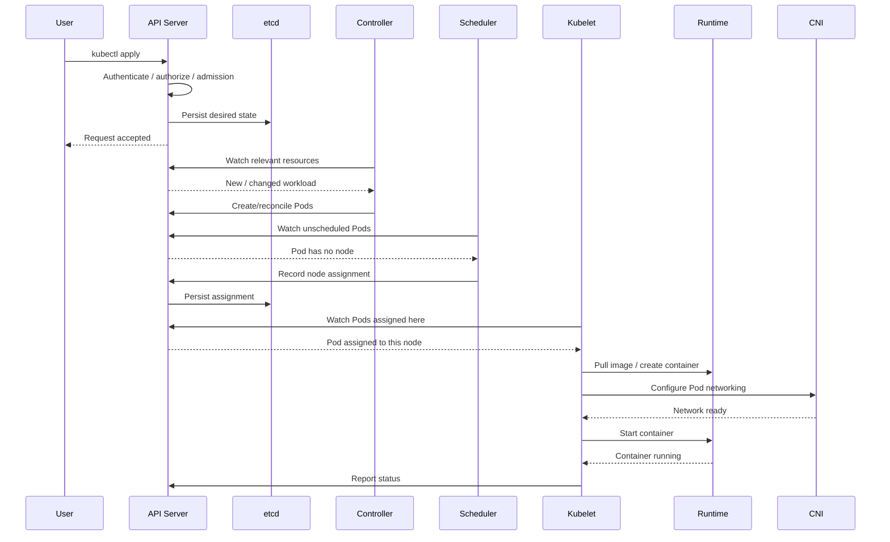

### Walk through the flow

1. **You submit desired state.**
2. **API Server authenticates, authorizes, and admission-processes the request.**
3. **The desired objects are persisted.**
4. **Controllers react to the new state.**
5. **Pods are created but initially may be unscheduled.**
6. **Scheduler selects a node.**
7. **The chosen node's Kubelet notices the assignment.**
8. **Kubelet asks the runtime to create/start containers.**
9. **Networking is configured through CNI.**
10. **Kubelet reports observed status back through the API Server.**
11. **Controllers continue watching and reconciling.**

### The architecture pattern

Most control-plane coordination looks like:

```text
Component
    ↕
API Server
```

The main node-local execution paths are:

```text
Kubelet → Container Runtime
Kubelet → CNI
```

That distinction is extremely useful when troubleshooting.

---

## 10. Pod Networking

Pods receive network connectivity through the cluster's networking implementation.

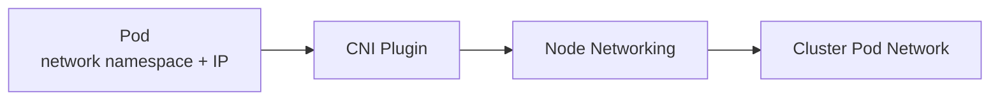

Conceptually:

```text
Pod A
  ↓
Node A networking
  ↓
Cluster network
  ↓
Node B networking
  ↓
Pod B
```

The exact packet path depends on the CNI/networking implementation.

### What to remember

- **Pod IP** → network endpoint for the Pod
- **CNI** → configures Pod networking
- **Service** → stable access to a changing set of Pods

The networking implementation can use different mechanisms, but Kubernetes relies on the resulting cluster networking behavior rather than one particular implementation.

---

## 11. Services and Service Discovery

Pods are replaceable. Their IP addresses can change.

A Service provides a stable virtual endpoint for a selected set of Pods.

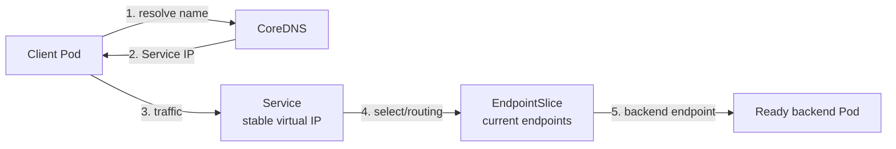

Think:

> **Service = stable identity/access**
>
> **Pod = ephemeral workload**

### EndpointSlices

EndpointSlices represent current endpoints associated with a Service.

The relationship is:

```text
Service selector
      ↓
Matching Pods
      ↓
EndpointSlice state
      ↓
Service traffic
```

The EndpointSlice controller keeps this information current as Pods are created, deleted, or become Ready/NotReady.

---

## 12. DNS — How Names Become Service Addresses

CoreDNS provides Kubernetes DNS-based service discovery.

A simplified flow:

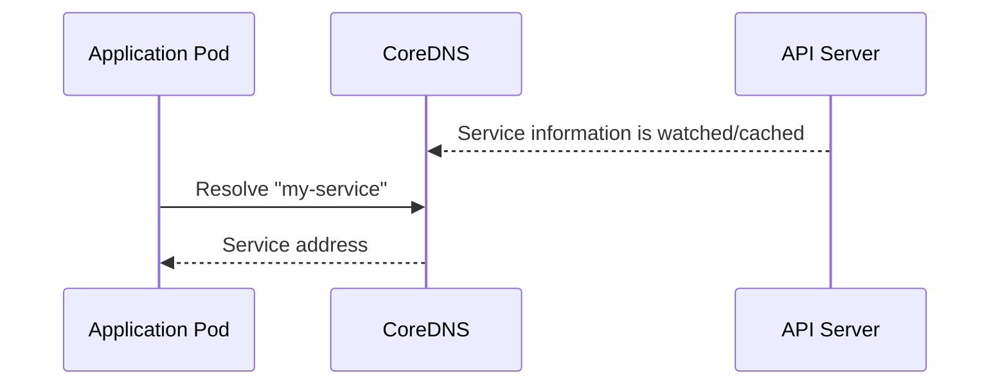

Common Service DNS forms:

| Name | Meaning |
|---|---|
| `my-service` | Same namespace |
| `my-service.namespace` | Specific namespace |
| `my-service.namespace.svc` | Explicit Service DNS form |
| `my-service.namespace.svc.cluster.local` | Fully qualified form in the common cluster domain |

The exact cluster DNS domain can vary.

### Keep DNS and Service responsibilities separate

```text
CoreDNS
  → helps resolve the Service name

Service
  → provides stable access to backend Pods
```

---

## 13. External Traffic

There are several common ways traffic can enter a cluster.

### NodePort

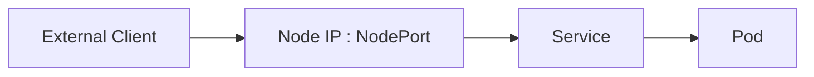

### LoadBalancer

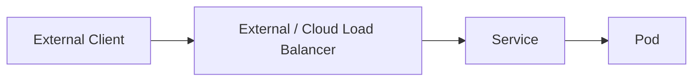

### Ingress / Gateway

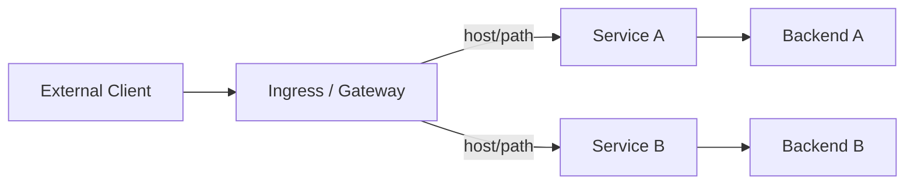

### Comparison

| Mechanism | Main idea |
|---|---|
| **ClusterIP** | Internal stable Service endpoint |
| **NodePort** | Expose a Service through a port on nodes |
| **LoadBalancer** | Integrate a Service with an external load-balancing mechanism |
| **Ingress** | HTTP/HTTPS routing to Services |
| **Gateway API** | Broader, extensible traffic-routing model |

The exact infrastructure behind external load balancing depends on the environment.

---

## 14. Pod Lifecycle and Failure

A Pod can move through phases such as:

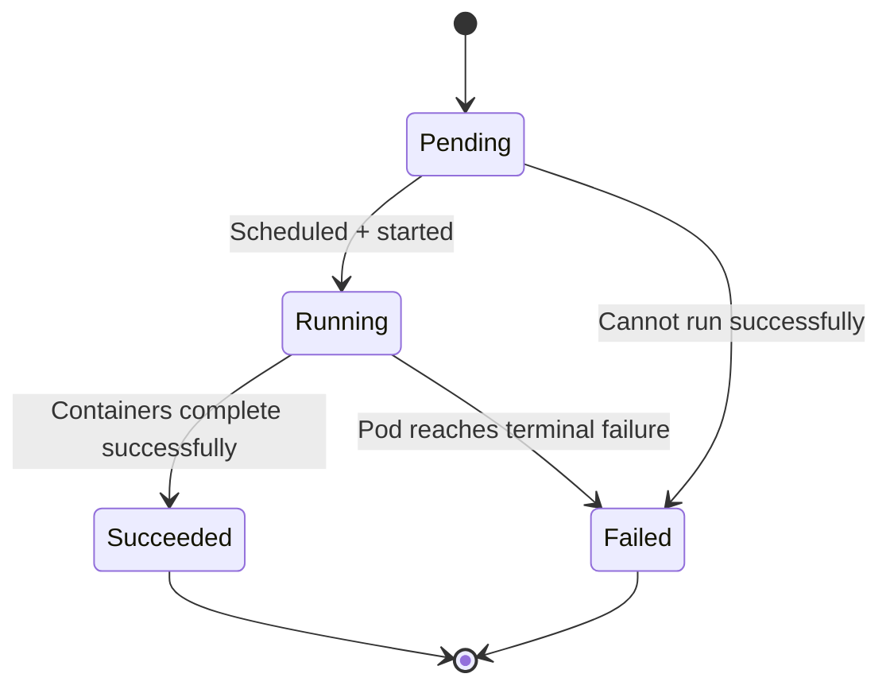

For CKAD, don't confuse **Pod lifecycle** with **controller reconciliation**.

### Container failure

If a container inside a Pod fails, the Kubelet handles the local container lifecycle according to the Pod's restart policy.

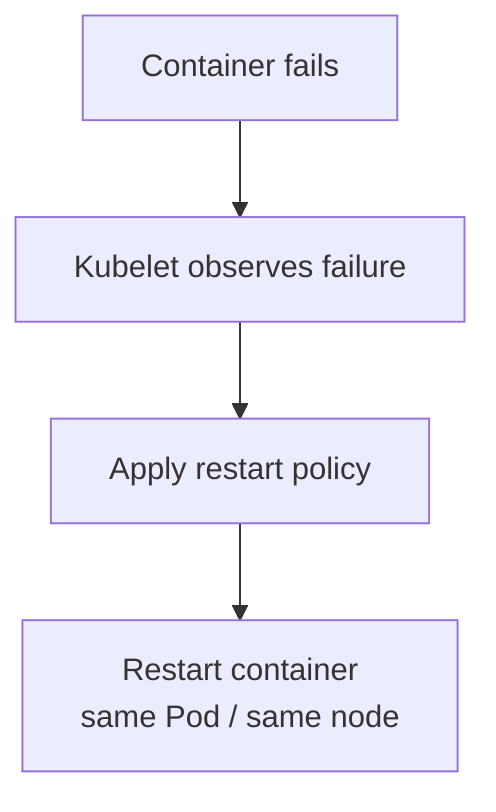

A container restart does not automatically mean a new Pod is scheduled.

### Pod disappearance

If a controller-managed Pod disappears:

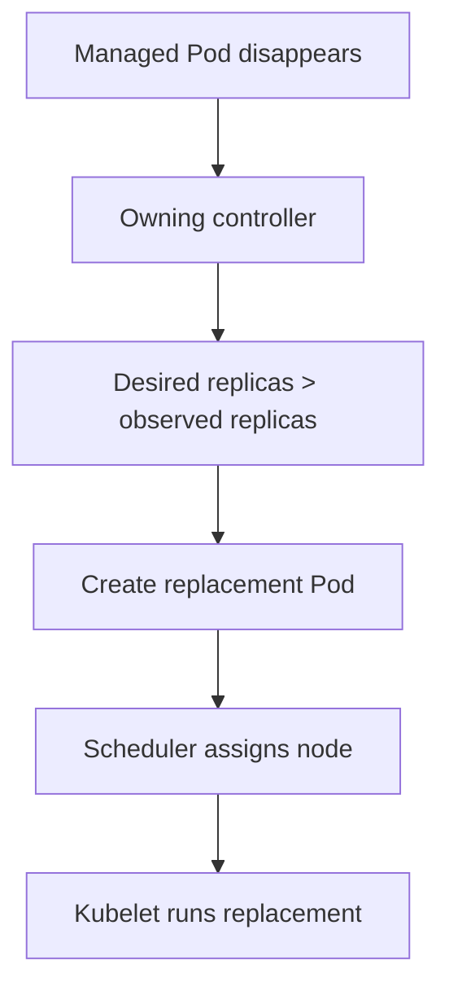

The replacement is a **new Pod object**, not the old Pod returning.

### Node failure

Node failure is another reconciliation scenario:

```text
Node stops responding
       ↓
Cluster detects node health problem
       ↓
Node becomes NotReady
       ↓
Affected workloads are handled according to failure/eviction behavior
       ↓
Owning controllers reconcile missing Pods
       ↓
Replacement Pods can be scheduled on healthy nodes
```

The exact timing depends on cluster configuration and failure-detection/eviction settings.

A **bare Pod** with no owning controller has no controller maintaining a desired replica count for it.

---

## 15. Watch-Based Communication

A major Kubernetes pattern is **watching for changes** rather than repeatedly polling for them.

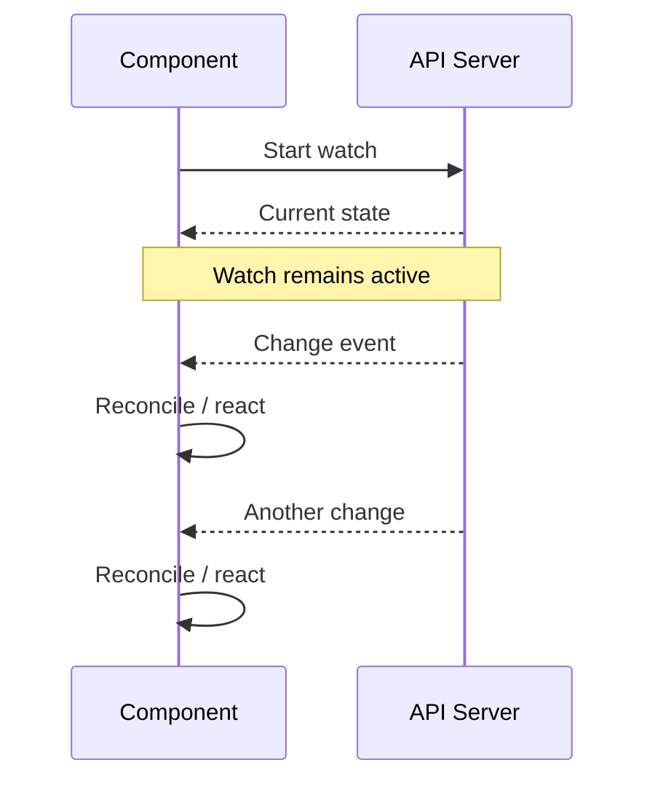

Examples:

| Component | Watches / reacts to |
|---|---|
| **Scheduler** | Unscheduled Pods |
| **Controllers** | Resources they reconcile |
| **Kubelet** | Pods assigned to its node |
| **EndpointSlice controller** | Services and matching Pods |
| **CoreDNS** | Kubernetes Service information |

The important mental model is:

> Each component watches the portion of cluster state relevant to its own responsibility.

---

## 16. Who Talks to Whom?

| Component | Main interaction | Purpose |
|---|---|---|
| `kubectl` / API client | API Server | Read/write Kubernetes resources |
| API Server | etcd | Persist/read cluster state |
| Scheduler | API Server | Watch unscheduled Pods; record placement |
| Controllers | API Server | Watch and reconcile resources |
| Kubelet | API Server | Observe assigned Pods; report status |
| Kubelet | Container Runtime | Create/start/stop containers through CRI |
| Kubelet | CNI | Configure Pod networking |
| EndpointSlice controller | API Server | Maintain Service endpoint state |
| CoreDNS | Cluster/API state | Provide DNS service discovery |
| Application Pod | CoreDNS | Resolve Service names |
| Application Pod | Service | Send traffic to stable Service endpoint |

### The architecture pattern

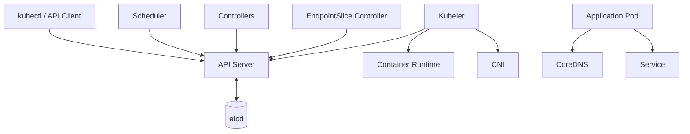

The API Server is the main coordination hub. The notable execution paths outside that hub are primarily node-local, such as Kubelet ↔ runtime and Kubelet ↔ CNI.

---

## 17. Protocols and Interfaces — Quick Reference

| Mechanism | Between | Purpose |
|---|---|---|
| **HTTPS / REST** | Clients/components ↔ API Server | Kubernetes API communication |
| **Watch** | Components ↔ API Server | Efficient change notification |
| **gRPC via CRI** | Kubelet ↔ container runtime | Container lifecycle operations |
| **CNI** | Kubelet ↔ networking plugin | Pod network setup |
| **DNS** | Pod ↔ CoreDNS | Name resolution |
| **TCP/IP** | Application endpoints | Actual application traffic |

### CRI and CNI are interfaces

They are **contracts**, not specific products.

For example:

```text
Kubelet
   ↓
CRI
   ↓
containerd / CRI-O
```

and:

```text
Kubelet
   ↓
CNI
   ↓
chosen networking implementation
```

This separation allows implementations to vary without changing the Kubernetes API model.

---

## 18. One Complete Deployment + Service Scenario

Consider:

```bash
kubectl apply -f deployment.yaml
```

where the manifest creates:

- a Deployment with 3 replicas
- a Service selecting those Pods

The complete mental model is:

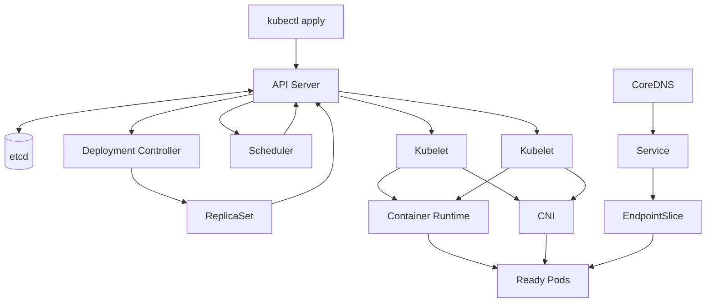

### In chronological order

1. You submit the Deployment and Service to the API Server.
2. The API Server validates/admission-processes and persists them.
3. The Deployment controller notices the Deployment.
4. The controller establishes the ReplicaSet needed for the desired replicas.
5. The ReplicaSet controller creates the required Pod objects.
6. The scheduler notices unscheduled Pods and assigns nodes.
7. Kubelets on those nodes notice their assigned Pods.
8. Kubelets ask the runtime to create/start containers.
9. CNI configures Pod networking.
10. Kubelets report status.
11. EndpointSlice state is updated as appropriate Pods become eligible backends.
12. CoreDNS provides Service-name resolution.
13. A client sends traffic to the Service's stable endpoint.
14. Service routing directs traffic toward an appropriate backend Pod.
15. Controllers continue watching and reconciling the system.

The same architecture explains both **creation** and **recovery**.

---

## 19. A Practical Troubleshooting Map

When something doesn't work, use the architecture to ask where the flow stopped.

```mermaid
flowchart TD
    Start["Workload not behaving as expected"]
    API["Was the API object accepted?"]
    Controller["Did the expected controller create/reconcile objects?"]
    Schedule["Was the Pod scheduled?"]
    Node["Did the Kubelet/runtime start it?"]
    Network["Is networking / Service / DNS correct?"]
    Status["Inspect status, events, logs, and conditions"]

    Start --> API
    API -->|"No"| Status
    API -->|"Yes"| Controller
    Controller -->|"No"| Status
    Controller -->|"Yes"| Schedule
    Schedule -->|"No"| Status
    Schedule -->|"Yes"| Node
    Node -->|"No"| Status
    Node -->|"Yes"| Network
    Network -->|"No"| Status
    Network -->|"Yes"| Status
```

### Five questions to remember

1. **Did the API Server accept the desired state?**
2. **Did the controller create the expected objects?**
3. **Did the scheduler assign a node?**
4. **Did the Kubelet/runtime create the workload?**
5. **Is networking, Service selection, or DNS preventing access?**

This turns architecture knowledge into a troubleshooting workflow.

---

## 20. Don't Confuse These

### API Server vs. etcd

```text
API Server = Kubernetes API / coordination interface
etcd       = persistent cluster-state storage
```

### Controller vs. Scheduler

```text
Controller = continuously maintains desired state
Scheduler  = chooses a node for an unscheduled Pod
```

### Scheduler vs. Kubelet

```text
Scheduler = decides WHERE
Kubelet   = makes it run THERE
```

### Kubelet vs. Runtime

```text
Kubelet  = Kubernetes-aware node agent
Runtime  = actually runs containers
```

### Service vs. Pod

```text
Service = stable virtual network identity
Pod     = ephemeral workload instance
```

### Service vs. Ingress/Gateway

```text
Service         = stable access to a backend set
Ingress/Gateway = routing layer that can direct traffic to Services
```

---

## 21. Architecture in Layers

A compact way to visualize the responsibilities:

```mermaid
flowchart TB
    L1["1. Client<br/>kubectl / API client"]
    L2["2. API<br/>API Server"]
    L3["3. State<br/>etcd"]
    L4["4. Control Logic<br/>Controllers + Scheduler"]
    L5["5. Node Management<br/>Kubelet"]
    L6["6. Execution<br/>Container Runtime"]
    L7["7. Networking<br/>CNI + Service + DNS"]
    L8["8. Workloads<br/>Pods + Containers"]

    L1 --> L2
    L2 --> L3
    L2 --> L4
    L4 --> L5
    L5 --> L6
    L5 --> L7
    L6 --> L8
    L7 --> L8
    L8 -.->|"observed status"| L2
    L4 -.->|"continuous reconciliation"| L8
```

Think of the system as two broad directions:

```text
Intent / desired state
        ↓
API → State → Control → Node → Workload

Observed state
        ↑
Workload → Node → API → State
```

---

## 22. CKAD Architecture Cheat Sheet

### Pod creation

```text
kubectl
  ↓
API Server
  ↓
Persist state
  ↓
Controller
  ↓
Pod
  ↓
Scheduler
  ↓
Node assignment
  ↓
Kubelet
  ↓
Runtime + CNI
  ↓
Running Pod
```

### Reconciliation

```text
Desired state
      ↓
Observe
      ↓
Compare
      ↓
Correct
      ↓
Observe again
```

### Deployment

```text
Deployment
    ↓
ReplicaSet
    ↓
Pods
```

### Networking

```text
Pod → Service → Ready backend Pod
```

### DNS

```text
Pod → CoreDNS → Service name → Service address
```

### Responsibility map

| Component | Remember this |
|---|---|
| **API Server** | API + coordination |
| **etcd** | Persistent cluster state |
| **Controllers** | Reconcile desired state |
| **Scheduler** | Choose node |
| **Kubelet** | Manage assigned Pods |
| **Runtime** | Run containers |
| **CNI** | Configure Pod networking |
| **Service** | Stable access to Pods |
| **EndpointSlice** | Current Service endpoints |
| **CoreDNS** | DNS service discovery |

### The one mental model to carry into CKAD

```text
Request
  ↓
API Server
  ↓
Desired state
  ↓
Controllers / Scheduler
  ↓
Kubelet
  ↓
Runtime + CNI
  ↓
Pod
  ↓
Service / DNS
  ↓
Observed status
  ↓
Reconciliation continues
```

If you can explain **what happens, in order, when `kubectl apply` creates a workload**, and you can identify whether a problem is at the **API, reconciliation, scheduling, node execution, or networking** layer, you have the architecture foundation needed to reason through CKAD tasks.
